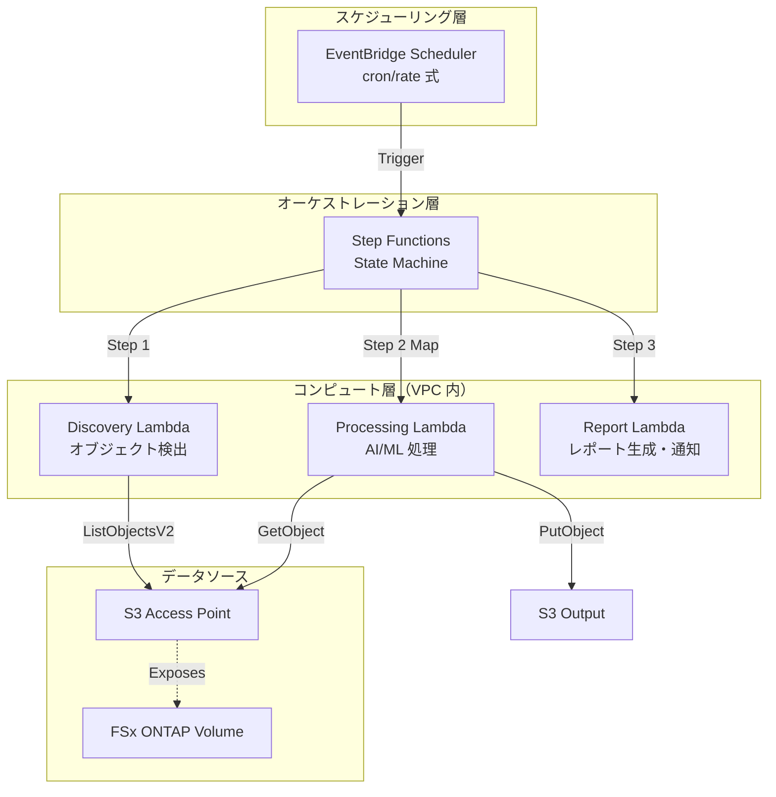

# FSx for NetApp ONTAP の S3 Access Points で実現する業界別サーバーレス自動化パターン

---
title: FSx for NetApp ONTAP の S3 Access Points で実現する業界別サーバーレス自動化パターン
published: false
description: FSx ONTAP の S3 Access Points を活用し、Lambda + Step Functions で業界別データ処理を自動化する 5 つのサーバーレスパターンを紹介します。
tags: aws, serverless, fsxontap, python
---

## はじめに

エンタープライズのファイルサーバーに蓄積されたデータを、クラウドネイティブなサーバーレスアーキテクチャで自動処理したい。しかし、従来の NFS/CIFS ファイルサーバーと AWS のサーバーレスサービスの間には大きなギャップがありました。

**Amazon FSx for NetApp ONTAP の S3 Access Points** は、このギャップを埋める画期的な機能です。ONTAP ボリュームに保存されたファイルを S3 互換 API で直接アクセスできるため、Lambda や Step Functions などのサーバーレスサービスから、ファイルサーバーのデータをシームレスに処理できます。

本記事では、この S3 Access Points を活用した **5 つの業界別サーバーレス自動化パターン** を紹介します。

## 背景: なぜ S3 Access Points なのか

### 従来の課題

FSx for NetApp ONTAP は、エンタープライズ向けの高機能ファイルストレージです。NTFS ACL、CIFS 共有、NFS エクスポート、SnapMirror レプリケーションなど、オンプレミスの NetApp と同等の機能を AWS 上で提供します。

しかし、Lambda などのサーバーレスサービスから FSx ONTAP のデータにアクセスするには、以下の課題がありました:

- **NFS/CIFS マウント不可**: Lambda は EFS マウントは可能ですが、FSx ONTAP の NFS/CIFS を直接マウントできない
- **VPC 内実行の制約**: FSx ONTAP にアクセスするには Lambda を VPC 内で実行する必要がある
- **データ転送のオーバーヘッド**: 一度 S3 にコピーしてから処理する二段階アプローチが必要だった

### S3 Access Points による解決

S3 Access Points を有効化すると、ONTAP ボリュームのデータに S3 API（`ListObjectsV2`、`GetObject`、`PutObject` 等）で直接アクセスできます。

```
Lambda → S3 API (ListObjectsV2/GetObject) → S3 Access Point → FSx ONTAP Volume
```

これにより、Lambda から FSx ONTAP のデータを直接読み書きでき、サーバーレスパイプラインの構築が大幅に簡素化されます。

### 制約事項: ポーリングベース設計

ただし、S3 Access Points には重要な制約があります。`GetBucketNotificationConfiguration` が非対応のため、S3 イベント通知（EventBridge / Lambda トリガー）が使えません。

そのため、本パターン集では **EventBridge Scheduler + Step Functions によるポーリングベースアーキテクチャ** を採用しています。

## アーキテクチャ概要

### 全体構成



### 共通ワークフローパターン

全 5 ユースケースは、以下の共通パターンに従います:

1. **EventBridge Scheduler** が定期的に Step Functions を起動
2. **Discovery Lambda** が S3 AP 経由でオブジェクト一覧を取得し、Manifest JSON を生成
3. **Step Functions Map State** が Manifest 内の各オブジェクトを並列処理
4. **Processing Lambda** が AI/ML サービス（Textract, Comprehend, Rekognition, Bedrock 等）でデータを処理
5. **Report/Notification** で結果を S3 出力 + SNS 通知

## 設計判断

### 1. 共通モジュールの分離

全ユースケースで共通する ONTAP REST API クライアント、FSx API ヘルパー、S3 AP ヘルパーを `shared/` ディレクトリに分離しました。

```
shared/
├── ontap_client.py    # ONTAP REST API クライアント
├── fsx_helper.py      # AWS FSx API ヘルパー
├── s3ap_helper.py     # S3 Access Point ヘルパー
├── exceptions.py      # 共通例外・エラーハンドラ
└── discovery_handler.py  # 共通 Discovery Lambda テンプレート
```

**OntapClient** は Secrets Manager 認証、urllib3 PoolManager、TLS 検証、リトライ機能を備えた堅牢な REST API クライアントです。

**S3ApHelper** は S3 AP の Alias/ARN 両形式に対応し、自動ページネーション + サフィックスフィルタを提供します。

### 2. コスト最適化: オプショナルリソース設計

CloudFormation テンプレートでは、高コストの常時稼働リソースをオプショナル化しています。

| リソース | 月額固定費 | デフォルト |
|---------|-----------|----------|
| Interface VPC Endpoints（4個） | ~$28.80 | **無効**（opt-in） |
| CloudWatch Alarms | ~$0.10/アラーム | **無効**（opt-in） |
| S3 Gateway VPC Endpoint | 無料 | **有効** |

これにより、デモ/PoC 環境では **月額 ~$1〜$3** で全パターンを試すことができます。本番環境では `EnableVpcEndpoints=true` を設定してセキュアなプライベート接続を確保します。

### 3. セキュリティファースト

- **TLS 検証デフォルト有効**: OntapClient は `verify_ssl=True` がデフォルト
- **最小権限 IAM**: 各 Lambda 関数に必要最小限の IAM ロールを付与
- **KMS 暗号化**: S3 出力バケットは SSE-KMS で暗号化
- **VPC 内実行**: Lambda は VPC 内で実行し、VPC Endpoints 経由で AWS サービスにアクセス

### 4. エラーハンドリング戦略

3 層のエラーハンドリングを実装しています:

- **Layer 1（共通モジュール）**: カスタム例外クラス + urllib3/boto3 リトライ
- **Layer 2（Step Functions）**: Retry/Catch ブロックによる自動リトライ
- **Layer 3（ワークフロー）**: Map State 内の個別失敗は他のアイテムに影響しない

```python
# lambda_error_handler デコレータ
@lambda_error_handler
def handler(event, context):
    # 未処理例外は自動的にキャッチされ、
    # スタックトレースのログ出力 + 構造化エラーレスポンスを返す
    ...
```

## 5 つのユースケース

### UC1: 法務・コンプライアンス — ファイルサーバー監査

ONTAP REST API で NTFS ACL 情報を自動収集し、Athena SQL で過剰権限や陳腐化アクセスを検出。Bedrock で自然言語コンプライアンスレポートを生成します。

**使用サービス**: Athena, Glue Data Catalog, Bedrock

### UC2: 金融・保険 — 契約書・請求書の自動処理

PDF/TIFF/JPEG ドキュメントを Textract で OCR 処理し、Comprehend でエンティティ抽出、Bedrock で構造化サマリーを生成します。

**使用サービス**: Textract, Comprehend, Bedrock

### UC3: 製造業 — IoT センサーログ・品質検査画像の分析

CSV センサーログを Parquet に変換して Athena で異常検出。検査画像は Rekognition で欠陥検出し、信頼度が閾値未満の場合は手動レビューフラグを設定します。

**使用サービス**: Athena, Glue Data Catalog, Rekognition

### UC4: メディア — VFX レンダリングパイプライン

レンダリング対象アセットを検出し、AWS Deadline Cloud にジョブを送信。Rekognition で品質チェックを行い、合格時は S3 AP 経由で FSx ONTAP に書き戻します。

**使用サービス**: Deadline Cloud, Rekognition

### UC5: 医療 — DICOM 画像の自動分類・匿名化

DICOM メタデータを解析して分類し、Rekognition で画像内の焼き込み PII を検出。Comprehend Medical で PHI を除去して匿名化 DICOM を出力します。

**使用サービス**: Rekognition, Comprehend Medical

## デプロイ手順

### 前提条件

- AWS アカウント
- FSx for NetApp ONTAP（ONTAP 9.17.1P4D3 以上）
- S3 Access Point が有効化されたボリューム
- Python 3.12+、AWS CLI v2

### 手順

```bash
# 1. リポジトリのクローン
git clone https://github.com/<your-org>/fsxn-s3ap-serverless-patterns.git
cd fsxn-s3ap-serverless-patterns

# 2. 依存関係のインストール
pip install -r requirements.txt
pip install -r requirements-dev.txt

# 3. テストの実行
pytest shared/tests/ -v

# 4. ユースケースのデプロイ（例: UC1）
aws cloudformation deploy \
  --template-file legal-compliance/template.yaml \
  --stack-name fsxn-legal-compliance \
  --parameter-overrides \
    S3AccessPointAlias=<your-volume-ext-s3alias> \
    S3AccessPointOutputAlias=<your-output-volume-ext-s3alias> \
    OntapSecretName=<your-ontap-secret-name> \
    OntapManagementIp=<your-ontap-management-ip> \
    SvmUuid=<your-svm-uuid> \
    VolumeUuid=<your-volume-uuid> \
    VpcId=<your-vpc-id> \
    PrivateSubnetIds=<subnet-1>,<subnet-2> \
    NotificationEmail=<your-email@example.com> \
  --capabilities CAPABILITY_IAM CAPABILITY_AUTO_EXPAND \
  --region ap-northeast-1
```

> `<...>` のプレースホルダーを実際の環境値に置き換えてください。

## コスト構造

本パターン集のコスト構造は、リクエストベース（従量課金）と常時稼働（固定費）に分類されます。

### 環境別コスト概算

| 環境 | 固定費/月 | 変動費/月 | 合計/月 |
|------|----------|----------|--------|
| デモ/PoC | ~$0 | ~$1〜$3 | **~$1〜$3** |
| 本番（1 UC） | ~$29 | ~$1〜$3 | **~$30〜$32** |
| 本番（全 5 UC） | ~$29 | ~$5〜$15 | **~$34〜$44** |

最大の固定費は Interface VPC Endpoints（4 個で ~$28.80/月）ですが、これはオプショナル化しているため、デモ環境では無効にできます。

リクエストベースのサービス（Lambda, Step Functions, S3 API, AI/ML サービス）は使わなければ $0 なので、小規模なテストから安全に始められます。

## まとめ

FSx for NetApp ONTAP の S3 Access Points は、エンタープライズファイルサーバーとサーバーレスアーキテクチャの橋渡しをする強力な機能です。

本パターン集では、以下の設計原則に基づいて 5 つの業界別パターンを実装しました:

1. **ポーリングベース**: S3 AP の制約（イベント通知非対応）に対応した EventBridge Scheduler + Step Functions 設計
2. **共通モジュール分離**: OntapClient / FsxHelper / S3ApHelper の再利用
3. **コスト最適化**: 高コストリソースのオプショナル化（デモ ~$1〜$3/月）
4. **セキュリティファースト**: TLS デフォルト有効、最小権限 IAM、KMS 暗号化
5. **堅牢なエラーハンドリング**: 3 層のエラーハンドリング戦略

FSx ONTAP に蓄積されたエンタープライズデータを、AWS のサーバーレスサービスと AI/ML サービスで自動処理するパターンとして、ぜひ活用してください。

---

**リポジトリ**: [github.com/&lt;your-org&gt;/fsxn-s3ap-serverless-patterns](https://github.com/<your-org>/fsxn-s3ap-serverless-patterns)

**ライセンス**: MIT
