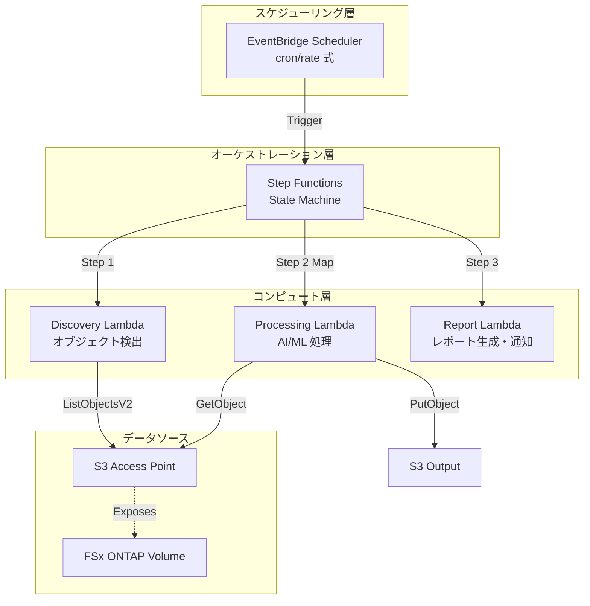

# FSx for NetApp ONTAP の S3 Access Points で実現する業界別サーバーレス自動化パターン

---
title: FSx for NetApp ONTAP の S3 Access Points で実現する業界別サーバーレス自動化パターン
published: false
description: FSx for NetApp ONTAP の S3 Access Points を活用し、Lambda + Step Functions で業界別データ処理を自動化する 5 つのサーバーレスパターンを紹介します。
tags: aws, serverless, fsxontap, python
canonical_url: https://github.com/Yoshiki0705/FSx-for-ONTAP-S3AccessPoints-Serverless-Patterns
---

## はじめに

エンタープライズのファイルサーバーに蓄積されたデータを、クラウドネイティブなサーバーレスアーキテクチャで自動処理したい。しかし、従来の NFS/CIFS ファイルサーバーと AWS のサーバーレスサービスの間には大きなギャップがありました。

**Amazon FSx for NetApp ONTAP の S3 Access Points** は、このギャップを埋める画期的な機能です。ONTAP ボリュームに保存されたファイルを S3 互換 API で直接アクセスできるため、Lambda や Step Functions などのサーバーレスサービスから、ファイルサーバーのデータをシームレスに処理できます。

本記事では、この S3 Access Points を活用した **5 つの業界別サーバーレス自動化パターン** と、**3 つの拡張パターン**（Bedrock Knowledge Bases RAG、Transfer Family SFTP、EMR Serverless Spark）を紹介します。一部ユースケースは AWS 環境で E2E 検証済みであり、その他も CloudFormation デプロイと主要コンポーネントの動作確認を実施しています。

> **本記事の位置づけ**: これは「設計判断を学ぶためのリファレンス実装」の解説記事です。PoC から本番環境への段階的な適用を想定し、コスト最適化、セキュリティ、エラーハンドリングの設計判断を具体的なコードで示すことを目的としています。

> 以降では、FSx for ONTAP S3 Access Points を簡潔に **S3 AP** と表記します。

## 背景: なぜ S3 Access Points なのか

### 従来の課題

FSx for NetApp ONTAP は、エンタープライズ向けの高機能ファイルストレージです。NTFS ACL、CIFS 共有、NFS エクスポート、SnapMirror レプリケーションなど、オンプレミスの NetApp と同等の機能を AWS 上で提供します。

しかし、Lambda などのサーバーレスサービスから FSx ONTAP のデータにアクセスするには、以下の課題がありました:

- **NFS/CIFS マウント不可**: Lambda は EFS マウントは可能ですが、FSx ONTAP の NFS/CIFS を直接マウントできない
- **VPC 内実行の制約**: FSx ONTAP にアクセスするには Lambda を VPC 内で実行する必要がある
- **データ転送のオーバーヘッド**: 一度 S3 にコピーしてから処理する二段階アプローチが必要だった

### S3 Access Points による解決

S3 Access Points を有効化すると、ONTAP ボリュームのデータに S3 API（`ListObjectsV2`、`GetObject`、`PutObject` 等）で直接アクセスできます。

```
Lambda → S3 API (ListObjectsV2/GetObject) → S3 Access Point → FSx ONTAP Volume
```

これにより、Lambda から FSx ONTAP のデータを直接読み書きでき、サーバーレスパイプラインの構築が大幅に簡素化されます。

### 制約事項: ポーリングベース設計

ただし、S3 Access Points には重要な制約があります。`GetBucketNotificationConfiguration` が非対応のため、S3 イベント通知（EventBridge / Lambda トリガー）が使えません。

そのため、本パターン集では **EventBridge Scheduler + Step Functions によるポーリングベースアーキテクチャ** を採用しています。

## アーキテクチャ概要

### 全体構成



### VPC 配置の最適化

検証を通じて得られた重要な設計判断として、**ONTAP REST API にアクセスする Lambda のみ VPC 内に配置**し、S3 AP 経由のみの Lambda は VPC 外で実行する設計を採用しています。

```
┌─────────────────────────────────────────────────────────┐
│ VPC 内 Lambda                                            │
│  - Discovery Lambda (ONTAP REST API + S3 AP)            │
│  - ACL Collection Lambda (ONTAP REST API)               │
│  → Secrets Manager / FSx API へのアクセスに VPC EP 必要   │
└─────────────────────────────────────────────────────────┘

┌─────────────────────────────────────────────────────────┐
│ VPC 外 Lambda                                            │
│  - Processing Lambda (S3 AP + AI/ML サービス)            │
│  - Report Lambda (S3 + SNS + Bedrock)                   │
│  → S3 AP (internet origin) に直接アクセス可能            │
│  → VPC Endpoint 不要でコスト削減                         │
└─────────────────────────────────────────────────────────┘
```

**メリット**:
- VPC Endpoint のコスト削減（Interface EP ~$28.80/月 → 不要）
- コールドスタート時間の短縮（VPC 外 Lambda は ENI 作成不要）
- AI/ML サービスへの直接アクセス（NAT Gateway 不要）

> **前提**: S3 AP の network origin が `internet` であること。`VPC` origin の場合は全 Lambda を VPC 内に配置する必要があります。

### Lambda 配置の選択指針

| 用途 | 推奨配置 | 理由 |
|------|---------|------|
| デモ / PoC | VPC 外 Lambda | VPC Endpoint 不要で低コスト・設定が簡単 |
| 本番 / 閉域要件あり | VPC 内 Lambda | Secrets Manager / FSx / SNS などを PrivateLink 経由で利用可能 |
| Athena / Glue 利用 UC | S3 AP network origin: `internet` | AWS マネージドサービスからのアクセスが必要 |

### S3 Access Point ネットワークオリジンの制約

S3 AP の network origin 設定は、アクセス可能なクライアントを決定します:

| ネットワークオリジン | Lambda (VPC 外) | Lambda (VPC 内) | Athena / Glue | 推奨 UC |
|-------------------|----------------|----------------|--------------|---------|
| **internet** | ✅ | ✅ (S3 Gateway EP 経由) | ✅ | UC1, UC3 (Athena 使用) |
| **VPC** | ❌ | ✅ (S3 Gateway EP 必須) | ❌ | UC2, UC4, UC5 (Athena 不使用) |

> **重要**: Athena / Glue は AWS マネージドインフラからアクセスするため、VPC origin の S3 AP にはアクセスできません。UC1（法務）と UC3（製造業）は Athena を使用するため、S3 AP は **internet** network origin で作成する必要があります。

### 共通ワークフローパターン

全 5 ユースケースは、以下の共通パターンに従います:

1. **EventBridge Scheduler** が定期的に Step Functions を起動
2. **Discovery Lambda** が S3 AP 経由でオブジェクト一覧を取得し、Manifest JSON を生成
3. **Step Functions Map State** が Manifest 内の各オブジェクトを並列処理
4. **Processing Lambda** が AI/ML サービス（Textract, Comprehend, Rekognition, Bedrock 等）でデータを処理
5. **Report/Notification** で結果を S3 出力 + SNS 通知

## 設計判断

### 1. 共通モジュールの分離

全ユースケースで共通する ONTAP REST API クライアント、FSx API ヘルパー、S3 AP ヘルパーを `shared/` ディレクトリに分離しました。

```
shared/
├── ontap_client.py    # ONTAP REST API クライアント
├── fsx_helper.py      # AWS FSx API ヘルパー
├── s3ap_helper.py     # S3 Access Point ヘルパー
├── exceptions.py      # 共通例外・エラーハンドラ
└── discovery_handler.py  # 共通 Discovery Lambda テンプレート
```

**OntapClient** は Secrets Manager 認証、urllib3 PoolManager、TLS 検証、リトライ機能を備えた堅牢な REST API クライアントです。

**S3ApHelper** は S3 AP の Alias/ARN 両形式に対応し、自動ページネーション + サフィックスフィルタを提供します。

### 2. コスト最適化: オプショナルリソース設計

CloudFormation テンプレートでは、高コストの常時稼働リソースをオプショナル化しています。

| リソース | 月額固定費 | デフォルト |
|---------|-----------|----------|
| Interface VPC Endpoints（4個） | ~$28.80 | **無効**（opt-in） |
| CloudWatch Alarms | ~$0.10/アラーム | **無効**（opt-in） |
| S3 Gateway VPC Endpoint | 無料 | **有効**（既存 EP がある場合は `false` に設定） |

これにより、デモ/PoC 環境では **月額 ~$1〜$3** で全パターンを試すことができます。本番環境では `EnableVpcEndpoints=true` を設定してセキュアなプライベート接続を確保します。

> **S3 Gateway VPC Endpoint** は追加の時間課金がないため、VPC 内 Lambda から S3 AP にアクセスする構成では有効化を推奨します。ただし、既存の S3 Gateway Endpoint がある場合や、PoC / デモ用途で Lambda を VPC 外に配置する場合は `EnableS3GatewayEndpoint=false` を指定してください。S3 API リクエストやデータ転送、各 AWS サービスの利用料金は通常どおり発生します。

### 3. セキュリティファースト

- **TLS 検証デフォルト有効**: OntapClient は `verify_ssl=True` がデフォルト
- **最小権限 IAM**: 各 Lambda 関数に必要最小限の IAM ロールを付与
- **KMS 暗号化**: S3 出力バケットは SSE-KMS で暗号化
- **VPC 内実行**: ONTAP API アクセスが必要な Lambda は VPC 内で実行

### 4. エラーハンドリング戦略

3 層のエラーハンドリングを実装しています:

- **Layer 1（共通モジュール）**: カスタム例外クラス + urllib3/boto3 リトライ
- **Layer 2（Step Functions）**: Retry/Catch ブロックによる自動リトライ
- **Layer 3（ワークフロー）**: Map State 内の個別失敗は他のアイテムに影響しない

```python
# lambda_error_handler デコレータ
@lambda_error_handler
def handler(event, context):
    # 未処理例外は自動的にキャッチされ、
    # スタックトレースのログ出力 + 構造化エラーレスポンスを返す
    ...
```

### 5. セキュリティと認可モデル

本ソリューションは複数の認可レイヤーを組み合わせています:

| レイヤー | 役割 |
|---------|------|
| **IAM** | AWS サービスと S3 Access Points へのアクセス制御 |
| **S3 Access Point** | S3 AP に関連付けられたファイルシステムユーザーを通じてアクセス境界を定義 |
| **ONTAP ファイルシステム** | ファイルレベルの権限を強制（UNIX / NTFS ACL） |
| **ONTAP REST API** | メタデータとコントロールプレーン操作のみ公開 |

重要なポイント:
- S3 API はファイルレベルの ACL を公開しません。ファイル権限情報は **ONTAP REST API 経由でのみ** 取得可能です
- S3 AP 経由のアクセスは、IAM / S3 AP ポリシーで許可された後、S3 AP に関連付けられた UNIX / Windows ファイルシステムユーザーとして ONTAP 側で認可されます

### 6. クロスリージョン呼び出し

Amazon Textract と Amazon Comprehend Medical は一部リージョン（ap-northeast-1 等）で利用できません。これらのサービスを使用する UC2（金融）と UC5（医療）では、**クロスリージョン呼び出し**で対応しています。

```yaml
# CloudFormation パラメータでクロスリージョン先を指定
TextractRegion: "us-east-1"           # UC2: Textract 対応リージョン
ComprehendMedicalRegion: "us-east-1"  # UC5: Comprehend Medical 対応リージョン
```

Lambda 関数内で対象リージョンの boto3 クライアントを生成し、API を呼び出します:

```python
# クロスリージョン Textract 呼び出し
textract_region = os.environ.get("TEXTRACT_REGION", os.environ.get("AWS_REGION"))
textract = boto3.client("textract", region_name=textract_region)
```

> **注意**: クロスリージョン呼び出しではデータが別リージョンに転送されます。コンプライアンス要件（データレジデンシー等）を確認してください。

## 5 つのユースケース

### UC1: 法務・コンプライアンス — ファイルサーバー監査

ONTAP REST API で NTFS ACL 情報を自動収集し、Athena SQL で過剰権限や陳腐化アクセスを検出。Bedrock で自然言語コンプライアンスレポートを生成します。

**使用サービス**: Athena, Glue Data Catalog, Bedrock

**検証結果**: ✅ Step Functions E2E 成功（67/67 Lambda 実行成功）

### UC2: 金融・保険 — 契約書・請求書の自動処理

PDF/TIFF/JPEG ドキュメントを Textract で OCR 処理し、Comprehend でエンティティ抽出、Bedrock で構造化サマリーを生成します。

**使用サービス**: Textract, Comprehend, Bedrock

**検証結果**: ✅ Step Functions E2E 成功（Textract はクロスリージョン呼び出し）

### UC3: 製造業 — IoT センサーログ・品質検査画像の分析

CSV センサーログを Parquet に変換して Athena で異常検出。検査画像は Rekognition で欠陥検出し、信頼度が閾値未満の場合は手動レビューフラグを設定します。

**使用サービス**: Athena, Glue Data Catalog, Rekognition

**検証結果**: ✅ Step Functions E2E 成功（Rekognition ラベル検出動作確認済み）

### UC4: メディア — VFX レンダリングパイプライン

レンダリング対象アセットを検出し、AWS Deadline Cloud にジョブを送信。Rekognition で品質チェックを行い、合格時は S3 AP 経由で FSx ONTAP に書き戻します。

**使用サービス**: Deadline Cloud, Rekognition

**検証結果**: ✅ Step Functions E2E 成功（Rekognition 品質チェック動作確認済み）

### UC5: 医療 — DICOM 画像の自動分類・匿名化

DICOM メタデータを解析して分類し、Rekognition で画像内の焼き込み PII を検出。Comprehend Medical で PHI を除去して匿名化 DICOM を出力します。

**使用サービス**: Rekognition, Comprehend Medical

**検証結果**: ✅ Step Functions E2E 成功（Comprehend Medical はクロスリージョン呼び出し）

## 拡張パターン

基本 5 ユースケースに加え、以下の 3 つの拡張パターンも AWS 環境で検証済みです。

### Bedrock Knowledge Bases — RAG アプリケーション構築

S3 Access Points をデータソースとして Bedrock Knowledge Bases に接続し、FSx ONTAP 上のドキュメントから自然言語検索と回答生成を実現します。

```
FSx ONTAP → S3 AP → Bedrock Knowledge Bases → RetrieveAndGenerate API → 回答生成
```

**検証結果**: ✅ OpenSearch Serverless + Titan Embed Text v2 で 81 ドキュメントインデックス、Retrieve / RetrieveAndGenerate 両 API 動作確認済み

### Transfer Family SFTP — 外部パートナーファイル交換

AWS Transfer Family の SFTP サーバーを S3 AP に接続し、外部パートナーとのファイル交換を実現します。

```
外部パートナー → SFTP → Transfer Family → S3 AP → FSx ONTAP
```

**検証結果**: ✅ SSH 公開鍵認証、ファイルアップロード/ダウンロード動作確認済み

### EMR Serverless Spark — 大規模データ処理

TB 規模のデータ処理に対応する EMR Serverless Spark ジョブを S3 AP 経由で実行します。

```
EMR Serverless → PySpark → S3 AP (Read/Write) → FSx ONTAP
```

**検証結果**: ✅ CSV → Parquet 変換ジョブ成功。スクリプト取得・データ入出力全て S3 AP 経由で処理可能

## デプロイ手順

### 前提条件

- AWS アカウント
- FSx for NetApp ONTAP（S3 Access Points をサポートするバージョン。9.17.1P4D3 で検証済み）
- S3 Access Point が有効化されたボリューム（network origin: `internet` 推奨）
- Python 3.12+、AWS CLI v2
- Lambda デプロイパッケージ格納用 S3 バケット

### 手順

```bash
# 1. リポジトリのクローン
git clone https://github.com/Yoshiki0705/FSx-for-ONTAP-S3AccessPoints-Serverless-Patterns.git
cd FSx-for-ONTAP-S3AccessPoints-Serverless-Patterns

# 2. 依存関係のインストール
pip install -r requirements.txt
pip install -r requirements-dev.txt

# 3. テストの実行
pytest shared/tests/ -v

# 4. リージョン設定（環境変数で管理 — ハードコードしない）
export AWS_DEFAULT_REGION=us-east-1  # 全サービス対応リージョン推奨

# 5. Lambda パッケージング
./scripts/deploy_uc.sh legal-compliance package

# 6. CloudFormation デプロイ（例: UC1 法務・コンプライアンス）
aws cloudformation create-stack \
  --stack-name fsxn-legal-compliance \
  --template-body file://legal-compliance/template-deploy.yaml \
  --capabilities CAPABILITY_NAMED_IAM \
  --parameters \
    ParameterKey=DeployBucket,ParameterValue=<your-deploy-bucket> \
    ParameterKey=S3AccessPointAlias,ParameterValue=<your-volume-ext-s3alias> \
    ParameterKey=S3AccessPointOutputAlias,ParameterValue=<your-output-volume-ext-s3alias> \
    ParameterKey=OntapSecretName,ParameterValue=<your-ontap-secret-name> \
    ParameterKey=OntapManagementIp,ParameterValue=<your-ontap-management-ip> \
    ParameterKey=SvmUuid,ParameterValue=<your-svm-uuid> \
    ParameterKey=VolumeUuid,ParameterValue=<your-volume-uuid> \
    ParameterKey=VpcId,ParameterValue=<your-vpc-id> \
    'ParameterKey=PrivateSubnetIds,ParameterValue=<subnet-1>,<subnet-2>' \
    'ParameterKey=PrivateRouteTableIds,ParameterValue=<rtb-1>,<rtb-2>' \
    ParameterKey=NotificationEmail,ParameterValue=<your-email@example.com> \
    ParameterKey=EnableVpcEndpoints,ParameterValue=false \
    ParameterKey=EnableS3GatewayEndpoint,ParameterValue=true
```

> **注意事項**:
> - `<...>` のプレースホルダーを実際の環境値に置き換えてください
> - 同一 VPC に複数 UC をデプロイする場合、2 番目以降は `EnableS3GatewayEndpoint=false` に設定（重複作成防止）
> - `PrivateRouteTableIds` は S3 Gateway Endpoint のルートテーブル関連付けに必須
> - 全 AI/ML サービスが利用可能な `us-east-1` または `us-west-2` を推奨。`ap-northeast-1` では Textract と Comprehend Medical が利用不可（クロスリージョン呼び出しで対応可能）

### 既存環境への影響

デプロイ前に以下を確認してください:

| パラメータ | 既存環境への影響 | 確認方法 |
|-----------|----------------|---------|
| `VpcId` / `PrivateSubnetIds` | 指定した VPC/サブネットに Lambda ENI が作成される | `aws ec2 describe-network-interfaces` |
| `EnableS3GatewayEndpoint=true` | VPC に S3 Gateway Endpoint が追加される。既存 EP がある場合は `false` に設定 | `aws ec2 describe-vpc-endpoints` |
| `ScheduleExpression` | EventBridge Scheduler が定期的に Step Functions を実行する | デプロイ後にスケジュールを無効化可能 |

**スタック削除時の注意**: S3 バケットにオブジェクトが残っている場合、削除が失敗します。事前に `aws s3 rm s3://<bucket> --recursive` で空にしてください。バージョニング有効バケットは全バージョンの削除が必要です。

### リージョン互換性

| UC | 推奨リージョン | 制約 |
|---|--------------|------|
| UC1 法務 | 全リージョン | なし |
| UC2 金融 | us-east-1, us-west-2, eu-west-1 | Textract 非対応リージョンでは `TextractRegion` パラメータで対応 |
| UC3 製造 | 全リージョン | なし |
| UC4 メディア | us-east-1, us-west-2, eu-west-1 | Deadline Cloud 対応リージョン |
| UC5 医療 | us-east-1, us-west-2, eu-west-1 | Comprehend Medical 非対応リージョンでは `ComprehendMedicalRegion` パラメータで対応 |

## コスト構造

本パターン集のコスト構造は、リクエストベース（従量課金）と常時稼働（固定費）に分類されます。

### 環境別コスト概算

| 環境 | 固定費/月 | 変動費/月 | 合計/月 |
|------|----------|----------|--------|
| デモ/PoC | ~$0 | ~$1〜$3 | **~$1〜$3** |
| 本番（1 UC） | ~$29 | ~$1〜$3 | **~$30〜$32** |
| 本番（全 5 UC） | ~$29 | ~$5〜$15 | **~$34〜$44** |

最大の固定費は Interface VPC Endpoints（4 個で ~$28.80/月）ですが、これはオプショナル化しているため、デモ環境では無効にできます。

リクエストベースのサービス（Lambda, Step Functions, S3 API, AI/ML サービス）は使わなければ $0 なので、小規模なテストから安全に始められます。

### 実際の検証コスト

ap-northeast-1 環境で全 5 UC + 3 拡張パターンの検証を実施した際の実績:

- **Lambda**: ~$0.02（数百回の実行）
- **Step Functions**: ~$0.01（数十回のステートマシン実行）
- **S3 API**: ~$0.01（数千回の ListObjectsV2/GetObject）
- **AI/ML サービス**: ~$1.50（Bedrock, Rekognition, Comprehend 合計）
- **Athena**: ~$0.05（数十クエリ）
- **合計**: **~$2 未満**（VPC Endpoints 無効、デモ規模）

## 検証結果サマリー

ap-northeast-1（東京）環境で検証を実施しました。UC1 と UC3 は完全な E2E 検証、UC2・UC4・UC5 は CloudFormation デプロイと主要コンポーネントの動作確認を実施しています。リージョン制約のある AI/ML サービス（Textract, Comprehend Medical）を利用する場合は、対応リージョンへのクロスリージョン呼び出しが必要になるため、データレジデンシーとコンプライアンス要件を確認してください。

| パターン | ステータス | 備考 |
|---------|-----------|------|
| UC1 法務・コンプライアンス | ✅ 成功 | Athena + Bedrock、67/67 Lambda 成功 |
| UC2 金融・保険 | ✅ 成功 | Textract クロスリージョン (us-east-1) |
| UC3 製造業 | ✅ 成功 | Rekognition ラベル検出 + Athena |
| UC4 メディア | ✅ 成功 | Rekognition 品質チェック |
| UC5 医療 | ✅ 成功 | Comprehend Medical クロスリージョン (us-east-1) |
| Bedrock KB RAG | ✅ 成功 | OpenSearch Serverless + Titan Embed |
| Transfer Family SFTP | ✅ 成功 | SSH 公開鍵認証、upload/download |
| EMR Serverless Spark | ✅ 成功 | CSV → Parquet、S3 AP 経由 |

### 検証で発見・修正した主な問題

| # | 問題 | 原因 | 修正 |
|---|------|------|------|
| 1 | datetime シリアライゼーションエラー | `datetime` オブジェクトが JSON 非対応 | `default=str` パラメータ追加 |
| 2 | Bedrock Messages API フォーマットエラー | 旧 API フォーマット使用 | Messages API 形式に更新 |
| 3 | Athena SQL クォーティングエラー | テーブル名のバッククォート不足 | バッククォート追加 |
| 4 | Lambda パッケージ名衝突 | 複数 UC で同名 ZIP | UC プレフィックス付与 |
| 5 | S3 Gateway Endpoint 重複 | 同一 VPC に複数作成 | `EnableS3GatewayEndpoint` パラメータ追加 |
| 6 | VPC 内 Lambda の S3 AP タイムアウト | ルートテーブル未関連付け | `PrivateRouteTableIds` パラメータ追加 |
| 7 | Textract 非対応リージョン | ap-northeast-1 非対応 | `TextractRegion` クロスリージョンパラメータ |
| 8 | ONTAP 自己署名証明書 | TLS 検証失敗 | `VERIFY_SSL` 環境変数で制御 |
| 9 | 複数ルートテーブル対応 | `PrivateRouteTableIds` が単一値 | `CommaDelimitedList` 型に変更 |
| 10 | VPC 外 Lambda 最適化 | 不要な VpcConfig 設定 | S3 AP のみの Lambda から VpcConfig 削除 |
| 11 | Comprehend Medical 非対応リージョン | ap-northeast-1 非対応 | `ComprehendMedicalRegion` クロスリージョンパラメータ |
| 12 | UC4 QualityCheck KeyError | レスポンス構造の不一致 | 安全なキーアクセスに修正 |
| 13 | pyarrow 依存 | Lambda レイヤーサイズ超過 | 標準ライブラリ csv モジュールで代替 |

## 本番適用時の追加検討事項

本パターン集は本番適用を見据えた設計判断を含みますが、実際の本番環境では以下を追加で検討してください:

- 組織の IAM / SCP / Permission Boundary との整合
- S3 AP ポリシーと ONTAP 側ユーザー権限のレビュー
- Lambda / Step Functions / Bedrock / Textract 等の監査ログ・実行ログ（CloudTrail / CloudWatch Logs）の有効化
- CloudWatch Alarms / SNS / Incident Management 連携
- データ分類、個人情報、医療情報など業界固有のコンプライアンス要件
- リージョン制約とクロスリージョン呼び出し時のデータレジデンシー確認

## このパターン集を使うべきケース / 使うべきでないケース

### 使うべきケース

- FSx for ONTAP 上の既存 NAS データを移動せずにサーバーレス処理したい
- Lambda から NFS / SMB マウントせずにファイル一覧取得や前処理を行いたい
- S3 Access Points と ONTAP REST API の責務分離を学びたい
- 業界別の AI / ML 処理パターンを PoC として素早く検証したい
- EventBridge Scheduler + Step Functions によるポーリングベース設計が許容される

### 使うべきでないケース

- リアルタイムのファイル変更イベント処理が必須（S3 Event Notification 非対応）
- Presigned URL など、完全な S3 バケット互換性が必要
- 既に EC2 / ECS ベースの常時稼働バッチ基盤があり、NFS マウント運用が許容される
- ファイルデータが既に S3 標準バケットに存在し、S3 イベント通知で処理可能

## まとめ

FSx for NetApp ONTAP の S3 Access Points は、エンタープライズファイルサーバーとサーバーレスアーキテクチャの橋渡しをする強力な機能です。

本パターン集では、以下の設計原則に基づいて 5 つの業界別パターン + 3 つの拡張パターンを実装・検証しました:

1. **ポーリングベース**: S3 AP の制約（イベント通知非対応）に対応した EventBridge Scheduler + Step Functions 設計
2. **共通モジュール分離**: OntapClient / FsxHelper / S3ApHelper の再利用
3. **VPC 配置最適化**: ONTAP API アクセスが必要な Lambda のみ VPC 内、それ以外は VPC 外
4. **コスト最適化**: 高コストリソースのオプショナル化（デモ ~$1〜$3/月）
5. **多層セキュリティ**: IAM / S3 AP / ONTAP FS / ONTAP REST API の 4 層認可モデル
6. **堅牢なエラーハンドリング**: 3 層のエラーハンドリング戦略
7. **マルチリージョン対応**: クロスリージョン呼び出しで Textract/Comprehend Medical 非対応リージョンをカバー
8. **多言語ドキュメント**: 8 言語対応 README（ja, en, ko, zh-CN, zh-TW, fr, de, es）

FSx for ONTAP に蓄積されたエンタープライズデータを、AWS のサーバーレスサービスと AI/ML サービスで自動処理するパターンとして、ぜひ活用してください。

---

**リポジトリ**: [github.com/Yoshiki0705/FSx-for-ONTAP-S3AccessPoints-Serverless-Patterns](https://github.com/Yoshiki0705/FSx-for-ONTAP-S3AccessPoints-Serverless-Patterns)

**ライセンス**: MIT
