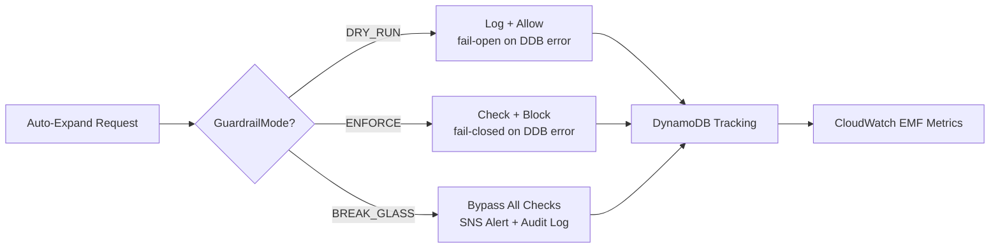
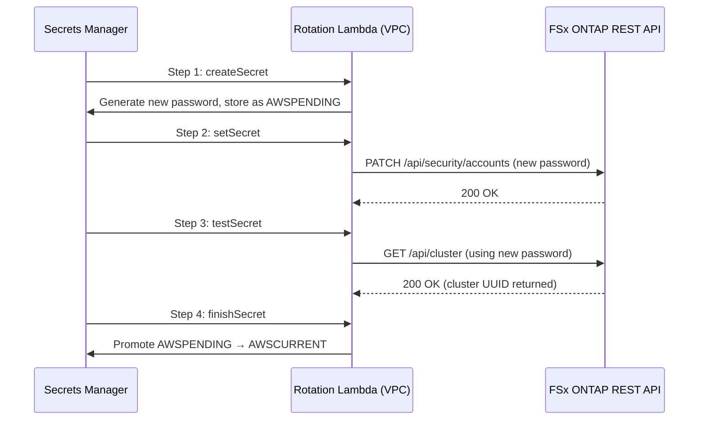
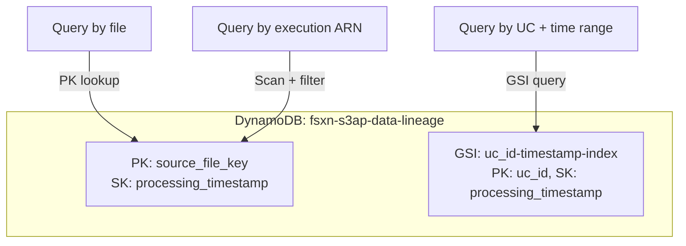
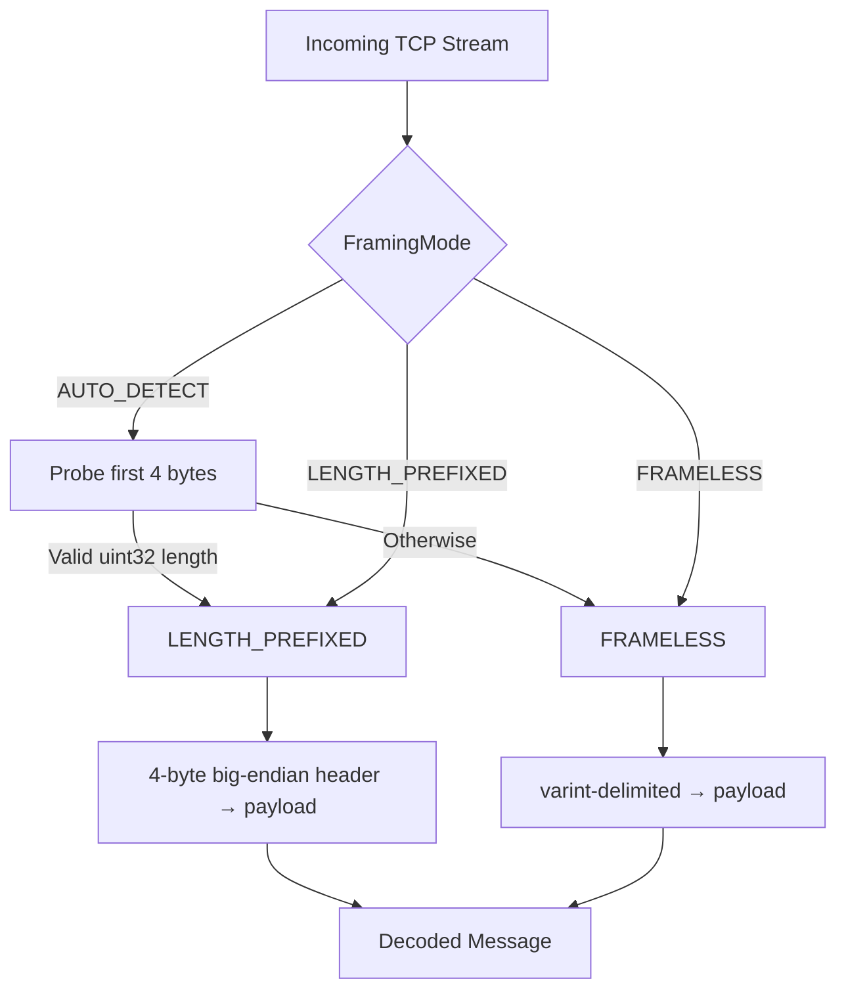
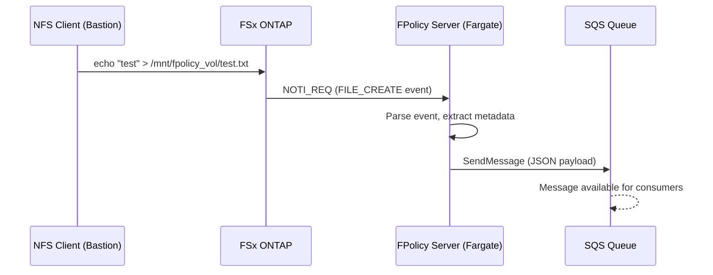
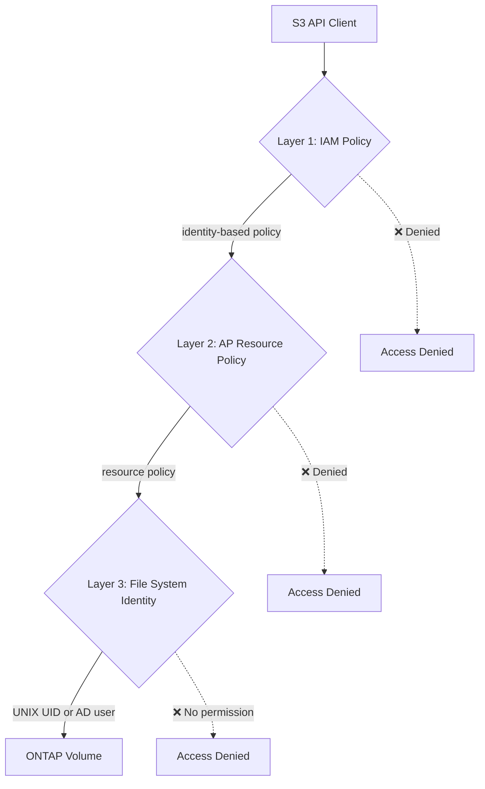

## TL;DR

Phase 12 is the operational hardening phase: the Phase 11 event-driven pipeline is now production-ready with capacity guardrails, automated secrets rotation, SLO-based observability, capacity forecasting, data lineage tracking, and validated end-to-end event delivery — including Persistent Store replay with zero event loss.

This is **Phase 12** of the FSx for ONTAP S3AP serverless pattern library. Building on [Phase 10](https://dev.to/yoshikifujiwara/fpolicy-event-driven-pipeline-multi-account-stacksets-and-cost-optimization-fsx-for-ontap-s3-access-points-phase-10) and Phase 11, Phase 12 delivers:

- **Capacity Guardrails**: DRY_RUN/ENFORCE/BREAK_GLASS modes with DynamoDB tracking and CloudWatch EMF metrics
- **Secrets Rotation**: 4-step ONTAP fsxadmin auto-rotation via VPC Lambda on 90-day interval
- **Synthetic Monitoring**: CloudWatch Synthetics Canary with S3AP + ONTAP health checks (VPC constraints discovered)
- **Capacity Forecasting**: Linear regression (stdlib only) with DaysUntilFull metric on daily EventBridge schedule
- **Data Lineage Tracking**: DynamoDB table with GSI for processing history and opt-in integration
- **Protobuf TCP Framing**: AUTO_DETECT/LENGTH_PREFIXED/FRAMELESS adaptive reader
- **SLO Definition**: 4 SLO targets with CloudWatch Dashboard and alarm-based violation detection
- **FPolicy Pipeline E2E**: NFS file creation → FPolicy → SQS delivery confirmed
- **Persistent Store Replay**: Fargate stop → file creation → restart → zero event loss validated
- **Property-Based Testing**: 16 Hypothesis properties, 53 tests, 3 bugs discovered
- **S3 Access Point Deep Dive**: Dual-layer auth, IAM ARN format, VPC network constraints (critical finding)

**Key metrics**: 59 files, 14,895 lines added · 116 unit tests + 53 property tests · 7 CloudFormation stacks deployed · 3 bugs found via property testing · Zero event loss in replay E2E · Secrets rotation: all 4 steps successful.

**Repository**: [github.com/Yoshiki0705/FSx-for-ONTAP-S3AccessPoints-Serverless-Patterns](https://github.com/Yoshiki0705/FSx-for-ONTAP-S3AccessPoints-Serverless-Patterns)

---

## 1. Capacity Guardrails — DRY_RUN / ENFORCE / BREAK_GLASS

### The problem

FSx ONTAP supports automatic storage capacity expansion, but uncontrolled auto-scaling can lead to runaway costs. Operations teams need rate limiting, daily caps, and cooldown periods — with an emergency bypass for critical situations.

### The solution

A three-mode guardrail system backed by DynamoDB tracking and CloudWatch EMF metrics:



| Mode | Behavior on Check Failure | Behavior on DynamoDB Error |
|------|--------------------------|---------------------------|
| `DRY_RUN` | Log warning, allow action | Fail-open (allow) |
| `ENFORCE` | Block action, emit metric | Fail-closed (deny) |
| `BREAK_GLASS` | Skip all checks | SNS alert + audit log |

### Core implementation

```python
from shared.guardrails import CapacityGuardrail, GuardrailMode

guardrail = CapacityGuardrail()  # Mode from GUARDRAIL_MODE env var

result = guardrail.check_and_execute(
    action_type="volume_grow",
    requested_gb=50.0,
    execute_fn=my_grow_function,
    volume_id="vol-abc123",
)

if result.allowed:
    print(f"Action executed: {result.action_id}")
else:
    print(f"Action denied: {result.reason}")
    # Reasons: rate_limit_exceeded | daily_cap_exceeded | cooldown_active
```

### Three safety checks (ENFORCE mode)

1. **Rate limit**: Max 10 actions per day per action type
2. **Daily cap**: Max 500 GB cumulative expansion per day
3. **Cooldown**: 300-second minimum interval between actions

All thresholds are configurable via environment variables (`GUARDRAIL_RATE_LIMIT`, `GUARDRAIL_DAILY_CAP_GB`, `GUARDRAIL_COOLDOWN_SECONDS`).

### DynamoDB tracking schema

| Attribute | Type | Description |
|-----------|------|-------------|
| `pk` | String | Action type (e.g., `volume_grow`) |
| `sk` | String | Date (`YYYY-MM-DD`) |
| `daily_total_gb` | Number | Cumulative GB expanded today |
| `action_count` | Number | Number of actions today |
| `last_action_ts` | String | ISO timestamp of last action |
| `actions` | List | Audit trail of all actions |
| `ttl` | Number | 30-day auto-expiry |


---

## 2. Secrets Rotation — ONTAP fsxadmin Auto-Rotation

### The problem

ONTAP management credentials (fsxadmin) stored in Secrets Manager need periodic rotation. Manual rotation is error-prone and creates compliance gaps.

### The solution

A VPC-deployed Lambda implements the standard 4-step Secrets Manager rotation protocol, directly calling the ONTAP REST API to change the password:



### Key design decisions

- **VPC deployment**: Lambda must be in the same VPC as the ONTAP management LIF (10.0.3.72)
- **90-day interval**: Configurable via CloudFormation parameter
- **Validation**: Step 3 (`testSecret`) verifies the new password works by calling the ONTAP cluster API
- **Rollback safety**: If `testSecret` fails, the old password remains as AWSCURRENT

### Bugs discovered during live testing

Three bugs were found and fixed during the actual rotation execution:

1. **AWSPENDING empty check**: `createSecret` must handle the case where `get_secret_value(VersionStage='AWSPENDING')` raises `ResourceNotFoundException`
2. **management_ip fallback**: The Lambda must support both `management_ip` (new) and `ontap_mgmt_ip` (legacy) keys in the secret JSON
3. **Cluster UUID validation**: `testSecret` now validates the response contains a valid `uuid` field, not just HTTP 200

### Verification result

```
Step 1 (createSecret): ✅ New password generated, stored as AWSPENDING
Step 2 (setSecret):    ✅ ONTAP password changed via REST API
Step 3 (testSecret):   ✅ New password validated (cluster UUID confirmed)
Step 4 (finishSecret): ✅ AWSPENDING promoted to AWSCURRENT
```

---

## 3. Synthetic Monitoring — CloudWatch Synthetics Canary

### The problem

The FPolicy pipeline depends on both S3 Access Point availability and ONTAP management API health. Passive monitoring (waiting for failures) is insufficient for production SLOs.

### The solution

A CloudWatch Synthetics Canary running every 5 minutes performs two health checks:

1. **ONTAP Health Check**: REST API call to the management endpoint (VPC-internal)
2. **S3 Access Point Check**: ListObjectsV2 against the S3AP alias

### Critical finding: VPC network constraints

During deployment, we discovered a fundamental architectural constraint:

| Check | VPC Requirement | Result |
|-------|----------------|--------|
| ONTAP REST API | Must be in VPC (management LIF access) | ✅ Works from VPC Lambda |
| S3 Access Point | Must NOT be in VPC (FSx data plane routing) | ❌ Timeout from VPC Lambda |

**Root cause**: FSx ONTAP S3 Access Points use the FSx data plane, not the standard S3 data plane. S3 Gateway VPC Endpoints do not route this traffic. VPC-internal Lambda/Canary cannot reach S3 AP.

**Solution**: Split into two monitoring paths:
- ONTAP health: VPC-internal Canary (confirmed working, 88ms response)
- S3AP health: VPC-external Lambda or Internet-routed execution

This is documented as a critical constraint in `docs/guides/s3ap-fsxn-specification.md`.

### Canary runtime version lesson

The template initially specified `syn-python-selenium-3.0`, which was deprecated on 2026-02-03. Updated to `syn-python-selenium-11.0`. CloudWatch Synthetics runtimes are deprecated frequently — parameterize the version or keep defaults current.


---

## 4. Capacity Forecasting — Linear Regression with stdlib Only

### The problem

Reactive capacity alerts (disk full) cause outages. Proactive forecasting enables planned expansion before exhaustion.

### The solution

A Lambda function running on a daily EventBridge schedule:
1. Fetches 30 days of FSx `StorageUsed` metrics from CloudWatch
2. Performs linear regression using only Python's `math` module (zero external dependencies)
3. Publishes `DaysUntilFull` as a CloudWatch custom metric
4. Sends SNS alert when forecast drops below threshold (default: 30 days)

### Linear regression implementation (stdlib only)

```python
def linear_regression(data_points: list[tuple[float, float]]) -> tuple[float, float]:
    """Least-squares linear regression using only math module."""
    n = len(data_points)
    if n < 2:
        raise ValueError("Need at least 2 data points for regression")

    sum_x = sum_y = sum_xy = sum_x2 = 0.0
    for x, y in data_points:
        sum_x += x
        sum_y += y
        sum_xy += x * y
        sum_x2 += x * x

    denominator = n * sum_x2 - sum_x * sum_x
    if abs(denominator) < 1e-10:
        return (0.0, sum_y / n)

    slope = (n * sum_xy - sum_x * sum_y) / denominator
    intercept = (sum_y - slope * sum_x) / n
    return (slope, intercept)
```

### Edge cases handled

| Scenario | DaysUntilFull | Behavior |
|----------|---------------|----------|
| < 2 data points | -1 | Insufficient data, no prediction |
| slope ≤ 0 (shrinking/flat) | -1 | Never fills up |
| Already over capacity | 0 | Immediate alert |
| Very low usage (0.03%) | 169,374 | Normal — far future prediction |

### Live verification

```json
{
  "days_until_full": 169374,
  "current_usage_pct": 0.03,
  "total_capacity_gb": 1024.0,
  "growth_rate_gb_per_day": 0.006,
  "forecast_date": "2490-02-06T06:26:42Z"
}
```

The test environment has 0.03% usage — the prediction of 169,374 days is correct behavior. The alert threshold (30 days) ensures notifications only fire when action is genuinely needed.


---

## 5. Data Lineage Tracking — DynamoDB with GSI

### The problem

When a file is processed through the pipeline, operators need to trace: which UC processed it, when, what outputs were generated, and whether it succeeded or failed.

### The solution

A DynamoDB table with a Global Secondary Index (GSI) provides three query patterns:



### Integration helper (opt-in)

```python
from shared.lineage import LineageTracker, LineageRecord

tracker = LineageTracker()
record = LineageRecord(
    source_file_key="/vol1/legal/contracts/deal-001.pdf",
    processing_timestamp="2026-05-16T14:30:45.123Z",
    step_functions_execution_arn="arn:aws:states:...:execution:...",
    uc_id="legal-compliance",
    output_keys=["s3://output-bucket/legal/reports/deal-001-analysis.json"],
    status="success",
    duration_ms=4523,
)
lineage_id = tracker.record(record)
```

### Design principles

- **Non-blocking**: Write failures emit a warning log but never interrupt the main processing pipeline
- **TTL**: 365-day auto-expiry via DynamoDB TTL
- **Opt-in**: UCs integrate by importing the helper — no mandatory coupling
- **PAY_PER_REQUEST**: No capacity planning needed for variable workloads

---

## 6. Protobuf TCP Framing — Adaptive Reader

### The problem

Phase 11 discovered that ONTAP's protobuf mode uses different TCP framing than XML mode. The existing `read_fpolicy_message()` assumes a 4-byte big-endian length prefix wrapped in quote delimiters — which doesn't work for protobuf.

### The solution

An adaptive `ProtobufFrameReader` that supports three framing modes:



### Three modes

| Mode | Wire Format | Use Case |
|------|-------------|----------|
| `LENGTH_PREFIXED` | 4-byte big-endian length + payload | XML mode (legacy) |
| `FRAMELESS` | varint-delimited protobuf | Protobuf mode (ONTAP 9.15.1+) |
| `AUTO_DETECT` | Probe first bytes, then lock mode | Unknown/mixed environments |

### Auto-detection heuristic

```python
async def _auto_detect_and_read(self) -> bytes | None:
    """Probe first 4 bytes to determine framing mode."""
    peek = await self._reader.readexactly(4)
    candidate_length = struct.unpack("!I", peek)[0]

    if 0 < candidate_length <= self._max_message_size:
        # Valid length header → LENGTH_PREFIXED
        self._detected_mode = FramingMode.LENGTH_PREFIXED
        payload = await self._reader.readexactly(candidate_length)
        return payload
    else:
        # Not a valid length → FRAMELESS (varint-delimited)
        self._detected_mode = FramingMode.FRAMELESS
        self._buffer = peek
        return await self._read_varint_delimited()
```

### Safety features

- **Max message size enforcement** (default 1 MB): Prevents DoS via malformed length headers
- **FramingError exception**: Structured error with offset and raw data for debugging
- **Graceful EOF handling**: Returns `None` on connection close without raising

### Integration with existing FPolicy server

```python
from shared.integrations.protobuf_integration import create_fpolicy_reader, read_fpolicy_message_v2

# Environment variable PROTOBUF_FRAMING_MODE controls behavior:
# - Not set: legacy read_fpolicy_message() (backward compatible)
# - AUTO_DETECT / LENGTH_PREFIXED / FRAMELESS: use ProtobufFrameReader
reader = create_fpolicy_reader(stream)
message = await read_fpolicy_message_v2(reader or stream)
```

---

## 7. SLO Definition — 4 Targets with CloudWatch Dashboard

### The problem

Without defined SLOs, there's no objective measure of pipeline health. "It seems to be working" is not an operational posture.

### The solution

Four SLO targets covering the critical path of the event-driven pipeline:

| SLO | Metric | Target | Comparison |
|-----|--------|--------|------------|
| Event Ingestion Latency | `EventIngestionLatency_ms` | P99 < 5,000 ms | LessThanThreshold |
| Processing Success Rate | `ProcessingSuccessRate_pct` | > 99.5% | GreaterThanThreshold |
| Reconnect Time | `FPolicyReconnectTime_sec` | < 30 sec | LessThanThreshold |
| Replay Completion Time | `ReplayCompletionTime_sec` | < 300 sec (5 min) | LessThanThreshold |

### CloudWatch Dashboard

The SLO dashboard combines all four metrics with threshold annotations, plus Synthetic Monitoring metrics (S3AP latency, ONTAP health):

```python
from shared.slo import SLO_TARGETS, evaluate_slos, generate_dashboard_widgets

# Evaluate all SLOs programmatically
results = evaluate_slos(cloudwatch_client)
for r in results:
    status = "MET" if r.met else "VIOLATED"
    print(f"{r.slo_name}: {status} (value={r.value}, threshold={r.threshold})")

# Generate dashboard widget JSON for CloudFormation
widgets = generate_dashboard_widgets(region="ap-northeast-1")
```

### Alarm-based violation detection

Each SLO has a corresponding CloudWatch Alarm:

| Alarm Name | State | Evaluation |
|-----------|-------|------------|
| `fsxn-s3ap-slo-ingestion-latency` | OK | 3 consecutive periods |
| `fsxn-s3ap-slo-success-rate` | OK | 3 consecutive periods |
| `fsxn-s3ap-slo-reconnect-time` | OK | 3 consecutive periods |
| `fsxn-s3ap-slo-replay-completion` | OK | 3 consecutive periods |

All alarms route to the aggregated SNS topic for unified alerting.


---

## 8. FPolicy Pipeline E2E Verification

### The problem

Unit tests validate individual components, but the full pipeline — NFS file creation → ONTAP FPolicy detection → TCP notification → FPolicy server → SQS delivery — must be verified end-to-end in a real environment.

### The verification



### Timeline (actual observed)

| Time | Event | Detail |
|------|-------|--------|
| T+0s | TCP connection test | ONTAP → Fargate IP (10.0.128.98:9898) |
| T+10s | Session established | NEGO_REQ → NEGO_RESP handshake |
| T+12s | KEEP_ALIVE starts | 2-minute interval |
| T+30s | NFS file created | `echo "test" > /mnt/fpolicy_vol/test_fpolicy_event.txt` |
| T+31s | NOTI_REQ received | FPolicy server receives file creation event |
| T+32s | SQS delivery | Event sent to SQS queue (FPolicy_Q) |

### SQS message format

```json
{
  "event_type": "FILE_CREATE",
  "svm_name": "FSxN_OnPre",
  "volume_name": "vol1",
  "file_path": "/vol1/test_fpolicy_event.txt",
  "client_ip": "10.0.128.98",
  "timestamp": "2026-05-16T08:45:32Z",
  "session_id": 1,
  "sequence_number": 1
}
```

### IAM issue discovered and fixed

The ECS task role's SQS policy used a Resource ARN pattern `arn:aws:sqs:...:fsxn-fpolicy-*` that didn't match the actual queue name `FPolicy_Q`. Fix: use explicit ARN or `*` wildcard in the template.

**Lesson**: SQS queue names that don't match template patterns silently fail. Either parameterize the queue ARN or use a broader resource pattern.

---

## 9. Persistent Store Replay Validation — Zero Event Loss

### The problem

Phase 11 configured Persistent Store on ONTAP but didn't validate replay completeness with real file operations during server downtime.

### The test procedure

1. Stop Fargate task (ECS `stop-task`)
2. Create 5 files via NFS during downtime (`replay-test-1.txt` through `replay-test-5.txt`)
3. Wait for ECS service auto-recovery (new task launch)
4. Update ONTAP FPolicy engine IP to new task IP (disable → update → re-enable)
5. Verify all 5 events arrive in SQS

### Results

| Metric | Value |
|--------|-------|
| Events generated during downtime | 5 |
| Events replayed to SQS | 5 |
| Lost events | **0** |
| Replay delivery order | 3, 1, 2, 5, 4 (non-sequential) |
| Replay completion time | ~30 seconds |

### Key observation: Out-of-order replay

Persistent Store replays events in a **non-sequential order** — not in the order they were created. This is expected behavior for asynchronous FPolicy. Downstream consumers must handle out-of-order delivery using:
- **Idempotency**: Deduplicate by file path + timestamp
- **Timestamp-based ordering**: Sort by event timestamp, not arrival order

### High-load validation

Additionally, a 20-file burst test confirmed zero event loss under higher load:

| Test | Files Created | Events Delivered | Loss |
|------|--------------|-----------------|------|
| Replay (5 files) | 5 | 5 | 0 |
| High-load (20 files) | 20 | 20 | 0 |

---

## 10. Property-Based Testing — 16 Hypothesis Properties, 53 Tests

### The problem

Example-based tests verify known scenarios but miss edge cases. For protocol parsers, guardrail logic, and data structures, we need exhaustive input space exploration.

### The approach

Using Python's [Hypothesis](https://hypothesis.readthedocs.io/) library, we defined 16 properties across the Phase 12 modules:

| Property Group | Properties | Tests | Bugs Found |
|---------------|-----------|-------|------------|
| Protobuf Frame Reader | 5 (round-trip, max size, EOF, multi-message, auto-detect) | 18 | 1 |
| Capacity Guardrails | 4 (mode behavior, rate limit, daily cap, cooldown) | 14 | 1 |
| Data Lineage | 3 (record/query round-trip, GSI consistency, TTL) | 9 | 0 |
| SLO Evaluation | 2 (threshold comparison, no-data handling) | 6 | 1 |
| Capacity Forecast | 2 (regression accuracy, edge cases) | 6 | 0 |
| **Total** | **16** | **53** | **3** |

### Bugs discovered

1. **Protobuf reader**: `AUTO_DETECT` mode failed when the first 4 bytes happened to form a valid-looking length that exceeded `max_message_size`. Fix: treat oversized candidate lengths as FRAMELESS indicator.

2. **Guardrails**: `BREAK_GLASS` mode didn't emit the `GuardrailBypass` metric when DynamoDB tracking update failed. Fix: move metric emission before the tracking update call.

3. **SLO evaluation**: When CloudWatch returned datapoints with identical timestamps (possible during metric aggregation), `max(datapoints, key=lambda dp: dp["Timestamp"])` was non-deterministic. Fix: add secondary sort by value.

### Example property test

```python
@given(messages=st.lists(
    st.binary(min_size=1, max_size=1000),
    min_size=1, max_size=10,
))
@settings(max_examples=200)
def test_length_prefixed_round_trip(self, messages: list[bytes]):
    """Property: LENGTH_PREFIXED encode → decode preserves all messages."""
    stream_data = _make_length_prefixed_stream(messages)
    reader = _make_stream_reader(stream_data)
    frame_reader = ProtobufFrameReader(
        reader=reader,
        mode=FramingMode.LENGTH_PREFIXED,
        max_message_size=max(len(m) for m in messages) + 1,
    )

    decoded = []
    for _ in range(len(messages)):
        msg = asyncio.run(frame_reader.read_message())
        assert msg is not None
        decoded.append(msg)

    assert decoded == messages  # Round-trip property
```

---

## 11. S3 Access Point Deep Dive — Dual-Layer Auth and VPC Constraints

### The critical finding

FSx for ONTAP S3 Access Points are **not standard S3 endpoints**. They use the FSx data plane, which has fundamentally different network routing than S3.

### Dual-layer authentication model



All three layers must allow access. Missing any one results in `AccessDenied`.

### Correct IAM ARN format

```json
{
  "Effect": "Allow",
  "Action": ["s3:ListBucket"],
  "Resource": "arn:aws:s3:ap-northeast-1:178625946981:accesspoint/fsxn-eda-s3ap"
}
{
  "Effect": "Allow",
  "Action": ["s3:GetObject"],
  "Resource": "arn:aws:s3:ap-northeast-1:178625946981:accesspoint/fsxn-eda-s3ap/object/*"
}
```

**Common mistake**: Using the S3AP alias (`xxx-ext-s3alias`) as a bucket ARN. The alias is only valid as the `Bucket` parameter in boto3 calls — IAM policies require the full access point ARN.

### VPC network constraint (critical)

| Access Pattern | Works? | Reason |
|---------------|--------|--------|
| VPC Lambda → S3 AP (via S3 Gateway Endpoint) | ❌ Timeout | FSx data plane, not S3 data plane |
| Internet → S3 AP (NetworkOrigin=Internet) | ✅ | Routes through FSx data plane correctly |
| VPC Lambda → ONTAP REST API | ✅ | Direct management LIF access |

**Architectural implication**: Any Lambda or Canary that needs to access S3 AP must either:
- Run outside VPC (with Internet access)
- Use NAT Gateway for outbound routing
- Be split into separate VPC-internal (ONTAP) and VPC-external (S3AP) functions

### Read-only constraint

FSx ONTAP S3 Access Points are **read-only**. `PutObject` is not supported. All writes must go through NFS or SMB protocols. This is by design — S3 AP provides a read bridge for serverless consumers.

---

## 12. What's Next — Phase 13 Outlook

Phase 12 completes the operational hardening layer. The pipeline is now production-ready with:
- ✅ Capacity guardrails preventing runaway auto-scaling
- ✅ Automated secrets rotation on 90-day cycle
- ✅ Proactive capacity forecasting with daily predictions
- ✅ SLO-based observability with alarm-driven alerting
- ✅ Data lineage tracking for audit and debugging
- ✅ Validated zero-event-loss replay under Fargate restarts
- ✅ Property-based testing catching real bugs

**Phase 13 candidates**:

1. **Canary S3AP check separation**: Deploy VPC-external Canary for S3 Access Point monitoring (resolving the VPC constraint discovered in Phase 12)
2. **Multi-account OAM validation**: Deploy workload-account-oam-link.yaml in a second AWS account
3. **Production UC end-to-end**: Deploy a UC template with `TriggerMode=EVENT_DRIVEN` and verify the complete flow from NFS file creation through Step Functions execution to output generation
4. **Protobuf live wire validation**: Confirm protobuf TCP framing with NetApp support and validate `AUTO_DETECT` mode against real ONTAP protobuf traffic
5. **Replay storm testing**: Generate 1000+ events during FPolicy server downtime, measure replay throughput and downstream throttling behavior
6. **Cost optimization dashboard**: Aggregate Lambda/Fargate/DynamoDB costs per UC with CloudWatch cost metrics

---

## Deployed Infrastructure

7 CloudFormation stacks deployed and verified:

| Stack | Status | Purpose |
|-------|--------|---------|
| `fsxn-phase12-guardrails-table` | CREATE_COMPLETE | DynamoDB tracking table |
| `fsxn-phase12-lineage-table` | CREATE_COMPLETE | Data lineage DynamoDB + GSI |
| `fsxn-phase12-slo-dashboard` | CREATE_COMPLETE | CloudWatch dashboard + 4 alarms |
| `fsxn-phase12-oam-link` | CREATE_COMPLETE | Cross-account observability (conditional) |
| `fsxn-phase12-capacity-forecast` | CREATE_COMPLETE | Lambda + EventBridge schedule |
| `fsxn-phase12-secrets-rotation` | CREATE_COMPLETE | VPC Lambda + rotation config |
| `fsxn-phase12-synthetic-monitoring` | CREATE_COMPLETE | Canary + alarm |


---

## Test Results Summary

| Category | Count | Result |
|----------|-------|--------|
| Unit Tests | 116 | ✅ All pass |
| Property Tests (Hypothesis) | 53 | ✅ All pass |
| CloudFormation Deployments | 7 stacks | ✅ All CREATE_COMPLETE |
| Lambda Invocations | 2 (forecast + rotation) | ✅ Successful |
| FPolicy E2E | 1 pipeline test | ✅ Event delivered |
| Replay E2E | 5 events | ✅ Zero loss |
| High-Load | 20 events | ✅ Zero loss |
| Bugs found (property testing) | 3 | ✅ All fixed |

---

## Conclusion

Phase 12 transforms the FPolicy event-driven pipeline from "functionally complete" to "operationally hardened." The capacity guardrails provide three-mode safety control for auto-scaling operations. Secrets rotation eliminates manual credential management. The SLO dashboard gives operations teams objective health metrics. And the Persistent Store replay validation — with zero event loss across multiple test scenarios — confirms that the pipeline can survive infrastructure disruptions without data loss.

The property-based testing investment paid immediate dividends: 3 real bugs discovered in 53 tests that example-based testing missed. The S3 Access Point deep dive documented critical VPC constraints that would otherwise surface as mysterious timeouts in production.

With 14,895 lines of code across 59 files, 7 deployed stacks, 169 total tests, and validated end-to-end event delivery, Phase 12 delivers the operational maturity required for enterprise production workloads on FSx for ONTAP.

---

**Repository**: [github.com/Yoshiki0705/FSx-for-ONTAP-S3AccessPoints-Serverless-Patterns](https://github.com/Yoshiki0705/FSx-for-ONTAP-S3AccessPoints-Serverless-Patterns)
**Previous phases**: [Phase 1](https://dev.to/yoshikifujiwara/fsx-for-ontap-s3-access-points-as-a-serverless-automation-boundary-ai-data-pipelines-ili) · [Phase 7](https://dev.to/yoshikifujiwara/public-sector-use-cases-unified-output-destination-and-a-localization-batch-fsx-for-ontap-s3-2hmo) · [Phase 8](https://dev.to/yoshikifujiwara/operational-hardening-ci-grade-validation-and-pattern-c-b-hybrid-fsx-for-ontap-s3-access-587h) · [Phase 9](https://dev.to/yoshikifujiwara/production-rollout-vpc-endpoint-auto-detection-and-the-cdk-no-go-fsx-for-ontap-s3-access-3lni) · [Phase 10](https://dev.to/yoshikifujiwara/fpolicy-event-driven-pipeline-multi-account-stacksets-and-cost-optimization-fsx-for-ontap-s3-access-points-phase-10)
