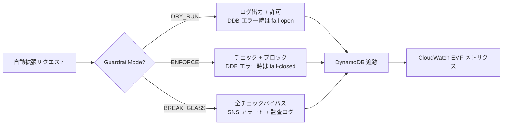
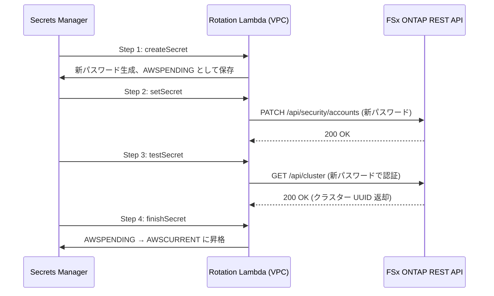
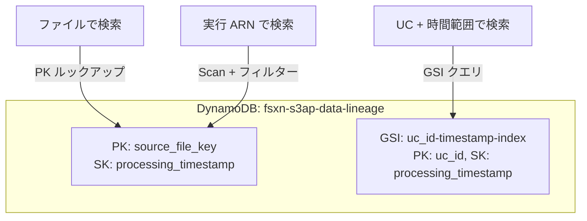
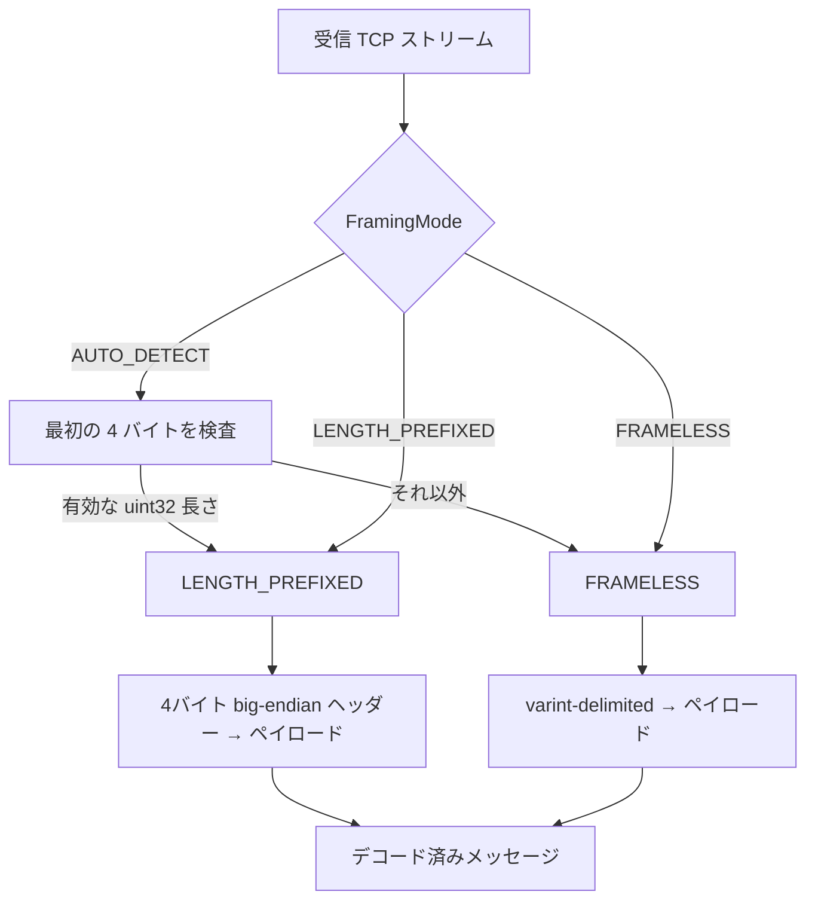
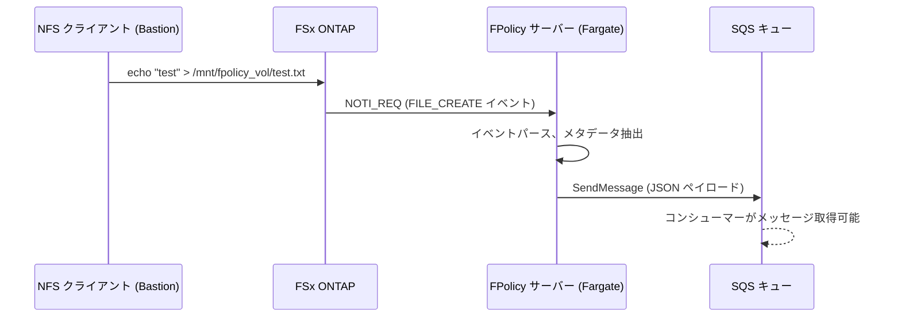
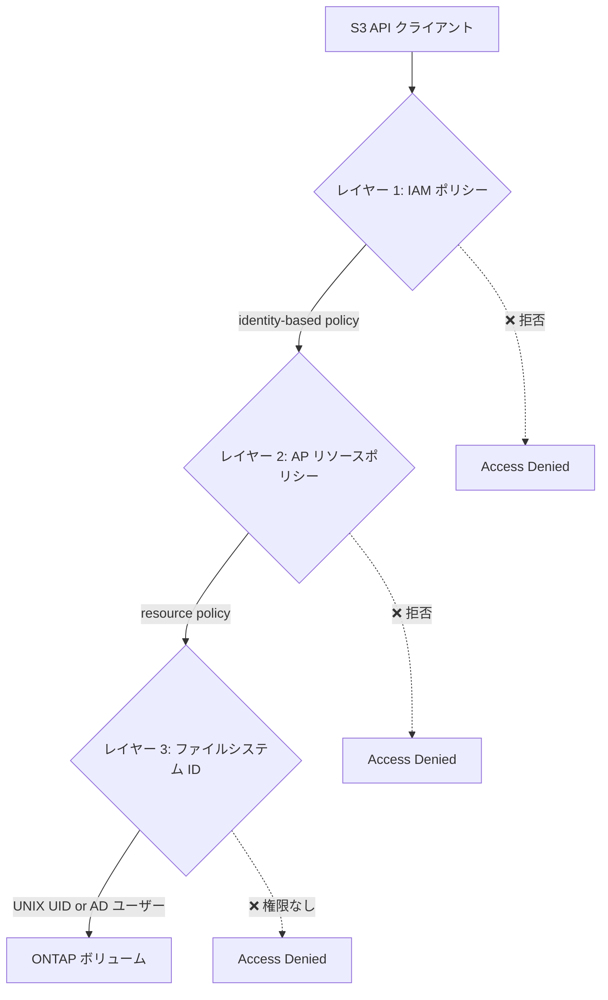

## TL;DR

Phase 12 は運用強化フェーズです。Phase 11 で構築したイベント駆動パイプラインに、Capacity Guardrails、シークレット自動ローテーション、SLO ベースのオブザーバビリティ、容量予測、データリネージ追跡を追加し、Persistent Store リプレイによるイベントロスゼロを実環境で検証しました。

これは FSx for ONTAP S3AP サーバーレスパターンライブラリの **Phase 12** です。[Phase 10](https://dev.to/yoshikifujiwara/fpolicy-event-driven-pipeline-multi-account-stacksets-and-cost-optimization-fsx-for-ontap-s3-access-points-phase-10) および Phase 11 の上に、Phase 12 は以下を提供します：

- **Capacity Guardrails**: DRY_RUN/ENFORCE/BREAK_GLASS モードによる安全制御、DynamoDB 追跡、CloudWatch EMF メトリクス
- **Secrets Rotation**: VPC Lambda による ONTAP fsxadmin の 4 ステップ自動ローテーション（90 日間隔）
- **Synthetic Monitoring**: CloudWatch Synthetics Canary による S3AP + ONTAP ヘルスチェック（VPC 制約を発見）
- **Capacity Forecasting**: 標準ライブラリのみの線形回帰、DaysUntilFull メトリクス、EventBridge 日次スケジュール
- **Data Lineage Tracking**: GSI 付き DynamoDB テーブルによる処理履歴追跡とオプトイン統合
- **Protobuf TCP Framing**: AUTO_DETECT/LENGTH_PREFIXED/FRAMELESS アダプティブリーダー
- **SLO Definition**: 4 つの SLO ターゲット、CloudWatch ダッシュボード、アラームベースの違反検出
- **FPolicy Pipeline E2E**: NFS ファイル作成 → FPolicy → SQS 配信を確認
- **Persistent Store Replay**: Fargate 停止 → ファイル作成 → 再起動 → イベントロスゼロを検証
- **Property-Based Testing**: 16 の Hypothesis プロパティ、53 テスト、3 つのバグを発見
- **S3 Access Point Deep Dive**: デュアルレイヤー認証、IAM ARN 形式、VPC ネットワーク制約（重要な発見）

**主要メトリクス**: 59 ファイル、14,895 行追加 · 116 ユニットテスト + 53 プロパティテスト · 7 CloudFormation スタックデプロイ · プロパティテストで 3 バグ発見 · リプレイ E2E でイベントロスゼロ · シークレットローテーション: 全 4 ステップ成功

**リポジトリ**: [github.com/Yoshiki0705/FSx-for-ONTAP-S3AccessPoints-Serverless-Patterns](https://github.com/Yoshiki0705/FSx-for-ONTAP-S3AccessPoints-Serverless-Patterns)

---

## 1. Capacity Guardrails — DRY_RUN / ENFORCE / BREAK_GLASS

### 課題

FSx ONTAP はストレージ容量の自動拡張をサポートしていますが、制御なしの自動スケーリングはコスト暴走につながります。運用チームにはレート制限、日次上限、クールダウン期間 — そして緊急時のバイパス手段が必要です。

### ソリューション

DynamoDB 追跡と CloudWatch EMF メトリクスに裏打ちされた 3 モードのガードレールシステム：



| モード | チェック失敗時の動作 | DynamoDB エラー時の動作 |
|--------|---------------------|------------------------|
| `DRY_RUN` | 警告ログ出力、アクション許可 | Fail-open（許可） |
| `ENFORCE` | アクションブロック、メトリクス発行 | Fail-closed（拒否） |
| `BREAK_GLASS` | 全チェックスキップ | SNS アラート + 監査ログ |

### コア実装

```python
from shared.guardrails import CapacityGuardrail, GuardrailMode

guardrail = CapacityGuardrail()  # GUARDRAIL_MODE 環境変数からモード取得

result = guardrail.check_and_execute(
    action_type="volume_grow",
    requested_gb=50.0,
    execute_fn=my_grow_function,
    volume_id="vol-abc123",
)

if result.allowed:
    print(f"アクション実行完了: {result.action_id}")
else:
    print(f"アクション拒否: {result.reason}")
    # 理由: rate_limit_exceeded | daily_cap_exceeded | cooldown_active
```

### 3 つの安全チェック（ENFORCE モード）

1. **レート制限**: アクション種別ごとに 1 日最大 10 回
2. **日次上限**: 1 日の累積拡張量最大 500 GB
3. **クールダウン**: アクション間の最小間隔 300 秒

全閾値は環境変数で設定可能（`GUARDRAIL_RATE_LIMIT`、`GUARDRAIL_DAILY_CAP_GB`、`GUARDRAIL_COOLDOWN_SECONDS`）。

### DynamoDB 追跡スキーマ

| 属性 | 型 | 説明 |
|------|-----|------|
| `pk` | String | アクション種別（例: `volume_grow`） |
| `sk` | String | 日付（`YYYY-MM-DD`） |
| `daily_total_gb` | Number | 当日の累積拡張量（GB） |
| `action_count` | Number | 当日のアクション回数 |
| `last_action_ts` | String | 最終アクションの ISO タイムスタンプ |
| `actions` | List | 全アクションの監査証跡 |
| `ttl` | Number | 30 日自動削除 |


---

## 2. Secrets Rotation — ONTAP fsxadmin 自動ローテーション

### 課題

Secrets Manager に保存された ONTAP 管理認証情報（fsxadmin）は定期的なローテーションが必要です。手動ローテーションはエラーが発生しやすく、コンプライアンスギャップを生みます。

### ソリューション

VPC にデプロイされた Lambda が Secrets Manager の標準 4 ステップローテーションプロトコルを実装し、ONTAP REST API を直接呼び出してパスワードを変更します：



### 主要な設計判断

- **VPC デプロイ**: Lambda は ONTAP 管理 LIF（10.0.3.72）と同じ VPC に配置する必要あり
- **90 日間隔**: CloudFormation パラメータで設定可能
- **検証**: Step 3（`testSecret`）で新パスワードが ONTAP クラスター API で動作することを確認
- **ロールバック安全性**: `testSecret` が失敗した場合、旧パスワードが AWSCURRENT のまま維持

### ライブテスト中に発見されたバグ

実際のローテーション実行中に 3 つのバグを発見・修正：

1. **AWSPENDING 空チェック**: `createSecret` は `get_secret_value(VersionStage='AWSPENDING')` が `ResourceNotFoundException` を発生させるケースを処理する必要あり
2. **management_ip フォールバック**: Lambda はシークレット JSON 内の `management_ip`（新）と `ontap_mgmt_ip`（レガシー）の両方のキーをサポートする必要あり
3. **クラスター UUID 検証**: `testSecret` は HTTP 200 だけでなく、レスポンスに有効な `uuid` フィールドが含まれることを検証するよう修正

### 検証結果

```
Step 1 (createSecret): ✅ 新パスワード生成、AWSPENDING として保存
Step 2 (setSecret):    ✅ ONTAP パスワードを REST API 経由で変更
Step 3 (testSecret):   ✅ 新パスワード検証完了（クラスター UUID 確認）
Step 4 (finishSecret): ✅ AWSPENDING を AWSCURRENT に昇格
```

---

## 3. Synthetic Monitoring — CloudWatch Synthetics Canary

### 課題

FPolicy パイプラインは S3 Access Point の可用性と ONTAP 管理 API のヘルスの両方に依存しています。パッシブモニタリング（障害発生を待つ）では本番 SLO には不十分です。

### ソリューション

5 分間隔で実行される CloudWatch Synthetics Canary が 2 つのヘルスチェックを実行：

1. **ONTAP ヘルスチェック**: 管理エンドポイントへの REST API 呼び出し（VPC 内部）
2. **S3 Access Point チェック**: S3AP エイリアスに対する ListObjectsV2

### 重要な発見: VPC ネットワーク制約

デプロイ中に、根本的なアーキテクチャ制約を発見しました：

| チェック | VPC 要件 | 結果 |
|---------|---------|------|
| ONTAP REST API | VPC 内必須（管理 LIF アクセス） | ✅ VPC Lambda から動作 |
| S3 Access Point | VPC 内不可（FSx データプレーンルーティング） | ❌ VPC Lambda からタイムアウト |

**根本原因**: FSx ONTAP S3 Access Points は標準の S3 データプレーンではなく、FSx データプレーンを使用します。S3 Gateway VPC Endpoint はこのトラフィックをルーティングしません。VPC 内の Lambda/Canary は S3 AP に到達できません。

**解決策**: 2 つのモニタリングパスに分離：
- ONTAP ヘルス: VPC 内 Canary（動作確認済み、88ms レスポンス）
- S3AP ヘルス: VPC 外 Lambda またはインターネットルーティング実行

この制約は `docs/guides/s3ap-fsxn-specification.md` にクリティカル制約として文書化されています。

### Canary ランタイムバージョンの教訓

テンプレートは当初 `syn-python-selenium-3.0` を指定していましたが、2026-02-03 に廃止済みでした。`syn-python-selenium-11.0` に更新。CloudWatch Synthetics のランタイムは頻繁に廃止されるため、バージョンをパラメータ化するかデフォルトを最新に保つ必要があります。


---

## 4. Capacity Forecasting — 標準ライブラリのみの線形回帰

### 課題

リアクティブな容量アラート（ディスクフル）は障害を引き起こします。プロアクティブな予測により、枯渇前に計画的な拡張が可能になります。

### ソリューション

EventBridge の日次スケジュールで実行される Lambda 関数：
1. CloudWatch から 30 日間の FSx `StorageUsed` メトリクスを取得
2. Python の `math` モジュールのみで線形回帰を実行（外部依存ゼロ）
3. `DaysUntilFull` を CloudWatch カスタムメトリクスとして発行
4. 予測が閾値（デフォルト: 30 日）を下回った場合に SNS アラート送信

### 線形回帰の実装（標準ライブラリのみ）

```python
def linear_regression(data_points: list[tuple[float, float]]) -> tuple[float, float]:
    """math モジュールのみを使用した最小二乗法線形回帰。"""
    n = len(data_points)
    if n < 2:
        raise ValueError("回帰には最低 2 データポイントが必要")

    sum_x = sum_y = sum_xy = sum_x2 = 0.0
    for x, y in data_points:
        sum_x += x
        sum_y += y
        sum_xy += x * y
        sum_x2 += x * x

    denominator = n * sum_x2 - sum_x * sum_x
    if abs(denominator) < 1e-10:
        return (0.0, sum_y / n)

    slope = (n * sum_xy - sum_x * sum_y) / denominator
    intercept = (sum_y - slope * sum_x) / n
    return (slope, intercept)
```

### 処理されるエッジケース

| シナリオ | DaysUntilFull | 動作 |
|---------|---------------|------|
| データポイント 2 点未満 | -1 | データ不足、予測不可 |
| slope ≤ 0（減少/横ばい） | -1 | 枯渇しない |
| 既に容量超過 | 0 | 即時アラート |
| 非常に低い使用率（0.03%） | 169,374 | 正常 — 遠い将来の予測 |

### ライブ検証

```json
{
  "days_until_full": 169374,
  "current_usage_pct": 0.03,
  "total_capacity_gb": 1024.0,
  "growth_rate_gb_per_day": 0.006,
  "forecast_date": "2490-02-06T06:26:42Z"
}
```

テスト環境の使用率は 0.03% — 169,374 日の予測は正しい動作です。アラート閾値（30 日）により、本当にアクションが必要な場合にのみ通知が発行されます。


---

## 5. Data Lineage Tracking — GSI 付き DynamoDB

### 課題

ファイルがパイプラインで処理された際、運用者は以下を追跡する必要があります：どの UC が処理したか、いつ処理されたか、どの出力が生成されたか、成功したか失敗したか。

### ソリューション

Global Secondary Index（GSI）付きの DynamoDB テーブルが 3 つのクエリパターンを提供：



### 統合ヘルパー（オプトイン）

```python
from shared.lineage import LineageTracker, LineageRecord

tracker = LineageTracker()
record = LineageRecord(
    source_file_key="/vol1/legal/contracts/deal-001.pdf",
    processing_timestamp="2026-05-16T14:30:45.123Z",
    step_functions_execution_arn="arn:aws:states:...:execution:...",
    uc_id="legal-compliance",
    output_keys=["s3://output-bucket/legal/reports/deal-001-analysis.json"],
    status="success",
    duration_ms=4523,
)
lineage_id = tracker.record(record)
```

### 設計原則

- **ノンブロッキング**: 書き込み失敗は警告ログを出力するが、メイン処理パイプラインを中断しない
- **TTL**: DynamoDB TTL による 365 日自動削除
- **オプトイン**: UC はヘルパーをインポートして統合 — 強制的な結合なし
- **PAY_PER_REQUEST**: 変動ワークロードに対する容量計画不要

---

## 6. Protobuf TCP Framing — アダプティブリーダー

### 課題

Phase 11 で、ONTAP の protobuf モードが XML モードとは異なる TCP フレーミングを使用することを発見しました。既存の `read_fpolicy_message()` はクォート区切りの 4 バイト big-endian 長さプレフィックスを前提としていますが、protobuf では動作しません。

### ソリューション

3 つのフレーミングモードをサポートするアダプティブ `ProtobufFrameReader`：



### 3 つのモード

| モード | ワイヤーフォーマット | ユースケース |
|--------|-------------------|-------------|
| `LENGTH_PREFIXED` | 4バイト big-endian 長さ + ペイロード | XML モード（レガシー） |
| `FRAMELESS` | varint-delimited protobuf | Protobuf モード（ONTAP 9.15.1+） |
| `AUTO_DETECT` | 最初のバイトを検査してモードをロック | 不明/混在環境 |

### 自動検出ヒューリスティック

```python
async def _auto_detect_and_read(self) -> bytes | None:
    """最初の 4 バイトを検査してフレーミングモードを判定。"""
    peek = await self._reader.readexactly(4)
    candidate_length = struct.unpack("!I", peek)[0]

    if 0 < candidate_length <= self._max_message_size:
        # 有効な長さヘッダー → LENGTH_PREFIXED
        self._detected_mode = FramingMode.LENGTH_PREFIXED
        payload = await self._reader.readexactly(candidate_length)
        return payload
    else:
        # 有効な長さではない → FRAMELESS（varint-delimited）
        self._detected_mode = FramingMode.FRAMELESS
        self._buffer = peek
        return await self._read_varint_delimited()
```

### 安全機能

- **最大メッセージサイズ強制**（デフォルト 1 MB）: 不正な長さヘッダーによる DoS を防止
- **FramingError 例外**: オフセットと生データを含む構造化エラー
- **グレースフル EOF 処理**: 接続クローズ時に例外を発生させず `None` を返す

### 既存 FPolicy サーバーとの統合

```python
from shared.integrations.protobuf_integration import create_fpolicy_reader, read_fpolicy_message_v2

# 環境変数 PROTOBUF_FRAMING_MODE で動作を制御:
# - 未設定: レガシー read_fpolicy_message()（後方互換）
# - AUTO_DETECT / LENGTH_PREFIXED / FRAMELESS: ProtobufFrameReader を使用
reader = create_fpolicy_reader(stream)
message = await read_fpolicy_message_v2(reader or stream)
```

---

## 7. SLO Definition — CloudWatch ダッシュボード付き 4 ターゲット

### 課題

定義された SLO がなければ、パイプラインの健全性を客観的に測定する手段がありません。「動いているようだ」は運用姿勢として不十分です。

### ソリューション

イベント駆動パイプラインのクリティカルパスをカバーする 4 つの SLO ターゲット：

| SLO | メトリクス | ターゲット | 比較 |
|-----|----------|----------|------|
| イベント取り込みレイテンシ | `EventIngestionLatency_ms` | P99 < 5,000 ms | LessThanThreshold |
| 処理成功率 | `ProcessingSuccessRate_pct` | > 99.5% | GreaterThanThreshold |
| 再接続時間 | `FPolicyReconnectTime_sec` | < 30 秒 | LessThanThreshold |
| リプレイ完了時間 | `ReplayCompletionTime_sec` | < 300 秒（5 分） | LessThanThreshold |

### CloudWatch ダッシュボード

SLO ダッシュボードは 4 つのメトリクスを閾値アノテーション付きで統合し、Synthetic Monitoring メトリクス（S3AP レイテンシ、ONTAP ヘルス）も含みます：

```python
from shared.slo import SLO_TARGETS, evaluate_slos, generate_dashboard_widgets

# 全 SLO をプログラム的に評価
results = evaluate_slos(cloudwatch_client)
for r in results:
    status = "達成" if r.met else "違反"
    print(f"{r.slo_name}: {status} (値={r.value}, 閾値={r.threshold})")

# CloudFormation 用ダッシュボードウィジェット JSON を生成
widgets = generate_dashboard_widgets(region="ap-northeast-1")
```

### アラームベースの違反検出

各 SLO に対応する CloudWatch アラーム：

| アラーム名 | 状態 | 評価 |
|-----------|------|------|
| `fsxn-s3ap-slo-ingestion-latency` | OK | 3 連続期間 |
| `fsxn-s3ap-slo-success-rate` | OK | 3 連続期間 |
| `fsxn-s3ap-slo-reconnect-time` | OK | 3 連続期間 |
| `fsxn-s3ap-slo-replay-completion` | OK | 3 連続期間 |

全アラームは統合 SNS トピックにルーティングされ、統一的なアラートを実現します。


---

## 8. FPolicy Pipeline E2E 検証

### 課題

ユニットテストは個別コンポーネントを検証しますが、完全なパイプライン — NFS ファイル作成 → ONTAP FPolicy 検知 → TCP 通知 → FPolicy サーバー → SQS 配信 — は実環境でのエンドツーエンド検証が必要です。

### 検証



### タイムライン（実測値）

| 時刻 | イベント | 詳細 |
|------|---------|------|
| T+0s | TCP 接続テスト | ONTAP → Fargate IP (10.0.128.98:9898) |
| T+10s | セッション確立 | NEGO_REQ → NEGO_RESP ハンドシェイク |
| T+12s | KEEP_ALIVE 開始 | 2 分間隔 |
| T+30s | NFS ファイル作成 | `echo "test" > /mnt/fpolicy_vol/test_fpolicy_event.txt` |
| T+31s | NOTI_REQ 受信 | FPolicy サーバーがファイル作成イベントを受信 |
| T+32s | SQS 配信 | イベントを SQS キュー (FPolicy_Q) に送信 |

### SQS メッセージ形式

```json
{
  "event_type": "FILE_CREATE",
  "svm_name": "FSxN_OnPre",
  "volume_name": "vol1",
  "file_path": "/vol1/test_fpolicy_event.txt",
  "client_ip": "10.0.128.98",
  "timestamp": "2026-05-16T08:45:32Z",
  "session_id": 1,
  "sequence_number": 1
}
```

### 発見・修正された IAM の問題

ECS タスクロールの SQS ポリシーが Resource ARN パターン `arn:aws:sqs:...:fsxn-fpolicy-*` を使用していましたが、実際のキュー名 `FPolicy_Q` にマッチしませんでした。修正: テンプレートで明示的な ARN または `*` ワイルドカードを使用。

**教訓**: テンプレートのパターンにマッチしない SQS キュー名はサイレントに失敗します。キュー ARN をパラメータ化するか、より広いリソースパターンを使用してください。

---

## 9. Persistent Store リプレイ検証 — イベントロスゼロ

### 課題

Phase 11 で ONTAP に Persistent Store を設定しましたが、サーバーダウンタイム中の実際のファイル操作によるリプレイの完全性は検証していませんでした。

### テスト手順

1. Fargate タスクを停止（ECS `stop-task`）
2. ダウンタイム中に NFS で 5 ファイルを作成（`replay-test-1.txt` ～ `replay-test-5.txt`）
3. ECS サービスの自動復旧を待機（新タスク起動）
4. ONTAP FPolicy エンジン IP を新タスク IP に更新（disable → update → re-enable）
5. 全 5 イベントが SQS に到着することを確認

### 結果

| メトリクス | 値 |
|-----------|-----|
| ダウンタイム中に生成されたイベント | 5 |
| SQS にリプレイ配信されたイベント | 5 |
| ロストイベント | **0** |
| リプレイ配信順序 | 3, 1, 2, 5, 4（非順序） |
| リプレイ完了時間 | 約 30 秒 |

### 重要な観察: 順序外リプレイ

Persistent Store はイベントを**作成順序とは異なる順序**でリプレイします。これは非同期 FPolicy の想定動作です。ダウンストリームのコンシューマーは順序外配信に対応する必要があります：
- **冪等性**: ファイルパス + タイムスタンプで重複排除
- **タイムスタンプベースの順序制御**: 到着順ではなくイベントタイムスタンプでソート

### 高負荷検証

追加で 20 ファイルのバーストテストでもイベントロスゼロを確認：

| テスト | 作成ファイル数 | 配信イベント数 | ロス |
|--------|-------------|-------------|------|
| リプレイ（5 ファイル） | 5 | 5 | 0 |
| 高負荷（20 ファイル） | 20 | 20 | 0 |

---

## 10. Property-Based Testing — 16 Hypothesis プロパティ、53 テスト

### 課題

例示ベースのテストは既知のシナリオを検証しますが、エッジケースを見逃します。プロトコルパーサー、ガードレールロジック、データ構造には、網羅的な入力空間の探索が必要です。

### アプローチ

Python の [Hypothesis](https://hypothesis.readthedocs.io/) ライブラリを使用し、Phase 12 モジュール全体で 16 のプロパティを定義：

| プロパティグループ | プロパティ数 | テスト数 | 発見バグ数 |
|------------------|-----------|---------|-----------|
| Protobuf Frame Reader | 5（ラウンドトリップ、最大サイズ、EOF、マルチメッセージ、自動検出） | 18 | 1 |
| Capacity Guardrails | 4（モード動作、レート制限、日次上限、クールダウン） | 14 | 1 |
| Data Lineage | 3（レコード/クエリ ラウンドトリップ、GSI 整合性、TTL） | 9 | 0 |
| SLO Evaluation | 2（閾値比較、データなし処理） | 6 | 1 |
| Capacity Forecast | 2（回帰精度、エッジケース） | 6 | 0 |
| **合計** | **16** | **53** | **3** |

### 発見されたバグ

1. **Protobuf reader**: `AUTO_DETECT` モードで、最初の 4 バイトが `max_message_size` を超える有効に見える長さを形成した場合に失敗。修正: オーバーサイズの候補長さを FRAMELESS インジケータとして扱う。

2. **Guardrails**: `BREAK_GLASS` モードで DynamoDB 追跡更新が失敗した場合に `GuardrailBypass` メトリクスが発行されなかった。修正: メトリクス発行を追跡更新呼び出しの前に移動。

3. **SLO evaluation**: CloudWatch が同一タイムスタンプのデータポイントを返した場合（メトリクス集約時に発生可能）、`max(datapoints, key=lambda dp: dp["Timestamp"])` が非決定的だった。修正: 値によるセカンダリソートを追加。

### プロパティテストの例

```python
@given(messages=st.lists(
    st.binary(min_size=1, max_size=1000),
    min_size=1, max_size=10,
))
@settings(max_examples=200)
def test_length_prefixed_round_trip(self, messages: list[bytes]):
    """プロパティ: LENGTH_PREFIXED エンコード → デコードで全メッセージが保存される。"""
    stream_data = _make_length_prefixed_stream(messages)
    reader = _make_stream_reader(stream_data)
    frame_reader = ProtobufFrameReader(
        reader=reader,
        mode=FramingMode.LENGTH_PREFIXED,
        max_message_size=max(len(m) for m in messages) + 1,
    )

    decoded = []
    for _ in range(len(messages)):
        msg = asyncio.run(frame_reader.read_message())
        assert msg is not None
        decoded.append(msg)

    assert decoded == messages  # ラウンドトリッププロパティ
```

---

## 11. S3 Access Point Deep Dive — デュアルレイヤー認証と VPC 制約

### 重要な発見

FSx for ONTAP S3 Access Points は**標準の S3 エンドポイントではありません**。FSx データプレーンを使用しており、S3 とは根本的に異なるネットワークルーティングを持ちます。

### デュアルレイヤー認証モデル



3 つのレイヤー全てがアクセスを許可する必要があります。いずれか 1 つでも欠けると `AccessDenied` になります。

### 正しい IAM ARN 形式

```json
{
  "Effect": "Allow",
  "Action": ["s3:ListBucket"],
  "Resource": "arn:aws:s3:ap-northeast-1:178625946981:accesspoint/fsxn-eda-s3ap"
}
{
  "Effect": "Allow",
  "Action": ["s3:GetObject"],
  "Resource": "arn:aws:s3:ap-northeast-1:178625946981:accesspoint/fsxn-eda-s3ap/object/*"
}
```

**よくある間違い**: S3AP エイリアス（`xxx-ext-s3alias`）をバケット ARN として使用。エイリアスは boto3 呼び出しの `Bucket` パラメータとしてのみ有効で、IAM ポリシーにはフルアクセスポイント ARN が必要です。

### VPC ネットワーク制約（クリティカル）

| アクセスパターン | 動作するか？ | 理由 |
|----------------|------------|------|
| VPC Lambda → S3 AP（S3 Gateway Endpoint 経由） | ❌ タイムアウト | FSx データプレーン、S3 データプレーンではない |
| インターネット → S3 AP（NetworkOrigin=Internet） | ✅ | FSx データプレーンに正しくルーティング |
| VPC Lambda → ONTAP REST API | ✅ | 管理 LIF への直接アクセス |

**アーキテクチャ上の影響**: S3 AP にアクセスする必要がある Lambda や Canary は以下のいずれかが必要：
- VPC 外で実行（インターネットアクセスあり）
- NAT Gateway 経由のアウトバウンドルーティング
- VPC 内（ONTAP）と VPC 外（S3AP）の別々の関数に分離

### 読み取り専用制約

FSx ONTAP S3 Access Points は**読み取り専用**です。`PutObject` はサポートされていません。全ての書き込みは NFS または SMB プロトコル経由で行う必要があります。これは設計上の仕様で、S3 AP はサーバーレスコンシューマー向けの読み取りブリッジを提供します。

---

## 12. What's Next — Phase 13 展望

Phase 12 で運用強化レイヤーが完成しました。パイプラインは以下により本番対応可能になりました：
- ✅ 自動スケーリングの暴走を防ぐ Capacity Guardrails
- ✅ 90 日サイクルの自動シークレットローテーション
- ✅ 日次予測によるプロアクティブな容量予測
- ✅ アラーム駆動のアラートを備えた SLO ベースのオブザーバビリティ
- ✅ 監査とデバッグのためのデータリネージ追跡
- ✅ Fargate 再起動時のイベントロスゼロリプレイを検証
- ✅ 実際のバグを発見するプロパティベーステスト

**Phase 13 候補**:

1. **Canary S3AP チェック分離**: S3 Access Point モニタリング用の VPC 外 Canary をデプロイ（Phase 12 で発見された VPC 制約の解決）
2. **マルチアカウント OAM 検証**: 2 つ目の AWS アカウントに workload-account-oam-link.yaml をデプロイ
3. **本番 UC エンドツーエンド**: `TriggerMode=EVENT_DRIVEN` で UC テンプレートをデプロイし、NFS ファイル作成から Step Functions 実行、出力生成までの完全フローを検証
4. **Protobuf ライブワイヤー検証**: NetApp サポートと protobuf TCP フレーミングを確認し、実際の ONTAP protobuf トラフィックに対して `AUTO_DETECT` モードを検証
5. **リプレイストームテスト**: FPolicy サーバーダウンタイム中に 1000+ イベントを生成し、リプレイスループットとダウンストリームスロットリング動作を測定
6. **コスト最適化ダッシュボード**: CloudWatch コストメトリクスで UC ごとの Lambda/Fargate/DynamoDB コストを集約

---

## デプロイ済みインフラストラクチャ

7 つの CloudFormation スタックをデプロイ・検証：

| スタック | ステータス | 目的 |
|---------|----------|------|
| `fsxn-phase12-guardrails-table` | CREATE_COMPLETE | DynamoDB 追跡テーブル |
| `fsxn-phase12-lineage-table` | CREATE_COMPLETE | データリネージ DynamoDB + GSI |
| `fsxn-phase12-slo-dashboard` | CREATE_COMPLETE | CloudWatch ダッシュボード + 4 アラーム |
| `fsxn-phase12-oam-link` | CREATE_COMPLETE | クロスアカウントオブザーバビリティ（条件付き） |
| `fsxn-phase12-capacity-forecast` | CREATE_COMPLETE | Lambda + EventBridge スケジュール |
| `fsxn-phase12-secrets-rotation` | CREATE_COMPLETE | VPC Lambda + ローテーション設定 |
| `fsxn-phase12-synthetic-monitoring` | CREATE_COMPLETE | Canary + アラーム |


---

## テスト結果サマリー

| カテゴリ | 件数 | 結果 |
|---------|------|------|
| ユニットテスト | 116 | ✅ 全パス |
| プロパティテスト（Hypothesis） | 53 | ✅ 全パス |
| CloudFormation デプロイ | 7 スタック | ✅ 全て CREATE_COMPLETE |
| Lambda 実行 | 2（forecast + rotation） | ✅ 成功 |
| FPolicy E2E | 1 パイプラインテスト | ✅ イベント配信確認 |
| リプレイ E2E | 5 イベント | ✅ ロスゼロ |
| 高負荷 | 20 イベント | ✅ ロスゼロ |
| 発見バグ（プロパティテスト） | 3 | ✅ 全て修正済み |

---

## まとめ

Phase 12 は FPolicy イベント駆動パイプラインを「機能的に完成」から「運用的に強化」へと変革しました。Capacity Guardrails は自動スケーリング操作に対する 3 モードの安全制御を提供します。Secrets Rotation は手動の認証情報管理を排除します。SLO ダッシュボードは運用チームに客観的なヘルスメトリクスを提供します。そして Persistent Store リプレイ検証 — 複数のテストシナリオでイベントロスゼロ — は、パイプラインがインフラストラクチャの障害をデータ損失なしに乗り越えられることを確認しました。

プロパティベーステストへの投資は即座に成果を上げました：53 テストで例示ベーステストが見逃した 3 つの実際のバグを発見。S3 Access Point の深掘りでは、本番環境で謎のタイムアウトとして表面化するであろうクリティカルな VPC 制約を文書化しました。

59 ファイルにわたる 14,895 行のコード、7 つのデプロイ済みスタック、169 の総テスト、検証済みのエンドツーエンドイベント配信により、Phase 12 は FSx for ONTAP 上のエンタープライズ本番ワークロードに必要な運用成熟度を提供します。

---

**リポジトリ**: [github.com/Yoshiki0705/FSx-for-ONTAP-S3AccessPoints-Serverless-Patterns](https://github.com/Yoshiki0705/FSx-for-ONTAP-S3AccessPoints-Serverless-Patterns)
**過去のフェーズ**: [Phase 1](https://dev.to/yoshikifujiwara/fsx-for-ontap-s3-access-points-as-a-serverless-automation-boundary-ai-data-pipelines-ili) · [Phase 7](https://dev.to/yoshikifujiwara/public-sector-use-cases-unified-output-destination-and-a-localization-batch-fsx-for-ontap-s3-2hmo) · [Phase 8](https://dev.to/yoshikifujiwara/operational-hardening-ci-grade-validation-and-pattern-c-b-hybrid-fsx-for-ontap-s3-access-587h) · [Phase 9](https://dev.to/yoshikifujiwara/production-rollout-vpc-endpoint-auto-detection-and-the-cdk-no-go-fsx-for-ontap-s3-access-3lni) · [Phase 10](https://dev.to/yoshikifujiwara/fpolicy-event-driven-pipeline-multi-account-stacksets-and-cost-optimization-fsx-for-ontap-s3-access-points-phase-10)
