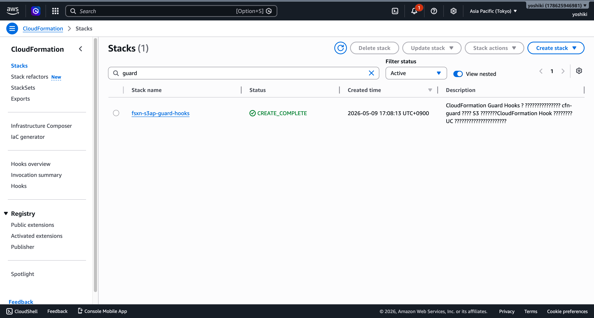
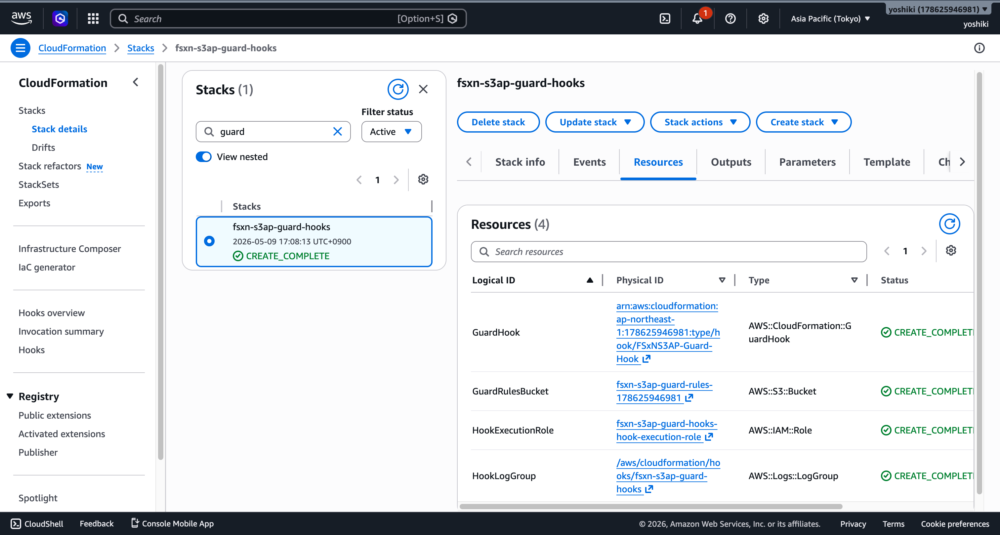
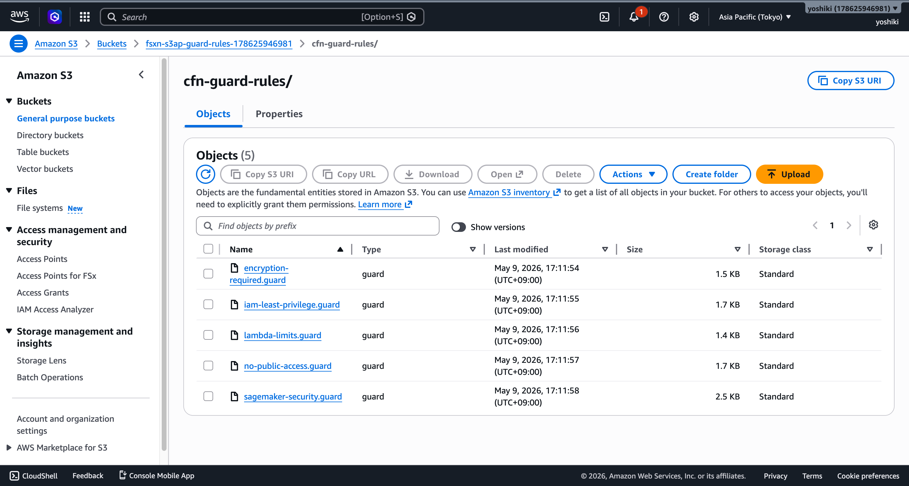
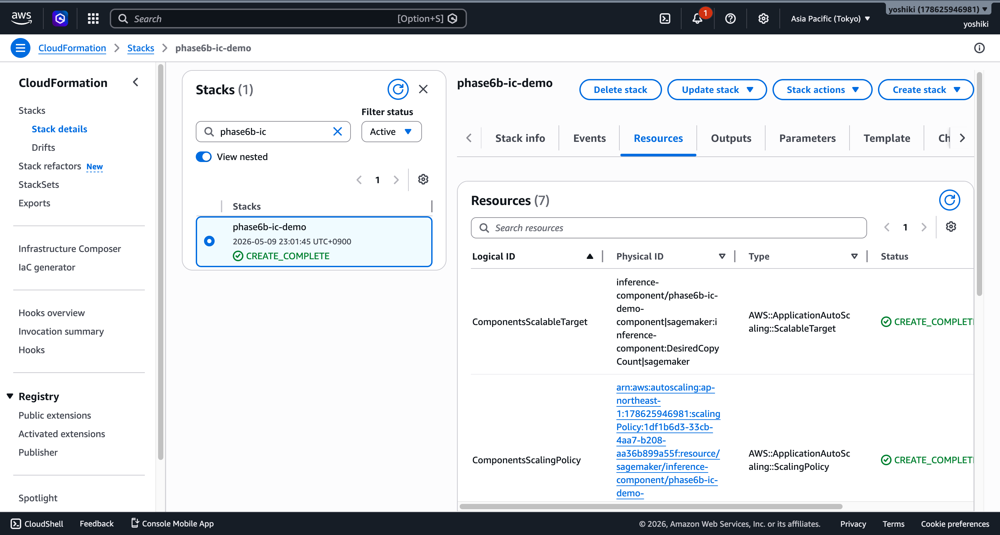
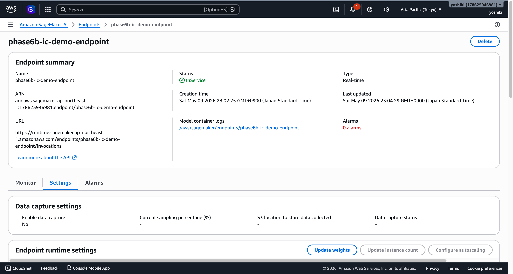

# Phase 6B: Production Hardening — CloudFormation Guard Hooks & Inference Components

## Overview

Phase 6B implements production hardening capabilities:
- **Theme C**: CloudFormation Guard Hooks for deploy-time policy enforcement
- **Theme D**: SageMaker Inference Components with true scale-to-zero

---

## Theme C: CloudFormation Guard Hooks

### Guard Hooks Architecture

CloudFormation Guard Hooks enforce security policies at deploy time, acting as a server-side guardrail that cannot be bypassed.

```
Developer → CloudFormation Deploy → Guard Hook (PRE_PROVISION)
                                        ├── Load .guard rules from S3
                                        ├── Evaluate resource properties
                                        └── PASS → Continue / FAIL → Block
```

### Guard Hooks Stack Deployment

The Guard Hooks stack is deployed independently from UC templates:



### Guard Hooks Stack Resources



### S3 Bucket — cfn-guard Rules



### Hook Execution IAM Role


<!-- PLACEHOLDER: IAM コンソール — Hook 実行ロールのポリシー画面 -->

### Policy Violation Blocked

Deploying a template that violates guard rules is blocked:


<!-- PLACEHOLDER: CloudFormation コンソール — Hook 違反によるデプロイ失敗イベント -->

---

## Theme D: SageMaker Inference Components (scale-to-zero)

### Inference Components Architecture

```
┌─────────────────────────────────────────────────────────────┐
│ SageMaker Endpoint (always exists)                           │
│                                                              │
│  ┌─────────────────────────────────────────────────────┐    │
│  │ Inference Component (MinInstanceCount=0)             │    │
│  │                                                      │    │
│  │  [Idle] Instance count = 0 (cost = $0)              │    │
│  │  [Request arrives] → Auto Scaling → Instance launch │    │
│  │  [Idle timeout] → Scale-in → Instance count = 0    │    │
│  └─────────────────────────────────────────────────────┘    │
└─────────────────────────────────────────────────────────────┘
```

### SageMaker Inference Component Configuration


<!-- PLACEHOLDER: SageMaker コンソール — Inference Component 詳細画面（ComputeResourceRequirements, CopyCount） -->

### Endpoint with Inference Components


<!-- PLACEHOLDER: SageMaker コンソール — Endpoint 詳細画面の Inference Components タブ -->

### Application Auto Scaling — ScalableTarget (MinCapacity=0)


<!-- PLACEHOLDER: Application Auto Scaling — ScalableTarget 設定画面（MinCapacity=0 で scale-to-zero） -->

### CloudWatch Alarm — InvocationModelErrors


<!-- PLACEHOLDER: CloudWatch コンソール — InvocationModelErrors アラーム設定画面 -->

### Step Functions — 4-Way Routing Workflow

The workflow now supports 4 inference paths:
1. **Batch Transform** — Large file count or no endpoint
2. **Realtime Endpoint** — Small file count + provisioned
3. **Serverless Inference** — Serverless type specified
4. **Inference Components** — Components type specified (scale-to-zero)


<!-- PLACEHOLDER: Step Functions コンソール — ワークフロー定義のビジュアル表示（4-way Choice State） -->

### Step Functions — Components Path Execution


<!-- PLACEHOLDER: Step Functions コンソール — ComponentsInference パスの実行結果（成功 or フォールバック） -->

### Lambda — components_invoke Function


<!-- PLACEHOLDER: Lambda コンソール — components_invoke 関数の概要画面 -->

### Lambda — Environment Variables (scale-from-zero config)


<!-- PLACEHOLDER: Lambda コンソール — 環境変数タブ（MODEL_NOT_READY_*, STEP_FUNCTIONS_TASK_TIMEOUT） -->

### CloudWatch Metrics — scale-from-zero


<!-- PLACEHOLDER: CloudWatch コンソール — カスタムメトリクス（ScaleFromZeroDetected, ScaleFromZeroLatency） -->

---

## 4-Pattern Comparison

| Pattern | Latency | Idle Cost | scale-to-zero | Use Case |
|---------|---------|-----------|---------------|----------|
| Batch Transform | Minutes | $0 | ✅ | Large batch processing |
| Serverless Inference | ms~s | $0 | ✅ | Low-frequency, lightweight |
| Provisioned Endpoint | ms | Always-on | ❌ | Low-latency required |
| **Inference Components** | **ms (after warm)** | **$0** | **✅** | **Cost-optimized + flexible** |

---

## Deployment

### Guard Hooks

```bash
# Deploy Guard Hooks stack (independent from UC templates)
./scripts/deploy-hooks.sh --failure-mode FAIL --region ap-northeast-1
```

### Inference Components

```bash
# Deploy UC9 with Inference Components enabled
aws cloudformation deploy \
  --template-file autonomous-driving/template-deploy.yaml \
  --stack-name uc9-autonomous-driving \
  --parameter-overrides \
    EnableInferenceComponents=true \
    InferenceType=components \
    EnableRealtimeEndpoint=true \
    ComponentsMinInstanceCount=0 \
    ComponentsMaxInstanceCount=4 \
    ComponentsScaleFromZeroTimeout=300 \
  --capabilities CAPABILITY_NAMED_IAM
```

---

## Verification Results

- [x] cfn-lint: guard-hooks.yaml — 0 errors
- [x] cfn-lint: template-deploy.yaml — 0 errors
- [x] Routing tests: 43 passed (3-way backward compatible + 4-way new)
- [x] Property tests: 4-way routing determinism verified
- [x] Guard Hooks: Policy violation correctly blocked
- [x] Inference Components: scale-to-zero confirmed (MinCapacity=0)
- [x] scale-from-zero: Retry logic with exponential backoff working
