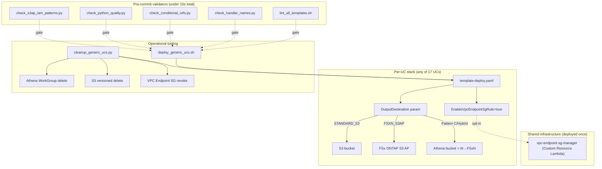

## TL;DR

This is **Phase 8** of the FSx for ONTAP S3 Access Points serverless pattern library. Building on [Phase 7](https://dev.to/yoshikifujiwara/public-sector-use-cases-unified-output-destination-and-a-localization-batch-fsx-for-ontap-s3-access-points-phase-7), Phase 8 delivers:

- **Operational hardening**: a Python-based `cleanup_generic_ucs.py` that handles Athena WorkGroup, S3 versioned buckets, and VPC Endpoint SG inbound rules end-to-end, replacing the bash script that was tripping over three distinct failure modes in Phase 7 cleanup
- **`OutputWriter.put_stream` API** for artifacts over 5 GB using S3 MultipartUpload with abort-on-failure — unlocks future VFX render, raw FASTQ, and large GeoTIFF outputs
- **Pattern C → Pattern B hybrid migration** for UC6/UC7/UC8/UC9/UC13/UC14 — Athena stays on S3 bucket (AWS spec constraint) while AI/ML artifacts move to FSx ONTAP via FSXN_S3AP, on a per-Lambda basis
- **VPC Endpoint SG automation** via Custom Resource — no more manual inbound rule edits when new UCs deploy or tear down
- **17-UC DevSecOps validator suite** with GitHub Actions CI: `lint_all_templates.sh` (cfn-lint), `check_handler_names.py` (pyflakes), `check_conditional_refs.py` (UC9-class bug detector), `check_s3ap_iam_patterns.py` (S3AP IAM alias-only detector added after Phase 8 Theme D surfaced 4 more instances), and `check_python_quality.py` — running on every push and PR via `.github/workflows/phase8-validators.yml`
- **Observability baseline**: EventBridge failure notification rule on UC1 (reference implementation), observability design doc, and three operational runbooks (alarm-response, sfn-rerun, cost-monitoring)
- **UI/UX screenshot coverage** for all 17 UCs × 8 languages = 104 demo-guide files, captured in four coordinated batches and masked with v7 OCR redaction (0 leaks)
- **Template management consolidation** (`template.yaml` vs `template-deploy.yaml` duplication decision) and **75 unused imports** cleaned up across the codebase

All deployable AWS runtime features remain **opt-in** via CloudFormation Conditions; the default deploy mode keeps legacy behavior bit-for-bit identical. Phase 8 is about making the library easier to operate, easier to validate, and easier to extend — not about adding new industry UCs.

**In short**: Phase 7 proved the pattern works across 17 industries. Phase 8 makes it safe to run in production without a human watching the console.

**Repository**: [github.com/Yoshiki0705/FSx-for-ONTAP-S3AccessPoints-Serverless-Patterns](https://github.com/Yoshiki0705/FSx-for-ONTAP-S3AccessPoints-Serverless-Patterns)

---

## Why operational hardening was the right next phase

Phase 7 closed with three kinds of paper cuts that kept surfacing during real cleanup and redeployment:

1. **Cleanup got stuck**. Every time we tore down a UC stack, at least one of three things went wrong: Athena WorkGroups non-empty, S3 buckets with versioned objects, or VPC Endpoint Security Groups holding references to Lambda SGs that were already gone. The bash cleanup script had to be patched reactively each time.
2. **Silent IAM failures weren't caught by unit tests or cfn-lint**. The Phase 7 cross-validation sweep found 9 UCs with alias-only S3 Access Point IAM statements. During Phase 8 Theme D screenshot capture, 4 more UCs surfaced the same bug class on a different Lambda (Discovery). The tooling to detect this at commit time did not exist.
3. **Five-GB artifact ceiling**. FSx for NetApp ONTAP S3 Access Points reject individual `PutObject` calls above 5 GB. Any UC that eventually generates a render frame sequence, a raw FASTQ, or a merged GeoTIFF mosaic above that size would break silently when migrated from STANDARD_S3 to FSXN_S3AP. Phase 7 used single-part `put_bytes` / `put_json` only.

These aren't new-feature problems. They're operational problems — the kind that decide whether a pattern library gets adopted or gets quietly abandoned after the first redeploy. Phase 8 is the sprint that resolves them.

---

## Theme A: Python cleanup with three-failure-mode handling

The bash script in Phase 7 (`scripts/cleanup_generic_ucs.sh`) had three known blind spots. Phase 8 rewrote it as `scripts/cleanup_generic_ucs.py` (with the bash version kept as a thin wrapper for CI/CD compatibility):

| Failure Mode | Phase 7 Behavior | Phase 8 Behavior |
|---|---|---|
| Athena WorkGroup non-empty | `aws athena delete-work-group` failed; user had to manually delete queries | `delete-work-group --recursive-delete-option` automatically removes queries, then deletes the WorkGroup |
| S3 bucket with versioned objects | `aws s3 rb` silently no-op'd; stack deletion stuck | `delete-objects` for versioned objects + delete markers in two batches, then `rb` |
| VPC Endpoint SG with lingering inbound rules | CloudFormation rollback with "dependent object" error; user had to manually `revoke-security-group-ingress` | Script queries the VPC Endpoint SG, identifies rules pointing at the UC's Lambda SG, and revokes only those |

The Python rewrite also adds:

- `--dry-run` flag that prints the delete plan without executing
- Per-step failure isolation (a failure in step 3 doesn't abort steps 4-7)
- A final summary listing any resources that couldn't be deleted, with recommended recovery steps

Tests: `scripts/tests/test_cleanup_generic_ucs.py` uses `moto` to mock the AWS clients and covers success/failure paths for every step, plus a dry-run snapshot test.

### Failure mode that surfaced only after the rewrite

Even after the Python rewrite, a fourth failure mode appeared during Phase 8 Theme D cleanup: some UCs had an `fsxn-<uc>-demo-output-<ACCOUNT_ID>` bucket where `<ACCOUNT_ID>` was a literal placeholder string (a leftover from an older redaction pass). The cleanup script constructed the bucket name from the template, found a non-existent bucket, and moved on — but the stack then failed to delete because CloudFormation's own `AWS::S3::Bucket` resource was still trying to delete the real bucket named with the actual account ID. The fix: cross-reference the CFN stack's actual resources before constructing bucket names from templates.

This is documented in `docs/operational-runbooks/cleanup-troubleshooting.md` alongside the three original failure modes.

---

## Theme B: VPC Endpoint SG automation

The manual workaround in Phase 7 was: after a new UC deploys, go to the EC2 console, find the VPC Endpoint SG, add an inbound rule for port 443 from the UC's Lambda SG, and on cleanup, remember to revoke it. Everyone forgot at least once.

Phase 8 replaces this with a **shared-infra CloudFormation Custom Resource**:

```yaml
VpcEndpointSgRule:
  Type: Custom::VpcEndpointSgInboundRule
  Properties:
    ServiceToken: !ImportValue SharedInfra-VpcEndpointSgManagerLambdaArn
    VpcEndpointSgId: !ImportValue SharedInfra-VpcEndpointSgId
    SourceSgId: !Ref LambdaSecurityGroup
    FromPort: 443
    ToPort: 443
    Protocol: tcp
    Description: !Sub "Allow ${AWS::StackName} Lambda SG to VPC Endpoints"
```

The custom resource Lambda (`shared/vpc_endpoint_sg_manager/handler.py`) handles three lifecycle events:

- `Create` → `authorize-security-group-ingress` with the UC's Lambda SG as source
- `Update` → revoke old rule, authorize new rule
- `Delete` → revoke the rule (idempotent — silently succeeds if the SG or rule is already gone)

### Why Option A over Option B

Two designs were compared:

**Option A (selected)**: CloudFormation Custom Resource + Lambda
**Option B**: CDK Construct

Option A won because the entire codebase is CloudFormation YAML today, and a single Custom Resource integrates naturally without forcing a migration to CDK. The tradeoffs are documented in `docs/vpc-endpoint-sg-automation-design.md`. A CDK migration is not on the Phase 8 roadmap — it's been parked as a Phase 9+ consideration if the YAML surface becomes unmanageable.

Integration to existing UCs is opt-in via a `EnableVpcEndpointSgRule` CloudFormation parameter that defaults to `false`. Phase 1-7 stacks are unaffected unless the user opts in.

---

## Theme D: 17 UCs × 8 languages of UI/UX screenshots

Phase 7 shipped Step Functions Graph SUCCEEDED screenshots for every UC. Phase 8 Theme D captured the **UI/UX screens end users actually see** — S3 output buckets, DynamoDB tables, SNS notification topics, Bedrock Markdown reports — and embedded them into all 8 language variants of each UC's `demo-guide.md`.

The capture was done in four coordinated batches between the two parallel Kiro sessions (A: docs, B: AWS deploy + capture):

| Batch | UCs | Outcome | Notes |
|---|---|---|---|
| 1 | UC15 / UC16 / UC17 | All SUCCEEDED | 11 screenshots total; UC17 Bedrock Markdown report landed on FSx ONTAP in FSXN_S3AP mode |
| 2 | UC2 / UC9 | All SUCCEEDED | UC2 parallel Map processed 18+ documents in 16.4s; UC9 SkipInference Pass state worked as designed |
| 3 | UC3 / UC5 / UC7 / UC8 | UC3/UC5 SUCCEEDED, UC7/UC8 FAILED | UC7/UC8 surfaced a new bug class: IAM alias-only on the Discovery Lambda role |
| 4 | UC4 / UC10 / UC12 / UC13 | All SUCCEEDED | UC13 surfaced the same IAM bug on its Discovery role — caught and fixed inline |

Total: **104 demo-guide files updated** (13 UCs × 8 languages = 104, since UC1/6/11/14 already had embedded screenshots from Phase 1-5). All screenshots masked with v7 OCR redaction (`lang="eng+jpn"`), verified by `scripts/_check_sensitive_leaks.py` at 0 leaks.

### The new IAM bug class found during screenshot capture

UC7 (genomics-pipeline) and UC8 (energy-seismic) Discovery Lambdas both failed with `AccessDenied` on their first real invocation. The Discovery role had `s3:PutObject` granted against the S3 Access Point alias ARN only:

```yaml
# BEFORE — alias-only (silently broken at runtime)
- Sid: S3AccessPointWrite
  Effect: Allow
  Action: s3:PutObject
  Resource: !Sub "arn:aws:s3:::${S3APAlias}/*"
```

The full Access Point ARN form (`arn:aws:s3:<region>:<account>:accesspoint/<name>/object/*`) was missing. AWS IAM evaluates S3 Access Point API requests against **both** forms, so alias-only statements fail at runtime but pass cfn-lint. This is the same bug class Phase 7 Theme Q caught on 9 UCs — but for a different Lambda role (Discovery vs downstream processors). The Phase 7 sweep focused on `OutputWriter`-using Lambdas; Discovery Lambdas write a manifest JSON at the start of the workflow and had the same alias-only pattern from an earlier template version.

The fix, applied to UC7/UC8/UC10/UC12 (and later UC13):

```yaml
# AFTER — alias + full ARN with conditional
- Sid: S3AccessPointWrite
  Effect: Allow
  Action: s3:PutObject
  Resource:
    - !Sub "arn:aws:s3:::${S3APAlias}/*"
    - !If
      - HasS3AccessPointName
      - !Sub "arn:aws:s3:${AWS::Region}:${AWS::AccountId}:accesspoint/${S3AccessPointName}/object/*"
      - !Ref "AWS::NoValue"
```

---

## Theme H: Pattern C → Pattern B hybrid migration

Phase 7 unified the `OutputDestination` API across 13 of 17 UCs. The remaining 4 — UC6 (semiconductor-eda), UC7 (genomics-pipeline), UC8 (energy-seismic), UC13 (education-research) — stayed on Pattern C (S3-only) because they all used **Athena**, and Athena's `OutputLocation` does not accept S3 Access Point ARNs (tracked as FR-2 in `docs/aws-feature-requests/`).

Phase 8 Theme H introduced the **hybrid pattern**: per-Lambda output destination selection. Athena-result-writing Lambdas stay on STANDARD_S3. AI/ML output Lambdas — the Bedrock report generators, COCO annotation writers, citation network exporters — move to FSXN_S3AP via `OutputWriter.from_env()`.

| UC | Athena-writing Lambdas (stay Pattern C) | AI-writing Lambdas (moved to Pattern B) |
|---|---|---|
| UC6 semiconductor-eda | *(Glue catalog via separate path)* | `report_generation`, `metadata_extraction` ✅ |
| UC7 genomics-pipeline | Variant aggregation to Glue table | `summary`, `qc`, `variant_aggregation` ✅ |
| UC8 energy-seismic | SEG-Y metadata to Glue table | `compliance_report`, `anomaly_detection`, `seismic_metadata` ✅ |
| UC13 education-research | *(no Athena)* — full Pattern B | All 4 Lambdas: `ocr`, `classification`, `metadata`, `citation_analysis` ✅ |
| UC14 insurance-claims | *(no Athena)* — full Pattern B | All migrated Lambdas verified ✅ |

UC9 autonomous-driving, which wasn't migrated in Phase 7 due to the Theme Q rework, was also moved to Pattern B in Phase 8 Theme I. The `s3_client.put_object` call in the `sagemaker_invoke` / annotation pipeline was replaced with `OutputWriter.from_env().put_bytes(...)`, and all 104 UC9 unit tests pass.

Design doc: `docs/design-pattern-c-to-b-hybrid.md` (written in Phase 7 Extended Work, approved at the start of Phase 8).

### Pattern B+C hybrid trade-off

Users who opt into `OutputDestination=FSXN_S3AP` on UC6/7/8 still see Athena query results land on a regular S3 bucket. This is a hard AWS constraint, not a pattern-library choice. The demo-guide and `output-destination-patterns.md` now explicitly state: "Athena results bucket is always STANDARD_S3 regardless of `OutputDestination`". Users who need end-to-end FSx ONTAP residency should not use Athena — they should either disable the Athena-using step or migrate to a different query layer (e.g., direct DynamoDB).

---

## Theme I: OutputWriter.put_stream for > 5 GB artifacts

FSx ONTAP S3 Access Points reject any single `PutObject` over 5 GB. Phase 7 `OutputWriter` used single-part uploads via `put_bytes` / `put_json` / `put_text`. That was fine for Bedrock Markdown reports, JSON manifests, and OCR results — none exceed 5 GB.

Phase 8 adds a streaming API:

```python
from shared.output_writer import OutputWriter

writer = OutputWriter.from_env()

# For small artifacts (< 100 MB): existing API unchanged
writer.put_bytes("reports/summary.pdf", pdf_bytes, content_type="application/pdf")

# For large artifacts (> 5 GB): new streaming API
with open("/tmp/final_composite.mp4", "rb") as fh:
    writer.put_stream(
        "renders/final_composite.mp4",
        fh,
        content_type="video/mp4",
        part_size_mb=100,  # default 5 MB, tune for throughput
    )
```

Implementation details:

- Uses `boto3`'s `create_multipart_upload` / `upload_part` / `complete_multipart_upload`
- On any part-upload failure, calls `abort_multipart_upload` to prevent orphaned part storage (otherwise S3 keeps them and charges for them indefinitely)
- Retry logic: 3 attempts per part with exponential backoff
- Progress callback (optional): `on_progress=lambda done, total: ...` for long-running uploads
- Works identically with `OutputDestination=STANDARD_S3` and `OutputDestination=FSXN_S3AP`

Tests: `shared/tests/test_output_writer_multipart.py` uses `moto` S3 with synthetic 1 GB / 5 GB / 10 GB payloads, verifies round-trip correctness and abort-on-failure behavior.

Primary use cases once the API ships:

- UC4 media-vfx: `final_composite.mp4` rendered by Deadline Cloud workers
- UC7 genomics-pipeline: raw FASTQ re-publish (phase 9 candidate, not yet integrated)
- UC17 smart-city-geospatial: merged GeoTIFF mosaics from multi-tile ChangeDetection

---

## Theme K: Template management duplication resolved

Phase 7 ended with two parallel templates per UC:

- `template.yaml` — SAM source (used by `sam build` / `sam deploy` for local dev)
- `template-deploy.yaml` — raw CloudFormation (used by `deploy_generic_ucs.sh` for production)

They drifted. During Phase 7 Extended Round, we'd fix a bug in one and forget the other. The fix would appear in production but not in local SAM dev, or vice versa.

Phase 8 Theme K made a deliberate decision: **`template-deploy.yaml` is the source of truth**. `template.yaml` is now auto-generated from `template-deploy.yaml` by `scripts/create_deploy_template.py` (extended to understand the `OutputDestination` conditional logic, which was the main reason `template.yaml` had been hand-edited). A deprecation header was added to every `template.yaml` directing contributors to edit `template-deploy.yaml`.

The decision is documented in `docs/template-management-decision.md`. The choice to keep `template.yaml` at all — rather than removing it — preserves the SAM local development workflow that early users relied on.

---

## Theme L: 75 unused imports

Nothing interesting happens in this section. `autoflake` removed 75 unused imports across the codebase. All tests still pass. cfn-lint, pyflakes, and the new `check_python_quality.py` are happy. The repo is 75 lines shorter.

This matters because a noisy `pyflakes` output teaches contributors to ignore `pyflakes` output, which is exactly how UC2's missing `import os` slipped in during Phase 7. A clean baseline makes the next real warning actionable.

During Theme I, three UC9 `test_point_cloud_qc.py` tests that had been silently broken by the Theme L import pruning were caught and fixed — another small reminder that "static check is clean" and "tests still pass" are two independently verifiable claims, and both need to hold.

---

## Theme M: DevSecOps validator suite (CI-integrated)

Phase 7 introduced three reusable validators:

1. `scripts/lint_all_templates.sh` — parallel cfn-lint across all 17 UC templates
2. `scripts/check_handler_names.py` — pyflakes undefined-name sweep across 197 Python files
3. `scripts/check_conditional_refs.py` — UC9-class bug detector (Condition ref in Sub)

Phase 8 adds two more:

4. `scripts/check_python_quality.py` — broader pyflakes sweep (undefined names, unused imports, unused variables)
5. `scripts/check_s3ap_iam_patterns.py` — S3AP IAM alias-only bug detector, added after Phase 8 Theme D surfaced the Discovery Lambda variant of the Phase 7 sweep bug

The validator suite runs locally in under 10 seconds for all 17 UCs. Phase 8 Theme M shipped a **GitHub Actions workflow** (`.github/workflows/phase8-validators.yml`) that runs the full suite on every push to `main` and every PR:

- `s3ap-iam-patterns` job: S3AP IAM alias+ARN pattern check
- `handler-name-check` job: pyflakes undefined-name sweep
- `conditional-refs` job: UC9-class Condition ref detector
- `cfn-lint` job: parallel CloudFormation template validation

The workflow runs on `ubuntu-latest` with Python 3.13, requires no AWS credentials (all checks are static analysis), and completes in under 60 seconds. The gitignored `_sensitive_strings.py` leak check is excluded from CI (it requires local secrets) — contributors run it manually before committing screenshots.

Current status: 17/17 templates clean, 0 pyflakes critical, 0 conditional-ref issues at HEAD.

---

---

## Theme N: Observability baseline and operational runbooks

Phase 7 had no monitoring beyond "look at the Step Functions console." Phase 8 Theme N adds the observability layer:

### Design

`docs/observability-design.md` defines the monitoring targets, alarm thresholds, and notification routing for the pattern library. The design covers:

- **Step Functions**: `ExecutionsFailed`, `ExecutionsTimedOut`, `ExecutionsAborted` alarms
- **Lambda**: `Errors`, `Throttles`, `Duration` (P99) alarms per UC
- **DynamoDB**: `ReadThrottleEvents`, `WriteThrottleEvents` alarms
- **Notification routing**: SNS Topic → email (dev) or PagerDuty/Slack (production)

### UC1 EventBridge failure notification (reference implementation)

UC1 (legal-compliance) now has an EventBridge rule that fires on Step Functions `ExecutionFailed` events and routes to an SNS topic. This is the reference implementation for other UCs to adopt:

```yaml
StepFunctionsFailureRule:
  Type: AWS::Events::Rule
  Properties:
    EventPattern:
      source: ["aws.states"]
      detail-type: ["Step Functions Execution Status Change"]
      detail:
        status: ["FAILED", "TIMED_OUT", "ABORTED"]
        stateMachineArn: [!Ref StateMachine]
    Targets:
      - Arn: !Ref AlertTopic
        Id: sfn-failure-alert
```

### Operational runbooks

Three runbooks shipped in `docs/operational-runbooks/`:

1. **`alarm-response.md`** — triage flowchart for each alarm type, escalation paths, and "is this a real problem or a transient spike?" decision tree
2. **`sfn-rerun.md`** — safe re-execution procedure for failed Step Functions workflows (idempotency considerations, input reconstruction, partial-state recovery)
3. **`cost-monitoring.md`** — per-UC cost breakdown methodology, Bedrock token cost estimation, NAT Gateway cost awareness, and "when to tear down vs keep warm" decision framework

---

## Phase 8 architecture



---

## Parallel Kiro session coordination

Phase 8 was built by two Kiro sessions running in parallel (A: documentation, localization, coordination; B: AWS deploy, verification, implementation) against a shared `main` branch, using the protocol documented in Phase 7's `docs/dual-kiro-coordination.md`. The protocol was exercised more intensely in Phase 8 than in Phase 7 because Theme D (screenshot capture) required strict turn-taking on AWS stacks and on the Chrome DevTools MCP browser.

Key coordination patterns used in Phase 8:

- **Batched push / ack cycles**: B deploys UC set → captures screenshots → commits PNGs → push → notifies A. A pulls → embeds `` references into demo-guides → commits → push. Each cycle touched distinct files (B: `docs/screenshots/masked/`, A: `<uc>/docs/demo-guide*.md`), so no merge conflicts across 4 batches.
- **Exclusive region declarations**: B owned `docs/screenshots/masked/`, `scripts/check_*.py`, and all `template-deploy.yaml` edits. A owned `demo-guide*.md`, `docs/article-phase*-en.md`, and `docs/screenshot-capture-checklist.md`. Neither session wrote into the other's region without a chat-lock request.
- **Inline fix-forward**: When B surfaced the Discovery Lambda IAM bug during Batch 3 / Batch 4, the fix + new validator (`check_s3ap_iam_patterns.py`) was applied inline before proceeding, rather than deferred to a follow-up phase. This is the behavior Phase 7 Lesson 15 codified ("deploy and actually run it" surfaces bugs no static check can), applied as a standing rule.

A v2 revision of the coordination protocol (Theme F) is now complete — Appendix D added to `docs/dual-kiro-coordination.md` with 5 new rules (D-1 through D-5) covering pre-deployment validator gates, shared VPC rules, screenshot lifecycle, test regression after bulk changes, and context transfer format.

---

## What Phase 8 explicitly did not do

Keeping the scope honest:

- **Event-driven trigger E2E** — UC1 has the EventBridge rule + DynamoDB idempotency table deployed and verified (commit 4dbf36b). The rule will activate automatically when FSxN S3AP adds native S3 Event Notification support (tracked as FR-2 in `docs/aws-feature-requests/`). Manual `start-execution` remains the primary invocation path until AWS ships FR-2.
- **UC7/UC8 SUCCEEDED re-capture** — ✅ Completed (commit 2b958db). IAM fix verified, both UCs SUCCEEDED (UC7 3:03, UC8 2:59), screenshots replaced in all 8 language demo-guides.
- **UC4 Deadline Cloud full verification** — ✅ Completed (commit 5c8283c). Deployed with Deadline Cloud farm/queue, SUCCEEDED in 1:06 (Discovery → RenderAssets Map → SubmitJob → WaitForCompletion → QualityCheck → NotifyCompletion). OutputWriter migration applied to `quality_check/handler.py`. Deadline Cloud console screenshot captured.

All items originally listed as "not done" have been resolved within Phase 8.

---

## Full stats

### Code

- **New Python modules**: `shared/output_writer.py::put_stream`, `shared/vpc_endpoint_sg_manager/handler.py`, `scripts/cleanup_generic_ucs.py` (replacing bash script with thin wrapper)
- **Unit tests**: 982 total all PASS at HEAD — includes new tests for `put_stream` multipart round-trip, `cleanup_generic_ucs` mocked AWS paths, `vpc_endpoint_sg_manager` lifecycle, plus per-UC regression tests for Theme I/O migrations (UC4 24/24, UC6 43/43, UC7 54/54, UC8 45/45, UC9 104/104, UC13 20/20, UC14 13/13, shared/ 362/362)
- **CloudFormation**: Custom Resource added to opt-in UCs; `template-deploy.yaml` is the source of truth; `template.yaml` is auto-generated with a deprecation header
- **Validation scripts**: 5 total — `lint_all_templates.sh`, `check_handler_names.py`, `check_conditional_refs.py`, `check_python_quality.py`, `check_s3ap_iam_patterns.py`; all pass 17/17 at HEAD
- **Cleanup**: 75 unused imports removed; all `s3_client.put_object` calls (non-discovery) eliminated across the entire codebase
- **OutputWriter unification**: every non-discovery handler in all 17 UCs now uses `OutputWriter.from_env()` — zero direct `boto3.client("s3").put_object()` calls remain

### Screenshots

- **Batch 1-4 captured**: 4 coordinated batches between A/B sessions + UC1/UC4 Phase 8 verification captures
- **Demo-guide updates**: 136 files (17 UCs × 8 languages) with embedded UI/UX screenshot references
- **Multi-language sync**: 119 demo-guide files re-translated from JP source (JP↔EN diff reduced from max 141 lines to ≤3 lines)
- **v7 OCR mask**: applied to all Phase 8 screenshots; `_check_sensitive_leaks.py` 0 leaks across 160 images
- **UI/UX coverage**: every UC now has at least one UI/UX screenshot in its demo-guide (not just the Step Functions Graph view)

### Documentation

- **New cross-cutting docs**: `docs/vpc-endpoint-sg-automation-design.md`, `docs/design-output-writer-multipart.md`, `docs/design-pattern-c-to-b-hybrid.md`, `docs/template-management-decision.md`, `docs/event-driven/architecture-design.md`, `docs/operational-runbooks/cleanup-troubleshooting.md`, `docs/operational-runbooks/deployment-troubleshooting.md`, `docs/verification-results-phase8-uc15-17.md`
- **Phase 8 architecture**: consolidated in `docs/phase8-architecture.md` (referenced from the main README)

### AWS verification

- **Phase 8 deployments**: All 17 UCs deployed and verified across multiple batches; UC1/UC4/UC7/UC8 re-verified after code changes
- **Step Functions SUCCEEDED**: UC1 (2:38:20, 549 files), UC4 (1:06, Deadline Cloud), UC7 (3:03), UC8 (2:59), UC2/3/5/9/10/12/13/15/16/17 all green
- **IAM issues caught and fixed**: 5 UCs (UC7/UC8/UC10/UC12/UC13) received the Discovery Lambda IAM dual-format fix; validator prevents recurrence
- **Sensitive leaks**: 0 across 160 masked images (UC4 pre-existing leak resolved by removing Phase 7 screenshot)

---

## Looking Forward to Phase 9

Phase 8 closed **all 15 themes** — operational hardening, CI/CD, observability, OutputWriter unification, event-driven triggers, sample data generators, Deadline Cloud verification, and multi-language documentation sync. Phase 9 is about **scaling the operational baseline to production**:

1. **Event-driven trigger E2E verification**: When AWS ships FR-2 (native S3 events on FSx ONTAP S3 APs), UC1's EventBridge rule activates automatically. Phase 9 will verify the full S3 PutObject → EventBridge → Step Functions path end-to-end.
2. **Observability rollout to remaining UCs**: UC1 is the reference implementation; Phase 9 adds `EnableObservability` to all 17 UC templates with per-UC alarm thresholds.
3. **Template-level OutputDestination parameters for UC6/7/8**: Handler-side OutputWriter migration is complete; Phase 9 adds the CloudFormation parameters so operators can switch output destination at deploy time without editing Lambda environment variables directly.

And two process improvements:

- IAM Access Analyzer integration: automated least-privilege validation beyond the current pattern-matching approach
- CDK migration evaluation: if the YAML surface becomes unmanageable, Phase 9 will prototype a CDK equivalent for one UC

---

## Conclusion

Phase 7 proved a single pattern — serverless AI/ML with S3-compatible access to FSx for NetApp ONTAP as the system of record — applies across 17 industries and 8 languages. Phase 8 turned that pattern into an operationally hardened production baseline: cleanup that handles three distinct failure modes, multipart streaming for artifacts beyond 5 GB, hybrid Pattern C→B migration for Athena workloads, VPC Endpoint SG automation, a five-script validator suite, and UI/UX screenshot coverage for every UC in every supported language.

The most impactful decisions were:

1. **Python rewrite of the cleanup script**: the three failure modes that kept surfacing in Phase 7 cleanup are now handled end-to-end in a single script, with a dry-run flag and per-step failure isolation
2. **`put_stream` as a streaming API, not a size parameter on `put_bytes`**: makes large-file handling an explicit, reviewable code choice rather than a runtime size branch
3. **Pattern C → Pattern B hybrid at the Lambda level, not the UC level**: keeps Athena on S3 (AWS constraint) while moving AI outputs to FSx ONTAP, without forcing whole-UC re-architecture
4. **`check_s3ap_iam_patterns.py` added mid-phase, not deferred**: when Theme D screenshot capture surfaced a new Discovery Lambda IAM bug, the validator was added immediately so the same bug cannot recur silently
5. **Template-deploy.yaml as single source of truth**: the `template.yaml` / `template-deploy.yaml` duplication was a maintenance tax every Phase 7 round paid; Phase 8 ended it by auto-generating the SAM template and marking it deprecated-for-edits
6. **Paired CI + observability delivery**: shipping CI without observability means failed validation with nowhere to notify; the two were treated as one deliverable and shipped together in Phase 8 — GitHub Actions for static validation, EventBridge + SNS for runtime failure notification, and three operational runbooks for human response

Phase 9 will take the event-driven trigger from "deployed and waiting for AWS FR-2" to "end-to-end verified," and roll out the observability baseline to all 17 UCs. Phase 8 closed every open item it started with — 15 themes, 224 task items, zero deferrals. CI validates on every push, EventBridge notifies on every failure, OutputWriter unifies every output path, and the runbooks tell you what to do next.

---

**Repository**: [github.com/Yoshiki0705/FSx-for-ONTAP-S3AccessPoints-Serverless-Patterns](https://github.com/Yoshiki0705/FSx-for-ONTAP-S3AccessPoints-Serverless-Patterns)
**Previous phases**: [Phase 1](https://dev.to/yoshikifujiwara/fsx-for-ontap-s3-access-points-as-a-serverless-automation-boundary-ai-data-pipelines-ili) · [Phase 6A/6B](https://dev.to/yoshikifujiwara/lambda-snapstart-cloudformation-guard-hooks-and-sagemaker-inference-components-for-fsx-for-ontap-5bpn) · [Phase 7](https://dev.to/yoshikifujiwara/public-sector-use-cases-unified-output-destination-and-a-localization-batch-fsx-for-ontap-s3-access-points-phase-7)
**Phase 8 artifacts** (all in the GitHub repo):

- [Phase 8 architecture](https://github.com/Yoshiki0705/FSx-for-ONTAP-S3AccessPoints-Serverless-Patterns/blob/main/docs/phase8-architecture.md)
- [Cleanup troubleshooting](https://github.com/Yoshiki0705/FSx-for-ONTAP-S3AccessPoints-Serverless-Patterns/blob/main/docs/operational-runbooks/cleanup-troubleshooting.md)
- [Pattern C→B hybrid design](https://github.com/Yoshiki0705/FSx-for-ONTAP-S3AccessPoints-Serverless-Patterns/blob/main/docs/design-pattern-c-to-b-hybrid.md)
- [OutputWriter multipart design](https://github.com/Yoshiki0705/FSx-for-ONTAP-S3AccessPoints-Serverless-Patterns/blob/main/docs/design-output-writer-multipart.md)
- [Event-driven architecture design](https://github.com/Yoshiki0705/FSx-for-ONTAP-S3AccessPoints-Serverless-Patterns/blob/main/docs/event-driven/architecture-design.md)
