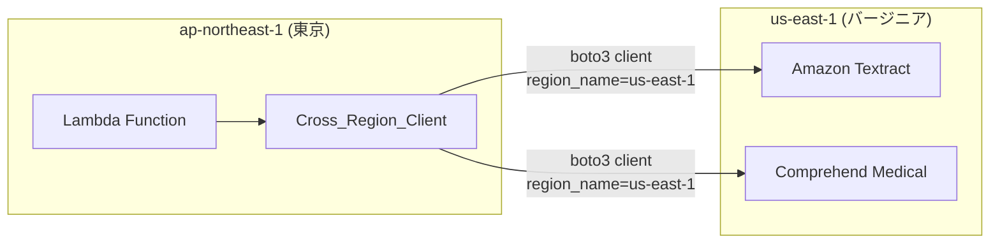

# クロスリージョン設定ガイド

## 概要

Amazon Textract と Amazon Comprehend Medical は ap-northeast-1（東京）リージョンで利用できません。本ガイドでは、東京リージョンにデプロイした FSxN S3AP パターンからこれらのサービスをクロスリージョンで利用する方法を説明します。

## 対象ユースケース

| UC | サービス | クロスリージョン先 | 用途 |
|----|---------|-----------------|------|
| UC2 | Textract | us-east-1 | 契約書・請求書 OCR |
| UC5 | Comprehend Medical | us-east-1 | DICOM PHI 検出 |
| UC7 | Comprehend Medical | us-east-1 | バイオメディカルエンティティ抽出 |
| UC10 | Textract | us-east-1 | 図面 PDF OCR |
| UC12 | Textract | us-east-1 | 配送伝票 OCR |
| UC13 | Textract | us-east-1 | 論文 PDF テキスト抽出 |
| UC14 | Textract | us-east-1 | 見積書 OCR |

## 対応リージョン一覧

### Amazon Textract

| リージョン | コード | 推奨 |
|-----------|--------|------|
| US East (N. Virginia) | `us-east-1` | ✅ 推奨 |
| US East (Ohio) | `us-east-2` | ○ |
| US West (Oregon) | `us-west-2` | ○ |
| EU (Ireland) | `eu-west-1` | ○ |
| EU (London) | `eu-west-2` | ○ |
| EU (Frankfurt) | `eu-central-1` | ○ |
| Asia Pacific (Singapore) | `ap-southeast-1` | ○ |
| Asia Pacific (Sydney) | `ap-southeast-2` | ○ |

> 最新の対応リージョンは [AWS ドキュメント](https://docs.aws.amazon.com/general/latest/gr/textract.html) を参照してください。

### Amazon Comprehend Medical

| リージョン | コード | 推奨 |
|-----------|--------|------|
| US East (N. Virginia) | `us-east-1` | ✅ 推奨 |
| US East (Ohio) | `us-east-2` | ○ |
| US West (Oregon) | `us-west-2` | ○ |
| EU (Ireland) | `eu-west-1` | ○ |
| Asia Pacific (Sydney) | `ap-southeast-2` | ○ |

> 最新の対応リージョンは [AWS ドキュメント](https://docs.aws.amazon.com/general/latest/gr/comprehend-med.html) を参照してください。

## 設定手順

### 1. CloudFormation パラメータの設定

Phase 2 UC のテンプレートには `CrossRegionTarget` パラメータが含まれています。

```bash
aws cloudformation deploy \
  --template-file <uc-directory>/template.yaml \
  --stack-name fsxn-<uc-name> \
  --parameter-overrides \
    CrossRegionTarget=us-east-1 \
    ... \
  --capabilities CAPABILITY_IAM CAPABILITY_AUTO_EXPAND \
  --region ap-northeast-1
```

### 2. Lambda 環境変数の確認

デプロイ後、対象 Lambda 関数の環境変数に以下が設定されていることを確認します。

```bash
aws lambda get-function-configuration \
  --function-name <function-name> \
  --query 'Environment.Variables.CROSS_REGION_TARGET' \
  --output text
# 期待値: us-east-1
```

### 3. IAM ロールの確認

クロスリージョン呼び出しを行う Lambda の IAM ロールに、ターゲットリージョンのサービスへのアクセス権限が付与されていることを確認します。

```json
{
  "Effect": "Allow",
  "Action": [
    "textract:AnalyzeDocument",
    "textract:DetectDocumentText"
  ],
  "Resource": "*"
}
```

> IAM ポリシーはリージョンに依存しないため、追加のリージョン固有設定は不要です。

## Cross_Region_Client の仕組み

### アーキテクチャ



### 使用方法

```python
from shared import CrossRegionClient, CrossRegionConfig

# 設定（Lambda 環境変数から取得）
config = CrossRegionConfig(
    target_region=os.environ.get("CROSS_REGION_TARGET", "us-east-1"),
    services=["textract", "comprehendmedical"]
)

# クライアント生成
client = CrossRegionClient(config)

# Textract 呼び出し
textract_response = client.analyze_document(
    document_bytes=pdf_bytes,
    feature_types=["TABLES", "FORMS"]
)

# Comprehend Medical 呼び出し
medical_response = client.detect_entities_v2(text=medical_text)
```

### エラーハンドリング

```python
from shared import CrossRegionClientError

try:
    result = client.analyze_document(document_bytes=pdf_bytes)
except CrossRegionClientError as e:
    print(f"Cross-region error: region={e.target_region}, service={e.service_name}")
    print(f"Original error: {e.original_error}")
    # フォールバック処理またはリトライ
```

## データレジデンシーに関する注意事項

クロスリージョン呼び出しでは、処理対象のデータが別リージョンに転送されます。

### 確認すべき事項

1. **データ分類**: 転送するデータに個人情報（PII）、保護対象医療情報（PHI）、機密情報が含まれるか
2. **コンプライアンス要件**: GDPR、HIPAA、FISC 等の規制でデータの地理的制約があるか
3. **組織ポリシー**: 社内のデータガバナンスポリシーでリージョン間転送が許可されているか

### 対策

- **PHI を含む UC7（ゲノミクス）**: Comprehend Medical に送信するテキストから直接的な患者識別情報を除去してから送信
- **PII を含む UC14（保険）**: 見積書 OCR 結果のログ出力を制限（`LogExcludePatterns` 設定）
- **安全記録を含む UC10（建設）**: 図面 PDF の OCR 結果に含まれる個人名等をマスク

## トラブルシューティング

### 問題 1: AccessDeniedException

**症状**: `An error occurred (AccessDeniedException) when calling the AnalyzeDocument operation`

**原因**: Lambda の IAM ロールに Textract / Comprehend Medical へのアクセス権限がない

**解決**:
```bash
# Lambda の IAM ロールを確認
aws lambda get-function-configuration \
  --function-name <function-name> \
  --query 'Role' --output text

# ロールのポリシーを確認
aws iam list-attached-role-policies --role-name <role-name>
aws iam list-role-policies --role-name <role-name>
```

### 問題 2: EndpointConnectionError

**症状**: `Could not connect to the endpoint URL: "https://textract.us-east-1.amazonaws.com/"`

**原因**: Lambda が VPC 内で実行されており、us-east-1 の Textract エンドポイントに到達できない

**解決**:
- Lambda を VPC 外で実行する（推奨）
- または NAT Gateway 経由でインターネットアクセスを確保する

### 問題 3: InvalidParameterException

**症状**: `Invalid document. The document is not a valid image or PDF.`

**原因**: Textract に送信するドキュメントのフォーマットが不正

**解決**:
- サポートされるフォーマット: JPEG, PNG, PDF, TIFF
- PDF は最大 3000 ページ、ファイルサイズ最大 500 MB
- 画像は最小 50x50 ピクセル

### 問題 4: ThrottlingException

**症状**: `Rate exceeded` エラー

**原因**: Textract / Comprehend Medical の API レート制限に到達

**解決**:
- Step Functions の Map ステートの `MaxConcurrency` を下げる
- Lambda 内でエクスポネンシャルバックオフを実装する（Cross_Region_Client は自動リトライ対応）

### 問題 5: リージョン設定の不一致

**症状**: Lambda が意図しないリージョンの API を呼び出している

**確認**:
```bash
# Lambda 環境変数を確認
aws lambda get-function-configuration \
  --function-name <function-name> \
  --query 'Environment.Variables' --output json

# CloudFormation パラメータを確認
aws cloudformation describe-stacks \
  --stack-name <stack-name> \
  --query 'Stacks[0].Parameters[?ParameterKey==`CrossRegionTarget`].ParameterValue' \
  --output text
```

## レイテンシーに関する考慮事項

クロスリージョン呼び出しでは、リージョン間のネットワークレイテンシーが追加されます。

| ルート | 追加レイテンシー（概算） |
|--------|----------------------|
| ap-northeast-1 → us-east-1 | ~150-200ms |
| ap-northeast-1 → us-west-2 | ~100-150ms |
| ap-northeast-1 → ap-southeast-1 | ~50-80ms |

> Textract の AnalyzeDocument API 自体の処理時間（数秒）と比較すると、リージョン間レイテンシーの影響は軽微です。

## 参考リンク

- [Textract 対応リージョン](https://docs.aws.amazon.com/general/latest/gr/textract.html)
- [Comprehend Medical 対応リージョン](https://docs.aws.amazon.com/general/latest/gr/comprehend-med.html)
- [AWS リージョン間データ転送料金](https://aws.amazon.com/ec2/pricing/on-demand/#Data_Transfer)
- [boto3 クライアント設定](https://boto3.amazonaws.com/v1/documentation/api/latest/guide/configuration.html)

---

## AWS 検証結果 (2026-05-04)

### 検証環境

- ソースリージョン: ap-northeast-1 (東京)
- ターゲットリージョン: us-east-1 (バージニア北部)

### 検証結果

| UC | サービス | 接続テスト | Step Functions E2E | 備考 |
|----|---------|-----------|-------------------|------|
| UC7 | Comprehend Medical | ✅ PASSED | ✅ SUCCEEDED | boto3 クライアント作成テスト + SFN 実行 |
| UC10 | Textract | ✅ PASSED | ✅ SUCCEEDED | boto3 クライアント作成テスト + SFN 実行 |
| UC12 | Textract | ✅ PASSED | ✅ SUCCEEDED | boto3 クライアント作成テスト + SFN 実行 |
| UC13 | Textract | ✅ PASSED | ✅ SUCCEEDED | boto3 クライアント作成テスト + SFN 実行 |
| UC14 | Textract | ✅ PASSED | ✅ SUCCEEDED | boto3 クライアント作成テスト + SFN 実行 |

### 重要な知見

1. **クロスリージョン Lambda は VPC 外に配置**: Textract/Comprehend Medical を呼び出す Lambda は VPC 外で実行する。VPC 内の場合は NAT Gateway が必要
2. **IAM ポリシーはリージョン非依存**: `textract:AnalyzeDocument` 等の IAM アクションはリージョンに依存しないため、追加設定不要
3. **パラメータ名**: テンプレートでは `CrossRegion` パラメータ（デフォルト: `us-east-1`）を使用
