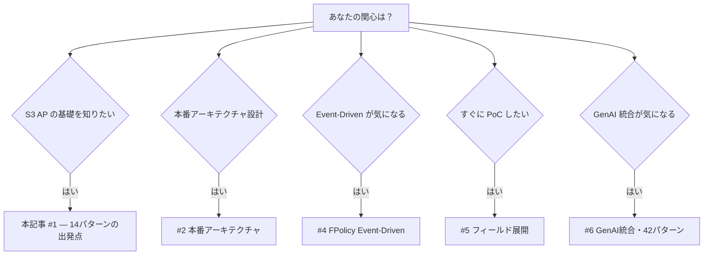
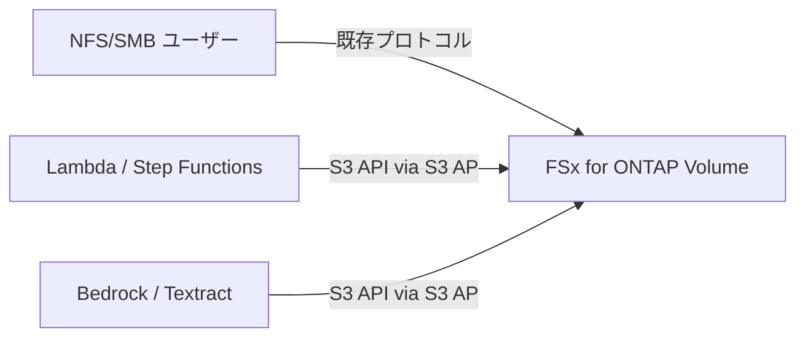

## TL;DR

Amazon FSx for NetApp ONTAP の S3 Access Points（S3 AP）を使えば、NAS 上のファイルを移動することなく、AWS のサーバーレスサービスと AI/ML サービスを直接組み合わせた業界別データパイプラインを構築できます。

本シリーズは最初の 14 パターンから始まり、最終的に **42 デプロイ可能パターン**（28 業種 + 7 FlexCache/FlexClone + 2 GenAI + 2 Event-Driven + 1 SAP + 1 HA + 1 Edge）まで拡充しました。本記事ではその出発点を紹介します。

📦 **リポジトリ**: [GitHub — FSx-for-ONTAP-S3AccessPoints-Serverless-Patterns](https://github.com/Yoshiki0705/FSx-for-ONTAP-S3AccessPoints-Serverless-Patterns)

---

## シリーズ全体像



| # | テーマ | 対応Phase |
|---|--------|-----------|
| 1 | **本記事**: S3 AP の概要と最初の 14 業界パターン | Phase 1-2 |
| 2 | 本番アーキテクチャ（ML推論、CI/CD、マルチリージョン） | Phase 3-6 |
| 3 | 運用ベースライン（17UC展開、DevSecOps） | Phase 7-9 |
| 4 | FPolicy Event-Driven パイプライン | Phase 10-12 |
| 5 | フィールド展開と 28 業種パターン | Phase 13-15 |
| 6 | GenAI 統合と 42 パターン到達 | Phase 16-18 |

---

## FSx for ONTAP S3 Access Points とは

Amazon FSx for NetApp ONTAP は NFS/SMB/iSCSI に加え、**S3 プロトコルによるアクセス**を S3 Access Points 経由で提供します。これにより：

- 既存 NAS データを移動・コピーせずに AWS サービスから直接アクセス
- Lambda, Step Functions, Bedrock, Textract, Comprehend, Rekognition 等と直接連携
- NFS/SMB ユーザーはこれまで通りファイルを読み書き
- PutObject もサポート（最大 5GB、FSX_ONTAP ストレージクラスのみ）

> **スループット設計についての注意**: S3 AP のアクセスは FSx for ONTAP のスループットキャパシティを NFS/SMB と共有します。AI/ML パイプラインの読み取り負荷が既存ワークロードに影響しないか、スループット設計時に考慮してください。



---

## なぜポーリング型？ — S3 AP のイベント通知制約

S3 AP は現時点で S3 Event Notifications（`s3:ObjectCreated:*` 等）を**サポートしていません**。そのため、EventBridge Scheduler による定期ポーリングが基本アーキテクチャです。

> 💡 後のフェーズで ONTAP FPolicy を使った Event-Driven パイプラインを構築し、この制約を回避しています（[第4回記事](./04-event-driven-fpolicy.md)参照）。

---

## 最初の 14 業界パターン

### Phase 1: 5 パターン

| UC | 業界 | AI/ML サービス |
|----|------|---------------|
| UC1 | 法務コンプライアンス | Comprehend (PII検出) |
| UC2 | 金融 IDP | Textract + Comprehend |
| UC3 | 医療画像 | Rekognition + Bedrock |
| UC4 | 製造品質 | Rekognition (異常検知) |
| UC5 | メディア制作 | Transcribe + Translate |

### Phase 2: 9 パターン追加

| UC | 業界 | AI/ML サービス |
|----|------|---------------|
| UC6 | 半導体 EDA | SageMaker (異常検知) |
| UC7 | ゲノミクス | SageMaker (バリアントコール) |
| UC8 | エネルギー探査 | SageMaker (地震データ) |
| UC9 | 自動運転 | Rekognition + SageMaker |
| UC10 | 建設 BIM | Textract + Bedrock |
| UC11 | 小売 | Rekognition (商品認識) |
| UC12 | 物流 | Textract + Comprehend |
| UC13 | 教育 | Transcribe + Bedrock |
| UC14 | 保険 | Textract + Comprehend |

---

## アーキテクチャの共通構造

全パターンは以下の共通アーキテクチャに従います：

```
EventBridge Scheduler
    → Step Functions (Orchestration)
        → Lambda: Discovery (S3 AP 経由でファイル一覧取得)
        → Lambda: Processing (AI/ML サービス呼び出し)
        → Lambda: Output (結果書き込み)
```

**共通モジュール** (`shared/`):
- `s3ap_helper.py` — S3 AP アクセスの抽象化（DemoMode 対応）
- `ontap_client.py` — ONTAP REST API クライアント
- `exceptions.py` — 共通例外 + エラーハンドラデコレータ
- `observability.py` — CloudWatch EMF メトリクス

**リポジトリ構造** (`solutions/` カテゴリアーキテクチャ):
```
solutions/
├── industry/           # 28 業種別パターン (UC1-UC28)
├── flexcache/          # 7 FlexCache/FlexClone パターン
├── genai/              # 2 GenAI パターン
├── sap/                # SAP/ERP Adjacent
├── ha/                 # HA LifeKeeper Monitoring
├── event-driven/       # 2 FPolicy Event-Driven
└── edge/               # CDN/Edge Delivery
```

---

## DemoMode: FSx for ONTAP なしで動かす

全パターンは `DemoMode=true` パラメータにより、**FSx for ONTAP を用意せずに通常の S3 バケットで動作確認**できます。PoC 検証やローカル開発に最適です。

```bash
# SAM CLI でデプロイ（DemoMode）
sam deploy --parameter-overrides DemoMode=true
```

> **PoC 支援**: DemoMode を使えば、顧客環境に FSx for ONTAP を構築する前にパイプラインの動作を 30 分以内にデモできます。SAM CLI + DemoMode で即座にデプロイ可能です。

---

## IAM ポリシーの注意点（重要）

S3 AP への IAM ポリシーでは、通常の S3 バケット ARN とは異なる形式を使用します：

```json
// ✅ 正しい形式
"Resource": "arn:aws:s3:ap-northeast-1:123456789012:accesspoint/my-ap-name"
"Resource": "arn:aws:s3:ap-northeast-1:123456789012:accesspoint/my-ap-name/object/*"

// ❌ よくある間違い（エイリアスをバケット名として使用）
"Resource": "arn:aws:s3:::my-ap-alias-ext-s3alias"
```

詳細は [README の IAM セクション](https://github.com/Yoshiki0705/FSx-for-ONTAP-S3AccessPoints-Serverless-Patterns#iam-policy-format) を参照してください。

---

## 次回予告

次の記事では、Phase 3〜6 で追加した本番アーキテクチャ要素を紹介します：
- ニアリアルタイム処理（Kinesis）
- SageMaker 推論 4 パターン（Batch Transform / Real-time / Serverless / Inference Components）
- CI/CD パイプライン（GitHub Actions）
- マルチリージョン DR（DynamoDB Global Tables）
- Lambda SnapStart / CloudFormation Guard Hooks

---

📦 **詳細・テンプレート**: [GitHub リポジトリ](https://github.com/Yoshiki0705/FSx-for-ONTAP-S3AccessPoints-Serverless-Patterns)

---

> **技術的注意**: 本記事は技術アーキテクチャのリファレンスです。規制業界での運用には、組織固有のコンプライアンス要件への適合評価が別途必要です。
> **実行環境**: Python 3.12 / ARM64 Lambda / SAM CLI。詳細は [README](https://github.com/Yoshiki0705/FSx-for-ONTAP-S3AccessPoints-Serverless-Patterns#readme) を参照してください。
