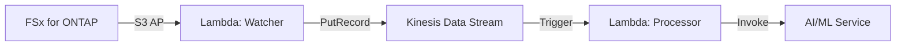

## TL;DR

Phase 1-2 で 14 業界パターンの基盤を作った後、Phase 3〜6 で**本番運用に必要な横断的機能**を追加しました。

| Phase | 主な追加機能 |
|-------|-------------|
| 3 | ニアリアルタイム処理 (Kinesis)、SageMaker Batch Transform、X-Ray/EMF オブザーバビリティ |
| 4 | DynamoDB Task Token Store、リアルタイム推論 (A/B テスト)、マルチアカウント StackSets、Event-Driven プロトタイプ (3.5秒 E2E) |
| 5 | SageMaker Serverless Inference、コスト最適化 (Scheduled Scaling)、GitHub Actions CI/CD、マルチリージョン (DynamoDB Global Tables) |
| 6 | Lambda SnapStart、CloudFormation Guard Hooks、SageMaker Inference Components (scale-to-zero) |

📦 **リポジトリ**: [GitHub](https://github.com/Yoshiki0705/FSx-for-ONTAP-S3AccessPoints-Serverless-Patterns)

---

## Phase 3: ニアリアルタイムとオブザーバビリティ

### Kinesis Data Streams 統合

バッチポーリング（1時間/1日周期）では対応できないユースケース向けに、Kinesis Data Streams を追加：



レイテンシ: ポーリング周期依存 → **秒単位**へ短縮。

### SageMaker Batch Transform + Callback Pattern

Step Functions の Task Token を使った非同期 ML 推論。大量ファイルのバッチ処理に適用。

### オブザーバビリティスタック

- AWS X-Ray によるエンドツーエンドトレーシング
- CloudWatch EMF (Embedded Metric Format) による構造化メトリクス
- 全 Lambda に `@observability_decorator` を適用

---

## Phase 4: 本番 SageMaker とマルチアカウント

### Task Token Store (DynamoDB)

SageMaker のタグ値には 256 文字制限がある一方、Step Functions Task Token は約 1,000 文字。DynamoDB に Correlation ID → Token マッピングを保存して解決。

### マルチアカウント展開 (StackSets)

CloudFormation StackSets により、1 つの管理アカウントから複数のメンバーアカウントへ一括デプロイ可能に。

### Event-Driven プロトタイプ

ONTAP → (間接経路) → EventBridge → Step Functions で **E2E 3.5 秒**のレイテンシを達成。ただし S3 AP のネイティブ通知が存在しないため、後の Phase 10-11 で FPolicy ベースの正式実装に進化。

---

## Phase 5: コスト最適化と CI/CD

### 4-way 推論ルーティング

| モード | 特徴 | コスト |
|--------|------|--------|
| SageMaker Real-time | 常時起動、低レイテンシ | 高 |
| Batch Transform | 大量バッチ、非同期 | 中 |
| Serverless Inference | 自動スケール、コールドスタートあり | 低〜中 |
| Inference Components | scale-to-zero、マルチモデル | 最低 |

### GitHub Actions CI/CD

```yaml
# lint → test → security → deploy の 4 ステージ
# cfn-lint + ruff + pytest + bandit
```

### マルチリージョン DR

DynamoDB Global Tables + DR Tier 定義（Hot/Warm/Cold）によるリージョン間フェイルオーバー設計。

---

## Phase 6: 開発者体験と本番強化

### Lambda SnapStart

Java Lambda のコールドスタートを最大 90% 削減、Python Lambda でも 50〜70% 程度の改善が期待できます（2026年6月時点）。初期化コストの大きい ML ライブラリロードに効果的。

### CloudFormation Guard Hooks

サーバーサイドでのポリシー適用。デプロイ時に IAM 過剰権限や暗号化未設定を自動拒否。

> **IAM 最小権限** (Security Architect lens): Guard Hooks により、S3 AP IAM ポリシーで `s3:*` のような過剰権限や、KMS 暗号化未設定のリソースをデプロイ段階で拒否します。CI の cfn-guard 実行と合わせて二重チェックが機能します。

### SageMaker Inference Components

scale-to-zero（最小コピー数 0）を実現する推論ホスティング。アイドル時のコストをゼロにできますが、初回リクエスト時にモデルロードのウォームアップが発生します。4-way ルーティングの最終ピースとして完成。

> **コスト比較** (Cloud Cost Specialist lens): Serverless Inference と Inference Components の使い分けは、コールドスタート許容度とモデルサイズで判断します。小モデル・低頻度なら Serverless、大モデル・マルチモデルなら Inference Components が適しています。

---

## この段階での到達点

Phase 6 完了時点で、パターン集は以下を備えた本番対応アーキテクチャになっています：

- ✅ 4 種類の ML 推論パターン
- ✅ ニアリアルタイム処理
- ✅ マルチアカウント / マルチリージョン
- ✅ CI/CD パイプライン
- ✅ オブザーバビリティ (X-Ray + EMF)
- ✅ コスト最適化 (Scheduled Scaling, scale-to-zero)
- ✅ セキュリティ (Guard Hooks, cfn-lint)

次の記事では、17 UC への運用展開と DevSecOps バリデーションの話をします。

---

📦 **詳細**: [GitHub リポジトリ](https://github.com/Yoshiki0705/FSx-for-ONTAP-S3AccessPoints-Serverless-Patterns)

---

> **前回の記事**: [#1 — 14パターンの全体像](./01-introduction-14-patterns.md)
> **技術的注意**: 本記事は技術アーキテクチャのリファレンスです。本番運用では組織のセキュリティ/コンプライアンス要件を別途評価してください。
