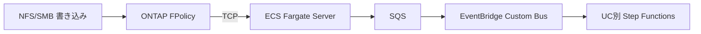

## TL;DR

S3 Access Points はネイティブのイベント通知をサポートしていません。Phase 10〜12 では ONTAP の **FPolicy** 機能を使って「ファイルが書き込まれたら即座に処理を起動する」Event-Driven パイプラインを実装しました。



📦 **リポジトリ**: [GitHub](https://github.com/Yoshiki0705/FSx-for-ONTAP-S3AccessPoints-Serverless-Patterns)

---

## なぜ FPolicy なのか

| 選択肢 | 評価 | 考慮点 |
|--------|------|--------|
| S3 Event Notifications | S3 AP では**非対応** | 将来対応の可能性あり |
| 定期ポーリング (EventBridge Scheduler) | 動作するが最短でも分単位のレイテンシ | 最もシンプル、追加インフラ不要 |
| ONTAP FPolicy | ファイル操作（create/open/close/rename/delete）を**リアルタイム通知** | 常時起動サーバー必要、ONTAP 固有技術 |
| CloudWatch Logs + Metric Filter | 遅延あり、イベント粒度が粗い | 追加実装不要 |

FPolicy は ONTAP ネイティブの監査/通知フレームワーク。ファイル操作が発生すると、外部サーバーに即座に通知できます。

---

## Phase 10: 共有イベント取り込みパイプライン

### アーキテクチャ

```
ONTAP FPolicy Engine
    ↓ TCP (protobuf or XML)
ECS Fargate (FPolicy TCP Server)
    ↓ SendMessage
SQS Queue (バッファ + DLQ)
    ↓ EventBridge Pipe
EventBridge Custom Event Bus
    ↓ Rules (UC別ルーティング)
Step Functions (UC 固有ワークフロー)
```

### 主な設計判断

- **ECS Fargate**: FPolicy は TCP 持続接続が必要。Lambda では接続維持不可。
- **SQS バッファ**: 瞬間的なイベントバーストを吸収。DLQ で失敗イベントを捕捉。
- **EventBridge Custom Bus**: UC 別ルーティングをルールベースで柔軟に定義。
- **protobuf 対応**: ONTAP 9.15.1 で導入された高効率フォーマット。FSx for ONTAP は現在 ONTAP 9.17.1 以降で稼働しており、protobuf は標準利用可能です。XML もフォールバック対応。

---

## Phase 11: 17 UC 全体への統合

### TriggerMode パラメータ

全 UC テンプレートに `TriggerMode` を追加：

```yaml
Parameters:
  TriggerMode:
    Type: String
    Default: POLLING
    AllowedValues:
      - POLLING          # EventBridge Scheduler のみ
      - EVENT_DRIVEN     # FPolicy イベントのみ
      - HYBRID           # 両方（移行期間用）
```

### HYBRID モード冪等性

POLLING と EVENT_DRIVEN を同時稼働する移行期間中、同一ファイルの二重処理を防ぐ `IdempotencyChecker`：

```python
from shared.idempotency_checker import IdempotencyChecker

checker = IdempotencyChecker(table_name=os.environ["IDEMPOTENCY_TABLE"])
if checker.is_duplicate(document_id=file_key, source="EVENT_DRIVEN"):
    logger.info("Already processed by POLLING, skipping")
    return
```

### Cross-Account Observability

FPolicy サーバーのメトリクスを管理アカウントの CloudWatch に集約。マルチアカウント環境でも一元監視。

---

## Phase 12: 運用強化

### Capacity Guardrails

SQS キューの深さ、ECS タスク数、Lambda 同時実行数に基づく自動スロットリング：

```python
from shared.guardrails import check_capacity

result = check_capacity(
    queue_depth=current_queue_depth,
    max_queue_depth=10000,
    active_tasks=active_step_functions,
    max_tasks=50
)
if result.should_throttle:
    logger.warning(f"Throttling: {result.reason}")
```

### Secrets 自動ローテーション

ONTAP 管理者パスワードの Secrets Manager 自動ローテーション (90 日周期)。ローテーション Lambda は ONTAP REST API でパスワードを変更後、新パスワードを Secret に格納。

### SLO ダッシュボード

| SLI | SLO |
|-----|-----|
| Event-to-Processing レイテンシ | p99 < 30秒 |
| 処理成功率 | > 99.5% |
| DLQ メッセージ数 | 0 (アラーム) |

### Persistent Store 再送検証

FPolicy Persistent Store を有効化し、ECS サーバー再起動時のイベントロスをゼロ確認。ONTAP がイベントをディスクにバッファし、サーバー復帰後に再送。

---

## Event-Driven のインパクト

| 指標 | ポーリング (Phase 1-9) | Event-Driven (Phase 10-12) |
|------|----------------------|---------------------------|
| レイテンシ | 最短1分（Scheduler 周期） | **秒単位** |
| 不要スキャン | 毎回全ファイル走査 | **変更ファイルのみ** |
| コスト | Scheduler + 全ファイル ListObjects | イベント発生時のみ課金 |
| 対応操作 | 新規ファイルのみ検出容易 | create/close/rename/delete 全対応 |

---

## 注意点とトレードオフ

- FPolicy TCP サーバーは**常時起動**が必要（ECS Fargate コスト: 約 $35/月）
- FSx for ONTAP は現在 ONTAP 9.17.1 以降で稼働しているため、protobuf は標準で利用可能（古いバージョンの考慮は不要）
- FPolicy Persistent Store は Volume 上にスペースを消費
- `is-mandatory=false`（デフォルト）の場合、FPolicy サーバー停止中のイベントは**ドロップ**される。コンプライアンス要件が厳しい場合は Persistent Store + `is-mandatory=true` を検討
- 将来 AWS が S3 AP ネイティブ通知を提供した場合、HYBRID モードで段階的に移行可能
- FPolicy は NLB 経由では動作しない（TCP 持続接続の直接接続が必要）

> **セキュリティ** (Security Architect lens): FPolicy の TCP 接続は VPC 内のプライベート通信です。ONTAP と ECS Fargate 間は Security Group で通信を限定し、TLS は現時点で FPolicy プロトコル自体では非対応ですが、VPC 内通信として保護されます。

---

📦 **FPolicy サーバー実装**: [shared/fpolicy-server/](https://github.com/Yoshiki0705/FSx-for-ONTAP-S3AccessPoints-Serverless-Patterns/tree/main/shared/fpolicy-server)
📦 **TriggerMode テンプレート例**: [solutions/industry/legal-compliance/template.yaml](https://github.com/Yoshiki0705/FSx-for-ONTAP-S3AccessPoints-Serverless-Patterns/tree/main/solutions/industry/legal-compliance)

---

> **前回の記事**: [#3 — 運用ベースライン](./03-operational-baseline.md)
> **コスト** (Cloud Cost Specialist lens): FPolicy パイプライン全体の月額コストは、ECS Fargate ($35) + SQS + EventBridge で約 $40〜50 程度（イベント量依存）。ポーリングの Lambda + Scheduler コスト（$5〜20）と比較し、レイテンシ要件に応じて選択してください。
