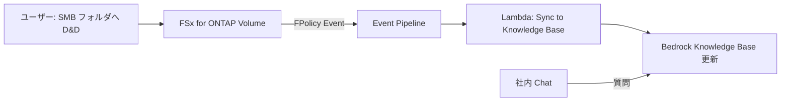

## TL;DR

Phase 16〜18 で GenAI 統合と最終的なリポジトリ成熟を達成。パターン数は **42** に到達し、カテゴリ別のディレクトリ構造に再編成されました。

| Phase | テーマ |
|-------|--------|
| 16 | Knowledge Base セルフサービスキュレーション — Windows ドラッグ&ドロップで AI ナレッジを自動更新 |
| 17 | Amazon Quick Suite × FSx for ONTAP S3 AP データマッピング |
| 18 | 42 パターン、カテゴリアーキテクチャ、HA LifeKeeper Monitoring 追加 |

📦 **リポジトリ**: [GitHub](https://github.com/Yoshiki0705/FSx-for-ONTAP-S3AccessPoints-Serverless-Patterns)

---

## Phase 16: Knowledge Base セルフサービスキュレーション

### コンセプト

エンドユーザーが **Windows エクスプローラーから SMB 共有フォルダにファイルをドラッグ&ドロップするだけ**で、Amazon Bedrock Knowledge Base のデータソースが自動更新される仕組み。



### なぜこれが重要か

従来の Knowledge Base 更新フロー:
1. S3 にファイルアップロード（CLI or コンソール）
2. 手動で Sync 実行
3. 完了待ち

本パターンでは:
1. **SMB 共有にファイルを置く** — それだけ。

非技術者（総務、法務、人事）でも AI ナレッジを最新に保てます。

> **導入障壁** (Partner/SI lens): SMB ドラッグ&ドロップによる Knowledge Base 更新は、技術教育コストをほぼゼロにできる点で顧客提案時の大きな差別化要因になります。「ファイルを置くだけ」という UX はビジネスサイドのステークホルダーへの説明にも有効です。

### データ分類とガバナンス

- アップロード時にファイルの `data_classification` を自動付与
- INTERNAL / CUI / PUBLIC を ONTAP メタデータから継承
- Knowledge Base のフィルタリングに反映

---

## Phase 17: Amazon Quick Suite × FSx for ONTAP S3 AP

> **Note**: Amazon Quick Suite (Index / Sight / Flows) はサービス進化が続いています。最新の機能・料金は [AWS 公式ドキュメント](https://aws.amazon.com/quick/) を参照してください。

### S3 AP データマッピング

Amazon Quick Suite が FSx for ONTAP S3 AP 経由でエンタープライズファイルにアクセスする構成。

| Quick 機能 | 役割 | S3 AP データ |
|------------|------|-------------|
| Quick Index | 非構造化ファイル検索 | `index/<role>/` (md/pdf) |
| Quick Sight | 構造化 BI・可視化 | `analytics/<role>/` (csv) |
| Quick Flows | アクション自動化 | `flows/<role>/` (json) |

### Agentic ワークフロー

Quick Flows がユーザーのアクションリクエストに応じて:
1. S3 AP 経由で FSx for ONTAP 上のドキュメントを検索 (Quick Index)
2. 必要に応じて追加ツール（Athena クエリ → Quick Sight、Lambda 実行）を呼び出し
3. アクション結果を生成 (Bedrock 連携)

---

## Phase 18: 42 パターンとカテゴリアーキテクチャ

### ディレクトリ再構造

37 のパターンから **カテゴリ別 `solutions/` 階層**に再編成し、Phase 18 で HA, Event-Driven, Edge カテゴリを追加して **42** に到達：

```
solutions/
├── industry/           # 28 業種別パターン (UC1-UC28)
├── sap/               # SAP/ERP Adjacent
├── flexcache/         # FlexCache/FlexClone (7パターン)
├── genai/             # GenAI (2パターン)
├── ha/                # HA LifeKeeper Monitoring
├── event-driven/      # FPolicy + Prototype
└── edge/              # CDN/Edge Delivery
```

### HA LifeKeeper Monitoring パターン

SIOS LifeKeeper による FSx for ONTAP の HA クラスタ監視:
- LifeKeeper ヘルスチェック → CloudWatch カスタムメトリクス
- フェイルオーバーイベント → EventBridge → SNS 通知
- ダッシュボードでクラスタ状態を可視化

### カテゴリ別アーキテクチャ図

各カテゴリに専用のアーキテクチャダイアグラムを追加（計 5 図）。パターン選択ガイドと連動。

---

## 42 パターンの最終構成

| カテゴリ | パターン数 | 主なテクノロジー |
|---------|-----------|----------------|
| Industry (業種別) | 28 | Bedrock, Textract, Comprehend, Rekognition, SageMaker |
| FlexCache/FlexClone | 7 | FlexCache, FlexClone, SnapMirror |
| GenAI | 2 | Bedrock Knowledge Base, Quick Suite |
| SAP/ERP | 1 | SnapCenter, HANA |
| HA Monitoring | 1 | LifeKeeper, CloudWatch |
| Event-Driven | 2 | FPolicy, EventBridge |
| Edge Delivery | 1 | CloudFront, Lambda@Edge |
| **合計** | **42** | |

---

## シリーズの振り返り

Phase 1 の「5 パターンの PoC」から始まり、18 フェーズを経て:

- **42 デプロイ可能パターン**
- **2,162+ ユニット/プロパティテスト**
- **Event-Driven (FPolicy) + Polling のハイブリッド**
- **4-way ML 推論ルーティング**
- **8 言語ドキュメント**
- **DevSecOps CI/CD パイプライン**
- **フィールド展開資産 (PoC テンプレート、コスト計算、パートナーガイド)**

すべてのパターンは DemoMode で FSx for ONTAP なしに試行可能です。

---

## 関連リファレンス

本シリーズで培った技術を以下のプロジェクトに展開しています。それぞれ異なる課題にフォーカスしているので、用途に応じて参照してください：

| プロジェクト | あなたの課題がこれなら |
|-------------|---------------------|
| [Access-Aware RAG](https://github.com/Yoshiki0705/FSx-for-ONTAP-Agentic-Access-Aware-RAG) | ファイル権限を尊重した AI 検索・要約が必要 |
| [Observability Integrations](https://github.com/Yoshiki0705/fsxn-observability-integrations) | ONTAP 監査ログを既存 SIEM に統合したい |
| [Cyber Resilience Patterns](https://github.com/Yoshiki0705/fsxn-cyber-resilience-patterns) | ストレージ層の多層防御セキュリティを設計したい |

---

📦 **リポジトリ**: [GitHub — FSx-for-ONTAP-S3AccessPoints-Serverless-Patterns](https://github.com/Yoshiki0705/FSx-for-ONTAP-S3AccessPoints-Serverless-Patterns)

ご質問やフィードバックはコメントまたは [GitHub Issues](https://github.com/Yoshiki0705/FSx-for-ONTAP-S3AccessPoints-Serverless-Patterns/issues) へどうぞ。

---

> **前回の記事**: [#5 — フィールド展開と28業種パターン](./05-field-ready-28-patterns.md)
> **技術的注意**: 本シリーズは技術アーキテクチャのリファレンスです。GenAI サービス（Bedrock, Quick Suite 等）の機能・料金は変更される可能性があります。本番採用前に最新の AWS ドキュメントを確認してください。
> **データレジデンシー** (Enterprise Architect lens): Bedrock Knowledge Base / Quick Suite のデータ処理リージョンは、東京リージョン対応状況を事前に確認してください。
