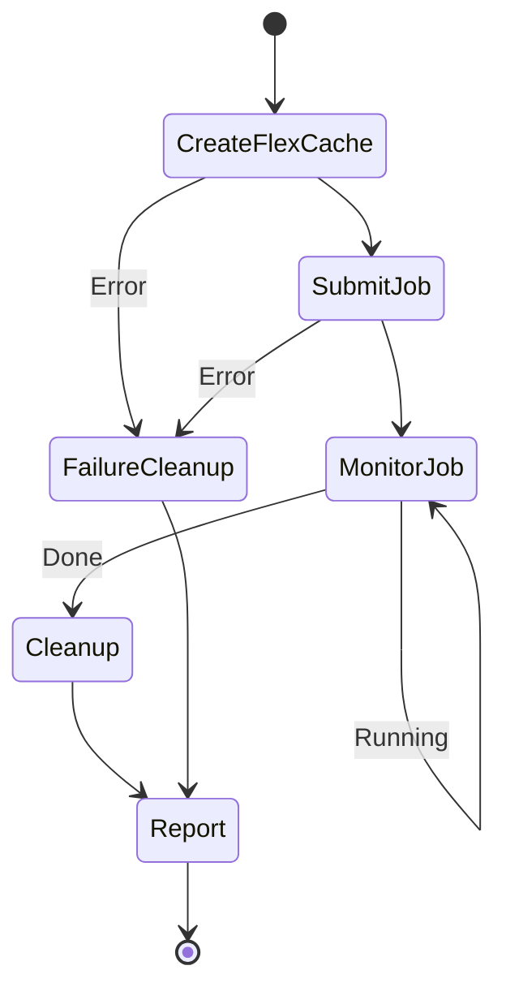

# Dynamic FlexCache Workflow ガイド

## 概要

ジョブ単位で FlexCache を動的に作成・削除するワークフローの設計・実装ガイド。

## ワークフロー概要

## ONTAP REST API 設計

### FlexCache 作成
- **Endpoint**: `POST /api/storage/flexcache/flexcaches`
- **冪等性**: job_id から FlexCache 名を決定し、既存チェック
- **タイムアウト**: 作成ジョブは最大 180 秒待機

### FlexCache 削除
- **Endpoint**: `DELETE /api/storage/flexcache/flexcaches/{uuid}`
- **冪等性**: 404 は成功扱い（既に削除済み）
- **リトライ**: 最大 3 回、バックオフ付き

## 詳細

- [ワークフロー設計](../dynamic-flexcache-render-workflow/README.md)
- [ONTAP REST API 設計](../dynamic-flexcache-render-workflow/docs/ontap-rest-api-design.md)
- [障害ハンドリング](../dynamic-flexcache-render-workflow/docs/failure-handling.md)
- [セキュリティ設計](../dynamic-flexcache-render-workflow/docs/security-design.md)
- [コスト最適化](../dynamic-flexcache-render-workflow/docs/cost-optimization.md)
