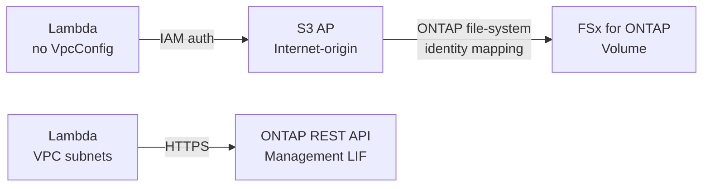
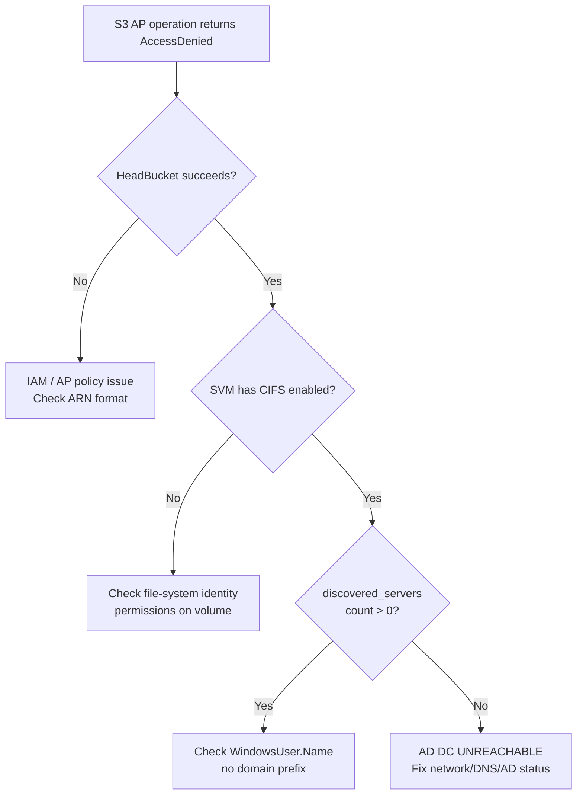

# AD-Joined SVM: S3 Access Point Prerequisites

> Prerequisites and operational guidance for using FSx for ONTAP S3 Access Points on AD-joined SVMs (CIFS enabled).

## Executive Summary

AD-joined SVMs require Active Directory Domain Controller (AD DC) connectivity for **all** S3 Access Point data operations. Without it, ListObjectsV2, GetObject, and PutObject fail with `AccessDenied` — even though HeadBucket succeeds. This document explains the prerequisites, recommended architecture patterns, and troubleshooting steps.

**Key findings verified in production** (July 2026):
- HeadBucket is NOT a reliable health check (S3-layer metadata only)
- Internet-origin AP + VPC-external Lambda is the recommended data-access pattern
- Same-account S3 AP resource policy (`put_access_point_policy`) is NOT required
- AD DC reachability must be verified BEFORE S3 AP data operations

> **Source**: Verified in `fsxn-observability-integrations` restore-verification workflow. Aligns with [AWS official troubleshooting guide](https://docs.aws.amazon.com/fsx/latest/ONTAPGuide/troubleshooting-access-points-for-fsxn.html) ("name service becomes unreachable" → MISCONFIGURED or AccessDenied).

---

## Prerequisites (Before Reading This Document)

| You need | Where to find it |
|----------|-----------------|
| FSx for ONTAP file system (deployed) | AWS Console → FSx → ONTAP |
| SVM joined to Active Directory | `scripts/demo-ad-join-svm.sh` or AWS Console |
| ONTAP management IP | AWS Console → FSx → File system → Administration → Management endpoint |
| ONTAP admin credentials in Secrets Manager | `fsxn/admin` secret (created during stack deploy) |
| IAM permissions for S3 AP operations | See [Same-Account AP Resource Policy](#same-account-ap-resource-policy) |

**Glossary**:
- **AD-joined SVM**: A Storage Virtual Machine with CIFS/SMB protocol enabled and connected to an Active Directory domain
- **S3 AP**: S3 Access Point — an S3-compatible interface to FSx for ONTAP volumes
- **Internet-origin AP**: An S3 AP accessible from anywhere with valid IAM credentials (no VPC binding)

---

## Table of Contents

1. [Quick Start Validation](#quick-start-validation)
2. [AD DC Reachability Requirement](#ad-dc-reachability-requirement)
3. [Internet-Origin AP + VPC-External Lambda Pattern](#internet-origin-ap--vpc-external-lambda-pattern)
4. [Same-Account AP Resource Policy](#same-account-ap-resource-policy)
5. [Pre-Flight Health Check](#pre-flight-health-check)
6. [Monitoring and Alerting](#monitoring-and-alerting)
7. [Troubleshooting](#troubleshooting)
8. [FAQ](#faq)
9. [Related Documents](#related-documents)

---

## Quick Start Validation

Run this single command to verify your AD-joined SVM is ready for S3 AP data operations:

```bash
# Replace with your values (find mgmt IP in AWS Console → FSx → File system → Administration)
MGMT_IP="<your-ontap-mgmt-ip>"
SVM_NAME="<your-svm-name>"
CREDS="fsxadmin:<your-password>"

# Check AD DC reachability (expect discovered_servers count > 0)
curl -sku "$CREDS" \
  "https://$MGMT_IP/api/protocols/cifs/domains?svm.name=$SVM_NAME&fields=discovered_servers" \
  | jq '{dc_count: (.records[0].discovered_servers | length), servers: .records[0].discovered_servers}'
```

**Expected result** (healthy):
```json
{"dc_count": 2, "servers": [{"server_ip": "10.0.1.10", ...}, {"server_ip": "10.0.2.10", ...}]}
```

**Failure indicator** (`dc_count: 0`): AD DC unreachable — S3 AP data operations will fail with AccessDenied. See [Troubleshooting](#troubleshooting).

> **Credential security note**: The `curl -sku` pattern above is for interactive debugging only. In production Lambda functions, always retrieve credentials from Secrets Manager via `shared/ontap_client.py`.

---

## AD DC Reachability Requirement

### Why AD DC Is Required

On AD-joined SVMs (CIFS enabled), ONTAP's multiprotocol identity pipeline performs a `unix→win` reverse name-mapping lookup on **every** S3 AP data operation. This lookup requires the SVM to contact its AD Domain Controllers via LDAP/Kerberos.

This applies **even for**:
- UNIX security style volumes
- S3 AP with UNIX `FileSystemUserType`
- Volumes with no SMB shares configured

The only condition is that CIFS is **enabled** on the SVM. This is counter-intuitive and the #1 source of confusion when troubleshooting `AccessDenied` on AD-joined SVMs.

### Diagnostic Matrix

| S3 Operation | AD DC Reachable | AD DC Unreachable | Layer |
|-------------|:---:|:---:|-------|
| HeadBucket | ✅ | ✅ (false positive) | S3 metadata |
| ListObjectsV2 | ✅ | ❌ AccessDenied | File system |
| GetObject | ✅ | ❌ AccessDenied | File system |
| PutObject | ✅ | ❌ AccessDenied | File system |
| DeleteObject | ✅ | ❌ AccessDenied | File system |
| HeadObject | ✅ | ❌ AccessDenied | File system |
| CreateMultipartUpload | ✅ | ❌ AccessDenied | File system |

> **Security note**: HeadBucket validates only at the S3 metadata layer (AP existence and IAM). It does NOT traverse the ONTAP file-system layer. **Never use HeadBucket as a health check for S3 AP data-plane readiness.**

### Required Network Connectivity (SVM ENIs → AD DC)

These are **outbound** rules from FSx for ONTAP ENIs (in the preferred/standby subnets) to AD Domain Controller IPs:

| Port | Protocol | Service | Required |
|------|----------|---------|:--------:|
| 53 | TCP/UDP | DNS | ✅ |
| 88 | TCP/UDP | Kerberos authentication | ✅ |
| 389 | TCP/UDP | LDAP | ✅ |
| 445 | TCP | SMB/CIFS | ✅ |
| 464 | TCP/UDP | Kerberos password change | ✅ |
| 636 | TCP | LDAPS (encrypted LDAP) | Recommended |
| 3268 | TCP | Global Catalog | If multi-domain |
| 9389 | TCP | AD Web Services | Optional |
| 49152-65535 | TCP | RPC dynamic ports | ✅ |

#### Security Group Example (CloudFormation)

```yaml
FsxToAdSecurityGroupRule:
  Type: AWS::EC2::SecurityGroupEgress
  Properties:
    GroupId: !Ref FsxSecurityGroup
    Description: Allow FSx for ONTAP SVM to reach AD DCs
    IpProtocol: "-1"  # All traffic (for demo; restrict per-port for production)
    DestinationSecurityGroupId: !Ref AdControllerSecurityGroup

# Production: replace "-1" with individual port rules
# Use !Ref AdControllerSecurityGroup or specific CIDR for AD DC IPs
```

> **Network note**: These rules are for FSx ENIs → AD DCs. Lambda functions accessing S3 AP do NOT need these ports — they communicate via the S3 API layer, not directly with AD.

---

## Internet-Origin AP + VPC-External Lambda Pattern

### Decision Matrix: Choosing a Network Pattern

| Pattern | Monthly Cost | Complexity | When to Use |
|---------|:---:|:---:|------------|
| **Internet-origin AP + VPC-external Lambda** | $0 | Low | Standard data access (recommended) |
| Internet-origin AP + VPC Lambda + NAT GW | ~$32+/AZ | Medium | Also need ONTAP mgmt API in same Lambda |
| VPC-origin AP + VPC Lambda + Interface EP | ~$7.20/AZ | High | Strict compliance (no Internet egress) |

### Recommended Pattern: Internet-Origin AP + VPC-External Lambda

For S3 AP **data access** (ListObjectsV2, GetObject, PutObject) from Lambda:

- **Internet-origin AP** (`NetworkOrigin: Internet`, no `VpcConfiguration`)
- **VPC-external Lambda** (no `VpcConfig` on the Lambda function)

### Why Not VPC-Origin?

VPC-origin APs require an S3 Gateway or Interface VPC Endpoint. However:

1. S3 **Gateway** VPC Endpoints do NOT support FSx for ONTAP S3 Access Points
2. S3 **Interface** VPC Endpoints add cost (~$7.20/month per AZ) and complexity
3. A Lambda inside a VPC cannot reach Internet-origin S3 APs without a NAT Gateway

### Architecture



### VPC Split Architecture

If you also need ONTAP REST API access (management LIF is VPC-internal):

| Lambda Function | Purpose | VpcConfig | Access Method |
|----------------|---------|:---------:|---------------|
| Discovery / ONTAP-mgmt | ONTAP REST API (`/api/...`) | ✅ VPC subnets + SG | Direct HTTPS to mgmt LIF |
| S3 AP data reader/writer | S3 AP (ListObjectsV2/GetObject/PutObject) | ❌ None | IAM-authenticated S3 API |

> **Cost note**: Never mix ONTAP management API and Internet-origin S3 AP access in a single Lambda. A VPC-Lambda needs a NAT Gateway ($32+/month per AZ) for Internet-origin S3 AP access.

---

## Same-Account AP Resource Policy

### Key Finding

For **same-account** access (the calling IAM principal and the S3 Access Point are in the same AWS account), an explicit S3 Access Point resource policy (`put_access_point_policy`) is **not required**.

The IAM identity policy alone is sufficient:

```json
{
  "Effect": "Allow",
  "Action": [
    "s3:ListBucket",
    "s3:GetObject",
    "s3:PutObject",
    "s3:DeleteObject"
  ],
  "Resource": [
    "arn:aws:s3:ap-northeast-1:123456789012:accesspoint/my-access-point",
    "arn:aws:s3:ap-northeast-1:123456789012:accesspoint/my-access-point/object/*"
  ]
}
```

> **Source**: Verified by successful ListObjectsV2/GetObject/PutObject operations without any AP resource policy in the same-account configuration. Consistent with [AWS S3 AP documentation](https://docs.aws.amazon.com/fsx/latest/ONTAPGuide/s3-ap-manage-access-fsxn.html) dual-layer authorization model.

### When AP Resource Policy IS Required

| Scenario | AP Resource Policy Needed | IAM Identity Policy Needed |
|----------|:---:|:---:|
| Same-account access | ❌ | ✅ |
| Cross-account access | ✅ | ✅ |
| Condition key restrictions | ✅ | ✅ |
| Restrict beyond IAM (explicit deny) | ✅ | ✅ |

### CloudFormation Example (Same-Account, No AP Policy Needed)

```yaml
S3ApDataReaderRole:
  Type: AWS::IAM::Role
  Properties:
    AssumeRolePolicyDocument:
      Version: "2012-10-17"
      Statement:
        - Effect: Allow
          Principal:
            Service: lambda.amazonaws.com
          Action: sts:AssumeRole
    ManagedPolicyArns:
      - arn:aws:iam::aws:policy/service-role/AWSLambdaBasicExecutionRole
    Policies:
      - PolicyName: S3ApAccess
        PolicyDocument:
          Version: "2012-10-17"
          Statement:
            - Effect: Allow
              Action:
                - s3:ListBucket
                - s3:GetObject
              Resource:
                - !Sub "arn:aws:s3:${AWS::Region}:${AWS::AccountId}:accesspoint/${S3ApName}"
                - !Sub "arn:aws:s3:${AWS::Region}:${AWS::AccountId}:accesspoint/${S3ApName}/object/*"
```

> **IAM note**: The Resource ARN must use the access point format (`arn:aws:s3:<region>:<account>:accesspoint/<name>`). Bucket-style ARNs (`arn:aws:s3:::<alias>`) will not work. This is a [documented common issue](https://docs.aws.amazon.com/fsx/latest/ONTAPGuide/troubleshooting-access-points-for-fsxn.html).

---

## Pre-Flight Health Check

### Programmatic Check (Python — for Lambda/Step Functions)

```python
from shared.ad_health_check import require_ad_dc_reachability
from shared.ontap_client import OntapClient, OntapClientConfig

# Initialize ONTAP client (credentials from Secrets Manager)
config = OntapClientConfig(
    management_ip=os.environ["ONTAP_MGMT_IP"],
    secret_name=os.environ["ONTAP_SECRET_NAME"],
)
client = OntapClient(config)

# Raises AdDcUnreachableError if AD DC is unreachable
# Returns immediately for non-AD SVMs (no CIFS = no check needed)
status = require_ad_dc_reachability(client, svm_name=os.environ["SVM_NAME"])

# Inspect results
print(f"AD-joined: {status.is_ad_joined}")
print(f"DC reachable: {status.dc_reachable}")
print(f"Discovered servers: {status.discovered_servers}")
```

### Shell Check (for scripts/automation)

```bash
# Check AD DC discovery from ONTAP REST API
# management IP: AWS Console → FSx → File system → Administration
curl -sku "$ONTAP_USER:$ONTAP_PASS" \
  "https://$MGMT_IP/api/protocols/cifs/domains?svm.name=$SVM_NAME&fields=discovered_servers" \
  | jq '.records[0].discovered_servers | length'
# Result: 0 = AD DC unreachable, >0 = healthy
```

### Step Functions Integration

Add the AD DC check as the **first state** in any workflow that uses S3 AP data operations on an AD-joined SVM:

```json
{
  "StartAt": "AdDcHealthCheck",
  "States": {
    "AdDcHealthCheck": {
      "Type": "Task",
      "Resource": "${AdDcHealthCheckFunctionArn}",
      "ResultPath": "$.adHealthStatus",
      "Next": "MainWorkflow",
      "Retry": [
        {
          "ErrorEquals": ["States.TaskFailed"],
          "MaxAttempts": 3,
          "IntervalSeconds": 10,
          "BackoffRate": 2.0
        }
      ],
      "Catch": [
        {
          "ErrorEquals": ["AdDcUnreachableError"],
          "ResultPath": "$.error",
          "Next": "NotifyAdFailure"
        }
      ]
    },
    "MainWorkflow": {
      "Type": "Pass",
      "Comment": "Continue with S3 AP data operations...",
      "End": true
    },
    "NotifyAdFailure": {
      "Type": "Task",
      "Resource": "arn:aws:states:::sns:publish",
      "Parameters": {
        "TopicArn": "${AlertTopicArn}",
        "Subject": "AD DC Unreachable - S3 AP Operations Blocked",
        "Message.$": "$.error.Cause"
      },
      "End": true
    }
  }
}
```

---

## Monitoring and Alerting

### Proactive AD DC Health Monitoring

Deploy an EventBridge Schedule + Lambda to check AD DC reachability periodically:

```yaml
# Add to your SAM template
AdHealthCheckSchedule:
  Type: AWS::Scheduler::Schedule
  Properties:
    Name: !Sub "${AWS::StackName}-ad-health-check"
    ScheduleExpression: "rate(5 minutes)"
    FlexibleTimeWindow:
      Mode: "OFF"
    Target:
      Arn: !GetAtt AdHealthCheckFunction.Arn
      RoleArn: !GetAtt SchedulerRole.Arn

AdHealthCheckFunction:
  Type: AWS::Serverless::Function
  Properties:
    Handler: handler.handler
    Runtime: python3.12
    Architectures: [arm64]
    Timeout: 30
    VpcConfig:
      SubnetIds: !Ref PrivateSubnetIds
      SecurityGroupIds: [!Ref FsxAccessSecurityGroup]
    Environment:
      Variables:
        ONTAP_MGMT_IP: !Ref OntapManagementIp
        ONTAP_SECRET_NAME: !Ref OntapSecretName
        SVM_NAME: !Ref SvmName
        ALARM_TOPIC_ARN: !Ref AlertTopic
```

### CloudWatch Custom Metric

The `shared/ad_health_check.py` module can emit a CloudWatch metric for dashboarding:

```python
import boto3
from shared.ad_health_check import check_ad_dc_reachability

def handler(event, context):
    status = check_ad_dc_reachability(ontap_client, svm_name)

    # Emit metric
    cw = boto3.client("cloudwatch")
    cw.put_metric_data(
        Namespace="FSxN/S3AP",
        MetricData=[{
            "MetricName": "AdDcReachable",
            "Value": 1.0 if status.dc_reachable else 0.0,
            "Unit": "None",
            "Dimensions": [{"Name": "SvmName", "Value": svm_name}],
        }],
    )

    if not status.is_healthy:
        # Alert via SNS
        sns = boto3.client("sns")
        sns.publish(TopicArn=os.environ["ALARM_TOPIC_ARN"], ...)
```

### CloudWatch Alarm

```yaml
AdDcReachabilityAlarm:
  Type: AWS::CloudWatch::Alarm
  Properties:
    AlarmName: !Sub "${AWS::StackName}-ad-dc-unreachable"
    Namespace: FSxN/S3AP
    MetricName: AdDcReachable
    Dimensions:
      - Name: SvmName
        Value: !Ref SvmName
    Statistic: Minimum
    Period: 300
    EvaluationPeriods: 2
    Threshold: 1
    ComparisonOperator: LessThanThreshold
    AlarmActions:
      - !Ref AlertTopic
```

---

## Troubleshooting

### Decision Flowchart



### Symptom: AccessDenied on ListObjectsV2 but HeadBucket Succeeds

**Root Cause**: AD DC is unreachable from the SVM.

**Verification**:
```bash
curl -sku user:pass \
  "https://<mgmt-ip>/api/protocols/cifs/domains?svm.name=<svm>&fields=discovered_servers"
```

If `discovered_servers` is `[]` (empty array), the AD DC is unreachable.

**Resolution**:
1. Verify SVM DNS IPs point to active AD DC addresses
   ```bash
   curl -sku user:pass "https://<mgmt-ip>/api/name-services/dns?svm.name=<svm>"
   ```
2. Check Security Groups allow ports 53/88/389/445/464/636 from SVM ENI subnets to AD DC IPs
3. If using AWS Managed AD, confirm the directory status is `Active` in the AWS Console
4. If AD was recreated, the SVM may need CIFS force-delete + re-join (new NetBIOS name required — see steering file for procedure)

### Symptom: S3 AP Create Fails for WINDOWS Type

**Root Cause**: SVM is not yet AD-joined.

**Resolution**: Join the SVM to AD first:
```bash
./scripts/demo-ad-join-svm.sh --stack-name <your-ad-stack> --svm-name <svm-name>
```

### Symptom: AccessDenied Despite Correct IAM Policy

**Checklist** (check in order):
1. ✅ IAM ARN uses S3 AP format: `arn:aws:s3:<region>:<account>:accesspoint/<name>/object/*`
2. ✅ `WindowsUser.Name` is username only (e.g., `Admin`) — no `DOMAIN\` prefix
3. ✅ AD DC is reachable (run Quick Start Validation above)
4. ✅ File-system identity has permissions on the target path
5. ✅ Volume is mounted (has junction path) and online

### Symptom: ONTAP reports `RESULT_ERROR_SECD_IN_DISCOVERY`

**Root Cause**: SVM cannot discover AD Domain Controllers via DNS.

**Resolution**: Verify DNS configuration on the SVM resolves the AD domain name:
```bash
curl -sku user:pass "https://<mgmt-ip>/api/name-services/dns?svm.name=<svm>&fields=servers,domains"
# Ensure "servers" contains the AD DC DNS IPs
```

---

## FAQ

### Q: Do pure UNIX SVMs (no CIFS) need AD DC?

No. If the SVM has no CIFS service enabled, S3 AP operations do not require AD. The `unix→win` reverse lookup only occurs when CIFS is configured. Most patterns in this repository target pure UNIX SVMs.

### Q: Can I use HeadBucket as a health check?

**No.** HeadBucket validates only S3-layer metadata. It always succeeds regardless of AD DC status. Use one of:
- `ListObjectsV2` with `MaxKeys=1` (data-plane health check)
- ONTAP API `GET /protocols/cifs/domains?fields=discovered_servers` (infrastructure check)
- `shared/ad_health_check.py` → `check_ad_dc_reachability()` (programmatic)

### Q: Is `put_access_point_policy` required for same-account access?

No. For same-account access, the IAM identity policy on the calling role is sufficient. An explicit AP resource policy is only needed for cross-account access or condition-key restrictions.

### Q: Why does Internet-origin S3 AP not work from a VPC Lambda?

A VPC Lambda's traffic routes through VPC networking. Internet-origin S3 AP endpoints resolve to public IPs that are NOT reachable via S3 Gateway VPC Endpoints. The Lambda needs either:
- A NAT Gateway in its VPC ($32+/month) — works but expensive
- No `VpcConfig` (VPC-external) — **recommended**, $0 additional cost

### Q: What happens if AD DC becomes unreachable mid-workflow?

S3 AP data operations fail **immediately** with AccessDenied (no timeout/retry at the ONTAP layer). Step Functions workflows should include:
- `Retry` with exponential backoff (`BackoffRate: 2.0`) for transient failures
- `Catch` for `AdDcUnreachableError` to alert operators via SNS
- A monitoring alarm (see [Monitoring and Alerting](#monitoring-and-alerting)) for proactive detection

### Q: How do I find my ONTAP management IP?

AWS Console → Amazon FSx → File systems → Select your file system → Administration tab → Management endpoint. Or via CLI:
```bash
aws fsx describe-file-systems --file-system-ids fs-XXXXX \
  --query "FileSystems[0].OntapConfiguration.Endpoints.Management.IpAddresses[0]"
```

---

## Related Documents

- [ONTAP Integration Notes](../ontap-integration-notes.en.md) — NAS coexistence, identity mapping
- [S3AP Compatibility Notes](../s3ap-compatibility-notes.en.md) — Known constraints
- [S3AP Authorization Model](../s3ap-authorization-model.en.md) — Dual-layer auth
- [Incident Response Playbook](../incident-response-playbook.md) — Security incident handling
- [ROADMAP](../../ROADMAP.md) — SnapMirror DR test automation (future)
- [AWS: Troubleshooting S3 access point issues](https://docs.aws.amazon.com/fsx/latest/ONTAPGuide/troubleshooting-access-points-for-fsxn.html) — Official guide
- [AWS: Best practices for AD](https://docs.aws.amazon.com/fsx/latest/ONTAPGuide/self-managed-AD-best-practices.html) — AD service account permissions
