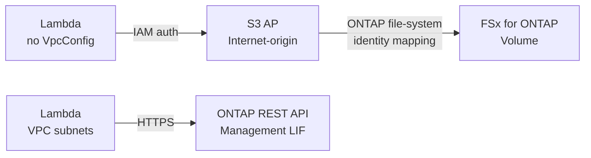
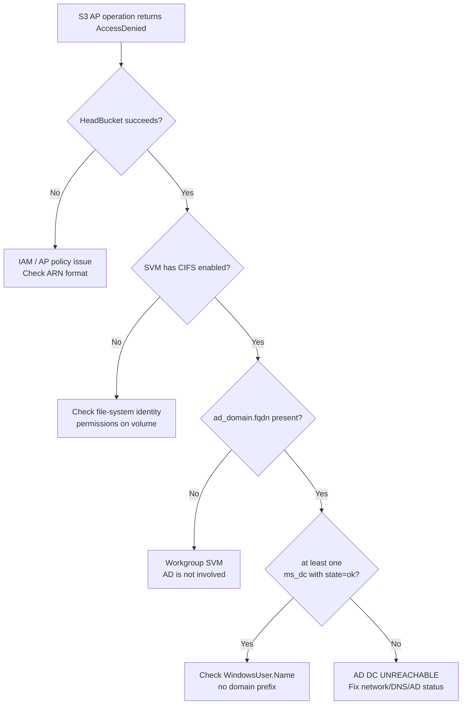

# AD-Joined SVM: S3 Access Point Prerequisites

🌐 **Language / 言語**: [日本語](../ja/ad-joined-svm-s3ap-prerequisites.md) | English

> Prerequisites and operational guidance for using FSx for ONTAP S3 Access Points on AD-joined SVMs (CIFS enabled).

## Executive Summary

AD-joined SVMs require Active Directory Domain Controller (AD DC) connectivity for **all** S3 Access Point data operations. Without it, ListObjectsV2, GetObject, and PutObject fail with `AccessDenied` — even though HeadBucket succeeds. This document explains the prerequisites, recommended architecture patterns, and troubleshooting steps.

**Key findings verified in production** (July 2026):
- HeadBucket is NOT a reliable health check (S3-layer metadata only)
- Internet-origin AP + VPC-external Lambda is the recommended data-access pattern
- Same-account S3 AP resource policy (`put_access_point_policy`) is NOT required
- AD DC reachability must be verified BEFORE S3 AP data operations

> **Source**: Verified in `fsxn-observability-integrations` restore-verification workflow. Aligns with [AWS official troubleshooting guide](https://docs.aws.amazon.com/fsx/latest/ONTAPGuide/troubleshooting-access-points-for-fsxn.html) ("name service becomes unreachable" → MISCONFIGURED or AccessDenied).

---

## Prerequisites (Before Reading This Document)

| You need | Where to find it |
|----------|-----------------|
| FSx for ONTAP file system (deployed) | AWS Console → Amazon FSx → ONTAP |
| SVM joined to Active Directory | `scripts/demo-ad-join-svm.sh` or AWS Console |
| ONTAP management IP | AWS Console → Amazon FSx → File system → Administration → Management endpoint |
| ONTAP admin credentials in Secrets Manager | `fsxn/admin` secret (created during stack deploy) |
| IAM permissions for S3 AP operations | See [Same-Account AP Resource Policy](#same-account-ap-resource-policy) |

**Glossary**:
- **AD-joined SVM**: A Storage Virtual Machine with CIFS/SMB protocol enabled and connected to an Active Directory domain
- **S3 AP**: S3 Access Point — an S3-compatible interface to FSx for ONTAP volumes
- **Internet-origin AP**: An S3 AP accessible from anywhere with valid IAM credentials (no VPC binding)

---

## Table of Contents

1. [Quick Start Validation](#quick-start-validation)
2. [AD DC Reachability Requirement](#ad-dc-reachability-requirement)
3. [Internet-Origin AP + VPC-External Lambda Pattern](#internet-origin-ap--vpc-external-lambda-pattern)
4. [Same-Account AP Resource Policy](#same-account-ap-resource-policy)
5. [Pre-Flight Health Check](#pre-flight-health-check)
6. [Monitoring and Alerting](#monitoring-and-alerting)
7. [Troubleshooting](#troubleshooting)
8. [FAQ](#faq)
9. [Related Documents](#related-documents)

---

## Quick Start Validation

Run this single command to verify your AD-joined SVM is ready for S3 AP data operations:

```bash
# Replace with your values (find mgmt IP in AWS Console → Amazon FSx → File system → Administration)
MGMT_IP="<your-ontap-mgmt-ip>"
SVM_NAME="<your-svm-name>"
CREDS="fsxadmin:<your-password>"

# Check AD DC reachability.
# The test is not "count > 0" but "at least one server_type=ms_dc with state=ok".
curl -sku "$CREDS" \
  "https://$MGMT_IP/api/protocols/cifs/domains?svm.name=$SVM_NAME&fields=discovered_servers" \
  | jq '{
      usable_dc: [.records[0].discovered_servers[]
                  | select(.server_type == "ms_dc" and .state == "ok")] | length,
      all: [.records[0].discovered_servers[] | {server_type, state}]
    }'
```

**Expected result** (healthy — captured from a live AD-joined SVM):
```json
{
  "usable_dc": 2,
  "all": [
    {"server_type": "ms_ldap", "state": "undetermined"},
    {"server_type": "ms_dc",   "state": "ok"},
    {"server_type": "ms_ldap", "state": "undetermined"},
    {"server_type": "ms_dc",   "state": "ok"}
  ]
}
```

**Failure indicator** (`usable_dc: 0`): AD DC unreachable — S3 AP data operations will fail with AccessDenied. See [Troubleshooting](#troubleshooting).

> **Do not judge on the count alone.** This section used to say that a
> `discovered_servers` count above zero meant healthy. **That is wrong.** As the
> live output above shows, a healthy SVM leaves its `ms_ldap` entries at
> `state: undetermined`, and only the `ms_dc` entries reach `ok`. Entries can
> persist after the DCs stop answering, so counting them misses the very failure
> this check exists to catch.
>
> Requiring *every* entry to be `ok` is equally wrong: `ms_ldap` sits at
> `undetermined` when all is well, so that rule reports failure permanently.
>
> `shared/ad_health_check.py` applies the rule above, verified against a cluster.

> **Credential security note**: The `curl -sku` pattern above is for interactive debugging only. In production Lambda functions, always retrieve credentials from Secrets Manager via `shared/ontap_client.py`.

---

## AD DC Reachability Requirement

### Why AD DC Is Required

On AD-joined SVMs (CIFS enabled), ONTAP's multiprotocol identity pipeline performs a `unix→win` reverse name-mapping lookup on **every** S3 AP data operation. This lookup requires the SVM to contact its AD Domain Controllers via LDAP/Kerberos.

This applies **even for**:
- UNIX security style volumes
- S3 AP with UNIX `FileSystemUserType`
- Volumes with no SMB shares configured

The only condition is that CIFS is **enabled** on the SVM. This is counter-intuitive and the #1 source of confusion when troubleshooting `AccessDenied` on AD-joined SVMs.

### Diagnostic Matrix

| S3 Operation | AD DC Reachable | AD DC Unreachable | Layer |
|-------------|:---:|:---:|-------|
| HeadBucket | ✅ | ✅ (false positive) | S3 metadata |
| ListObjectsV2 | ✅ | ❌ AccessDenied | File system |
| GetObject | ✅ | ❌ AccessDenied | File system |
| PutObject | ✅ | ❌ AccessDenied | File system |
| DeleteObject | ✅ | ❌ AccessDenied | File system |
| HeadObject | ✅ | ❌ AccessDenied | File system |
| CreateMultipartUpload | ✅ | ❌ AccessDenied | File system |

> **Security note**: HeadBucket validates only at the S3 metadata layer (AP existence and IAM). It does NOT traverse the ONTAP file-system layer. **Never use HeadBucket as a health check for S3 AP data-plane readiness.**

### Deciding Whether an SVM Is AD-Joined

CIFS being enabled does not make an SVM AD-joined. **An SVM can have CIFS enabled
with no AD domain at all** (workgroup mode). Test on the presence of
`ad_domain.fqdn`.

```bash
curl -sku "$CREDS" \
  "https://$MGMT_IP/api/protocols/cifs/services?fields=svm.name,enabled,ad_domain.fqdn" \
  | jq '[.records[] | {svm: .svm.name, enabled, ad_domain: .ad_domain.fqdn}]'
```

Two SVMs on the same cluster, from a live run:

```json
[
  {"svm": "svm-a", "enabled": true, "ad_domain": "EXAMPLE.LOCAL"},
  {"svm": "svm-b", "enabled": true, "ad_domain": null}
]
```

| SVM | CIFS | `ad_domain.fqdn` | Verdict | AD DC check |
|---|:---:|---|---|---|
| svm-a | enabled | present | AD-joined | required |
| svm-b | enabled | absent (workgroup) | not AD-joined | not applicable — there is no DC to reach |
| (no CIFS) | disabled | — | not AD-joined | not applicable |

Testing CIFS alone treats a workgroup SVM as "AD-joined, domain unknown", which
also makes the DC check that follows it meaningless.

#### The FSx API's `ActiveDirectoryConfiguration` cannot be used for this

Do not decide from the `ActiveDirectoryConfiguration` that
`DescribeStorageVirtualMachines` returns. **It can be `null` while data operations
on a WINDOWS-type AP succeed.**

Measured (2026-08-11, ap-northeast-1): an SVM reporting
`ActiveDirectoryConfiguration: null` carried two Internet-origin WINDOWS-type APs
(`WindowsUser.Name: administrator`) on an NTFS volume, and HeadBucket,
ListObjectsV2, PutObject, GetObject, HeadObject and DeleteObject all succeeded
from outside the VPC.

This is one instance of [the ONTAP and AWS management planes being two different
sources of truth for the same resource](../ontap-integration-notes.en.md). A domain
join can be completed entirely on the ONTAP side, and the AWS-side view does not
always follow.

| Plane consulted | Usable as the verdict | Why |
|---|:---:|---|
| ONTAP `/protocols/cifs/services` → `ad_domain.fqdn` | ✅ | It is the layer that serves the data operations |
| FSx `DescribeStorageVirtualMachines` → `ActiveDirectoryConfiguration` | ❌ | Measured `null` on a configuration whose data plane works |

**A pre-flight written against the FSx API refuses configurations that work**,
reporting "not AD-joined" for something that serves data. `shared/ad_health_check.py`
reads the ONTAP side and does not make this mistake.

### Required Network Connectivity (SVM ENIs → AD DC)

These are **outbound** rules from FSx for ONTAP ENIs (in the preferred/standby subnets) to AD Domain Controller IPs:

| Port | Protocol | Service | Required |
|------|----------|---------|:--------:|
| 53 | TCP/UDP | DNS | ✅ |
| 88 | TCP/UDP | Kerberos authentication | ✅ |
| 389 | TCP/UDP | LDAP | ✅ |
| 445 | TCP | SMB/CIFS | ✅ |
| 464 | TCP/UDP | Kerberos password change | ✅ |
| 636 | TCP | LDAPS (encrypted LDAP) | Recommended |
| 3268 | TCP | Global Catalog | If multi-domain |
| 9389 | TCP | AD Web Services | Optional |
| 49152-65535 | TCP | RPC dynamic ports | ✅ |

#### Security Group Example (CloudFormation)

```yaml
FsxToAdSecurityGroupRule:
  Type: AWS::EC2::SecurityGroupEgress
  Properties:
    GroupId: !Ref FsxSecurityGroup
    Description: Allow FSx for ONTAP SVM to reach AD DCs
    IpProtocol: "-1"  # All traffic (for demo; restrict per-port for production)
    DestinationSecurityGroupId: !Ref AdControllerSecurityGroup

# Production: replace "-1" with individual port rules
# Use !Ref AdControllerSecurityGroup or specific CIDR for AD DC IPs
```

> **Network note**: These rules are for SVM ENIs → AD DCs. Lambda functions accessing S3 AP do NOT need these ports — they communicate via the S3 API layer, not directly with AD.

---

## Internet-Origin AP + VPC-External Lambda Pattern

### Decision Matrix: Choosing a Network Pattern

| Pattern | Monthly Cost | Complexity | When to Use |
|---------|:---:|:---:|------------|
| **Internet-origin AP + VPC-external Lambda** | $0 | Low | Standard data access (recommended) |
| Internet-origin AP + VPC Lambda + NAT GW | ~$32+/AZ | Medium | Also need ONTAP mgmt API in same Lambda |
| VPC-origin AP + VPC Lambda + Interface EP | ~$7.20/AZ | High | Strict compliance (no Internet egress) |

### Recommended Pattern: Internet-Origin AP + VPC-External Lambda

For S3 AP **data access** (ListObjectsV2, GetObject, PutObject) from Lambda:

- **Internet-origin AP** (`NetworkOrigin: Internet`, no `VpcConfiguration`)
- **VPC-external Lambda** (no `VpcConfig` on the Lambda function)

### Why Not VPC-Origin?

VPC-origin APs require an S3 Gateway or Interface VPC Endpoint. However:

1. S3 **Gateway** VPC Endpoints do NOT support FSx for ONTAP S3 Access Points
2. S3 **Interface** VPC Endpoints add cost (~$7.20/month per AZ) and complexity
3. A Lambda inside a VPC cannot reach Internet-origin S3 APs without a NAT Gateway

### Architecture


```mermaid
graph LR
    A[Lambda<br/>no VpcConfig] -->|IAM auth| B[S3 AP<br/>Internet-origin]
    B -->|ONTAP file-system<br/>identity mapping| C[FSx for ONTAP<br/>Volume]
    D[Lambda<br/>VPC subnets] -->|HTTPS| E[ONTAP REST API<br/>Management LIF]
```

### VPC Split Architecture

If you also need ONTAP REST API access (management LIF is VPC-internal):

| Lambda Function | Purpose | VpcConfig | Access Method |
|----------------|---------|:---------:|---------------|
| Discovery / ONTAP-mgmt | ONTAP REST API (`/api/...`) | ✅ VPC subnets + SG | Direct HTTPS to mgmt LIF |
| S3 AP data reader/writer | S3 AP (ListObjectsV2/GetObject/PutObject) | ❌ None | IAM-authenticated S3 API |

> **Cost note**: Never mix ONTAP management API and Internet-origin S3 AP access in a single Lambda. A VPC-Lambda needs a NAT Gateway ($32+/month per AZ) for Internet-origin S3 AP access.

---

## Same-Account AP Resource Policy

### Key Finding

For **same-account** access (the calling IAM principal and the S3 Access Point are in the same AWS account), an explicit S3 Access Point resource policy (`put_access_point_policy`) is **not required**.

The IAM identity policy alone is sufficient:

```json
{
  "Effect": "Allow",
  "Action": [
    "s3:ListBucket",
    "s3:GetObject",
    "s3:PutObject",
    "s3:DeleteObject"
  ],
  "Resource": [
    "arn:aws:s3:ap-northeast-1:123456789012:accesspoint/my-access-point",
    "arn:aws:s3:ap-northeast-1:123456789012:accesspoint/my-access-point/object/*"
  ]
}
```

> **Source**: Verified by successful ListObjectsV2/GetObject/PutObject operations without any AP resource policy in the same-account configuration. Consistent with [AWS S3 AP documentation](https://docs.aws.amazon.com/fsx/latest/ONTAPGuide/s3-ap-manage-access-fsxn.html) dual-layer authorization model.

### When AP Resource Policy IS Required

| Scenario | AP Resource Policy Needed | IAM Identity Policy Needed |
|----------|:---:|:---:|
| Same-account access | ❌ | ✅ |
| Cross-account access | ✅ | ✅ |
| Condition keys scoped to the access point regardless of who calls | ✅ | ✅ |
| Restrict beyond the caller's own IAM policy (explicit deny) | ✅ | ✅ |

> **Read the third row precisely.** Condition keys are not exclusive to the access
> point policy — `aws:PrincipalArn`, `aws:SourceVpce` and `aws:PrincipalOrgID` can all
> be written into an identity-based policy. The access point policy is required when
> the condition has to apply to **every** caller of that access point, including
> principals whose identity-based policies you do not control.
>
> **The fourth row is the one that matters for narrowing.** Within a single account the
> identity-based policy and the access point policy are **combined** — either one
> allowing is sufficient. So a narrow `Allow` in the access point policy does not
> restrict anything; an explicit `Deny` does. See
> [S3 AP Authorization Model](../s3ap-authorization-model.en.md#writing-a-narrow-allow-does-not-narrow-access).

### CloudFormation Example (Same-Account, No AP Policy Needed)

```yaml
S3ApDataReaderRole:
  Type: AWS::IAM::Role
  Properties:
    AssumeRolePolicyDocument:
      Version: "2012-10-17"
      Statement:
        - Effect: Allow
          Principal:
            Service: lambda.amazonaws.com
          Action: sts:AssumeRole
    ManagedPolicyArns:
      - arn:aws:iam::aws:policy/service-role/AWSLambdaBasicExecutionRole
    Policies:
      - PolicyName: S3ApAccess
        PolicyDocument:
          Version: "2012-10-17"
          Statement:
            - Effect: Allow
              Action:
                - s3:ListBucket
                - s3:GetObject
              Resource:
                - !Sub "arn:aws:s3:${AWS::Region}:${AWS::AccountId}:accesspoint/${S3ApName}"
                - !Sub "arn:aws:s3:${AWS::Region}:${AWS::AccountId}:accesspoint/${S3ApName}/object/*"
```

> **IAM note**: The Resource ARN must use the access point format (`arn:aws:s3:<region>:<account>:accesspoint/<name>`). Bucket-style ARNs (`arn:aws:s3:::<alias>`) will not work. This is a [documented common issue](https://docs.aws.amazon.com/fsx/latest/ONTAPGuide/troubleshooting-access-points-for-fsxn.html).

---

## Pre-Flight Health Check

### Programmatic Check (Python — for Lambda/Step Functions)

```python
from shared.ad_health_check import require_ad_dc_reachability
from shared.ontap_client import OntapClient, OntapClientConfig

# Initialize ONTAP client (credentials from Secrets Manager)
config = OntapClientConfig(
    management_ip=os.environ["ONTAP_MGMT_IP"],
    secret_name=os.environ["ONTAP_SECRET_NAME"],
)
client = OntapClient(config)

# Raises AdDcUnreachableError if AD DC is unreachable
# Returns immediately for non-AD SVMs (no CIFS = no check needed)
status = require_ad_dc_reachability(client, svm_name=os.environ["SVM_NAME"])

# Inspect results
print(f"AD-joined: {status.is_ad_joined}")
print(f"DC reachable: {status.dc_reachable}")
print(f"Discovered servers: {status.discovered_servers}")
```

### Shell Check (for scripts/automation)

```bash
# Check AD DC discovery from ONTAP REST API
# management IP: AWS Console → Amazon FSx → File system → Administration
curl -sku "$ONTAP_USER:$ONTAP_PASS" \
  "https://$MGMT_IP/api/protocols/cifs/domains?svm.name=$SVM_NAME&fields=discovered_servers" \
  | jq '[.records[0].discovered_servers[]
         | select(.server_type == "ms_dc" and .state == "ok")] | length'
# Result: 0 = AD DC unreachable, >=1 = healthy
# Count ms_dc/ok entries, not the whole list (see Quick Start Validation)
```

### Step Functions Integration

Add the AD DC check as the **first state** in any workflow that uses S3 AP data operations on an AD-joined SVM:

```json
{
  "StartAt": "AdDcHealthCheck",
  "States": {
    "AdDcHealthCheck": {
      "Type": "Task",
      "Resource": "${AdDcHealthCheckFunctionArn}",
      "ResultPath": "$.adHealthStatus",
      "Next": "MainWorkflow",
      "Retry": [
        {
          "ErrorEquals": ["States.TaskFailed"],
          "MaxAttempts": 3,
          "IntervalSeconds": 10,
          "BackoffRate": 2.0
        }
      ],
      "Catch": [
        {
          "ErrorEquals": ["AdDcUnreachableError"],
          "ResultPath": "$.error",
          "Next": "NotifyAdFailure"
        }
      ]
    },
    "MainWorkflow": {
      "Type": "Pass",
      "Comment": "Continue with S3 AP data operations...",
      "End": true
    },
    "NotifyAdFailure": {
      "Type": "Task",
      "Resource": "arn:aws:states:::sns:publish",
      "Parameters": {
        "TopicArn": "${AlertTopicArn}",
        "Subject": "AD DC Unreachable - S3 AP Operations Blocked",
        "Message.$": "$.error.Cause"
      },
      "End": true
    }
  }
}
```

---

## Monitoring and Alerting

### Proactive AD DC Health Monitoring

Deploy an EventBridge Schedule + Lambda to check AD DC reachability periodically:

```yaml
# Add to your SAM template
AdHealthCheckSchedule:
  Type: AWS::Scheduler::Schedule
  Properties:
    Name: !Sub "${AWS::StackName}-ad-health-check"
    ScheduleExpression: "rate(5 minutes)"
    FlexibleTimeWindow:
      Mode: "OFF"
    Target:
      Arn: !GetAtt AdHealthCheckFunction.Arn
      RoleArn: !GetAtt SchedulerRole.Arn

AdHealthCheckFunction:
  Type: AWS::Serverless::Function
  Properties:
    Handler: handler.handler
    Runtime: python3.13
    Architectures: [arm64]
    Timeout: 30
    VpcConfig:
      SubnetIds: !Ref PrivateSubnetIds
      SecurityGroupIds: [!Ref FsxAccessSecurityGroup]
    Environment:
      Variables:
        ONTAP_MGMT_IP: !Ref OntapManagementIp
        ONTAP_SECRET_NAME: !Ref OntapSecretName
        SVM_NAME: !Ref SvmName
        ALARM_TOPIC_ARN: !Ref AlertTopic
```

### CloudWatch Custom Metric

The `shared/ad_health_check.py` module can emit a CloudWatch metric for dashboarding:

```python
import boto3
from shared.ad_health_check import check_ad_dc_reachability

def handler(event, context):
    status = check_ad_dc_reachability(ontap_client, svm_name)

    # Emit metric
    cw = boto3.client("cloudwatch")
    cw.put_metric_data(
        Namespace="FSxN/S3AP",  # allow:naming — metric namespace identifier
        MetricData=[{
            "MetricName": "AdDcReachable",
            "Value": 1.0 if status.dc_reachable else 0.0,
            "Unit": "None",
            "Dimensions": [{"Name": "SvmName", "Value": svm_name}],
        }],
    )

    if not status.is_healthy:
        # Alert via SNS
        sns = boto3.client("sns")
        sns.publish(TopicArn=os.environ["ALARM_TOPIC_ARN"], ...)
```

### CloudWatch Alarm

```yaml
AdDcReachabilityAlarm:
  Type: AWS::CloudWatch::Alarm
  Properties:
    AlarmName: !Sub "${AWS::StackName}-ad-dc-unreachable"
    Namespace: FSxN/S3AP  # allow:naming — metric namespace identifier
    MetricName: AdDcReachable
    Dimensions:
      - Name: SvmName
        Value: !Ref SvmName
    Statistic: Minimum
    Period: 300
    EvaluationPeriods: 2
    Threshold: 1
    ComparisonOperator: LessThanThreshold
    AlarmActions:
      - !Ref AlertTopic
```

---

## Troubleshooting

### Decision Flowchart


```mermaid
graph TD
    A[S3 AP operation returns AccessDenied] --> B{HeadBucket succeeds?}
    B -->|No| C[IAM / AP policy issue<br/>Check ARN format]
    B -->|Yes| D{SVM has CIFS enabled?}
    D -->|No| E[Check file-system identity<br/>permissions on volume]
    D -->|Yes| D2{ad_domain.fqdn present?}
    D2 -->|No| E2[Workgroup SVM<br/>AD is not involved]
    D2 -->|Yes| F{at least one<br/>ms_dc with state=ok?}
    F -->|Yes| G[Check WindowsUser.Name<br/>no domain prefix]
    F -->|No| H[AD DC UNREACHABLE<br/>Fix network/DNS/AD status]
```

### Symptom: AccessDenied on ListObjectsV2 but HeadBucket Succeeds

**Root Cause**: AD DC is unreachable from the SVM.

**Verification**:
```bash
curl -sku user:pass \
  "https://<mgmt-ip>/api/protocols/cifs/domains?svm.name=<svm>&fields=discovered_servers"
```

If `discovered_servers` is `[]` (empty array), the AD DC is unreachable.
**A non-empty list does not mean reachable**: entries persist after the DCs
stop answering, so check for at least one `ms_dc` entry at `state: ok`.

**Resolution**:
1. Verify SVM DNS IPs point to active AD DC addresses
   ```bash
   curl -sku user:pass "https://<mgmt-ip>/api/name-services/dns?svm.name=<svm>"
   ```
2. Check Security Groups allow ports 53/88/389/445/464/636 from SVM ENI subnets to AD DC IPs
3. If using AWS Managed AD, confirm the directory status is `Active` in the AWS Console
4. If AD was recreated, the SVM may need CIFS force-delete + re-join (new NetBIOS name required — see steering file for procedure)

### Symptom: S3 AP Create Fails for WINDOWS Type

**Root Cause**: SVM is not yet AD-joined.

**Resolution**: Join the SVM to AD first:
```bash
./scripts/demo-ad-join-svm.sh --stack-name <your-ad-stack> --svm-name <svm-name>
```

### Workflow Integration: `preflight_ad_dc_reachability()`

`shared/ad_health_check.py` offers three entry points. For the head of a
workflow, use `preflight_ad_dc_reachability()`.

| Function | DC found unreachable | The check itself fails (ONTAP API error, etc.) |
|----------|:---:|:---:|
| `check_ad_dc_reachability()` | returns status | raises `OntapClientError` |
| `require_ad_dc_reachability()` | raises | raises `OntapClientError` |
| `preflight_ad_dc_reachability()` | raises | logs a warning and continues |

That third column is the point. A check added for diagnosis must not become a
new source of failure: stopping an entire workflow because the ONTAP API
hiccupped is a bigger harm than the problem being prevented.

**The SVM can be given by name or by UUID.**

```python
from shared.ad_health_check import preflight_ad_dc_reachability

# Pattern Lambdas carry SVM_UUID in the environment, not SVM_NAME
status = preflight_ad_dc_reachability(ontap_client, svm_uuid=os.environ["SVM_UUID"])
logger.info("AD DC pre-flight: %s", status.message)
```

Both `/protocols/cifs/services` and `/protocols/cifs/domains` accept `svm.uuid`
as a filter and return the same records as `svm.name` (verified against a
cluster). When queried by UUID, the SVM name from the response is used in the
messages.

**Placement**: put it **before** the first S3 AP data operation. Placed after,
`list_objects` fails with AccessDenied first and the check becomes pointless.

**Already integrated**: the `legal-compliance` discovery function. That pattern
reads an NTFS security descriptor per object in a downstream Map state, so AD DC
reachability is a precondition. Failing once at the head avoids repeating the
same failure N times after the Map fans out.

> **Error-surface note**: `lambda_error_handler` logs the diagnosis and then
> re-raises. The Lambda invocation fails, so Step Functions treats the Discovery
> task as failed and the `States.TaskFailed` Retry / Catch already defined in the
> state machine takes effect. The exception type is preserved, so a `Catch` can
> match `AdDcUnreachableError` via `ErrorEquals`.

### Diagnostic Message: `shared/s3ap_helper.py`

The patterns in this repository reach S3 Access Points through `S3ApHelper` in
`shared/s3ap_helper.py`. When it catches an AccessDenied, it raises an
`S3ApHelperError` that names both of the layers described above.

The earlier message pointed only at IAM and the Access Point policy, which sent
the investigation in the wrong direction whenever the cause was the file-system
layer. It now covers:

- The AWS side (IAM identity policy / AP resource policy, plus the note that the
  Resource ARN must be the Access Point form, not a bucket-style ARN)
- The ONTAP file-system side (on an AD-joined SVM, the domain controllers may be
  unreachable)
- HeadBucket as the discriminator — it only checks the S3 metadata layer, so it
  succeeds even when the file-system layer is the cause
- The concrete reachability condition: at least one entry with
  `server_type=ms_dc` and `state=ok`

`S3ApHelper` holds only the Access Point alias or ARN and does not know the SVM
name, so it does not assert that AD is the cause. It presents both possibilities
and how to tell them apart.

This applies to all eight operations: ListObjectsV2, GetObject, PutObject,
HeadObject, DeleteObject, streaming download, range download, and
CreateMultipartUpload. Errors other than AccessDenied (such as `NoSuchKey`) do
not carry the diagnosis.

### Symptom: AccessDenied Despite Correct IAM Policy

**Checklist** (check in order):
1. ✅ IAM ARN uses S3 AP format: `arn:aws:s3:<region>:<account>:accesspoint/<name>/object/*`
2. ✅ `WindowsUser.Name` is username only (e.g., `Admin`) — no `DOMAIN\` prefix
3. ✅ AD DC is reachable (run Quick Start Validation above)
4. ✅ File-system identity has permissions on the target path
5. ✅ Volume is mounted (has junction path) and online

### Symptom: ONTAP reports `RESULT_ERROR_SECD_IN_DISCOVERY`

**Root Cause**: SVM cannot discover AD Domain Controllers via DNS.

**Resolution**: Verify DNS configuration on the SVM resolves the AD domain name:
```bash
curl -sku user:pass "https://<mgmt-ip>/api/name-services/dns?svm.name=<svm>&fields=servers,domains"
# Ensure "servers" contains the AD DC DNS IPs
```

---

## FAQ

### Q: Do pure UNIX SVMs (no CIFS) need AD DC?

No. If the SVM has no CIFS service enabled, S3 AP operations do not require AD. The `unix→win` reverse lookup only occurs when CIFS is configured. Most patterns in this repository target pure UNIX SVMs.

### Q: Can I use HeadBucket as a health check?

**No.** HeadBucket validates only S3-layer metadata. It always succeeds regardless of AD DC status. Use one of:
- `ListObjectsV2` with `MaxKeys=1` (data-plane health check)
- ONTAP API `GET /protocols/cifs/domains?fields=discovered_servers` (infrastructure check)
- `shared/ad_health_check.py` → `check_ad_dc_reachability()` (programmatic)

### Q: Is `put_access_point_policy` required for same-account access?

No. For same-account access, the IAM identity policy on the calling role is sufficient. An explicit AP resource policy is needed for cross-account access, and when a condition or a deny has to apply to **every** principal that calls the access point.

**Conversely, attaching an AP policy does not by itself restrict who can call.** Within a single account the identity-based policy and the AP policy are combined, so narrowing the AP policy's `Allow` still lets through any principal whose identity-based policy allows the action. Narrowing requires an explicit `Deny` ([S3 AP Authorization Model](../s3ap-authorization-model.en.md#narrowing-at-layer-1--the-explicit-deny)).

### Q: Why does Internet-origin S3 AP not work from a VPC Lambda?

A VPC Lambda's traffic routes through VPC networking. Internet-origin S3 AP endpoints resolve to public IPs that are NOT reachable via S3 Gateway VPC Endpoints. The Lambda needs either:
- A NAT Gateway in its VPC ($32+/month) — works but expensive
- No `VpcConfig` (VPC-external) — **recommended**, $0 additional cost

### Q: What happens if AD DC becomes unreachable mid-workflow?

S3 AP data operations fail **immediately** with AccessDenied (no timeout/retry at the ONTAP layer). Step Functions workflows should include:
- `Retry` with exponential backoff (`BackoffRate: 2.0`) for transient failures
- `Catch` for `AdDcUnreachableError` to alert operators via SNS
- A monitoring alarm (see [Monitoring and Alerting](#monitoring-and-alerting)) for proactive detection

### Q: How do I find my ONTAP management IP?

AWS Console → Amazon FSx → File systems → Select your file system → Administration tab → Management endpoint. Or via CLI:
```bash
aws fsx describe-file-systems --file-system-ids fs-XXXXX \
  --query "FileSystems[0].OntapConfiguration.Endpoints.Management.IpAddresses[0]"
```

---

## Verified Against a Cluster

`shared/ad_health_check.py` was run against a live cluster (ap-northeast-1) for both
an AD-joined SVM and an SVM with CIFS enabled but no AD domain. Unit tests stub the
transport, so the real field layout of `discovered_servers` can only be confirmed
here.

| Checked | Result |
|---|---|
| AD-joined detection | `is_ad_joined=True`, `ad_domain` populated |
| Reachability verdict | 2 entries `ms_dc` at `state: ok` -> `dc_reachable=True` |
| `ms_ldap` state | `undetermined` even on a healthy SVM (**why counting alone is wrong**) |
| CIFS enabled, no AD domain | `is_ad_joined=False` (workgroup); no domain query issued |
| `require_ad_dc_reachability()` | returns for both the healthy and the workgroup SVM |
| Log output | no node UUIDs or DC addresses, only a `server_type/state` summary |
| Path traversal | refused by `OntapClient` with 400 before the request went out |

The run found two implementation bugs, both fixed:

1. **Reachability was judged on the count alone.** A non-empty `discovered_servers`
   set `dc_reachable=True`. On a live cluster the healthy state still leaves
   `ms_ldap` at `undetermined`, and entries persist after DCs stop answering, so
   counting misses the failure this check exists to catch.
2. **CIFS enabled was treated as AD-joined.** A real workgroup SVM produced the
   contradictory `is_ad_joined=True, ad_domain=None`, which also made the DC check
   that followed it meaningless.

Verification changed nothing that existed: a temporary function reusing the deployed
Lambda's role, subnet and security group, deleted afterwards. The cluster saw only
GETs.

### WINDOWS-type AP data operations (2026-08-11, ap-northeast-1)

Run from **outside the VPC** (a developer workstation) against Internet-origin
WINDOWS-type APs (`WindowsUser.Name: administrator`) on an NTFS volume.

| Operation | Result |
|---|---|
| HeadBucket | succeeded |
| ListObjectsV2 | succeeded (no `Contents` on an empty volume) |
| PutObject | succeeded |
| GetObject | succeeded (content matched what was written) |
| HeadObject | succeeded (`ContentLength` matched) |
| DeleteObject | succeeded (object count returned to 0) |

The same SVM reported `ActiveDirectoryConfiguration: null` from the FSx API. **The
AD-DC-unreachable symptom — HeadBucket succeeding while data operations fail — did
not reproduce on this configuration.**

Not established: whether a DC is reachable for this SVM. The ONTAP management LIF
is private, so it cannot be queried from outside the VPC. This record is therefore
not evidence that data operations work without a reachable DC; it is evidence that
**the FSx API's AD field cannot be used as the verdict.**

The only write was one 6-byte verification object, deleted after the round-trip. No
existing object, volume or AP configuration was changed.

---

## Related Documents

- [ONTAP Integration Notes](../ontap-integration-notes.en.md) — NAS coexistence, identity mapping
- [S3AP Compatibility Notes](../s3ap-compatibility-notes.en.md) — Known constraints
- [S3AP Authorization Model](../s3ap-authorization-model.en.md) — Dual-layer auth
- [Incident Response Playbook](../incident-response-playbook.md) (Japanese) — Security incident handling
- [ROADMAP](../../ROADMAP.md) — SnapMirror DR test automation (future)
- [AWS: Troubleshooting S3 access point issues](https://docs.aws.amazon.com/fsx/latest/ONTAPGuide/troubleshooting-access-points-for-fsxn.html) — Official guide
- [AWS: Best practices for AD](https://docs.aws.amazon.com/fsx/latest/ONTAPGuide/self-managed-AD-best-practices.html) — AD service account permissions
