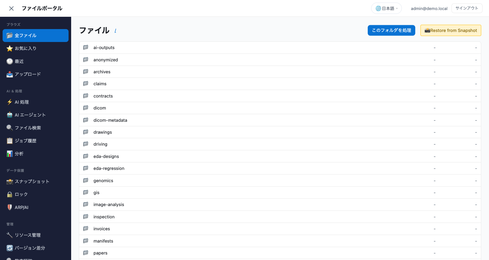
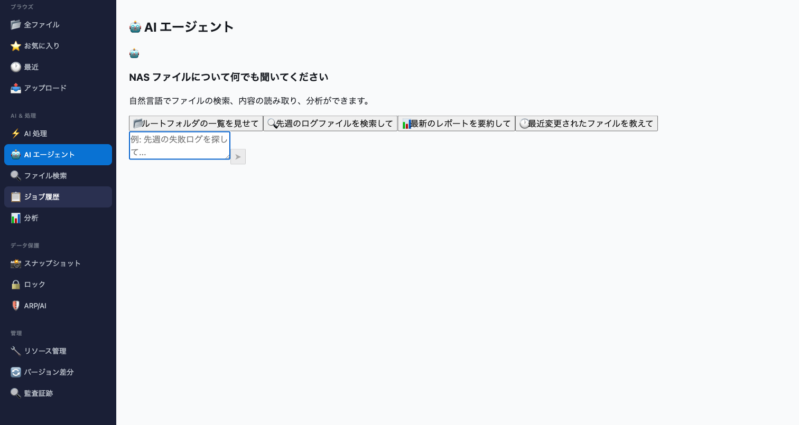
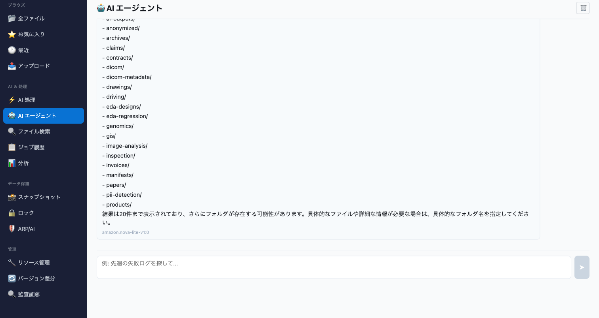
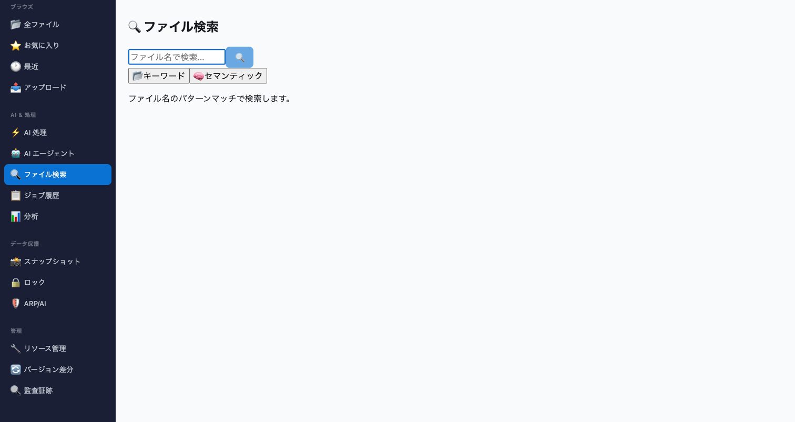
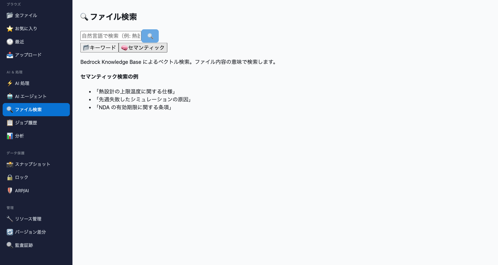
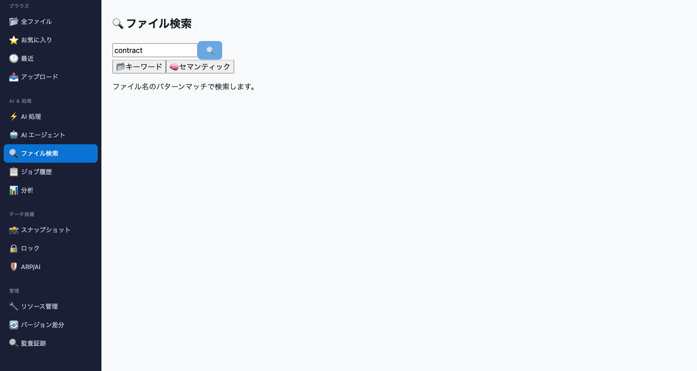

# AI Agent & Semantic Search — Demo Guide

> 🌐 Language: **English** | [日本語](../../solutions/amplify-portal/docs/ai-agent-demo-guide.md)

Step-by-step demo of the AI Agent Chat, Semantic Search, Bedrock Guardrails, Multi-Agent Trace, and HITL Action Approval features added in Part 3.

---

## Prerequisites

| Item | Required |
|------|:---:|
| Portal deployed (sandbox or production) | ✅ |
| Bedrock model access (amazon.nova-lite-v1:0) | ✅ |
| Bedrock Knowledge Base (for semantic search) | Optional |
| Bedrock Guardrail (for PII masking) | Optional |

---

## Feature 1: AI Agent Chat

The AI Agent is accessible from the sidebar under **AI & Processing → 🤖 AI エージェント**.

### What you see


*Sidebar showing the new AI Agent and File Search sections*


*Initial Agent Chat view with suggested prompts*

### Try it

1. Click **🤖 AI エージェント** in the sidebar
2. Click any of the 4 suggested prompts, or type your own question:
   - "ルートフォルダの一覧を見せて" (Show root folders)
   - "先週のログファイルを検索して" (Search for last week's log files)
   - "最新のレポートを要約して" (Summarize the latest report)
3. Watch the agent execute tool calls in real-time

### Tool call trace


*Agent response with tool call trace showing which specialist agent executed each tool*

The trace shows:
- Tool name (e.g., `list_files`, `read_file`, `search_files`)
- Agent label (e.g., `file-explorer`, `safety-controller`)
- Input parameters
- Truncated output

Click the **🔧 ツール実行** details to expand/collapse the trace.

---

## Feature 2: Semantic Search

Accessible from **AI & Processing → 🔍 ファイル検索**.

### Keyword Mode


*Keyword search: pattern matching on file names*

- Type a pattern (e.g., "contract", "pdf", "JOB_")
- Results appear with 500ms debounce (auto-search as you type)
- Click a result to navigate to the file in All Files

### Semantic Mode


*Semantic search: natural language queries against file content (requires Bedrock KB)*

- Toggle the **🧠 セマンティック** pill
- Type natural language (e.g., "thermal design temperature limits")
- Results show relevance score + content snippet
- Requires `bedrockKbId` in portal-config.ts

### Search Results


*Keyword search results for "contract"*

---

## Feature 3: Bedrock Guardrails

When configured (`bedrockGuardrailId` in portal-config.ts), all AI Agent responses are filtered:

- **PII Masking**: Email, phone, name, IP → `[REDACTED]`
- **PII Blocking**: SSN, credit card, AWS keys → response blocked
- **Content Filtering**: Sexual, violence, hate content blocked

A **🛡️ ガードレール適用済み** badge appears on filtered responses.

### Setup

```bash
# Deploy the guardrail template
aws cloudformation deploy \
  --template-file solutions/amplify-portal/infrastructure/bedrock-guardrail.yaml \
  --stack-name portal-guardrail \
  --region ap-northeast-1

# Copy outputs to portal-config.ts
aws cloudformation describe-stacks --stack-name portal-guardrail \
  --query "Stacks[0].Outputs"
```

---

## Feature 4: Multi-Agent Workflow Trace

The Agent Chat operates as a multi-agent system with specialist roles:

| Agent | Tools | Responsibility |
|-------|-------|---------------|
| `file-explorer` | list_files, read_file, search_files, get_volume_summary | File operations |
| `safety-controller` | request_action_approval | Dangerous action gating |

Each tool call in the trace shows which specialist agent executed it.

---

## Feature 5: HITL Action Approval

When you ask the agent to perform a dangerous operation (delete, lock, block user), it requests human approval before executing.

### Trigger it

Type: "vol_test ボリュームを削除して" (Delete vol_test volume)

The agent will:
1. Recognize this as a destructive action
2. Call `request_action_approval` tool
3. Return an approval request to the frontend
4. A modal appears asking you to Approve or Reject

### Approval modal shows:

- **Action type**: delete, lock, block_user, enable_snaplock, etc.
- **Target**: The resource being affected
- **Reason**: Why the agent is proposing this
- **Reversibility warning**: ⚠️ shown for irreversible actions
- **Reject button** (default focus) — safety first
- **Approve button** — conscious confirmation

---

## DemoMode Behavior

All features work without FSx for ONTAP:

| Feature | DemoMode | Full Connection |
|---------|:---:|:---:|
| Agent Chat (list/read/search tools) | ✅ mock data | ✅ real S3 AP |
| Keyword Search | ✅ mock 15 files | ✅ real S3 AP |
| Semantic Search | ❌ error (no KB) | ✅ Bedrock KB |
| Guardrails | ❌ (no guardrail ID) | ✅ filters responses |
| Multi-Agent Trace | ✅ labels shown | ✅ labels shown |
| HITL Approval | ✅ modal appears | ✅ modal appears |

---

## Related Documents

| Document | Purpose |
|----------|---------|
| [User Guide](portal-user-guide.md) | End-user daily operations |
| [Quick Reference](portal-quick-reference.md) | 1-page cheat sheet |
| [Implementation Guide](../../solutions/amplify-portal/docs/IMPLEMENTATION.md) | Architecture details |
| [AI Features Quick Start](ai-features-quick-start.md) | Bedrock Q&A, Rekognition, Athena |
