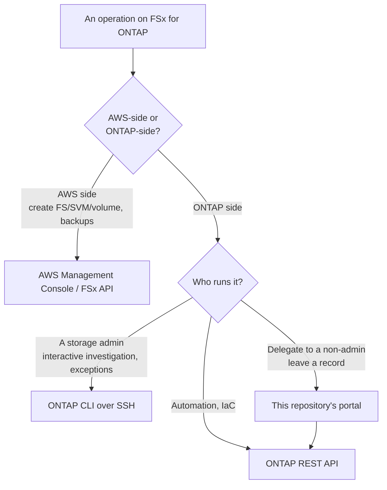

# FSx for ONTAP Management Interfaces — What You Can Reach, and What You Cannot

🌐 **Language / 言語**: [日本語](../ja/fsx-ontap-management-interfaces.md) | **English**

> Purpose: to settle, with citations, which interfaces are actually usable when
> operating Amazon FSx for NetApp ONTAP (hereafter FSx for ONTAP). Every document,
> implementation and article in this repository is written on this basis.

[日本語](../ja/fsx-ontap-management-interfaces.md)

---

## Conclusion

There are three management interfaces you can reach for FSx for ONTAP **without routing through an additional third-party SaaS**:

| Interface | Path | Scope |
|-----------|------|-------|
| AWS Management Console / FSx API | AWS authentication (IAM) | The AWS-side operations on file systems, SVMs and volumes; backups |
| ONTAP CLI (SSH) | SSH to the file system management endpoint | ONTAP cluster-administrator operations |
| ONTAP REST API | HTTPS to the management endpoint | The same operations as the CLI, from code |

The management endpoint for the CLI and the REST API **is reachable only from inside the VPC, or through a Transit Gateway peered network**.

**ONTAP System Manager is not on that list.** The only path to System Manager for FSx for ONTAP is through the vendor's SaaS console, and that SaaS supports FSx for ONTAP only in a mode that requires SaaS connectivity. Sources below.

---

## Where System Manager sits (with sources)

### What AWS says

The AWS feature announcement of 20 December 2023 states plainly that System Manager support for FSx for ONTAP is delivered through the vendor's SaaS:

> System Manager support is available through NetApp BlueXP for all AWS Regions where FSx for ONTAP is available. <!-- allow:vendor-ref: verbatim quotation from the AWS announcement -->

Source: [FSx for NetApp ONTAP now supports using NetApp System Manager to manage your file systems](https://aws.amazon.com/about-aws/whats-new/2023/12/fsx-netapp-ontap-netapp-system-manager-file-systems/) (AWS What's New, 2023-12-20)

What AWS documents for the FSx for ONTAP management endpoint is the ONTAP CLI over SSH and the REST API, not a System Manager web UI. On reachability:

> You can reach the endpoints only from within the virtual private cloud (VPC) or through an AWS Transit Gateway peered network.

Source: [How do I use the NetApp ONTAP CLI to modify storage data tiering policies for my FSx for ONTAP volume?](https://repost.aws/knowledge-center/fsx-ontap-modify-data-tiering) (AWS re:Post Knowledge Center)

### The vendor SaaS deployment modes

That SaaS has three deployment modes with different connectivity requirements, and **FSx for ONTAP can be managed only in the standard mode, the one that requires SaaS connectivity**. The vendor's own comparison table records "No" for Amazon FSx for ONTAP in both restricted and private mode.

| Managed system | standard (SaaS) | restricted | private |
|----------------|:---------------:|:----------:|:-------:|
| Amazon FSx for ONTAP | Yes | **No** | **No** |
| On-premises ONTAP clusters | Yes | Yes | Yes |
| Cloud Volumes ONTAP | Yes | Yes | Yes |

The same table attaches these conditions to standard mode:

- A connection to the SaaS application is **required**
- The UI is used from the SaaS application, over the public internet
- The API endpoint is a single endpoint on the SaaS side
- Authentication is through the SaaS provider's authentication service, or identity federation

Source: [Learn about NetApp Console deployment modes](https://docs.netapp.com/us-en/bluexp-setup-admin/concept-modes.html) (vendor documentation, 2026-05-28 revision) <!-- allow:vendor-ref: cited as the basis for a constraint -->

### Therefore

In an organisation that cannot place a third-party SaaS in the storage management path, System Manager for FSx for ONTAP **is not an option at all**. The restricted and private modes, which exist to move towards air-gapped operation, do not cover FSx for ONTAP.

---

## This repository's position

On the premise that no additional third-party SaaS sits in the storage management path, we standardise on **AWS-native mechanisms and ONTAP's own API**.

| Goal | What this repository uses |
|------|---------------------------|
| Metric retention and alerting | Amazon CloudWatch |
| Reading and changing ONTAP configuration | ONTAP REST API (through a VPC Lambda) |
| Tiering | FabricPool |
| Migration and synchronisation | AWS DataSync |
| Backup, replication, cloning | Snapshot / FlexClone / SnapMirror |
| File access events | FPolicy → EventBridge |

This is **not a judgement about which product is better; it follows from a constraint about data and service residency**. Where a third-party SaaS is acceptable in the management path, the vendor console is a legitimate option. The patterns here aim to hold up in environments where that premise cannot be granted.

> **Residency note**: the standard-mode SaaS is delivered over the public internet, and the region it runs in is not customer-selectable. Where the review process asks which provider and which region appear in the management path, that is the material fact. For the specifics of the trust relationship with the SaaS provider's AWS account — which account, which region, how an external ID is handled — ask the vendor directly at evaluation time. This document is grounded only in what public documentation states.

---

## Common misconceptions

### 1. "Connect to System Manager over a VPN and you can manage FSx for ONTAP" <!-- drift-exempt: quotes the misconception in order to correct it -->

That describes an on-premises ONTAP cluster. On-premises, any network that can reach the cluster management LIF can open the System Manager web UI directly. What the FSx for ONTAP management endpoint offers is SSH (ONTAP CLI) and the REST API; the System Manager web UI is not there.

On the axis of reachability, the thing to compare this repository's portal against is **the ONTAP CLI and REST API, not System Manager**.

### 2. "ONTAP upgrades and disk replacement are System Manager's job"

On FSx for ONTAP, AWS operates the ONTAP version, the nodes, the disks and the shelves. As customer operations they **do not exist**. The correct framing is not "another UI's job" but "not the customer's work".

### 3. "Private mode removes the SaaS dependency"

Private mode needs no connection to the SaaS, but it **does not cover FSx for ONTAP** (see the table above). Removing the SaaS dependency is what takes FSx for ONTAP out of scope.

### 4. "The portal's benefit is that it needs no VPN"

The VPN is not the point. The ONTAP CLI and REST API are also reachable from inside the VPC. The portal's benefits are two:

- **Delegation**: a specific operation can be given to someone outside storage administration (security, compliance, data protection) without handing them cluster-administrator SSH
- **Record**: who ran which operation and when is retained against a Cognito principal

---

## Choosing an interface

The portal is a layer on top of the REST API. It does not replace the REST API; it moves the caller from a human administrator to a screen behind Cognito authentication.

---

## Related Documents

| Document | Contents |
|----------|----------|
| [Admin Capability Map](../../solutions/amplify-portal/docs/admin-capability-map.en.md) | What each interface covers, and what the portal implements |
| [ONTAP Connection Guide](../../solutions/amplify-portal/docs/ONTAP-CONNECTION-GUIDE.en.md) | VPC, secret and management LIF wiring |
| [Verification results](../../solutions/amplify-portal/docs/verification-results.en.md) | How far each feature has actually been verified |
| [Comparison of alternatives](../comparison-alternatives.md) (Japanese) | S3 AP / EFS / NFS / DataSync and read-cache choices |
| [ONTAP integration notes](../ontap-integration-notes.en.md) | NAS coexistence, identity, data protection, OT |
