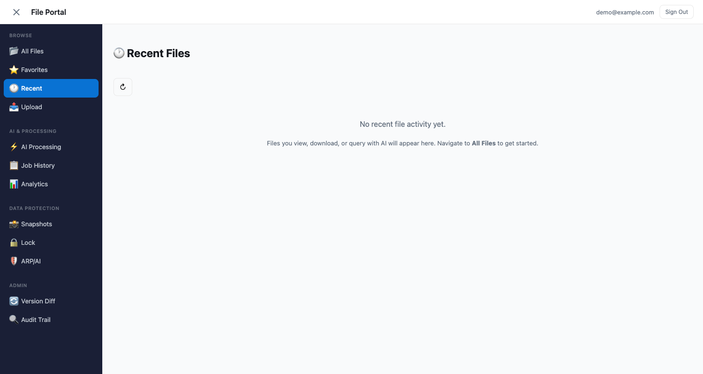
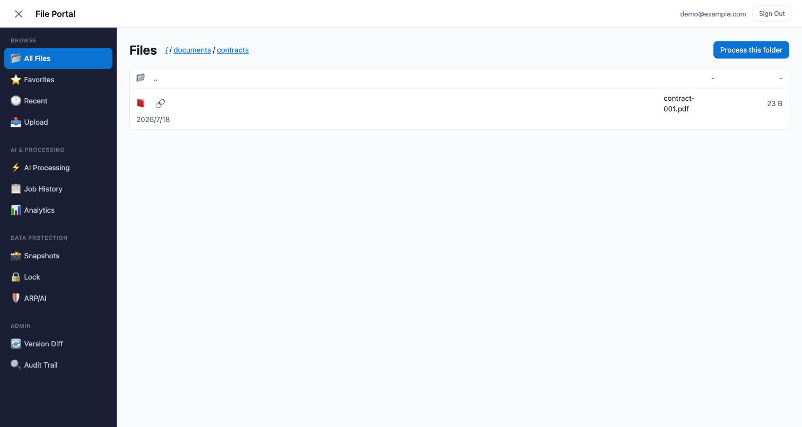

# File Portal Demo Guide — FSx for ONTAP S3 Access Points

> 🌐 Language: **English** | [日本語](../ja/portal-demo-guide.md)

Step-by-step demo guide for the web-based file portal that provides file browsing, upload, AI analysis, and processing workflow trigger against FSx for ONTAP volume data.

This portal delivers a file management experience similar to Box, Google Drive, or SharePoint — applied to NAS data on FSx for ONTAP. No data copying required — files written via NFS/SMB are immediately accessible from the browser.

---

## Environment Setup (~15 minutes)

### Prerequisites

- FSx for ONTAP file system (ONTAP 9.14.1+)
- S3 Access Point in AVAILABLE state (Internet-origin)
- Node.js 18.17+
- AWS CLI v2 (configured with credentials)

### Setup Steps

```bash
cd solutions/amplify-portal

# 1. Install dependencies
make install

# 2. Create configuration
cp amplify/portal-config.example.ts amplify/portal-config.ts
# → Set s3ApAlias to your S3 AP alias

# 3. Frontend settings (for Upload tab)
# Edit src/portal-settings.ts:
#   region: "ap-northeast-1"  (your FSx region)
#   accountId: "your AWS account ID"
#   s3ApAlias: "same S3 AP alias"

# 4. Deploy backend (~5 min)
make sandbox

# 5. Create Cognito user
USER_POOL_ID=$(python3 -c "import json; print(json.load(open('amplify_outputs.json'))['auth']['user_pool_id'])")
aws cognito-idp admin-create-user \
  --user-pool-id "$USER_POOL_ID" \
  --username "demo@example.com" \
  --temporary-password "TempPass1!" \
  --user-attributes Name=email,Value=demo@example.com Name=email_verified,Value=true \
  --message-action SUPPRESS
aws cognito-idp admin-set-user-password \
  --user-pool-id "$USER_POOL_ID" \
  --username "demo@example.com" \
  --password "Demo1234!" --permanent

# 6. Start dev server
make dev
# → Open http://localhost:5173 in your browser
```

---

## Demo Flow

### 1. Login

Sign in with the Cognito user you created.


> Similar to Box or Google Drive login. In production, SAML/OIDC enterprise SSO integration is available.

---

### 2. Files Tab — Folder Navigation

After login, the Files tab displays your FSx for ONTAP volume's folder structure.


Click any folder to navigate. Breadcrumbs show the current path.


> Folders and files placed on the volume via NFS/SMB appear directly — no data copy or sync required.

---

### 3. Files Tab — Share Link Generation

Click the 🔗 icon on any file to generate a time-limited sharing link (Presigned URL).


- Expiry: choose from 5 min / 15 min / 1 hour / 6 hours
- Copy URL and send to recipients — no login required to access
- URL becomes invalid after expiry

> Equivalent to Box "Shared Links" or Google Drive "Anyone with the link" sharing.

---

### 4. Files Tab — AI Assistant

The AI panel on the right lets you ask questions about any file.


Click a file to select it → type your question → Bedrock (Nova Lite) generates an answer.

Examples:
- "When does this contract expire?"
- "What caused the error in this log file?"
- "Summarize the statistics in this CSV"

---

### 5. Upload Tab — Storage Browser

The Upload tab uses Storage Browser for S3 to upload and manage files directly from the browser.


Click the S3 AP alias to browse folders. Drag-and-drop to upload, click a file to download.

> **Uploaded files are immediately visible via NFS/SMB** — ONTAP's strong consistency ensures the latest data is visible across all protocols immediately after write.

---

### 6. Process Tab — AI/ML Workflow Trigger

Trigger AI/ML processing pipelines on NAS data.


- Select a processing pattern (UC1 Legal Compliance, UC6 EDA, etc.)
- Specify the target folder (S3 AP path)
- Click "Start Processing" to launch a Step Functions workflow

> On first deploy, the Step Functions ARN is not configured (red banner shown). Deploy a UC pattern or run `make sfn-test-create` for a test workflow.

---

### 7. Results / History Tabs

**Results**: Real-time status of running jobs.


**History**: All past job executions.


---

### 8. Analytics Tab — SQL Queries

Execute SQL queries against NAS data using Athena + Glue Data Catalog.


---

### 9. Mobile Responsive

Responsive design ensures usability on tablets and smartphones.


---

### 10. New Features: Favorites / Version History / Audit Trail

#### Favorites (★ tab)

Bookmark files for quick access.


> Equivalent to Box "Favorites" or Google Drive "Starred". Click ☆ on any file in the listing to pin it.

#### Version History (Versions tab)

Point-in-time history based on ONTAP Snapshots. Browse and restore past file states.


> Similar in purpose to Google Drive "Version history" or SharePoint "Version management", but operates on volume-level snapshots rather than individual files. FlexClone provides instant access to past data.

#### Audit Trail (Audit tab)

Query CloudTrail S3 data events via Athena to display file access history.


> Shows "who accessed which file, when" for compliance officers. Filter by date range, file path, and operation type.

#### Recent Files (Recent section)

Shows files you recently viewed, downloaded, or queried with AI. Sorted by most recent first.



> Similar to Google Drive "Recent" or Box "Recents". Each entry shows the action type (view/download/AI query), relative time (2m ago, 3h ago), and clicking navigates back to the file in All Files. Data is per-user (DynamoDB, owner-scoped).

#### Office File Preview (All Files section)

Preview PDF and DOCX files directly in the browser without downloading.



> The 📕 icon appears next to `.pdf` files. Click to open an inline preview using the browser's built-in PDF viewer (iframe + Presigned URL). DOCX files show a 📝 icon and render client-side via the docx-preview library.

| File type | Preview method | Icon |
|-----------|---------------|:---:|
| PDF | Browser built-in viewer (iframe + Presigned URL) | 📕 |
| DOCX | Client-side rendering via docx-preview library | 📝 |
| Images | Presigned URL popover (existing) | 🖼️ |
| Other | Download link | 📄 |

> Click the 📕 or 📝 icon next to a file to open the inline preview. PDF renders natively; DOCX layout accuracy is approximately 70-80%. For XLSX/PPTX, download and open locally (Phase 2 will add server-side conversion).

#### FlexClone Restore (FC7 pattern)

Restore files from a specific snapshot using FlexClone — zero-copy, instant access to past data.

1. In **All Files**, click **📸 Restore from Snapshot**
2. Enter the snapshot name (e.g., `daily.2026-07-21_0010`)
3. Click **Create FlexClone**
4. The system creates a FlexClone volume + attaches an S3 AP → accessible in seconds
5. Check the result in **Job History**

> Uses the `FC7_FLEXCLONE_RESTORE` processing pattern. The FlexClone is space-efficient (only changed blocks consume storage) and can be deleted when no longer needed.

---

## Cleanup

After the demo, delete resources in this order:

```bash
# 1. Amplify sandbox (Cognito, AppSync, Lambda, DynamoDB)
make sandbox-delete

# 2. S3 Access Point (if you created one for demo)
aws fsx detach-and-delete-s3-access-point \
  --name portal-demo-eda \
  --region ap-northeast-1

# 3. (Optional) Test data
# Files placed via NFS/SMB must be manually removed
```

> sandbox-delete removes ALL resources completely. User accounts and job history are permanently deleted.

---

## FAQ

**Q: Files tab shows "No files"**
A: `portal-config.ts` has empty `s3ApAlias`. Set it and re-run `make sandbox`.

**Q: Upload tab shows AccessDenied**
A: Check `src/portal-settings.ts` has `s3ApAlias` and `accountId` set. Re-deploy with `make sandbox` to auto-provision IAM permissions.

**Q: Process tab shows red banner**
A: Step Functions ARN not configured. Run `make sfn-test-create` and set the ARN in `portal-config.ts` and `start-processing.js`.

**Q: Can I try without FSx for ONTAP?**
A: Yes. Set `s3ApAlias` to a regular S3 bucket name for DemoMode. NFS/SMB concurrent access won't be available, but all other features work.

---

## Production Deployment (Amplify Hosting)

To host the portal on a shareable HTTPS URL for your team:

```bash
# 1. Production build
cd solutions/amplify-portal
npx vite build

# 2. Deploy to Amplify Hosting
aws amplify create-app --name "your-portal-name" --region ap-northeast-1
aws amplify create-branch --app-id <APP_ID> --branch-name main
aws amplify create-deployment --app-id <APP_ID> --branch-name main

# 3. Zip and upload dist/
cd dist && zip -r /tmp/deploy.zip .
curl -T /tmp/deploy.zip "<zipUploadUrl>"

# 4. Start deployment
aws amplify start-deployment --app-id <APP_ID> --branch-name main --job-id <JOB_ID>
```

After deployment, the portal is accessible at `https://main.<APP_ID>.amplifyapp.com`.


> Note the address bar shows `https://` + `amplifyapp.com` domain. Custom domains (e.g., `portal.your-company.com`) can be configured with Route 53 + ACM certificate.

---

## Related Resources

- [README (full setup)](../../solutions/amplify-portal/README.md)
- [Storage Browser Demo Guide](./storage-browser-demo-guide.md)
- [S3 AP Compatibility Notes](../s3ap-compatibility-notes.md)
- [File Portal UI Selection Guide](../file-portal-amplify-gen2.md)
