# The same four features on three foundations — Amplify Gen 2 / AWS Blocks / Nx Plugin for AWS

> 🌐 **Language / 言語**: [日本語](../ja/portal-parity-four-features.md) | English

## TL;DR

- [Choosing a foundation](scaffolding-and-backend-toolkit-choices.md) generated the starters and
  measured them **as far as a local synth**. This document continues from there: the **same four
  features (sign in, list, read, upload) implemented on all three foundations and run on AWS
  against one Amazon FSx for NetApp ONTAP S3 Access Point**.
- All four features worked on all three. **The listing returned 13 objects, the read returned
  1,615 bytes of `text/markdown; charset=utf-8`, and the upload round-tripped 24 bytes** — the
  same values on each.
- **Reaching the access point was identical on all three.** Passing the alias to the standard S3
  SDK as a bucket name is enough: no endpoint override, no VPC attachment. What the foundation
  changes is not how you reach it but **how the permission is written and where it has to go**.
- **The same malformed input was refused by a different layer on each.** On the Nx build,
  `../escape.txt` was stopped by AWS WAF before it reached the Lambda (confirmed against the Web
  ACL's `BlockedRequests`); on AWS Blocks it reached the procedure and came back as a domain
  error. Both refuse it, but **what you see while debugging is not the same**.
- Measured: **AWS Blocks, 318 s and 82 resources**; **Nx Plugin for AWS, 307 s and 100 resources**.
  Amplify Gen 2 is represented by the portal this repository already runs, which does far more
  than these four features, so it is not lined up on the same ruler.
- The screens are in [twelve captures](#twelve-captures). **Reading and writing are laid out
  differently on each.**

## Scope

**Covered**: how the four features differed to implement, reaching the access point and writing
the permission, the values confirmed on the deployed builds, which layer refused what, the twelve
captures, the pitfalls, and how to reproduce it.

**Not covered**: which one is better. Performance (neither throughput nor latency was measured).
Anything beyond the four features — ONTAP management operations, AI processing, the eight-language
UI and ARP/WORM are outside this comparison, and only their prerequisites are recorded in
[the phases beyond](#the-phases-beyond-the-four-features). AWS Blocks behaviour after GA (the
measurements are from preview).

**Audience**: anyone building browser access to an FSx for ONTAP volume and still choosing a
foundation, or already on one and wondering what the others would have been like.

## The four features, fixed

To make the comparison mean anything, the feature set was fixed at four and the API names were
kept identical across all three.

| Feature | API name | What it does |
|---|---|---|
| Sign in | (the foundation's own auth) | Authenticate |
| List | `listFiles(prefix)` | List the objects under a prefix |
| Read | `readFile(path)` | Fetch the contents of one object |
| Upload | `uploadFile(name, text)` | Write one object |

A helper, `describeTarget()`, reports the default prefix and the writable prefix.

**Why only four**: the portal in this repository has more than 180 operations. Porting that three
times would make the comparison about how much code was written rather than about the
foundations. Four features can be taken to the same depth on each.

## The shared target

All three read and wrote one and the same S3 Access Point.

| Item | Value |
|---|---|
| Access point | Internet origin (no VPC attachment) |
| Listing target | `reports/2026/05/10/` — **13 objects** |
| Read target | `compliance-report-<uuid>.md` — **1,615 bytes**, `text/markdown; charset=utf-8` |
| Write target | `portal-parity/{blocks,nx,amplify}/`, separated per foundation |
| What was written | `note-2026-09-14.txt` — **24 bytes** |

The `Content-Type` is not something the application set: it is metadata the object carries on the
FSx for ONTAP volume. All three received the same value.

Writes were confined to a prefix because this access point exposes a **live volume that NFS and
SMB clients are also using**. Accepting an arbitrary key is not an option in this environment.

## One way in, three ways to grant it

### What was the same

An Internet-origin access point is reachable by **passing the alias to the standard S3 SDK as a
bucket name**. No endpoint override, and no need to place the Lambda in a VPC. All three read and
wrote from Lambda functions outside any VPC.

### The access-point ARN form, required by all three

The permission has to take the form below. The bucket form (`arn:aws:s3:::<alias>`) answers
`AccessDenied` for `s3:ListBucket`, `s3:GetObject` and `s3:PutObject` alike.

```
arn:aws:s3:<region>:<account-id>:accesspoint/<access-point-name>          # ListBucket
arn:aws:s3:<region>:<account-id>:accesspoint/<access-point-name>/object/* # GetObject, PutObject
```

This was established with a throwaway IAM role and a control (2026-09-14): with the bucket form,
all three operations were refused; with the access-point form, all three succeeded.

**This is the part to watch on AWS Blocks.** `FileBucket.fromExisting(alias)` is the abstraction
for referencing an existing bucket, and internally it calls `grantReadWrite()` on
`s3.Bucket.fromBucketName(alias)`. The permission it generates is therefore in the **bucket
form**, which does not reach an access point. An access-point-form policy has to be added
explicitly, alongside what the block grants.

```ts
// aws-blocks/index.cdk.ts — granted explicitly, in addition to the block's own grant
blocksStack.handler.addToRolePolicy(
  new iam.PolicyStatement({
    actions: ['s3:ListBucket', 's3:GetObject', 's3:PutObject'],
    resources: [apArn, `${apArn}/object/*`],
  }),
);
```

### Where the permission goes

| | Granted to | Why |
|---|---|---|
| AWS Blocks | A policy added to one handler | The whole API is a single Lambda |
| Nx Plugin for AWS | A shared role handed to every Lambda | **One Lambda per procedure** (`pattern: 'isolated'`) |
| Amplify Gen 2 | Granted to the function in the backend definition | Following the existing portal's shape |

The Nx generator creates as many Lambdas as there are procedures — five here, for four features
plus the generated `echo`, confirmed in the synthesized template. There is no typed route to the
individual handlers (`RestApiIntegration` does not expose `handler`), so one role is created and
handed to all of them as a default option.

```ts
// packages/infra/src/stacks/application-stack.ts
const api = new PortalApi(this, 'PortalApi', {
  integrations: PortalApi.defaultIntegrations(this)
    .withDefaultOptions({
      role: apiRole, // the shared role carrying the access-point-form policy
      environment: { PORTAL_S3AP_ALIAS: s3apAlias },
    })
    .build(),
});
api.grantInvokeAccess(identity.identityPool.authenticatedRole);
```

The generated integrations default to `Tracing.ACTIVE`, so replacing the role with your own means
adding `xray:PutTraceSegments` and `xray:PutTelemetryRecords`. Leave them out and every
invocation records a trace failure.

### Storage abstraction, present or absent

| | Storage abstraction | Implementation |
|---|---|---|
| AWS Blocks | `FileBucket.fromExisting()` exists | Through the block's API, with the permission handled separately |
| Nx Plugin for AWS | **None** | `@aws-sdk/client-s3` directly |
| Amplify Gen 2 | `defineStorage` and Storage Browser exist | Following the existing portal's shape |

Nx Plugin for AWS takes responsibility for generating the API and the website and leaves data
access to the author. That is a division of labour rather than a gap — and it cuts the other way
too: **when the target does not fit a standard abstraction, as an access point does not, having
no abstraction is the more direct path.**

## Authentication

| | Sign-in shape | MFA default | Screen |
|---|---|---|---|
| AWS Blocks | A modal in the app (`AuthBasic` plus the bundled UI kit) | — | The app's own |
| Nx Plugin for AWS | **Redirect to the Cognito hosted UI** (OIDC `signinRedirect()`) | **REQUIRED** (SMS + TOTP) | Cognito's |
| Amplify Gen 2 | An Authenticator in the app (Amplify UI) | OPTIONAL | The app's own |

The Nx `UserIdentity` defaults to requiring MFA. A first sign-in has to enrol a second factor, and
an automated check that wants tokens has to walk that same path (see [the
pitfalls](#pitfalls)).

The generated user pool client does not enable the `ADMIN_*` auth flows. There is no privileged
shortcut, which means **a check signs in through the same public flow the browser uses**. As a
default, that is the right call.

## Twelve captures

Three foundations, four features, in the same order, against the same objects, at the same size
(1512x900). The UI language is English throughout: the AWS Blocks and Nx implementations exist
only in English, and UI language is not one of the axes being compared.

### Sign in

| Amplify Gen 2 | AWS Blocks | Nx Plugin for AWS |
|---|---|---|
| 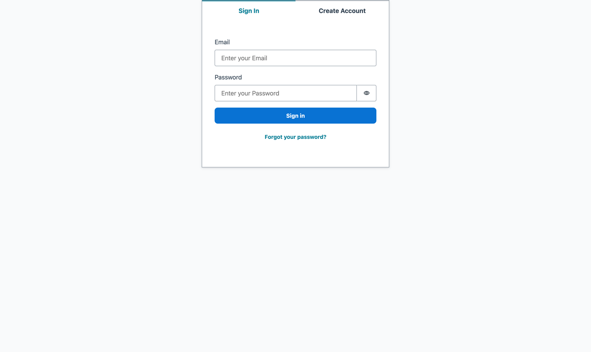 | 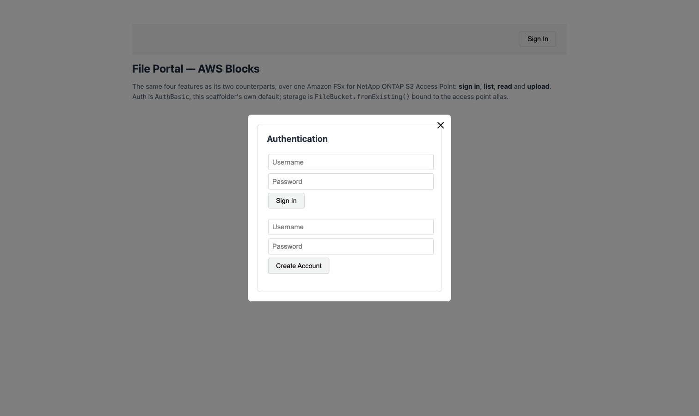 | 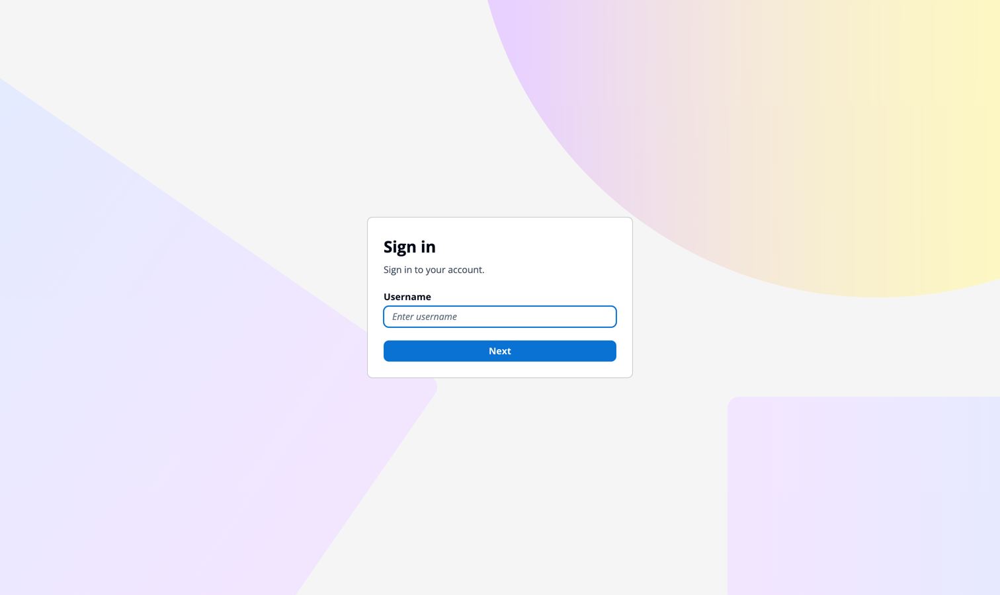 |
| Authenticator in the app | Modal in the app | Cognito hosted UI |

### List

| Amplify Gen 2 | AWS Blocks | Nx Plugin for AWS |
|---|---|---|
| 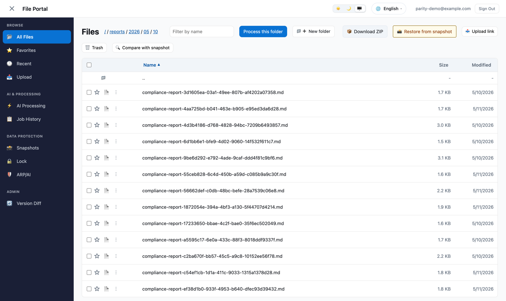 | 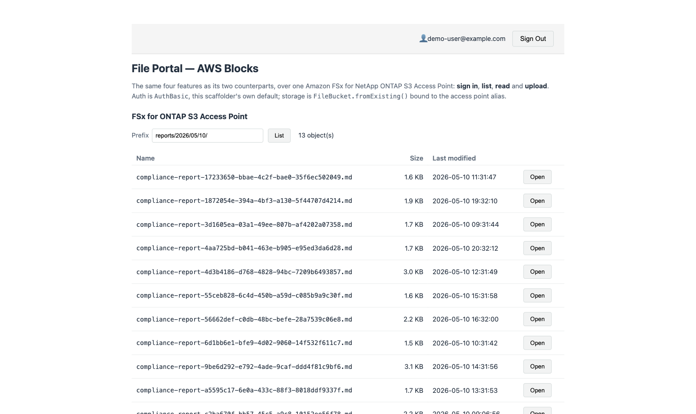 | 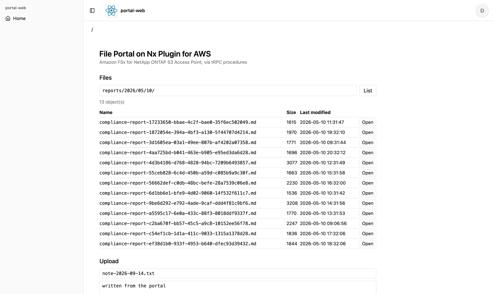 |
| Walk the folder tree (13 files plus `..`) | Type a prefix (13 objects) | Type a prefix (13 objects) |

### Read

| Amplify Gen 2 | AWS Blocks | Nx Plugin for AWS |
|---|---|---|
| 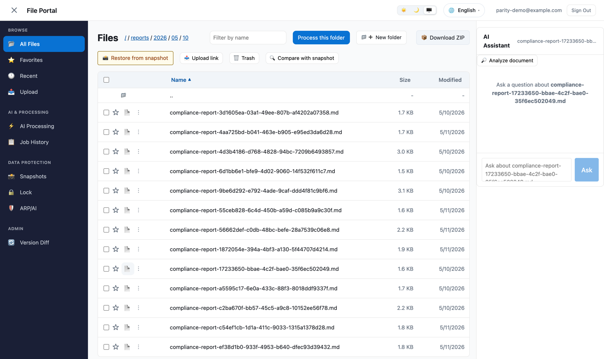 | 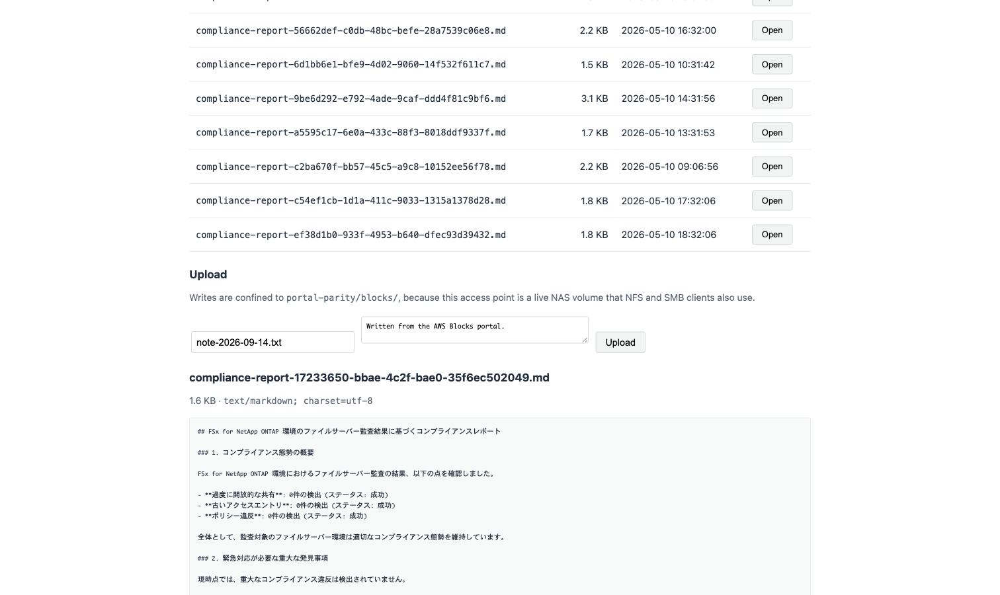 | 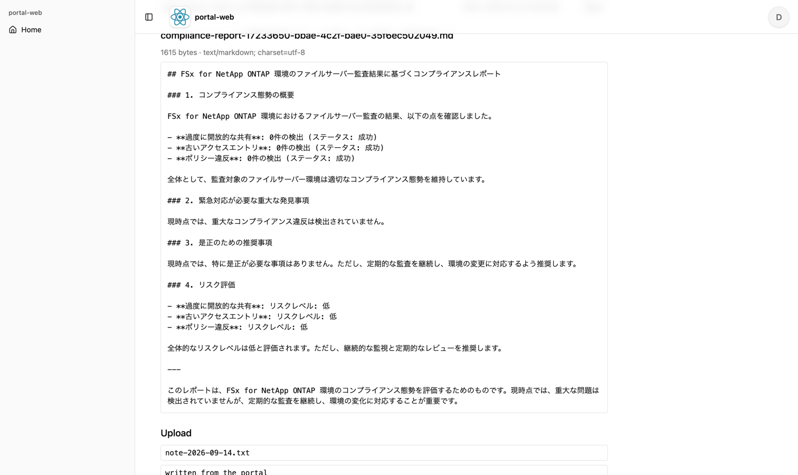 |
| **Does not render the contents.** Select it for the AI Assistant, or take a folder-level ZIP | Contents rendered in the page (1,615 bytes) | Contents rendered in the page (1,615 bytes) |

The Amplify Gen 2 column behaves differently because it is **the portal this repository actually
runs**, not a minimal UI written for four features. As far as was checked while capturing, no path
renders `.md` in the page — both clicking the filename and the row's own menu were tried. The
other two columns show the text only because that is what was written for them.

> **Accessibility note**: while capturing these, the document control on a file row was found to
> carry `aria-label="Download <filename>"` while clicking it does not download anything (it
> selects the file for AI processing). The `title` attribute describes both behaviours, but the
> accessible name a screen reader announces claims only `Download`. Recorded as something to fix
> in the portal.

### Upload

| Amplify Gen 2 | AWS Blocks | Nx Plugin for AWS |
|---|---|---|
| 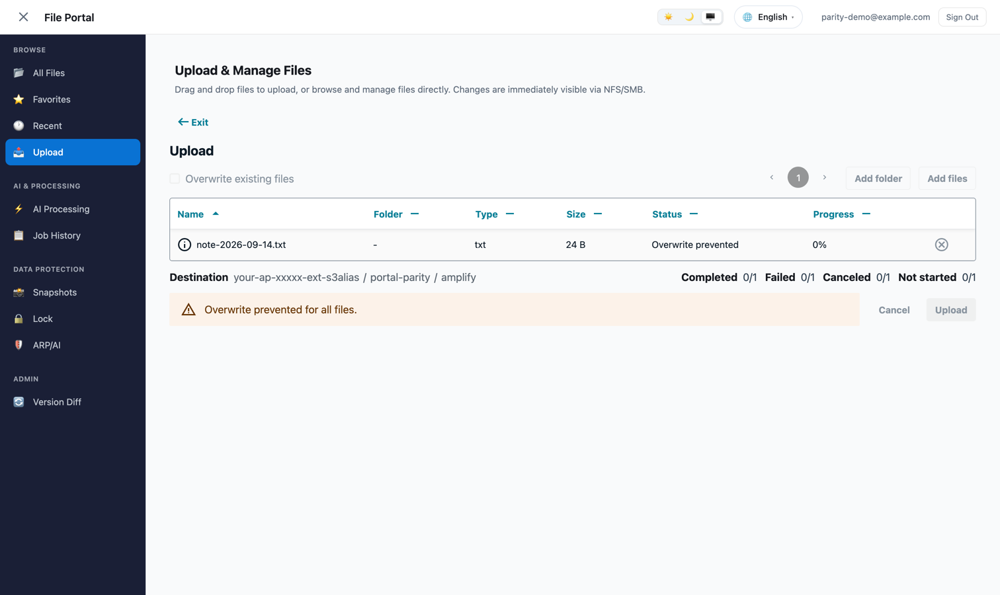 | 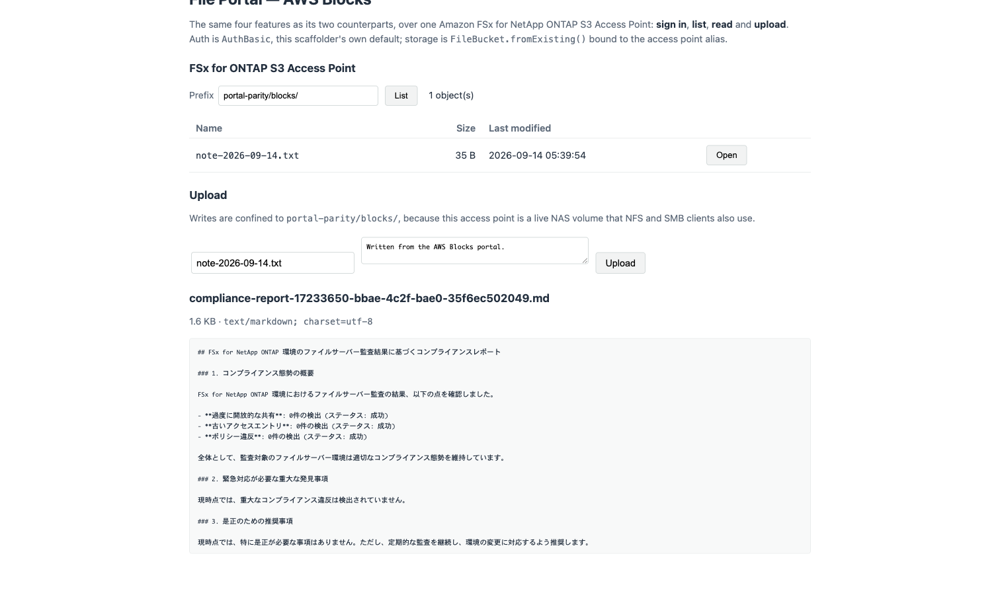 | 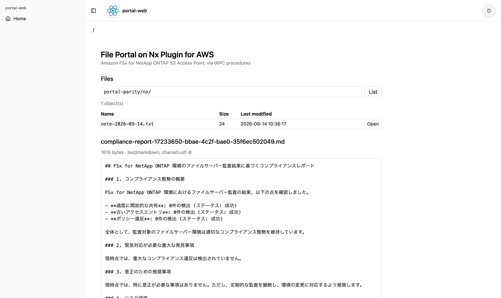 |
| **A separate screen** (Storage Browser). 24 bytes written | Same screen as the listing. 24 bytes visible in it | Same screen as the listing. 24 bytes visible in it |

The Amplify Gen 2 screen renders the alias, so the text was replaced in the DOM with
`your-ap-xxxxx-ext-s3alias` immediately before the capture. The AWS Blocks and Nx implementations
never put the alias on screen, so no replacement was needed.

## Which layer refuses

The same "write outside the permitted prefix" was attempted with two different inputs.

| Input | Nx Plugin for AWS | AWS Blocks |
|---|---|---|
| `../escape.txt` | **HTTP 403** `{"message":"Forbidden"}` — never reaches the Lambda | The procedure's own domain error |
| An empty file name | **HTTP 400** plus the procedure's own domain error | The procedure's own domain error |

On the Nx build, the traversal-shaped input was **stopped by AWS WAF**. The generator attaches a
Web ACL to the API by default (`enableWaf` defaults to true) and applies the Core Rule Set and
Known Bad Inputs managed rules. The Core Rule Set inspects the request body, so a body containing
`../` is dropped before the Lambda sees it.

**Evidence**: the `uploadFile` Lambda recorded 3 invocations against 5 write requests sent (across
two runs). The two missing are the two traversal attempts. The API's Web ACL metrics agree:
`BlockedRequests = 2`, `AllowedRequests = 14`.

The reading is not "WAF is safer". **Defence in depth on by default is an advantage, but the
refusal comes back as a generic 403 rather than as your own message, which moves the starting
point of an investigation.** Whether your guard fired or something upstream dropped the request
cannot be told apart until you look at the WAF metrics.

WAF metrics are not immediate, either. Right after the requests, `BlockedRequests` returned
nothing and `get-sampled-requests` returned zero samples. The value appeared as 2 a few minutes
later. **Absence immediately afterwards is not evidence of absence.**

## Measurements

Environment: ap-northeast-1, 2026-09-14. Deploy times are single measurements and depend on cache
state and what already exists in the account.

| | Deploy time | CloudFormation resources | Application Lambdas |
|---|---|---|---|
| AWS Blocks (production preset) | **318 s** | **82** | 1 (the whole API) |
| Nx Plugin for AWS (sandbox) | **307 s** | **100** | **5** (one per procedure) |
| Amplify Gen 2 | not measured | not measured | — |

**Why Amplify Gen 2 is not lined up**: the build compared here is the portal this repository runs,
which does far more than the four features. Building a separate four-feature Amplify app would
produce a number, but it would no longer be a measurement of this portal. For starter-to-starter
figures, see [Choosing a
foundation](scaffolding-and-backend-toolkit-choices.md#measurements).

**On AWS Blocks reaching 82 where the same preset's starter reached 117**: the difference comes
from **which blocks were used**, not from the preset. This implementation uses only `AuthBasic`
and an externally referenced `FileBucket`, and none of the starter's four `DistributedTable`
blocks or Realtime. Resource count follows the blocks in use more than the preset chosen.

## Pitfalls

### T1. The ARN form that `FileBucket.fromExisting()` generates

As above, it is the bucket form and does not reach an access point. Trusting the block's grant
means code that passes locally and answers `AccessDenied` for all three operations once deployed.

### T2. A green local suite says nothing about reachability

The AWS Blocks local e2e run passed 7 of 9. The two failures depended on reading real data, and
**the upload round-trip test passes locally**: the mock `FileBucket` starts empty, so a
write-then-read-back test completes entirely inside the mock. A green local suite is no evidence
that the FSx for ONTAP access point is reachable.

### T3. Generated code fails to compile until `nx sync` runs

After adding a dependency to `portal-api`, compiling `common-constructs` and `portal-web` failed
with 28 TS6059 / TS6307 errors. The errors point at **generated** files
(`common-constructs/src/app/apis/portal-api.ts` and
`portal-web/src/components/PortalApiClientProvider.tsx`), both of which resolve
`@fsxn-portal-nx/portal-api` to source and land outside `rootDir`. It looks as though the
generator emitted something broken; the cause is stale TypeScript project references. `nx sync`
clears all 28.

### T4. TOTP enrolment does not complete within the enrolling session

Even when `VerifySoftwareToken` returns `SUCCESS`, answering the MFA challenge with the session it
returns produces `CodeMismatchException` for a valid code. **Sign in again** to obtain a
`SOFTWARE_TOKEN_MFA` challenge that can be answered.

### T5. Username format, restricted when the pool aliases email

`AdminCreateUser` answers `Username cannot be of email format`. Keep the username plain and put
the address in the `email` attribute.

### T6. A hand-built query string breaks the SigV4 signature

The answer is 403 `SignatureDoesNotMatch`. The canonical form percent-encodes more than
`urllib.parse.quote` does by default, which leaves `/` alone — and a prefix contains slashes, so
the two always diverge here. Hand the parameters to `AWSRequest(params=...)`, let the signer
canonicalize, and send the URL that `prepare()` builds.

### T7. `aria-label` overriding the accessible name

The portal's language switcher displays `🌐 日本語 ▾` but carries `aria-label="言語"`, so looking
for `日本語` by accessible name never matches; the attribute has to be addressed directly. It
looks like an automation detail, and it is also an accessibility observation: **the name a screen
reader announces differs from the name on screen.**

### T8. The first-run tour and page reloads

The portal's first-run tour covers the listing. Reloading the page without first choosing "do not
show again" brings the tour back, and its modal swallows the next click. Return to the root
through the breadcrumb rather than by reloading.

### T9. Writing to Storage Browser's hidden `input[type=file]` has no effect

The component drives its own state, so setting files on the input element in the DOM does not
start an upload. The action in the table's overflow menu has to be triggered first.

## The phases beyond the four features

These four are the smallest useful unit; what a real portal needs starts after them. The
prerequisites for each phase are in [the phases beyond](portal-parity-next-steps.md).

## Reproducing it

```bash
# Common: put the Internet-origin access point's alias and name in the environment
export PORTAL_S3AP_ALIAS='<alias>-ext-s3alias'
export PORTAL_S3AP_NAME='<access-point-name>'

# AWS Blocks (preview)
npm create @aws-blocks/blocks-app -- <project>
#   aws-blocks/index.ts        the four features
#   aws-blocks/index.cdk.ts    the env var, plus the access-point-form IAM granted explicitly (T1)
npm run typecheck && npm run deploy      # production preset; only production brings CloudFront

# Nx Plugin for AWS
npm_config_yes=true npm create @aws/nx-workspace@1.0.0 -- <project> \
  --interactive=false --pm=npm --nxCloud=skip --skipGit --aiAgents=none
nx g @aws/nx-plugin:ts#website portal-web
nx g @aws/nx-plugin:ts#website#auth --project=@<project>/portal-web
nx g @aws/nx-plugin:ts#api portal-api --framework=trpc
nx g @aws/nx-plugin:connection --sourceProject=@<project>/portal-web --targetProject=@<project>/portal-api
nx g @aws/nx-plugin:ts#infra infra
#   packages/portal-api/src/{schema,procedures}/files.ts   the four features
#   packages/infra/src/stacks/application-stack.ts         empty when generated; the wiring goes here
nx sync                                   # required once a dependency is added (T3)
NX_TUI=false CI=true nx run @<project>/infra:deploy-sandbox --args="--rollback"
```

For teardown, see [Deploy verification and
teardown](scaffolding-deploy-verification.md#teardown). **The Nx output puts deletion protection
on the user pool and the DynamoDB table and `Retain` on the KMS keys, so they survive deleting the
stack.** If it was stood up as a check, take it through teardown the same day.

## Related documents

- [Choosing a foundation for a full-stack AWS
  app](scaffolding-and-backend-toolkit-choices.md) — starter-to-starter comparison, the defaults
  each generates, and the standing cost
- [Deploy verification and teardown for generated
  scaffolding](scaffolding-deploy-verification.md) — the practicalities of teardown, including
  deletion protection, `Retain` and the stickiness of express mode
- [The phases beyond](portal-parity-next-steps.md) — what to add after the four features, and what
  each phase assumes
- [FSx for ONTAP management
  interfaces](fsx-ontap-management-interfaces.md) — what can actually reach the management plane
