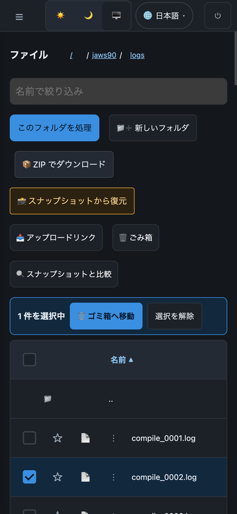
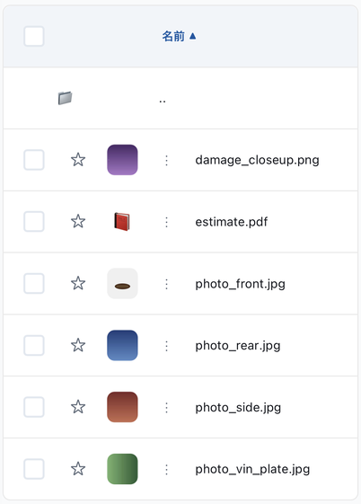

# File Portal — User Guide

> 🌐 **Language / 言語**: [日本語](../ja/portal-user-guide.md) | English

A guide for end users who have been invited to an already-deployed File Portal. This document assumes a portal administrator has completed deployment and created your account — you do not need AWS CLI access or deployment knowledge.

With this portal you can browse NAS files from your browser, trigger AI/ML analysis, view results, and check data protection status — all without VPN or SMB/NFS client setup.

---

## Getting Started

Signing in, the portal layout, switching language, and using the portal on a phone, in that order.

### 1. Sign In

1. Open the portal URL provided by your administrator
2. Enter your email and password (provided or self-registered depending on configuration)
3. If MFA is enabled, enter the TOTP code from your authenticator app
4. On first login, the **Welcome Modal** guides you through 3 key capabilities: file browsing (navigate NAS files from your browser), AI processing (select files and trigger workflows), and data protection (snapshots, locks, and ransomware status)

> **Tip**: Check "Don't show again" to skip the Welcome Modal on subsequent logins.

### 2. Portal Layout

```
┌─────────────────────────────────────────────────────────┐
│ [☰] File Portal              🌐 EN ▾   user@example.com │
├───────────────┬─────────────────────────────────────────┤
│ Sidebar       │  Main Content                           │
│ (navigation)  │                                         │
│               │                      AI Assistant Panel →│
└───────────────┴─────────────────────────────────────────┘
```

| Area | Contents |
|------|----------|
| Left sidebar | Navigation grouped into Browse, AI & Processing, Data Protection, Admin |
| Main content | Active section (changes when you click sidebar items) |
| Right panel | AI Assistant (appears when you select a file in All Files) |
| Top bar | Language switcher, user email, sign out |

### 3. Language

Click the 🌐 language selector in the top bar to switch between 8 languages: 日本語, English, 한국어, 简体中文, 繁體中文, Français, Deutsch, Español. The switch is instant — no page reload.

### 4. Using it on a phone

> For a step-by-step walkthrough with a screenshot of every screen, see the
> [phone walkthrough](portal-mobile-guide.md). This section is the summary.

There is no separate app. Open the **same URL as on the desktop** in your phone's
browser (verified in Safari on iOS and Chrome on Android).



The steps from signing in to opening a file:

1. Open the URL your administrator gave you
2. Sign in with your email and password, plus a TOTP code if MFA is on. Your password
   manager's autofill works as usual
3. Along the top edge you get **☰**, the theme control, the language control and sign
   out (⏻). The sidebar starts hidden
4. Tap **☰** to open the navigation over the content. Choosing a section closes it
   again; to close it without choosing, tap the dimmed area
5. To open a file, tap the icon on its row (📄 / 🖼️ / 📕 / 📝). The preview rises from
   the bottom of the screen as a sheet; **✕** closes it
6. To act on several files at once, tap the checkbox at the left of each row. The count
   and the available actions appear above the list

The table shows what differs from the desktop.

| Item | On a phone |
|------|-----------|
| Sidebar | a drawer over the content, opened and closed with **☰** |
| Size and Modified columns | dropped, there is not enough width; you can still sort by name |
| Email address | hidden (sign out is the icon alone) |
| File preview | a sheet from the bottom edge, up to 70% of the screen. A PDF is easier to read in landscape |
| AI assistant panel | opens as a drawer from the right |

> **About 🖥️ in the theme control**: it is not a "switch to desktop view" button. The
> three choices are ☀️ light, 🌙 dark and 🖥️ **match the device**, and 🖥️ follows your
> iOS or Android appearance setting, including its automatic switch at night.

> **Data use**: downloading a folder as a ZIP transfers everything under it. On a
> cellular connection, check how many files and how large they are first.

---

## Browse — Working with Files

Four screens: browsing files, favorites, recent files, and upload.

### All Files

Your main file browser. Shows the contents of the FSx for ONTAP volume via S3 Access Point.

| Action | How |
|--------|-----|
| Navigate folders | Click a folder name |
| Go up one level | Click `..` at the top of the file list |
| Preview images | Click the **thumbnail** next to image files (or 🖼️ where none was generated) |
| Preview PDF | Click the 📕 icon — opens in browser's built-in viewer |
| Preview Word docs | Click the 📝 icon — renders in-browser |
| Download a file | Click the 📄 icon |
| Create a share link | Click 🔗 → select TTL (5 min / 15 min / 1 hour) → copy URL |
| Ask AI about a file | Select a file → type a question in the right-side AI panel |
| Detect objects in images | Select an image → click "Detect Objects" in the AI panel |
| Process this folder | Click the ⚡ button above the file list |

**Image thumbnails**: a row for an image file carries a small picture of its contents instead of an icon, so you can tell them apart before opening anything.



Thumbnails are generated once on the server and cached, so opening a folder does not fetch every original at full size. **Only images get one** — PDFs and documents keep their icon, as do unsupported formats such as SVG, files that are too large, and files whose extension says image while their contents say otherwise.

**PHI-protected folders**: If you navigate into a folder named `/dicom/`, `/phi/`, `/pii/`, or similar, the AI processing button shows `🚫 PHI — AI Blocked`. This is a safety guardrail — these folders cannot be sent to AI services regardless of your permissions.

### Favorites

Pin frequently-accessed files by clicking the ⭐ icon in the file list. Pinned files appear in the Favorites section for quick access.

### Recent

Shows your recently viewed, downloaded, or AI-queried files with relative timestamps ("3m ago", "2h ago"). Only your own history is visible — other users' activity is not shown.

### Upload

Upload files by drag and drop, powered by Storage Browser for S3. The upload screen also supports the following.

- Folder creation
- File copy and delete
- Multi-file upload (up to 50 GB per file)

---

## AI & Processing

Starting AI/ML workflows, job history and SQL analytics, plus the AI agent, agent registry and file search when an administrator enables them.

### AI Processing

Trigger AI/ML workflows on a folder or set of files.

> **If your own workload is not in the list**, that is because the repository's samples are
> still there. Replacing them is an administrator task; the steps are in
> [Extending the portal UI — replacing the AI processing jobs with your own](../../solutions/amplify-portal/docs/CONTRIBUTING-UI.en.md#replacing-the-ai-processing-jobs-with-your-own).

1. Select a processing pattern from the dropdown (e.g., Legal Compliance, Financial IDP, Semiconductor EDA)
2. Set the input prefix (pre-filled if you clicked ⚡ from All Files)
3. Click **Start Processing**
4. You'll be redirected to Job History where status updates every 5 seconds

### Job History

View all your past processing jobs with status, timestamps, and output data.

| Status | Meaning |
|--------|---------|
| 🔵 RUNNING | Processing in progress |
| 🟢 SUCCEEDED | Complete — click to view results |
| 🔴 FAILED | Error occurred — check output for details |
| ⚪ TIMED_OUT | Exceeded maximum execution time |

Click any job to expand its output. If results were written back to the volume, a navigation link takes you directly to the output folder in All Files.

### Analytics

Run SQL queries against your data using Amazon Athena. This requires pre-configured Glue Data Catalog tables (set up by your administrator).

```sql
-- Example: count files by extension
SELECT extension, COUNT(*) as file_count
FROM your_catalog.file_metadata
GROUP BY extension
ORDER BY file_count DESC
```

### AI Agent (Requires admin enablement)

A natural-language AI chat interface for file operations. Uses Bedrock Converse + tool_use to search, read, and analyze files.

> This feature only appears when enabled by an admin in "AI Settings".

There are three modes.

| Mode | Purpose |
|------|---------|
| 🧠 KB Search | Semantic search over file contents via Knowledge Base |
| 📁 File Ops | Directory listing, file search, read |
| 🤖 Multi-Agent | All features (KB + File Ops + Safety) |

Key capabilities:

- Card grid for one-click common tasks
- Image attachment (📎): the AI analyzes the image content
- Chat history (📜): restore previous sessions
- File sidebar (📂): shows NFS/SMB permissions of referenced files
- Tool trace timeline: visualizes which agent executed what

### Agent Registry (Requires admin enablement)

Create and manage custom agents and multi-agent teams.

| Feature | What it does |
|---------|--------------|
| Agent Directory | Card grid of registered agents (with search and filter) |
| Agent Creator | Set icon, name, system prompt, tools, category |
| Team Creation | Select multiple agents and assign roles (Supervisor/Collaborator/Reviewer) |

### File Search (Requires admin enablement)

Semantic search powered by Bedrock Knowledge Base, searching by meaning of file contents.

| Mode | How it searches |
|------|-----------------|
| Keyword mode | Pattern matching on file names |
| Semantic mode | Vector search (requires KB setup) |

---

## Data Protection

Screens for checking snapshots, locks (WORM) and ransomware protection status.

### Snapshots

View volume snapshots — point-in-time copies of your data.

The list shows all available snapshots with creation timestamps.
Click "Restore" to create a FlexClone (instant, space-efficient copy) from any snapshot. The clone gets its own S3 Access Point and is available within seconds.

### Lock (WORM)

View the immutability status of your data across three mechanisms.

| Tab | What it shows |
|-----|--------------|
| ONTAP SnapLock | Whether the volume uses Compliance or Enterprise mode, retention periods |
| S3 Object Lock | Whether AI output buckets have object-level WORM enabled |
| Tamperproof Snapshot | Which snapshots are locked and when they expire |

> **Note**: Configuring lock settings requires the `storage-admin` role. Regular users have read-only access to this section.

### ARP/AI (Ransomware Protection)

View the autonomous ransomware protection status for your volumes.

| What you see | Meaning |
|-------------|---------|
| 🟢 No threats | All volumes healthy |
| 🔴 Threat detected | ARP/AI flagged suspicious activity |
| Incident badge | Shows current response stage (Detected → Contained → Investigating → Resolved) |

If a threat is detected and you are in the `storage-admin` group, you can execute containment actions directly from this panel.

---

## Admin (Requires `storage-admin` Group)

These sections are only visible/actionable if your account is in the `storage-admin` Cognito group.

### Storage Dashboard

The admin landing page. Four cards show the volume count and average capacity utilization, ARP-protected volumes and active threats, locked (tamperproof) snapshots, and the storage efficiency ratio.

Click any card to drill into the detail panel.

### Resources

Card-grid admin panel with 10 management areas organized by category:

| Category | Panels |
|----------|--------|
| Storage | Volumes, Qtrees, Quotas, Efficiency |
| Access Control | Export Policies, CIFS Shares, QoS |
| Protection | ARP Admin, Snapshot Admin, SnapLock |

### Version Diff

Compare file content between two snapshots side-by-side.

### Audit Trail

Query CloudTrail S3 data events to answer "who accessed what, and when."

---

## Tips & FAQ

### "ONTAP Connection Required" in some panels

The portal is in DemoMode or the administrator hasn't configured the VPC connection yet. File browsing and AI features still work — only ONTAP-specific panels (Snapshots, ARP, Lock) need the connection.

### AI processing button shows "PHI — AI Blocked"

You're in a protected folder (`/dicom/`, `/phi/`, `/pii/`, etc.). This is intentional — files in these paths cannot be sent to AI services. Navigate to a non-protected folder to use AI features.

### Share link expiry

Share links use presigned URLs with a time-to-live you choose (5 min, 15 min, or 1 hour). For longer-term sharing, ask your administrator about Nextcloud integration or adjust the TTL options.

### Files uploaded via NFS/SMB not showing

They should appear immediately (ONTAP guarantees cross-protocol strong consistency). Try refreshing the file list. If still missing, the file may be in a subfolder — check the path.

### Using the portal on mobile

Yes. The steps are under "4. Using it on a phone" in Getting started.

### Changing your password

Use the Cognito Hosted UI or ask your administrator to reset it with this command.

```bash
aws cognito-idp admin-set-user-password --user-pool-id <pool-id> --username <your-email> --password <new-password> --permanent
```

---

## Related Documents

| Document | Audience | Purpose |
|----------|----------|---------|
| [Getting Started (Deploy)](../../solutions/amplify-portal/docs/GETTING-STARTED.en.md) | Administrators | Deploy the portal from scratch |
| [Admin Demo Guide](admin-resource-management-demo.md) | Storage admins | E2E demo of admin operations |
| [Compliance Guide](portal-compliance-guide.md) | Security/Compliance | Verify regulatory controls |
| [Quick Reference](portal-quick-reference.md) | All roles | 1-page cheat sheet |
| [AI Features Quick Start](ai-features-quick-start.md) | All users | Try Bedrock, Rekognition, Athena |
| [AI Agent Demo Guide](../../solutions/amplify-portal/docs/ai-agent-demo-guide.en.md) | All users | E2E demo of the AI agent features |
| [Implementation Guide](../../solutions/amplify-portal/docs/IMPLEMENTATION.en.md) | Developers | Architecture and customization |
| [Portal Authorization Model](portal-authorization-model.md) | Security teams | Cognito groups, IAM, file-level access |
| [Storage Browser Demo](storage-browser-demo-guide.md) | All users | Upload/download via Storage Browser |
| [PoC → Production Guide](portal-poc-to-production.md) | Administrators | Migrate from DemoMode to production FSx for ONTAP |
| [Scaling Guide](portal-scaling-guide.md) | Architects | Capacity planning and throughput management |
| [Accessibility Statement](portal-accessibility.md) | All users | Keyboard navigation, screen reader support |
