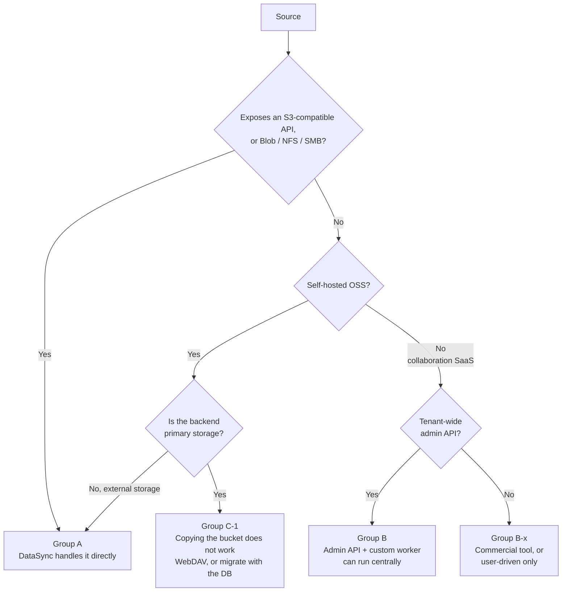

# Migrating and integrating SaaS / cloud storage with FSx for ONTAP

🌐 **Language / 言語**: [日本語](../ja/saas-to-fsx-ontap-migration.md) | [English](../en/saas-to-fsx-ontap-migration.md)

How to move data into Amazon FSx for NetApp ONTAP from Box, Dropbox, OneDrive, Google Drive, Wasabi and similar services — or integrate without moving it. Which routes work, which do not, and whether an infrastructure team can execute centrally, with the criterion that decides it.

## Conclusion

Three points.

1. **Whether AWS DataSync can handle a source depends on whether that source exposes a storage endpoint.** Object storage such as Wasabi or Azure Blob is in scope. Collaboration SaaS such as Box or Google Drive is not. The phrase "cloud storage" covers both, but to DataSync they are different categories.
2. **Even for collaboration SaaS, an infrastructure team can execute centrally.** All five major services offer tenant-wide administrator authorization that does not require individual user consent. You do not need to collect per-user OAuth consent. What is missing is not bulk access on the SaaS side but **a managed connector on the AWS side**.
3. **Most of the effort is not transfer, it is designing three mappings**: the permission model, SaaS-native document formats, and the surrounding data (version history, comments, share links). This is the decisive difference from an on-premises NAS migration, where NTFS ACLs can be carried across as they are.

> **Freshness note**: the service coverage in this document reflects the official documentation as of 2026-08. Connector coverage and location types tend to move in the direction of additions, so re-check anything marked unsupported before you build against it. What was not verified is listed at the end.

## Who this is for

- Infrastructure and storage owners adopting FSx for ONTAP as a file platform who want to consolidate data from existing SaaS
- Anyone deciding whether "there is no bulk tool, so users have to do it themselves" is actually true
- Anyone who wants search and AI across both, without migrating

## First, separate the three goals

They are easy to conflate, and conflating them leads to picking the wrong mechanism.

| Goal | AWS-native mechanism | Verdict |
|---|---|---|
| ① Bulk migration (move bytes permanently into FSx for ONTAP) | Depends on the source (see the group test below) | Available for group A; group B/C need custom or commercial |
| ② Continuous sync / hybrid coexistence | None | SaaS-side feature or a commercial tool |
| ③ Search and AI integration only (bytes stay put) | **Bedrock Knowledge Bases managed connectors** | Available |

③ is frequently overlooked, sending people straight to ①. Check whether ③ is sufficient first — see [below](#-if-you-only-need-search-and-ai-you-do-not-have-to-move-the-bytes).

## The deciding axis — does the source expose a storage endpoint

Sources fall into three groups. This classification is the branch point for every mechanism that follows.

### Group A — has a storage endpoint (DataSync handles it)

> Dark theme: [Group A, two routes (dark)](../images/saas-migration-group-a-routes-en-dark.svg)

These are the [DataSync location types](https://docs.aws.amazon.com/datasync/latest/userguide/create-locations-cli.html).

| Source | Endpoint type | DataSync location | Requirement for an FSx for ONTAP destination |
|---|---|---|---|
| Wasabi | S3-compatible | Object storage / other cloud storage | Agent + Basic mode |
| Cloudflare R2 / Backblaze B2 / MinIO / DigitalOcean Spaces / OCI Object Storage | S3-compatible | Same | Same |
| Azure Blob Storage | Blob | Other cloud storage | Same |
| Google Cloud Storage | GCS | Other cloud storage | Same |
| Azure Files | SMB | SMB | Agent required |
| On-premises NAS (ONTAP / Windows / other) | NFS / SMB | NFS / SMB | Agent required |
| On-premises object storage | S3-compatible | Object storage | Agent + Basic mode |
| Another FSx / EFS / Amazon S3 | AWS native | Native | No agent |

**Hold the criterion, not the list**: vendor lists go stale. The practical rule is that **anything exposing an S3-compatible API can be used as an Object storage location**. The table above is a set of representative examples.

**An FSx for ONTAP destination always requires an agent and Basic mode.** [Agentless transfers (Enhanced mode) apply only when the destination is Amazon S3](https://docs.aws.amazon.com/datasync/latest/userguide/creating-other-cloud-object-location.html). That yields two options.

| Route | Agent | Extra cost | Passes |
|---|---|---|---|
| Source → FSx for ONTAP (direct) | Required (EC2 / Google Compute Engine / Azure VM) | Running the agent | 1 |
| Source → Amazon S3 → FSx for ONTAP (two-hop) | **Not required** (both legs agentless) | S3 staging storage | 2 |

> **Cost note**: the two-hop route avoids operating an agent but pays for S3 storage and transfers the data twice. At a few TB the two-hop route can be cheaper in total; at tens of TB or more the direct route tends to win. The crossover depends on volume and duration, so estimate with your actual figures.

> **Performance note**: with large numbers of small files, DataSync throughput is bound by metadata operations. If the file count reaches tens of millions, decide up front to split the work by directory and run tasks in parallel rather than as one task.

### Group B — collaboration SaaS (can be run centrally via admin APIs)

DataSync cannot handle these. They expose per-user collaboration APIs and no storage endpoint.

**Per-user OAuth consent is not required, however.** Each service offers tenant-wide administrator authorization.

> Dark theme: [Group B, central execution (dark)](../images/saas-migration-group-b-worker-en-dark.svg)

| SaaS | Mechanism for central execution | User consent |
|---|---|---|
| Microsoft 365 (OneDrive / SharePoint) | Microsoft Graph **application permissions** (`Files.Read.All`, `Sites.FullControl.All`). [The grant is associated with the tenant and the application, not with the administrator who consented](https://learn.microsoft.com/en-us/graph/permissions-overview). [Certificate-based authentication is available](https://learn.microsoft.com/en-us/sharepointmigration/migration-with-cba) | Not required |
| Google Workspace (My Drive / shared drives) | Service account + **domain-wide delegation**. [Grants access to Workspace users' data without requiring their consent](https://support.google.com/a/answer/162106), and can act as any user | Not required |
| Box | Administrator or service account + enterprise access + [**the `as-user` header**](https://developer.box.com/guides/authentication/jwt/as-user). Note that [content owned by external users is not reachable this way](https://developer.box.com/guides/authentication/jwt/as-user) | Not required |
| Dropbox Business | Team-scoped token + [**the `Dropbox-API-Select-User` / `Dropbox-API-Select-Admin` headers**](https://developers.dropbox.com/dbx-team-files-guide) (member file access, `team_data.member` scope) | Not required |
| Egnyte | Administrator account + [**User Impersonation**](https://developers.egnyte.com/docs/read/Best_Practices). [Impersonated calls are recorded as such in audit reports](https://developers.egnyte.com/integration/cfs/api-docs/best-practices) | Not required |
| Citrix ShareFile | [REST API + OAuth 2.0](https://api.sharefile.com/) (access to items / folders / files / users / groups). **Tenant-wide impersonation not verified** | To be confirmed |
| iCloud Drive | **No administrator content API for organizations was found** | Not applicable |

> **Audit note**: impersonation blurs who performed an action. Egnyte states explicitly that impersonated calls are recorded as impersonated. Confirm the audit format for the other services before migrating, and keep your own operation log in the migration worker. A migration generates a large volume of reads, which may cross the thresholds of normal-time audit alerting.

> **Security note**: an application registration holding tenant-wide read permission is itself a high-value target. Enable it for the migration window only and revoke it afterwards. Microsoft Graph offers [narrower `Sites.Selected`-style scopes](https://learn.microsoft.com/en-us/graph/permissions-selected-overview), which suit a phased migration better than a tenant-wide grant.

**Amazon AppFlow is not a candidate.** It is record-oriented (field mapping for Salesforce, ServiceNow and similar), has no FSx for ONTAP destination, and no file-oriented connectors for these services were found in what was checked.

### Group C — self-hosted OSS (Nextcloud / ownCloud / Seafile)

This is where the easiest trap is.

**When object storage is used as primary storage, copying the bucket does not reconstruct anything.** [The Nextcloud documentation states it plainly](https://docs.nextcloud.com/server/latest/admin_manual/configuration_files/primary_storage.html) — metadata (filenames, directory structures) is stored only in the database, and the object store holds file content by unique identifier. What is actually in the bucket looks like `urn:oid:1004`.

| Configuration | Can you migrate by copying the bucket? |
|---|---|
| Object storage as **primary storage** | ❌ Filenames and hierarchy are both lost. Migrate with the database, or go via WebDAV |
| Object storage as **external storage** | ✅ Original names and hierarchy are preserved, so treat it as group A |
| Local filesystem | ✅ Group A via NFS / SMB |

Seafile uses a block-level data model, so reading its backend directly likewise does not give back the original files.

> **Recovery note**: this trap does not present as a failed migration. The transfer succeeds, `urn:oid:*` objects line up on FSx for ONTAP, and users cannot open anything. **Confirm the source configuration (primary or external) before migrating.** For Nextcloud, the presence of the `objectstore` setting in `config.php` settles it.

## The effort is in three mappings, not in the transfer

This is a data-model question rather than an AWS one. Start transferring without designing these and you will discard the result and start again.

### 1. The permission model has no counterpart

SaaS sharing models (link sharing, external sharing, co-editors, shared drives, team folders) have no mapping target in NTFS or UNIX ACLs. Migration therefore necessarily includes **redesigning permissions**.

This is the decisive difference from an on-premises NAS migration, where NTFS ACLs carry across as they are (`SeBackupPrivilege` / `SeRestorePrivilege` and robocopy `/B` — the procedure is in the [SMB ACL migration guide](../smb-acl-migration-backup-operators.en.md)). Migrating from SaaS, **ACLs are not carried, they are constructed**.

| SaaS-side concept | Mapping target on FSx for ONTAP | Difficulty |
|---|---|---|
| Explicit share to a user or group | ACL for the AD user or group | Low (mechanical if the identity source is shared) |
| Shared drive / team folder | Share plus group ACL | Medium (the ownership concept differs) |
| Link sharing (internal) | No counterpart | High (re-gather the requirement; the portal's share-link feature can substitute) |
| Link sharing (external, anonymous) | No counterpart | High (redesign with Transfer Family or presigned URLs) |
| Time-limited sharing | No counterpart | High (substitute with presigned URL expiry) |
| Per-file view-only permission | Expressible in an ACL, at a different granularity | Medium |

> **Sequencing note**: defer the permission design and "just move the data first", and every file lands accessible to administrators only. Settle the permission mapping in a pilot department before the main migration.

### 2. SaaS-native formats have no byte representation

Google Docs / Sheets / Slides, Box Notes, Dropbox Paper and OneNote cannot be retrieved as files as they are. They **become files only once the API converts them** to an Office format or PDF (`files.export` for Google Drive).

The conversion is lossy. Some formulas, comments, suggested edits and real-time collaboration history do not survive.

**What has to be decided**: which copy is authoritative. There are three options.

| Approach | What you gain | What you lose |
|---|---|---|
| Convert and place on FSx for ONTAP | Offline use, access from NFS/SMB, eligibility for AI processing | Co-editing, comments, history |
| Leave natives in the SaaS, migrate the rest | Co-editing continues | Two systems coexist; nobody knows where things are |
| Do not migrate; use ③ for cross-cutting search only | Status quo plus cross-cutting search | The SaaS contract stays |

### 3. The surrounding data does not come along

Version history, comments, share links, trash, shared-drive metadata, audit logs. **"The files moved" and "the work moved" are different statements.**

Some of it has a substitute on FSx for ONTAP; some does not.

| Surrounding data | Substitute on FSx for ONTAP |
|---|---|
| Version history | Snapshot (point-in-time restore, at a different granularity from per-file versioning) |
| Trash | Snapshot plus restore from the `.snapshot` directory |
| Comments | No counterpart (requires portal-side implementation) |
| Share links | Redesign with presigned URLs or Transfer Family |
| Audit log | CloudTrail (access via S3 AP) plus ONTAP audit configuration |

> **Scale note**: migrating all version history multiplies total capacity several times over. In practice a common compromise is to migrate only current versions and keep the source read-only for a defined period. Reconcile the source contract end date against the history retention requirement first.

## Choosing the write path — S3 AP or NFS / SMB

For bulk migration, **making NFS / SMB the primary route is the stronger choice**.

| | FSx for ONTAP S3 AP | NFS / SMB |
|---|---|---|
| Single-object limit | 5 GiB (50 GiB whole object via multipart) | No limit |
| Files above 50 GiB | Not possible | Possible |
| Writing ACLs as you ingest | Not possible | Possible |
| Metadata operations on many small files | Tens of ms | Sub-ms |
| Writable from outside the VPC | Yes (Internet-origin AP) | No |

Further, the whole-object limit on an S3 AP is **checked only at `CompleteMultipartUpload`, after the entire payload has transferred** (about 10 minutes for 50 GiB before it fails). `UploadPart` has no cumulative check, and the Complete error omits `MaxSizeAllowed`. **Validate object size client-side in the migration worker.** Measured values and the reproduction are in [the S3 AP object size limit verification](../s3ap-object-size-limits-verification.en.md).

S3 AP suits the post-migration uses — serverless processing, the file portal, access through Transfer Family. The same volume is readable over NFS / SMB and S3 AP simultaneously, so **ingest over NFS / SMB and exploit over S3 AP** divides cleanly.

> **Operations note**: a migration worker inside the VPC (Lambda / ECS) can write to NFS / SMB, but reaches the SaaS APIs through a NAT Gateway or VPC endpoint. An Internet-origin S3 AP is not reachable from a VPC-attached Lambda, so trying to do both in one function gets stuck. That constraint is collected in [the S3 AP compatibility notes](../s3ap-compatibility-notes.en.md).

## ③ If you only need search and AI, you do not have to move the bytes

[Amazon Bedrock Knowledge Bases managed connectors](https://docs.aws.amazon.com/bedrock/latest/userguide/knowledge-base.html) cover Amazon S3, SharePoint, **OneDrive**, **Google Drive**, Confluence and Web Crawler, with document-level permission filtering by ACL at retrieval time (the `CreateDataSource` `type` values are `S3 | ONEDRIVE | CONFLUENCE | SHAREPOINT | WEB_CRAWLER | GOOGLE_DRIVE`).

So **registering FSx for ONTAP as an S3 data source through an S3 AP gives you cross-cutting search with Google Drive without migrating anything.**

| Requirement | ① Migration | ③ Integration |
|---|---|---|
| Cross-cutting natural language search | Not needed | ✅ |
| Access from existing applications over NFS / SMB | ✅ | ❌ |
| Terminate the SaaS contract | ✅ | ❌ |
| Apply ransomware protection and WORM retention on the FSx side | ✅ | ❌ |
| Time to first result | Slow (weeks and up) | Fast (days) |

> **Data sovereignty note**: even with ③, content is passed to Bedrock to generate embeddings. Evaluate the region and the scope of data processing against the same criteria you would apply to a migration. "We are not migrating, so the data does not move" does not hold.

Some connectors carry a preview label. Confirm the GA status per connector before production use.

## FAQ and common misconceptions

**Q. Can DataSync migrate Google Drive?**
No. It is not among the DataSync sources. **Google Cloud Storage is, but it is a different service from Google Drive.** The names are merely similar.

**Q. What about Wasabi?**
Yes. It exposes an S3-compatible API, so it works as an Object storage location. An FSx for ONTAP destination requires an agent and Basic mode.

**Q. Do we need to collect OAuth consent from every user?**
Not for the five major services (Microsoft 365 / Google Workspace / Box / Dropbox Business / Egnyte). Tenant-wide administrator authorization allows central execution. The assumption that per-client configuration is required does not apply to these services.

**Q. Can we migrate Nextcloud by copying its S3 bucket?**
Not if it is used as primary storage. The bucket holds only `urn:oid:*` content, and filenames and hierarchy live in the database. If it is attached as external storage, then yes.

**Q. Can we do cross-cutting search without migrating?**
Yes. Bedrock Knowledge Bases managed connectors can put OneDrive / Google Drive / SharePoint and FSx for ONTAP in the same knowledge base.

**Q. What about files larger than 50 GiB?**
They cannot be ingested through an S3 AP. Use an NFS / SMB mount.

**Q. Can we use AppFlow?**
It is a record-oriented integration service with no FSx for ONTAP destination. It does not suit migrating file trees.

**Q. Do we have to freeze the source during migration?**
The usual approach is repeated differential syncs until the final delta fits inside the outage window. For group B, however, the API rate limit dominates how long a differential sync takes, so **derive the outage estimate from measured rate limits**, not from catalogue figures.

## Phased adoption steps

| Step | Content | Done when |
|---|---|---|
| 0 | Inventory the source (capacity, file count, largest file, share of native formats, number of external shares) | The numbers are in hand |
| 1 | Determine the group (A / B / C). For C, confirm the configuration (primary or external) | Exactly one route remains |
| 2 | Design the permission mapping. Decide substitutes for sharing forms with no counterpart | The permission table above is filled in |
| 3 | Decide the native-format policy (convert / leave / integrate only) | The authoritative copy is decided |
| 4 | Pilot (one department, a few hundred GB). Measure API rate limits and throughput | The main migration can be estimated |
| 5 | Main migration (repeated differential syncs) | The delta fits the outage window |
| 6 | Cut over and verify permissions. Set the source read-only | Users can open their own files |
| 7 | Revoke the migration application registration and its permissions | No tenant-wide grant remains |

> **Licensing note**: setting the source read-only at step 6 does not stop licence charges, which run to contract end. If the source is kept for history retention, those licence costs belong in the total migration cost. Check the contract terms back at step 0.

## What was not verified

Stated plainly.

- **The Amazon AppFlow connector list was not checked exhaustively.** The judgement that it is out of scope stands on the absence of an FSx for ONTAP destination and its record orientation; this is not a claim that Box / OneDrive / Google Drive connectors do not exist.
- **The GA versus preview status of individual Bedrock Knowledge Bases managed connectors** should be confirmed per connector. The documentation mixes preview labels.
- **Tenant-wide impersonation for Citrix ShareFile** could not be confirmed. The existence of the REST API and OAuth 2.0 was confirmed.
- **An administrator content API for iCloud Drive for organizations** was not found. This is not a claim that none exists.
- **No product-level evaluation of commercial migration services was done.** Only the structural point that they can target Transfer Family / S3 AP / SMB.
- The DataSync location table and Bedrock connector list here reflect official documentation **as of 2026-08**.

## Related documents

| Document | Content |
|---|---|
| [SMB ACL migration guide](../smb-acl-migration-backup-operators.en.md) | Migration from an on-premises Windows file server (the case where NTFS ACLs can be preserved) |
| [S3 AP compatibility notes](../s3ap-compatibility-notes.en.md) | Supported operations, NetworkOrigin, VPC configuration constraints |
| [S3 AP object size limit verification](../s3ap-object-size-limits-verification.en.md) | Measured 5 GiB / 50 GiB values and how the failures present |
| [Comparison of alternatives](../comparison-alternatives.md) (Japanese) | Choosing between S3 AP / EFS / NFS / DataSync |
| [File portal UI selection guide](../file-portal-amplify-gen2.en.md) | Amplify Gen2 / Nextcloud / custom build comparison |
| [SaaS gap analysis](../aws-feature-requests/file-portal-service-gap.en.md) | Feature comparison across 15 SaaS (this document continues it on the migration side) |
| [Deployment guide](deployment-guide.md) | Building FSx for ONTAP and S3 AP |
