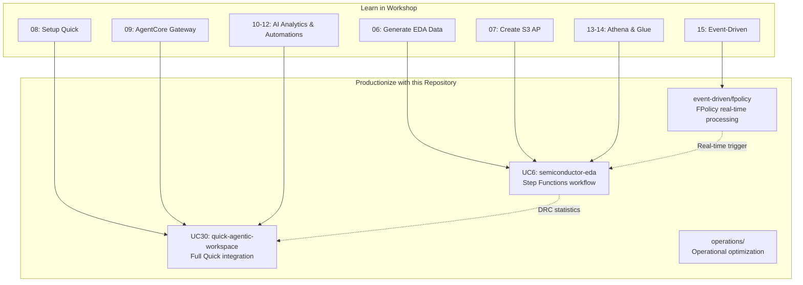

# AWS Workshop: FSx for ONTAP S3 AP × EDA Workflow Integration Guide

> **Workshop Link**: [FSx for NetApp ONTAP S3 Access Points Workshop](https://catalog.us-east-1.prod.workshops.aws/workshops/9cd82e0b-8348-456b-932a-818b9e5825a1/en-US)

This document maps AWS Workshop Studio EDA hands-on modules to patterns in this repository, providing a guide for incorporating workshop-validated scenarios into each UC pattern.

---

## Workshop Overview

| Item | Details |
|------|---------|
| Title | FSx for NetApp ONTAP S3 Access Points Workshop |
| Theme | EDA Regression logs on FSx for ONTAP: NFS write → S3 AP for AI/analytics |
| Duration | ~3 hours (all modules) |
| Core Principle | **Zero Data Movement** — access NFS-written data via S3 API without copying |

### Architecture Concept

```
EC2 (EDA simulations) --NFS--> FSx for ONTAP <--S3 API-- AgentCore Gateway <--MCP-- Amazon Quick
                                                                              (single copy of data)
```

---

## Workshop Module ↔ Repository Pattern Mapping

| # | Workshop Module | Duration | Corresponding UC/Pattern | Implementation Status |
|---|---|---|---|---|
| 01 | Architecture Overview | 10 min | All patterns | ✅ Design principles in `docs/` |
| 02 | Getting Started | — | `infrastructure/handson-lab/` | ✅ IaC automated |
| 03 | Setup & Deployment | — | `infrastructure/handson-lab/` | ✅ CloudFormation |
| 04 | Verify Infrastructure | — | `scripts/` | ✅ Verification scripts |
| 05 | S3 Access Points | — | `shared/s3ap_helper.py` | ✅ Core abstraction |
| 06 | **Generate EDA Data** | 10 min | **UC6** `semiconductor-eda/` | ✅ Test data generation (`test-data/`) |
| 07 | Create S3 Access Points | — | `docs/guides/deployment-guide.md` | ✅ Deployment guide |
| 08 | **Setup Amazon Quick** | 15 min | **UC30** `genai/quick-agentic-workspace/` | ✅ Quick Index integration |
| 09 | **Deploy AgentCore Gateway** | 20 min | **UC30** `genai/quick-agentic-workspace/` | ✅ AgentCore MCP integration |
| 10 | **AI-Powered Analytics** | 20 min | **UC6** + **UC30** | ✅ Natural language queries |
| 11 | **QuickSight Dashboards** | 15 min | **UC6** DRC dashboard | ✅ Athena + Quick Sight |
| 12 | **Quick Automations** | 15 min | **UC30** Quick Flows | ✅ Triage automation |
| 13 | **Athena SQL Queries** | 15 min | **UC6** DRC Aggregation | ✅ Athena workflow |
| 14 | **Glue Data Catalog** | 15 min | **UC6** Glue table | ✅ Crawler auto-schema discovery |
| 15 | **Event-Driven Processing** | 20 min | **FPolicy** `event-driven/fpolicy/` | ✅ EventBridge + Lambda |
| 17 | **Transfer Family (SFTP)** | — | `docs/` reference docs | ✅ FR-10 resolved |
| 19 | Architecture Recap | — | Overall | — |
| 20 | Cleanup | — | — | — |

---

## Module Details and Integration Points

### Module 06: Generate EDA Data

**What the Workshop does**:
- Generates 500 EDA job workflows with ~2,000 log files (synthetic, no licenses needed)
- LSF job scheduling logs with resource usage
- Cadence ncvlog/ncelab compilation logs
- Xcelium simulation logs with multiple failure scenarios
- Post-processing coverage analysis logs
- Realistic license server errors (4% failure rate)

**Integration with UC6**:
- Add sample EDA logs to `test-data/uc6/` (LSF + Xcelium formats)
- Enable DemoMode=true operation with synthetic data
- Extend Discovery Lambda target extensions to include `.log` (beyond GDS/OASIS)

**EDA Tool Coverage**:

| Tool | Log Type | UC6 Processing |
|------|----------|----------------|
| LSF (IBM Spectrum) | Job scheduling | Resource usage aggregation |
| Cadence ncvlog/ncelab | Compilation | Error/warning count |
| Cadence Xcelium | Simulation | PASS/FAIL/UVM_FATAL detection |
| Coverage Analysis | Post-processing | Coverage rate aggregation |

---

### Module 08: Setup Amazon Quick

**What the Workshop does**:
1. Provision Amazon Quick account
2. Connect S3 AP as Knowledge Base data source (`s3://<AP-alias>`)
3. Verify data sync completion
4. Test natural language search via Chat Agent

**Integration with UC30**:
- Reflect Quick Index data source setup in `docs/demo-guide.md`
- Document AD Windows identity S3 AP configuration as a prerequisite

> **Constraint**: S3 AP with UNIX identity cannot have Quick's data access role added to the AP policy. AD-based Windows identity is required.

---

### Module 09: Deploy AgentCore Gateway

**What the Workshop does**:
- Cognito User Pool for OAuth 2.0 authentication
- Lambda function exposing S3 operations (list, read, search)
- AgentCore MCP Gateway connecting Quick Suite to Lambda
- Quick Suite MCP integration for agentic log analysis

**Knowledge Base vs AgentCore comparison**:

| Approach | Data Access | Real-time | Implementation |
|----------|------------|-----------|----------------|
| Knowledge Base (Index) | Index snapshot | Depends on sync timing | Module 08 |
| AgentCore (MCP) | Live read via S3 AP | Always current | Module 09 |

**Integration with UC30**:
- Add AgentCore Gateway architecture to `docs/architecture.md`
- Document MCP tool definitions (list/read/search) in `docs/agentcore-mcp-tools.md`
- Add "Knowledge Base vs AgentCore" selection guide

---

### Module 10: AI-Powered Analytics

**What the Workshop does**:
- Natural language queries on EDA logs:
  - "How many simulations failed?"
  - "What are the most common errors?"
  - "Show me tests with timing violations"
  - "Which modules have the most warnings?"
  - "Summarize the test results"
- Works with both Knowledge Base and AgentCore MCP approaches

**Integration with UC6**:
- Expand Bedrock report generation prompt templates with these query patterns
- Add "common questions and answers" section to Report Lambda output

---

### Module 11: QuickSight Dashboards

**What the Workshop does**:
- Register `regression_summary.csv` as Quick Sight dataset
- Create EDA Regression dashboard:
  - Job success/failure pie chart
  - Per-module error distribution
  - Timing violation heatmap
  - Resource usage trends

**Integration with UC6**:
- Align DRC statistics CSV output format for Quick Sight compatibility
- Add Quick Sight dashboard creation steps to `docs/demo-guide.md`
- Document direct Athena-to-Quick-Sight connection steps

---

### Module 12: Quick Automations

**What the Workshop does**:
- **Daily triage automation**: Summarize regression failures and email the team
- **Coverage gate alert**: Fire when any module drops below 80% coverage
- **License failure monitor**: Detect recurring license checkout issues

**Integration with UC6 / UC30**:
- Add Quick Flows template examples to `docs/quick-flows-templates.md`
- Document Quick Flows as an alternative to SNS notifications in UC6

**Automation scenario mapping**:

| Workshop Scenario | Repository Equivalent | Implementation |
|-------------------|----------------------|----------------|
| Daily triage | UC6 Report Lambda + SNS | Step Functions scheduled execution |
| Coverage gate | UC6 DRC Aggregation threshold | Athena query + CloudWatch Alarm |
| License monitor | OPS1 capacity monitoring extension | Candidate for new pattern |

---

### Module 13: Athena SQL Queries

**What the Workshop does**:
- Create Glue database/table pointing to S3 AP CSV
- Run SQL queries to analyze EDA regression data:
  - Per-module failure counts
  - Timing violation identification
  - License failure root cause analysis
  - Resource usage statistics

**Integration with UC6**:
- Expand DRC Aggregation Lambda Athena query templates
- Add workshop query patterns as samples to `test-data/uc6/sample-queries.sql`
- Make Glue table definition approach selectable (Crawler vs manual)

---

### Module 14: Glue Data Catalog

**What the Workshop does**:
- Create IAM role for Glue Crawler with S3 AP permissions
- Create and run Glue Crawler → auto-discover CSV schema
- Verify discovered table in Glue Data Catalog console
- Confirm availability from Athena, Quick Sight, and SageMaker

**Integration with UC6**:
- Add optional Glue Crawler resource to `template.yaml` (`EnableGlueCrawler` parameter)
- Grant S3 AP ARN-based permissions to Crawler IAM role
- Add schema discovery verification steps to `docs/demo-guide.md`

**IAM Policy Example (Glue Crawler → S3 AP)**:

```yaml
- Sid: GlueCrawlerS3APAccess
  Effect: Allow
  Action:
    - s3:GetObject
    - s3:ListBucket
  Resource:
    - !Sub "arn:aws:s3:${AWS::Region}:${AWS::AccountId}:accesspoint/${S3AccessPointName}"
    - !Sub "arn:aws:s3:${AWS::Region}:${AWS::AccountId}:accesspoint/${S3AccessPointName}/object/*"
```

---

### Module 15: Event-Driven Processing

**What the Workshop does**:
- Lambda function reads simulation logs via S3 AP
- EventBridge scheduled rule triggers function hourly
- Automatic UVM_FATAL error detection → SNS alerts
- Explains why scheduled rules are used (S3 Event Notifications not supported for S3 AP)

**Integration with FPolicy pattern**:
- Add Workshop Event-Driven scenario reference to `event-driven/fpolicy/` README
- Add comparison table: EventBridge Scheduler polling vs FPolicy event-driven

**Trigger approach comparison**:

| Approach | Latency | Complexity | S3 AP Compatible | Workshop Module |
|----------|---------|-----------|:---:|:---:|
| EventBridge Scheduler (polling) | Minutes to hours | Low | ✅ | Module 15 |
| FPolicy → EventBridge (event-driven) | Seconds to minutes | High | ✅ | — |
| S3 Event Notifications | — | — | ❌ Not supported | — |

---

### Module 17: Transfer Family (SFTP)

**What the Workshop does**:
- AWS Transfer Family SFTP endpoint → FSx for ONTAP S3 AP
- External partner file ingestion scenario

**Repository status**:
- Documented in `docs/s3ap-compatibility-notes.md`
- FR-10 confirmed GA release January 2026

---

## Workshop → Repository Adoption Flow



---

## Related Documents

| Document | Content |
|----------|---------|
| [UC6 semiconductor-eda README](../../solutions/industry/semiconductor-eda/README.en.md) | GDS/OASIS validation + Amazon Quick integration |
| [UC30 quick-agentic-workspace README](../../solutions/genai/quick-agentic-workspace/README.en.md) | Full Quick Suite integration pattern |
| [Event-Driven FPolicy README](../../solutions/event-driven/fpolicy/README.md) | FPolicy event-driven pipeline |
| [Hands-on Lab IaC](../../infrastructure/handson-lab/README.md) | Hands-on environment IaC |
| [verify-quick-s3ap.sh](../../scripts/verify-quick-s3ap.sh) | Quick + S3 AP E2E verification script |
| [AD-Joined SVM Prerequisites](ad-joined-svm-s3ap-prerequisites.md) | AD configuration prerequisites |
