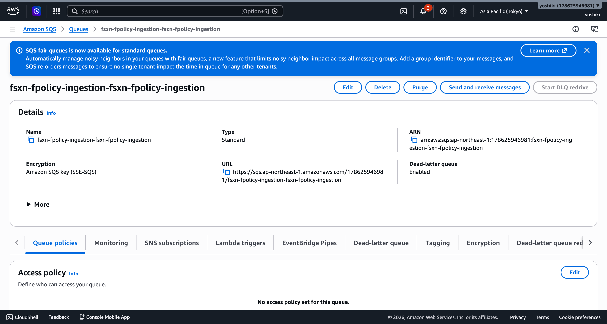
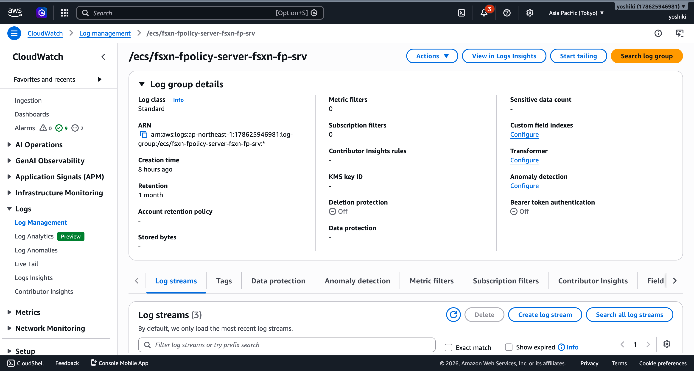

# イベント駆動アーキテクチャ（FPolicy 連携）

本ディレクトリは、ONTAP FPolicy を活用したイベント駆動ファイル処理パイプラインの設計・実装・検証ドキュメントを格納しています。

## クイックスタート: NFSv3 FPolicy E2E デモ

**所要時間**: 約 30 分（CloudFormation デプロイ + ONTAP 設定）

### 前提条件

- FSx for NetApp ONTAP ファイルシステムが稼働中
- 同一 VPC 内に Private Subnet が存在
- AWS CLI 設定済み
- Docker 環境（コンテナビルド用）

### Step 1: FPolicy Server デプロイ

```bash
# Lambda パッケージビルド + S3 アップロード
./scripts/package_fpolicy_lambdas.sh

# FPolicy Ingestion スタック（SQS + Lambda）
aws cloudformation deploy \
  --template-file shared/cfn/fpolicy-ingestion.yaml \
  --stack-name fsxn-fpolicy-ingestion \
  --parameter-overrides DeployBucket=<YOUR_DEPLOY_BUCKET> DeployPrefix=lambda \
  --capabilities CAPABILITY_NAMED_IAM

# FPolicy Server (ECS Fargate + NLB)
./scripts/deploy_fpolicy_server.sh <VPC_ID> <SUBNET_IDS> <FSxN_SVM_SG_ID> <SQS_QUEUE_URL>
```

### Step 2: E2E デモ環境デプロイ

```bash
# 踏み台 EC2 + SQS VPC Endpoint
aws cloudformation deploy \
  --template-file shared/cfn/fpolicy-e2e-demo.yaml \
  --stack-name fsxn-fpolicy-e2e-demo \
  --parameter-overrides \
    VpcId=<VPC_ID> \
    SubnetId=<PUBLIC_SUBNET_ID> \
    PrivateSubnetIds=<PRIVATE_SUBNET_1>,<PRIVATE_SUBNET_2> \
    VpcEndpointSecurityGroupId=<SG_ID> \
    KeyPairName=<KEY_PAIR> \
  --capabilities CAPABILITY_NAMED_IAM
```

### Step 3: ONTAP FPolicy 設定

Fargate タスクの IP を取得し、ONTAP REST API で FPolicy を設定:

```bash
# Fargate Task IP 取得
TASK_ARN=$(aws ecs list-tasks --cluster <CLUSTER> --desired-status RUNNING --query 'taskArns[0]' --output text)
TASK_IP=$(aws ecs describe-tasks --cluster <CLUSTER> --tasks $TASK_ARN --query 'tasks[0].attachments[0].details[?name==`privateIPv4Address`].value' --output text)

# ONTAP REST API で設定（踏み台 EC2 から実行）
# 詳細: docs/event-driven/fpolicy-configuration-reference.md Section 3
```

**重要**: NFSv3 でマウントすること。NFSv4 は FPolicy でブロックされる。

```bash
mount -t nfs -o vers=3 <SVM_IP>:/vol1 /mnt/fsxn
```

### Step 4: テスト

```bash
# ファイル作成
echo "test" | sudo tee /mnt/fsxn/fpolicy-test.txt

# SQS メッセージ確認（数秒後）
aws sqs receive-message --queue-url <QUEUE_URL> --max-number-of-messages 5
```

---

## 検証エビデンス

### SQS キュー詳細（FPolicy イベント受信確認）



*FPolicy Server から送信されたメッセージが SQS キューに到達（Messages available: 4）*

### CloudWatch Logs（FPolicy Server イベント受信ログ）



*ECS Fargate 上の FPolicy Server が ONTAP からの NOTI_REQ を受信し、SQS に送信したログ*

---

## ドキュメント一覧

| ファイル | 内容 |
|----------|------|
| [architecture-design.md](./architecture-design.md) | イベント駆動アーキテクチャ全体設計（Polling vs Kinesis vs Event-Driven 比較） |
| [fpolicy-configuration-reference.md](./fpolicy-configuration-reference.md) | FPolicy 設定リファレンス（プロトコル別コマンド例、考慮点） |
| [fpolicy-server-deployment-architecture.md](./fpolicy-server-deployment-architecture.md) | FPolicy Server デプロイ方式比較（Fargate vs EC2） |
| [fpolicy-e2e-verification-report.md](./fpolicy-e2e-verification-report.md) | E2E 検証レポート（成功/失敗結果、発見した問題と対策） |
| [migration-guide.md](./migration-guide.md) | ポーリング → イベント駆動への移行ガイド |

## 関連テンプレート

| テンプレート | パス | 用途 |
|---|---|---|
| FPolicy Server (Fargate) | `shared/cfn/fpolicy-server-fargate.yaml` | ECS Fargate + NLB |
| FPolicy Ingestion | `shared/cfn/fpolicy-ingestion.yaml` | SQS + FPolicy Engine Lambda |
| FPolicy Routing | `shared/cfn/fpolicy-routing.yaml` | EventBridge Custom Bus + Bridge Lambda |
| E2E Demo | `shared/cfn/fpolicy-e2e-demo.yaml` | 踏み台 EC2 + SQS VPC Endpoint |

## 重要な制約事項

| 制約 | 詳細 |
|------|------|
| **NFSv4 未動作** | FPolicy 非同期通知が送信されない（ONTAP 9.17.1P6/FSxN で確認）。ドキュメント上はサポートされているが実際には動作しない。[詳細報告書](./nfsv4-fpolicy-issue-report.md) |
| **NLB 非互換** | FPolicy バイナリフレーミングが NLB TCP パススルーで動作しない |
| **SMB は AD 必須** | CIFS サーバーが Active Directory に参加している必要がある |
| **SQS VPC Endpoint 必須** | Fargate (Private Subnet) から SQS への通信に必要 |
| **直接 IP 接続** | ONTAP external-engine には Fargate タスクの直接 Private IP を指定 |

## SMB (CIFS) テスト手順

SMB でのテストには Active Directory が必要です。

### 前提条件（SMB 追加）

- AWS Managed Microsoft AD（または Self-Managed AD）
- FSxN SVM が AD ドメインに参加済み（SVM 作成時に AD 設定を含める）
- CIFS 共有が作成済み

### SMB 環境構築

```bash
# 1. AWS Managed Microsoft AD 作成
aws ds create-microsoft-ad \
  --name fpolicy.local --short-name FPOLICY \
  --password '<AD_PASSWORD>' \
  --vpc-settings VpcId=<VPC>,SubnetIds=<SUBNET1>,<SUBNET2> \
  --edition Standard --region ap-northeast-1

# 2. FSxN SVM 作成（AD 参加付き）
aws fsx create-storage-virtual-machine \
  --file-system-id <FS_ID> --name FPolicySMB \
  --active-directory-configuration \
    'NetBiosName=FPOLSMB,SelfManagedActiveDirectoryConfiguration={DomainName=fpolicy.local,UserName=Admin,Password=<AD_PASSWORD>,DnsIps=[<AD_DNS1>,<AD_DNS2>],OrganizationalUnitDistinguishedName="OU=Computers,OU=fpolicy,DC=fpolicy,DC=local"}' \
  --root-volume-security-style NTFS

# 3. ボリューム作成（NTFS セキュリティスタイル）
aws fsx create-volume --volume-type ONTAP --name smb_test_vol \
  --ontap-configuration '{
    "JunctionPath": "/smb_test",
    "StorageVirtualMachineId": "<SVM_ID>",
    "SizeInMegabytes": 1024,
    "SecurityStyle": "NTFS"
  }'

# 4. CIFS 共有作成（ONTAP REST API）
curl -sk -u fsxadmin:<PASS> -X POST \
  'https://<MGMT_IP>/api/protocols/cifs/shares' \
  -H 'Content-Type: application/json' \
  -d '{"svm":{"uuid":"<SVM_UUID>"},"name":"smb_test","path":"/smb_test"}'

# 5. SMB テスト
smbclient //<SVM_IP>/smb_test -U 'DOMAIN\Admin%<AD_PASSWORD>' \
  --option='client min protocol=SMB2' \
  -c 'put /tmp/test.txt SMB-TEST.txt'
```

### SMB テスト結果

```
putting file /tmp/smb-e2e.txt as \SMB-FPOLICY-E2E.txt (2.2 kb/s)
```

FPolicy Server ログ:
```
[SQS] Sent: \SMB-FPOLICY-E2E.txt (create)
```
