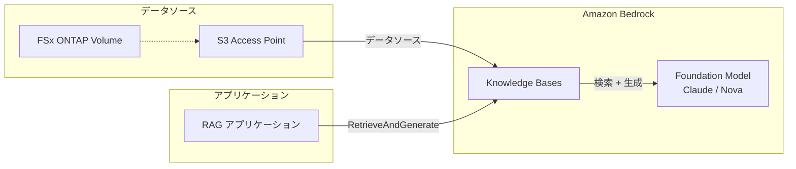
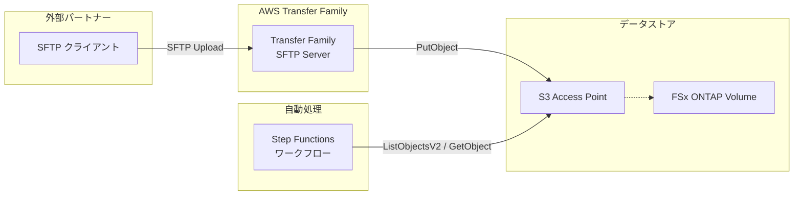
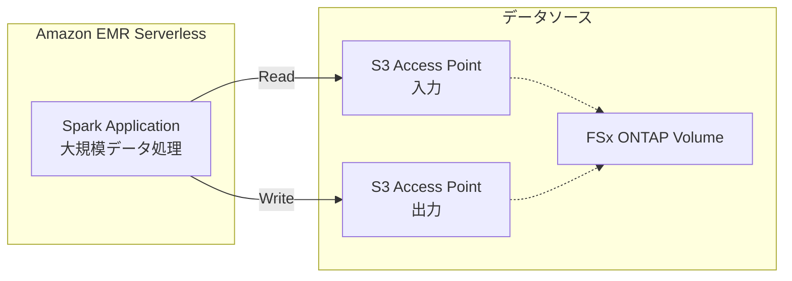

# 拡張パターンガイド

本ドキュメントでは、FSx for ONTAP S3 Access Points Serverless Patterns の 5 つの基本ユースケースを超えた拡張パターンを紹介します。各パターンは AWS 公式チュートリアルに基づいており、本プロジェクトのアーキテクチャと組み合わせて利用できます。

---

## 1. Bedrock Knowledge Bases 統合 — RAG アプリケーション構築

### 概要

Amazon Bedrock Knowledge Bases を使用して、FSx for NetApp ONTAP 上のエンタープライズドキュメントから RAG（Retrieval-Augmented Generation）アプリケーションを構築するパターンです。S3 Access Points をデータソースとして Bedrock Knowledge Bases に接続し、自然言語による文書検索と回答生成を実現します。

### アーキテクチャ



### 前提条件

- FSx for NetApp ONTAP ファイルシステム（ONTAP 9.17.1P4D3 以上）
- S3 Access Point が有効化されたボリューム（**internet** network origin 必須）
- Amazon Bedrock モデルアクセスが有効（Claude / Nova）
- Amazon OpenSearch Serverless または Aurora pgvector（ベクトルストア用）

### 実装ガイダンス

1. **S3 AP の準備**: ドキュメントが格納された FSx ONTAP ボリュームに internet network origin の S3 AP を作成
2. **Knowledge Base の作成**: Bedrock コンソールまたは API で Knowledge Base を作成し、S3 AP をデータソースとして設定
3. **データ同期**: Knowledge Base のデータ同期を実行し、ドキュメントをインデックス化
4. **アプリケーション統合**: `RetrieveAndGenerate` API を使用して RAG クエリを実行

### 注意事項

- Bedrock Knowledge Bases は S3 AP を直接データソースとしてサポート
- データ同期はスケジュール実行または手動トリガーが可能
- ベクトルストアの選択（OpenSearch Serverless vs Aurora pgvector）はコストとパフォーマンス要件に依存

### 参考リンク

- [AWS 公式チュートリアル: Build RAG with Bedrock Knowledge Bases](https://docs.aws.amazon.com/fsx/latest/ONTAPGuide/tutorial-build-rag-with-bedrock.html)
- [Bedrock Knowledge Bases 開発者ガイド](https://docs.aws.amazon.com/bedrock/latest/userguide/knowledge-base.html)
- [FSx ONTAP + Bedrock RAG ブログ](https://aws.amazon.com/blogs/machine-learning/build-rag-based-generative-ai-applications-in-aws-using-amazon-fsx-for-netapp-ontap-with-amazon-bedrock/)

### 関連プロジェクト: Permission-aware Agentic Access-Aware RAG

本プロジェクト（fsxn-s3ap-serverless-patterns）の共通モジュール（OntapClient、FsxHelper）は、**FSx-for-ONTAP-Agentic-Access-Aware-RAG** プロジェクトの検証済みパターンを継承・進化させたものです。

元プロジェクトは、FSx for NetApp ONTAP + Amazon Bedrock を組み合わせた **権限ベース RAG（Permission-aware RAG）** システムで、以下の特徴を持ちます:

- **NTFS ACL / Active Directory SID に基づくアクセス制御**: ユーザーごとにアクセス可能なドキュメントのみを検索対象とする
- **Bedrock Agents によるエージェント型 RAG**: 多段階推論、自動文書検索、コンテキスト最適化
- **Bedrock Knowledge Bases によるマネージド RAG**: S3 AP をデータソースとしたドキュメントインデックス
- **ベクトル DB 選択肢**: Aurora Serverless v2 (pgvector)、OpenSearch Serverless、S3 Vectors
- **Next.js フロントエンド**: CloudFront + Lambda Function URL でデプロイ、8 言語対応

本プロジェクトの Bedrock Knowledge Bases 統合パターンを実装する際は、元プロジェクトの権限ベースアクセス制御の設計を参考にすることで、セキュアな RAG アプリケーションを構築できます。特に、DynamoDB ユーザーアクセステーブルによる AD SID マッピングと、検索時のフィルタリングロジックは、エンタープライズ環境での RAG 実装に不可欠な要素です。

### ✅ 検証結果（2026-05-02）

ap-northeast-1 環境で以下を検証済み:

- OpenSearch Serverless コレクション（VECTORSEARCH）+ ベクトルインデックス作成
- Bedrock Knowledge Base 作成（Titan Embed Text v2、dimension=256）
- S3 AP データソース追加 + データ同期（81 ドキュメントスキャン、75 インデックス）
- Retrieve API: セマンティック検索で関連ドキュメント 3 件ヒット
- RetrieveAndGenerate（RAG）: Nova Lite で日本語回答生成、ソース引用付き

---

## 2. Transfer Family SFTP 統合 — 外部パートナーファイル交換

### 概要

AWS Transfer Family を使用して、外部パートナーとの SFTP ベースのファイル交換を FSx for NetApp ONTAP S3 Access Points 経由で実現するパターンです。パートナーが SFTP でアップロードしたファイルを、本プロジェクトのサーバーレスワークフローで自動処理できます。

### アーキテクチャ



### 前提条件

- FSx for NetApp ONTAP ファイルシステム（ONTAP 9.17.1P4D3 以上）
- S3 Access Point が有効化されたボリューム
- AWS Transfer Family が利用可能なリージョン
- 外部パートナーの SFTP クライアント設定

### 実装ガイダンス

1. **Transfer Family サーバーの作成**: SFTP プロトコルで Transfer Family サーバーを作成
2. **S3 AP の接続**: Transfer Family のストレージバックエンドとして S3 AP を設定
3. **ユーザー管理**: Transfer Family のユーザーを作成し、S3 AP 上のディレクトリにマッピング
4. **ワークフロー連携**: パートナーがアップロードしたファイルを EventBridge Scheduler + Step Functions で定期的に検出・処理

### ユースケース例

- **UC2 連携**: パートナーが SFTP で契約書をアップロード → IDP パイプラインで自動処理
- **UC3 連携**: 工場からセンサーログを SFTP で送信 → 異常検出パイプラインで自動分析
- **UC5 連携**: 医療機関から DICOM ファイルを SFTP で送信 → 匿名化パイプラインで自動処理

### 注意事項

- Transfer Family は S3 AP 経由の PutObject をサポート
- SFTP ユーザーごとにディレクトリスコープを設定可能
- Transfer Family のコストはプロトコル有効化時間 + データ転送量

### 参考リンク

- [AWS 公式チュートリアル: Transfer Family で SFTP](https://docs.aws.amazon.com/transfer/latest/userguide/fsx-s3-access-points.html)

### ✅ 検証結果（2026-05-02）

ap-northeast-1 環境で以下を検証済み:

- SFTP サーバー作成（PUBLIC エンドポイント、SERVICE_MANAGED 認証）
- SSH 公開鍵認証ユーザー作成（ホームディレクトリ = S3 AP）
- SFTP 接続: FSx ONTAP 上の全ディレクトリ/ファイル一覧表示
- ファイルアップロード（put）: S3 AP 経由で FSx ONTAP に書き込み
- ファイルダウンロード（get）: S3 AP 経由で FSx ONTAP から読み取り

> **コスト注意**: SFTP サーバーは $0.30/時間。検証後に停止済み。
- [Transfer Family SFTP ブログ](https://aws.amazon.com/blogs/storage/secure-sftp-file-sharing-with-aws-transfer-family-amazon-fsx-for-netapp-ontap-and-s3-access-points/)
- [Transfer Family 開発者ガイド](https://docs.aws.amazon.com/transfer/latest/userguide/what-is-aws-transfer-family.html)

---

## 3. EMR Serverless Spark ジョブ — 大規模データ処理

### 概要

Amazon EMR Serverless を使用して、FSx for NetApp ONTAP S3 Access Points 上の大規模データセットを Apache Spark で処理するパターンです。本プロジェクトの Lambda ベースの処理では対応が難しい TB 規模のデータ処理に適しています。

### アーキテクチャ



### 前提条件

- FSx for NetApp ONTAP ファイルシステム（ONTAP 9.17.1P4D3 以上）
- S3 Access Point が有効化されたボリューム（**internet** network origin 必須）
- Amazon EMR Serverless が利用可能なリージョン

### 実装ガイダンス

1. **EMR Serverless アプリケーションの作成**: Spark タイプの EMR Serverless アプリケーションを作成
2. **Spark ジョブの作成**: S3 AP パスを入出力として指定する PySpark スクリプトを作成
3. **ジョブ実行**: EMR Serverless API でジョブを送信
4. **Step Functions 連携**: 既存のワークフローに EMR Serverless ジョブステップを追加

### ユースケース例

- **UC3 拡張**: TB 規模のセンサーログを Spark で集計・異常検出
- **UC1 拡張**: 大量の ACL データを Spark で横断分析
- **クロス UC**: 複数ユースケースの出力データを統合分析

### Lambda / Glue / EMR Serverless の比較

| 項目 | Lambda | Glue ETL | EMR Serverless |
|------|--------|----------|----------------|
| 処理規模 | 〜数百 MB | 〜数十 GB | 〜TB+ |
| 実行時間制限 | 15 分 | 制限なし | 制限なし |
| 起動時間 | ミリ秒〜秒 | 数分 | 数分 |
| カスタマイズ性 | 低 | 中 | 高 |
| コスト | 最安（少量） | 中 | 最安（大量） |
| 推奨 | リアルタイム・少量 | バッチ・中量 | バッチ・大量 |

### 注意事項

- EMR Serverless は AWS マネージドインフラからアクセスするため、S3 AP は internet network origin が必要
- Spark ジョブのリソース（vCPU、メモリ）は自動スケーリング
- EMR Serverless はジョブ実行時間のみ課金（アイドル時のコストなし）

### 参考リンク

- [AWS 公式チュートリアル: Run Spark with EMR Serverless](https://docs.aws.amazon.com/fsx/latest/ONTAPGuide/tutorial-run-spark-with-emr-serverless.html)
- [EMR Serverless 開発者ガイド](https://docs.aws.amazon.com/emr/latest/EMR-Serverless-UserGuide/emr-serverless.html)
- [PySpark + S3 Access Points](https://spark.apache.org/docs/latest/cloud-integration.html)

### ✅ 検証結果（2026-05-02）

ap-northeast-1 環境で以下を検証済み:

- EMR Serverless アプリケーション作成（EMR 7.1.0、Spark）
- PySpark スクリプトを S3 AP に配置（scripts/spark_csv_to_parquet.py）
- CSV → Parquet 変換ジョブ実行: **S3 AP 経由でスクリプト取得・データ入出力全て成功**
- Parquet 出力: parquet-output/ に 2 パーティション + _SUCCESS マーカー生成

> **重要知見**: EMR Serverless は S3 AP を直接参照可能。`entryPoint` にも S3 AP パスを指定でき、スクリプトもデータも全て S3 AP 経由で処理できる。

---

## パターン選択ガイド

本プロジェクトの基本ユースケースと拡張パターンの選択基準:

| 要件 | 推奨パターン |
|------|------------|
| ドキュメント検索・Q&A | Bedrock Knowledge Bases 統合 |
| 外部パートナーとのファイル交換 | Transfer Family SFTP 統合 |
| TB 規模のデータ処理 | EMR Serverless Spark |
| GB 規模の ETL | Glue ETL（`manufacturing-analytics/glue-etl/`） |
| メディアコンテンツ配信 | CloudFront 統合（`media-vfx/cloudfront/`） |
| リアルタイム・少量データ処理 | Lambda ベース（基本ユースケース） |

### 組み合わせ例

```
外部パートナー → Transfer Family SFTP → FSx ONTAP
  → EventBridge Scheduler → Step Functions
    → Lambda（少量）/ Glue ETL（中量）/ EMR Serverless（大量）
      → Bedrock Knowledge Bases（検索・Q&A）
      → CloudFront（コンテンツ配信）
```
