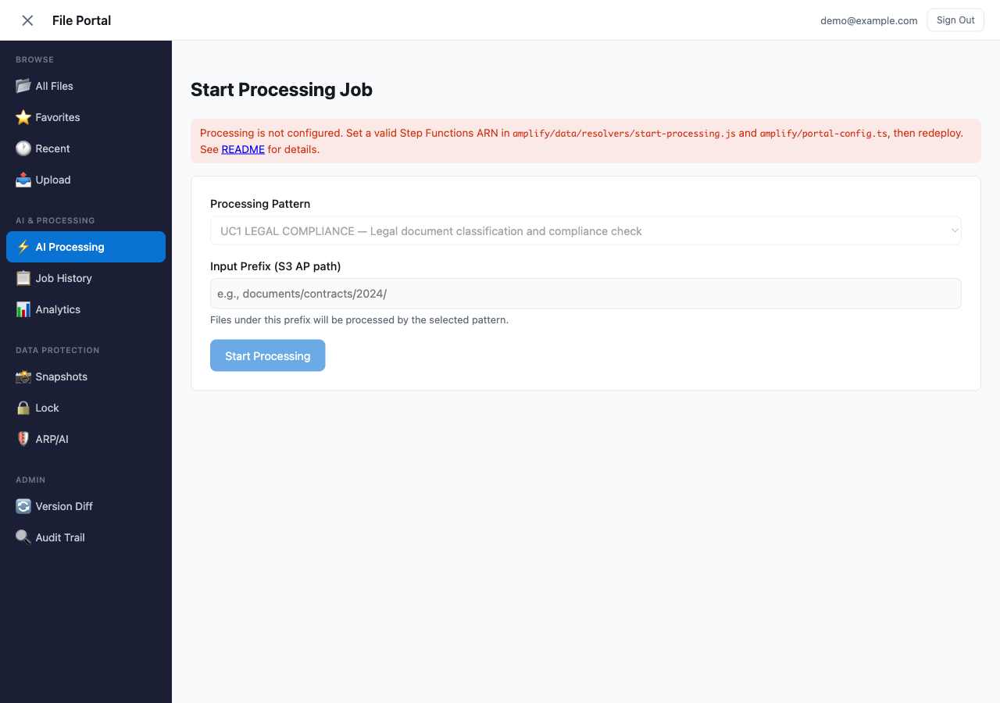
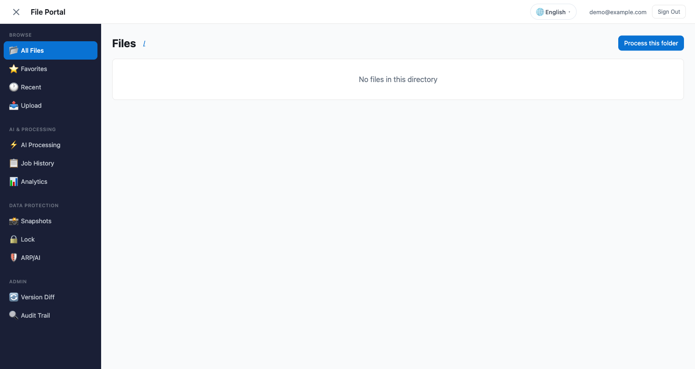
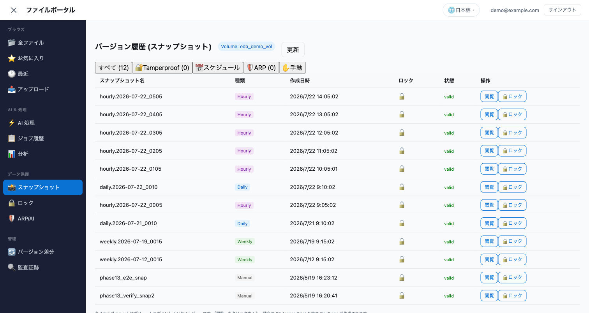
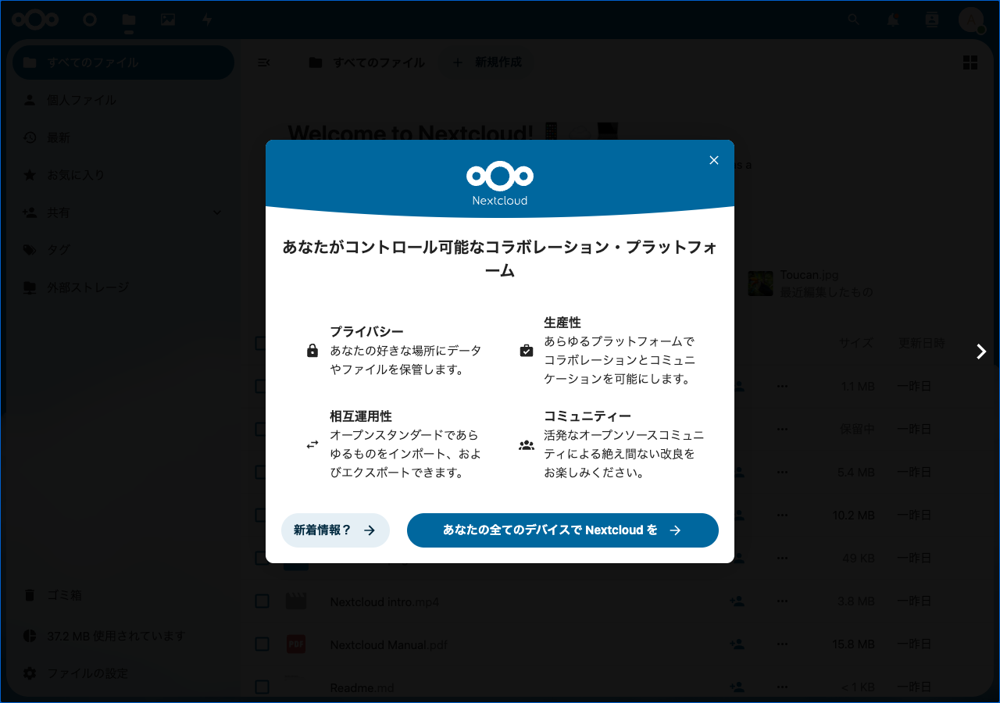

# File Portal UI Options — Amplify Gen2 / Nextcloud / Custom Build

## Executive Summary

Teams that need a **web-based interface** for browsing, requesting processing, and viewing results on FSx for ONTAP volumes have several architectural options.

As of this writing, AWS does not provide a managed service that delivers a Box/Google Drive-like file management experience (folder navigation, file preview, sharing links, sync clients) for NAS data on FSx for ONTAP. The S3 Console allows object listing but is not an end-user file portal. Building this experience requires assembling your own solution or leveraging OSS tools.

This document compares three approaches — AWS Amplify Gen2, Nextcloud, and custom-build (CDK + framework) — and provides a selection guide based on team context.

**Key takeaway**: All three are valid. Choose based on your team's existing skills, operational preferences, and compliance requirements. The core S3 AP serverless patterns in this repository work independently of the frontend choice.

---

## Table of Contents

1. [Architecture Overview](#architecture-overview)
2. [Comparison Matrix](#comparison-matrix)
3. [Selection Guide — How to Choose](#selection-guide--how-to-choose)
4. [Amplify Gen2 Integration Pattern](#amplify-gen2-integration-pattern)
5. [Nextcloud Integration Pattern](#nextcloud-integration-pattern)
6. [Custom Build Pattern](#custom-build-pattern)
7. [Throughput and Capacity Planning](#throughput-and-capacity-planning)
8. [Authentication and Compliance Chain](#authentication-and-compliance-chain)
9. [Implementation Roadmap](#implementation-roadmap)
10. [Cost Estimates (Incremental)](#cost-estimates-incremental)
11. [Trade-offs Summary](#trade-offs-summary)
12. [FAQ](#faq)
13. [Related Documents](#related-documents)

---

## Architecture Overview

All three approaches share the same backend integration point: the existing Step Functions state machines that orchestrate Lambda functions accessing FSx for ONTAP S3 Access Points.

```
┌──────────────────────────────────────────────────────────────┐
│           Frontend Layer (choose one)                        │
│                                                              │
│  ┌─────────────┐  ┌─────────────┐  ┌──────────────────────┐  │
│  │ Amplify Gen2│  │  Nextcloud  │  │ Custom (Vite/Next.js)│  │
│  │ React +     │  │  (EC2/ECS)  │  │ + CDK                │  │
│  │ AppSync     │  │  + External │  │ + API Gateway        │  │
│  │             │  │    Storage  │  │ + Cognito            │  │
│  └──────┬──────┘  └──────┬──────┘  └───────────┬──────────┘  │
└─────────┼────────────────┼─────────────────────┼─────────────┘
          │                │                     │
          ▼                ▼                     ▼
┌──────────────────────────────────────────────────────────────┐
│  Integration Layer                                           │
│  - AppSync HTTP Resolver → Step Functions                    │
│  - API Gateway REST → Step Functions                         │
│  - Nextcloud External Storage → S3 AP (direct)               │
└──────────────────────────────────────────────────────────────┘
          │
          ▼
┌──────────────────────────────────────────────────────────────┐
│  Backend (existing — no modification required)               │
│  ┌───────────────┐     ┌─────────────────────┐               │
│  │Step Functions │     │ Lambda Functions    │               │
│  │(ASL workflows)│────▶│ Discovery (VPC-in)  │               │
│  │               │     │ Processing (VPC-out)│               │
│  └───────────────┘     └──────────┬──────────┘               │
└───────────────────────────────────┼──────────────────────────┘
                                    │
                                    ▼
┌─────────────────────────────────────────────────────────────┐
│  FSx for ONTAP S3 Access Point                              │
│  (NFS / SMB / S3 — multiprotocol shared namespace)          │
└─────────────────────────────────────────────────────────────┘
```

---

## Comparison Matrix

| Aspect | Amplify Gen2 | Nextcloud | Custom Build (CDK) |
|--------|:---:|:---:|:---:|
| **Setup time (PoC)** | 2-3 days | 1-2 days (if familiar) | 1-2 weeks |
| **File browsing (built-in)** | Custom UI needed | Built-in file manager | Custom UI needed |
| **Processing job trigger** | AppSync Mutation → SFn | Workflow App or webhook | API Gateway → SFn |
| **Authentication** | Cognito (SAML/OIDC) | LDAP/SAML/OIDC | Cognito / custom |
| **Hosting model** | Serverless (Amplify Hosting) | EC2/ECS (server) | CloudFront + S3 / Amplify |
| **Operational burden** | Low (managed) | Medium (patching, upgrades) | Low-Medium |
| **FSx for ONTAP access** | S3 AP via Lambda | External Storage (S3 AP direct) | S3 AP via Lambda |
| **Multiprotocol visibility** | Via S3 AP only | NFS mount + S3 AP | Via S3 AP only |
| **Offline file editing** | No | Desktop/mobile sync client | No |
| **Collaboration features** | Custom implementation | Built-in (sharing, comments) | Custom implementation |
| **Infrastructure cost** | ~$5-10/month | ~$50-100/month (EC2) | ~$5-20/month |
| **Language/framework** | TypeScript + React | PHP (server) | Any |
| **AD integration** | Via Cognito federation | Native LDAP/AD | Via Cognito federation |
| **Mobile access** | Responsive web | Native apps (iOS/Android) | Responsive web |
| **S3 AP Presigned URL** | Works (※ listed as "Not supported" in docs; [details](./s3ap-compatibility-notes.en.md#presigned-url-support)) | Same | Same |

---

## Selection Guide — How to Choose

### Amplify Gen2 suits teams that:

- Have frontend developers comfortable with TypeScript/React
- Want serverless-first architecture (minimal ops burden)
- Need custom processing workflows triggered from the UI
- Prefer branch-based environment management (dev/staging/prod)
- Want tight integration with Cognito + AppSync + Step Functions

### Nextcloud suits teams that:

- Need a familiar file management UI immediately (no frontend development)
- Want built-in collaboration features (sharing, comments, versioning UI)
- Have existing LDAP/AD infrastructure and want direct integration
- Need desktop/mobile sync clients for offline access
- Are comfortable operating a PHP application (EC2/ECS)
- Want to browse files via both NFS mount and S3 AP simultaneously

### Custom build suits teams that:

- Need full control over every architectural decision
- Have specific UI/UX requirements that neither Amplify nor Nextcloud satisfies
- Want to integrate into an existing enterprise portal
- Prefer a specific frontend framework (Vue, Angular, Svelte, etc.)

### No frontend needed when:

- Processing is fully automated (EventBridge Scheduler triggers)
- Results are consumed via NFS/SMB by existing tools
- AWS Console or CLI is sufficient for ad-hoc operations
- Existing monitoring dashboards (Grafana, CloudWatch) cover observability needs

---

## Coexistence Architecture: Amplify Gen2 + Nextcloud

The two approaches are not exclusive — they can **coexist, each handling what it does well**.

### Role Division

| Function | Nextcloud handles | Amplify Gen2 handles |
|---|---|---|
| File browsing & download | ✅ External Storage, immediate | ✅ ListFiles Lambda + image preview |
| File upload | ✅ Drag & drop, sync client | ✅ Storage Browser integration (drag & drop, delete, copy, folder creation) |
| Desktop/mobile sync | ✅ Official clients | △ PWA for offline browse + push notifications. Bidirectional sync via NFS/SMB mount |
| Sharing links | ✅ Built-in (password protection, expiry) | ✅ Presigned URL (TTL selection + URL copy) |
| Comments & annotations | ✅ Built-in | ✅ AppSync Subscription + DynamoDB for real-time comments. PDF annotation via react-pdf-highlighter |
| AI/ML processing workflow trigger | ⚠️ Possible via webhook (setup required) | ✅ AppSync Mutation → Step Functions |
| AI Q&A (ask questions about files) | ❌ | ✅ Bedrock Converse API |
| Image AI analysis | ❌ | ✅ Rekognition DetectLabels |
| Text extraction (OCR) | ❌ | ✅ Textract |
| Entity/sentiment analysis | ❌ | ✅ Comprehend |
| Athena SQL queries | ❌ | ✅ Analytics section |
| Real-time processing status | ❌ No polling mechanism | ✅ 5s polling + status badge |
| Job execution history | ❌ | ✅ DynamoDB (owner-based auth) |
| Processing pattern selection UI | ❌ | ✅ Dropdown + parameter input |
| Data classification label display | ❌ | ✅ dataClassification rendering |
| FlexClone snapshot restore | ❌ | ✅ Directly from UI |
| Snapshot listing + ARP/AI | ❌ | ✅ Data Protection section |
| SnapLock (WORM) status | ❌ | ✅ Lock section |
| Audit Trail (CloudTrail) | ❌ | ✅ Admin section |

### Coexistence Architecture

```
┌─────────────────────────────────────────────────────────────────┐
│  Users                                                          │
│  ┌─────────────────────┐   ┌──────────────────────────────────┐ │
│  │ Nextcloud           │   │ Amplify Gen2 Portal              │ │
│  │ (File Management)   │   │ (Processing Dashboard)           │ │
│  │ - Browse/DL/UL      │   │ - Pattern selection              │ │
│  │ - Sync client       │   │ - Job submission                 │ │
│  │ - Share/Comment     │   │ - Result viewing                 │ │
│  └────────┬────────────┘   └──────────────┬───────────────────┘ │
└───────────┼───────────────────────────────┼─────────────────────┘
            │                               │
            │ S3 AP (External Storage)      │ AppSync → Step Functions
            │ or NFS (Direct Mount)         │ + ListFiles Lambda → S3 AP
            │                               │
            ▼                               ▼
┌─────────────────────────────────────────────────────────────────┐
│  FSx for ONTAP                                                  │
│  ┌───────────────────────────────────────────────────────────┐  │
│  │ Volume (/vol/data)                                        │  │
│  │ NFS + SMB + S3 AP — same data, multiprotocol access       │  │
│  └───────────────────────────────────────────────────────────┘  │
└─────────────────────────────────────────────────────────────────┘
```

### Key Points for Coexistence

1. **Single data source**: Both access the same FSx for ONTAP volume/S3 AP. No data duplication.
2. **Independent auth**: Nextcloud uses LDAP/SAML, Amplify uses Cognito. Different user bases are fine.
3. **Network isolation possible**: Nextcloud in VPC (NFS + VPC-origin S3 AP), Amplify outside VPC (Internet-origin S3 AP).
4. **Incremental adoption**: Start with Nextcloud for file management, add Amplify portal when processing needs arise.
5. **Shared throughput**: Both consume the same FSx for ONTAP bandwidth — plan accordingly (see [Throughput Planning](#throughput-and-capacity-planning)).

### Typical Coexistence Scenario

```
Day 1: Team uses Nextcloud for file browsing & sharing
       (Same data visible to NFS/SMB users from the Web)

Day 2: Admin decides "I want to AI-classify this contract folder"
       → Amplify portal Process tab: run UC1 (Legal Compliance)

Day 3: Results (with classification labels) written back to the same volume
       → Nextcloud users AND NFS/SMB users can immediately view results
```

---

## Amplify Gen2 Integration Pattern


*Amplify Gen2 portal: Sidebar navigation + AI Processing + Data Protection sections*


*AI Processing section: Pattern selection + input path for job submission*

#### Multi-Language Support (8 Languages)

The portal supports runtime language switching across 8 languages (日本語 / English / 한국어 / 简体中文 / 繁體中文 / Français / Deutsch / Español).


*English UI: Sidebar navigation + File Explorer*


*Japanese UI: Snapshot list (column headers, filters, and buttons fully translated)*

### Architecture Detail

```
┌────────────────────────────────────────────────────────┐
│  Amplify Gen2                                          │
│  ┌────────────┐  ┌──────────────────────────────────┐  │
│  │ defineAuth │  │ defineData (AppSync)             │  │
│  │ Cognito    │  │  - startProcessing mutation      │  │
│  │ +SAML/OIDC │  │  - getJobStatus query            │  │
│  │            │  │  - onJobComplete subscription    │  │
│  └────────────┘  │  HTTP Resolver → Step Functions  │  │
│                  └──────────────┬───────────────────┘  │
│  ┌────────────────────────────────────────────────────┐│
│  │ CDK Custom Resource                                ││
│  │  - Reference existing Step Functions ASL           ││
│  │  - VPC Lambda for ONTAP API (Discovery)            ││
│  │  - VPC-external Lambda for S3 AP (Processing)      ││
│  └────────────────────────────────────────────────────┘│
└────────────────────────────────────────────────────────┘
```

### Key Implementation Points

**AppSync → Step Functions (no intermediate Lambda)**:

The AppSync HTTP resolver invokes Step Functions directly, eliminating cold-start latency of a wrapper Lambda:

```typescript
// amplify/data/resource.ts (conceptual)
const schema = a.schema({
  startProcessing: a.mutation()
    .arguments({ ucPattern: a.string(), inputPrefix: a.string() })
    .returns(a.json())
    .authorization(allow => [allow.authenticated()])
    .handler(a.handler.custom({
      dataSource: 'StepFunctionsHttpDataSource',
      entry: './resolvers/start-processing.js'
    })),
  getJobStatus: a.query()
    .arguments({ executionArn: a.string() })
    .returns(a.json())
    .authorization(allow => [allow.authenticated()])
    .handler(a.handler.custom({
      dataSource: 'StepFunctionsHttpDataSource',
      entry: './resolvers/get-status.js'
    }))
});
```

**VPC split preserved**: Discovery Lambda (ONTAP REST API) is placed inside VPC. Processing Lambda (Internet-origin S3 AP) remains VPC-external. This matches the existing pattern architecture.

**Existing ASL reuse**: The CDK custom resource references existing `statemachine/workflow.asl.json` files without modification.

### Suggested Directory Structure

```
solutions/amplify-portal/
├── amplify/
│   ├── backend.ts
│   ├── auth/resource.ts
│   ├── data/resource.ts
│   └── custom/step-functions.ts
├── src/
│   ├── App.tsx
│   ├── components/
│   │   ├── FileExplorer.tsx
│   │   ├── JobSubmitForm.tsx
│   │   └── ResultsViewer.tsx
│   └── pages/
├── tests/                          # Frontend tests
│   ├── components/
│   └── integration/
├── package.json
├── tsconfig.json
├── Makefile                        # amplify-dev, amplify-test targets
└── README.md
```

**Development and testing**:
- `make amplify-dev`: wraps `npx ampx sandbox` (connects to DemoMode backend)
- `make amplify-test`: React component tests + AppSync resolver unit tests
- Backend tests run independently via existing `make test-uc1`, etc.

---

## Nextcloud Integration Pattern


*Nextcloud: Mount the S3 AP alias via External Storage app — ONTAP volume files appear directly*

### Architecture Detail

```
┌────────────────────────────────────────────────────────┐
│  Nextcloud (EC2 or ECS Fargate)                        │
│  ┌──────────────────────────────────────────────────┐  │
│  │ External Storage App                             │  │
│  │  - S3 AP backend (file browsing)                 │  │
│  │  - Shows FSx for ONTAP volumes as folders        │  │
│  └──────────────────────────────────────────────────┘  │
│  ┌──────────────────────────────────────────────────┐  │
│  │ Workflow App / Webhook                           │  │
│  │  - Trigger processing on file upload/tag         │  │
│  │  - Call API Gateway → Step Functions             │  │
│  └──────────────────────────────────────────────────┘  │
│  ┌──────────────────────────────────────────────────┐  │
│  │ NFS Mount (optional)                             │  │
│  │  - Direct volume access for preview/metadata     │  │
│  └──────────────────────────────────────────────────┘  │
└────────────────────────────────────────────────────────┘
          │
          ▼
┌────────────────────────────────────────────────────────┐
│  API Gateway (REST)                                    │
│  → Step Functions StartExecution                       │
└────────────────────────────────────────────────────────┘
```

### Key Implementation Points

**External Storage via S3 AP**: Nextcloud's "External Storage" app supports S3-compatible backends. Configure with the S3 AP alias as the bucket, and Nextcloud presents FSx for ONTAP files in its native file browser.

**S3 AP constraints with Nextcloud**:
- Presigned URLs are listed as "Not supported" in AWS docs but actually work (they are client-side SigV4 calculations that execute as standard GetObject; [details](./s3ap-compatibility-notes.en.md#presigned-url-support)). However, production reliance is not recommended, so Nextcloud can also proxy file downloads through its server process for governance control
- `ListObjectsV2` pagination (max 1000 objects/request) is handled natively by Nextcloud's S3 backend
- PutObject (max 5 GB) enables file upload from Nextcloud UI to FSx for ONTAP

**NFS mount alternative**: For lower-latency file browsing and preview generation, Nextcloud can mount the FSx for ONTAP volume directly via NFS (requires EC2 placement in the same VPC/subnet).

**Processing trigger options**:
1. Nextcloud Workflow App → HTTP webhook → API Gateway → Step Functions
2. Nextcloud Event (file tagged) → Lambda (event listener) → Step Functions
3. Manual: user clicks custom Nextcloud app button → API call

### Infrastructure Requirements

| Component | Specification | Monthly Cost |
|-----------|--------------|-------------|
| EC2 (Nextcloud server) | t3.medium or larger | ~$30-50 |
| RDS or Aurora (metadata DB) | db.t3.micro | ~$15-30 |
| EFS or EBS (Nextcloud data) | For app config/cache only | ~$5-10 |
| ALB (HTTPS termination) | Application Load Balancer | ~$20 |
| **Total incremental** | | **~$70-110/month** |

> **Note**: ECS Fargate deployment is also possible but adds container management complexity.

---

## Custom Build Pattern

For teams choosing to build their own frontend:

```
┌────────────────────────────────────────────────────────┐
│  CloudFront + S3 (Static hosting)                      │
│  or Amplify Hosting (static only)                      │
│  ┌──────────────────────────────────────────────────┐  │
│  │ SPA (React/Vue/Angular/Svelte)                   │  │
│  │  - File listing via API call                     │  │
│  │  - Job submission form                           │  │
│  │  - Results polling / WebSocket                   │  │
│  └──────────────────────────────────────────────────┘  │
└────────────────────────────────────────────────────────┘
          │
          ▼
┌────────────────────────────────────────────────────────┐
│  API Gateway (REST or HTTP API)                        │
│  + Cognito User Pool Authorizer                        │
│  → Step Functions / Lambda                             │
└────────────────────────────────────────────────────────┘
```

This approach gives maximum flexibility but requires implementing file browsing, authentication flows, and real-time updates from scratch.

---

## Throughput and Capacity Planning

> **Storage note**: FSx for ONTAP S3 AP bandwidth is shared with NFS/SMB workloads. Plan for concurrent web UI users alongside existing NAS traffic.

| Scenario | S3 AP Impact | Guidance |
|----------|:---:|---|
| 10 users listing directories | Negligible | No special planning needed |
| 10 users downloading 1 GB files simultaneously | ~80 Mbps (~8% of 128 MBps example) | Monitor `TotalThroughput` metric |
| 50 users browsing + occasional downloads | ~20-40 Mbps typical | Acceptable for most deployments |
| 100+ concurrent large file transfers | Significant (capacity dependent) | Consider throughput capacity increase or FlexCache |

**Consistency model**: FSx for ONTAP S3 AP reflects the ONTAP filesystem state in real-time. Files written via NFS/SMB are immediately visible in S3 AP listings — no eventual consistency delay.

**ListObjectsV2 pagination**: Returns max 1000 objects per request. UI must implement client-side pagination for directories with many files.

**Thumbnail/preview generation latency**: When Nextcloud or a custom UI generates previews, each file requires a GetObject call (or Range GET for the first bytes). For a directory with 100 files, sequential preview generation can add several seconds of latency. Mitigate with parallel requests or preview caching.

> **Note**: Throughput capacity varies by FSx for ONTAP file system configuration (128/256/512/1024/2048/4096 MBps). Examples above assume a 128 MBps configuration. Check your actual capacity in AWS Console → FSx → File system details.

---

## Authentication and Compliance Chain

Full audit trail from user action to file access:

```
User click → Auth token (Cognito/LDAP/SAML)
  → API request log (AppSync/API Gateway CloudWatch)
    → Step Functions execution history
      → Lambda CloudWatch Logs
        → S3 AP operation (CloudTrail Data Events)
          → ONTAP audit log (fpolicy/native audit)
```

| Requirement | Amplify Gen2 | Nextcloud | Custom |
|---|---|---|---|
| Enterprise IdP (SAML/OIDC) | Cognito federation | SAML/LDAP app | Cognito federation |
| MFA | Cognito built-in | Plugin-based | Cognito built-in |
| WAF protection | CloudFront + WAF | ALB + WAF | CloudFront + WAF |
| Data residency (in-region) | Lambda proxy (no CDN for file content) | Server-side proxy | Lambda proxy |
| Existing shared/ modules | `data_classification`, `lineage`, `human_review` work unchanged in backend Lambda | Same | Same |

> **Governance note**: S3 AP Presigned URLs are listed as "Not supported" in AWS docs but actually work as standard GetObject requests with query-string signatures ([details](./s3ap-compatibility-notes.en.md#presigned-url-support)). However, AWS Support recommends against production reliance. For data governance, routing file content through a server-side component (Lambda or Nextcloud server) provides an enforceable data residency control layer.

> **Compliance note**: Processing result files carry `data_classification` labels (INTERNAL/CUI/PUBLIC, etc.). File portal UIs should surface these labels to users. The backend `shared/data_classification.py` module provides the classification logic.

> **Incident response note**: For portal compromise response procedures, see [Incident Response Playbook](./incident-response-playbook.md). Initial actions: Cognito token invalidation, IAM key rotation, CloudTrail log preservation.

---

## Implementation Roadmap

### Quick Demo (30-minute path)

To see a file portal working as fast as possible:

```bash
# Nextcloud Docker Compose (local dev/demo only — not for production)
docker run -d -p 8080:80 nextcloud:latest
# → Access localhost:8080, create admin account
# → Enable External Storage App
# → Configure DemoMode S3 bucket as External Storage
```

> This is for evaluation/demo purposes only. Follow the phased approach below for production deployments.

### Amplify Gen2 Path

| Phase | Activities | Duration | FSx for ONTAP needed? |
|---|---|---|---|
| 1. UI Prototype | Amplify sandbox + DemoMode backend. Verify auth, workflow trigger, result display | 2-3 days | No |
| 2. Backend wiring | Reference existing Step Functions ASL from CDK custom resource. AppSync HTTP resolver | 1-2 days | No (DemoMode) |
| 3. Production data | Connect FSx for ONTAP S3 AP. VPC Lambda placement. Capacity planning. Audit config | 1-2 weeks | Yes |

### Nextcloud Path

| Phase | Activities | Duration | FSx for ONTAP needed? |
|---|---|---|---|
| 1. Server setup | Deploy Nextcloud on EC2/ECS. Configure External Storage with test S3 bucket (DemoMode) | 1-2 days | No |
| 2. S3 AP integration | Connect External Storage to FSx for ONTAP S3 AP. Verify browsing and upload | 1-2 days | Yes |
| 3. Workflow integration | Configure webhook/API call to trigger Step Functions on file actions | 2-3 days | Yes |
| 4. Production hardening | SAML, WAF, backup, monitoring, patching schedule | 1-2 weeks | Yes |

---

## Cost Estimates (Incremental)

Costs **in addition to** existing FSx for ONTAP + Lambda + Step Functions infrastructure:

| Component | Amplify Gen2 | Nextcloud | Custom Build |
|---|---|---|---|
| Hosting | ~$0 (free tier) | ~$50-100 (EC2+RDS+ALB) | ~$5 (S3+CF) |
| Auth | ~$0.28 (50 MAU) | Included | ~$0.28 (50 MAU) |
| API layer | ~$4/1M requests | ~$20 (API GW) | ~$4/1M requests |
| Build/deploy | Included | Manual/CI | Manual/CI |
| **Monthly total (low traffic)** | **~$5-10** | **~$70-110** | **~$10-25** |

> **Context**: These are incremental costs. The core infrastructure (FSx for ONTAP ~$194, NAT Gateway ~$32, etc.) is shared.

---

## Trade-offs Summary

| Characteristic | Amplify Gen2 | Nextcloud | Custom Build |
|---|---|---|---|
| Time to working demo | Fast | Fast (file browsing immediate) | Slow |
| Built-in file management UI | No (build required) | Yes (rich file manager) | No (build required) |
| Desktop/mobile sync | No | Yes (official clients) | No |
| Operational overhead | Low (serverless) | Medium (server patching) | Low-Medium |
| Processing workflow integration | Native (AppSync → SFn) | Webhook-based | API Gateway → SFn |
| Cost (low traffic) | Low (~$5-10) | Higher (~$70-110) | Low-Medium (~$10-25) |
| Customization freedom | CDK override | Plugin ecosystem | Full |
| Team skills required | TypeScript + React | PHP admin + Linux | Varies |
| Branch-based environments | Built-in (Amplify sandbox) | Manual | Manual |
| Long-term maintenance | Amplify manages infra | OS/app patches, upgrades | Framework updates |

---

## FAQ

**Q: Can I use both Amplify Gen2 AND Nextcloud?**
A: Yes. Nextcloud for daily file management (browse, sync, share) and Amplify for the processing dashboard/job submission UI. They share the same FSx for ONTAP backend via S3 AP.

**Q: Does the file portal frontend affect existing NFS/SMB users?**
A: Not directly. The frontend accesses data through S3 AP, which shares throughput capacity with NFS/SMB. For typical web UI usage (browsing, occasional downloads), the impact is negligible. See [Throughput and Capacity Planning](#throughput-and-capacity-planning).

**Q: Can I start with Nextcloud and add Amplify later?**
A: Yes. The backend patterns are frontend-agnostic. You can run Nextcloud for file browsing immediately, then add an Amplify-based processing dashboard when custom UI needs arise.

**Q: What about S3 AP Presigned URLs for direct download?**
A: AWS documentation lists Presigned URLs as "Not supported", but they actually work — presigning is a client-side SigV4 calculation, and the resulting request is a standard GetObject which is supported ([verification and AWS Support clarification](./s3ap-compatibility-notes.en.md#presigned-url-support)). However, AWS Support recommends against production reliance. For data governance, you may choose to route content through a server-side proxy, but direct download via Presigned URL is technically possible.

**Q: Which approach works for regulated environments (FISC, HIPAA)?**
A: All three can meet regulatory requirements when properly configured. Key controls (audit logging, encryption, access control) are in the backend layer which is shared. Frontend-specific considerations: Amplify Gen2 (Cognito SAML + WAF), Nextcloud (LDAP + WAF on ALB), Custom (depends on implementation).

**Q: Can I use DemoMode without FSx for ONTAP for the portal too?**
A: Yes. DemoMode uses a regular S3 bucket. All three frontend options can connect to the DemoMode backend for development and demonstration purposes.

---

## Related Documents

- [Nextcloud External Storage Setup Guide](./nextcloud-external-storage-s3ap.en.md) — Step-by-step Nextcloud + FSx for ONTAP S3 AP configuration
- [Comparison Alternatives (S3 AP vs EFS vs NFS)](./comparison-alternatives.md) — Backend architecture comparison
- [S3AP Compatibility Notes](./s3ap-compatibility-notes.md) — Known constraints including Presigned URL limitation
- [Demo Mode Guide](./demo-mode-guide.md) — Running without FSx for ONTAP
- [Cost Calculator](./cost-calculator.md) — Full infrastructure cost estimation
- [Pattern Selection Guide](./pattern-selection-guide.md) — Which UC pattern fits your workload
- [S3AP Performance Considerations](./s3ap-performance-considerations.md) — Throughput design guidance
- [AD-Joined SVM S3 AP Prerequisites](./en/ad-joined-svm-s3ap-prerequisites.md) — AD DC reachability requirements

---

*Last updated: 2025-07 | Applies to: FSx for ONTAP S3 AP Serverless Patterns v1.x*
