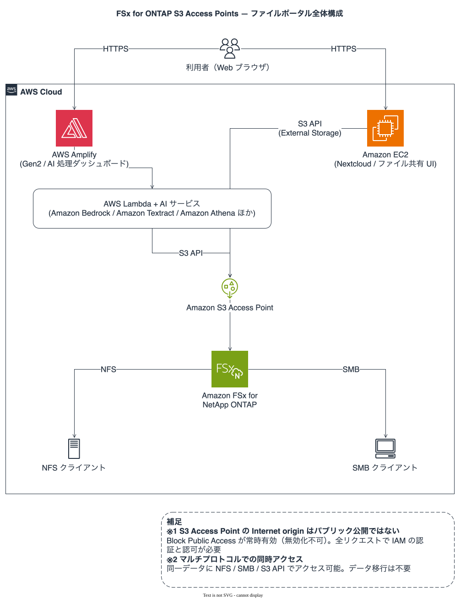
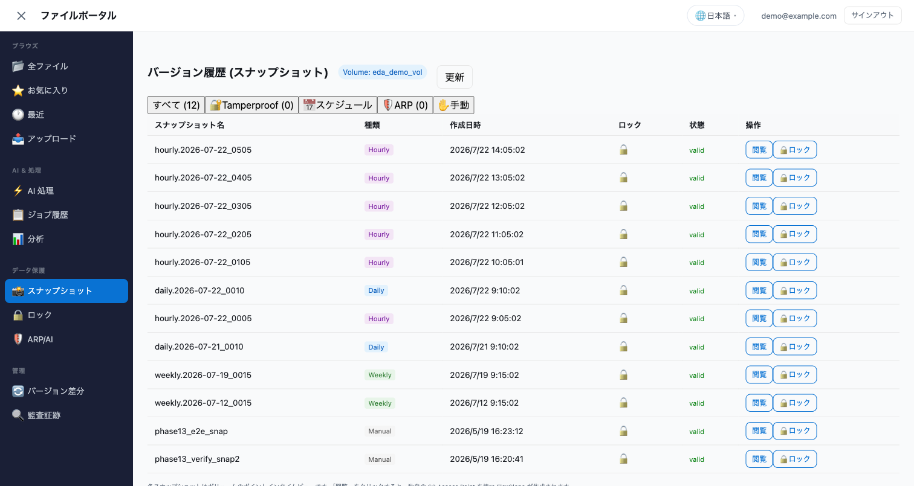
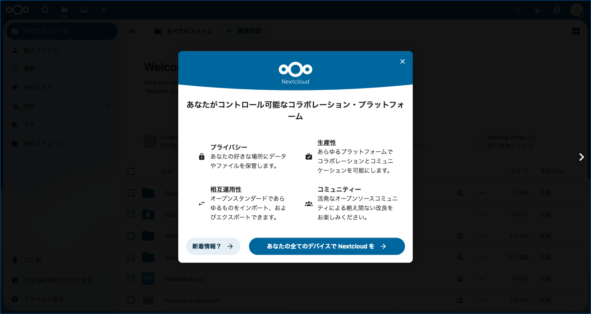

# ファイルポータル UI の選択肢 — Amplify Gen2 / Nextcloud / カスタムビルド

🌐 **Language / 言語**: 日本語 | [English](file-portal-amplify-gen2.en.md)

## エグゼクティブサマリ

FSx for ONTAP ボリューム上のファイルを **Web ブラウザから閲覧・処理指示・結果確認**するためのフロントエンドには、複数のアーキテクチャ選択肢があります。

**最初に確認すること: 作らずに済むかもしれません。** 用件が「ファイル転送」なら AWS Transfer Family が設定のみで SFTP / FTPS / FTP を提供し、FSx for ONTAP S3 AP 経由で同じボリュームを参照します。ブラウザ UI が要るなら Transfer Family web apps がマネージドなポータルを提供しますが、対象ストレージは Amazon S3 バケットです。詳しくは[作る必要の有無](#作る必要の有無)を先に読んでください。以下の 3 択は、そこで「作る」と判断した場合の比較です。

Box や Google Drive のようなファイル管理体験（フォルダナビゲーション、プレビュー、共有リンク、同期）を **ブラウザから FSx for ONTAP 上のデータに対して**提供するマネージドサービスは、**現行の AWS ドキュメントでは確認できません**。「存在しない」と言い切れる出典はありません（不在は出典を示せませんし、サービスは追加されます）。確認できる範囲は次のとおりです。

- Transfer Family は FSx for ONTAP に対応しますが、提供するのは**ファイル転送プロトコル**（SFTP / FTPS / FTP）で、ブラウザ UI ではありません。
- Transfer Family web apps はブラウザ UI を提供しますが、ドキュメントが述べる対象は **Amazon S3 バケット**（S3 Access Grants に登録したロケーション）で、FSx に接続した S3 Access Point の対応は記載されていません。

本ドキュメントでは、AWS Amplify Gen2、Nextcloud、カスタムビルド（CDK + フレームワーク）の3つを比較し、チームの状況に応じた選び方を示します。

**要点**: 3つすべてが妥当な選択肢です。チームの既存スキル、運用方針、コンプライアンス要件に応じて選択してください。本リポジトリのコア S3 AP サーバーレスパターンは、フロントエンドの選択に依存せず独立して動作します。

---

## すでに Amplify Gen2 に決めている場合 — 読者別の実装ガイド

このドキュメントは**選び方**の資料です。このリポジトリに含まれる Amplify Gen2 実装を使うと
決めている場合は、比較を読み通す必要はありません。自分の役割のガイドに進んでください。

<details open>
<summary><strong>👤 利用者（招待されてポータルを使う人）</strong></summary>

| ガイド | 内容 |
|---|---|
| **[ユーザーガイド (JA)](./ja/portal-user-guide.md) / [EN](./en/portal-user-guide.md)** | サインイン、閲覧、プレビュー、ダウンロード。ko / zh-CN / zh-TW / fr / de / es もあり |
| [スマートフォン利用ガイド (JA)](./ja/portal-mobile-guide.md) / [EN](./en/portal-mobile-guide.md) | 実機での利用手順 |
| [クイックリファレンス (JA)](./ja/portal-quick-reference.md) / [EN](./en/portal-quick-reference.md) | 操作の早見表 |
| [セクション構成ガイド](../solutions/amplify-portal/docs/portal-tabs-guide.md) | 画面がどう分かれているか |
| [アクセシビリティ (JA)](./ja/portal-accessibility.md) / [EN](./en/portal-accessibility.md) | キーボード操作・支援技術の対応状況 |

</details>

<details>
<summary><strong>🛠 インフラ担当（デプロイ・運用・引き渡し）</strong></summary>

| ガイド | 内容 |
|---|---|
| **[Getting Started](../solutions/amplify-portal/docs/GETTING-STARTED.md)** | 最初の起動まで。`amplify_outputs.json` と実機到達性の前提 |
| **[Deployment Runbook (JA)](./ja/portal-deployment-runbook.md) / [EN](./en/portal-deployment-runbook.md)** | デプロイ・削除の運用手順とトラブルシューティング |
| [Portal README](../solutions/amplify-portal/README.md) | セットアップ全手順と既知の落とし穴 |
| [ONTAP 接続ガイド](../solutions/amplify-portal/docs/ONTAP-CONNECTION-GUIDE.md) | 管理エンドポイントへの到達性、`make ontap-preflight` |
| [認可設計 (JA)](./ja/portal-authorization-design.md) / [EN](./en/portal-authorization-design.md) | RBAC（Viewer / Contributor / Storage Admin / Auditor） |
| [引き渡しと問い合わせ対応](../solutions/amplify-portal/docs/portal-handover-guide.md) | 利用者に渡すときの説明範囲と一次対応 |
| [PoC から本番へ (JA)](./ja/portal-poc-to-production.md) / [EN](./en/portal-poc-to-production.md) | 段階的な本番化の判断点 |
| [スケーリングガイド (JA)](./ja/portal-scaling-guide.md) / [EN](./en/portal-scaling-guide.md) | 利用者数・ファイル数が増えたときの設計 |
| [コンプライアンスガイド (JA)](./ja/portal-compliance-guide.md) / [EN](./en/portal-compliance-guide.md) | 監査証跡とデータ分類の扱い |
| [AppSync 認可のトラブルシューティング](../solutions/amplify-portal/docs/TROUBLESHOOTING-APPSYNC-AUTH.md) | 管理画面が空になる典型原因 |
| [クリーンアップガイド](../solutions/amplify-portal/docs/cleanup-guide.md) | 課金を止める削除手順 |
| [検証結果](../solutions/amplify-portal/docs/verification-results.md) | 機能ごとにどこまで実機確認済みか（実機 E2E / 読み取り / テストのみ） |

</details>

<details>
<summary><strong>💻 Amplify 開発者（UI とバックエンドを拡張する人）</strong></summary>

| ガイド | 内容 |
|---|---|
| **[ポータル UI を拡張する](../solutions/amplify-portal/docs/CONTRIBUTING-UI.md)** | 画面・アクションを追加する手順（最初に読む） |
| [Amplify Gen2 + CDK 設計判断ガイド](../solutions/amplify-portal/docs/amplify-gen2-cdk-patterns.md) | Gen2 で踏む制約と回避策 |
| [実装ガイド](../solutions/amplify-portal/docs/IMPLEMENTATION.md) | バックエンド Lambda とデータフロー |
| [管理機能マップ](../solutions/amplify-portal/docs/admin-capability-map.md) | 各インターフェースの担当範囲と実装状況 |
| [IaC ガバナンスパターン](../solutions/amplify-portal/docs/iac-governance-patterns.md) | cdk-nag と品質ゲートの構成 |
| [CDK 品質ゲートの制約](./agent/portal-cdk-quality-gates.md) | Amplify 管理リソースの抑制、クロススタック制約、sandbox の hotswap |
| [UI 文字列と 8 言語対応](./agent/portal-i18n.md) | `ja.ts` が型の源。ハードコード禁止の理由 |
| [PR ベース使い捨て環境](../solutions/amplify-portal/docs/pr-ephemeral-environments.md) | PR ごとのプレビュー環境 |
| [リソース管理デモガイド](../solutions/amplify-portal/docs/resource-management-demo-guide.md) | 管理画面の各パネルの使い方 |
| [AI エージェントデモガイド](../solutions/amplify-portal/docs/ai-agent-demo-guide.md) | エージェント機能の構成 |

</details>

> Nextcloud を選ぶ場合は [Nextcloud External Storage セットアップガイド](./nextcloud-external-storage-s3ap.md)、
> フロントエンドを作らない選択肢は [作る必要の有無](#作る必要の有無) を参照してください。

---

## 目次

0. [読者別の実装ガイド](#すでに-amplify-gen2-に決めている場合--読者別の実装ガイド)
1. [アーキテクチャ概要](#アーキテクチャ概要)
2. [作る必要の有無](#作る必要の有無)
3. [比較マトリクス](#比較マトリクス)
4. [選び方ガイド](#選び方ガイド)
5. [Amplify Gen2 統合パターン](#amplify-gen2-統合パターン)
6. [Nextcloud 統合パターン](#nextcloud-統合パターン)
7. [カスタムビルドパターン](#カスタムビルドパターン)
8. [スループットと容量計画](#スループットと容量計画)
9. [認証とコンプライアンス連鎖](#認証とコンプライアンス連鎖)
10. [導入ロードマップ](#導入ロードマップ)
11. [コスト概算（増分）](#コスト概算増分)
12. [トレードオフまとめ](#トレードオフまとめ)
13. [FAQ](#faq)
14. [関連ドキュメント](#関連ドキュメント)

---

## アーキテクチャ概要

3つのアプローチすべてが、同じバックエンド統合ポイント（FSx for ONTAP S3 Access Points にアクセスする Lambda を Step Functions でオーケストレーション）を共有します。

Amplify Gen2 と Nextcloud を併用した場合の全体像は次のとおりです。どちらのフロントエンドも同一の S3 Access Point を経由するため、データを移動させずに既存の NFS / SMB クライアントと共存します。



*図: 全体構成 — 2 つのフロントエンドが同一の S3 Access Point を経由して同じボリュームを参照する*

> 図はライトテーマ（白背景）です。ダークモードで見たい場合は [ダークテーマ版](images/architecture-overview-dark.svg)をご利用ください。全 13 枚の一覧は [構成図インデックス](architecture-diagrams.md) にあります。

下の図は、カスタムビルドを含む 3 つの選択肢が共通のバックエンドを共有する関係を示したものです。

```
┌─────────────────────────────────────────────────────────────┐
│              フロントエンド層（以下のいずれかを選択）              │
│                                                             │
│  ┌─────────────┐  ┌─────────────┐  ┌─────────────────────┐  │
│  │ Amplify Gen2│  │  Nextcloud  │  │ Custom              │  │
│  │ React +     │  │  (EC2/ECS)  │  │ (Vite/Next.js)      │  │
│  │ AppSync     │  │  + External │  │ + CDK               │  │
│  │             │  │    Storage  │  │ + API Gateway       │  │
│  └──────┬──────┘  └──────┬──────┘  └───────────┬─────────┘  │
└─────────┼────────────────┼─────────────────────┼────────────┘
          │                │                     │
          ▼                ▼                     ▼
┌─────────────────────────────────────────────────────────────┐
│  統合レイヤー                                                 │
│  - AppSync HTTP Resolver → Step Functions                   │
│  - API Gateway REST → Step Functions                        │
│  - Nextcloud External Storage → S3 Access Points            │
└─────────────────────────────────────────────────────────────┘
          │
          ▼
┌─────────────────────────────────────────────────────────────┐
│  バックエンド（既存 — 変更不要）                                 │
│  ┌───────────────┐     ┌─────────────────────┐              │
│  │Step Functions │     │ Lambda Functions    │              │
│  │(ASL workflow) │────▶│ Discovery (VPC内)   │              │
│  │               │     │ Processing (VPC外)  │              │
│  └───────────────┘     └──────────┬──────────┘              │
└───────────────────────────────────┼─────────────────────────┘
                                    │
                                    ▼
┌─────────────────────────────────────────────────────────────┐
│  FSx for ONTAP S3 Access Point                              │
│  (NFS / SMB / S3 — マルチプロトコル共有ネームスペース)            │
└─────────────────────────────────────────────────────────────┘
```

---

## 作る必要の有無

比較表の前に、この分岐を通してください。下の 3 択はいずれも**自分で作る**選択肢で、作らずに済むなら運用も認証もコンプライアンス連鎖も減ります。

```
用件は何か？
│
├─ ファイル転送（アップロード / ダウンロード / 自動連携）
│   └─▶ AWS Transfer Family
│        SFTP / FTPS / FTP を設定のみで提供。FSx for ONTAP S3 AP 経由で
│        既存の NFS / SMB クライアントと同じボリュームを共有する。
│        → フロントエンド開発は不要
│
├─ ブラウザで一覧・アップロード・ダウンロード
│   ├─ データが Amazon S3 バケットにある
│   │   └─▶ Transfer Family web apps
│   │        Storage Browser for Amazon S3 ベースのマネージドポータル。
│   │        コードを書かず、ホスティングも不要。
│   │
│   └─ データが FSx for ONTAP にある
│        └─▶ 現行ドキュメントでは対応を確認できない
│             → 下の 3 択（Amplify Gen2 / Nextcloud / カスタムビルド）
│
├─ ブラウザから独自の処理ワークフローを起動したい
│   └─▶ 下の 3 択（マネージドな該当サービスは確認できない）
│
└─ UI は不要（自動化 + 既存ツールで消費）
    └─▶ 何も作らない。[フロントエンドが不要な場合](#フロントエンドが不要な場合)へ
```

### AWS Transfer Family（ファイル転送プロトコル）

FSx for ONTAP のボリュームに S3 Access Point を接続し、Transfer Family がその S3 AP 経由でファイル操作をルーティングします。データは FSx 上に残り、既存の NFS / SMB アクセスは変わりません。

**適する状況**: 取引先とのファイル授受、既存の SFTP 連携の移行、バッチ連携の受け口。UI ではなくプロトコルが要件のとき。

**制約**（[AWS ドキュメント](https://docs.aws.amazon.com/transfer/latest/userguide/fsx-s3-access-points.html)、2026-08-15 確認）:

| 制約 | 内容 |
|------|------|
| rename | 非対応 |
| append | 非対応 |
| アップロードサイズ | 1 ファイル 5 GB まで |
| WinSCP | 既定の一時ファイル名（transfer to temporary filename）を**無効化しないとアップロードが失敗する**。他の SFTP クライアントも一時ファイル経由・resume・atomic rename を切る |
| ONTAP バージョン | 9.17.1 以降 |
| NetworkOrigin | Transfer Family のリクエストは自身の基盤から出るため、**VPC origin の S3 AP は拒否する**。Internet origin が必要（通信は AWS バックボーンを通り、公衆インターネットは経由しない） |
| 配置 | ファイルシステムと S3 AP が同一リージョン・同一アカウント |
| 参照方法 | home directory mapping は S3 AP **エイリアス**のみ。ARN や virtual-hosted-style URI は不可（IAM ポリシー側は逆に `accesspoint/<name>` の ARN 形式が必要） |
| 認可 | S3 AP ポリシーと FSx ボリューム側の両方が許可する二層モデル。S3 AP に紐づくファイルシステムユーザーの権限が上限になる |

> rename 非対応は「使えない」ではなく「クライアント設定が前提になる」という制約です。多くの SFTP クライアントが既定で一時ファイル + rename を使うため、**導入時にクライアント側の設定変更を配布できるか**が実質的な判断材料になります。

### Transfer Family web apps（ブラウザ UI）

Storage Browser for Amazon S3 をベースにしたマネージドなブラウザポータルで、IAM Identity Center と S3 Access Grants に統合されています。コードを書かず、ホスティングも不要です。

**適する状況**: 対象データが Amazon S3 バケットにあり、ブラウザでの閲覧・アップロード・ダウンロードで足りるとき。

**制約**（[AWS ドキュメント](https://docs.aws.amazon.com/transfer/latest/userguide/web-app.html)、2026-08-15 確認）:

- **対象ストレージは Amazon S3 バケット**。S3 Access Grants にロケーションを登録する構成で、FSx に接続した S3 Access Point を対象にできるとは記載されていません。**本リポジトリの用途（FSx for ONTAP 上のデータ）で使えるかは、現行ドキュメントからは確認できません。**
- バケットは web app と同一アカウント（クロスアカウント非対応）
- アップロード 1 ファイル 160 GB、コピー 5.36 GB、検索は 1 クエリ 10,000 件まで
- 認証は IAM Identity Center（既定ディレクトリまたは外部 IdP）

> この 2 つを実際に試して結果を書いたわけではありません。上の表と箇条書きは**公開ドキュメントの読み取り**で、本リポジトリの検証環境での実測ではありません。採用を決める前に、自分の要件（クライアント、ファイルサイズ、AD 連携）で PoC してください。

---

## 比較マトリクス

以下は、上の分岐で「作る」と判断した場合の 3 択です。Transfer Family は**列に含めていません** — プロトコル提供とブラウザ UI 開発は同じ軸で比べられないためです。両方が要る構成（Transfer Family で授受、Amplify Gen2 で処理指示）も成り立ちます。

### 表を読む前に — 比較範囲のポータルへの限定

**どの選択肢を選んでも、FSx for ONTAP のボリュームは NFS / SMB のファイルプロトコルでそのまま使えます。** ポータルを足すことは、既存のマウントを置き換えることではありません。AWS は S3 Access Point について次のように書いています。

> You can access your data in FSx for NetApp ONTAP just like you access data in an S3 bucket—while the data continues to reside on a file system and be accessible natively via the file protocols (e.g., NFS).

出典: [Amazon FSx for NetApp ONTAP Features — Accessible from Amazon S3](https://aws.amazon.com/fsx/netapp-ontap/features/)（AWS）

つまり想定している使い方はこうです。**利用者は普段どおり NFS / SMB でマウントして作業し、外部共有やデータ活用のときだけポータル（= S3 AP 経路）を使う。** 同じボリュームの同じファイルを、両方から見ます。FSx for ONTAP は NFS と SMB の同時アクセスを同一データに対して提供し（[AWS: Multi-protocol](https://aws.amazon.com/fsx/netapp-ontap/features/)）、S3 AP はそこに 3 つ目の経路を足すものです。

したがって、表の各行は次の意味です。

- 「ポータルが〜」と書いた行 = **ポータルアプリケーション自身**がどうデータに到達するか。利用者が使える経路の一覧ではありません
- 「組み込み」と書いた行 = **素のフレームワーク / 製品が最初から持っているか**。本リポジトリのポータルが実装済みかどうかは別列に分けました
- 各行に**根拠**を付けています。仕様は変わるので、採用判断の前にリンク先で現在の記載を確認してください。根拠が「本リポジトリ」の行は、この検証環境での実測または実装状況であって、一般的なサービス仕様ではありません

### マトリクス

| 観点 | Amplify Gen2（素） | 本リポジトリのポータル | Nextcloud | カスタムビルド (CDK) | 根拠 |
|------|:---:|:---:|:---:|:---:|---|
| **セットアップ時間 (PoC)** | 2-3日 | DemoMode は 30 分 | 1-2日（経験者） | 1-2週間 | [本リポジトリ](../solutions/amplify-portal/docs/GETTING-STARTED.md)（この環境での実測。所要時間は前提に依存します）|
| **ファイル閲覧 UI** | 自分で作る | 実装済み（ファイルエクスプローラー） | 組み込みファイルマネージャ | 自分で作る | [Nextcloud: Files](https://docs.nextcloud.com/server/latest/user_manual/en/files/index.html) / [本リポジトリ](../solutions/amplify-portal/docs/portal-tabs-guide.md) |
| **処理ジョブ起動** | AppSync Mutation → Step Functions | 実装済み | Workflow / webhook | API Gateway → Step Functions | [AWS AppSync](https://docs.aws.amazon.com/appsync/latest/devguide/what-is-appsync.html) / [Nextcloud: File workflows](https://docs.nextcloud.com/server/latest/admin_manual/file_workflows/index.html) / [Webhooks](https://docs.nextcloud.com/server/latest/admin_manual/webhook_listeners/index.html) |
| **認証** | Cognito（SAML / OIDC フェデレーション） | 同左（Cognito グループで認可） | LDAP / AD、SAML・OIDC はアプリ追加 | Cognito / 自作 | [AWS: Cognito フェデレーション](https://docs.aws.amazon.com/cognito/latest/developerguide/cognito-user-pools-identity-federation.html) / [Nextcloud: LDAP](https://docs.nextcloud.com/server/latest/admin_manual/configuration_user/user_auth_ldap.html) |
| **ホスティング** | サーバーレス（Amplify Hosting） | 同左 | サーバー（EC2 / ECS）| CloudFront + S3 / Amplify | [AWS: Amplify Hosting](https://docs.aws.amazon.com/amplify/latest/userguide/welcome.html) |
| **利用者が自分でパッチを当てる対象** | なし（マネージド） | なし | PHP / OS / Nextcloud 本体 | Lambda ランタイム等 | [Nextcloud: Upgrade](https://docs.nextcloud.com/server/latest/admin_manual/maintenance/upgrade.html) |
| **ポータルがデータに到達する経路** | — | S3 AP（VPC 外 Lambda 経由）| S3 AP を External Storage として直接、または**ホストの NFS マウント**を Local ストレージとして | S3 AP（Lambda 経由）| [AWS: S3 AP で FSx for ONTAP のデータにアクセス](https://docs.aws.amazon.com/fsx/latest/ONTAPGuide/s3-access-points.html) / [Nextcloud: Amazon S3](https://docs.nextcloud.com/server/latest/admin_manual/configuration_files/external_storage/amazons3.html) / [Nextcloud: Local](https://docs.nextcloud.com/server/latest/admin_manual/configuration_files/external_storage/local.html) |
| **利用者の NFS / SMB マウント** | **3 択とも変わりません**（ポータルはマウントを置き換えません）| ← | ← | ← | [AWS: Accessing your FSx for ONTAP data](https://docs.aws.amazon.com/fsx/latest/ONTAPGuide/supported-fsx-clients.html) |
| **オフライン編集** | ポータル自体には同期クライアントなし。**NFS / SMB マウント経由なら従来どおり可能** | 同左 | 加えて Nextcloud のデスクトップ / モバイル同期クライアントがある | ポータル自体にはなし | [Nextcloud: Desktop and mobile sync](https://docs.nextcloud.com/server/latest/user_manual/en/desktop/index.html) |
| **共有・コメント等の協業機能** | 自分で作る | ファイル操作と通知は実装済み。コメント / バージョン共有 UI は未実装 | 組み込み | 自分で作る | [Nextcloud: Sharing](https://docs.nextcloud.com/server/latest/user_manual/en/files/sharing.html) / [本リポジトリ](../solutions/amplify-portal/docs/portal-tabs-guide.md) |
| **モバイル** | レスポンシブ Web | レスポンシブ Web（[実測は 390×844 のエミュレーション](../solutions/amplify-portal/docs/verification-results.md)）| ネイティブアプリ (iOS / Android) | レスポンシブ Web | [Nextcloud: Clients](https://nextcloud.com/clients/) / 本リポジトリ |
| **言語 / フレームワーク** | TypeScript + React | 同左（UI は 8 言語）| PHP | 任意 | [本リポジトリ](../solutions/amplify-portal/docs/CONTRIBUTING-UI.md) |
| **S3 AP Presigned URL** | 動作する（※ドキュメント上 Not supported）| 同左 | 同左 | 同左 | [本リポジトリの実測メモ](./s3ap-compatibility-notes.md#presigned-url-support) |
| **インフラコスト（概算）** | 〜$5-10/月 | 同左 | 〜$50-100/月 (EC2) | 〜$5-20/月 | **概算・時点情報。根拠となる価格表を引いていません。**[コストの計測](./ja/cost-measurement.md)を読み、[AWS Pricing Calculator](https://calculator.aws/) で自分の構成を見積もってください |

> **AD について**: 上の「認証」行はポータルにサインインする人の認証です。**FSx for ONTAP の SVM を Active Directory に参加させるかどうかは別の軸**で、SMB アクセスと NTFS ACL に効きます。ポータルの認可（Cognito グループ）と ONTAP 側の認可は二層で、両方を設計する必要があります。[認可モデル](./ja/portal-authorization-model.md)を参照してください。

> **「未実装」と「できない」は違います**: 上の表で「自分で作る」「未実装」と書いた欄は、本リポジトリのポータルが現時点で持っていないという意味で、Amplify Gen2 で作れないという意味ではありません。逆に「実装済み」の欄も、どこまで実機で確認したかは[検証結果](../solutions/amplify-portal/docs/verification-results.md)の 4 区分（実機 E2E / 実機読み取り / 自動テストのみ / DemoMode のみ）で分けています。

---

## 選び方ガイド

### Amplify Gen2 が適する状況

- TypeScript/React に慣れたフロントエンド開発者がいる
- サーバーレスファースト（運用負荷最小化）を重視する
- UI からカスタム処理ワークフローを起動したい
- ブランチベースの環境管理（dev/staging/prod）を活用したい
- Cognito + AppSync + Step Functions の密な統合を求める

### Nextcloud が適する状況

- すぐに使えるファイル管理 UI が必要（フロントエンド開発なし）
- 組み込みのコラボレーション機能（共有、コメント、バージョニング UI）が欲しい
- 既存の LDAP/AD インフラに直接接続したい
- デスクトップ/モバイル同期クライアントでオフラインアクセスが必要
- PHP アプリケーション運用（EC2/ECS）に抵抗がない
- NFS マウントと S3 AP の両方でファイルを同時閲覧したい

### カスタムビルドが適する状況

- すべてのアーキテクチャ決定を完全にコントロールしたい
- Amplify にも Nextcloud にも合わない特定の UI/UX 要件がある
- 既存のエンタープライズポータルに統合したい
- 特定のフレームワーク（Vue, Angular, Svelte 等）を使いたい

### フロントエンドが不要な場合

- 処理が完全自動化されている（EventBridge Scheduler トリガー）
- 結果は NFS/SMB 経由で既存ツールが消費する
- AWS Console や CLI で十分
- 既存のモニタリングダッシュボード（Grafana, CloudWatch）で可視性が確保されている

---

## Amplify Gen2 と Nextcloud の共存アーキテクチャ

両者は排他的ではなく、**それぞれの得意領域を活かして併用**できます。

### 役割分担

| 機能 | Nextcloud が担当 | Amplify Gen2 が担当 |
|---|---|---|
| ファイル閲覧・ダウンロード | ✅ External Storage で即利用可 | ✅ ListFiles Lambda + 画像プレビュー |
| ファイルアップロード | ✅ ドラッグ&ドロップ、同期クライアント | ✅ Storage Browser 統合（ドラッグ&ドロップ、削除、コピー、フォルダ作成） |
| デスクトップ/モバイル同期 | ✅ 公式クライアント | △ PWA化でオフライン閲覧+通知対応可。双方向同期はNFS/SMBで代替 |
| 共有リンク | ✅ 組み込み（パスワード保護、期限設定） | ✅ Presigned URL（TTL 選択 + URL コピー） |
| コメント・アノテーション | ✅ 組み込み | ✅ AppSync Subscription + DynamoDB でリアルタイムコメント。PDF注釈はreact-pdf-highlighter等で対応可 |
| AI/ML 処理ワークフロー起動 | ⚠️ Webhook で可能だが設定が必要 | ✅ AppSync Mutation → Step Functions |
| AI Q&A（ファイルに質問） | ❌ | ✅ Bedrock Converse API |
| 画像 AI 分析 | ❌ | ✅ Rekognition DetectLabels |
| テキスト抽出（OCR） | ❌ | ✅ Textract |
| エンティティ/感情分析 | ❌ | ✅ Comprehend |
| Athena SQL クエリ | ❌ | ✅ Analytics セクション |
| 処理結果のリアルタイム表示 | ❌ ポーリング機構なし | ✅ 5秒ポーリング + ステータスバッジ |
| ジョブ実行履歴 | ❌ | ✅ DynamoDB (owner-based auth) |
| 処理パターン選択 UI | ❌ | ✅ ドロップダウン + パラメータ入力 |
| データ分類ラベル表示 | ❌ | ✅ dataClassification 表示 |
| FlexClone スナップショット復元 | ❌ | ✅ UI から直接実行 |
| Snapshot 一覧 + ARP/AI | ❌ | ✅ Data Protection セクション |
| SnapLock (WORM) 状態確認 | ❌ | ✅ Lock セクション |
| Audit Trail (CloudTrail) | ❌ | ✅ Admin セクション |

### 共存時のアーキテクチャ

```
┌─────────────────────────────────────────────────────────────────┐
│                        ユーザー                                  │
│  ┌─────────────────────┐   ┌──────────────────────────────────┐ │
│  │ Nextcloud           │   │ Amplify Gen2 Portal              │ │
│  │ (ファイル管理)        │   │ (処理ダッシュボード)                │ │
│  │ - 閲覧/DL/UL       　│   │ - パターン選択                     │ │
│  │ - 同期クライアント 　  │   │ - ジョブ投入                  　   │ │
│  │ - 共有/コメント       │   │ - 結果確認 　　　　　　             │ │
│  └────────┬────────────┘   └──────────────┬───────────────────┘ │
└───────────┼───────────────────────────────┼─────────────────────┘
            │                               │
            │ S3 AP (External Storage)      │ AppSync → Step Functions
            │ or NFS (Direct Mount)         │ + ListFiles Lambda → S3 AP
            │                               │
            ▼                               ▼
┌─────────────────────────────────────────────────────────────────┐
│  FSx for ONTAP                                                  │
│  ┌───────────────────────────────────────────────────────────┐  │
│  │ Volume (/vol/data)                                        │  │
│  │ NFS + SMB + S3 AP — 同一データ、マルチプロトコル           　  │  │
│  └───────────────────────────────────────────────────────────┘  │
└─────────────────────────────────────────────────────────────────┘
```

### 共存のポイント

1. **データは1箇所**: 両方とも同じ FSx for ONTAP ボリューム/S3 AP にアクセス。データの二重管理は不要。
2. **認証は独立**: Nextcloud は LDAP/SAML、Amplify は Cognito。ユーザーベースが異なっても問題なし。
3. **ネットワーク分離可能**: Nextcloud を VPC 内（NFS + VPC-origin S3 AP）、Amplify を VPC 外（Internet-origin S3 AP）に配置可能。
4. **段階的導入**: まず Nextcloud でファイル管理を始め、処理ニーズが出てきたら Amplify ポータルを追加。
5. **スループット共有**: 両方が同じ FSx for ONTAP の帯域を消費する点に注意（[スループット計画](#スループットと容量計画)参照）。

### 典型的な併用シナリオ

```
Day 1: チームが Nextcloud でファイルを閲覧・共有
       （NFS/SMB ユーザーと同じデータを Web から見える）

Day 2: 管理者が「この契約書フォルダを AI で分類したい」と判断
       → Amplify ポータルの Process タブで UC1 (Legal Compliance) を実行

Day 3: 処理結果（分類ラベル付き）が同じボリュームに書き戻される
       → Nextcloud ユーザーも NFS/SMB ユーザーも結果ファイルを即座に閲覧可能
```

---

## Amplify Gen2 統合パターン


*Amplify Gen2 ポータル: サイドバーナビゲーション + AI Processing + Data Protection セクション*


*AI Processing セクション: パターン選択 + 入力パスでジョブ投入*

#### 多言語対応（8 言語）

ポータルは 8 言語のランタイム切替をサポートしています（日本語 / English / 한국어 / 简体中文 / 繁體中文 / Français / Deutsch / Español）。


*English UI: Sidebar navigation + File Explorer*


*日本語 UI: スナップショット一覧（列ヘッダー、フィルター、ボタンすべて翻訳済み）*

### アーキテクチャ詳細

```
┌────────────────────────────────────────────────────────┐
│  Amplify Gen2                                          │
│  ┌────────────┐  ┌──────────────────────────────────┐  │
│  │ defineAuth │  │ defineData (AppSync)             │  │
│  │ Cognito    │  │  - startProcessing mutation      │  │
│  │ +SAML/OIDC │  │  - getJobStatus query            │  │
│  │            │  │  - onJobComplete subscription    │  │
│  └────────────┘  │  HTTP Resolver → Step Functions  │  │
│                  └──────────────┬───────────────────┘  │
│  ┌──────────────────────────────────────────────────┐  │
│  │ CDK カスタムリソース                                │  │
│  │  - 既存 Step Functions ASL を参照                  │  │
│  │  - VPC内 Lambda： ONTAP API (Discovery)           │  │
│  │  - VPC外 Lambda： S3 AP (Processing)              │  │
│  └──────────────────────────────────────────────────┘  │
└────────────────────────────────────────────────────────┘
```

### 実装のポイント

**AppSync → Step Functions（中間 Lambda 不要）**:

AppSync HTTP Resolver が Step Functions を直接呼び出すことで、Wrapper Lambda のコールドスタートを排除:

```typescript
// amplify/data/resource.ts（概念例）
const schema = a.schema({
  startProcessing: a.mutation()
    .arguments({ ucPattern: a.string(), inputPrefix: a.string() })
    .returns(a.json())
    .authorization(allow => [allow.authenticated()])
    .handler(a.handler.custom({
      dataSource: 'StepFunctionsHttpDataSource',
      entry: './resolvers/start-processing.js'
    })),
  getJobStatus: a.query()
    .arguments({ executionArn: a.string() })
    .returns(a.json())
    .authorization(allow => [allow.authenticated()])
    .handler(a.handler.custom({
      dataSource: 'StepFunctionsHttpDataSource',
      entry: './resolvers/get-status.js'
    }))
});
```

**VPC 分離の維持**: Discovery Lambda（ONTAP REST API）は VPC 内配置。Processing Lambda（Internet-origin S3 AP）は VPC 外。既存パターンのアーキテクチャをそのまま踏襲。

**既存 ASL の再利用**: CDK カスタムリソースが既存の `statemachine/workflow.asl.json` を変更なしで参照。

### 推奨ディレクトリ構成

```
solutions/amplify-portal/
├── amplify/
│   ├── backend.ts
│   ├── auth/resource.ts
│   ├── data/resource.ts
│   └── custom/step-functions.ts
├── src/
│   ├── App.tsx
│   ├── components/
│   │   ├── FileExplorer.tsx
│   │   ├── JobSubmitForm.tsx
│   │   └── ResultsViewer.tsx
│   └── pages/
├── tests/                          # フロントエンドテスト
│   ├── components/
│   └── integration/
├── package.json
├── tsconfig.json
├── Makefile                        # amplify-dev, amplify-test ターゲット
└── README.md
```

**開発・テスト**:
- `make amplify-dev`: `npx ampx sandbox` ラッパー（DemoMode バックエンドに接続）
- `make amplify-test`: React コンポーネントテスト + AppSync resolver ユニットテスト
- バックエンド側のテストは既存の `make test-uc1` 等と独立して実行

---

## Nextcloud 統合パターン


*Nextcloud: External Storage アプリで S3 AP alias をマウントすると、ONTAP ボリュームのファイルがそのまま表示される*

### アーキテクチャ詳細

```
┌────────────────────────────────────────────────────────┐
│  Nextcloud (EC2 or ECS Fargate)                        │
│  ┌──────────────────────────────────────────────────┐  │
│  │ External Storage App                             │  │
│  │  - S3 AP バックエンド（ファイル閲覧）            　   │  │
│  │  - FSx for ONTAP ボリュームをフォルダ表示            │  │
│  └──────────────────────────────────────────────────┘  │
│  ┌──────────────────────────────────────────────────┐  │
│  │ Workflow App / Webhook                           │  │
│  │  - ファイルアップロード/タグ付けで処理トリガー          │  │
│  │  - API Gateway → Step Functions で呼び出し  　     │  │
│  └──────────────────────────────────────────────────┘  │
│  ┌──────────────────────────────────────────────────┐  │
│  │ NFS マウント（オプション）                           │  │
│  │  - プレビュー/メタデータ用の直接ボリュームアクセス       │  │
│  └──────────────────────────────────────────────────┘  │
└────────────────────────────────────────────────────────┘
          │
          ▼
┌────────────────────────────────────────────────────────┐
│  API Gateway (REST)                                    │
│  → Step Functions StartExecution                       │
└────────────────────────────────────────────────────────┘
```

### 実装のポイント

**External Storage via S3 AP**: Nextcloud の「External Storage」アプリは S3 互換バックエンドをサポート。S3 AP エイリアスをバケット名として設定すると、FSx for ONTAP のファイルを Nextcloud のファイルブラウザに表示できる。

**S3 AP と Nextcloud の制約事項**:
- Presigned URL は AWS ドキュメント上「Not supported」だが、実際にはクライアント側で生成・利用可能（GetObject の署名付きリクエストとして動作する。[詳細](./s3ap-compatibility-notes.md#presigned-url-support)）。ただし本番依存は非推奨のため、Nextcloud はサーバープロセス経由でのダウンロードプロキシも選択可能
- `ListObjectsV2` のページネーション（1リクエスト最大1000オブジェクト）は Nextcloud の S3 バックエンドがネイティブに処理
- PutObject（単一 PUT 5 GB / Multipart で 50 GB まで）により Nextcloud UI から FSx for ONTAP へのアップロードが可能

**NFS マウントの併用**: より低レイテンシのファイル閲覧やプレビュー生成には、Nextcloud が FSx for ONTAP ボリュームを NFS で直接マウントする構成も可能（同一 VPC/サブネット内の EC2 配置が必要）。

**処理トリガーの選択肢**:
1. Nextcloud Workflow App → HTTP webhook → API Gateway → Step Functions
2. Nextcloud イベント（ファイルタグ付け）→ Lambda → Step Functions
3. 手動: ユーザーがカスタム Nextcloud アプリのボタンをクリック → API 呼び出し

### インフラ要件

| コンポーネント | スペック | 月額コスト |
|---|---|---|
| EC2 (Nextcloud サーバー) | t3.medium 以上 | ~$30-50 |
| RDS or Aurora (メタデータ DB) | db.t3.micro | ~$15-30 |
| EFS or EBS (Nextcloud データ) | アプリ設定/キャッシュのみ | ~$5-10 |
| ALB (HTTPS 終端) | Application Load Balancer | ~$20 |
| **増分合計** | | **~$70-110/月** |

> **補足**: ECS Fargate デプロイも可能だが、コンテナ管理の複雑性が追加される。

---

## カスタムビルドパターン

独自フロントエンドを構築するチーム向け:

```
┌────────────────────────────────────────────────────────┐
│  CloudFront + S3 (静的ホスティング)    　                 │
│  または Amplify Hosting (静的のみ)                       │
│  ┌──────────────────────────────────────────────────┐  │
│  │ SPA (React/Vue/Angular/Svelte)                   │  │
│  │  - API 経由のファイル一覧取得                        │  │
│  │  - ジョブ投入フォーム                               │  │
│  │  - 結果ポーリング ・ WebSocket                      │  │
│  └──────────────────────────────────────────────────┘  │
└────────────────────────────────────────────────────────┘
          │
          ▼
┌────────────────────────────────────────────────────────┐
│  API Gateway (REST or HTTP API)                        │
│  + Cognito User Pool Authorizer                        │
│  → Step Functions / Lambda                             │
└────────────────────────────────────────────────────────┘
```

このアプローチは最大の柔軟性を提供するが、ファイルブラウジング、認証フロー、リアルタイム更新をゼロから実装する必要がある。

---

## スループットと容量計画

> **Storage note**: FSx for ONTAP S3 AP の帯域幅は NFS/SMB ワークロードと共有されます。既存 NAS トラフィックと並行する Web UI ユーザーの同時利用を計画してください。

| シナリオ | S3 AP への影響 | ガイダンス |
|----------|:---:|---|
| 10名がディレクトリ一覧を表示 | ほぼ無視可能 | 特別な計画不要 |
| 10名が 1 GB ファイルを同時ダウンロード | ~80 Mbps（例: 128 MBps 構成で約8%） | `TotalThroughput` メトリクスを監視 |
| 50名が閲覧 + 随時ダウンロード | 典型的に ~20-40 Mbps | 多くのデプロイメントで許容範囲 |
| 100名以上が同時に大ファイル転送 | 顕著（容量に依存） | スループット容量増加または FlexCache 検討 |

**整合性モデル**: FSx for ONTAP S3 AP は ONTAP ファイルシステムの状態をリアルタイムに反映します。NFS/SMB で書き込んだファイルは、S3 AP のリスト取得で即座に見えます（結果整合性の遅延なし）。

**ListObjectsV2 のページネーション**: 1リクエストあたり最大1000オブジェクトを返却。多数のファイルがあるディレクトリでは、UI 側でページネーションの実装が必要。

**サムネイル/プレビュー生成のレイテンシ**: Nextcloud や独自 UI でプレビューを生成する場合、ファイルごとに GetObject（または Range GET で先頭バイトのみ）が発生します。1ディレクトリに100ファイルある場合、逐次的にプレビュー生成すると数秒のレイテンシが発生する可能性があります。並列リクエストまたはプレビューキャッシュで緩和してください。

> **補足**: スループット容量は FSx for ONTAP ファイルシステムの構成により異なります（128/256/512/1024/2048/4096 MBps）。上記の数値例は 128 MBps 構成を前提としています。実際の容量は AWS Console → FSx → ファイルシステム詳細で確認してください。

---

## 認証とコンプライアンス連鎖

ユーザー操作からファイルアクセスまでの完全な監査証跡:

```
ユーザー操作 → 認証トークン (Cognito/LDAP/SAML)
  → API リクエストログ (AppSync/API Gateway CloudWatch)
    → Step Functions 実行履歴
      → Lambda CloudWatch Logs
        → S3 AP 操作 (CloudTrail Data Events)
          → ONTAP 監査ログ (fpolicy/ネイティブ監査)
```

| 要件 | Amplify Gen2 | Nextcloud | カスタム |
|---|---|---|---|
| エンタープライズ IdP (SAML/OIDC) | Cognito フェデレーション | SAML/LDAP アプリ | Cognito フェデレーション |
| MFA | Cognito 組み込み | プラグイン | Cognito 組み込み |
| WAF 保護 | CloudFront + WAF | ALB + WAF | CloudFront + WAF |
| データ滞留 (in-region) | Lambda プロキシ (CDN 経由しない) | サーバーサイドプロキシ | Lambda プロキシ |
| 既存 shared/ モジュール連携 | `data_classification`, `lineage`, `human_review` はバックエンド Lambda で動作 | 同左 | 同左 |

> **Governance note**: S3 AP の Presigned URL はドキュメント上「Not supported」ですが、GetObject の署名付きリクエストとして実際には動作します（[詳細](./s3ap-compatibility-notes.md#presigned-url-support)）。ただし本番依存は非推奨のため、データガバナンスを重視する場合はサーバーサイドコンポーネント（Lambda または Nextcloud サーバー）経由でのアクセスを推奨します。これにより、データ滞留制御がアプリケーション層で担保されます。

> **Compliance note**: 処理結果ファイルには `data_classification` ラベル（INTERNAL/CUI/PUBLIC 等）が付与されます。ファイルポータル UI でこのラベルをユーザーに表示することを推奨します。バックエンドの `shared/data_classification.py` モジュールが分類ロジックを提供します。

> **Incident response note**: ファイルポータルが侵害された場合の対応は [Incident Response Playbook](./incident-response-playbook.md) を参照してください。Cognito トークン無効化、IAM キーローテーション、CloudTrail ログ保全が初動です。

---

## 導入ロードマップ

### クイックデモ（30分パス）

最速でファイルポータルの動作を見たい場合:

```bash
# Nextcloud Docker Compose (ローカル開発/デモ用 — 本番用途ではない)
docker run -d -p 8080:80 nextcloud:latest
# → localhost:8080 にアクセス、管理者アカウント作成
# → External Storage App を有効化
# → DemoMode の S3 バケットを External Storage として設定
```

> これは評価・デモ目的のみです。本番デプロイには後述のフェーズを踏んでください。

### Amplify Gen2 パス

| Phase | 作業内容 | 所要時間 | FSx for ONTAP 必要? |
|---|---|---|---|
| 1. UI プロトタイプ | Amplify sandbox + DemoMode バックエンド。認証・ワークフロー起動・結果表示の動作確認 | 2-3日 | 不要 |
| 2. バックエンド接続 | 既存 Step Functions ASL を CDK カスタムリソースとして参照。AppSync HTTP Resolver で接続 | 1-2日 | 不要（DemoMode） |
| 3. 本番データ接続 | FSx for ONTAP S3 AP に接続。VPC Lambda 配置、容量計画、監査設定 | 1-2週間 | 必要 |

### Nextcloud パス

| Phase | 作業内容 | 所要時間 | FSx for ONTAP 必要? |
|---|---|---|---|
| 1. サーバーセットアップ | EC2/ECS に Nextcloud デプロイ。テスト用 S3 バケットで External Storage 設定（DemoMode） | 1-2日 | 不要 |
| 2. S3 AP 統合 | External Storage を FSx for ONTAP S3 AP に接続。閲覧・アップロード検証 | 1-2日 | 必要 |
| 3. ワークフロー統合 | ファイル操作時に Step Functions を起動する webhook/API 設定 | 2-3日 | 必要 |
| 4. 本番堅牢化 | SAML、WAF、バックアップ、監視、パッチスケジュール | 1-2週間 | 必要 |

---

## コスト概算（増分）

既存の FSx for ONTAP + Lambda + Step Functions インフラに対する**追加コスト**:

| コンポーネント | Amplify Gen2 | Nextcloud | カスタムビルド |
|---|---|---|---|
| ホスティング | ~$0（Free Tier） | ~$50-100 (EC2+RDS+ALB) | ~$5 (S3+CF) |
| 認証 | ~$0.28 (50 MAU) | 含む | ~$0.28 (50 MAU) |
| API レイヤー | ~$4/100万リクエスト | ~$20 (API GW) | ~$4/100万リクエスト |
| ビルド/デプロイ | 含む | 手動/CI | 手動/CI |
| **月額合計（低トラフィック）** | **~$5-10** | **~$70-110** | **~$10-25** |

> **コンテキスト**: 上記は増分コストです。コアインフラ（FSx for ONTAP ~$194、NAT Gateway ~$32 等）は共通。

---

## トレードオフまとめ

| 特性 | Amplify Gen2 | Nextcloud | カスタムビルド |
|---|---|---|---|
| デモまでの時間 | 早い | 早い（ファイル閲覧は即時） | 遅い |
| 組み込みファイル管理 UI | なし（構築必要） | あり（リッチなファイルマネージャ） | なし（構築必要） |
| デスクトップ/モバイル同期 | なし | あり（公式クライアント） | なし |
| 運用オーバーヘッド | 低（サーバーレス） | 中（サーバーパッチ適用） | 低〜中 |
| 処理ワークフロー統合 | ネイティブ（AppSync → SFn） | Webhook ベース | API Gateway → SFn |
| コスト（低トラフィック） | 低 (~$5-10) | 高め (~$70-110) | 低〜中 (~$10-25) |
| カスタマイズの自由度 | CDK Override | プラグインエコシステム | 完全 |
| 必要なチームスキル | TypeScript + React | PHP 管理 + Linux | 任意 |
| ブランチベース環境 | 組み込み（Amplify sandbox） | 手動 | 手動 |
| 長期メンテナンス | Amplify がインフラ管理 | OS/アプリのパッチ・アップグレード | フレームワーク更新 |

---

## FAQ

**Q: Amplify Gen2 と Nextcloud を両方使えますか？**
A: はい。日常のファイル管理（閲覧、同期、共有）に Nextcloud、処理ダッシュボード/ジョブ投入 UI に Amplify、という併用が可能です。同じ FSx for ONTAP バックエンドを S3 AP 経由で共有します。

**Q: ファイルポータルのフロントエンドは既存の NFS/SMB ユーザーに影響しますか？**
A: 直接的には影響しません。フロントエンドは S3 AP 経由でデータにアクセスし、S3 AP は NFS/SMB とスループット容量を共有します。一般的な Web UI 利用（閲覧、随時ダウンロード）では影響は無視可能です。詳細は[スループットと容量計画](#スループットと容量計画)を参照。

**Q: Nextcloud から始めて、後から Amplify を追加できますか？**
A: はい。バックエンドパターンはフロントエンド非依存です。ファイル閲覧用にまず Nextcloud を稼働させ、カスタム UI が必要になった段階で Amplify ベースの処理ダッシュボードを追加できます。

**Q: S3 AP Presigned URL でのダイレクトダウンロードは？**
A: AWS ドキュメント上は「Not supported」ですが、Presigned URL は実際にはクライアント側の SigV4 署名計算であり、使用時に実行されるのは通常の GetObject リクエストのため動作します（[検証結果と AWS Support の見解](./s3ap-compatibility-notes.md#presigned-url-support)）。ただし AWS Support は本番ワークロードでの依存を非推奨としています。データガバナンスの観点でサーバーサイドプロキシ経由を選択することも有効ですが、技術的にはダイレクトダウンロードも可能です。

**Q: 規制環境（FISC、HIPAA）ではどのアプローチが使えますか？**
A: 3つすべてが適切に設定すれば規制要件を満たせます。主要な制御（監査ログ、暗号化、アクセス制御）は共有バックエンド層にあります。フロントエンド固有の考慮事項: Amplify Gen2（Cognito SAML + WAF）、Nextcloud（LDAP + ALB 上の WAF）、カスタム（実装依存）。

**Q: FSx for ONTAP なしで DemoMode でポータルも使えますか？**
A: はい。DemoMode は通常の S3 バケットを使用します。3つすべてのフロントエンド選択肢が DemoMode バックエンドに接続して開発・デモンストレーション可能です。

**Q: Nextcloud の External Storage で S3 AP を使う際の注意点は？**
A: Nextcloud の S3 バックエンド設定でエンドポイント URL と認証情報を正しく設定する必要があります。また、S3 AP の NetworkOrigin が `Internet` であること（VPC 外からのアクセス）が前提です。VPC 内に Nextcloud を配置する場合は NAT Gateway 経由、または同一 VPC 内 Interface VPC Endpoint 経由のアクセスとなります。

---

## 関連ドキュメント

- [Nextcloud External Storage セットアップガイド](./nextcloud-external-storage-s3ap.md) — Nextcloud + FSx for ONTAP S3 AP のステップバイステップ設定手順
- [Quick Desktop MCP セットアップガイド](./quick-desktop-mcp-setup.md) — Amazon Quick + AgentCore MCP Gateway で自然言語ファイル操作
- [AgentCore MCP デモガイド](./demo-agentcore-mcp-quick-desktop.md) — E2E デモ（list_files / read_file / search_files）+ スクリーンショット
- [AgentCore MCP 残課題トラッカー](./agentcore-mcp-remaining-issues.md) — 既知の問題と対応状況
- [代替アーキテクチャ比較 (S3 AP vs EFS vs NFS)](./comparison-alternatives.md) — バックエンドアーキテクチャ比較
- [S3AP 互換性ノート](./s3ap-compatibility-notes.md) — Presigned URL 制限を含む既知の制約
- [Demo Mode ガイド](./demo-mode-guide.md) — FSx for ONTAP なしでの実行方法
- [コスト計算機](./cost-calculator.md) — 全体インフラのコスト見積もり
- [パターン選択ガイド](./pattern-selection-guide.md) — ワークロードに適した UC パターン
- [S3AP パフォーマンス考慮事項](./s3ap-performance-considerations.md) — スループット設計ガイダンス
- [AD-Joined SVM S3 AP 前提条件](./en/ad-joined-svm-s3ap-prerequisites.md) — AD DC 到達性要件

---

*最終更新: 2026-07 | 対象: FSx for ONTAP S3 AP Serverless Patterns v1.x*
