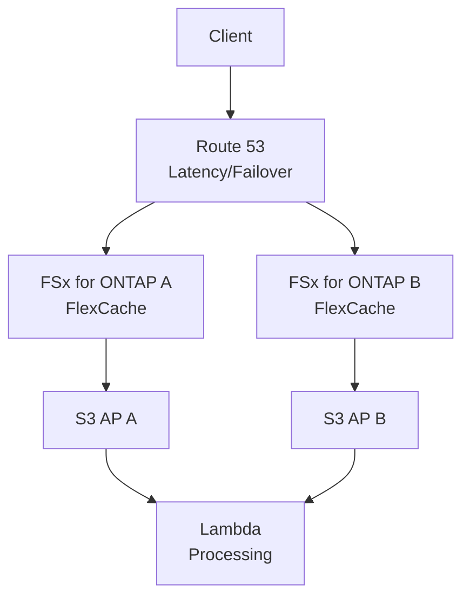

# FlexCache AnyCast 設計ガイド

## 概要

本ガイドは、FlexCache AnyCast パターンを FSx for ONTAP 環境で設計・実装する際の包括的なガイドラインを提供する。

## 設計原則

1. **制御プレーンとデータプレーンの分離**
2. **既存パターンの非破壊的拡張**
3. **シミュレーション可能な設計**
4. **段階的導入**

## FSx for ONTAP での AnyCast 代替設計

FSx for ONTAP では VIP/BGP が利用できないため、以下の代替パターンで設計する。

### 推奨パターン: Route 53 + Lambda Routing

### 設計判断マトリックス

| 要件 | Route 53 Failover | Route 53 Latency | Global Accelerator | Lambda Routing |
|------|:---:|:---:|:---:|:---:|
| RTO < 60秒 | ⚠️ TTL依存 | ✅ | ✅ | ✅ |
| マルチリージョン | ✅ | ✅ | ✅ | ✅ |
| コスト最小 | ✅ | ✅ | ❌ | ✅ |
| カスタムロジック | ❌ | ❌ | ❌ | ✅ |
| 運用簡素 | ✅ | ✅ | ⚠️ | ⚠️ |

## 詳細設計

詳細は以下を参照:
- [アーキテクチャ](../flexcache-anycast-dr/docs/architecture.md)
- [設計パターン](../flexcache-anycast-dr/docs/design-patterns.md)
- [ネットワーク設計](../flexcache-anycast-dr/docs/network-design-bgp-vip.md)
- [DR パターン](../flexcache-anycast-dr/docs/disaster-recovery-patterns.md)
