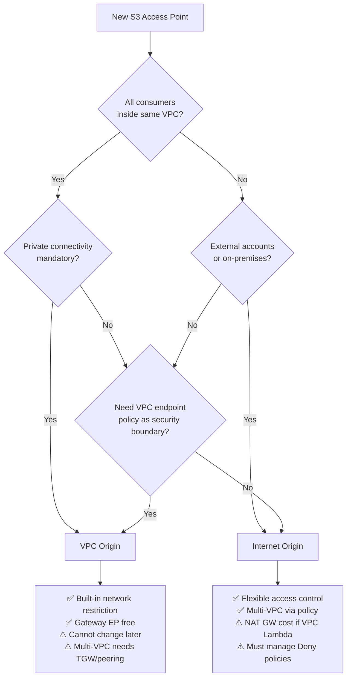
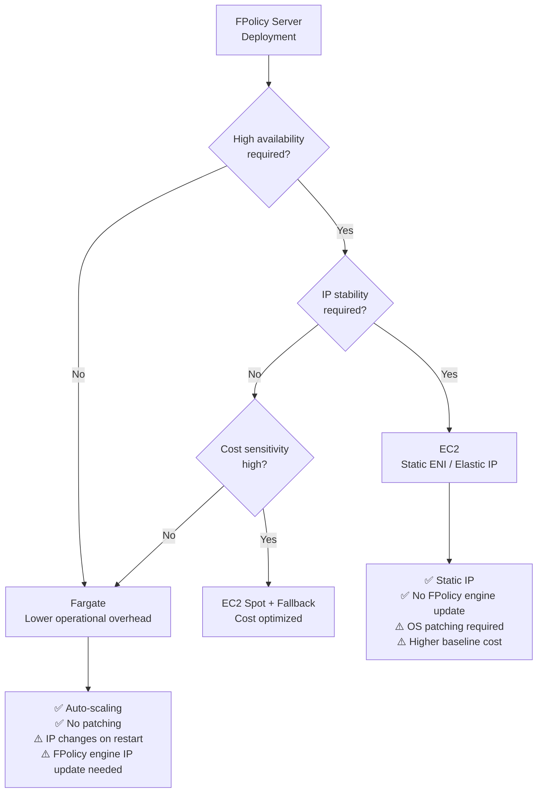
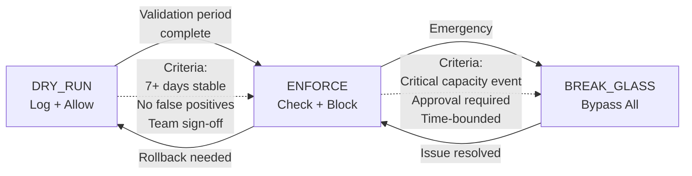
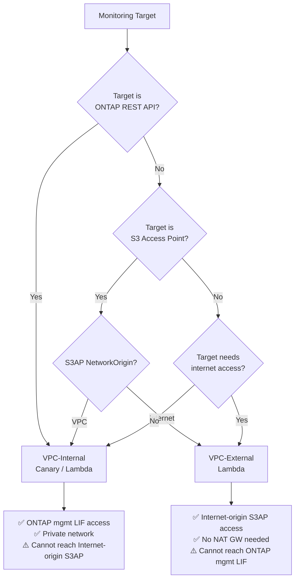

# Decision Trees — Architectural Design Guidance

## Overview

本ドキュメントは、FSxN S3AP Serverless Patterns の主要な設計判断を構造化したデシジョンツリーを提供する。各判断は不可逆または高コストな変更を伴うため、設計段階での正しい選択が重要。

## Decision Summary

| Decision | Primary Trade-off | Irreversible? |
|----------|------------------|---------------|
| S3AP NetworkOrigin | Security vs Flexibility | Yes (recreate required) |
| FPolicy Server Deployment | Cost vs Availability | No (migration possible) |
| Guardrail Mode Transition | Safety vs Speed | No (mode change anytime) |
| Monitoring Placement | Network Path vs Cost | No (redeploy possible) |

---

## 1. S3AP NetworkOrigin Selection

**⚠️ 不可逆**: NetworkOrigin は作成後に変更不可。変更するには Access Point を削除して再作成が必要。



### 判断基準

| 基準 | VPC Origin を選択 | Internet Origin を選択 |
|------|------------------|---------------------|
| Consumer 位置 | 全て同一 VPC 内 | 複数 VPC / 外部アカウント / オンプレ |
| セキュリティ要件 | ネットワーク制限が必須 | IAM ポリシーベースで十分 |
| コスト | Gateway EP 無料 | NAT GW 必要（VPC Lambda の場合） |
| 変更容易性 | AP 再作成が必要 | ポリシー更新のみ |
| Lambda 配置 | VPC 内 Lambda + Gateway EP | VPC 外 Lambda（推奨） |

---

## 2. FPolicy Server Deployment Mode



### 判断基準

| 基準 | Fargate | EC2 |
|------|---------|-----|
| 運用負荷 | 低（マネージド） | 高（OS パッチ、監視） |
| IP 安定性 | タスク再起動で変更 | ENI 固定可能 |
| FPolicy engine 更新 | 再起動時に必要 | 不要（IP 固定） |
| コスト（常時稼働） | vCPU + Memory 従量 | インスタンス固定 |
| スケーリング | ECS Service auto-scaling | ASG / 手動 |
| 推奨環境 | PoC / 中小規模 | 大規模本番 / IP 固定必須 |

---

## 3. Guardrail Mode Transition



### 遷移基準

| 遷移 | 前提条件 | 承認 |
|------|---------|------|
| DRY_RUN → ENFORCE | 7 日以上安定稼働、false positive なし | Platform team lead |
| ENFORCE → BREAK_GLASS | 緊急容量イベント、SNS アラート発報 | On-call + manager |
| BREAK_GLASS → ENFORCE | 問題解決確認、監査ログ記録済み | Platform team lead |
| ENFORCE → DRY_RUN | 設定変更後の再検証期間 | Platform team |

### BREAK_GLASS 運用ルール

1. 最大持続時間: 4 時間（超過時は自動 ENFORCE 復帰を推奨）
2. 全操作が DynamoDB + SNS で監査記録される
3. 使用後は必ずポストモーテムを実施

---

## 4. Monitoring Placement



### 判断基準

| 監視対象 | 配置 | 理由 |
|---------|------|------|
| ONTAP REST API | VPC 内 | 管理 LIF はプライベート IP |
| S3AP (Internet Origin) | VPC 外 | Gateway EP 経由で到達不可 |
| S3AP (VPC Origin) | VPC 内 | Gateway EP 経由で到達可能 |
| 外部 API / SaaS | VPC 外 | インターネットアクセス必要 |
| SQS / EventBridge | どちらでも | VPC Endpoint or Internet 両方可 |

---

## Quick Reference

```
┌─────────────────────────────────────────────────────────────┐
│ Design Decision Checklist                                    │
├─────────────────────────────────────────────────────────────┤
│ □ S3AP NetworkOrigin: VPC / Internet (IRREVERSIBLE)         │
│ □ FPolicy Server: Fargate / EC2                             │
│ □ Guardrail Initial Mode: DRY_RUN (recommended)            │
│ □ ONTAP Monitor: VPC-internal                               │
│ □ S3AP Monitor: VPC-external (if Internet Origin)           │
│ □ FlexClone Lambda (ONTAP API): VPC-internal                │
│ □ FlexClone Lambda (S3AP): VPC-external                     │
└─────────────────────────────────────────────────────────────┘
```
