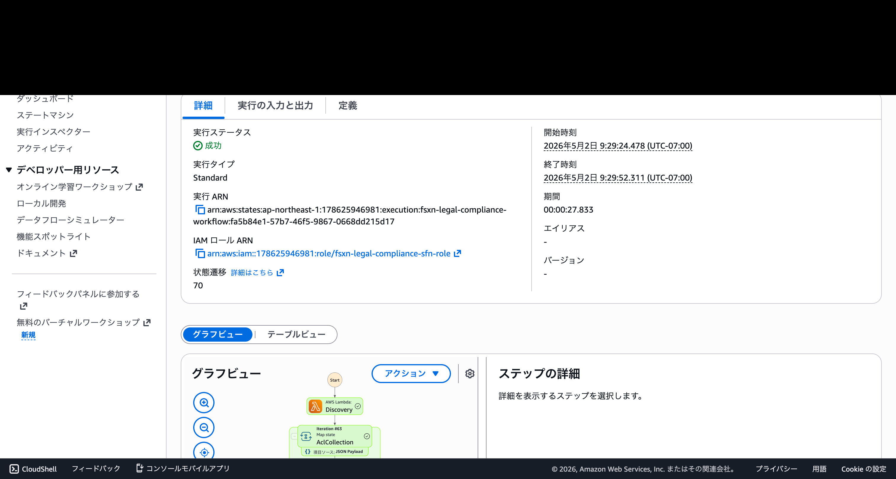
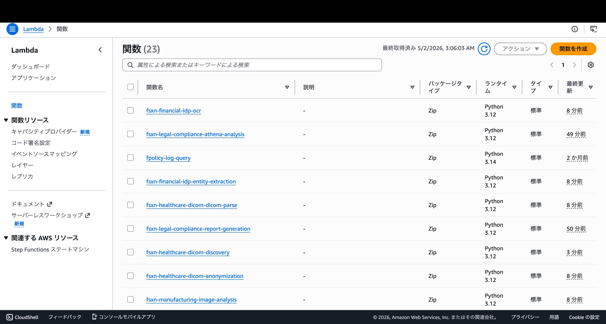

# デプロイ手順書

本ドキュメントでは、FSx for ONTAP S3 AP Serverless Patterns のデプロイ手順を説明します。

## 目次

1. [前提条件確認](#1-前提条件確認)
2. [パラメータ準備](#2-パラメータ準備)
3. [CloudFormation デプロイ](#3-cloudformation-デプロイ)
4. [SNS サブスクリプション確認](#4-sns-サブスクリプション確認)
5. [動作確認](#5-動作確認)

---

## 1. 前提条件確認

デプロイ前に以下の前提条件を確認してください。

### AWS 環境

- [ ] AWS アカウントへのアクセス権限（CloudFormation, Lambda, Step Functions, S3, IAM 等）
- [ ] AWS CLI v2 がインストール済み
- [ ] デプロイ先リージョン: 全 AI/ML サービス利用時は `us-east-1` / `us-west-2` 推奨。詳細は [リージョン互換性マトリックス](../region-compatibility.md) を参照

### FSx for NetApp ONTAP

- [ ] FSx ONTAP ファイルシステムがデプロイ済み
- [ ] ONTAP バージョン: S3 Access Points をサポートするバージョン（9.17.1P4D3 で検証済み）
- [ ] S3 Access Point が関連付けられた FSx for ONTAP ボリューム
- [ ] ONTAP 管理用の認証情報が Secrets Manager に登録済み

### ネットワーク

- [ ] VPC とプライベートサブネット（2 つ以上）が作成済み
- [ ] プライベートサブネットから S3 Gateway VPC Endpoint へのルーティング

### 確認コマンド

```bash
# AWS CLI の設定確認
aws sts get-caller-identity --region ap-northeast-1

# FSx ファイルシステムの確認
aws fsx describe-file-systems \
  --region ap-northeast-1 \
  --query "FileSystems[].{Id:FileSystemId,Type:FileSystemType,Status:Lifecycle}"

# VPC の確認
aws ec2 describe-vpcs \
  --region ap-northeast-1 \
  --query "Vpcs[].{Id:VpcId,Cidr:CidrBlock}"
```

---

## 2. パラメータ準備

CloudFormation テンプレートに必要なパラメータを準備します。

### 必須パラメータ

| パラメータ | 説明 | 例 |
|-----------|------|-----|
| `S3AccessPointAlias` | S3 AP Alias | `<your-volume-ext-s3alias>` |
| `S3AccessPointOutputAlias` | 出力用 S3 AP Alias | `<your-output-volume-ext-s3alias>` |
| `OntapSecretName` | Secrets Manager シークレット名 | `<your-ontap-secret-name>` |
| `OntapManagementIp` | ONTAP 管理 IP | `<your-ontap-management-ip>` |
| `SvmUuid` | SVM UUID | `<your-svm-uuid>` |
| `VolumeUuid` | ボリューム UUID | `<your-volume-uuid>` |
| `VpcId` | VPC ID | `<your-vpc-id>` |
| `PrivateSubnetIds` | プライベートサブネット ID | `<subnet-1>,<subnet-2>` |
| `PrivateRouteTableIds` | ルートテーブル ID リスト | `<rtb-1>,<rtb-2>` |
| `NotificationEmail` | 通知先メールアドレス | `<your-email@example.com>` |

### オプショナルパラメータ

| パラメータ | 説明 | デフォルト | 備考 |
|-----------|------|----------|------|
| `EnableVpcEndpoints` | Interface VPC Endpoints | `false` | 本番環境では `true` 推奨（月額 ~$28.80） |
| `EnableCloudWatchAlarms` | CloudWatch Alarms | `false` | 本番環境では `true` 推奨 |
| `EnableS3GatewayEndpoint` | S3 Gateway Endpoint | `true` | 同一 VPC に既存の場合は `false` |
| `ScheduleExpression` | 実行スケジュール | `rate(1 hour)` | cron 式も使用可能 |

### Lambda VPC 配置アーキテクチャ

検証で得た知見に基づき、Lambda 関数は以下のように VPC 内/外に分離配置されます。

**VPC 内 Lambda**（ONTAP REST API アクセスが必要）:
- Discovery Lambda（全 UC）— S3 AP + ONTAP API
- AclCollection Lambda（UC1 のみ）— ONTAP file-security API

**VPC 外 Lambda**（AWS マネージドサービス API のみ使用）:
- AthenaAnalysis, ReportGeneration（UC1）
- OCR, EntityExtraction, Summary（UC2）
- Transform, AthenaAnalysis, ImageAnalysis（UC3）
- JobSubmit, QualityCheck（UC4）
- DicomParse, PiiDetection, Anonymization（UC5）

> **理由**: VPC 内 Lambda から AWS マネージドサービス API（Athena, Bedrock, Textract, Comprehend, Rekognition 等）にアクセスするには、対応する Interface VPC Endpoint が必要です（各 $7.20/月）。VPC 外 Lambda はインターネット経由で直接 AWS API にアクセスでき、追加コストなしで動作します。S3 AP は `internet` network origin であれば VPC 外からもアクセス可能です。

> **重要**: ONTAP REST API を使用する UC（UC1 法務・コンプライアンス）では `EnableVpcEndpoints=true` が必須です。VPC 内 Lambda が Secrets Manager から ONTAP 認証情報を取得するために Secrets Manager VPC Endpoint が必要です。

### パラメータの取得方法

```bash
# SVM UUID の取得
aws fsx describe-storage-virtual-machines \
  --region ap-northeast-1 \
  --query "StorageVirtualMachines[].{Id:StorageVirtualMachineId,Name:Name}"

# ボリューム UUID の取得（ONTAP REST API 経由）
# OntapClient を使用するか、ONTAP CLI で確認
```

---

## 3. CloudFormation デプロイ

### デプロイスクリプトの使用

```bash
cd fsxn-s3ap-serverless-patterns

# UC1（法務・コンプライアンス）のデプロイ
# scripts/deploy_uc1.sh のプレースホルダーを実際の値に置き換えてから実行
bash scripts/deploy_uc1.sh
```

### 手動デプロイ

```bash
aws cloudformation deploy \
  --template-file legal-compliance/template-deploy.yaml \
  --stack-name fsxn-legal-compliance \
  --parameter-overrides \
    S3AccessPointAlias=<your-volume-ext-s3alias> \
    S3AccessPointOutputAlias=<your-output-volume-ext-s3alias> \
    OntapSecretName=<your-ontap-secret-name> \
    OntapManagementIp=<your-ontap-management-ip> \
    SvmUuid=<your-svm-uuid> \
    VolumeUuid=<your-volume-uuid> \
    VpcId=<your-vpc-id> \
    PrivateSubnetIds=<subnet-1>,<subnet-2> \
    PrivateRouteTableIds=<rtb-1>,<rtb-2> \
    NotificationEmail=<your-email@example.com> \
    EnableVpcEndpoints=true \
  --capabilities CAPABILITY_IAM CAPABILITY_AUTO_EXPAND \
  --region $AWS_DEFAULT_REGION
```

### デプロイ結果の確認

```bash
# スタックの状態確認
aws cloudformation describe-stacks \
  --stack-name fsxn-legal-compliance \
  --query "Stacks[0].StackStatus" \
  --region ap-northeast-1

# スタックの出力確認
aws cloudformation describe-stacks \
  --stack-name fsxn-legal-compliance \
  --query "Stacks[0].Outputs" \
  --output table \
  --region ap-northeast-1
```

> **参考**: CloudFormation スタック作成画面のスクリーンショットは [do../screenshots/masked/cloudformation-stack.png](../screenshots/cloudformation-stack.png) を参照してください。

---

## 4. SNS サブスクリプション確認

デプロイ後、SNS トピックへのサブスクリプション確認メールが送信されます。

### 確認手順

1. `NotificationEmail` に指定したメールアドレスの受信箱を確認
2. 「AWS Notification - Subscription Confirmation」メールを開く
3. 「Confirm subscription」リンクをクリック

```bash
# SNS サブスクリプションの状態確認
aws sns list-subscriptions-by-topic \
  --topic-arn <your-sns-topic-arn> \
  --region ap-northeast-1
```

---

## 5. 動作確認

### Step Functions ワークフローの手動実行

```bash
# ステートマシン ARN の取得
STATE_MACHINE_ARN=$(aws cloudformation describe-stacks \
  --stack-name fsxn-legal-compliance \
  --query "Stacks[0].Outputs[?OutputKey=='StateMachineArn'].OutputValue" \
  --output text \
  --region ap-northeast-1)

# ワークフローの手動実行
aws stepfunctions start-execution \
  --state-machine-arn "$STATE_MACHINE_ARN" \
  --region ap-northeast-1
```

### 実行結果の確認

```bash
# 最新の実行結果を確認
aws stepfunctions list-executions \
  --state-machine-arn "$STATE_MACHINE_ARN" \
  --max-results 5 \
  --region ap-northeast-1
```

> **参考**: Step Functions ワークフロー実行画面のスクリーンショットは以下を参照してください。

#### 全 UC ワークフロー成功画面


#### UC1 E2E 実行成功画面



#### Lambda 関数一覧



### S3 出力バケットの確認

```bash
# 出力バケットの内容確認
OUTPUT_BUCKET=$(aws cloudformation describe-stacks \
  --stack-name fsxn-legal-compliance \
  --query "Stacks[0].Outputs[?OutputKey=='OutputBucketName'].OutputValue" \
  --output text \
  --region ap-northeast-1)

aws s3 ls "s3://$OUTPUT_BUCKET/" --recursive --region ap-northeast-1
```

> **参考**: S3 出力バケット内容のスクリーンショットは [do../screenshots/masked/s3-output-bucket.png](../screenshots/s3-output-bucket.png) を参照してください。

### CloudWatch ログの確認

```bash
# Lambda 関数のログ確認
aws logs describe-log-groups \
  --log-group-name-prefix "/aws/lambda/fsxn-legal" \
  --region ap-northeast-1
```

> **参考**: CloudWatch ログのスクリーンショットは [do../screenshots/masked/cloudwatch-logs.png](../screenshots/cloudwatch-logs.png) を参照してください。

---

## クリーンアップ

検証完了後、リソースを削除する場合:

```bash
# 1. S3 バケットの中身を空にする（バージョニング有効バケットの場合）
BUCKET="fsxn-legal-compliance-athena-results-$(aws sts get-caller-identity --query Account --output text)"
python3 -c "
import boto3
s3 = boto3.client('s3')
versions = s3.list_object_versions(Bucket='$BUCKET')
objects = [{'Key':v['Key'],'VersionId':v['VersionId']} for v in versions.get('Versions',[])]
objects += [{'Key':m['Key'],'VersionId':m['VersionId']} for m in versions.get('DeleteMarkers',[])]
if objects:
    s3.delete_objects(Bucket='$BUCKET', Delete={'Objects': objects})
    print(f'Deleted {len(objects)} objects/markers')
"

# 2. CloudFormation スタックの削除（逆順で実行）
for stack in fsxn-healthcare-dicom fsxn-media-vfx fsxn-manufacturing fsxn-financial-idp fsxn-legal-compliance; do
  aws cloudformation delete-stack --stack-name "$stack" --region "$AWS_DEFAULT_REGION"
  echo "Delete initiated: $stack"
done

# 3. 削除完了を待機（VPC Endpoints の削除に 5-15 分かかる場合あり）
for stack in fsxn-healthcare-dicom fsxn-media-vfx fsxn-manufacturing fsxn-financial-idp fsxn-legal-compliance; do
  aws cloudformation wait stack-delete-complete --stack-name "$stack" --region "$AWS_DEFAULT_REGION"
  echo "Deleted: $stack"
done
```

### 削除が失敗する場合

| エラー | 原因 | 対処法 |
|--------|------|--------|
| `BucketNotEmpty` | S3 バケットにオブジェクトが残っている | 上記の Python スクリプトで全バージョンを削除 |
| `has a dependent object` (SecurityGroup) | Lambda ENI が解放されていない | 5 分待って `--retain-resources LambdaSecurityGroup` で再試行 |
| `WorkGroup is not empty` (Athena) | Athena ワークグループにクエリ履歴が残っている | `aws athena delete-work-group --work-group <name> --recursive-delete-option` |
| `route table already has a route` (S3 Gateway) | 同一ルートテーブルに既存の S3 Gateway Endpoint | `EnableS3GatewayEndpoint=false` でデプロイ |

---

## 複数ユースケースの同一 VPC デプロイ

同一 VPC に複数のユースケーススタックをデプロイする場合、S3 Gateway VPC Endpoint の競合に注意が必要です。

### デプロイ手順

1. **最初のスタック**: `EnableS3GatewayEndpoint=true`（デフォルト）でデプロイ
2. **2 番目以降のスタック**: `EnableS3GatewayEndpoint=false` でデプロイ

```bash
# 1. UC1 をデプロイ（S3 Gateway Endpoint を作成）
aws cloudformation create-stack \
  --stack-name fsxn-legal-compliance \
  --template-body file://legal-compliance/template-deploy.yaml \
  --capabilities CAPABILITY_NAMED_IAM \
  --parameters \
    ParameterKey=EnableS3GatewayEndpoint,ParameterValue=true \
    ...

# 2. UC2 をデプロイ（S3 Gateway Endpoint はスキップ）
aws cloudformation create-stack \
  --stack-name fsxn-financial-idp \
  --template-body file://financial-idp/template-deploy.yaml \
  --capabilities CAPABILITY_NAMED_IAM \
  --parameters \
    ParameterKey=EnableS3GatewayEndpoint,ParameterValue=false \
    ...
```

### 削除時の注意

S3 Gateway Endpoint を作成したスタックを先に削除すると、他のスタックの Lambda が S3 AP にアクセスできなくなります。削除順序は作成順序の逆（最後にデプロイしたスタックから削除）を推奨します。

---

## デプロイスクリプト

### Lambda パッケージング

`scripts/deploy_uc.sh` を使用して Lambda 関数を ZIP パッケージ化し、S3 にアップロードします:

```bash
# Lambda 関数のパッケージング + S3 アップロード
./scripts/deploy_uc.sh legal-compliance package
./scripts/deploy_uc.sh financial-idp package
./scripts/deploy_uc.sh manufacturing-analytics package
./scripts/deploy_uc.sh media-vfx package
./scripts/deploy_uc.sh healthcare-dicom package
```

### テンプレート変換

`scripts/create_deploy_template.py` を使用して SAM テンプレートを標準 CloudFormation テンプレートに変換します:

```bash
python3 scripts/create_deploy_template.py
```

これにより、各 UC の `template.yaml`（SAM Transform 使用）から `template-deploy.yaml`（標準 CloudFormation、S3 ベースの Lambda コード参照）が生成されます。

---

## 他のユースケースのデプロイ

各ユースケースのデプロイ手順は、それぞれの README を参照してください。

| ユースケース | テンプレート | README |
|------------|------------|--------|
| UC1: 法務・コンプライアンス | `legal-compliance/template.yaml` | [legal-compliance/README.md](../../legal-compliance/README.md) |
| UC2: 金融・保険 | `financial-idp/template.yaml` | [financial-idp/README.md](../../financial-idp/README.md) |
| UC3: 製造業 | `manufacturing-analytics/template.yaml` | [manufacturing-analytics/README.md](../../manufacturing-analytics/README.md) |
| UC4: メディア | `media-vfx/template.yaml` | [media-vfx/README.md](../../media-vfx/README.md) |
| UC5: 医療 | `healthcare-dicom/template.yaml` | [healthcare-dicom/README.md](../../healthcare-dicom/README.md) |
