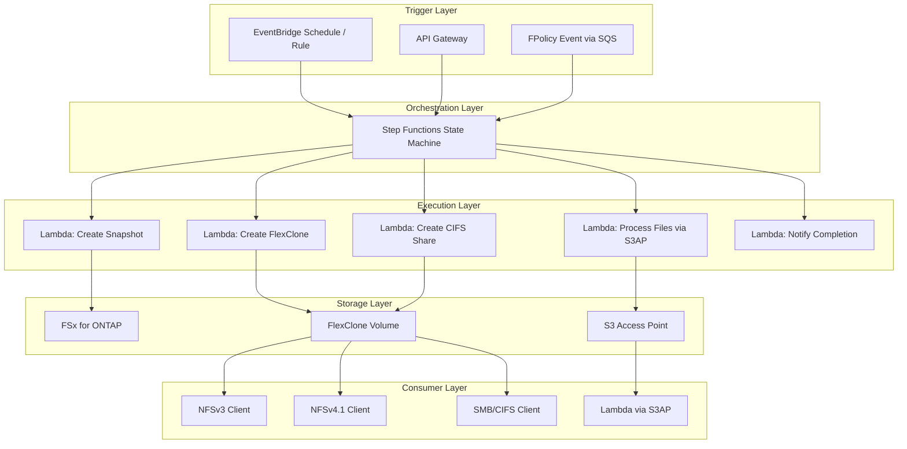
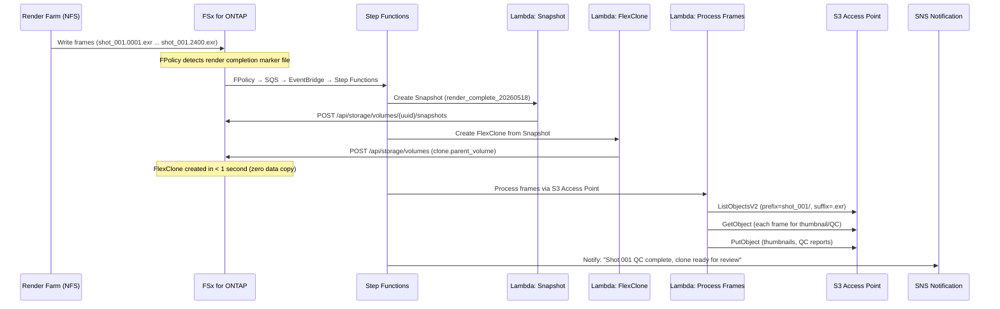
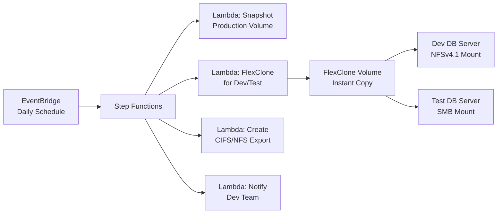
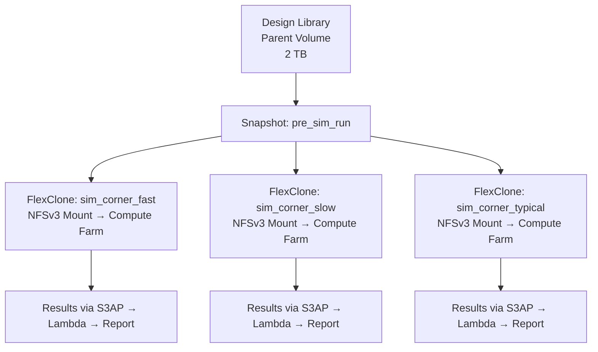
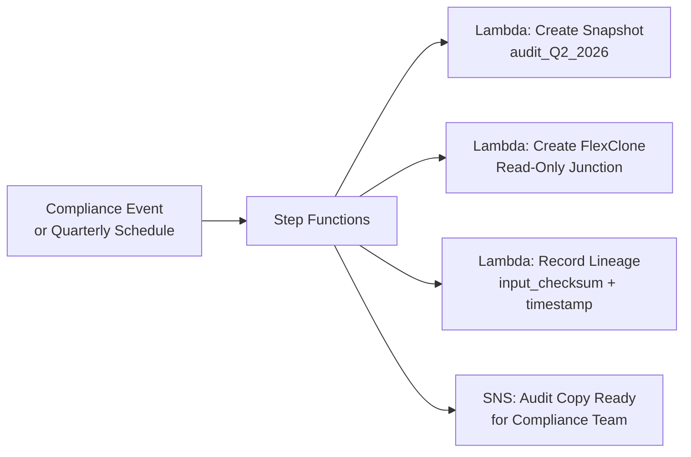

# FlexClone Serverless Patterns — Industry Use Cases

## Overview

FSx for ONTAP FlexClone creates instant, writable volume copies without data duplication.
Combined with AWS managed services, it enables fully serverless automation patterns
from clone creation through multi-protocol mount to file processing.

This document covers integrated patterns organized by industry — from FlexClone creation
to multi-protocol mounting and serverless file processing pipelines.

## Architecture: Serverless FlexClone Automation



## Pattern 1: Media/VFX — Sequential Frame Processing Pipeline

### Use Case

In film, animation, and VFX production, rendering outputs large volumes of sequential image files
(EXR, PNG, TIFF) to NFS shares. A single shot can produce thousands to tens of thousands of frames
(e.g., `shot_001.0001.exr` through `shot_001.2400.exr`).

**Challenges**:
- Running post-processing (QC, thumbnail generation, metadata extraction) against a volume
  during active rendering causes I/O contention
- Multiple artists/departments need to reference the same shot data while working independently
- Conform and color grading workflows require point-in-time snapshots of specific frame ranges

**FlexClone + Serverless Solution**:



### CloudFormation Template Structure

```yaml
# shared/cfn/flexclone-media-pipeline.yaml
AWSTemplateFormatVersion: "2010-09-09"
Transform: AWS::Serverless-2016-10-31

Parameters:
  ProjectPrefix:
    Type: String
    Default: "fsxn-s3ap"
  EnableFlexCloneMediaPipeline:
    Type: String
    Default: "false"
    AllowedValues: ["true", "false"]
  OntapMgmtIp:
    Type: String
    Description: ONTAP SVM management IP
  OntapCredentialsSecret:
    Type: String
    Description: Secrets Manager secret name
  SvmUuid:
    Type: String
    Description: SVM UUID
  ParentVolumeUuid:
    Type: String
    Description: Parent volume UUID for cloning
  S3AccessPointAlias:
    Type: String
    Description: S3 Access Point alias
  NotificationTopicArn:
    Type: String
    Description: Completion notification SNS Topic ARN
  VpcId:
    Type: String
    Description: VPC ID for ONTAP REST API access
  SubnetIds:
    Type: CommaDelimitedList
    Description: Private Subnet IDs
  SecurityGroupId:
    Type: String
    Description: Security Group ID
```

### Step Functions State Machine Definition

```json
{
  "Comment": "FlexClone Media Pipeline — Snapshot → Clone → Process → Notify",
  "StartAt": "CreateSnapshot",
  "States": {
    "CreateSnapshot": {
      "Type": "Task",
      "Resource": "${CreateSnapshotFunctionArn}",
      "Parameters": {
        "volume_uuid.$": "$.volume_uuid",
        "snapshot_name.$": "$.snapshot_name"
      },
      "Next": "CreateFlexClone"
    },
    "CreateFlexClone": {
      "Type": "Task",
      "Resource": "${CreateFlexCloneFunctionArn}",
      "Parameters": {
        "parent_volume_uuid.$": "$.volume_uuid",
        "snapshot_name.$": "$.snapshot_name",
        "clone_name.$": "$.clone_name",
        "junction_path.$": "$.junction_path"
      },
      "Next": "WaitForCloneOnline"
    },
    "WaitForCloneOnline": {
      "Type": "Wait",
      "Seconds": 5,
      "Next": "ProcessFrames"
    },
    "ProcessFrames": {
      "Type": "Task",
      "Resource": "${ProcessFramesFunctionArn}",
      "Parameters": {
        "s3ap_alias.$": "$.s3ap_alias",
        "prefix.$": "$.frame_prefix",
        "output_prefix.$": "$.output_prefix"
      },
      "Next": "NotifyCompletion"
    },
    "NotifyCompletion": {
      "Type": "Task",
      "Resource": "arn:aws:states:::sns:publish",
      "Parameters": {
        "TopicArn.$": "$.notification_topic",
        "Message.$": "States.Format('FlexClone {} ready. {} frames processed.', $.clone_name, $.frame_count)"
      },
      "End": true
    }
  }
}
```

### Lambda: FlexClone Creation (VPC-internal)

```python
"""Lambda: Create FlexClone volume via ONTAP REST API.

Runs inside VPC (required for ONTAP management LIF access).
"""
import json
import os
import urllib3
import boto3

http = urllib3.PoolManager(cert_reqs="CERT_NONE")

def get_ontap_credentials():
    """Retrieve ONTAP credentials from Secrets Manager."""
    client = boto3.client("secretsmanager")
    secret = client.get_secret_value(SecretId=os.environ["ONTAP_CREDENTIALS_SECRET"])
    return json.loads(secret["SecretString"])

def handler(event, context):
    creds = get_ontap_credentials()
    mgmt_ip = os.environ["ONTAP_MGMT_IP"]
    headers = urllib3.make_headers(basic_auth=f"{creds['username']}:{creds['password']}")
    headers["Content-Type"] = "application/json"

    # Create FlexClone
    body = {
        "name": event["clone_name"],
        "svm": {"uuid": os.environ["SVM_UUID"]},
        "clone": {
            "parent_volume": {"uuid": event["parent_volume_uuid"]},
            "parent_snapshot": {"name": event["snapshot_name"]},
            "is_flexclone": True,
        },
        "nas": {
            "path": event["junction_path"],
            "security_style": event.get("security_style", "unix"),
        },
    }

    resp = http.request(
        "POST",
        f"https://{mgmt_ip}/api/storage/volumes",
        body=json.dumps(body).encode(),
        headers=headers,
    )

    result = json.loads(resp.data.decode())
    if resp.status >= 400:
        raise Exception(f"FlexClone creation failed: {result}")

    return {
        "clone_name": event["clone_name"],
        "clone_uuid": result.get("uuid", ""),
        "junction_path": event["junction_path"],
        "status": "created",
    }
```

### Lambda: Sequential Frame Processing (VPC-external — via S3AP)

```python
"""Lambda: Process sequential frames via S3 Access Point.

Runs outside VPC (required for Internet-origin S3AP access).
Reads EXR/PNG frames via S3 API, generates thumbnails and QC reports.
"""
import os
import boto3
from PIL import Image
from io import BytesIO

s3 = boto3.client("s3")

def handler(event, context):
    s3ap_alias = event["s3ap_alias"]
    prefix = event["prefix"]  # e.g., "shots/shot_001/"
    output_prefix = event["output_prefix"]  # e.g., "shots/shot_001/thumbnails/"

    # List all frames in the shot directory
    paginator = s3.get_paginator("list_objects_v2")
    frames = []
    for page in paginator.paginate(Bucket=s3ap_alias, Prefix=prefix):
        for obj in page.get("Contents", []):
            if obj["Key"].endswith((".exr", ".png", ".tiff", ".jpg")):
                frames.append(obj["Key"])

    # Process each frame (generate thumbnail)
    processed = 0
    for frame_key in frames:
        try:
            response = s3.get_object(Bucket=s3ap_alias, Key=frame_key)
            img = Image.open(BytesIO(response["Body"].read()))
            img.thumbnail((256, 256))

            thumb_buffer = BytesIO()
            img.save(thumb_buffer, format="JPEG", quality=80)
            thumb_buffer.seek(0)

            thumb_key = f"{output_prefix}{os.path.basename(frame_key)}.thumb.jpg"
            s3.put_object(Bucket=s3ap_alias, Key=thumb_key, Body=thumb_buffer.read())
            processed += 1
        except Exception as e:
            print(f"Error processing {frame_key}: {e}")

    return {
        "frame_count": len(frames),
        "processed": processed,
        "prefix": prefix,
        "output_prefix": output_prefix,
    }
```

## Pattern 2: DevOps/Database — Serverless Environment Refresh

### Use Case

Periodically refresh development and test database environments from production data.
What traditionally takes hours of data copying is reduced to seconds with FlexClone.

**Target workloads**: Oracle, SAP HANA, PostgreSQL, MySQL



### EventBridge Schedule (Daily Refresh)

```yaml
  DailyRefreshSchedule:
    Type: AWS::Scheduler::Schedule
    Properties:
      Name: !Sub "${ProjectPrefix}-daily-db-refresh"
      ScheduleExpression: "cron(0 2 * * ? *)"  # Daily at 2:00 AM
      FlexibleTimeWindow:
        Mode: "OFF"
      Target:
        Arn: !GetAtt FlexCloneStateMachine.Arn
        RoleArn: !GetAtt SchedulerRole.Arn
        Input: !Sub |
          {
            "volume_uuid": "${ParentVolumeUuid}",
            "snapshot_name": "daily_refresh",
            "clone_name": "dev_db_${!timestamp}",
            "junction_path": "/dev_db_latest",
            "security_style": "ntfs",
            "create_cifs_share": true,
            "notification_topic": "${NotificationTopicArn}"
          }
```

## Pattern 3: EDA/Semiconductor — Parallel Simulation Branching

### Use Case

In semiconductor design, multiple simulation conditions run in parallel against the same design library.
FlexClone instantly provides each simulation job with its own multi-TB library copy.



**AWS Guidance reference**: [Scaling Electronic Design Automation on AWS](https://aws.amazon.com/solutions/guidance/scaling-electronic-design-automation-on-aws/) — Lambda-based FlexCache/FlexClone automation pattern.

## Pattern 4: Healthcare/Genomics — Research Dataset Branching

### Use Case

In genomics research, large reference datasets (hundreds of GB) need to be provided to each researcher.
FlexClone gives each researcher an independent writable copy while physically storing only one copy of the shared data.

```yaml
# Step Functions input for research dataset branching
{
  "volume_uuid": "parent-genomics-reference-uuid",
  "snapshot_name": "reference_v3.2",
  "researchers": [
    {"name": "researcher_a", "clone_name": "genomics_study_a", "protocol": "nfsv4"},
    {"name": "researcher_b", "clone_name": "genomics_study_b", "protocol": "nfsv4"},
    {"name": "researcher_c", "clone_name": "genomics_study_c", "protocol": "smb"}
  ]
}
```

Step Functions Map state for parallel FlexClone creation:

```json
{
  "Type": "Map",
  "ItemsPath": "$.researchers",
  "Iterator": {
    "StartAt": "CreateResearcherClone",
    "States": {
      "CreateResearcherClone": {
        "Type": "Task",
        "Resource": "${CreateFlexCloneFunctionArn}",
        "End": true
      }
    }
  }
}
```

## Pattern 5: Financial Services — Audit Point-in-Time Copies

### Use Case

Regulatory requirements mandate preserving data state at specific points in time in a tamper-proof manner.
FlexClone + SnapLock creates instant WORM copies for audit purposes.



## Multi-Protocol Mount Patterns

### NFSv3 Mount (Linux — Render Farms, HPC)

```bash
# High-throughput configuration (media/EDA workloads)
sudo mount -t nfs -o vers=3,hard,timeo=600,retrans=2,rsize=1048576,wsize=1048576,nconnect=16 \
    ${NFS_SERVER}:${JUNCTION_PATH} /mnt/flexclone/nfsv3

# /etc/fstab entry (persistent mount)
# ${NFS_SERVER}:${JUNCTION_PATH} /mnt/flexclone/nfsv3 nfs vers=3,hard,nconnect=16,rsize=1048576,wsize=1048576 0 0
```

### NFSv4.1 Mount (Linux — Security-focused)

```bash
# Kerberos authentication (financial/healthcare)
sudo mount -t nfs -o vers=4.1,hard,timeo=600,retrans=2,sec=krb5p \
    ${NFS_SERVER}:${JUNCTION_PATH} /mnt/flexclone/nfsv4

# Standard configuration
sudo mount -t nfs -o vers=4.1,hard,timeo=600,retrans=2 \
    ${NFS_SERVER}:${JUNCTION_PATH} /mnt/flexclone/nfsv4
```

### SMB/CIFS Mount (Linux — Multi-protocol environments)

```bash
# AD-joined environment
sudo mount -t cifs //${SMB_SERVER}/${SHARE_NAME} /mnt/flexclone/smb \
    -o sec=ntlmsspi,credentials=/etc/smb_credentials,vers=3.0,rsize=130048,wsize=130048

# Credentials file (/etc/smb_credentials)
# username=svc_render
# password=<password>
# domain=STUDIO.LOCAL
```

### SMB Mount (Windows — net use / PowerShell)

```powershell
# Command Prompt
net use Z: \\svm1.studio.local\render_output /user:STUDIO\svc_render /persistent:yes

# PowerShell
$cred = New-Object System.Management.Automation.PSCredential("STUDIO\svc_render", (ConvertTo-SecureString "password" -AsPlainText -Force))
New-PSDrive -Name Z -PSProvider FileSystem -Root "\\svm1.studio.local\render_output" -Credential $cred -Persist
```

### S3 API Access (Lambda — Serverless Processing)

```python
# Access from Lambda via S3 Access Point (VPC-external execution)
import boto3
s3 = boto3.client("s3")

# Read files from FlexClone volume via S3 API
response = s3.list_objects_v2(
    Bucket="fsxn-clone-s3ap-xxx-ext-s3alias",
    Prefix="shots/shot_001/",
    MaxKeys=1000,
)
for obj in response.get("Contents", []):
    print(f"Frame: {obj['Key']} Size: {obj['Size']}")
```

## Industry Use Case Summary

| Industry | Workload | FlexClone Value | Protocol | Serverless Integration |
|----------|----------|-----------------|----------|----------------------|
| Media/VFX | Render sequential files (EXR, PNG) | Avoid I/O contention during rendering, instant QC copies | NFSv3 (high throughput) | Lambda + S3AP for thumbnail/QC auto-generation |
| Animation | Shot data branching | Independent artist environments in seconds | NFSv3/NFSv4.1 | Step Functions parallel clone creation |
| DevOps/DB | Production DB refresh | Clone multi-TB databases in seconds | NFSv4.1 / SMB | EventBridge daily schedule + Step Functions |
| EDA/Semiconductor | Design library parallel simulation | Instant independent copies per simulation condition | NFSv3 (nconnect=16) | Lambda FlexCache/FlexClone automation |
| Healthcare/Genomics | Reference dataset branching | Writable copy per researcher | NFSv4.1 (sec=krb5p) | Step Functions Map state parallel creation |
| Financial/Compliance | Audit point-in-time copies | Instant WORM copies for regulatory requirements | SMB (NTFS ACL) | Lambda + Lineage recording |
| Manufacturing/CAE | CAD/simulation data | Independent environments per engineering team | NFSv3 / SMB | EventBridge + Step Functions |
| VDI | Golden image provisioning | Instant desktop provisioning | SMB (NTFS) | API Gateway → Step Functions |

## References

- [AWS Blog: Accelerate development refresh cycles with FSx for ONTAP cloning](https://aws.amazon.com/blogs/storage/accelerate-development-refresh-cycles-and-optimize-cost-with-amazon-fsx-for-netapp-ontap-cloning/)
- [AWS Docs: Process files serverlessly using Lambda](https://docs.aws.amazon.com/fsx/latest/ONTAPGuide/tutorial-process-files-with-lambda.html)
- [AWS Guidance: Scaling EDA on AWS](https://aws.amazon.com/solutions/guidance/scaling-electronic-design-automation-on-aws/)
- [AWS Blog: Run containerized applications with FSx for ONTAP and EKS](https://aws.amazon.com/blogs/storage/run-containerized-applications-efficiently-using-amazon-fsx-for-netapp-ontap-and-amazon-eks/)
- [NetApp: FlexClone for infrastructure operations](https://www.netapp.com/customers/it-use-cases/flexcone/)
- [NetApp Docs: Create a FlexClone volume](https://docs.netapp.com/us-en/ontap/volumes/create-flexclone-task.html)
- [AWS Docs: Mounting volumes on Windows clients](https://docs.aws.amazon.com/fsx/latest/ONTAPGuide/attach-windows-client.html)
- [AWS rePost: Mount FSx for ONTAP CIFS share on Linux EC2](https://repost.aws/knowledge-center/ec2-mount-fsx-ontap-cifs)
