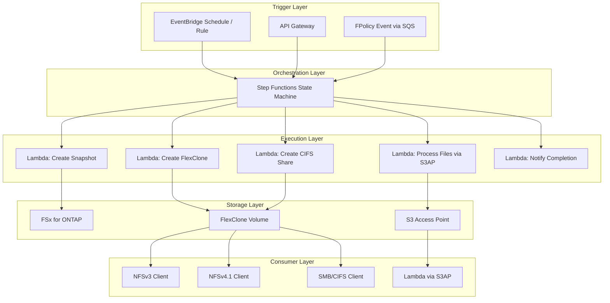
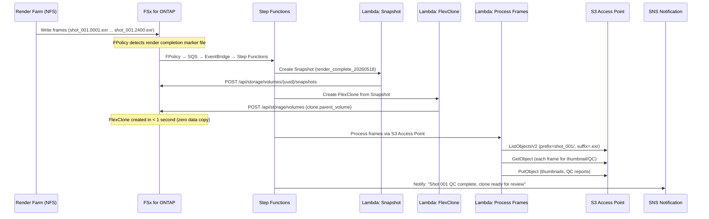
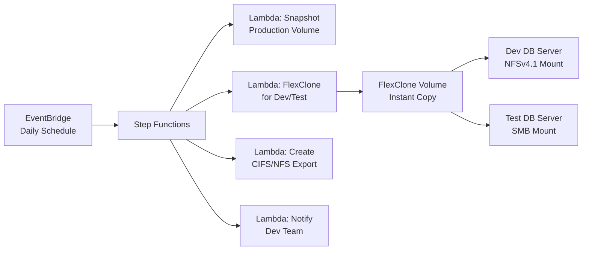
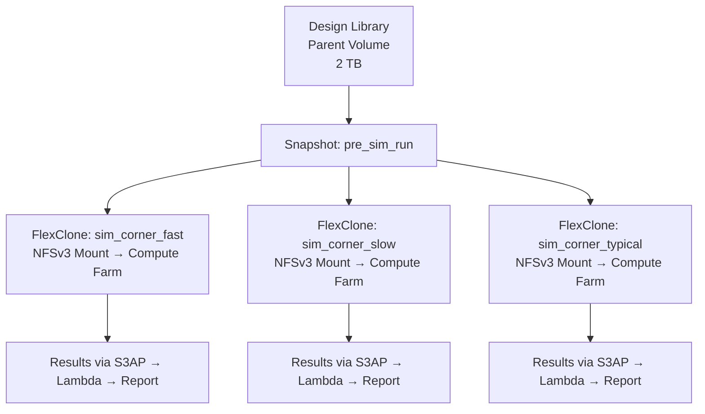
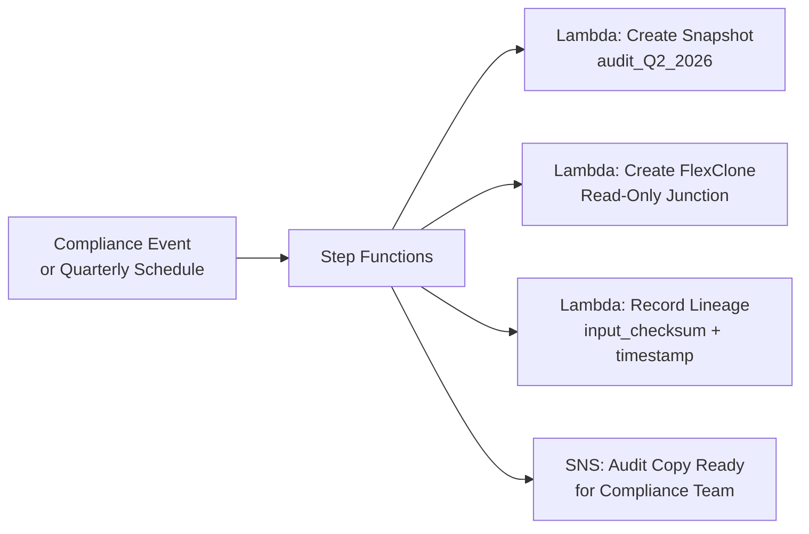

# FlexClone Serverless Patterns — Industry Use Cases

## Overview

FSx for ONTAP の FlexClone は、データコピーなしで瞬時に書き込み可能なボリュームコピーを作成する。
AWS マネージドサービスと組み合わせることで、サーバーレスな自動化パターンを実現できる。

本ドキュメントでは、FlexClone の作成からマルチプロトコルマウント、
そしてサーバーレスファイル処理までの統合パターンを業界別に整理する。

## Architecture: Serverless FlexClone Automation



## Pattern 1: Media/VFX — 連番ファイル処理パイプライン

### ユースケース

映画・アニメーション・VFX 制作では、レンダリング出力として大量の連番ファイル（EXR, PNG, TIFF）が
NFS 共有に書き込まれる。1 ショットで数千〜数万フレーム（例: `shot_001.0001.exr` 〜 `shot_001.2400.exr`）。

**課題**:
- レンダリング中のボリュームに対してポストプロセス（QC、サムネイル生成、メタデータ抽出）を
  実行すると I/O 競合が発生する
- 複数のアーティスト/部門が同じショットデータを参照しつつ独立した作業を行いたい
- レンダリング完了後のコンフォーム・カラーグレーディング用に特定フレーム時点のスナップショットが必要

**FlexClone + サーバーレスの解決策**:



### CloudFormation テンプレート構成

```yaml
# shared/cfn/flexclone-media-pipeline.yaml
AWSTemplateFormatVersion: "2010-09-09"
Transform: AWS::Serverless-2016-10-31

Parameters:
  ProjectPrefix:
    Type: String
    Default: "fsxn-s3ap"
  EnableFlexCloneMediaPipeline:
    Type: String
    Default: "false"
    AllowedValues: ["true", "false"]
  OntapMgmtIp:
    Type: String
    Description: ONTAP SVM 管理 IP
  OntapCredentialsSecret:
    Type: String
    Description: Secrets Manager シークレット名
  SvmUuid:
    Type: String
    Description: SVM UUID
  ParentVolumeUuid:
    Type: String
    Description: クローン元ボリューム UUID
  S3AccessPointAlias:
    Type: String
    Description: S3 AP エイリアス
  NotificationTopicArn:
    Type: String
    Description: 完了通知 SNS Topic ARN
  VpcId:
    Type: String
    Description: ONTAP REST API アクセス用 VPC ID
  SubnetIds:
    Type: CommaDelimitedList
    Description: Private Subnet IDs
  SecurityGroupId:
    Type: String
    Description: Security Group ID
```

### Step Functions ステートマシン定義

```json
{
  "Comment": "FlexClone Media Pipeline — Snapshot → Clone → Process → Notify",
  "StartAt": "CreateSnapshot",
  "States": {
    "CreateSnapshot": {
      "Type": "Task",
      "Resource": "${CreateSnapshotFunctionArn}",
      "Parameters": {
        "volume_uuid.$": "$.volume_uuid",
        "snapshot_name.$": "$.snapshot_name"
      },
      "Next": "CreateFlexClone"
    },
    "CreateFlexClone": {
      "Type": "Task",
      "Resource": "${CreateFlexCloneFunctionArn}",
      "Parameters": {
        "parent_volume_uuid.$": "$.volume_uuid",
        "snapshot_name.$": "$.snapshot_name",
        "clone_name.$": "$.clone_name",
        "junction_path.$": "$.junction_path"
      },
      "Next": "WaitForCloneOnline"
    },
    "WaitForCloneOnline": {
      "Type": "Wait",
      "Seconds": 5,
      "Next": "ProcessFrames"
    },
    "ProcessFrames": {
      "Type": "Task",
      "Resource": "${ProcessFramesFunctionArn}",
      "Parameters": {
        "s3ap_alias.$": "$.s3ap_alias",
        "prefix.$": "$.frame_prefix",
        "output_prefix.$": "$.output_prefix"
      },
      "Next": "NotifyCompletion"
    },
    "NotifyCompletion": {
      "Type": "Task",
      "Resource": "arn:aws:states:::sns:publish",
      "Parameters": {
        "TopicArn.$": "$.notification_topic",
        "Message.$": "States.Format('FlexClone {} ready. {} frames processed.', $.clone_name, $.frame_count)"
      },
      "End": true
    }
  }
}
```

### Lambda: FlexClone 作成（VPC 内実行）

```python
"""Lambda: Create FlexClone volume via ONTAP REST API.

VPC 内で実行（ONTAP 管理 LIF へのアクセスに必要）。
"""
import json
import os
import urllib3
import boto3

http = urllib3.PoolManager(cert_reqs="CERT_NONE")

def get_ontap_credentials():
    """Secrets Manager から ONTAP 認証情報を取得。"""
    client = boto3.client("secretsmanager")
    secret = client.get_secret_value(SecretId=os.environ["ONTAP_CREDENTIALS_SECRET"])
    return json.loads(secret["SecretString"])

def handler(event, context):
    creds = get_ontap_credentials()
    mgmt_ip = os.environ["ONTAP_MGMT_IP"]
    headers = urllib3.make_headers(basic_auth=f"{creds['username']}:{creds['password']}")
    headers["Content-Type"] = "application/json"

    # Create FlexClone
    body = {
        "name": event["clone_name"],
        "svm": {"uuid": os.environ["SVM_UUID"]},
        "clone": {
            "parent_volume": {"uuid": event["parent_volume_uuid"]},
            "parent_snapshot": {"name": event["snapshot_name"]},
            "is_flexclone": True,
        },
        "nas": {
            "path": event["junction_path"],
            "security_style": event.get("security_style", "unix"),
        },
    }

    resp = http.request(
        "POST",
        f"https://{mgmt_ip}/api/storage/volumes",
        body=json.dumps(body).encode(),
        headers=headers,
    )

    result = json.loads(resp.data.decode())
    if resp.status >= 400:
        raise Exception(f"FlexClone creation failed: {result}")

    return {
        "clone_name": event["clone_name"],
        "clone_uuid": result.get("uuid", ""),
        "junction_path": event["junction_path"],
        "status": "created",
    }
```

### Lambda: 連番フレーム処理（VPC 外実行 — S3AP 経由）

```python
"""Lambda: Process sequential frames via S3 Access Point.

VPC 外で実行（Internet-origin S3AP へのアクセスに必要）。
S3 API 経由で EXR/PNG フレームを読み取り、サムネイル生成・QC レポート作成。
"""
import os
import boto3
from PIL import Image
from io import BytesIO

s3 = boto3.client("s3")

def handler(event, context):
    s3ap_alias = event["s3ap_alias"]
    prefix = event["prefix"]  # e.g., "shots/shot_001/"
    output_prefix = event["output_prefix"]  # e.g., "shots/shot_001/thumbnails/"

    # List all frames in the shot directory
    paginator = s3.get_paginator("list_objects_v2")
    frames = []
    for page in paginator.paginate(Bucket=s3ap_alias, Prefix=prefix):
        for obj in page.get("Contents", []):
            if obj["Key"].endswith((".exr", ".png", ".tiff", ".jpg")):
                frames.append(obj["Key"])

    # Process each frame (generate thumbnail)
    processed = 0
    for frame_key in frames:
        try:
            response = s3.get_object(Bucket=s3ap_alias, Key=frame_key)
            img = Image.open(BytesIO(response["Body"].read()))
            img.thumbnail((256, 256))

            thumb_buffer = BytesIO()
            img.save(thumb_buffer, format="JPEG", quality=80)
            thumb_buffer.seek(0)

            thumb_key = f"{output_prefix}{os.path.basename(frame_key)}.thumb.jpg"
            s3.put_object(Bucket=s3ap_alias, Key=thumb_key, Body=thumb_buffer.read())
            processed += 1
        except Exception as e:
            print(f"Error processing {frame_key}: {e}")

    return {
        "frame_count": len(frames),
        "processed": processed,
        "prefix": prefix,
        "output_prefix": output_prefix,
    }
```

## Pattern 2: DevOps/Database — サーバーレス環境リフレッシュ

### ユースケース

開発・テスト環境のデータベースを本番データから定期的にリフレッシュする。
従来は数時間かかるデータコピーが、FlexClone で秒単位に短縮される。

**対象ワークロード**: Oracle, SAP HANA, PostgreSQL, MySQL



### EventBridge スケジュール（日次リフレッシュ）

```yaml
  DailyRefreshSchedule:
    Type: AWS::Scheduler::Schedule
    Properties:
      Name: !Sub "${ProjectPrefix}-daily-db-refresh"
      ScheduleExpression: "cron(0 2 * * ? *)"  # 毎日 AM 2:00
      FlexibleTimeWindow:
        Mode: "OFF"
      Target:
        Arn: !GetAtt FlexCloneStateMachine.Arn
        RoleArn: !GetAtt SchedulerRole.Arn
        Input: !Sub |
          {
            "volume_uuid": "${ParentVolumeUuid}",
            "snapshot_name": "daily_refresh",
            "clone_name": "dev_db_${!timestamp}",
            "junction_path": "/dev_db_latest",
            "security_style": "ntfs",
            "create_cifs_share": true,
            "notification_topic": "${NotificationTopicArn}"
          }
```

## Pattern 3: EDA/半導体 — 並列シミュレーション分岐

### ユースケース

半導体設計では、同一デザインライブラリに対して複数のシミュレーション条件を並列実行する。
FlexClone により、数 TB のライブラリを各シミュレーションジョブに瞬時に提供。



**AWS Guidance 参考**: [Scaling Electronic Design Automation on AWS](https://aws.amazon.com/solutions/guidance/scaling-electronic-design-automation-on-aws/) — Lambda による FlexCache/FlexClone 自動化パターン。

## Pattern 4: Healthcare/Genomics — 研究データセット分岐

### ユースケース

ゲノミクス研究では、大規模リファレンスデータセット（数百 GB）を各研究者に提供する。
FlexClone により、各研究者が独立した書き込み可能コピーを持ちつつ、
共通データは物理的に 1 コピーのみ保持。

```yaml
# Step Functions input for research dataset branching
{
  "volume_uuid": "parent-genomics-reference-uuid",
  "snapshot_name": "reference_v3.2",
  "researchers": [
    {"name": "researcher_a", "clone_name": "genomics_study_a", "protocol": "nfsv4"},
    {"name": "researcher_b", "clone_name": "genomics_study_b", "protocol": "nfsv4"},
    {"name": "researcher_c", "clone_name": "genomics_study_c", "protocol": "smb"}
  ]
}
```

Step Functions の Map ステートで並列 FlexClone 作成:

```json
{
  "Type": "Map",
  "ItemsPath": "$.researchers",
  "Iterator": {
    "StartAt": "CreateResearcherClone",
    "States": {
      "CreateResearcherClone": {
        "Type": "Task",
        "Resource": "${CreateFlexCloneFunctionArn}",
        "End": true
      }
    }
  }
}
```

## Pattern 5: Financial Services — 監査用ポイントインタイムコピー

### ユースケース

規制要件により、特定時点のデータ状態を改ざん不可能な形で保存する必要がある。
FlexClone + SnapLock で、監査用の WORM コピーを瞬時に作成。



## Multi-Protocol Mount Patterns

### NFSv3 マウント（Linux — レンダーファーム、HPC）

```bash
# 高スループット設定（メディア/EDA 向け）
sudo mount -t nfs -o vers=3,hard,timeo=600,retrans=2,rsize=1048576,wsize=1048576,nconnect=16 \
    ${NFS_SERVER}:${JUNCTION_PATH} /mnt/flexclone/nfsv3

# /etc/fstab エントリ（永続マウント）
# ${NFS_SERVER}:${JUNCTION_PATH} /mnt/flexclone/nfsv3 nfs vers=3,hard,nconnect=16,rsize=1048576,wsize=1048576 0 0
```

### NFSv4.1 マウント（Linux — セキュリティ重視）

```bash
# Kerberos 認証対応（金融/医療向け）
sudo mount -t nfs -o vers=4.1,hard,timeo=600,retrans=2,sec=krb5p \
    ${NFS_SERVER}:${JUNCTION_PATH} /mnt/flexclone/nfsv4

# 標準設定
sudo mount -t nfs -o vers=4.1,hard,timeo=600,retrans=2 \
    ${NFS_SERVER}:${JUNCTION_PATH} /mnt/flexclone/nfsv4
```

### SMB/CIFS マウント（Linux — マルチプロトコル環境）

```bash
# AD 参加済み環境
sudo mount -t cifs //${SMB_SERVER}/${SHARE_NAME} /mnt/flexclone/smb \
    -o sec=ntlmsspi,credentials=/etc/smb_credentials,vers=3.0,rsize=130048,wsize=130048

# 認証情報ファイル (/etc/smb_credentials)
# username=svc_render
# password=<password>
# domain=STUDIO.LOCAL
```

### SMB マウント（Windows — net use / PowerShell）

```powershell
# Command Prompt
net use Z: \\svm1.studio.local\render_output /user:STUDIO\svc_render /persistent:yes

# PowerShell
$cred = New-Object System.Management.Automation.PSCredential("STUDIO\svc_render", (ConvertTo-SecureString "password" -AsPlainText -Force))
New-PSDrive -Name Z -PSProvider FileSystem -Root "\\svm1.studio.local\render_output" -Credential $cred -Persist
```

### S3 API アクセス（Lambda — サーバーレス処理）

```python
# Lambda から S3 Access Point 経由でアクセス（VPC 外実行）
import boto3
s3 = boto3.client("s3")

# FlexClone ボリュームのファイルを S3 API で読み取り
response = s3.list_objects_v2(
    Bucket="fsxn-clone-s3ap-xxx-ext-s3alias",
    Prefix="shots/shot_001/",
    MaxKeys=1000,
)
for obj in response.get("Contents", []):
    print(f"Frame: {obj['Key']} Size: {obj['Size']}")
```

## Industry Use Case Summary

| 業界 | ワークロード | FlexClone の価値 | プロトコル | サーバーレス統合 |
|------|-------------|-----------------|-----------|----------------|
| メディア/VFX | レンダリング連番ファイル (EXR, PNG) | レンダリング中の I/O 競合回避、QC 用即時コピー | NFSv3 (高スループット) | Lambda + S3AP でサムネイル/QC 自動生成 |
| アニメーション | ショットデータ分岐 | アーティスト別の独立作業環境を秒単位で提供 | NFSv3/NFSv4.1 | Step Functions で並列クローン作成 |
| DevOps/DB | 本番 DB リフレッシュ | 数 TB の DB を秒単位でクローン、開発環境に提供 | NFSv4.1 / SMB | EventBridge 日次スケジュール + Step Functions |
| EDA/半導体 | デザインライブラリ並列シミュレーション | 各シミュレーション条件に独立コピーを瞬時提供 | NFSv3 (nconnect=16) | Lambda で FlexCache/FlexClone 自動化 |
| 医療/ゲノミクス | リファレンスデータセット分岐 | 研究者ごとの書き込み可能コピー | NFSv4.1 (sec=krb5p) | Step Functions Map ステートで並列作成 |
| 金融/コンプライアンス | 監査用ポイントインタイムコピー | 規制要件の WORM コピーを瞬時作成 | SMB (NTFS ACL) | Lambda + Lineage 記録 |
| 製造/CAE | CAD/シミュレーションデータ | エンジニアチーム別の独立環境 | NFSv3 / SMB | EventBridge + Step Functions |
| VDI | ゴールデンイメージ | デスクトップ即時プロビジョニング | SMB (NTFS) | API Gateway → Step Functions |

## References

- [AWS Blog: Accelerate development refresh cycles with FSx for ONTAP cloning](https://aws.amazon.com/blogs/storage/accelerate-development-refresh-cycles-and-optimize-cost-with-amazon-fsx-for-netapp-ontap-cloning/)
- [AWS Docs: Process files serverlessly using Lambda](https://docs.aws.amazon.com/fsx/latest/ONTAPGuide/tutorial-process-files-with-lambda.html)
- [AWS Guidance: Scaling EDA on AWS](https://aws.amazon.com/solutions/guidance/scaling-electronic-design-automation-on-aws/)
- [AWS Blog: Run containerized applications with FSx for ONTAP and EKS](https://aws.amazon.com/blogs/storage/run-containerized-applications-efficiently-using-amazon-fsx-for-netapp-ontap-and-amazon-eks/)
- [NetApp: FlexClone for infrastructure operations](https://www.netapp.com/customers/it-use-cases/flexcone/)
- [NetApp Docs: Create a FlexClone volume](https://docs.netapp.com/us-en/ontap/volumes/create-flexclone-task.html)
- [AWS Docs: Mounting volumes on Windows clients](https://docs.aws.amazon.com/fsx/latest/ONTAPGuide/attach-windows-client.html)
- [AWS rePost: Mount FSx for ONTAP CIFS share on Linux EC2](https://repost.aws/knowledge-center/ec2-mount-fsx-ontap-cifs)
