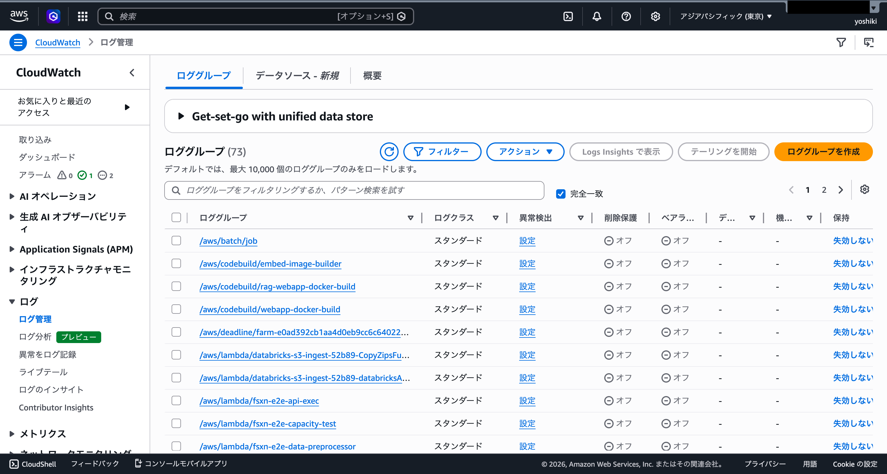

# 運用手順書

本ドキュメントでは、FSx for ONTAP S3 AP Serverless Patterns の日常運用手順を説明します。

## 目次

1. [スケジュール変更](#1-スケジュール変更)
2. [手動実行](#2-手動実行)
3. [ログ確認](#3-ログ確認)
4. [アラーム対応](#4-アラーム対応)
5. [メンテナンス作業](#5-メンテナンス作業)

---

## 1. スケジュール変更

EventBridge Scheduler の実行スケジュールを変更する手順です。

### CloudFormation パラメータによる変更（推奨）

```bash
# スケジュールを変更してスタックを更新
aws cloudformation update-stack \
  --stack-name fsxn-legal-compliance \
  --use-previous-template \
  --parameter-overrides \
    ScheduleExpression="rate(6 hours)" \
  --capabilities CAPABILITY_IAM CAPABILITY_AUTO_EXPAND \
  --region ap-northeast-1
```

### スケジュール式の例

| 式 | 説明 |
|---|------|
| `rate(1 hour)` | 1 時間ごと |
| `rate(6 hours)` | 6 時間ごと |
| `rate(1 day)` | 1 日ごと |
| `cron(0 9 * * ? *)` | 毎日 9:00 UTC (18:00 JST) |
| `cron(0 0 ? * MON *)` | 毎週月曜 0:00 UTC (9:00 JST) |

> **参考**: EventBridge Scheduler 設定画面のスクリーンショットは [do../screenshots/masked/eventbridge-scheduler.png](../screenshots/eventbridge-scheduler.png) を参照してください。

### スケジュールの一時停止

ワークフローの実行を一時的に停止する場合:

```bash
# EventBridge Scheduler ルールの無効化
aws scheduler update-schedule \
  --name <your-schedule-name> \
  --state DISABLED \
  --region ap-northeast-1 \
  --schedule-expression "rate(1 hour)" \
  --flexible-time-window '{"Mode":"OFF"}' \
  --target '{"Arn":"<your-state-machine-arn>","RoleArn":"<your-scheduler-role-arn>"}'
```

---

## 2. 手動実行

スケジュール外でワークフローを手動実行する手順です。

### AWS CLI による手動実行

```bash
# ステートマシン ARN の取得
STATE_MACHINE_ARN=$(aws cloudformation describe-stacks \
  --stack-name fsxn-legal-compliance \
  --query "Stacks[0].Outputs[?OutputKey=='StateMachineArn'].OutputValue" \
  --output text \
  --region ap-northeast-1)

# デフォルト入力で実行
aws stepfunctions start-execution \
  --state-machine-arn "$STATE_MACHINE_ARN" \
  --region ap-northeast-1

# カスタム入力で実行（特定のプレフィックスのみ処理）
aws stepfunctions start-execution \
  --state-machine-arn "$STATE_MACHINE_ARN" \
  --input '{"prefix_filter": "data/2026/01/"}' \
  --region ap-northeast-1
```

### 実行状態の監視

```bash
# 実行 ARN を取得
EXECUTION_ARN=$(aws stepfunctions list-executions \
  --state-machine-arn "$STATE_MACHINE_ARN" \
  --max-results 1 \
  --query "executions[0].executionArn" \
  --output text \
  --region ap-northeast-1)

# 実行状態の確認
aws stepfunctions describe-execution \
  --execution-arn "$EXECUTION_ARN" \
  --query "{Status:status,StartDate:startDate,StopDate:stopDate}" \
  --region ap-northeast-1
```

> **参考**: Step Functions ワークフロー実行画面のスクリーンショットは [do../screenshots/masked/step-functions-workflow.png](../screenshots/step-functions-workflow.png) を参照してください。

---

## 3. ログ確認

Lambda 関数と Step Functions のログを確認する手順です。

### Lambda 関数のログ確認

```bash
# ロググループ一覧の確認
aws logs describe-log-groups \
  --log-group-name-prefix "/aws/lambda/fsxn-legal" \
  --region ap-northeast-1

# 最新のログストリームを確認
LOG_GROUP="/aws/lambda/<your-lambda-function-name>"
aws logs describe-log-streams \
  --log-group-name "$LOG_GROUP" \
  --order-by LastEventTime \
  --descending \
  --max-items 5 \
  --region ap-northeast-1

# ログイベントの取得
aws logs get-log-events \
  --log-group-name "$LOG_GROUP" \
  --log-stream-name "<your-log-stream-name>" \
  --limit 50 \
  --region ap-northeast-1
```

### エラーログの検索

```bash
# ERROR レベルのログを検索
aws logs filter-log-events \
  --log-group-name "$LOG_GROUP" \
  --filter-pattern "ERROR" \
  --start-time $(date -d '1 hour ago' +%s000) \
  --region ap-northeast-1

# 特定のリクエスト ID でログを検索
aws logs filter-log-events \
  --log-group-name "$LOG_GROUP" \
  --filter-pattern "<your-request-id>" \
  --region ap-northeast-1
```

> **参考**: CloudWatch ログのスクリーンショットは以下を参照してください。



### Step Functions 実行履歴の確認

```bash
# 実行履歴イベントの取得
aws stepfunctions get-execution-history \
  --execution-arn "$EXECUTION_ARN" \
  --max-results 20 \
  --region ap-northeast-1
```

---

## 4. アラーム対応

CloudWatch Alarms が発報した場合の対応手順です。

> **注意**: CloudWatch Alarms は `EnableCloudWatchAlarms=true` でデプロイした場合のみ有効です。

### アラーム一覧の確認

```bash
aws cloudwatch describe-alarms \
  --alarm-name-prefix "fsxn-legal" \
  --region ap-northeast-1
```

### アラーム種別と対応

#### Step Functions 実行失敗アラーム

**原因の特定**:

```bash
# 失敗した実行の一覧
aws stepfunctions list-executions \
  --state-machine-arn "$STATE_MACHINE_ARN" \
  --status-filter FAILED \
  --max-results 5 \
  --region ap-northeast-1
```

**よくある原因と対応**:

| 原因 | 対応 |
|------|------|
| Lambda タイムアウト | Lambda のタイムアウト値を増加 |
| IAM 権限不足 | IAM ロールにポリシーを追加 |
| S3 AP AccessDenied | S3 AP ポリシーと IAM ロールを確認 |
| ONTAP API 接続失敗 | VPC Endpoint と Secrets Manager を確認 |

#### Lambda エラー率アラーム

**原因の特定**:

```bash
# Lambda 関数のエラーメトリクスを確認
aws cloudwatch get-metric-statistics \
  --namespace AWS/Lambda \
  --metric-name Errors \
  --dimensions Name=FunctionName,Value=<your-lambda-function-name> \
  --start-time $(date -u -d '1 hour ago' +%Y-%m-%dT%H:%M:%S) \
  --end-time $(date -u +%Y-%m-%dT%H:%M:%S) \
  --period 300 \
  --statistics Sum \
  --region ap-northeast-1
```

---

## 5. メンテナンス作業

### S3 出力バケットのクリーンアップ

古い出力データを定期的にクリーンアップする場合:

```bash
# 30 日以上前のデータを確認
aws s3 ls "s3://$OUTPUT_BUCKET/" --recursive \
  --region ap-northeast-1 | \
  awk '$1 < "'$(date -d '30 days ago' +%Y-%m-%d)'"'

# S3 ライフサイクルルールの設定（推奨）
aws s3api put-bucket-lifecycle-configuration \
  --bucket "$OUTPUT_BUCKET" \
  --lifecycle-configuration '{
    "Rules": [{
      "ID": "cleanup-old-data",
      "Status": "Enabled",
      "Filter": {"Prefix": ""},
      "Expiration": {"Days": 90}
    }]
  }' \
  --region ap-northeast-1
```

### CloudWatch Logs の保持期間設定

```bash
# ログ保持期間を 30 日に設定
aws logs put-retention-policy \
  --log-group-name "/aws/lambda/<your-lambda-function-name>" \
  --retention-in-days 30 \
  --region ap-northeast-1
```

### スタックの更新

共通モジュールや Lambda 関数コードを更新した場合:

```bash
# テンプレートの変更差分を確認
aws cloudformation get-template \
  --stack-name fsxn-legal-compliance \
  --region ap-northeast-1 > current-template.yaml

# スタックの更新
aws cloudformation deploy \
  --template-file legal-compliance/template.yaml \
  --stack-name fsxn-legal-compliance \
  --capabilities CAPABILITY_IAM CAPABILITY_AUTO_EXPAND \
  --region ap-northeast-1
```
