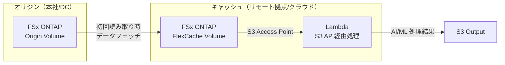
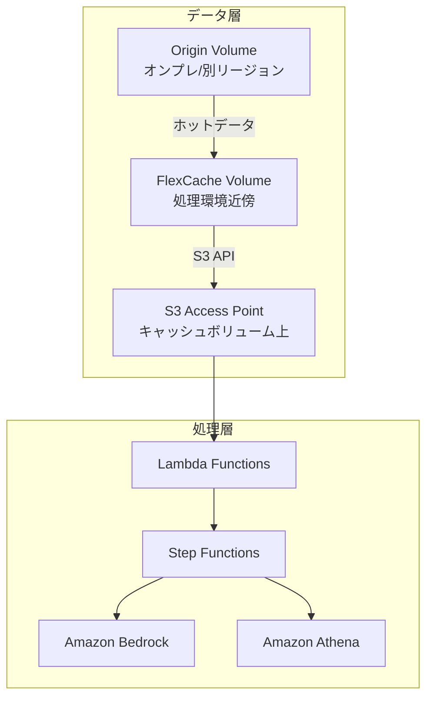

# 業界・ワークロード マッピング — FlexCache × S3 Access Points × Serverless

## 概要

本ドキュメントは、FSx for ONTAP の FlexCache、S3 Access Points、AWS Serverless サービスの組み合わせによる業界別ワークロードパターンを整理する。

## マッピング表

| 業界 | ワークロード | FlexCache 役割 | S3 AP 役割 | Serverless 処理 | 対応 UC |
|------|-------------|---------------|-----------|----------------|---------|
| 通信 | CDR/ネットワークログ分析・異常検知 | CDR/ログファイルの拠点間キャッシュ | CDR・syslog データの S3 API 読み取り | Lambda + Athena + Bedrock | UC18 |
| 広告・マーケティング | クリエイティブアセット管理・ブランドコンプライアンス | クリエイティブアセットの拠点間キャッシュ | 画像/動画メタデータの読み取り | Lambda + Rekognition + Textract + Bedrock | UC19 |
| 旅行・ホスピタリティ | 予約文書処理・施設点検画像分析 | 施設写真・予約文書の拠点間キャッシュ | 予約文書・点検画像の S3 API 読み取り | Lambda + Textract + Comprehend + Rekognition + Bedrock | UC20 |
| 農業・食品 | 農地航空画像・トレーサビリティ文書管理 | 農地画像・出荷記録の拠点間キャッシュ | GeoTIFF/JPEG・トレーサビリティ文書の S3 API 読み取り | Lambda + Rekognition + Textract + Comprehend + Bedrock | UC21 |
| 運輸・鉄道 | 設備点検画像・保守レポート分析 | 点検画像・保守報告書の拠点間キャッシュ | 点検画像・保守報告書の S3 API 読み取り | Lambda + Rekognition + Textract + Comprehend + Bedrock | UC22 |
| サステナビリティ・ESG | ESG メトリクス抽出・レポーティング | ESG レポート・環境データの拠点間キャッシュ | サステナビリティレポート・エネルギー記録の S3 API 読み取り | Lambda + Textract + Bedrock | UC23 |
| NPO・非営利団体 | 助成金申請分類・成果マッチング | 助成金申請書・活動報告書の拠点間キャッシュ | 申請書・報告書の S3 API 読み取り | Lambda + Textract + Comprehend + Bedrock | UC24 |
| 電力・ユーティリティ | ドローン画像・SCADA ログ分析 | 点検画像・SCADA データの拠点間キャッシュ | ドローン画像・SCADA ログの S3 API 読み取り | Lambda + Rekognition + Athena + Bedrock | UC25 |
| 不動産 | 物件画像分析・契約書データ抽出 | 物件画像・契約書の拠点間キャッシュ | 物件画像・契約書の S3 API 読み取り | Lambda + Rekognition + Textract + Comprehend + Bedrock | UC26 |
| 人材・HR | 履歴書スクリーニング・候補者評価 | 応募書類・人事文書の拠点間キャッシュ | 履歴書・職務経歴書の S3 API 読み取り | Lambda + Textract + Comprehend + Bedrock | UC27 |
| 化学・素材 | SDS 管理・ラボノート分析 | SDS・実験ノートの拠点間キャッシュ | SDS (PDF/XML)・ラボノート画像の S3 API 読み取り | Lambda + Textract + Rekognition + Bedrock | UC28 |
| 半導体 / EDA | GDS/OASIS バリデーション、DRC 集計 | Tools/Libraries/PDK の読み取りキャッシュ、クラウドバースト | ログ・結果・レポートの S3 API 読み取り | Lambda + Athena + Bedrock | UC6, UC18 |
| メディア / VFX | レンダリングパイプライン | render input assets のジョブ単位キャッシュ | フレーム・ログ・メタデータの読み取り | Lambda + Rekognition + Deadline Cloud | UC4, UC19 |
| 自動車 / CAE | シミュレーション解析 | mesh/input deck の拠点間キャッシュ | solver output の分析 | Lambda + Athena + Glue + QuickSight | UC20 |
| 金融 / 保険 | 契約書・請求書 IDP | 支店間の文書キャッシュ | OCR/NLP 処理用データ読み取り | Lambda + Textract + Comprehend + Bedrock | UC2, UC14 |
| 医療 / DICOM | 画像分類・匿名化 | 研究拠点間の DICOM キャッシュ | 画像データの S3 API 読み取り | Lambda + Rekognition + Comprehend Medical | UC5 |
| ゲノミクス / ライフサイエンス | FASTQ/VCF 解析 | シーケンスデータの研究拠点間共有 | 解析結果の読み取り | Lambda + Athena + Bedrock | UC7, UC21 |
| エネルギー / 地震探査 | SEG-Y メタデータ抽出 | 遠隔地解析データのキャッシュ | メタデータ分析 | Lambda + Athena + Bedrock | UC8 |
| 製造業 | IoT センサーログ・品質検査 | 工場間データ共有 | ログ・画像の分析 | Lambda + Athena + Rekognition | UC3 |
| 法務 / コンプライアンス | ファイルサーバー監査 | 監査対象ファイルのキャッシュ | 監査データ読み取り | Lambda + Athena + Bedrock | UC1 |
| GenAI / RAG | エンタープライズファイル RAG | AI 処理環境近傍へのデータ配置 | 権限付きファイル読み取り | Lambda + Bedrock + OpenSearch | UC22 |
| ゲーム / ビルドパイプライン | アセット共有・ビルド | グローバルスタジオ間アセットキャッシュ | ログ分析・品質チェック | Lambda + Step Functions + Bedrock | UC23 |
| 建設 / BIM | 図面管理・安全コンプライアンス | 現場間 BIM データ共有 | 図面 OCR・分析 | Lambda + Textract + Bedrock | UC10 |
| 防衛 / 宇宙 | 衛星画像解析 | 解析拠点間データ共有 | 画像データ読み取り | Lambda + Rekognition + SageMaker | UC15 |

## FlexCache の価値提案

### 1. 読み取り性能の改善



### 2. WAN トラフィック削減

| シナリオ | FlexCache なし | FlexCache あり | 削減率 |
|---------|--------------|---------------|--------|
| EDA Tools 読み取り (100GB/日) | 100GB WAN 転送 | 初回 100GB → 以降 ~5GB (差分) | 95% |
| Render Assets (500GB/ジョブ) | 500GB/ジョブ | 初回 500GB → 以降 ~50GB | 90% |
| CAE Mesh (50GB/シミュレーション) | 50GB/回 | 初回 50GB → 以降 ~10GB | 80% |

### 3. ジョブ完了時間の短縮

| ワークロード | Origin 直接読み取り | FlexCache 経由 | 改善率 |
|-------------|-------------------|---------------|--------|
| EDA regression (1000 jobs) | 8 時間 | 3 時間 | 62% |
| VFX render (4K, 1000 frames) | 12 時間 | 5 時間 | 58% |
| CAE solver (large mesh) | 4 時間 | 2 時間 | 50% |

## S3 Access Points の価値提案

### FlexCache + S3 AP の組み合わせ



**重要な制約**: FlexCache ボリュームに対する S3 Access Point の利用可否は ONTAP バージョンおよび FSx for ONTAP のサービス仕様に依存する。PoC 時に必ず検証すること。

## 業界別 FlexCache 構成パターン

### Pattern A: Static FlexCache + S3 AP Serverless Analytics

**適用業界**: 半導体 EDA、製造業、法務
**特徴**: 常時稼働の FlexCache で読み取り性能を改善し、S3 AP 経由でサーバーレス分析

```
[Origin] ──── FlexCache (常時) ──── S3 AP ──── Lambda/Step Functions
```

### Pattern B: Dynamic FlexCache per Job

**適用業界**: メディア VFX、EDA クラウドバースト、CAE
**特徴**: ジョブ開始時に FlexCache を作成、完了後に削除

```
Job Request → Create FlexCache → Prepopulate → Run Job → Cleanup
```

### Pattern C: FlexCache DR Read Locality

**適用業界**: 金融、医療、政府
**特徴**: DR 時にキャッシュ経由で読み取り継続性を確保

```
[Primary Origin] ──── FlexCache (Secondary) ──── S3 AP ──── Lambda
       ↓ (障害時)
[Secondary Origin (SnapMirror)] ──── FlexCache re-peer
```

### Pattern D: Multi-Region Cloud Burst

**適用業界**: 半導体 EDA、メディア VFX
**特徴**: オンプレ Origin + 複数リージョンの FSx FlexCache

```
[On-prem ONTAP Origin]
    ├── FSx ONTAP (ap-northeast-1) FlexCache → S3 AP → Lambda
    ├── FSx ONTAP (us-west-2) FlexCache → S3 AP → Lambda
    └── FSx ONTAP (eu-west-1) FlexCache → S3 AP → Lambda
```

### Pattern E: GenAI/RAG over Cached Enterprise Files

**適用業界**: 全業界（特に金融、法務、医療）
**特徴**: 機密ファイルを S3 にコピーせず、FlexCache + S3 AP 経由で Bedrock/RAG 処理

```
[Enterprise Files (Origin)] → FlexCache → S3 AP → Bedrock Knowledge Base
```

### Pattern F: Manufacturing Simulation / CAE

**適用業界**: 自動車、航空宇宙、製造業
**特徴**: シミュレーション入力データの拠点間共有

```
[Design Center (Origin)] → FlexCache (Test Center) → S3 AP → Athena/Glue
```

### Pattern G: Gaming Build Pipeline

**適用業界**: ゲーム開発
**特徴**: グローバルスタジオ間のアセット共有とビルドパイプライン

```
[Main Studio (Origin)] → FlexCache (Remote Studios) → S3 AP → Build/QA Lambda
```

## コスト最適化の観点

| パターン | コスト特性 | 最適化ポイント |
|---------|-----------|--------------|
| Static FlexCache | 常時ストレージコスト | キャッシュサイズを最小限に、TTL 調整 |
| Dynamic FlexCache | ジョブ時のみコスト | 確実な cleanup、orphan 検出 |
| Multi-Region | リージョン間転送コスト | 初回転送後はキャッシュヒット |
| GenAI/RAG | Bedrock API コスト | 必要ファイルのみ処理 |

## 次のステップ

- [FlexCache AnyCast / DR パターン](../flexcache-anycast-dr/README.md)
- [Dynamic FlexCache Render Workflow](../dynamic-flexcache-render-workflow/README.md)
- [サポートマトリックス](support-matrix-fsx-ontap-flexcache-s3ap.md)
- [FlexCache PoC チェックリスト](flexcache-poc-checklist.md)
