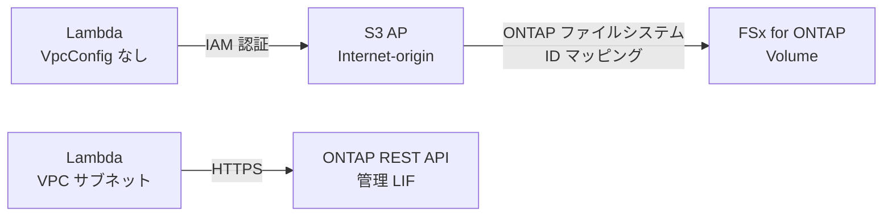
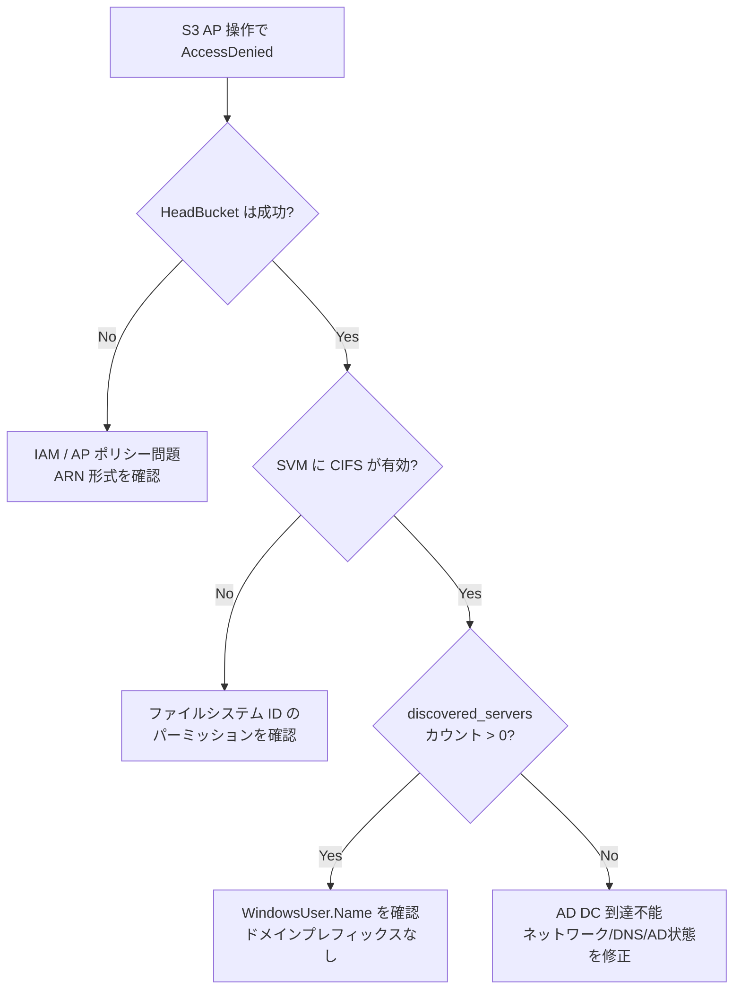

# AD参加SVM: S3 Access Point 前提条件

> AD参加SVM（CIFS有効）で FSx for ONTAP S3 Access Points を使用する際の前提条件と運用ガイダンス。

## エグゼクティブサマリ

AD参加SVM では、全ての S3 Access Point データ操作に Active Directory Domain Controller (AD DC) への接続が必須。AD DC に到達不能な場合、ListObjectsV2/GetObject/PutObject は `AccessDenied` で失敗する（HeadBucket は成功 = 偽陽性）。本ドキュメントでは前提条件、推奨アーキテクチャパターン、トラブルシューティング手順を説明する。

**本番環境で検証済みの知見** (2026年7月):
- HeadBucket は信頼できるヘルスチェックではない（S3層メタデータのみ）
- Internet-origin AP + VPC外Lambda がデータアクセスの推奨パターン
- 同一アカウントの S3 AP リソースポリシー (`put_access_point_policy`) は不要
- S3 AP データ操作の前に AD DC 到達性を検証すべき

> **出典**: `fsxn-observability-integrations` restore-verification ワークフローで検証。[AWS公式トラブルシューティングガイド](https://docs.aws.amazon.com/fsx/latest/ONTAPGuide/troubleshooting-access-points-for-fsxn.html)（「name service が到達不能」→ MISCONFIGURED または AccessDenied）と整合。

---

## 前提条件（本ドキュメントを読む前に）

| 必要なもの | 確認場所 |
|----------|---------|
| FSx for ONTAP ファイルシステム（デプロイ済み） | AWS Console → FSx → ONTAP |
| AD に参加した SVM | `scripts/demo-ad-join-svm.sh` または AWS Console |
| ONTAP 管理 IP | AWS Console → FSx → ファイルシステム → 管理 → 管理エンドポイント |
| Secrets Manager の ONTAP 管理者認証情報 | `fsxn/admin` シークレット（スタックデプロイ時に作成） |
| S3 AP 操作用の IAM 権限 | [同一アカウント AP リソースポリシー](#同一アカウント-ap-リソースポリシー)を参照 |

**用語**:
- **AD参加SVM**: CIFS/SMB プロトコルが有効化され、Active Directory ドメインに接続された Storage Virtual Machine
- **S3 AP**: S3 Access Point — FSx for ONTAP ボリュームへの S3 互換インターフェース
- **Internet-origin AP**: 有効な IAM 認証情報があればどこからでもアクセス可能な S3 AP（VPC バインディングなし）

---

## 目次

1. [クイックスタート検証](#クイックスタート検証)
2. [AD DC 到達性要件](#ad-dc-到達性要件)
3. [Internet-Origin AP + VPC外Lambda パターン](#internet-origin-ap--vpc外lambda-パターン)
4. [同一アカウント AP リソースポリシー](#同一アカウント-ap-リソースポリシー)
5. [Pre-Flight ヘルスチェック](#pre-flight-ヘルスチェック)
6. [モニタリングとアラート](#モニタリングとアラート)
7. [トラブルシューティング](#トラブルシューティング)
8. [FAQ](#faq)
9. [関連ドキュメント](#関連ドキュメント)

---

## クイックスタート検証

以下のコマンドで、AD参加SVM が S3 AP データ操作可能な状態か確認できる:

```bash
# 値を置き換えてください（管理IPはAWS Console → FSx → ファイルシステム → 管理で確認）
MGMT_IP="<your-ontap-mgmt-ip>"
SVM_NAME="<your-svm-name>"
CREDS="fsxadmin:<your-password>"

# AD DC 到達性チェック（discovered_servers のカウントが > 0 であれば正常）
curl -sku "$CREDS" \
  "https://$MGMT_IP/api/protocols/cifs/domains?svm.name=$SVM_NAME&fields=discovered_servers" \
  | jq '{dc_count: (.records[0].discovered_servers | length), servers: .records[0].discovered_servers}'
```

**正常時の結果**:
```json
{"dc_count": 2, "servers": [{"server_ip": "10.0.1.10", ...}, {"server_ip": "10.0.2.10", ...}]}
```

**異常時** (`dc_count: 0`): AD DC 到達不能 — S3 AP データ操作は AccessDenied で失敗する。[トラブルシューティング](#トラブルシューティング)を参照。

> **認証情報に関する補足**: `curl -sku` パターンはインタラクティブなデバッグ専用。本番 Lambda では必ず Secrets Manager 経由で認証情報を取得すること（`shared/ontap_client.py`）。

---

## AD DC 到達性要件

### AD DC が必要な理由

AD参加SVM（CIFS有効）では、ONTAP のマルチプロトコル ID パイプラインが全ての S3 AP データ操作で `unix→win` 逆引き name-mapping lookup を実行する。この lookup には SVM から AD DC への LDAP/Kerberos 接続が必要。

以下の状況**でも** AD DC 接続が必要:
- UNIX セキュリティスタイルのボリューム
- UNIX `FileSystemUserType` の S3 AP
- SMB 共有が構成されていないボリューム

唯一の条件は SVM で CIFS が**有効化**されていること。これは直感に反しており、AD参加SVM での `AccessDenied` トラブルシューティング時の最大の混乱要因。

### 診断マトリクス

| S3 操作 | AD DC 到達可能 | AD DC 到達不能 | レイヤー |
|---------|:---:|:---:|---------|
| HeadBucket | ✅ | ✅ (偽陽性) | S3 メタデータ |
| ListObjectsV2 | ✅ | ❌ AccessDenied | ファイルシステム |
| GetObject | ✅ | ❌ AccessDenied | ファイルシステム |
| PutObject | ✅ | ❌ AccessDenied | ファイルシステム |
| DeleteObject | ✅ | ❌ AccessDenied | ファイルシステム |
| HeadObject | ✅ | ❌ AccessDenied | ファイルシステム |
| CreateMultipartUpload | ✅ | ❌ AccessDenied | ファイルシステム |

> **セキュリティに関する補足**: HeadBucket は S3 メタデータ層（AP の存在と IAM）のみを検証する。ONTAP ファイルシステム層は通過しない。**HeadBucket を S3 AP データプレーン準備状態のヘルスチェックとして使用してはならない。**

### 必要なネットワーク接続（SVM ENI → AD DC）

FSx for ONTAP ENI（preferred/standby サブネット）から AD Domain Controller IP への**アウトバウンド**ルール:

| ポート | プロトコル | サービス | 必須 |
|--------|----------|---------|:----:|
| 53 | TCP/UDP | DNS | ✅ |
| 88 | TCP/UDP | Kerberos 認証 | ✅ |
| 389 | TCP/UDP | LDAP | ✅ |
| 445 | TCP | SMB/CIFS | ✅ |
| 464 | TCP/UDP | Kerberos パスワード変更 | ✅ |
| 636 | TCP | LDAPS（暗号化 LDAP） | 推奨 |
| 3268 | TCP | グローバルカタログ | マルチドメイン時 |
| 9389 | TCP | AD Web Services | オプション |
| 49152-65535 | TCP | RPC 動的ポート | ✅ |

#### セキュリティグループ例（CloudFormation）

```yaml
FsxToAdSecurityGroupRule:
  Type: AWS::EC2::SecurityGroupEgress
  Properties:
    GroupId: !Ref FsxSecurityGroup
    Description: Allow FSx for ONTAP SVM to reach AD DCs
    IpProtocol: "-1"  # デモ用: 本番では個別ポートルールに制限
    DestinationSecurityGroupId: !Ref AdControllerSecurityGroup
```

> **ネットワークに関する補足**: これらのルールは FSx ENI → AD DC 向け。S3 AP にアクセスする Lambda にはこれらのポートは不要 — Lambda は S3 API 層経由で通信し、AD に直接接続しない。

---

## Internet-Origin AP + VPC外Lambda パターン

### ネットワークパターン選択マトリクス

| パターン | 月額コスト | 複雑度 | 使用ケース |
|---------|:---:|:---:|-----------|
| **Internet-origin AP + VPC外Lambda** | $0 | 低 | 標準データアクセス（推奨） |
| Internet-origin AP + VPC Lambda + NAT GW | ~$32+/AZ | 中 | 同一 Lambda で ONTAP 管理 API も必要 |
| VPC-origin AP + VPC Lambda + Interface EP | ~$7.20/AZ | 高 | 厳格なコンプライアンス（Internet egress 禁止） |

### 推奨パターン: Internet-Origin AP + VPC外Lambda

S3 AP **データアクセス**（ListObjectsV2, GetObject, PutObject）を Lambda から行う場合:

- **Internet-origin AP** (`NetworkOrigin: Internet`, `VpcConfiguration` なし)
- **VPC外 Lambda** (Lambda に `VpcConfig` を設定しない)

### VPC-Origin を使わない理由

1. S3 **Gateway** VPC Endpoint は FSx for ONTAP S3 Access Points をサポート**しない**
2. S3 **Interface** VPC Endpoint はコスト増（各 AZ ~$7.20/月）と複雑化を伴う
3. VPC 内 Lambda から Internet-origin S3 AP にアクセスするには NAT Gateway が必要

### アーキテクチャ



### VPC 分割アーキテクチャ

| Lambda 関数 | 目的 | VpcConfig | アクセス方法 |
|------------|------|:---------:|------------|
| Discovery / ONTAP管理 | ONTAP REST API (`/api/...`) | ✅ VPC サブネット + SG | 管理 LIF への直接 HTTPS |
| S3 AP データ読み書き | S3 AP (ListObjectsV2/GetObject/PutObject) | ❌ なし | IAM 認証の S3 API |

> **コストに関する補足**: ONTAP 管理 API と Internet-origin S3 AP アクセスを単一の Lambda で混在させないこと。VPC Lambda には NAT Gateway（$32+/月/AZ）が必要になる。

---

## 同一アカウント AP リソースポリシー

### 重要な知見

**同一アカウント**アクセス（呼び出し元 IAM プリンシパルと S3 AP が同一 AWS アカウント）の場合、明示的な S3 AP リソースポリシー (`put_access_point_policy`) は**不要**。

IAM アイデンティティポリシーのみで十分:

```json
{
  "Effect": "Allow",
  "Action": ["s3:ListBucket", "s3:GetObject", "s3:PutObject", "s3:DeleteObject"],
  "Resource": [
    "arn:aws:s3:ap-northeast-1:123456789012:accesspoint/my-access-point",
    "arn:aws:s3:ap-northeast-1:123456789012:accesspoint/my-access-point/object/*"
  ]
}
```

> **出典**: 同一アカウント構成で AP リソースポリシーなしでの ListObjectsV2/GetObject/PutObject 成功を検証。[AWS S3 AP ドキュメント](https://docs.aws.amazon.com/fsx/latest/ONTAPGuide/s3-ap-manage-access-fsxn.html)の二層認証モデルと整合。

### AP リソースポリシーが必要なケース

| シナリオ | AP リソースポリシー | IAM アイデンティティポリシー |
|---------|:---:|:---:|
| 同一アカウントアクセス | ❌ | ✅ |
| クロスアカウントアクセス | ✅ | ✅ |
| 条件キー制約 | ✅ | ✅ |
| IAM を超える制約（明示的 deny） | ✅ | ✅ |

> **IAMに関する補足**: Resource ARN は Access Point 形式（`arn:aws:s3:<region>:<account>:accesspoint/<name>`）を使用すること。バケット形式 ARN（`arn:aws:s3:::<alias>`）は動作しない。これは[公式ドキュメントに記載された既知の問題](https://docs.aws.amazon.com/fsx/latest/ONTAPGuide/troubleshooting-access-points-for-fsxn.html)。

---

## Pre-Flight ヘルスチェック

### プログラムチェック（Python — Lambda/Step Functions 用）

```python
from shared.ad_health_check import require_ad_dc_reachability
from shared.ontap_client import OntapClient, OntapClientConfig

config = OntapClientConfig(
    management_ip=os.environ["ONTAP_MGMT_IP"],
    secret_name=os.environ["ONTAP_SECRET_NAME"],
)
client = OntapClient(config)

# AD DC 到達不能時は AdDcUnreachableError を raise
# 非AD SVM（CIFSなし）は即座にリターン（チェック不要）
status = require_ad_dc_reachability(client, svm_name=os.environ["SVM_NAME"])
```

### シェルチェック（スクリプト/自動化用）

```bash
# 管理IP: AWS Console → FSx → ファイルシステム → 管理で確認
curl -sku "$ONTAP_USER:$ONTAP_PASS" \
  "https://$MGMT_IP/api/protocols/cifs/domains?svm.name=$SVM_NAME&fields=discovered_servers" \
  | jq '.records[0].discovered_servers | length'
# 結果: 0 = AD DC 到達不能, >0 = 正常
```

### Step Functions 統合

AD参加SVM で S3 AP データ操作を使うワークフローの**最初の状態**に追加:

```json
{
  "StartAt": "AdDcHealthCheck",
  "States": {
    "AdDcHealthCheck": {
      "Type": "Task",
      "Resource": "${AdDcHealthCheckFunctionArn}",
      "ResultPath": "$.adHealthStatus",
      "Next": "MainWorkflow",
      "Retry": [{"ErrorEquals": ["States.TaskFailed"], "MaxAttempts": 3, "IntervalSeconds": 10, "BackoffRate": 2.0}],
      "Catch": [{"ErrorEquals": ["AdDcUnreachableError"], "ResultPath": "$.error", "Next": "NotifyAdFailure"}]
    },
    "NotifyAdFailure": {
      "Type": "Task",
      "Resource": "arn:aws:states:::sns:publish",
      "Parameters": {
        "TopicArn": "${AlertTopicArn}",
        "Subject": "AD DC Unreachable - S3 AP Operations Blocked",
        "Message.$": "$.error.Cause"
      },
      "End": true
    }
  }
}
```

---

## モニタリングとアラート

### EventBridge Schedule + Lambda による定期ヘルスチェック

```yaml
AdHealthCheckSchedule:
  Type: AWS::Scheduler::Schedule
  Properties:
    Name: !Sub "${AWS::StackName}-ad-health-check"
    ScheduleExpression: "rate(5 minutes)"
    FlexibleTimeWindow:
      Mode: "OFF"
    Target:
      Arn: !GetAtt AdHealthCheckFunction.Arn
      RoleArn: !GetAtt SchedulerRole.Arn
```

### CloudWatch アラーム

```yaml
AdDcReachabilityAlarm:
  Type: AWS::CloudWatch::Alarm
  Properties:
    AlarmName: !Sub "${AWS::StackName}-ad-dc-unreachable"
    Namespace: FSxN/S3AP
    MetricName: AdDcReachable
    Dimensions:
      - Name: SvmName
        Value: !Ref SvmName
    Statistic: Minimum
    Period: 300
    EvaluationPeriods: 2
    Threshold: 1
    ComparisonOperator: LessThanThreshold
    AlarmActions:
      - !Ref AlertTopic
```

---

## トラブルシューティング

### 判断フローチャート



### 症状: ListObjectsV2 で AccessDenied だが HeadBucket は成功

**根本原因**: SVM から AD DC に到達不能。

**確認方法**:
```bash
curl -sku user:pass \
  "https://<mgmt-ip>/api/protocols/cifs/domains?svm.name=<svm>&fields=discovered_servers"
```

`discovered_servers` が `[]`（空配列）の場合、AD DC に到達不能。

**解決策**:
1. SVM DNS IP がアクティブな AD DC アドレスを指しているか確認
2. セキュリティグループがポート 53/88/389/445/464/636 を許可しているか確認
3. AWS Managed AD の場合、ディレクトリのステータスが `Active` か確認
4. AD を再作成した場合、SVM は CIFS force-delete + re-join が必要（新しい NetBIOS 名が必要）

### 症状: 正しい IAM ポリシーなのに AccessDenied

**チェックリスト**（順に確認）:
1. ✅ IAM ARN が S3 AP 形式: `arn:aws:s3:<region>:<account>:accesspoint/<name>/object/*`
2. ✅ `WindowsUser.Name` はユーザー名のみ（例: `Admin`）— `DOMAIN\` プレフィックスなし
3. ✅ AD DC に到達可能（上記クイックスタート検証を実行）
4. ✅ ファイルシステム ID に対象パスへのパーミッションがある
5. ✅ ボリュームがマウント済み（ジャンクションパスあり）でオンライン

---

## FAQ

### Q: 純粋な UNIX SVM（CIFS なし）に AD DC は必要？

不要。SVM に CIFS サービスが有効化されていなければ、S3 AP 操作に AD は不要。本リポジトリのほとんどのパターンは純粋な UNIX SVM を対象としている。

### Q: HeadBucket をヘルスチェックに使える？

**使えない。** 代わりに以下を使用:
- `ListObjectsV2`（`MaxKeys=1`）— データプレーンヘルスチェック
- ONTAP API `GET /protocols/cifs/domains?fields=discovered_servers` — インフラチェック
- `shared/ad_health_check.py` → `check_ad_dc_reachability()` — プログラムチェック

### Q: 同一アカウントアクセスに `put_access_point_policy` は必要？

不要。同一アカウントでは IAM アイデンティティポリシーで十分。AP リソースポリシーはクロスアカウントアクセスまたは条件キー制約の場合のみ必要。

### Q: Internet-origin S3 AP が VPC Lambda から動作しない理由は？

VPC Lambda のトラフィックは VPC ネットワーキングを経由する。Internet-origin S3 AP エンドポイントは S3 Gateway VPC Endpoint を通過**しない**。以下のいずれかが必要:
- NAT Gateway（$32+/月）— 動作するがコスト高
- `VpcConfig` なし（VPC外）— **推奨**、追加コスト $0

### Q: ONTAP 管理 IP はどこで確認する？

AWS Console → Amazon FSx → ファイルシステム → ファイルシステム選択 → 管理タブ → 管理エンドポイント。または CLI:
```bash
aws fsx describe-file-systems --file-system-ids fs-XXXXX \
  --query "FileSystems[0].OntapConfiguration.Endpoints.Management.IpAddresses[0]"
```

---

## 関連ドキュメント

- [ONTAP Integration Notes](../ontap-integration-notes.md) — NAS 共存、ID マッピング
- [S3AP Compatibility Notes](../s3ap-compatibility-notes.md) — 既知の制約
- [S3AP Authorization Model](../s3ap-authorization-model.md) — 二層認証モデル
- [Incident Response Playbook](../incident-response-playbook.md) — セキュリティインシデント対応
- [ROADMAP](../../ROADMAP.md) — SnapMirror DR テスト自動化（将来）
- [AWS: S3 AP トラブルシューティング](https://docs.aws.amazon.com/fsx/latest/ONTAPGuide/troubleshooting-access-points-for-fsxn.html) — 公式ガイド
- [AWS: AD ベストプラクティス](https://docs.aws.amazon.com/fsx/latest/ONTAPGuide/self-managed-AD-best-practices.html) — AD サービスアカウント権限
