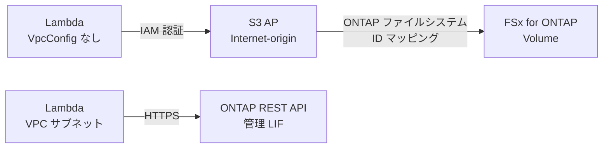
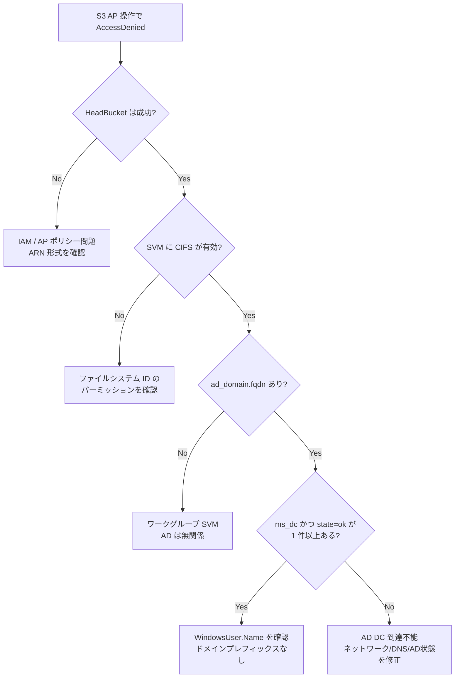

# AD参加SVM: S3 Access Point 前提条件

🌐 **Language / 言語**: 日本語 | [English](../en/ad-joined-svm-s3ap-prerequisites.md)

> AD参加SVM（CIFS有効）で FSx for ONTAP S3 Access Points を使用する際の前提条件と運用ガイダンス。

## エグゼクティブサマリ

AD参加SVM では、全ての S3 Access Point データ操作に Active Directory Domain Controller (AD DC) への接続が必須。AD DC に到達不能な場合、ListObjectsV2/GetObject/PutObject は `AccessDenied` で失敗する（HeadBucket は成功 = 偽陽性）。本ドキュメントでは前提条件、推奨アーキテクチャパターン、トラブルシューティング手順を説明する。

**本番環境で検証済みの知見** (2026年7月):
- HeadBucket は信頼できるヘルスチェックではない（S3層メタデータのみ）
- Internet-origin AP + VPC外Lambda がデータアクセスの推奨パターン
- 同一アカウントの S3 AP リソースポリシー (`put_access_point_policy`) は不要
- S3 AP データ操作の前に AD DC 到達性を検証すべき

> **出典**: `fsxn-observability-integrations` restore-verification ワークフローで検証。[AWS公式トラブルシューティングガイド](https://docs.aws.amazon.com/fsx/latest/ONTAPGuide/troubleshooting-access-points-for-fsxn.html)（「name service が到達不能」→ MISCONFIGURED または AccessDenied）と整合。

---

## 前提条件（本ドキュメントを読む前に）

| 必要なもの | 確認場所 |
|----------|---------|
| FSx for ONTAP ファイルシステム（デプロイ済み） | AWS Console → Amazon FSx → ONTAP |
| AD に参加した SVM | `scripts/demo-ad-join-svm.sh` または AWS Console |
| ONTAP 管理 IP | AWS Console → Amazon FSx → ファイルシステム → 管理 → 管理エンドポイント |
| Secrets Manager の ONTAP 管理者認証情報 | `fsxn/admin` シークレット（スタックデプロイ時に作成） |
| S3 AP 操作用の IAM 権限 | [同一アカウント AP リソースポリシー](#同一アカウント-ap-リソースポリシー)を参照 |

**用語**:
- **AD参加SVM**: CIFS/SMB プロトコルが有効化され、Active Directory ドメインに接続された Storage Virtual Machine
- **S3 AP**: S3 Access Point — FSx for ONTAP ボリュームへの S3 互換インターフェース
- **Internet-origin AP**: 有効な IAM 認証情報があればどこからでもアクセス可能な S3 AP（VPC バインディングなし）

---

## 目次

1. [クイックスタート検証](#クイックスタート検証)
2. [AD DC 到達性要件](#ad-dc-到達性要件)
3. [Internet-Origin AP + VPC外Lambda パターン](#internet-origin-ap--vpc外lambda-パターン)
4. [同一アカウント AP リソースポリシー](#同一アカウント-ap-リソースポリシー)
5. [Pre-Flight ヘルスチェック](#pre-flight-ヘルスチェック)
6. [モニタリングとアラート](#モニタリングとアラート)
7. [トラブルシューティング](#トラブルシューティング)
8. [FAQ](#faq)
9. [関連ドキュメント](#関連ドキュメント)

---

## クイックスタート検証

以下のコマンドで、AD参加SVM が S3 AP データ操作可能な状態か確認できる:

```bash
# 値を置き換えてください（管理IPはAWS Console → Amazon FSx → ファイルシステム → 管理で確認）
MGMT_IP="<your-ontap-mgmt-ip>"
SVM_NAME="<your-svm-name>"
CREDS="fsxadmin:<your-password>"

# AD DC 到達性チェック
# 判定は「件数 > 0」ではなく「server_type=ms_dc かつ state=ok が 1 件以上あるか」
curl -sku "$CREDS" \
  "https://$MGMT_IP/api/protocols/cifs/domains?svm.name=$SVM_NAME&fields=discovered_servers" \
  | jq '{
      usable_dc: [.records[0].discovered_servers[]
                  | select(.server_type == "ms_dc" and .state == "ok")] | length,
      all: [.records[0].discovered_servers[] | {server_type, state}]
    }'
```

**正常時の結果**（実機の AD 参加 SVM から取得）:
```json
{
  "usable_dc": 2,
  "all": [
    {"server_type": "ms_ldap", "state": "undetermined"},
    {"server_type": "ms_dc",   "state": "ok"},
    {"server_type": "ms_ldap", "state": "undetermined"},
    {"server_type": "ms_dc",   "state": "ok"}
  ]
}
```

**異常時** (`usable_dc: 0`): AD DC 到達不能 — S3 AP データ操作は AccessDenied で失敗する。[トラブルシューティング](#トラブルシューティング)を参照。

> **件数だけで判定しないこと**: 以前この節は「`discovered_servers` の件数 > 0 なら正常」と書いていました。**これは誤りです。** 上の実機出力が示すとおり、正常な SVM でも `ms_ldap` のエントリは `state: undetermined` のままで、到達性を示しているのは `ms_dc` かつ `state: ok` のエントリだけです。DC が落ちてもエントリ自体は残り得るため、件数だけを見ると、このチェックが検出するために存在する障害をそのまま見逃します。
>
> 逆に「全エントリが `ok`」を要求するのも誤りです。正常時に `ms_ldap` が `undetermined` なので、常に異常と判定してしまいます。
>
> `shared/ad_health_check.py` はこの規則で判定します（実機検証済み）。

> **認証情報に関する補足**: `curl -sku` パターンはインタラクティブなデバッグ専用。本番 Lambda では必ず Secrets Manager 経由で認証情報を取得すること（`shared/ontap_client.py`）。

---

## AD DC 到達性要件

### AD DC が必要な理由

AD参加SVM（CIFS有効）では、ONTAP のマルチプロトコル ID パイプラインが全ての S3 AP データ操作で `unix→win` 逆引き name-mapping lookup を実行する。この lookup には SVM から AD DC への LDAP/Kerberos 接続が必要。

以下の状況**でも** AD DC 接続が必要:
- UNIX セキュリティスタイルのボリューム
- UNIX `FileSystemUserType` の S3 AP
- SMB 共有が構成されていないボリューム

唯一の条件は SVM で CIFS が**有効化**されていること。これは直感に反しており、AD参加SVM での `AccessDenied` トラブルシューティング時の最大の混乱要因。

### 診断マトリクス

| S3 操作 | AD DC 到達可能 | AD DC 到達不能 | レイヤー |
|---------|:---:|:---:|---------|
| HeadBucket | ✅ | ✅ (偽陽性) | S3 メタデータ |
| ListObjectsV2 | ✅ | ❌ AccessDenied | ファイルシステム |
| GetObject | ✅ | ❌ AccessDenied | ファイルシステム |
| PutObject | ✅ | ❌ AccessDenied | ファイルシステム |
| DeleteObject | ✅ | ❌ AccessDenied | ファイルシステム |
| HeadObject | ✅ | ❌ AccessDenied | ファイルシステム |
| CreateMultipartUpload | ✅ | ❌ AccessDenied | ファイルシステム |

> **セキュリティに関する補足**: HeadBucket は S3 メタデータ層（AP の存在と IAM）のみを検証する。ONTAP ファイルシステム層は通過しない。**HeadBucket を S3 AP データプレーン準備状態のヘルスチェックとして使用してはならない。**

### SVM が AD 参加かどうかの判定

「CIFS が有効なら AD 参加」ではありません。**CIFS が有効でも AD ドメインを持たない SVM が実在します**（ワークグループ運用）。判定には `ad_domain.fqdn` の有無を使ってください。

```bash
curl -sku "$CREDS" \
  "https://$MGMT_IP/api/protocols/cifs/services?fields=svm.name,enabled,ad_domain.fqdn" \
  | jq '[.records[] | {svm: .svm.name, enabled, ad_domain: .ad_domain.fqdn}]'
```

実機の 2 台を並べた例:

```json
[
  {"svm": "svm-a", "enabled": true, "ad_domain": "EXAMPLE.LOCAL"},
  {"svm": "svm-b", "enabled": true, "ad_domain": null}
]
```

| SVM | CIFS | `ad_domain.fqdn` | 判定 | AD DC チェック |
|---|:---:|---|---|---|
| svm-a | 有効 | あり | AD 参加 | 必要 |
| svm-b | 有効 | なし（ワークグループ） | AD 未参加 | 不要（到達すべき DC が無い） |
| （CIFS なし） | 無効 | — | AD 未参加 | 不要 |

`ad_domain` を見ずに CIFS の有無だけで判定すると、ワークグループ SVM を「AD 参加・ドメイン不明」と誤って扱い、後続の DC チェックも無意味になります。

#### FSx API の `ActiveDirectoryConfiguration` は判定に使えない

`DescribeStorageVirtualMachines` が返す `ActiveDirectoryConfiguration` を判定に使わないでください。**`null` でも WINDOWS タイプ AP のデータ操作は通ります。**

実測（2026-08-11, ap-northeast-1）: `ActiveDirectoryConfiguration: null` の SVM 上の NTFS ボリュームに WINDOWS タイプ（`WindowsUser.Name: administrator`）の Internet-origin AP が 2 つ載っており、VPC 外から HeadBucket / ListObjectsV2 / PutObject / GetObject / HeadObject / DeleteObject の全てが成功しました。

これは [ONTAP と AWS の管理面が同一リソースに対する 2 つの真実の源である](../ontap-integration-notes.md)ことの一例です。AD 参加は ONTAP 側で完結し得るため、AWS 側の表示が追随しないことがあります。したがって:

| 参照する面 | 判定に使えるか | 理由 |
|---|:---:|---|
| ONTAP `/protocols/cifs/services` の `ad_domain.fqdn` | ✅ | データ操作を行う層そのもの |
| FSx `DescribeStorageVirtualMachines` の `ActiveDirectoryConfiguration` | ❌ | `null` でもデータ操作は成功する（実測） |

**pre-flight を FSx API で書くと、動くはずの構成を「AD 未参加」と誤判定して止めます。** `shared/ad_health_check.py` は ONTAP 側を見るため、この誤りは踏みません。

### 必要なネットワーク接続（SVM ENI → AD DC）

FSx for ONTAP ENI（preferred/standby サブネット）から AD Domain Controller IP への**アウトバウンド**ルール:

| ポート | プロトコル | サービス | 必須 |
|--------|----------|---------|:----:|
| 53 | TCP/UDP | DNS | ✅ |
| 88 | TCP/UDP | Kerberos 認証 | ✅ |
| 389 | TCP/UDP | LDAP | ✅ |
| 445 | TCP | SMB/CIFS | ✅ |
| 464 | TCP/UDP | Kerberos パスワード変更 | ✅ |
| 636 | TCP | LDAPS（暗号化 LDAP） | 推奨 |
| 3268 | TCP | グローバルカタログ | マルチドメイン時 |
| 9389 | TCP | AD Web Services | オプション |
| 49152-65535 | TCP | RPC 動的ポート | ✅ |

#### セキュリティグループ例（CloudFormation）

```yaml
FsxToAdSecurityGroupRule:
  Type: AWS::EC2::SecurityGroupEgress
  Properties:
    GroupId: !Ref FsxSecurityGroup
    Description: Allow FSx for ONTAP SVM to reach AD DCs
    IpProtocol: "-1"  # デモ用: 本番では個別ポートルールに制限
    DestinationSecurityGroupId: !Ref AdControllerSecurityGroup
```

> **ネットワークに関する補足**: これらのルールは SVM ENI → AD DC 向け。S3 AP にアクセスする Lambda にはこれらのポートは不要 — Lambda は S3 API 層経由で通信し、AD に直接接続しない。

---

## Internet-Origin AP + VPC外Lambda パターン

### ネットワークパターン選択マトリクス

| パターン | 月額コスト | 複雑度 | 使用ケース |
|---------|:---:|:---:|-----------|
| **Internet-origin AP + VPC外Lambda** | $0 | 低 | 標準データアクセス（推奨） |
| Internet-origin AP + VPC Lambda + NAT GW | ~$32+/AZ | 中 | 同一 Lambda で ONTAP 管理 API も必要 |
| VPC-origin AP + VPC Lambda + Interface EP | ~$7.20/AZ | 高 | 厳格なコンプライアンス（Internet egress 禁止） |

### 推奨パターン: Internet-Origin AP + VPC外Lambda

S3 AP **データアクセス**（ListObjectsV2, GetObject, PutObject）を Lambda から行う場合:

- **Internet-origin AP** (`NetworkOrigin: Internet`, `VpcConfiguration` なし)
- **VPC外 Lambda** (Lambda に `VpcConfig` を設定しない)

### VPC-Origin を使わない理由

1. S3 **Gateway** VPC Endpoint は FSx for ONTAP S3 Access Points をサポート**しない**
2. S3 **Interface** VPC Endpoint はコスト増（各 AZ ~$7.20/月）と複雑化を伴う
3. VPC 内 Lambda から Internet-origin S3 AP にアクセスするには NAT Gateway が必要

### アーキテクチャ


```mermaid
graph LR
    A[Lambda<br/>VpcConfig なし] -->|IAM 認証| B[S3 AP<br/>Internet-origin]
    B -->|ONTAP ファイルシステム<br/>ID マッピング| C[FSx for ONTAP<br/>Volume]
    D[Lambda<br/>VPC サブネット] -->|HTTPS| E[ONTAP REST API<br/>管理 LIF]
```

### VPC 分割アーキテクチャ

| Lambda 関数 | 目的 | VpcConfig | アクセス方法 |
|------------|------|:---------:|------------|
| Discovery / ONTAP管理 | ONTAP REST API (`/api/...`) | ✅ VPC サブネット + SG | 管理 LIF への直接 HTTPS |
| S3 AP データ読み書き | S3 AP (ListObjectsV2/GetObject/PutObject) | ❌ なし | IAM 認証の S3 API |

> **コストに関する補足**: ONTAP 管理 API と Internet-origin S3 AP アクセスを単一の Lambda で混在させないこと。VPC Lambda には NAT Gateway（$32+/月/AZ）が必要になる。

---

## 同一アカウント AP リソースポリシー

### 重要な知見

**同一アカウント**アクセス（呼び出し元 IAM プリンシパルと S3 AP が同一 AWS アカウント）の場合、明示的な S3 AP リソースポリシー (`put_access_point_policy`) は**不要**。

IAM アイデンティティポリシーのみで十分:

```json
{
  "Effect": "Allow",
  "Action": ["s3:ListBucket", "s3:GetObject", "s3:PutObject", "s3:DeleteObject"],
  "Resource": [
    "arn:aws:s3:ap-northeast-1:123456789012:accesspoint/my-access-point",
    "arn:aws:s3:ap-northeast-1:123456789012:accesspoint/my-access-point/object/*"
  ]
}
```

> **出典**: 同一アカウント構成で AP リソースポリシーなしでの ListObjectsV2/GetObject/PutObject 成功を検証。[AWS S3 AP ドキュメント](https://docs.aws.amazon.com/fsx/latest/ONTAPGuide/s3-ap-manage-access-fsxn.html)の二層認証モデルと整合。

### AP リソースポリシーが必要なケース

| シナリオ | AP リソースポリシー | IAM アイデンティティポリシー |
|---------|:---:|:---:|
| 同一アカウントアクセス | ❌ | ✅ |
| クロスアカウントアクセス | ✅ | ✅ |
| 呼び出し元を問わず AP 単位で条件キーを効かせる | ✅ | ✅ |
| 呼び出し元自身の IAM を超えて制約する（明示的 deny） | ✅ | ✅ |

> **3 行目は正確に読んでください。** 条件キーは AP ポリシー専用ではありません。
> `aws:PrincipalArn` / `aws:SourceVpce` / `aws:PrincipalOrgID` はいずれも
> identity-based ポリシーにも書けます。AP ポリシーが必要になるのは、その条件を
> **その AP を呼ぶすべての主体**に効かせたいとき、つまり自分が管理していない
> identity-based ポリシーを持つ主体も対象にしたいときです。
>
> **絞り込みに効くのは 4 行目です。** 同一アカウント内では identity-based ポリシーと
> AP ポリシーは**結合**して評価され、どちらかが許可すれば通ります。したがって
> AP ポリシーの `Allow` を狭く書くことは絞り込みになりません。絞るのは明示的な
> `Deny` です。詳細は
> [S3 AP 認可モデル](../s3ap-authorization-model.md#allow-を狭く書くことは絞り込みではない)。

### CloudFormation の例（同一アカウント / AP ポリシー不要）

```yaml
S3ApDataReaderRole:
  Type: AWS::IAM::Role
  Properties:
    AssumeRolePolicyDocument:
      Version: "2012-10-17"
      Statement:
        - Effect: Allow
          Principal:
            Service: lambda.amazonaws.com
          Action: sts:AssumeRole
    ManagedPolicyArns:
      - arn:aws:iam::aws:policy/service-role/AWSLambdaBasicExecutionRole
    Policies:
      - PolicyName: S3ApAccess
        PolicyDocument:
          Version: "2012-10-17"
          Statement:
            - Effect: Allow
              Action:
                - s3:ListBucket
                - s3:GetObject
              Resource:
                - !Sub "arn:aws:s3:${AWS::Region}:${AWS::AccountId}:accesspoint/${S3ApName}"
                - !Sub "arn:aws:s3:${AWS::Region}:${AWS::AccountId}:accesspoint/${S3ApName}/object/*"
```

> **IAMに関する補足**: Resource ARN は Access Point 形式（`arn:aws:s3:<region>:<account>:accesspoint/<name>`）を使用すること。バケット形式 ARN（`arn:aws:s3:::<alias>`）は動作しない。これは[公式ドキュメントに記載された既知の問題](https://docs.aws.amazon.com/fsx/latest/ONTAPGuide/troubleshooting-access-points-for-fsxn.html)。

---

## Pre-Flight ヘルスチェック

### プログラムチェック（Python — Lambda/Step Functions 用）

```python
from shared.ad_health_check import require_ad_dc_reachability
from shared.ontap_client import OntapClient, OntapClientConfig

config = OntapClientConfig(
    management_ip=os.environ["ONTAP_MGMT_IP"],
    secret_name=os.environ["ONTAP_SECRET_NAME"],
)
client = OntapClient(config)

# AD DC 到達不能時は AdDcUnreachableError を raise
# 非AD SVM（CIFSなし）は即座にリターン（チェック不要）
status = require_ad_dc_reachability(client, svm_name=os.environ["SVM_NAME"])
```

### シェルチェック（スクリプト/自動化用）

```bash
# 管理IP: AWS Console → Amazon FSx → ファイルシステム → 管理で確認
curl -sku "$ONTAP_USER:$ONTAP_PASS" \
  "https://$MGMT_IP/api/protocols/cifs/domains?svm.name=$SVM_NAME&fields=discovered_servers" \
  | jq '[.records[0].discovered_servers[]
         | select(.server_type == "ms_dc" and .state == "ok")] | length'
# 結果: 0 = AD DC 到達不能, >=1 = 正常
# 全体の件数ではなく ms_dc/ok の件数で判定すること（理由は「クイックスタート検証」参照）
```

### Step Functions 統合

AD参加SVM で S3 AP データ操作を使うワークフローの**最初の状態**に追加:

```json
{
  "StartAt": "AdDcHealthCheck",
  "States": {
    "AdDcHealthCheck": {
      "Type": "Task",
      "Resource": "${AdDcHealthCheckFunctionArn}",
      "ResultPath": "$.adHealthStatus",
      "Next": "MainWorkflow",
      "Retry": [{"ErrorEquals": ["States.TaskFailed"], "MaxAttempts": 3, "IntervalSeconds": 10, "BackoffRate": 2.0}],
      "Catch": [{"ErrorEquals": ["AdDcUnreachableError"], "ResultPath": "$.error", "Next": "NotifyAdFailure"}]
    },
    "NotifyAdFailure": {
      "Type": "Task",
      "Resource": "arn:aws:states:::sns:publish",
      "Parameters": {
        "TopicArn": "${AlertTopicArn}",
        "Subject": "AD DC Unreachable - S3 AP Operations Blocked",
        "Message.$": "$.error.Cause"
      },
      "End": true
    }
  }
}
```

---

## モニタリングとアラート

### EventBridge Schedule + Lambda による定期ヘルスチェック

```yaml
# SAM テンプレートに追加する
AdHealthCheckSchedule:
  Type: AWS::Scheduler::Schedule
  Properties:
    Name: !Sub "${AWS::StackName}-ad-health-check"
    ScheduleExpression: "rate(5 minutes)"
    FlexibleTimeWindow:
      Mode: "OFF"
    Target:
      Arn: !GetAtt AdHealthCheckFunction.Arn
      RoleArn: !GetAtt SchedulerRole.Arn

AdHealthCheckFunction:
  Type: AWS::Serverless::Function
  Properties:
    Handler: handler.handler
    Runtime: python3.13
    Architectures: [arm64]
    Timeout: 30
    VpcConfig:
      SubnetIds: !Ref PrivateSubnetIds
      SecurityGroupIds: [!Ref FsxAccessSecurityGroup]
    Environment:
      Variables:
        ONTAP_MGMT_IP: !Ref OntapManagementIp
        ONTAP_SECRET_NAME: !Ref OntapSecretName
        SVM_NAME: !Ref SvmName
        ALARM_TOPIC_ARN: !Ref AlertTopic
```

ヘルスチェック関数は ONTAP 管理 LIF に接続するため、VPC 内に配置します
（`VpcConfig` あり）。S3 AP のデータ操作を行う Lambda とは逆で、こちらは
Internet-origin AP へアクセスしないため VPC 内で問題ありません。

### CloudWatch カスタムメトリクス

`shared/ad_health_check.py` の結果を CloudWatch メトリクスとして発行すれば、ダッシュボードで可視化できます。

```python
import boto3
from shared.ad_health_check import check_ad_dc_reachability

def handler(event, context):
    status = check_ad_dc_reachability(ontap_client, svm_name)

    # メトリクス発行
    cw = boto3.client("cloudwatch")
    cw.put_metric_data(
        Namespace="FSxN/S3AP",  # allow:naming — メトリクス名前空間の識別子
        MetricData=[{
            "MetricName": "AdDcReachable",
            "Value": 1.0 if status.dc_reachable else 0.0,
            "Unit": "None",
            "Dimensions": [{"Name": "SvmName", "Value": svm_name}],
        }],
    )

    if not status.is_healthy:
        # SNS で通知
        sns = boto3.client("sns")
        sns.publish(TopicArn=os.environ["ALARM_TOPIC_ARN"], ...)
```

### CloudWatch アラーム

```yaml
AdDcReachabilityAlarm:
  Type: AWS::CloudWatch::Alarm
  Properties:
    AlarmName: !Sub "${AWS::StackName}-ad-dc-unreachable"
    Namespace: FSxN/S3AP  # allow:naming — メトリクス名前空間の識別子
    MetricName: AdDcReachable
    Dimensions:
      - Name: SvmName
        Value: !Ref SvmName
    Statistic: Minimum
    Period: 300
    EvaluationPeriods: 2
    Threshold: 1
    ComparisonOperator: LessThanThreshold
    AlarmActions:
      - !Ref AlertTopic
```

---

## トラブルシューティング

### 判断フローチャート


```mermaid
graph TD
    A[S3 AP 操作で AccessDenied] --> B{HeadBucket は成功?}
    B -->|No| C[IAM / AP ポリシー問題<br/>ARN 形式を確認]
    B -->|Yes| D{SVM に CIFS が有効?}
    D -->|No| E[ファイルシステム ID の<br/>パーミッションを確認]
    D -->|Yes| D2{ad_domain.fqdn あり?}
    D2 -->|No| E2[ワークグループ SVM<br/>AD は無関係]
    D2 -->|Yes| F{ms_dc かつ state=ok が<br/>1 件以上ある?}
    F -->|Yes| G[WindowsUser.Name を確認<br/>ドメインプレフィックスなし]
    F -->|No| H[AD DC 到達不能<br/>ネットワーク/DNS/AD状態を修正]
```

### 症状: ListObjectsV2 で AccessDenied だが HeadBucket は成功

**根本原因**: SVM から AD DC に到達不能。

**確認方法**:
```bash
curl -sku user:pass \
  "https://<mgmt-ip>/api/protocols/cifs/domains?svm.name=<svm>&fields=discovered_servers"
```

`discovered_servers` が `[]`（空配列）なら到達不能です。**ただし空でなくても到達不能なことがあります** — `ms_dc` かつ `state: ok` のエントリが 1 件も無い場合です（DC が落ちてもエントリは残り得る）。

**解決策**:
1. SVM DNS IP がアクティブな AD DC アドレスを指しているか確認
   ```bash
   curl -sku user:pass "https://<mgmt-ip>/api/name-services/dns?svm.name=<svm>"
   ```
2. セキュリティグループが SVM ENI のサブネットから AD DC IP に対してポート 53/88/389/445/464/636 を許可しているか確認
3. AWS Managed AD の場合、ディレクトリのステータスが `Active` か確認
4. AD を再作成した場合、SVM は CIFS force-delete + re-join が必要（新しい NetBIOS 名が必要 — 手順は steering ファイル参照）

### 症状: WINDOWS タイプの S3 AP 作成が失敗する

**原因**: SVM がまだ AD に参加していない。

**解決策**: 先に SVM を AD に参加させる:
```bash
./scripts/demo-ad-join-svm.sh --stack-name <your-ad-stack> --svm-name <svm-name>
```

### ワークフローへの組み込み: `preflight_ad_dc_reachability()`

`shared/ad_health_check.py` には 3 つの入口があります。ワークフローの先頭に置くなら `preflight_ad_dc_reachability()` を使います。

| 関数 | DC 到達不能と判定 | チェック自体が失敗（ONTAP API エラー等） |
|------|:---:|:---:|
| `check_ad_dc_reachability()` | status を返す | `OntapClientError` を送出 |
| `require_ad_dc_reachability()` | 例外を送出 | `OntapClientError` を送出 |
| `preflight_ad_dc_reachability()` | 例外を送出 | 警告ログ + 続行 |

3 つ目の列が重要です。診断のために足した処理が新しい障害要因になってはいけません。ONTAP API の一時的な失敗でワークフロー全体を止めるのは、防ごうとしている問題より大きい害になります。

**SVM は名前でも UUID でも指定できます。**

```python
from shared.ad_health_check import preflight_ad_dc_reachability

# パターン側の Lambda は環境変数 SVM_UUID を持つ（SVM_NAME は持たない）
status = preflight_ad_dc_reachability(ontap_client, svm_uuid=os.environ["SVM_UUID"])
logger.info("AD DC pre-flight: %s", status.message)
```

`/protocols/cifs/services` と `/protocols/cifs/domains` はいずれも `svm.uuid` をフィルタとして受け付け、`svm.name` と同一のレコードを返します（実機確認済み）。UUID で問い合わせた場合、応答に含まれる SVM 名がメッセージに使われます。

**配置位置**: 最初の S3 AP データ操作より**前**に置いてください。後ろに置くと `list_objects` が先に AccessDenied になり、チェックの意味が無くなります。

**組み込み済みのパターン**: `legal-compliance` の discovery。このパターンは後続の Map ステートでオブジェクトごとに NTFS セキュリティ記述子を読むため、AD DC 到達性が前提になります。先頭で 1 回落とせば、Map が展開してから同じ失敗を N 回繰り返すのを防げます。

> **エラー表面に関する補足**: `lambda_error_handler` は診断ログを残したうえで例外を再送出します。Lambda の呼び出しが失敗するため、Step Functions は Discovery タスクを失敗として扱い、ステートマシンに定義済みの `States.TaskFailed` の Retry / Catch が働きます。例外型はそのまま保たれるので、`Catch` の `ErrorEquals` で `AdDcUnreachableError` を判別できます。

### 診断メッセージ: `shared/s3ap_helper.py`

このリポジトリのパターンは S3 AP アクセスを `shared/s3ap_helper.py` の `S3ApHelper` 経由で行います。同モジュールは AccessDenied を捕捉すると、上記 2 層の両方を挙げた `S3ApHelperError` を送出します。

以前のメッセージは IAM と AP ポリシーだけを指していたため、原因がファイルシステム層のときに真逆の方向へ調査を誘導していました。現在は次を含みます。

- AWS 側（IAM identity ポリシー / AP リソースポリシー、AP 形式 ARN の注意）
- ONTAP ファイルシステム側（AD 参加 SVM で AD DC 到達不能の可能性）
- 切り分け手段としての HeadBucket（S3 メタデータ層だけを見るため、ファイルシステム層が原因でも成功する）
- `ms_dc` かつ `state=ok` のエントリを確認する具体的な判定条件

`S3ApHelper` は AP のエイリアス/ARN しか持たず SVM 名を知らないため、「AD が原因」と断定はしません。両方の可能性と切り分け手順を示します。

対象は 8 操作すべてです: ListObjectsV2 / GetObject / PutObject / HeadObject / DeleteObject / ストリーミングダウンロード / Range ダウンロード / CreateMultipartUpload。AccessDenied 以外（`NoSuchKey` 等）にはこの診断は付きません。

### 症状: 正しい IAM ポリシーなのに AccessDenied

**チェックリスト**（順に確認）:
1. ✅ IAM ARN が S3 AP 形式: `arn:aws:s3:<region>:<account>:accesspoint/<name>/object/*`
2. ✅ `WindowsUser.Name` はユーザー名のみ（例: `Admin`）— `DOMAIN\` プレフィックスなし
3. ✅ AD DC に到達可能（上記クイックスタート検証を実行）
4. ✅ ファイルシステム ID に対象パスへのパーミッションがある
5. ✅ ボリュームがマウント済み（ジャンクションパスあり）でオンライン

### 症状: ONTAP が `RESULT_ERROR_SECD_IN_DISCOVERY` を報告する

**原因**: SVM が DNS 経由で AD ドメインコントローラーを検出できない。

**解決策**: SVM の DNS 設定が AD ドメイン名を解決できるか確認する:
```bash
curl -sku user:pass "https://<mgmt-ip>/api/name-services/dns?svm.name=<svm>&fields=servers,domains"
# "servers" に AD DC の DNS IP が含まれていることを確認
```

---

## FAQ

### Q: 純粋な UNIX SVM（CIFS なし）に AD DC は必要？

不要。SVM に CIFS サービスが有効化されていなければ、S3 AP 操作に AD は不要。本リポジトリのほとんどのパターンは純粋な UNIX SVM を対象としている。

### Q: HeadBucket をヘルスチェックに使える？

**使えない。** HeadBucket は S3 層のメタデータしか検証しないため、AD DC の状態にかかわらず常に成功します。代わりに以下を使用:
- `ListObjectsV2`（`MaxKeys=1`）— データプレーンヘルスチェック
- ONTAP API `GET /protocols/cifs/domains?fields=discovered_servers` — インフラチェック
- `shared/ad_health_check.py` → `check_ad_dc_reachability()` — プログラムチェック

### Q: 同一アカウントアクセスに `put_access_point_policy` は必要？

不要。同一アカウントでは IAM アイデンティティポリシーで十分。AP リソースポリシーが必要になるのは、クロスアカウントアクセスの場合と、**その AP を呼ぶすべての主体**に条件や拒否を効かせたい場合。

**逆に、AP ポリシーを付けても呼び出し元を絞れるわけではありません。** 同一アカウントでは identity-based ポリシーと AP ポリシーが結合して評価されるため、AP ポリシーの `Allow` を狭くしても、identity-based 側で許可されている主体はそのまま通ります。絞るには明示的な `Deny` が必要です（[S3 AP 認可モデル](../s3ap-authorization-model.md#layer-1-で絞る--明示的な拒否)）。

### Q: Internet-origin S3 AP が VPC Lambda から動作しない理由は？

VPC Lambda のトラフィックは VPC ネットワーキングを経由する。Internet-origin S3 AP エンドポイントは S3 Gateway VPC Endpoint を通過**しない**。以下のいずれかが必要:
- NAT Gateway（$32+/月）— 動作するがコスト高
- `VpcConfig` なし（VPC外）— **推奨**、追加コスト $0

### Q: ワークフロー実行中に AD DC が到達不能になったら？

S3 AP のデータ操作は **即座に** AccessDenied で失敗します（ONTAP 層でのタイムアウトやリトライはありません）。Step Functions ワークフローには次を含めてください:
- 一時障害に対する指数バックオフ付き `Retry`（`BackoffRate: 2.0`）
- `AdDcUnreachableError` を捕捉する `Catch`（SNS で運用者へ通知）
- 事前検知のための監視アラーム（[モニタリングとアラート](#モニタリングとアラート)を参照）

### Q: ONTAP 管理 IP はどこで確認する？

AWS Console → Amazon FSx → ファイルシステム → ファイルシステム選択 → 管理タブ → 管理エンドポイント。または CLI:
```bash
aws fsx describe-file-systems --file-system-ids fs-XXXXX \
  --query "FileSystems[0].OntapConfiguration.Endpoints.Management.IpAddresses[0]"
```

---

## 実機検証の記録

`shared/ad_health_check.py` を実クラスタ（ap-northeast-1）に対して実行し、AD 参加 SVM と「CIFS 有効・AD ドメインなし」SVM の両方で確認しました。単体テストはトランスポートをスタブするため、`discovered_servers` の実際のフィールド構成はここでしか確認できません。

| 検証項目 | 結果 |
|---|---|
| AD 参加 SVM の判定 | `is_ad_joined=True`、`ad_domain` を取得 |
| 到達性判定 | `ms_dc` かつ `state: ok` が 2 件 → `dc_reachable=True` |
| `ms_ldap` の状態 | 正常な SVM でも `state: undetermined`（**件数だけの判定が誤りである根拠**） |
| CIFS 有効・AD ドメインなしの SVM | `is_ad_joined=False`（ワークグループとして扱う）。ドメイン照会に進まない |
| `require_ad_dc_reachability()` | 健全な SVM・ワークグループ SVM のいずれも正常リターン |
| ログ出力 | ノード UUID・DC の IP を含まず、`server_type/state` の要約のみ |
| パストラバーサル拒否 | `OntapClient` が送信前に 400 で拒否 |

この検証で 2 つの実装バグが判明し、修正しました。

1. **到達性を件数だけで判定していた** — `discovered_servers` が空でなければ `dc_reachable=True` としていました。実機では正常時も `ms_ldap` が `undetermined` であり、DC が落ちてもエントリは残り得ます。件数判定では、このチェックが検出するために作られた障害を見逃します
2. **CIFS 有効を AD 参加と同一視していた** — 実在するワークグループ SVM に対し `is_ad_joined=True, ad_domain=None` という矛盾した結果を返し、後続の DC チェックも無意味になっていました

検証は既存リソースを変更せず、デプロイ済み Lambda のロール・サブネット・セキュリティグループを再利用した一時的な関数から実施し、確認後に削除しています。クラスタへの操作は GET のみです。

### WINDOWS タイプ AP のデータ操作（2026-08-11, ap-northeast-1）

NTFS ボリューム上の WINDOWS タイプ（`WindowsUser.Name: administrator`）Internet-origin AP に対し、**VPC 外**（開発端末）から実行しました。

| 操作 | 結果 |
|---|---|
| HeadBucket | 成功 |
| ListObjectsV2 | 成功（空ボリュームでは `Contents` なし） |
| PutObject | 成功 |
| GetObject | 成功（書き込んだ内容を一致確認） |
| HeadObject | 成功（`ContentLength` 一致） |
| DeleteObject | 成功（オブジェクト数 0 に復帰） |

同 SVM の FSx API 上の `ActiveDirectoryConfiguration` は `null` でした。**つまり「HeadBucket は通るがデータ操作は落ちる」という AD DC 到達不能時の症状は、この構成では再現していません。**

未確認: この SVM の DC 到達性そのもの（ONTAP 管理 LIF はプライベートなため VPC 外からは照会できない）。したがって本記録は「AD DC 到達不能でも動く」ことの証拠ではなく、**FSx API の AD 表示が判定に使えない**ことの証拠です。

書き込みは検証用の 6 バイトのオブジェクト 1 個のみで、確認後に削除しています。既存のオブジェクト・ボリューム・AP の構成は変更していません。

---

## 関連ドキュメント

- [ONTAP Integration Notes](../ontap-integration-notes.md) — NAS 共存、ID マッピング
- [S3AP Compatibility Notes](../s3ap-compatibility-notes.md) — 既知の制約
- [S3AP Authorization Model](../s3ap-authorization-model.md) — 二層認証モデル
- [Incident Response Playbook](../incident-response-playbook.md) — セキュリティインシデント対応
- [ROADMAP](../../ROADMAP.md) — SnapMirror DR テスト自動化（将来）
- [AWS: S3 AP トラブルシューティング](https://docs.aws.amazon.com/fsx/latest/ONTAPGuide/troubleshooting-access-points-for-fsxn.html) — 公式ガイド
- [AWS: AD ベストプラクティス](https://docs.aws.amazon.com/fsx/latest/ONTAPGuide/self-managed-AD-best-practices.html) — AD サービスアカウント権限
