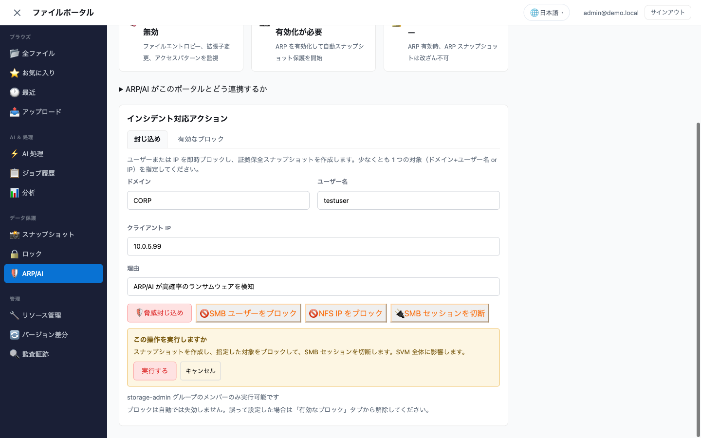

# ARP/AI 隔離デモガイド

> ポータルのインシデント対応機能を示します。ARP/AI でランサムウェアの挙動を検知し、侵害されたユーザーや IP をブラウザから直接隔離します（外部ツールなし）。

## 前提条件

| 要件 | 確認方法 |
|---|---|
| Amplify Gen2 ポータルがデプロイ済み | `make sandbox` が完了し、http://localhost:5173 が開ける |
| VPC Lambda が ONTAP 管理 LIF に到達できる | `ONTAP_MGMT_IP` を設定済み、SG が TCP/443 の outbound を許可 |
| Cognito ユーザーが `storage-admin` グループに所属 | AWS コンソール → Cognito → User Pool → Groups → storage-admin にユーザーを追加 |
| ARP を有効にした FSx for ONTAP（または SimulationMode） | System Manager → Volume → Anti-Ransomware → Enabled/Learning |
| ONTAP 9.14.1 以降 | CLI で `system image show` |

> **SimulationMode**: 実際の FSx for ONTAP がなくても、Lambda はモックレスポンスを返します。UI のワークフローは一通り操作でき、スキップされるのは ONTAP REST API の呼び出しだけです。`ONTAP_MGMT_IP=""` にすると SimulationMode になります。

## アーキテクチャ

```
ブラウザ（storage-admin ユーザー）
    │
    ▼
Amplify ポータル → AppSync（containThreat mutation）
    │                        │
    │                        ▼（storage-admin グループの検査）
    │
    ▼
ArpResponseLambdaDataSource
    │
    ▼
VPC Lambda（functions/data-protection/handler.py）
    │
    ▼
ONTAP REST API（管理 LIF、TCP/443）
    │
    ├─ POST /name-services/name-mappings       → SMB ユーザーをブロック
    ├─ POST /export-policies/{id}/rules        → NFS IP をブロック
    ├─ POST /storage/volumes/{id}/snapshots    → 証拠保全スナップショット
    └─ DELETE /protocols/cifs/sessions/{...}   → セッション切断
```

## デモの流れ（5 分）

### Step 1: ARP の状態を見る

1. http://localhost:5173 でポータルを開く
2. `storage-admin` グループのユーザーでサインイン
3. サイドバーの **データ保護 → 🛡️ ARP/AI** を開く
4. 次が表示されることを確認する
   - 状態: **保護中**（enabled）または **学習モード**（dry_run）
   - 脅威評価: 色分けされたバナー（緑 = なし、赤 = 高）

### Step 2: 検知を誘発する

ARP を有効にした実環境がある場合は、テスト用の操作を実行します。

```bash
# 同じボリュームをマウントしている NFS クライアントで実行:
# ランサムウェア様の拡張子で大量にリネームする
for i in $(seq 1 50); do
  touch /mnt/fsxn/test_file_$i.docx
  mv /mnt/fsxn/test_file_$i.docx /mnt/fsxn/test_file_$i.docx.encrypted
done
```

数分後、ARP がパターンを検知し、脅威レベルが `moderate` または `high` に変わります。

> **実際の ARP がない場合**: Step 3 に進んでかまいません。封じ込めアクションは脅威レベルに関係なく実行できます。状態表示の下に出ています。

### Step 3: ポータルから封じ込めを実行する

1. ARP/AI セクションの **インシデント対応アクション** までスクロールする
2. **封じ込め** タブを選ぶ
3. 対象を入力する
   - **ドメイン**: `CORP`（自分の AD ドメイン）
   - **ユーザー名**: `testuser`（侵害されたアカウント）
   - **クライアント IP**: `10.0.5.99`（攻撃元ワークステーションの IP）
   - **理由**: 「ARP/AI が高確率のランサムウェアを検知」
4. **🛡️ 脅威封じ込め** を押す
5. 確認行が表示されます。スナップショットを作成し、指定した対象をブロックし、SMB セッションを切断する — これが SVM 全体に効く、という内容です。**実行する** で進み、**キャンセル** で戻ります。



> **2 段階にしている理由**: ブロックは対象の principal のデータアクセスを SVM 全体で止めます。同じゲートを Lambda 側でも独立して持っています。`confirm: true` を伴わずに AppSync に届いた呼び出しは拒否されるため、ブラウザを迂回してもチェックは迂回できません。

**期待される結果**: ポータルが順に実行します。

- ✅ `incident_response_YYYYMMDD_HHMMSS` スナップショットを作成
- ✅ name-mapping の deny ルールで SMB ユーザーをブロック
- ✅ export-policy の deny ルールで NFS IP をブロック
- ✅ 該当ユーザーのアクティブな CIFS セッションを切断

成功メッセージが出ます。「封じ込め完了 — ユーザーブロック + スナップショット作成済み」

### Step 4: 有効なブロックを確認する

1. **有効なブロック** タブに切り替える
2. 次が見えます
   - **SMB ユーザーブロック**: `CORP\\testuser`（position 1）
   - **NFS IP ブロック**: `10.0.5.99`（policy: default）

### Step 5: ONTAP 側から確認する（任意）

```bash
# name-mapping のブロックを確認
curl -sk -u fsxadmin:<password> \
  "https://<mgmt-ip>/api/name-services/name-mappings?svm.name=<svm>&direction=win_unix" | jq .

# export-policy のルールを確認
curl -sk -u fsxadmin:<password> \
  "https://<mgmt-ip>/api/protocols/nfs/export-policies?svm.name=<svm>&name=default" | jq .

# ブロックしたユーザーがアクセスできないことを確認
#（ユーザーのワークステーションから — Access Denied になるはず）
```

### Step 6: 調査後にブロックを解除する

1. **有効なブロック** タブで該当行の **解除** を押す
2. ブロックが削除され、アクセスが戻ります

### Step 7: 個別アクション

個別のボタンも使えます。それぞれ、何が起きるかに応じた文面で確認を求めます。

| ボタン | 必要な入力 | 知っておくこと |
|---|---|---|
| 🚫 SMB ユーザーをブロック | ドメイン + ユーザー名 | 次回の認証を拒否します。既に開いているセッションは、切断するまで動き続けます。 |
| 🚫 NFS IP をブロック | IP アドレス | ONTAP 層では即座に効きますが、クライアント側の属性キャッシュにより既存マウントは最大 60 秒読み書きを続けられます。 |
| 🔌 SMB セッションを切断 | ドメイン + ユーザー名、または IP | 生きているセッションを落とします。これ単体では次回ログインを止められないので、ブロックと併用してください。 |

片方のプロトコルだけに手を入れたい場合や、ブロック済みで生き残ったセッションを落としたい場合に使います。

> **順序に関する補足**: ブロック → 切断の順で実行してください。ブロック前に切断すると、クライアントは再接続に成功してしまいます。

## ポータルで完結する範囲と、外部連携が必要な範囲

ここで使っている封じ込めの部品は、[fsxn-observability-integrations](https://github.com/Yoshiki0705/fsxn-observability-integrations) の `ontap_response.py` を移植したものです（モジュールの docstring に明記しています）。呼んでいる ONTAP の仕組みは同一です — name-mapping deny、export-policy deny rule、保護スナップショット、CIFS セッション切断。違うのは引き金と、その周辺のレイヤーです。

### ポータルで完結する範囲

| できること | 前提 |
|---|---|
| ARP/AI の状態、攻撃確率、疑わしいファイルの確認 | ポータルが ONTAP REST に到達できること |
| SMB ユーザー / NFS クライアント IP のブロックと解除 | `storage-admin` グループ |
| 保護スナップショットの作成、スナップショットのロック（WORM） | 同上 |
| CIFS セッションの切断 | AD 参加 SVM |
| 有効なブロックの一覧と個別解除 | — |
| ブロックの有効期限と自動解除（既定 24 時間） | ブロック台帳（DynamoDB）に到達できること |
| 複数 SVM への一斉適用（`svms` 指定または `allSvms`） | — |
| S3 Access Point 経由のファイルアクセス監査 | CloudTrail データイベント + Athena |
| スナップショットの FlexClone を作って中身を見る、世代間の差分 | — |

いずれも **人が押して初めて動きます**。無人で封じ込める仕組みはポータルには入っていません（有効期限による自動解除は例外で、これは締め出しを終わらせる方向にのみ働きます）。

### 外部連携が必要な範囲

| やりたいこと | 必要なもの |
|---|---|
| 人を待たずに封じ込める | SNS トピック + 応答 Lambda |
| 検知を能動的に知らせる（見に行かなくても気づく） | EMS → Webhook → SIEM / Observability プラットフォーム |
| NFS をキャッシュ待ちなしで即時遮断する | VPC NACL の deny ルール（ネットワーク層） |
| リストア前に復旧ポイントの健全性を判定する | 検証ワークフロー（FlexClone + 隔離スキャン） |
| ユーザー別 ML ベースラインで異常検知する | 異常検知機能を持つ SIEM、または専用のストレージセキュリティ製品 |
| NFS/SMB で直接来たファイルアクセスを追跡する | ONTAP 監査ログ / FPolicy の配信パイプライン |

> **監査範囲に関する補足**: ポータルの監査証跡は、S3 Access Point に対する CloudTrail のデータイベントを読んでいます。NFS や SMB で直接来たアクセスはここには出ません。それには ONTAP 自身の監査ログか FPolicy イベントが必要です。両者は補完関係で、片方がもう片方の代わりにはなりません。ポータルが両方見せていると思い込みやすい部分です。

つまりこのポータルはインシデント対応の **手** です。ONTAP の封じ込め操作をブラウザに載せ、Cognito グループで縛り、確認を挟み、監査証跡を残します。24 時間監視して自動でその手を動かす仕組みが必要なら、検知と応答はパイプライン側の仕事です。逆に、既に SIEM で検知していて「ストレージ層で止める手段」だけが無い場合は、SNS 起動型の応答 Lambda のほうが目的に合います。

## パラメータリファレンス

### 環境変数（Lambda）

| 変数 | 説明 | 例 |
|---|---|---|
| `ONTAP_MGMT_IP` | FSx for ONTAP の管理エンドポイント | `10.0.1.100` |
| `ONTAP_SECRET_NAME` | username/password を持つ Secrets Manager シークレット | `fsxn/ontap-creds` |
| `VOLUME_NAME` | 対象ボリューム名 | `vol1` |
| `SVM_NAME` | Storage Virtual Machine 名 | `svm-prod` |

### Secrets Manager の形式

```json
{
  "username": "fsxadmin",
  "password": "<your-password>"
}
```

### Cognito グループの要件

ARP の応答系 mutation は、呼び出しユーザーが `storage-admin` Cognito グループに所属していることを要求します。通常の認証済みユーザーは ARP の状態を参照できますが、封じ込めアクションは実行できません。

グループへの追加:

```bash
aws cognito-idp admin-add-user-to-group \
  --user-pool-id <pool-id> \
  --username <email> \
  --group-name storage-admin
```

## 保護アカウント

次のアカウントはブロックできません（誤ロックアウトの防止）。

- `fsxadmin`、`administrator`、`admin`、`vsadmin`、`system`

サービスアカウントなどを追加する場合:

```bash
# Lambda の環境変数
PROTECTED_ACCOUNTS_EXTRA="svc-backup,svc-ml-pipeline,app-service"
```

## クールダウンの挙動

スナップショット作成には 15 分のクールダウンがあり、持続的な攻撃中に大量のスナップショットが作られるのを防ぎます。直近 15 分以内に `incident_response_` プレフィックスのスナップショットが作られている場合、新しいものは作りません。`cooldown_minutes=0` で無効化できます。

## トラブルシューティング

| 症状 | 原因 | 対処 |
|---|---|---|
| "ONTAP connection not configured" | `ONTAP_MGMT_IP` または `ONTAP_SECRET_NAME` が未設定 | portal-config.ts の Lambda 環境変数を確認 |
| "SVM not found" | SVM 名が一致していない | `aws fsx describe-storage-virtual-machines` と `SVM_NAME` を照合 |
| "Cannot block protected account" | fsxadmin/admin をブロックしようとしている | 保護対象外のユーザー名を使う |
| "Export policy not found" | ポリシー名が一致していない | `policyName` パラメータを確認（既定は "default"） |
| "confirm=true is required for containment operations" | 確認を経ずに直接呼び出している | UI の確認行から実行する。API を直接叩く場合は `confirm: true` を付ける |
| mutation が "Not Authorized" を返す | ユーザーが storage-admin グループにいない | Cognito の `storage-admin` に追加 |
| ブロックは成功したのにアクセスできてしまう | NTFS セキュリティスタイルのボリューム | name-mapping のブロックは UNIX/MIXED ボリュームでのみ効きます |

## セキュリティに関する考慮

- **すべての封じ込めアクションが記録されます**（CloudTrail の AppSync データイベント + Lambda 実行ログ）
- **確認は Lambda 側でも強制されます**。ブラウザだけではありません。`blockSmbUser`、`blockNfsIp`、`containThreat`、`disconnectSessions` は `confirm: true` のない呼び出しを拒否します。解除系は意図的にゲートしていません。
- **ブロックには有効期限が付きます**。既定は 24 時間で、ブロック時に 1 時間〜7 日、または「無期限」を選べます。期限が過ぎたブロックは定期実行のスイープが解除します。したがって誤検知が無期限のロックアウトになるのは、明示的に「無期限」を選んだ場合だけです。
  - 解除のタイミングはスイープ間隔（既定 15 分）だけ後ろにずれることがあります。期限は「これ以降に解除される」という下限であって、正確な時刻ではありません。
  - スイープが解除するのは、このポータルが作成したブロックだけです。ONTAP CLI など外部で設定されたブロックは「ポータル管理外」と表示され、対象になりません。ポータルは設定意図を知り得ないため、勝手に解除すると封じ込めが静かに失われます。
  - 期限前に解除する場合、および「無期限」のブロックを解除する場合は「有効なブロック」タブから操作します。
- **保護アカウント** により管理者クレデンシャルの誤ロックアウトを防いでいます
- **入力バリデーション** がインジェクションを弾きます（ユーザー名中の `;`、`|`、`&`、`` ` ``）
- **Cognito グループによる認可** で、指定した管理者だけが応答アクションを実行できます
- **クールダウン** が持続的攻撃中のスナップショット濫造を防ぎます
- **AD 参加 SVM では空白ではなく `nobody` を replacement に使います**（ONTAP 9.17.1 以降で永続することを確認済み）

## 関連リソース

- [ARP/AI のドキュメント — AWS Docs](https://docs.aws.amazon.com/fsx/latest/ONTAPGuide/ARP.html)
- [ONTAP Anti-Ransomware REST API](https://docs.netapp.com/us-en/ontap-restapi/)
- [fsxn-observability-integrations（移植元の実装）](https://github.com/Yoshiki0705/fsxn-observability-integrations)
- [DII Storage Workload Security のリファレンス](https://docs.netapp.com/us-en/cloudinsights/cs_restrict_user_access.html)
- [English version](../en/arp-ai-isolation-demo-guide.md)
