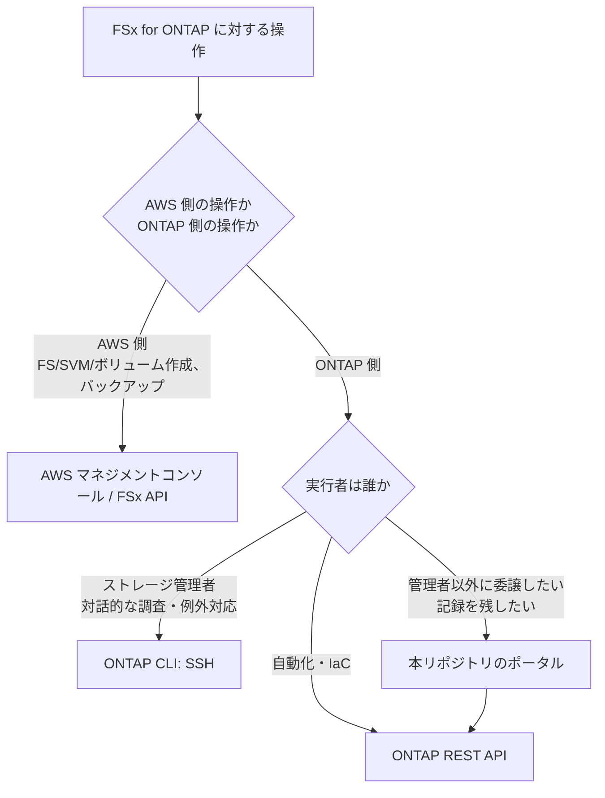

# FSx for ONTAP の管理インターフェース — 何に到達できて、何に到達できないか

> 目的: Amazon FSx for NetApp ONTAP（以降 FSx for ONTAP）を運用するときに
> 実際に使えるインターフェースを、公式ドキュメントの根拠付きで確定させます。
> 本リポジトリのドキュメント・実装・記事は、すべてこの前提で書きます。

[English](../en/fsx-ontap-management-interfaces.md)

---

## 結論

FSx for ONTAP に対して、利用者が**追加のサードパーティ SaaS を経由せずに**到達できる管理インターフェースは次の 3 つです。

| インターフェース | 経路 | 到達範囲 |
|-----------------|------|---------|
| AWS マネジメントコンソール / FSx API | AWS 認証（IAM） | ファイルシステム・SVM・ボリュームの AWS 側の操作、バックアップ |
| ONTAP CLI（SSH） | ファイルシステム管理エンドポイントへ SSH | ONTAP のクラスター管理者相当の操作 |
| ONTAP REST API | 管理エンドポイントへ HTTPS | ONTAP CLI と同等の操作をプログラムから |

ONTAP CLI と REST API の**管理エンドポイントは VPC 内（または Transit Gateway でピアリングされたネットワーク）からのみ到達できます**。

**ONTAP System Manager はこの一覧に含まれません。** FSx for ONTAP で System Manager を使う経路はベンダーの SaaS コンソール経由のみで、その SaaS は FSx for ONTAP を SaaS 接続前提のモードでしか扱いません（根拠は次節）。

---

## System Manager の位置づけ（根拠）

### AWS 側の記述

AWS の機能追加アナウンス（2023 年 12 月 20 日）は、FSx for ONTAP における System Manager 対応がベンダーの SaaS 経由で提供されると明記しています。

> System Manager support is available through NetApp BlueXP for all AWS Regions where FSx for ONTAP is available. <!-- allow:vendor-ref: AWS 公式アナウンスの逐語引用 -->

出典: [FSx for NetApp ONTAP now supports using NetApp System Manager to manage your file systems](https://aws.amazon.com/about-aws/whats-new/2023/12/fsx-netapp-ontap-netapp-system-manager-file-systems/)（AWS What's New、2023-12-20）

一方、FSx for ONTAP の管理エンドポイントについて AWS が案内しているのは SSH による ONTAP CLI と REST API で、System Manager の Web UI ではありません。エンドポイントの到達範囲についても次のように書かれています。

> You can reach the endpoints only from within the virtual private cloud (VPC) or through an AWS Transit Gateway peered network.

出典: [How do I use the NetApp ONTAP CLI to modify storage data tiering policies for my FSx for ONTAP volume?](https://repost.aws/knowledge-center/fsx-ontap-modify-data-tiering)（AWS re:Post ナレッジセンター）

### ベンダー SaaS 側のデプロイモード

そのベンダー SaaS には接続要件の異なる 3 つのデプロイモードがありますが、**FSx for ONTAP を管理対象にできるのは SaaS 接続を前提とする standard モードだけ**です。ベンダー自身の比較表では、restricted モードと private モードのいずれにおいても Amazon FSx for ONTAP は「No」と明記されています。

| 管理対象 | standard（SaaS） | restricted | private |
|---------|:---------------:|:----------:|:-------:|
| Amazon FSx for ONTAP | 対応 | **非対応** | **非対応** |
| オンプレミス ONTAP クラスター | 対応 | 対応 | 対応 |
| Cloud Volumes ONTAP | 対応 | 対応 | 対応 |

standard モードは、同じ表で次の条件が付きます。

- SaaS アプリケーションへの接続が**必須**
- UI は SaaS アプリケーション（公開インターネット経由）から利用
- API エンドポイントは SaaS 側の単一エンドポイント
- 認証は SaaS 側の認証サービスまたは ID フェデレーション

出典: [Learn about NetApp Console deployment modes](https://docs.netapp.com/us-en/bluexp-setup-admin/concept-modes.html)（ベンダー公式ドキュメント、2026-05-28 版） <!-- allow:vendor-ref: 制約の根拠として参照 -->

### したがって

ストレージ管理の経路にサードパーティ SaaS を置けない体制では、FSx for ONTAP に対して System Manager を使う選択肢が**存在しません**。air-gapped 相当の運用に寄せるための restricted / private モードは、FSx for ONTAP を管理対象に含まないためです。

---

## 本リポジトリの方針

ストレージ管理の経路に追加のサードパーティ SaaS を置かない前提で、**AWS ネイティブな仕組みと ONTAP 自身の API に統一**します。

| やりたいこと | 本リポジトリで使う仕組み |
|-------------|------------------------|
| メトリクスの蓄積・アラート | Amazon CloudWatch |
| ONTAP の設定・状態取得 | ONTAP REST API（VPC 内 Lambda 経由） |
| 階層化 | FabricPool |
| データ移行・同期 | AWS DataSync |
| バックアップ・複製・クローン | Snapshot / FlexClone / SnapMirror |
| ファイルアクセスイベント | FPolicy → EventBridge |

これは**優劣の判断ではなく、データとサービスのレジデンシーに関する制約からの帰結**です。管理経路にサードパーティ SaaS を含められる体制であれば、ベンダーのコンソールは有効な選択肢になり得ます。本リポジトリのパターンは、その前提を置けない環境でも成立することを目的にしています。

> **レジデンシーに関する補足**: standard モードの SaaS は公開インターネット経由で提供され、SaaS 側の稼働リージョンは利用者が選択できません。管理経路にどの事業者のどのリージョンが入るのかを審査する体制では、この点が判断材料になります。SaaS 事業者の AWS アカウントとの信頼関係の具体的な構成（対象アカウント、リージョン、外部 ID の扱い）は、導入を検討する時点でベンダーに直接確認してください。本ドキュメントは公開ドキュメントで確認できる範囲のみを根拠にしています。

---

## よくある誤解

### 誤解 1: 「System Manager に VPN で繋げば FSx for ONTAP を管理できる」 <!-- drift-exempt: 正すために誤解そのものを見出しに引用している -->

これはオンプレミスの ONTAP クラスターの話です。オンプレミスであれば、クラスター管理 LIF に到達できるネットワークから System Manager の Web UI を直接開けます。FSx for ONTAP の管理エンドポイントが提供するのは SSH（ONTAP CLI）と REST API で、System Manager の Web UI はここにありません。

到達性の軸で本リポジトリのポータルと比較すべき相手は、**System Manager ではなく ONTAP CLI と REST API** です。

### 誤解 2: 「ONTAP のアップグレードやディスク交換は System Manager の担当範囲」

FSx for ONTAP では、ONTAP のバージョン管理・ノード・ディスク・シェルフは AWS が運用します。利用者側の操作としては**存在しません**。「別の UI の担当範囲」ではなく「利用者の作業ではない」が正しい整理です。

### 誤解 3: 「private モードを使えば SaaS 依存を切れる」

private モードは SaaS への接続を必要としませんが、**FSx for ONTAP を管理対象に含みません**（前掲の比較表）。SaaS 依存を切ると FSx for ONTAP が対象外になる、という関係です。

### 誤解 4: 「ポータルの利点は VPN が不要なこと」

VPN の有無は本質ではありません。ONTAP CLI と REST API も VPC 内から到達できます。ポータルの利点は次の 2 点です。

- **委譲**: ストレージ管理者以外（セキュリティ、コンプライアンス、データ保護）に、クラスター管理者相当の SSH を渡さずに特定の操作だけを委譲できる
- **記録**: 誰がどの操作をいつ実行したかが Cognito の主体つきで残る

---

## インターフェースの選び方

ポータルは REST API の上に乗る層です。REST API を置き換えるものではなく、REST API を呼ぶ主体を人間の管理者から Cognito 認証つきの画面に移すためのものです。

---

## 関連ドキュメント

| ドキュメント | 内容 |
|-------------|------|
| [管理機能マップ](../../solutions/amplify-portal/docs/admin-capability-map.md) | 各インターフェースの担当範囲とポータルの実装状況 |
| [ONTAP 接続ガイド](../../solutions/amplify-portal/docs/ONTAP-CONNECTION-GUIDE.md) | VPC・シークレット・管理 LIF の配線 |
| [検証状況](../../solutions/amplify-portal/docs/verification-results.md) | どの機能がどの水準まで確認済みか |
| [代替手段の比較](../comparison-alternatives.md) | S3 AP / EFS / NFS / DataSync と読み取りキャッシュの選択 |
| [ONTAP 連携メモ](../ontap-integration-notes.md) | NAS 併用、ID、データ保護、OT |
