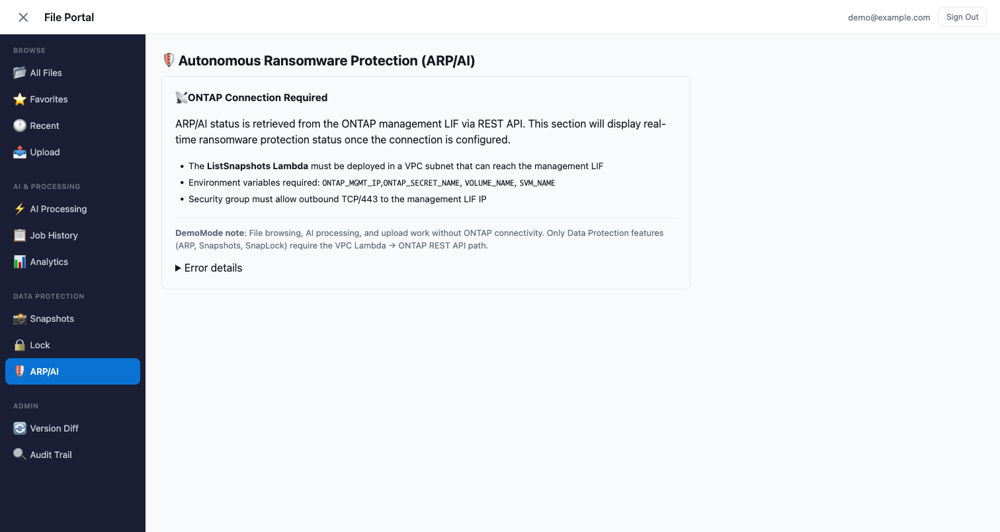
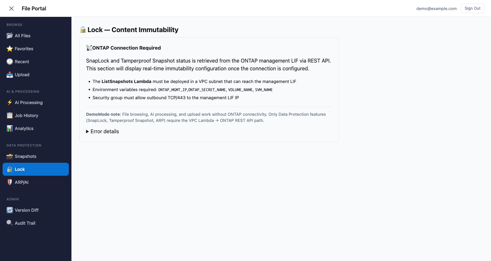
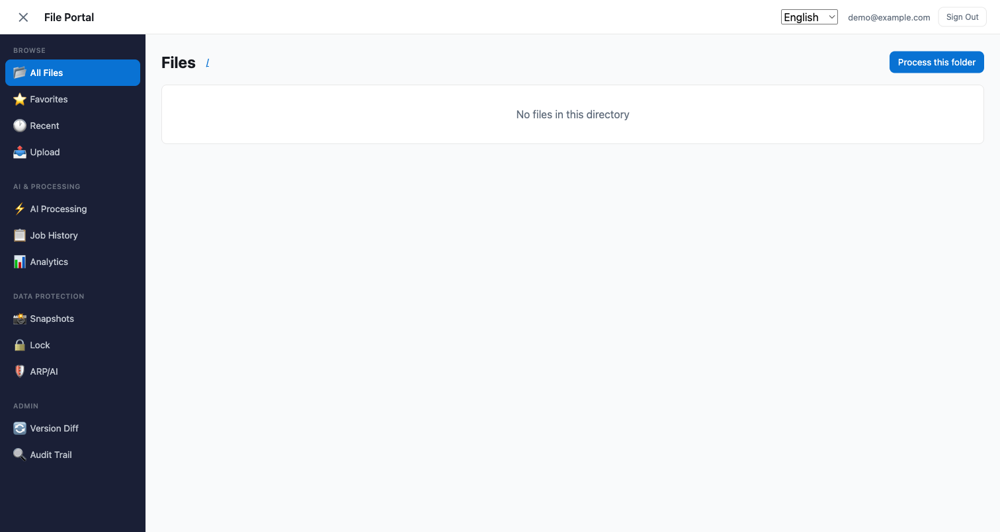
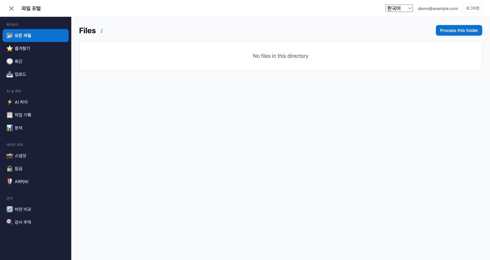
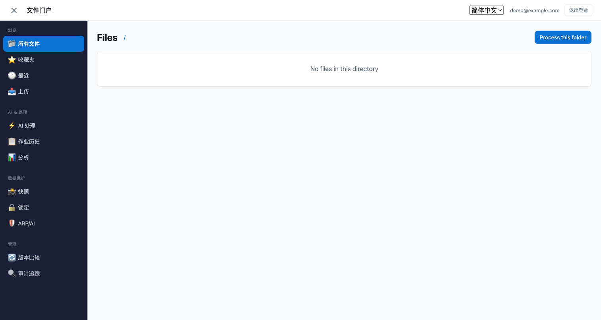

# ファイルポータル デモガイド — FSx for ONTAP S3 Access Points

> 🌐 言語: **日本語** | [English](../en/portal-demo-guide.md)

NAS データに対して Web ブラウザからファイル閲覧・アップロード・AI 分析・処理起動を行うファイルポータルのデモ手順です。

Box、Google Drive、SharePoint 等の SaaS ファイル管理と同等の体験を、FSx for ONTAP ボリューム上のデータに対して提供します。データのコピーは不要 — NFS/SMB で書き込んだファイルがそのままブラウザから操作可能です。

---

## デモ環境のセットアップ (約 15 分)

### 前提条件

- FSx for ONTAP ファイルシステム (ONTAP 9.14.1+)
- S3 Access Point が AVAILABLE (Internet-origin)
- Node.js 18.17+
- AWS CLI v2 (認証設定済み)

### セットアップ手順

```bash
cd solutions/amplify-portal

# 1. 依存関係インストール
make install

# 2. 設定ファイル作成
cp amplify/portal-config.example.ts amplify/portal-config.ts
# → s3ApAlias に S3 AP alias を設定

# 3. フロントエンド設定 (Upload タブ用)
# src/portal-settings.ts を編集:
#   region: "ap-northeast-1"
#   accountId: "あなたの AWS アカウント ID"
#   s3ApAlias: "同じ S3 AP alias"

# 4. バックエンドデプロイ (~5 分)
make sandbox

# 5. Cognito ユーザー作成
USER_POOL_ID=$(python3 -c "import json; print(json.load(open('amplify_outputs.json'))['auth']['user_pool_id'])")
aws cognito-idp admin-create-user \
  --user-pool-id "$USER_POOL_ID" \
  --username "demo@example.com" \
  --temporary-password "TempPass1!" \
  --user-attributes Name=email,Value=demo@example.com Name=email_verified,Value=true \
  --message-action SUPPRESS
aws cognito-idp admin-set-user-password \
  --user-pool-id "$USER_POOL_ID" \
  --username "demo@example.com" \
  --password "Demo1234!" --permanent

# 6. 開発サーバー起動
make dev
# → http://localhost:5173 をブラウザで開く
```

---

## デモフロー

### 1. ログイン

Cognito 認証画面で作成したユーザーでログインします。


> Box や Google Drive のログインと同様のフローです。本番環境では SAML/OIDC による企業 SSO 統合が可能です。

---

### 2. Files タブ — フォルダナビゲーション

ログイン後、Files タブに FSx for ONTAP ボリュームのフォルダ構造が表示されます。


フォルダをクリックすると中身を表示。ブレッドクラムで階層を辿れます。


> NFS/SMB でボリュームに配置したフォルダ・ファイルがそのまま表示されます。データのコピーや同期は不要です。

---

### 3. Files タブ — 共有リンク生成

ファイルの 🔗 アイコンをクリックすると、有効期限付きの共有リンク (Presigned URL) を生成できます。


- 有効期限: 5 分 / 15 分 / 1 時間 / 6 時間から選択
- URL をコピーして共有相手に送信 — ログイン不要でファイルにアクセス可能
- 有効期限を過ぎると URL は無効化される

> Box の「共有リンク」や Google Drive の「リンクを知っている全員」と同等の機能です。

---

### 4. Files タブ — AI アシスタント

画面右側の AI パネルでファイルについて質問できます。


ファイルをクリックで選択 → 質問を入力 → Bedrock (Nova Lite) が回答を生成。

例:
- 「この契約書の更新期限はいつ？」
- 「このログファイルのエラー原因は？」
- 「この CSV の統計サマリーを出して」

---

### 5. Upload タブ — Storage Browser

Upload タブでは Storage Browser for S3 を使って、ブラウザからファイルをアップロード・管理できます。


S3 AP alias をクリックするとフォルダ一覧に遷移。ドラッグ＆ドロップでアップロード、ファイル選択でダウンロードが可能です。

> **アップロードしたファイルは即座に NFS/SMB から参照可能** — ONTAP の strong consistency により、プロトコルを跨いでも書き込み直後に最新データが見えます。

---

### 6. Process タブ — AI/ML ワークフロー起動

NAS データに対して AI/ML 処理パイプラインを起動できます。


- パターン選択 (UC1 Legal Compliance, UC6 EDA 等)
- 対象フォルダを指定 (S3 AP パス)
- Start Processing で Step Functions ワークフロー起動

> 初回デプロイ時は Step Functions ARN が未設定のため、赤いバナーが表示されます。UC パターンをデプロイするか `make sfn-test-create` でテスト用ワークフローを作成してください。

---

### 7. Results / History タブ

**Results**: 実行中のジョブのリアルタイムステータス表示。


**History**: 過去に実行した全ジョブの一覧。


---

### 8. Analytics タブ — SQL クエリ

Athena + Glue Data Catalog を使って、NAS データに対して SQL クエリを実行できます。


---

### 9. モバイル対応

レスポンシブデザインにより、タブレット・スマートフォンからもアクセス可能です。


---

### 10. 新機能: お気に入り / バージョン履歴 / 監査証跡

#### お気に入り (★ タブ)

ファイルをブックマークして素早くアクセスできます。


> Box の「お気に入り」や Google Drive の「スター付き」と同等の機能です。ファイル一覧の各ファイルに ☆ ボタンが表示されます。

#### バージョン履歴 (Versions タブ)

ONTAP Snapshot に基づくポイントインタイム履歴。過去の状態を閲覧・復元できます。


> Google Drive の「バージョン履歴」や SharePoint の「バージョン管理」と同様の用途ですが、ファイル単体ではなくボリューム全体のスナップショットに基づいています。FlexClone で即座に過去のデータにアクセスできます。

#### 監査証跡 (Audit タブ)

CloudTrail S3 データイベントを Athena でクエリし、ファイルアクセス履歴を表示します。


> 「誰が、いつ、どのファイルにアクセスしたか」をコンプライアンス担当者に提示できます。日付範囲・ファイルパス・操作種別でフィルタリング可能。

#### 最近のファイル (Recent セクション)

最近閲覧・ダウンロード・AI 質問したファイルを一覧表示します。


> Google Drive の「最近使用したアイテム」や Box の「最近」と同等の機能です。各エントリにアクション種別（閲覧/ダウンロード/AI Q&A）、相対時間（2 分前、3 時間前）を表示。クリックで All Files の該当ファイルにナビゲートします。データはユーザーごとに独立（DynamoDB, owner-scoped）。

#### Office ファイルプレビュー (All Files セクション)

PDF と DOCX をダウンロードせずにブラウザ内でプレビューできます。


> `.pdf` ファイルの横に 📕 アイコンが表示されます。クリックするとブラウザ内蔵 PDF ビューアでインラインプレビューが開きます（iframe + Presigned URL）。`.docx` ファイルには 📝 アイコンが表示され、docx-preview ライブラリでクライアントサイドレンダリングされます。

| ファイル形式 | プレビュー方式 | アイコン |
|------------|--------------|:---:|
| PDF | ブラウザ内蔵ビューア (iframe + Presigned URL) | 📕 |
| DOCX | docx-preview ライブラリによるクライアントサイドレンダリング | 📝 |
| 画像 | Presigned URL ポップオーバー（既存） | 🖼️ |
| その他 | ダウンロードリンク | 📄 |

> ファイル名横の 📕 / 📝 アイコンをクリックするとインラインプレビューが開きます。PDF はネイティブ表示、DOCX のレイアウト再現度は約 70-80% です。XLSX/PPTX は現時点ではダウンロードして開いてください（Phase 2 でサーバーサイド変換対応予定）。

#### FlexClone 復元 (FC7 パターン)

特定の Snapshot から FlexClone を作成し、過去のデータに即座にアクセスします。

1. **All Files** で **📸 Restore from Snapshot** をクリック
2. Snapshot 名を入力（例: `daily.2026-07-21_0010`）
3. **Create FlexClone** をクリック
4. FlexClone ボリューム + S3 AP が数秒で作成される
5. **Job History** で結果を確認

> `FC7_FLEXCLONE_RESTORE` パターンを使用。FlexClone はスペース効率が高く（変更ブロックのみストレージを消費）、不要になったら削除できます。

---

### 11. Data Protection — ONTAP リアルタイム監視

これらのセクションは VPC Lambda 経由で ONTAP REST API をクエリし、データ保護のライブステータスを表示します。

> **DemoMode 補足**: ONTAP 接続がない場合、これらのセクションは接続手順を案内する info パネルを表示します。ファイル閲覧・AI 処理・アップロードなどの他機能は ONTAP 無しで動作します。

#### ARP/AI — ランサムウェア保護ステータス

**Data Protection → ARP/AI** に移動。



ONTAP 接続時に表示される情報:
- **ARP 状態**: enabled / dry_run（学習中）/ paused / disabled
- **脅威レベル**: none 🟢 / low 🟡 / moderate 🟠 / high 🔴
- **自動 Snapshot**: 脅威検知時に不変 Snapshot を自動作成するかどうか

> ARP/AI は機械学習でファイルエントロピー、拡張子変更、アクセスパターンを監視します。ランサムウェアのような活動を検知すると、改ざん不可な Snapshot を自動作成します。

#### Lock — SnapLock + Tamperproof Snapshot

**Data Protection → Lock** に移動。



ONTAP 接続時に表示される情報:
- **SnapLock タイプ**: Compliance（削除不可）/ Enterprise（特権削除可）/ Non-SnapLock
- **保持ポリシー**: Default / Min / Max 期間
- **Snapshot Locking**: Tamperproof Snapshot がボリュームで有効かどうか
- **S3 Object Lock**: 出力バケットの WORM 設定

> 3 層の不変性を統合表示: SnapLock（ファイルレベル WORM）、Tamperproof Snapshot（リカバリポイント保護）、S3 Object Lock（AI 出力アーカイブ保護）。

#### Tamperproof Snapshot — 個別 Snapshot のロック

**Data Protection → Snapshots** に移動。

Snapshot テーブルの Lock 列:
- 🔐 = ロック済み（有効期限表示）
- 🔓 = 未ロック（削除可能）

storage-admin ユーザーの場合、未ロック Snapshot の隣に **🔒 Lock** ボタンが表示されます:
1. **🔒 Lock** をクリック
2. 保持期間を入力（1-365 日）
3. 確認 → 有効期限まで改ざん不可になる

> ロックされた Snapshot は、クラスタ管理者であっても保持期間満了まで**削除不可**です。インサイダー脅威やバックアップ削除を狙うランサムウェアからリカバリポイントを保護します。

**前提条件**: ボリュームで Snapshot Locking が有効であること（`volume modify -volume <vol> -snapshot-locking-enabled true`）。Lock セクションで有効/無効を確認できます。

---

### 12. 言語切り替え — 8 ヶ国語対応

ポータルは 8 言語に対応しており、右上のドロップダウンから即座に切り替えられます。

#### 対応言語

| コード | 表示名 | 自動検知 |
|--------|---------|:--------:|
| ja | 日本語 | ✅ `ja-*` |
| en | English | ✅ `en-*` |
| ko | 한국어 | ✅ `ko-*` |
| zh-CN | 简体中文 | ✅ `zh-CN`, `zh` |
| zh-TW | 繁體中文 | ✅ `zh-TW`, `zh-Hant` |
| fr | Français | ✅ `fr-*` |
| de | Deutsch | ✅ `de-*` |
| es | Español | ✅ `es-*` |

#### 動作の仕組み

1. **初回アクセス**: ブラウザの言語設定（`navigator.language`）から最も近い言語を自動選択
2. **手動切り替え**: トップバーの言語ドロップダウンをクリックして任意の言語を選択
3. **永続化**: 選択は `localStorage` に保存され、次回訪問時にも同じ言語が適用
4. **即時反映**: ページリロード不要 — 全ラベルが瞬時に更新

#### スクリーンショット

**日本語（ブラウザ言語から自動検知）**:


**English**:



**한국어（韓国語）**:



**简体中文（簡体字中国語）**:



> サイドバーのナビゲーションラベル、グループヘッダー、トップバーのタイトル、サインアウトボタンがすべて翻訳されます。技術用語（ONTAP, SnapLock, FlexClone, ARP/AI, S3 AP）は製品名・技術名のため全言語で英語のままです。

---

## 環境削除

デモ終了後は以下の順序で削除します:

```bash
# 1. Amplify sandbox (Cognito, AppSync, Lambda, DynamoDB)
make sandbox-delete

# 2. S3 Access Point (作成した場合)
aws fsx detach-and-delete-s3-access-point \
  --name portal-demo-eda \
  --region ap-northeast-1

# 3. (オプション) テストデータ
# NFS/SMB 経由で配置したテストファイルは手動削除
```

> sandbox-delete は全リソースを完全削除します。ユーザーアカウント・ジョブ履歴は全て失われます。

---

## よくある質問

**Q: Files タブに "No files" と表示される**
A: `portal-config.ts` の `s3ApAlias` が空。S3 AP alias を設定して `make sandbox` を再実行。

**Q: Upload タブで AccessDenied が出る**
A: `src/portal-settings.ts` の `s3ApAlias` と `accountId` を確認。サンドボックスの再デプロイ (`make sandbox`) で IAM 権限が自動設定されます。

**Q: Process タブで赤いバナーが出る**
A: Step Functions ARN が未設定。`make sfn-test-create` でテスト用ワークフローを作成し、`portal-config.ts` と `start-processing.js` に ARN を設定。

**Q: FSx for ONTAP がなくても試せる？**
A: はい。`s3ApAlias` に通常の S3 バケット名を設定すれば DemoMode で動作します。ただし NFS/SMB の同時アクセスは確認できません。

---

## 本番デプロイ (Amplify Hosting)

ローカル開発ではなく、チームで共有可能な HTTPS URL でホスティングする場合:

```bash
# 1. プロダクションビルド
cd solutions/amplify-portal
npx vite build

# 2. Amplify Hosting にデプロイ
aws amplify create-app --name "your-portal-name" --region ap-northeast-1
aws amplify create-branch --app-id <APP_ID> --branch-name main
aws amplify create-deployment --app-id <APP_ID> --branch-name main

# 3. dist/ を zip にしてアップロード
cd dist && zip -r /tmp/deploy.zip .
curl -T /tmp/deploy.zip "<zipUploadUrl>"

# 4. デプロイ開始
aws amplify start-deployment --app-id <APP_ID> --branch-name main --job-id <JOB_ID>
```

デプロイ完了後、`https://main.<APP_ID>.amplifyapp.com` でアクセス可能になります。


> アドレスバーが `https://` + `amplifyapp.com` ドメインになっている点に注目してください。カスタムドメイン (例: `portal.your-company.com`) も Route 53 + ACM 証明書で設定可能です。

---

## 関連リソース

- [README (セットアップ全体)](../../solutions/amplify-portal/README.md)
- [Storage Browser デモガイド](../en/storage-browser-demo-guide.md)
- [S3 AP 互換性ノート](../s3ap-compatibility-notes.md)
- [ファイルポータル UI 選択ガイド](../file-portal-amplify-gen2.md)
