# ファイルポータル デモガイド — FSx for ONTAP S3 Access Points

> 🌐 言語: **日本語** | [English](../en/portal-demo-guide.md)

NAS データに対して Web ブラウザからファイル閲覧・アップロード・AI 分析・処理起動を行うファイルポータルのデモ手順です。

Box、Google Drive、SharePoint 等の SaaS ファイル管理と同等の体験を、FSx for ONTAP ボリューム上のデータに対して提供します。データのコピーは不要 — NFS/SMB で書き込んだファイルがそのままブラウザから操作可能です。

---

## デモ環境のセットアップ (約 15 分)

### 前提条件

- FSx for ONTAP ファイルシステム (ONTAP 9.14.1+)
- S3 Access Point が AVAILABLE (Internet-origin)
- Node.js 18.17+
- AWS CLI v2 (認証設定済み)

### セットアップ手順

```bash
cd solutions/amplify-portal

# 1. 依存関係インストール
make install

# 2. 設定ファイル作成
cp amplify/portal-config.example.ts amplify/portal-config.ts
# → s3ApAlias に S3 AP alias を設定

# 3. フロントエンド設定 (Upload タブ用)
# src/portal-settings.ts を編集:
#   region: "ap-northeast-1"
#   accountId: "あなたの AWS アカウント ID"
#   s3ApAlias: "同じ S3 AP alias"

# 4. バックエンドデプロイ (~5 分)
make sandbox

# 5. Cognito ユーザー作成
USER_POOL_ID=$(python3 -c "import json; print(json.load(open('amplify_outputs.json'))['auth']['user_pool_id'])")
aws cognito-idp admin-create-user \
  --user-pool-id "$USER_POOL_ID" \
  --username "demo@example.com" \
  --temporary-password "TempPass1!" \
  --user-attributes Name=email,Value=demo@example.com Name=email_verified,Value=true \
  --message-action SUPPRESS
aws cognito-idp admin-set-user-password \
  --user-pool-id "$USER_POOL_ID" \
  --username "demo@example.com" \
  --password "Demo1234!" --permanent

# 6. 開発サーバー起動
make dev
# → http://localhost:5173 をブラウザで開く
```

---

## デモフロー

### 1. ログイン

Cognito 認証画面で作成したユーザーでログインします。

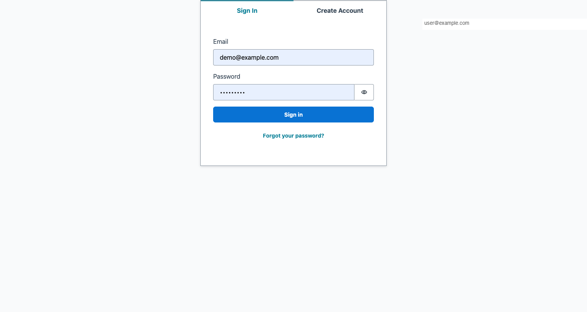

> Box や Google Drive のログインと同様のフローです。本番環境では SAML/OIDC による企業 SSO 統合が可能です。

---

### 2. Files タブ — フォルダナビゲーション

ログイン後、Files タブに FSx for ONTAP ボリュームのフォルダ構造が表示されます。

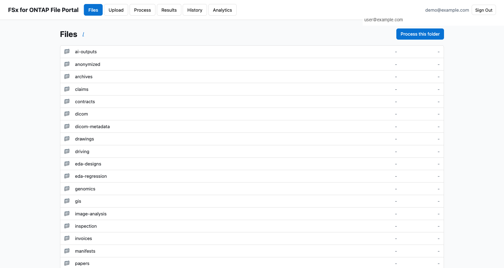

フォルダをクリックすると中身を表示。ブレッドクラムで階層を辿れます。

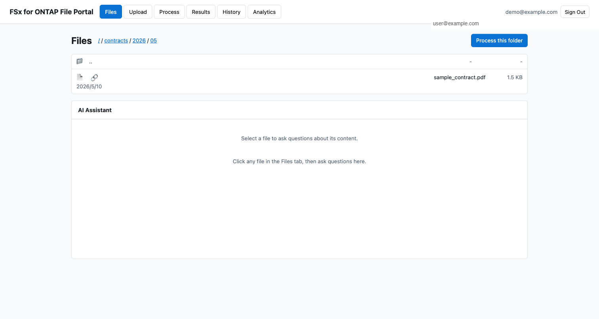

> NFS/SMB でボリュームに配置したフォルダ・ファイルがそのまま表示されます。データのコピーや同期は不要です。

---

### 3. Files タブ — 共有リンク生成

ファイルの 🔗 アイコンをクリックすると、有効期限付きの共有リンク (Presigned URL) を生成できます。

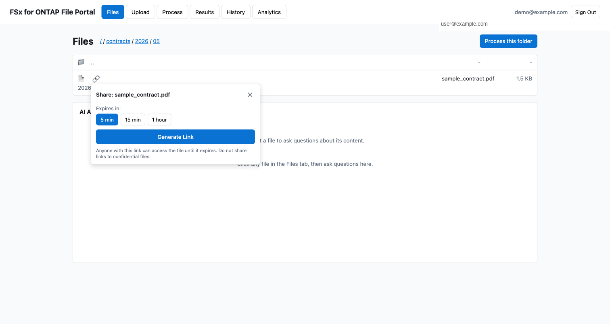

- 有効期限: 5 分 / 15 分 / 1 時間 / 6 時間から選択
- URL をコピーして共有相手に送信 — ログイン不要でファイルにアクセス可能
- 有効期限を過ぎると URL は無効化される

> Box の「共有リンク」や Google Drive の「リンクを知っている全員」と同等の機能です。

---

### 4. Files タブ — AI アシスタント

画面右側の AI パネルでファイルについて質問できます。


ファイルをクリックで選択 → 質問を入力 → Bedrock (Nova Lite) が回答を生成。

例:
- 「この契約書の更新期限はいつ？」
- 「このログファイルのエラー原因は？」
- 「この CSV の統計サマリーを出して」

---

### 5. Upload タブ — Storage Browser

Upload タブでは Storage Browser for S3 を使って、ブラウザからファイルをアップロード・管理できます。

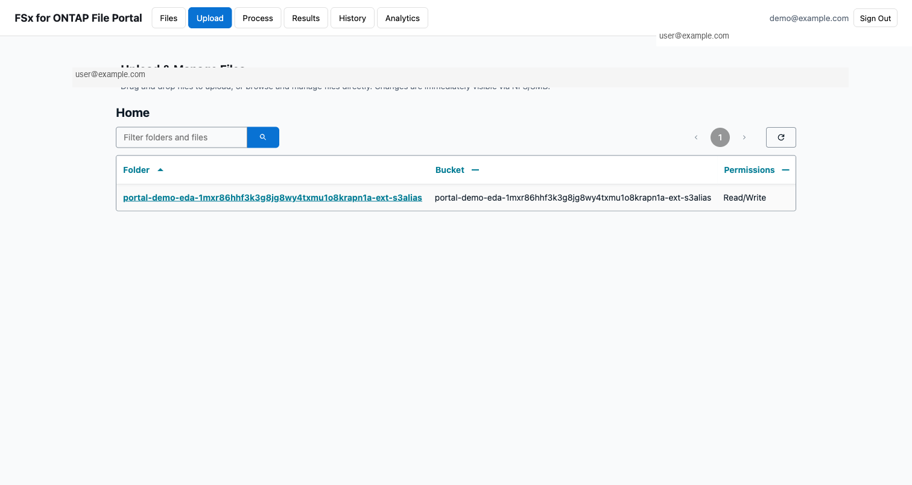

S3 AP alias をクリックするとフォルダ一覧に遷移。ドラッグ＆ドロップでアップロード、ファイル選択でダウンロードが可能です。

> **アップロードしたファイルは即座に NFS/SMB から参照可能** — ONTAP の strong consistency により、プロトコルを跨いでも書き込み直後に最新データが見えます。

---

### 6. Process タブ — AI/ML ワークフロー起動

NAS データに対して AI/ML 処理パイプラインを起動できます。

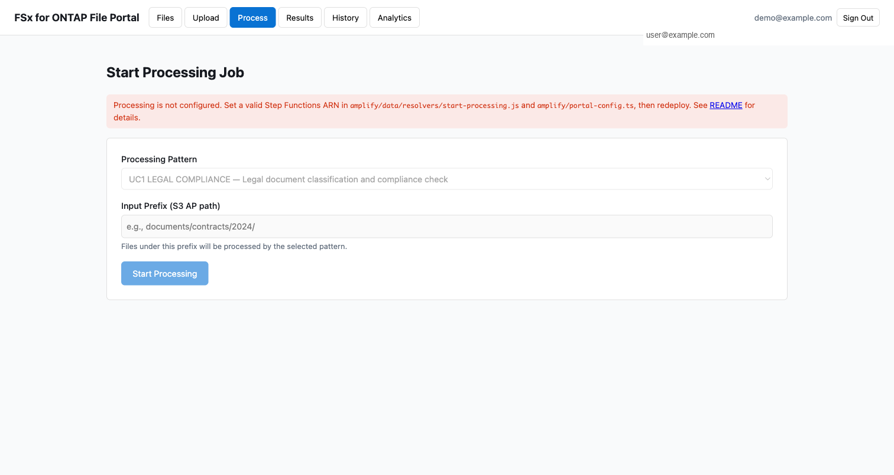

- パターン選択 (UC1 Legal Compliance, UC6 EDA 等)
- 対象フォルダを指定 (S3 AP パス)
- Start Processing で Step Functions ワークフロー起動

> 初回デプロイ時は Step Functions ARN が未設定のため、赤いバナーが表示されます。UC パターンをデプロイするか `make sfn-test-create` でテスト用ワークフローを作成してください。

---

### 7. Results / History タブ

**Results**: 実行中のジョブのリアルタイムステータス表示。

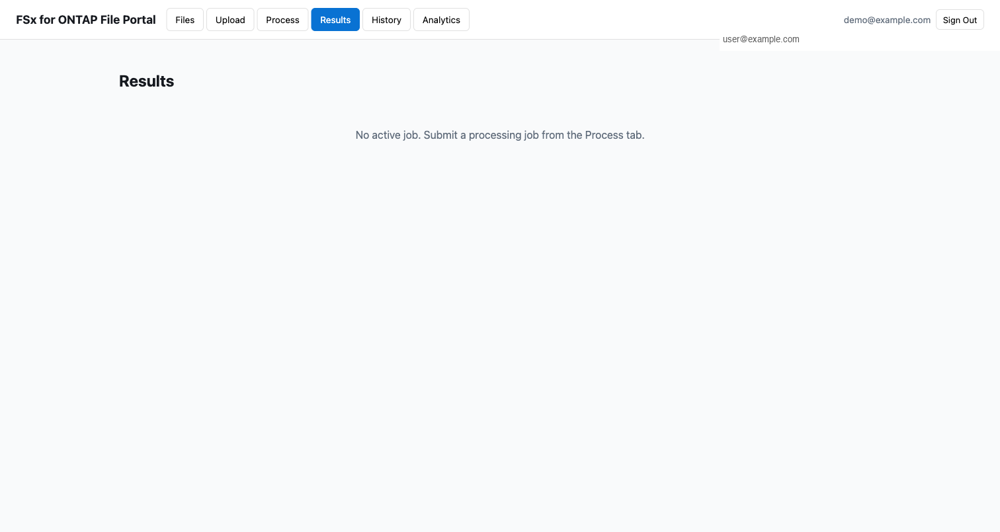

**History**: 過去に実行した全ジョブの一覧。

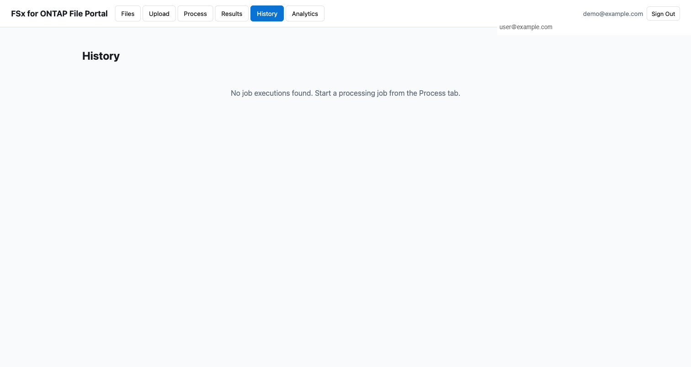

---

### 8. Analytics タブ — SQL クエリ

Athena + Glue Data Catalog を使って、NAS データに対して SQL クエリを実行できます。

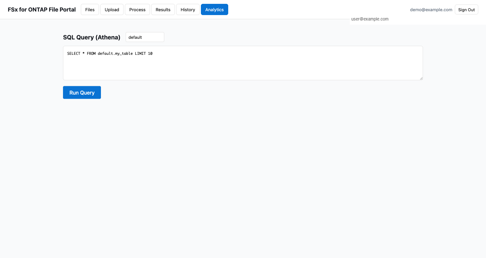

---

### 9. モバイル対応

レスポンシブデザインにより、タブレット・スマートフォンからもアクセス可能です。

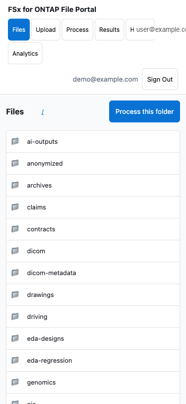

---

### 10. 新機能: お気に入り / バージョン履歴 / 監査証跡

#### お気に入り (★ タブ)

ファイルをブックマークして素早くアクセスできます。

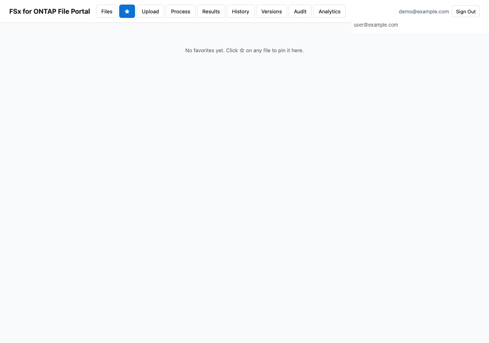

> Box の「お気に入り」や Google Drive の「スター付き」と同等の機能です。ファイル一覧の各ファイルに ☆ ボタンが表示されます。

#### バージョン履歴 (Versions タブ)

ONTAP Snapshot に基づくポイントインタイム履歴。過去の状態を閲覧・復元できます。

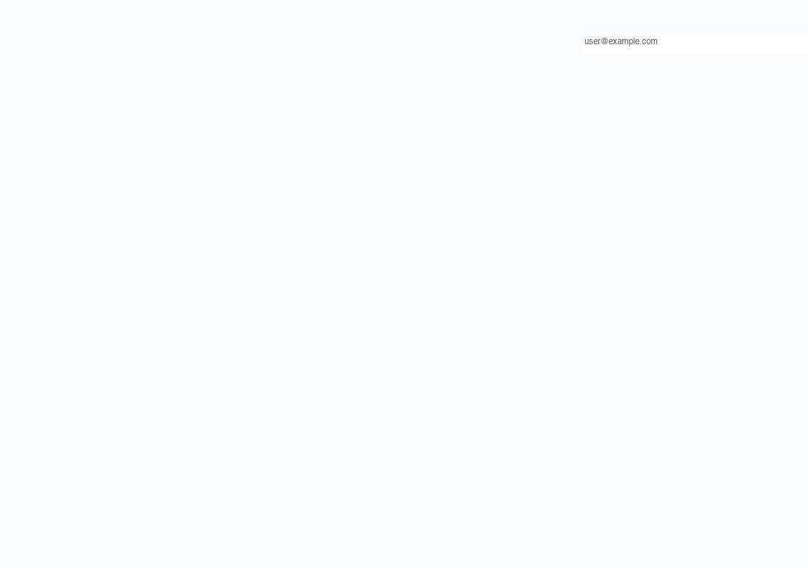

> Google Drive の「バージョン履歴」や SharePoint の「バージョン管理」と同様の用途ですが、ファイル単体ではなくボリューム全体のスナップショットに基づいています。FlexClone で即座に過去のデータにアクセスできます。

#### 監査証跡 (Audit タブ)

CloudTrail S3 データイベントを Athena でクエリし、ファイルアクセス履歴を表示します。

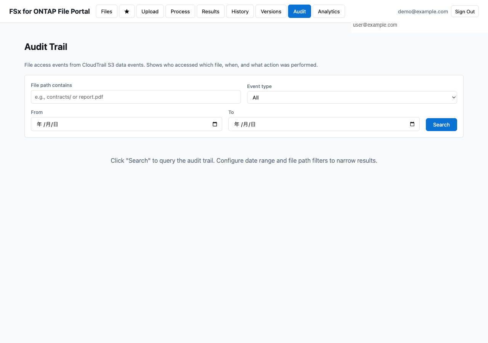

> 「誰が、いつ、どのファイルにアクセスしたか」をコンプライアンス担当者に提示できます。日付範囲・ファイルパス・操作種別でフィルタリング可能。

---

## 環境削除

デモ終了後は以下の順序で削除します:

```bash
# 1. Amplify sandbox (Cognito, AppSync, Lambda, DynamoDB)
make sandbox-delete

# 2. S3 Access Point (作成した場合)
aws fsx detach-and-delete-s3-access-point \
  --name portal-demo-eda \
  --region ap-northeast-1

# 3. (オプション) テストデータ
# NFS/SMB 経由で配置したテストファイルは手動削除
```

> sandbox-delete は全リソースを完全削除します。ユーザーアカウント・ジョブ履歴は全て失われます。

---

## よくある質問

**Q: Files タブに "No files" と表示される**
A: `portal-config.ts` の `s3ApAlias` が空。S3 AP alias を設定して `make sandbox` を再実行。

**Q: Upload タブで AccessDenied が出る**
A: `src/portal-settings.ts` の `s3ApAlias` と `accountId` を確認。サンドボックスの再デプロイ (`make sandbox`) で IAM 権限が自動設定されます。

**Q: Process タブで赤いバナーが出る**
A: Step Functions ARN が未設定。`make sfn-test-create` でテスト用ワークフローを作成し、`portal-config.ts` と `start-processing.js` に ARN を設定。

**Q: FSx for ONTAP がなくても試せる？**
A: はい。`s3ApAlias` に通常の S3 バケット名を設定すれば DemoMode で動作します。ただし NFS/SMB の同時アクセスは確認できません。

---

## 本番デプロイ (Amplify Hosting)

ローカル開発ではなく、チームで共有可能な HTTPS URL でホスティングする場合:

```bash
# 1. プロダクションビルド
cd solutions/amplify-portal
npx vite build

# 2. Amplify Hosting にデプロイ
aws amplify create-app --name "your-portal-name" --region ap-northeast-1
aws amplify create-branch --app-id <APP_ID> --branch-name main
aws amplify create-deployment --app-id <APP_ID> --branch-name main

# 3. dist/ を zip にしてアップロード
cd dist && zip -r /tmp/deploy.zip .
curl -T /tmp/deploy.zip "<zipUploadUrl>"

# 4. デプロイ開始
aws amplify start-deployment --app-id <APP_ID> --branch-name main --job-id <JOB_ID>
```

デプロイ完了後、`https://main.<APP_ID>.amplifyapp.com` でアクセス可能になります。

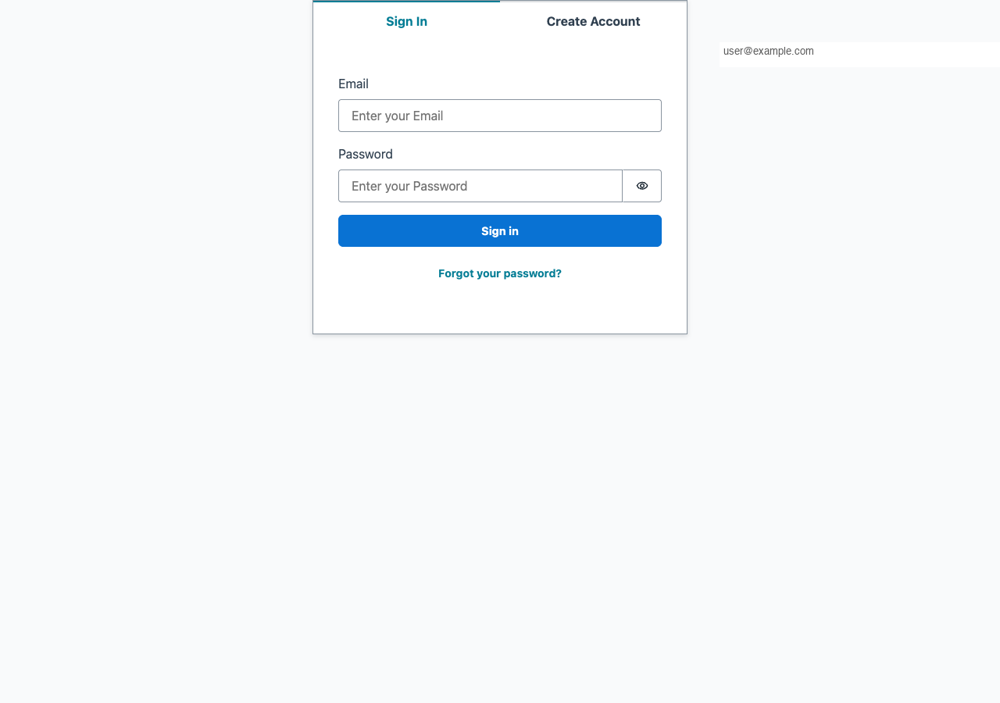

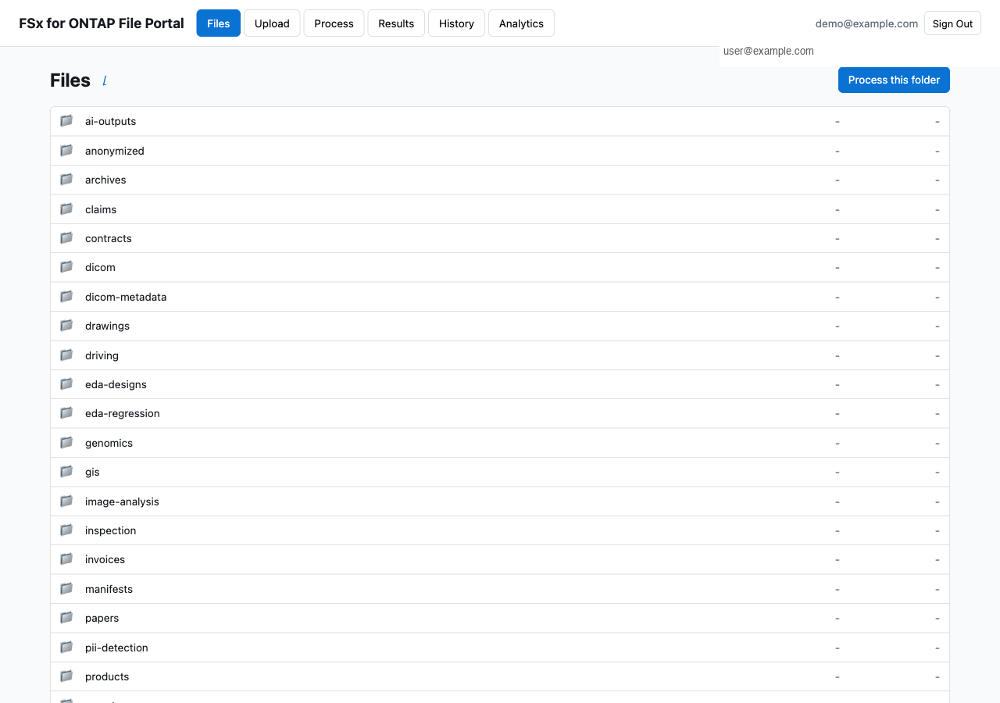

> アドレスバーが `https://` + `amplifyapp.com` ドメインになっている点に注目してください。カスタムドメイン (例: `portal.your-company.com`) も Route 53 + ACM 証明書で設定可能です。

---

## 関連リソース

- [README (セットアップ全体)](../../solutions/amplify-portal/README.md)
- [Storage Browser デモガイド](../en/storage-browser-demo-guide.md)
- [S3 AP 互換性ノート](../s3ap-compatibility-notes.md)
- [ファイルポータル UI 選択ガイド](../file-portal-amplify-gen2.md)
