# スマートフォンで使う — ファイルポータル操作ガイド

🌐 **Language / 言語**: **日本語** | [English](../en/portal-mobile-guide.md)

> スマートフォンのブラウザでファイルポータルを使う人のための手順書です。**デプロイの知識は要りません。**
> 画面を見ながら上から順にたどれるように、実際の表示を各手順に付けています。

**専用アプリはありません。** デスクトップと同じ URL をブラウザで開くだけです。iOS の Safari と Android の Chrome で確認しています。

---

## 目次

| 見たいもの | 節 |
|-----------|-----|
| とりあえず開いてサインインしたい | [1. サインインする](#1-サインインする) |
| 最初に出た案内を消したい / もう一度見たい | [初回だけ出る案内](#初回だけ出る案内) |
| 画面のどこに何があるか知りたい | [2. 画面の見取り図](#2-画面の見取り図) |
| フォルダを開きたい / ファイルを探したい | [3. フォルダをたどる](#3-フォルダをたどる) |
| 1 つのファイルを共有・改名・削除したい | [4. 1 つのファイルを操作する](#4-1-つのファイルを操作する) |
| 複数のファイルをまとめて消したい | [5. まとめて操作する](#5-まとめて操作する) |
| 写真や書類を入れたい | [6. ファイルを追加する](#6-ファイルを追加する) |
| AI に要約させたい | [7. AI に処理させる](#7-ai-に処理させる) |
| 消したファイルを取り戻したい | [8. 昔の状態を見る](#8-昔の状態を見る) |
| 表示言語やダークモードを変えたい | [9. 表示を変える](#9-表示を変える) |
| 思ったように動かない | [困ったとき](#困ったとき) |

---

## 準備するもの

| 必要なもの | 補足 |
|-----------|------|
| ポータルの URL | 管理者から受け取ります。`https://` で始まります |
| メールアドレスとパスワード | 管理者が作成したアカウント。MFA が有効な場合は認証アプリも |
| ブラウザ | iOS Safari / Android Chrome。最新版を推奨 |

**3 つとも、ポータルを用意した担当者から受け取ります。** URL だけを受け取って操作方法が分からない場合や、
アカウントがまだない場合は、担当者に依頼してください。担当者側の手順は
[引き渡しと問い合わせ対応ガイド](../../solutions/amplify-portal/docs/portal-handover-guide.md) にあります。

> **`https://` である必要があります。** ポータルはパスワードの取り扱いとコピー機能でブラウザの
> セキュア領域の機能を使うため、`http://` の URL（例: 開発機の LAN アドレス）ではサインインできません。
> **`http://` の URL を受け取った場合は、担当者に `https://` の URL を依頼してください**（利用者側では直せません）。
> 管理者向けの詳細は [Getting Started の「スマートフォン実機で確認する」](../../solutions/amplify-portal/docs/GETTING-STARTED.md#スマートフォン実機で確認する)。

---

## 1. サインインする

ブラウザで URL を開くと、この画面が出ます。

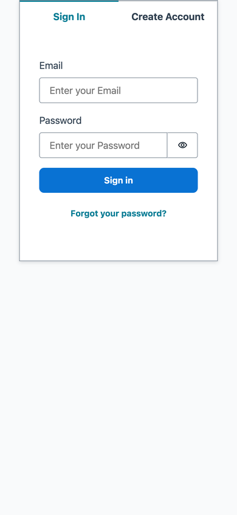

1. **Email** にメールアドレスを入力
2. **Password** にパスワードを入力（目のアイコンで入力内容を確認できます）
3. **Sign in** をタップ

パスワード管理アプリの自動入力がそのまま使えます。入力欄の文字サイズは 16px 以上にしてあるので、
タップしても画面が勝手に拡大しません。

> **この画面だけ英語表示です。** サインイン後は日本語（および他 7 言語）に切り替わります。
> サインイン画面は認証コンポーネントが提供するもので、現時点では翻訳の対象外です。
> 「Sign in」＝サインイン、「Forgot your password?」＝パスワードを忘れた場合、と読み替えてください。

### 初回だけ出る案内

サインインすると、**初回だけ**「Welcome to File Portal」という案内が画面中央に出ます。
ファイル一覧の上に重なるので、**閉じるまで一覧は操作できません。**

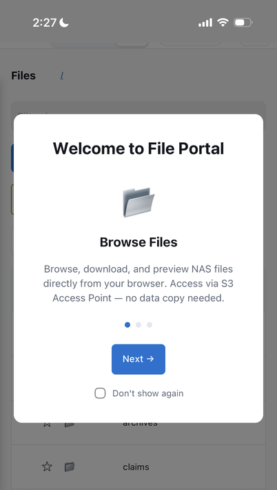

3 枚あり、ポータルでできることを順に説明します。

| 枚 | 内容 |
|----|------|
| 📂 | ファイルをブラウズする |
| ⚡ | AI に処理させる |
| 🔒 | データを保護する（スナップショット / ロック / ARP） |

| 操作 | 起きること |
|------|-----------|
| **Next →** | 次の枚へ進む。3 枚目では **Get Started 🚀** に変わり、押すと閉じる |
| **●●●**（点） | その枚へ直接移動する |
| 案内の外側（暗い部分） | 閉じる（途中でも構いません） |
| **Don't show again** | チェックしてから閉じると、次回から出なくなる |

> **「Don't show again」はブラウザごとに記憶されます。** 別の端末や別のブラウザ、
> プライベートブラウズでは再び出ます。不具合ではありません。

---

## 2. 画面の見取り図

サインインすると、ファイル一覧が開きます。

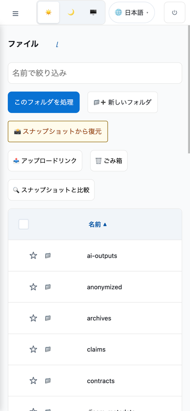

**画面の上端**に、左から順にこれだけが並んでいます。

| 表示 | 何をするか |
|------|-----------|
| **☰** | メニュー（ナビゲーション）を開く |
| ☀️ 🌙 🖥️ | 表示テーマの切り替え。→ [9 節](#9-表示を変える) |
| 🌐 日本語 | 表示言語の切り替え。→ [9 節](#9-表示を変える) |
| ⏻ | サインアウト |

**スマートフォンではメニューが最初から隠れています。** 画面が狭いため、開いたときだけ本文の上に
重なって出る形にしています。

> **上部の操作ボタンは縦に並びます。** 「このフォルダを処理」「新しいフォルダ」などが 2 個ずつ折り返すため、
> **ファイル一覧まで一度スクロールが必要**です。一覧の位置を覚えてしまえば、次からは迷いません。

> **一覧の最下行はブラウザのツールバーに隠れます。** iOS Safari と Android Chrome は画面下端に
> アドレスバーを重ねて表示するため、その裏に行が入ります。**少し下にスクロールすると
> ツールバーが縮んで見えるようになります。**ポータル側の不具合ではありません。

---

### メニューを開く・閉じる

**☰** をタップすると、メニューが左から出てきます。

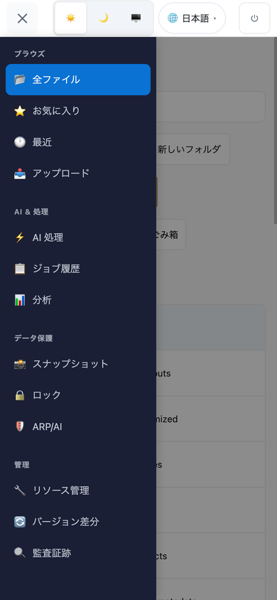

- **☰** は **✕** に変わります。もう一度タップすると閉じます
- **暗くなっている部分をタップしても閉じます**（項目を選びたくないとき）
- 端末の **戻る**ジェスチャや **Esc** キー（外付けキーボード）でも閉じます
- 項目を選ぶと、**自動的に閉じて**その画面が開きます

メニューの中身は 4 つのまとまりです。管理権限がない場合、「管理」は表示されません。

| まとまり | 主な項目 |
|---------|---------|
| ブラウズ | 全ファイル / お気に入り / 最近 / アップロード |
| AI & 処理 | AI 処理 / ジョブ履歴 / 分析 |
| データ保護 | スナップショット / ロック / ARP/AI |
| 管理 | リソース管理 / バージョン差分 / 監査証跡 |

---

## 3. フォルダをたどる

フォルダ名をタップすると中に入ります。

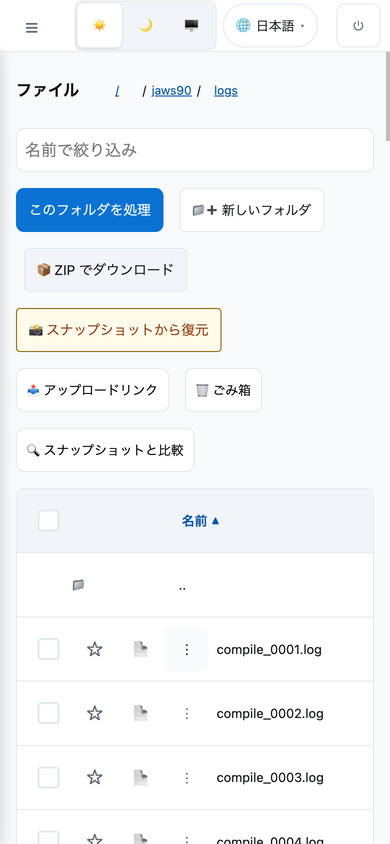

- 画面上部の **`/ jaws90 / logs`** が現在位置です。**途中のフォルダ名をタップすると戻れます**
- 一覧のいちばん上の **`..`** でも 1 つ上に戻れます
- ファイルが多いフォルダでは、下端の**「さらに読み込む」**で続きが出ます
- 名前で絞り込むときは **「名前で絞り込み」**欄に入力します（現在のフォルダ内だけを対象にします）

各行には、左から **チェックボックス** / **☆** / **ファイルアイコン** / **⋮** / **ファイル名**が並びます。

| タップする場所 | 起きること |
|--------------|-----------|
| ファイル名 | 開く（対応形式ならプレビュー、それ以外はダウンロード） |
| ファイルアイコン | ダウンロード、または AI 処理の対象として選択 |
| ☆ | お気に入りに追加・解除 |
| ⋮ | その他の操作（次節） |
| チェックボックス | まとめて操作するために選択（[5 節](#5-まとめて操作する)） |

> **画面が狭いため「サイズ」「更新日時」列は省略しています。** 並べ替えは「名前」で行えます。
> 詳しい属性を見たい場合はデスクトップで開いてください。

### 画像はアイコンの代わりに縮小画像が出る

画像ファイルの行は、アイコンではなく**中身の縮小画像**になります。開く前にどれがどれか分かります。

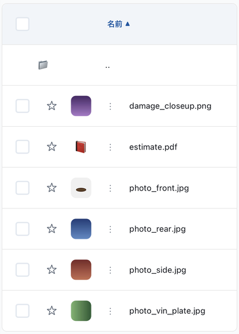

上の例では 5 件の画像に縮小画像が出ていて、`estimate.pdf` は 📕 のままです。

- **出るのは画像だけです。** PDF や文書はアイコンのままで、これは異常ではありません
- **出ないことがあります。** 対応していない形式（SVG など）、大きすぎるファイル、拡張子が画像でも中身が違うファイルは、アイコンのままになります
- **開いたときに見えるのは元の画像です。** 一覧に出ているのは表示用の縮小画像で、元のファイルは変更されません
- 縮小画像は**通信量を抑えるため**にあります。一覧を開くたびに元の画像を全部読み込むことはしません

---

## 4. 1 つのファイルを操作する

行の **⋮** をタップすると、**画面下からシートが出ます**。

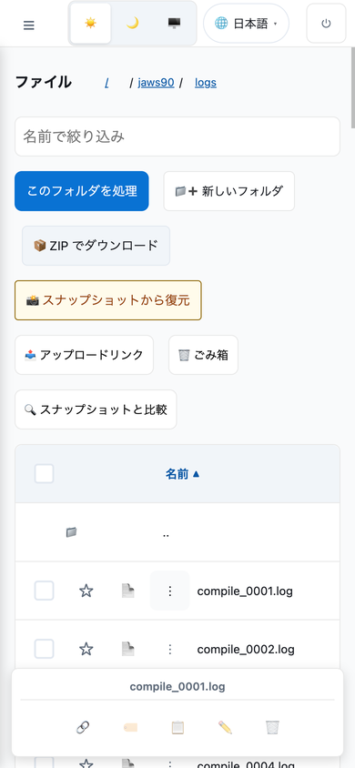

**シートの上端に対象のファイル名が出ます。** どの行に対する操作かを間違えないようにするためです。

| アイコン | 操作 |
|---------|------|
| 🔗 | 共有リンクを作る（有効期限つき） |
| 🏷️ | タグを編集する |
| 📋 | 別の場所にコピー / 移動する |
| ✏️ | 名前を変更する |
| 🗑️ | ごみ箱へ移動する |

閉じるときは、シートの外側をタップします。

> **なぜ画面下に出るのか**: 行の途中に付くドロップダウンだと、右端の操作（🗑️ など）が
> 画面の外に出てしまい**タップできませんでした**。画面下に固定すれば、行のどこを押しても
> 5 つすべてが必ず届きます。ボタンは 1 つずつ 44×44 ピクセル以上あります。

---

## 5. まとめて操作する

行左端の**チェックボックス**をタップすると、選択モードになります。

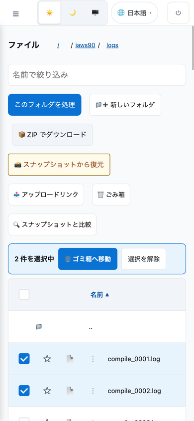

- 一覧の上に **「n 件を選択中」**と操作ボタンが出ます
- **ゴミ箱へ移動**でまとめて削除できます（ごみ箱からは戻せます）
- **選択を解除**で選択をやめます
- 表の見出しにあるチェックボックスで、**表示中のファイルすべて**を選べます

> **削除は「ごみ箱へ移動」です。** すぐに消えるわけではないので、間違えても
> 「ごみ箱」から戻せます。完全に消すのはごみ箱の中の操作です。

---

## 6. ファイルを追加する

メニューから **📤 アップロード** を選びます。

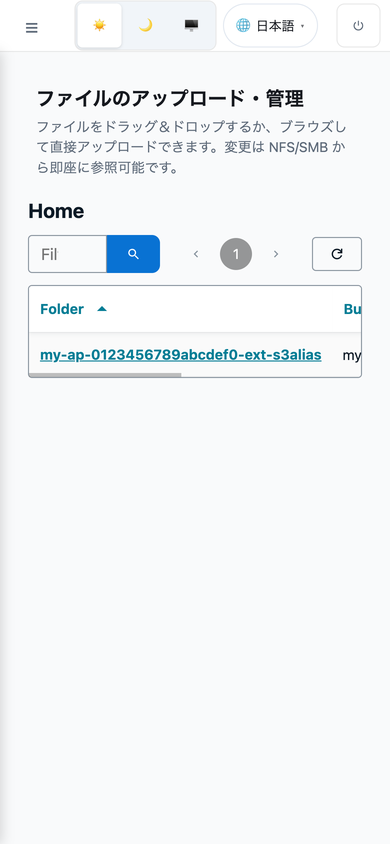

- **ファイルを選択**をタップすると、iOS/Android のファイル選択が開きます。
  「写真」「ファイル」「カメラで撮影」などから選べます
- 保存先フォルダを指定してから実行します
- 大きなファイルは分割して送るため、途中で画面を切り替えても続きます。
  ただし**ブラウザを閉じると中断します**

> **通信量に注意**: モバイル回線では、大きなファイルのアップロードとフォルダの
> ZIP ダウンロードが通信量を大きく使います。件数とサイズを確認してから実行してください。

---

## 7. AI に処理させる

メニューから **⚡ AI 処理** を選びます。

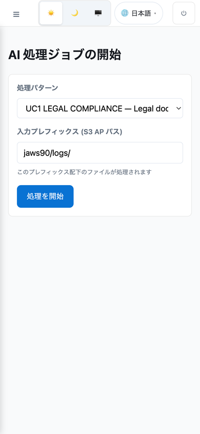

1. 対象のフォルダかファイルを指定する
2. 処理の種類を選ぶ（要約、分類、抽出など。環境によって異なります）
3. 実行する

処理は時間がかかるため、**結果は「📋 ジョブ履歴」で確認します**。実行後に画面を閉じても構いません。

> **「PHI — AI ブロック」と出たとき**: 保護対象のフォルダ（医療情報や個人情報を置く場所）にいます。
> これは設計上の意図的な制限です。保護対象外のフォルダで実行してください。

---

## 8. 昔の状態を見る

メニューから **📸 スナップショット** を選びます。ファイルを消してしまった、
上書きしてしまったときの復旧手段です。

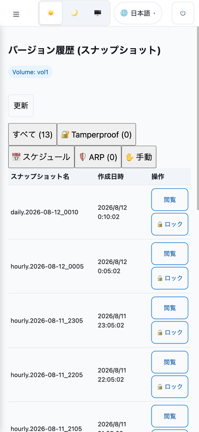

- **一覧はストレージが自動で取った「その時点の状態」です**。新しいものが上に並びます
- **閲覧**をタップすると、その時点の内容をブラウズできます（現在のファイルには影響しません）
- **🔒 ロック**は、そのスナップショットを消せなくする操作です。**取り消せません**。
  誤操作を防ぐため確認画面が出ます

> **画面が狭いため「種類」「状態」列は省略しています。** 種類は名前の先頭（`daily.` / `hourly.` /
> `weekly.`）で分かり、一覧の上のタブでも絞り込めます。

> **「ONTAP が…」というメッセージが出たとき**: ストレージへの接続に問題があります。
> 利用者側で直せるものではないので、表示された内容をそのまま管理者に伝えてください。

---

## 9. 表示を変える

### 言語

画面上端の **🌐** をタップすると、8 言語から選べます。

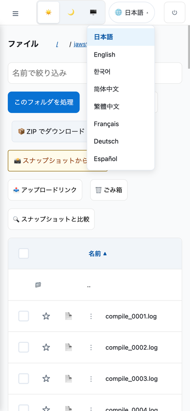

日本語 / English / 한국어 / 简体中文 / 繁體中文 / Français / Deutsch / Español

選ぶと即座に切り替わり、次回も同じ言語で開きます。

### テーマ（ライト / ダーク）

画面上端の ☀️ 🌙 🖥️ で切り替えます。

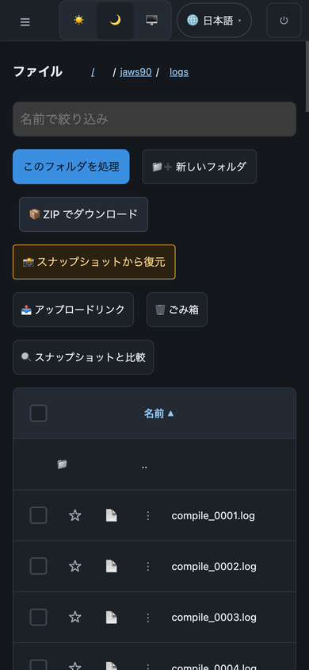

| ボタン | 意味 |
|-------|------|
| ☀️ | 常にライト |
| 🌙 | 常にダーク |
| 🖥️ | **端末の設定に合わせる** |

> **🖥️ は「PC 表示に切り替える」ボタンではありません。** 端末の外観設定に追従する、という意味です。
> iOS / Android で夜間の自動切り替えを設定している場合、それに合わせて変わります。

---

## デスクトップとの違い

| 項目 | スマートフォンでの扱い |
|------|--------------------|
| メニュー | 本文の上に重なるドロワー。**☰** で開閉。項目を選ぶと自動で閉じる |
| ファイル一覧の「サイズ」「更新日時」列 | 省略（並べ替えは「名前」で可能） |
| スナップショット一覧の「種類」「状態」列 | 省略（種類はタブで絞り込み可能） |
| 行の **⋮** メニュー | 画面下から出るシート。ファイル名が上端に出る |
| ファイルプレビュー | 画面下からのシート。PDF は横向きにすると読みやすい |
| メールアドレスの表示 | 省略（サインアウトはアイコンのみ） |
| AI アシスタントパネル | 右からの引き出し |
| 上部の操作ボタン | 2 個ずつ折り返して縦に並ぶ |

---

## 困ったとき

**Q: サインインできない。「Sign in」を押しても進まない。**
A: URL が `https://` で始まっているか確認してください。`http://` ではサインインに必要な
ブラウザ機能が使えません。それでも進まない場合はパスワードを確認し、
管理者にアカウントの状態を確認してもらってください。

**Q: メニューが出てこない。**
A: 画面左上の **☰** をタップしてください。スマートフォンではメニューは最初から隠れています。

**Q: 一覧が空に見える。**
A: 上部の操作ボタンが縦に並ぶため、ファイル一覧はその下にあります。下にスクロールしてください。

**Q: 一覧の最後の行が画面下端に隠れて読めない。**
A: ブラウザのアドレスバーが重なっています。少し下にスクロールするとアドレスバーが縮みます。

**Q: 最初に出た案内をもう一度見たい。**
A: 「Don't show again」にチェックを入れて閉じた場合、同じブラウザでは出ません。
別のブラウザ、またはプライベートブラウズで開くと再び表示されます。

**Q: ファイル名をタップしたのにプレビューが出ず、ダウンロードされた。**
A: プレビューに対応していない形式です。画像・PDF・テキストは画面内で開き、
それ以外はダウンロードになります。

**Q: 行の操作（共有、改名、削除）が見つからない。**
A: 行の **⋮** をタップしてください。画面下にシートが出ます。

**Q: 一部の画面に「ONTAP 接続が必要」「ONTAP が認証情報を拒否しました」などと出る。**
A: ストレージへの接続の問題で、利用者側では直せません。表示されている見出しと
「エラー詳細」の内容をそのまま管理者に伝えてください。管理者はその文言から原因を特定できます。

**Q: 画面が横に切れて、ボタンに届かない。**
A: 不具合です。どの画面のどのボタンかを添えて報告してください。
スマートフォン幅では横スクロールが起きないよう設計しています。

**Q: 文字が小さい。**
A: ブラウザのピンチ操作で拡大できます。入力欄は 16px 以上にしてあるため、
タップしただけでは拡大しません。

### 担当者に連絡するときに添えるもの

上の表で解決しない場合、**この 4 つがあれば担当者はほぼ即座に切り分けられます。**
スクリーンショット 1 枚でも構いません。

1. **どの画面か**（左メニューの項目名。例: 「スナップショット」）
2. **画面に出ている見出しと本文をそのまま**（言い換えないでください。原因の分類がこの文言に入っています）
3. **「エラー詳細」を開いた中身**（▶ をタップすると開きます）
4. **端末とブラウザ**（例: iPhone / Safari）

> **2 と 3 が最も重要です。** ポータルは原因を分類して表示し、詳細にストレージ側のメッセージを
> そのまま出します。「エラーが出た」だけでは、担当者は 6 通りの可能性を順に潰すことになります。

---

## このガイドの検証状況

| 項目 | 状態 |
|------|------|
| 画面の表示・レイアウト | Chrome の端末エミュレーション（390×844、iPhone 相当の幅）で確認 |
| 操作の到達性（ボタンが画面内にあるか、44px 以上あるか） | 同環境で実測 |
| iPhone 実機（iOS Safari、402×874 CSS px 相当） | 下表の範囲で確認 |
| Android 実機 | **未確認** |

### iPhone 実機で確認した範囲

| 節 | 状態 |
|----|------|
| [1. サインインする](#1-サインインする) / [初回だけ出る案内](#初回だけ出る案内) | 確認 |
| [2. 画面の見取り図](#2-画面の見取り図)（上部の操作列、一覧の折り返し） | 確認 |
| [8. 昔の状態を見る](#8-昔の状態を見る)（スナップショット一覧、絞り込みタブ） | 確認 |
| [9. 表示を変える](#9-表示を変える)（8 言語メニュー、ライト / ダーク） | 確認 |
| データ保護のロック画面（3 つのタブ） | 確認 |
| リソース管理（ストレージ健全性、Qtree の一覧・作成） | 確認 |
| [3. フォルダをたどる](#3-フォルダをたどる) の画像の縮小画像（5 件表示、PDF はアイコンのまま） | 確認 |
| メニュー / フォルダ移動 / 行メニュー / 複数選択 / アップロード / AI 処理 | **エミュレーションのみ** |

**実機で 1 件の不具合が見つかり、修正しました。** リソース管理の Qtree が「読み込み中…」のまま
進まない状態でした（ボリュームが選ばれるまで待つ表示が、ボリュームを選ぶ操作そのものを
隠していたため）。実機とデスクトップの両方で起きていた不具合です。修正後、実機で
Qtree の作成と一覧表示まで確認しています。

スクリーンショットは、初回案内と画像の縮小画像のものが実機、それ以外はエミュレーション環境のものです。
実機のブラウザ UI（アドレスバーの高さなど）はこれと異なります。実機で手順どおりに動かない点が
あれば、それは報告に値する差分です。

---

## 関連ドキュメント

- [ユーザーガイド](portal-user-guide.md) — 全機能の説明（デスクトップ中心）
- [ポータル クイックリファレンス](portal-quick-reference.md) — 用語と画面の対応
- [Getting Started](../../solutions/amplify-portal/docs/GETTING-STARTED.md) — 管理者向けの導入手順
