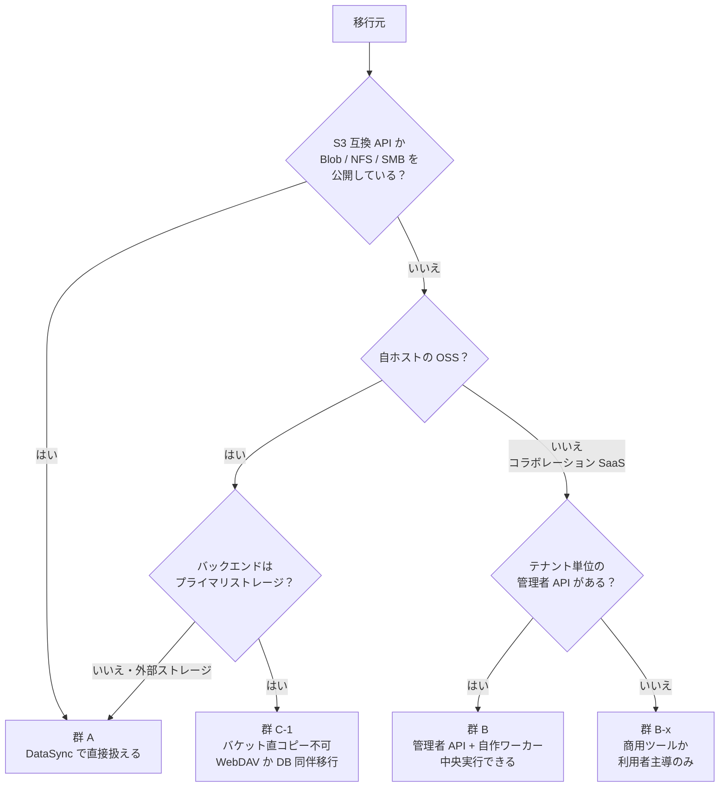
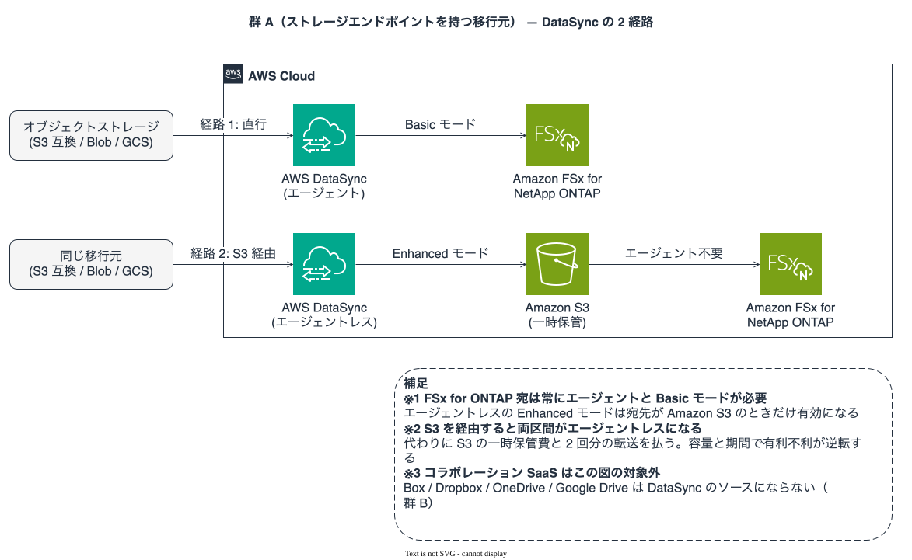
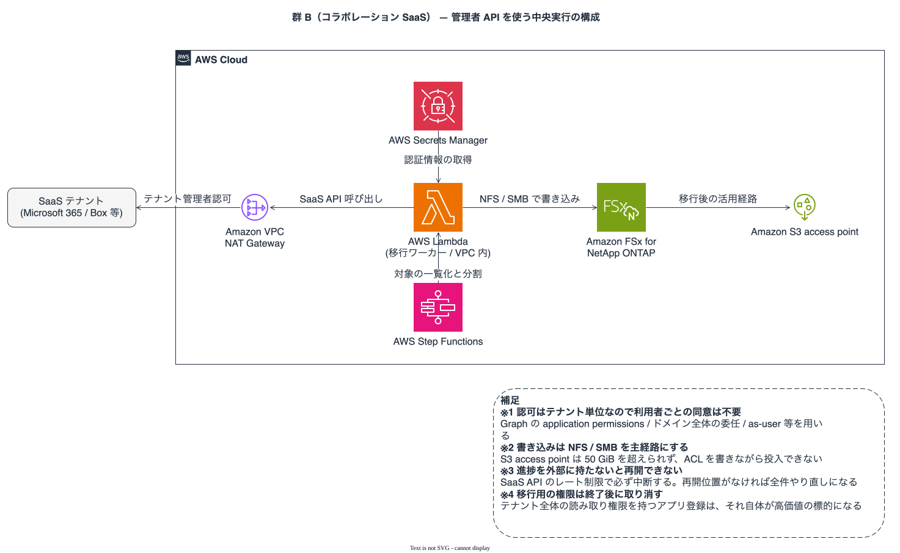

# SaaS / クラウドストレージから FSx for ONTAP への移行とデータ連携

🌐 **Language / 言語**: [日本語](../ja/saas-to-fsx-ontap-migration.md) | [English](../en/saas-to-fsx-ontap-migration.md)

Box、Dropbox、OneDrive、Google Drive、Wasabi などから Amazon FSx for NetApp ONTAP へデータを移す、あるいは移さずに連携する手段の整理。どの経路が使えてどれが使えないか、そして「インフラチームが中央で一括実行できるか」を判定基準とともにまとめます。

## 結論

3 点に要約できます。

1. **AWS DataSync が扱えるかどうかは、移行元がストレージエンドポイントを公開しているかで決まります。** Wasabi や Azure Blob のようなオブジェクトストレージは扱えます。Box や Google Drive のようなコラボレーション SaaS は扱えません。同じ「クラウドストレージ」という言葉で括られていても、DataSync から見ると別のカテゴリです。
2. **コラボレーション SaaS でも、インフラチームが中央で一括実行できます。** 主要 5 サービスすべてが、利用者の同意を要さないテナント単位の管理者認可を提供しています。利用者ごとに OAuth 同意を集める必要はありません。足りないのは SaaS 側の一括アクセス手段ではなく、**AWS 側のマネージドコネクタ**です。
3. **移行の工数の大半は転送ではなく、3 つの写像の設計です。** 権限モデル、SaaS ネイティブ形式、付随データ（バージョン履歴・コメント・共有リンク）。オンプレ NAS からの移行と決定的に違う点で、あちらは NTFS ACL をそのまま運べます。

> **鮮度に関する補足**: 本文書のサービス対応状況は 2026-08 時点の公式ドキュメントに基づきます。コネクタ対応やロケーション種別は追加される側に動くため、「未対応」と書いてある項目は実装着手前に再確認してください。確認していない項目は末尾に明記しています。

## 対象読者

- FSx for ONTAP をファイル基盤として採用し、既存の SaaS からデータを寄せたいインフラ・ストレージ担当
- 「一括移行ツールがないので利用者にやらせるしかないのか」を判断したい方
- 移行はせず、検索と AI 連携だけを横断させたい方

## まず目的を 3 つに分ける

混ざりやすく、混ざると手段の選定を誤ります。

| 目的 | AWS ネイティブの手段 | 判定 |
|---|---|---|
| ① 一括移行（バイトを FSx for ONTAP へ恒久的に移す） | 移行元による（下記の群判定） | 群 A ならあり、群 B/C は自作か商用 |
| ② 継続同期・ハイブリッド共存 | なし | SaaS 側の機能か商用ツール |
| ③ 検索・AI 連携のみ（バイトを動かさない） | **Bedrock Knowledge Bases のマネージドコネクタ** | あり |

③ を見落として ① を検討してしまうケースが多いため、先に ③ で足りるかを確認してください。詳細は[後述](#-検索ai-連携のみならバイトを動かさない選択肢がある)。

## 決定軸 — ストレージエンドポイントを公開しているか

移行元を 3 群に分けます。この分類がそのまま手段の分岐になります。

### 群 A — ストレージエンドポイントを持つ（DataSync で扱える）

> ダークテーマ: [群 A の 2 経路（ダーク）](../images/saas-migration-group-a-routes-dark.svg)

[DataSync のロケーション種別](https://docs.aws.amazon.com/datasync/latest/userguide/create-locations-cli.html)で扱えるものです。

| 移行元 | エンドポイント種別 | DataSync ロケーション | FSx for ONTAP 宛の要件 |
|---|---|---|---|
| Wasabi | S3 互換 | Object storage / other cloud storage | エージェント + Basic モード |
| Cloudflare R2 / Backblaze B2 / MinIO / DigitalOcean Spaces / OCI Object Storage | S3 互換 | 同上 | 同上 |
| Azure Blob Storage | Blob | Other cloud storage | 同上 |
| Google Cloud Storage | GCS | Other cloud storage | 同上 |
| Azure Files | SMB | SMB | エージェント必須 |
| オンプレミス NAS（ONTAP / Windows / その他） | NFS / SMB | NFS / SMB | エージェント必須 |
| オンプレミスのオブジェクトストレージ | S3 互換 | Object storage | エージェント + Basic モード |
| 別の FSx / EFS / Amazon S3 | AWS ネイティブ | ネイティブ | エージェント不要 |

**判定基準で持つこと**: ベンダー名の列挙は古くなります。**S3 互換 API を公開しているなら Object storage ロケーションで扱える**、と覚えるのが実用的です。上の表は代表例です。

**FSx for ONTAP を宛先にする場合、常にエージェントと Basic モードが必要です。** [エージェントレス（Enhanced モード）は宛先が Amazon S3 のときだけ](https://docs.aws.amazon.com/datasync/latest/userguide/creating-other-cloud-object-location.html)です。ここから 2 つの選択肢が出ます。

| 経路 | エージェント | 追加コスト | 通過回数 |
|---|---|---|---|
| 移行元 → FSx for ONTAP（直行） | 必要（EC2 / Google Compute Engine / Azure VM） | エージェントの実行費 | 1 回 |
| 移行元 → Amazon S3 → FSx for ONTAP（2 段） | **不要**（両区間エージェントレス） | S3 の一時保管費 | 2 回 |

> **コストに関する補足**: 2 段構えはエージェント運用を避けられますが、S3 の保管料と転送を 2 回払います。数 TB 規模なら 2 段のほうが総コストで有利になることがあり、数十 TB 以上ならエージェント直行が有利に傾きます。どちらが安いかは容量と期間で逆転するため、実容量で試算してください。

> **性能に関する補足**: 大量小ファイルでは DataSync のスループットはメタデータ操作に律速されます。ファイル数が数千万規模になる場合、単一タスクではなくディレクトリ単位で分割して並列実行する設計を先に決めてください。

### 群 B — コラボレーション SaaS（管理者 API で中央実行できる）

DataSync では扱えません。これらは per-user のコラボレーション API を持つだけで、ストレージエンドポイントを公開していないためです。

**ただし、利用者ごとの OAuth 同意は不要です。** 各サービスがテナント単位の管理者認可を提供しています。

> ダークテーマ: [群 B の中央実行構成（ダーク）](../images/saas-migration-group-b-worker-dark.svg)

| SaaS | 中央実行の仕組み | 利用者の同意 |
|---|---|---|
| Microsoft 365（OneDrive / SharePoint） | Microsoft Graph の **application permissions**（`Files.Read.All`、`Sites.FullControl.All`）。[同意はテナントとアプリケーションに紐づき、同意した管理者ユーザーには紐づきません](https://learn.microsoft.com/en-us/graph/permissions-overview)。[証明書ベースの認証も利用可能](https://learn.microsoft.com/en-us/sharepointmigration/migration-with-cba) | 不要 |
| Google Workspace（マイドライブ / 共有ドライブ） | サービスアカウント + **ドメイン全体の委任**。[利用者の同意を得ずに Workspace 利用者のデータへのアクセスを許可](https://support.google.com/a/answer/162106)し、任意の利用者として振る舞えます | 不要 |
| Box | 管理者またはサービスアカウント + enterprise access + [**`as-user` ヘッダ**](https://developer.box.com/guides/authentication/jwt/as-user)。ただし[外部利用者が所有するコンテンツには到達しません](https://developer.box.com/guides/authentication/jwt/as-user) | 不要 |
| Dropbox Business | チームスコープのトークン + [**`Dropbox-API-Select-User` / `Dropbox-API-Select-Admin` ヘッダ**](https://developers.dropbox.com/dbx-team-files-guide)（member file access、`team_data.member` スコープ） | 不要 |
| Egnyte | 管理者アカウント + [**User Impersonation**](https://developers.egnyte.com/docs/read/Best_Practices)。[代理実行は監査レポートに impersonated として記録されます](https://developers.egnyte.com/integration/cfs/api-docs/best-practices) | 不要 |
| Citrix ShareFile | [REST API + OAuth 2.0](https://api.sharefile.com/)（items / folders / files / users / groups へアクセス）。**テナント全体の代理実行の可否は未確認** | 要確認 |
| iCloud Drive | **法人向けの管理者コンテンツ API を確認できませんでした** | 該当なし |

> **監査に関する補足**: 代理実行は「誰が実行したか」を曖昧にします。Egnyte は impersonated として記録すると明記しています。他サービスでも監査ログに残る形式を移行前に確認し、移行ワーカー側でも独自に操作記録を残してください。移行は大量の読み取りを発生させるため、通常時の監査アラートの閾値に触れる可能性があります。

> **セキュリティに関する補足**: テナント全体の読み取り権限を持つアプリケーション登録は、それ自体が高価値の標的です。移行期間だけ有効にし、終了後に権限を取り消す運用にしてください。Microsoft Graph には[対象を絞る `Sites.Selected` 系のスコープ](https://learn.microsoft.com/en-us/graph/permissions-selected-overview)があり、段階移行では全体権限より絞った権限のほうが適します。

**Amazon AppFlow は候補になりません。** レコード指向（Salesforce や ServiceNow のフィールドマッピング）で、宛先に FSx for ONTAP がなく、確認した範囲ではこれらのファイル指向コネクタも見当たりません。

### 群 C — 自ホストの OSS（Nextcloud / ownCloud / Seafile）

ここに最も踏みやすい罠があります。

**プライマリストレージがオブジェクトストレージの場合、バケットを直接コピーしても復元できません。** [Nextcloud の公式ドキュメント](https://docs.nextcloud.com/server/latest/admin_manual/configuration_files/primary_storage.html)に明記されています — メタデータ（ファイル名、ディレクトリ構造）はデータベースにのみ保存され、オブジェクトストア側は一意識別子で本文だけを保持します。実際のバケットには `urn:oid:1004` のようなオブジェクトが並びます。

| 構成 | バケット直コピーで移行できるか |
|---|---|
| オブジェクトストレージを**プライマリストレージ**として使用 | ❌ ファイル名も階層も失われる。DB 同伴の移行か WebDAV 経由が必要 |
| オブジェクトストレージを**外部ストレージ**として接続 | ✅ 元の名前と階層が保たれるため群 A として扱える |
| ローカルファイルシステム | ✅ NFS / SMB として群 A |

Seafile はブロックレベルのデータモデルを採用しているため、同様にバックエンドを直接読んでも元のファイルには戻りません。

> **失敗時の復旧に関する補足**: この罠は「移行が失敗した」形では現れません。転送は成功し、FSx for ONTAP 上に `urn:oid:*` が並び、利用者が開けないという形で現れます。移行前に**移行元の構成（プライマリか外部か）を必ず確認**してください。判定は Nextcloud の `config.php` の `objectstore` 設定の有無で行えます。

## 移行の工数は転送ではなく 3 つの写像にあります

AWS の話ではなく、データモデルの話です。ここを設計せずに転送を始めると、移行後に破棄してやり直すことになります。

### 1. 権限モデルに対応物がない

SaaS の共有モデル（リンク共有、外部共有、共同編集者、共有ドライブ、チームフォルダ）に NTFS / UNIX ACL の写像先がありません。移行は必然的に**権限の再設計**を含みます。

これはオンプレミス NAS からの移行と決定的に違う点です。あちらは NTFS ACL をそのまま運べます（`SeBackupPrivilege` / `SeRestorePrivilege` と robocopy の `/B`。手順は [SMB ACL 移行ガイド](../smb-acl-migration-backup-operators.md)にあります）。SaaS からの移行では、**ACL は運ぶものではなく作るもの**です。

| SaaS 側の概念 | FSx for ONTAP 側の写像先 | 写像の難易度 |
|---|---|---|
| ユーザー / グループへの明示的な共有 | AD ユーザー / グループの ACL | 低（ID 基盤が同じなら機械的） |
| 共有ドライブ / チームフォルダ | 共有 + グループ ACL | 中（所有者概念が異なる） |
| リンク共有（社内） | 対応物なし | 高（要件を聞き直す。ポータルの共有リンク機能で代替可能） |
| リンク共有（社外・匿名） | 対応物なし | 高（Transfer Family か Presigned URL で再設計） |
| 期限付き共有 | 対応物なし | 高（Presigned URL の有効期限で代替） |
| ファイル単位の閲覧のみ権限 | ACL で表現可能だが粒度が異なる | 中 |

> **移行順序に関する補足**: 権限設計を後回しにして「まずデータだけ移す」と、移行直後に全ファイルが管理者のみアクセス可能な状態で置かれます。パイロット部門で権限写像を確定させてから本移行に入る順序にしてください。

### 2. SaaS ネイティブ形式にはバイト表現がない

Google Docs / Sheets / Slides、Box Notes、Dropbox Paper、OneNote は、そのままではファイルとして取得できません。API で Office 形式か PDF に**変換して初めてファイルになります**（Google Drive なら `files.export`）。

変換は不可逆です。数式の一部、コメント、変更提案、リアルタイム共同編集の履歴が落ちます。

**決めるべきこと**: 何を正本とするか。選択肢は 3 つです。

| 方針 | 得られるもの | 失うもの |
|---|---|---|
| 変換して FSx for ONTAP に置く | オフライン利用、NFS/SMB からの参照、AI 処理の対象化 | 共同編集、コメント、履歴 |
| ネイティブは SaaS に残し、それ以外を移行 | 共同編集の継続 | 2 系統の並存、どこにあるか分からなくなる |
| ネイティブは移行せず、③ の連携で検索だけ横断 | 現状維持 + 横断検索 | SaaS の契約は残る |

### 3. 付随データが落ちる

バージョン履歴、コメント、共有リンク、ゴミ箱、共有ドライブのメタデータ、監査ログ。**「ファイルが移った」と「業務が移った」は別です。**

FSx for ONTAP 側で代替できるものと、できないものがあります。

| 付随データ | FSx for ONTAP 側の代替 |
|---|---|
| バージョン履歴 | Snapshot（時点復元。ただしファイル単位の版管理とは粒度が違う） |
| ゴミ箱 | Snapshot + `.snapshot` ディレクトリからの復元 |
| コメント | 対応物なし（ポータル側の実装が必要） |
| 共有リンク | Presigned URL / Transfer Family で再設計 |
| 監査ログ | CloudTrail（S3 AP 経由のアクセス）+ ONTAP の監査設定 |

> **規模に関する補足**: バージョン履歴を全て移行すると総容量が数倍になります。「最新版のみ移行し、履歴は移行元を読み取り専用で一定期間残す」という割り切りが実務では多く選ばれます。移行元の契約終了日と、履歴の保持要件を先に突き合わせてください。

## 書き込み先の選択 — S3 AP か NFS / SMB か

一括移行では **NFS / SMB マウントを主経路にする**ほうが有利です。

| | FSx for ONTAP S3 AP | NFS / SMB |
|---|---|---|
| 単一オブジェクト上限 | 5 GiB（マルチパートで全体 50 GiB） | 上限なし |
| 50 GiB 超のファイル | 不可 | 可 |
| ACL を書きながら投入 | 不可 | 可 |
| 大量小ファイルのメタデータ操作 | 数十 ms | sub-ms |
| VPC 外から書ける | 可（Internet-origin AP） | 不可 |

さらに、S3 AP の全体上限は **`CompleteMultipartUpload` の時点、つまり全ペイロード転送後にしか判定されません**（50 GiB で約 10 分転送してから失敗します）。`UploadPart` には累積チェックがなく、Complete 側のエラーには `MaxSizeAllowed` が含まれません。**移行ワーカーではクライアント側で事前にサイズ検証してください。** 実測値と再現手順は [S3 AP オブジェクトサイズ上限の検証](../s3ap-object-size-limits-verification.md)にあります。

S3 AP は移行後の用途に向きます — サーバーレス処理、ファイルポータル、Transfer Family からのアクセス。同一ボリュームを NFS / SMB と S3 AP で同時に参照できるので、**移行は NFS / SMB で流し込み、活用は S3 AP で行う**分担が素直です。

> **運用に関する補足**: 移行ワーカーを VPC 内の Lambda / ECS に置くと NFS / SMB へ書けますが、SaaS の API へは NAT Gateway か VPC エンドポイント経由になります。Internet-origin の S3 AP は VPC 内 Lambda から到達できないため、両方を 1 つの関数で扱おうとすると詰まります。この制約は [S3 AP 互換性ノート](../s3ap-compatibility-notes.md)に整理してあります。

## ③ 検索・AI 連携のみなら、バイトを動かさない選択肢がある

[Amazon Bedrock Knowledge Bases のマネージドコネクタ](https://docs.aws.amazon.com/bedrock/latest/userguide/knowledge-base.html)は Amazon S3、SharePoint、**OneDrive**、**Google Drive**、Confluence、Web Crawler に対応し、取得時に ACL による文書単位の権限フィルタがかかります（`CreateDataSource` の `type` は `S3 | ONEDRIVE | CONFLUENCE | SHAREPOINT | WEB_CRAWLER | GOOGLE_DRIVE`）。

つまり **FSx for ONTAP を S3 AP 経由の S3 データソースとして登録すれば、移行せずに Google Drive と横断検索できます。**

| 用途 | ① 移行 | ③ 連携 |
|---|---|---|
| 横断的な自然言語検索 | 必要なし | ✅ |
| NFS / SMB から既存アプリで参照 | ✅ | ❌ |
| SaaS の契約を終了する | ✅ | ❌ |
| ランサムウェア対策・WORM 保持を FSx 側で効かせる | ✅ | ❌ |
| 着手の速さ | 遅い（数週間〜） | 速い（数日） |

> **データ主権に関する補足**: ③ でも埋め込み生成のためにコンテンツは Bedrock へ渡ります。リージョン指定とデータ処理の範囲を、移行の場合と同じ基準で評価してください。「移行しないからデータは動かない」は成立しません。

一部コネクタは preview 表記です。本番採用の前にコネクタ別の GA 状況を確認してください。

## FAQ / よくある誤解

**Q. DataSync で Google Drive を移行できますか。**
できません。DataSync のソースに含まれません。**Google Cloud Storage は含まれますが、Google Drive とは別のサービスです。** 名前が似ているだけです。

**Q. Wasabi はどうですか。**
できます。S3 互換 API を公開しているため Object storage ロケーションとして扱えます。FSx for ONTAP を宛先にする場合はエージェントと Basic モードが必要です。

**Q. 利用者ごとに OAuth 同意を集める必要がありますか。**
主要 5 サービス（Microsoft 365 / Google Workspace / Box / Dropbox Business / Egnyte）では不要です。テナント単位の管理者認可で中央実行できます。「クライアント単位の設定が必要」という前提は、これらのサービスには当てはまりません。

**Q. Nextcloud の S3 バケットをコピーすれば移行できますか。**
プライマリストレージとして使っている場合はできません。バケットには `urn:oid:*` の本文だけが入り、ファイル名と階層はデータベース側にあります。外部ストレージとして接続している場合は可能です。

**Q. 移行せずに検索だけ横断できますか。**
できます。Bedrock Knowledge Bases のマネージドコネクタで OneDrive / Google Drive / SharePoint と FSx for ONTAP を同じナレッジベースに載せられます。

**Q. 50 GiB を超えるファイルはどうしますか。**
S3 AP 経由では投入できません。NFS / SMB マウント経由にしてください。

**Q. AppFlow は使えますか。**
レコード指向の統合サービスで、宛先に FSx for ONTAP がありません。ファイルツリーの移行には向きません。

**Q. 移行中に移行元を止める必要がありますか。**
差分同期を繰り返して最終差分だけを停止時間内に収めるのが一般的です。ただし群 B では API のレート制限が差分同期の所要時間を支配するため、**停止時間の見積もりはレート制限の実測から逆算**してください。カタログ上の値ではなく実測です。

## 段階的な導入ステップ

| Step | 内容 | 完了の判定 |
|---|---|---|
| 0 | 移行元の棚卸し（容量、ファイル数、最大ファイルサイズ、ネイティブ形式の割合、外部共有の件数） | 数値が揃っている |
| 1 | 群判定（A / B / C）。C なら構成（プライマリか外部か）まで確認 | 経路が 1 つに決まっている |
| 2 | 権限写像の設計。対応物のない共有形態の代替を決める | 上記の権限表が埋まっている |
| 3 | ネイティブ形式の方針決定（変換 / 残す / 連携のみ） | 正本の所在が決まっている |
| 4 | パイロット（1 部門、数百 GB）。API レート制限とスループットを実測 | 本移行の所要時間が見積もれる |
| 5 | 本移行（差分同期の反復） | 差分が停止時間内に収まる |
| 6 | カットオーバーと権限の検証。移行元を読み取り専用へ | 利用者が自分のファイルを開ける |
| 7 | 移行用のアプリケーション登録・権限を取り消す | テナント全体権限が残っていない |

> **ライセンスに関する補足**: Step 6 で移行元を読み取り専用にしても、ライセンス費用は契約終了まで発生します。履歴保持のために移行元を残す方針にした場合、その期間のライセンス費が移行の総コストに乗ります。Step 0 の段階で契約条件を確認してください。

## 確認していないこと

正直に区分します。

- **Amazon AppFlow のコネクタ一覧を網羅的には確認していません。** 宛先に FSx for ONTAP がなくレコード指向である点で候補外という判断は変わりませんが、「Box / OneDrive / Google Drive のコネクタが存在しない」と断言はしていません。
- **Bedrock Knowledge Bases のマネージドコネクタのコネクタ別 GA / preview 状況**は個別に確認してください。ドキュメント上 preview 表記が混在しています。
- **Citrix ShareFile のテナント全体の代理実行**の可否は確認できていません。REST API と OAuth 2.0 の存在は確認済みです。
- **iCloud Drive の法人向け管理者コンテンツ API** は確認できませんでした。存在しないと断言はしていません。
- **商用移行サービスの製品別評価はしていません。** 「宛先として Transfer Family / S3 AP / SMB を渡せる」という構造上の可否のみ述べています。
- 本文書の DataSync ロケーション対応表・Bedrock コネクタ一覧は **2026-08 時点**の公式ドキュメントに基づきます。

## 関連ドキュメント

| ドキュメント | 内容 |
|---|---|
| [SMB ACL 移行ガイド](../smb-acl-migration-backup-operators.md) | オンプレミス Windows ファイルサーバーからの移行（NTFS ACL を保持できるケース） |
| [S3 AP 互換性ノート](../s3ap-compatibility-notes.md) | 対応オペレーション、NetworkOrigin、VPC 構成の制約 |
| [S3 AP オブジェクトサイズ上限の検証](../s3ap-object-size-limits-verification.md) | 5 GiB / 50 GiB の実測値と失敗の出方 |
| [代替手段の比較](../comparison-alternatives.md) | S3 AP / EFS / NFS / DataSync の選択 |
| [ファイルポータル UI の選択ガイド](../file-portal-amplify-gen2.md) | Amplify Gen2 / Nextcloud / 自作の比較 |
| [SaaS ギャップ分析](../aws-feature-requests/file-portal-service-gap.md) | 15 SaaS の機能比較（本文書は移行経路側の続き） |
| [デプロイガイド](deployment-guide.md) | FSx for ONTAP と S3 AP の構築手順 |
