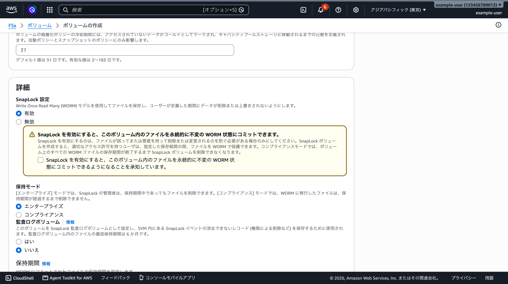
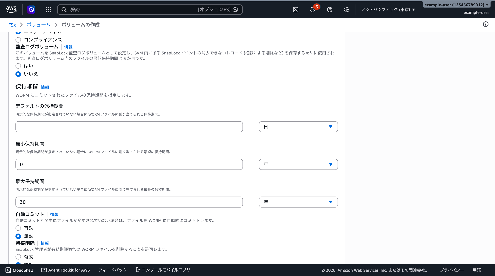
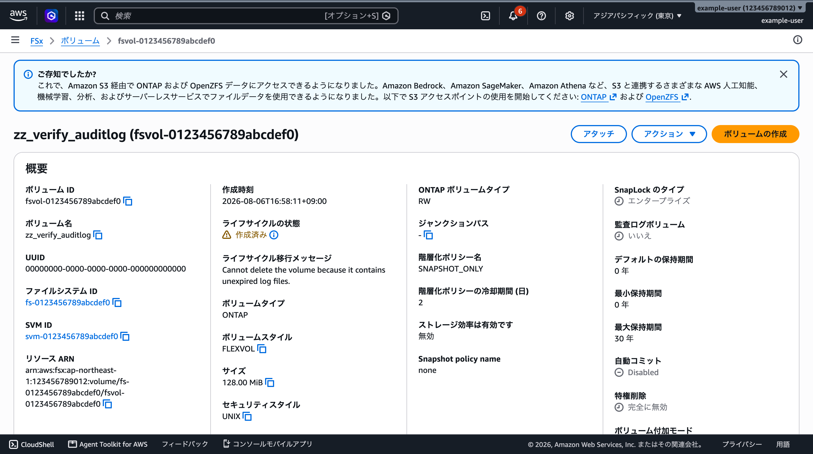

# SnapLock 監査ログボリューム — マネジメントコンソールで踏まないための操作ポイント

🌐 **Language / 言語**: 日本語 | [English](../en/snaplock-audit-log-console-guardrails.md)

SnapLock 監査ログボリュームを 1 本作ると、**ボリューム → SVM → ファイルシステム**の削除が最短 6 か月
ブロックされます。この文書は**マネジメントコンソールの画面上でどこを見るべきか**を、実際の画面と
ともに示します。CLI / API での挙動は
[SnapLock / Tamperproof の罠](../agent/pitfalls-snaplock.md)、承認の設計は
[Tamperproof Snapshot 設計](../tamperproof-snapshot-design.md) にあります。

> **この文書は実測に基づきます。** 画面は 2026-08-17 に `ap-northeast-1` のコンソール（日本語表示）で
> 取得しました。識別子は撮影時に置換しています。ロック済みボリュームの状態は ONTAP 9.18.1P3D1 の
> 実環境のものです。

---

## 結論

コンソールには警告があります。ただし**警告が言っている範囲は、実際に起きることより狭い**です。

| コンソールが書いていること | 実際に起きること |
|---|---|
| 「SnapLock ボリュームを削除できなくなります」 | ボリュームだけでなく、**SVM と、その SVM が属するファイルシステム**も削除できません |
| 「監査ログボリューム内のファイルの最低保持期間は 6 か月です」 | そのとおりです。ただし**この画面にも API にも、6 か月より短い値を指定する欄がありません** |
| （エンタープライズモードの説明）「SnapLock の管理者は、保持期間中であってもファイルを削除できます」 | **監査ログボリュームには適用されません。** 特権削除の対象は満了済み WORM ファイルで、監査ログの未満了ファイルには経路がありません |

したがって「削除できなくなるのはこのボリュームだけ」と読める画面から、ファイルシステム全体が
数か月固定される結果に到達します。**この差を埋めるのが、以下の 3 つの操作ポイントです。**

---

## 操作ポイント 1 — 作成画面: 承知チェックは SnapLock のもので、監査ログのものではない

`[FSx]` → `[ボリューム]` → `[ボリュームの作成]` → ファイルシステムのタイプで
`Amazon FSx for NetApp ONTAP` を選ぶと、`詳細` に `SnapLock 設定` が現れます。



読み取れることが 3 つあります。

1. **黄色の警告と承知チェックボックスは、`SnapLock 設定` を `有効` にしたことに対するものです。**
   文面も「このボリューム内のファイルを永続的に不変の WORM 状態にコミットできる」ことへの同意で、
   監査ログボリュームには触れていません。**`監査ログボリューム` に専用の確認はありません。**
2. **警告の削除に関する記述は「SnapLock ボリュームを削除できなくなります」までです。** SVM と
   ファイルシステムは出てきません。
3. **`保持モード` の既定は `エンタープライズ`** です。エンタープライズの説明は「管理者は保持期間中で
   あってもファイルを削除できます」なので、**逃げ道があるように読めます。** 監査ログボリュームには
   その逃げ道がありません。

> **操作ポイント**: `監査ログボリューム` を `はい` にするのは、**特権削除（privileged delete）を
> 運用に組み込むと決めた場合だけ**です。特権削除を使わないなら監査ログボリュームは不要で、
> この 6 か月ロックはそもそも発生しません。**先に決めるのは保持期間の値ではなく、特権削除を
> 使うかどうかです。**

---

## 操作ポイント 2 — 保持期間の 3 つの欄は、監査ログの保持期間ではない

同じ画面を下にたどると `保持期間` があり、`デフォルト` / `最小` / `最大` の 3 欄が並びます。



見出しの説明は **「WORM にコミットされたファイルの保持期間を指定します」** で、3 欄それぞれの説明も
「WORM ファイルに割り当てられる保持期間」です。**監査ログファイルの保持期間を指定する欄は、この画面に
存在しません。**

これが最も誤解しやすい点です。`監査ログボリューム` = `はい` の直下に保持期間の欄が並ぶため、
**その欄が監査ログの保持期間だと読めます。** 実際にはボリューム上の WORM ファイル用で、監査ログには
既定の 6 か月が適用されます。実際にロックされたボリュームは、この 3 欄が
**デフォルト 0 年 / 最小 0 年 / 最大 30 年**のまま 6 か月削除できませんでした——つまり
**「保持期間を最小にしておけば安全」は成立しません。**

| 縛る対象 | 指定できる場所 |
|---|---|
| ボリューム上の WORM ファイル | この画面の `保持期間`、`CreateSnaplockConfiguration` の `RetentionPeriod` |
| **監査ログファイル**（ロックの原因） | **コンソールにも AWS API にもありません。** ONTAP CLI の `snaplock log create -retention-period` のみ |

> **操作ポイント**: `監査ログボリューム` を `はい` にする前に、**適用される保持期間の値を自分が
> 選べるのかを確認してください。** コンソールから作る場合、選べません。値を制御する必要があるなら
> ONTAP 側で作成します。

---

## 操作ポイント 3 — 詰まったあと: 無害に見える 3 つのフィールドと、理由が書かれた 1 つ

すでにロックされたボリュームの詳細画面です。



**このボリュームは削除できません。** しかし削除できない理由を探すときに自然に見るフィールドは、
どれも問題なさそうに見えます。

| フィールド | 表示 | どう読めるか |
|---|---|---|
| `ライフサイクルの状態` | ⚠ 作成済み | 正常。`削除中` で止まっているわけではない |
| `監査ログボリューム` | **いいえ** | 監査ログではないのだから削除できるはず、と読める |
| `デフォルトの保持期間` / `最小保持期間` | 0 年 / 0 年 | 保持期間は設定されていない、と読める |
| `特権削除` | 完全に無効 | ここが原因かと疑うが、これは別の終端状態 |
| **`ライフサイクル移行メッセージ`** | **Cannot delete the volume because it contains unexpired log files.** | **これが唯一の答え** |

`監査ログボリューム` が `いいえ` なのは、**指定を後から解除したから**です。解除は成功します。
しかし削除をブロックしているのは指定ではなく、**すでに書き込まれた監査ログファイルに適用済みの
保持期間**で、これは指定を解除しても消えません。AWS サポートの回答も同じ整理でした
（`AuditLogVolume` は現在の指定を表す。ONTAP の `snaplock.is_audit_log` は「過去に一度でも指定された」
履歴マークなので `true` のまま残る）。

> **操作ポイント**: 削除できないボリュームを調べるときは、**`ライフサイクル移行メッセージ` を最初に
> 読んでください。** 状態・保持期間・監査ログの指定は、いずれもロックの有無を表しません。

---

## 満了日時の確認

コンソールの詳細画面には満了日時が出ません。次のいずれかで読みます。

ONTAP CLI（管理エンドポイントへ SSH）:

```
volume snaplock show -vserver <svm> -volume <volume> -instance
```

`Expiry Time` フィールドが満了日時です。ONTAP REST でも同じ値が読めます。

```
GET /api/storage/volumes/{uuid}?fields=snaplock
```

実測（2026-08-17）: `snaplock.expiry_time` が `2027-02-06T17:04:33+09:00`、`is_audit_log` は `true`、
`retention` は `{default: P0Y, minimum: P0Y, maximum: P30Y}`。**保持期間の設定値ではなく
`expiry_time` が、削除できるようになる日時です。**

---

## AWS サポートの回答（2026-08 のケースより）

| 論点 | 回答 |
|---|---|
| 保持期間満了前の削除 / ロック解除 | **不可。** 満了を待つ以外の経路はありません |
| 請求面の相談 | **対象リソースの削除完了後**に「アカウントおよび請求サポート」窓口へ改めて起票。配慮が可能であることは約束されません |
| 満了日時の確認方法 | 管理エンドポイントへ SSH し `volume snaplock show -instance` の `Expiry Time` |
| 警告の所在 | コンソールの `監査ログボリューム` 欄と、`CreateVolume` / `UpdateVolume` の API ドキュメント（`AuditLogVolume` のリンク先）に最低保持期間 6 か月の記載がある、という位置づけ |
| `AuditLogVolume: false` でも削除できない理由 | ブロックしているのは指定ではなく、監査ログファイルに適用済みの保持期間 |
| ドキュメント改善の要望 | 担当部署へフィードバック。反映と時期は約束されません |
| 長期のケース運用 | 半年オープンのままにはできないため、**満了後の削除実施時に、前のケース ID を添えて新規ケースを起票**する運用 |

> ドキュメント改善は「提出済み」であって「反映済み」ではありません。公開されるまでは未反映として
> 扱ってください。

---

## 関連ドキュメント

- [SnapLock / Tamperproof の罠](../agent/pitfalls-snaplock.md) — CLI / API 側の挙動とエラーコード
- [Tamperproof Snapshot 設計](../tamperproof-snapshot-design.md) — 実行前の確認事項と段の分け方
- [保持期間の満了後にデータを削除する仕組み — 設計](../retention-expiry-deletion-design.md) — 満了後の削除運用
- [AWS: SnapLock ボリュームの削除](https://docs.aws.amazon.com/ja_jp/fsx/latest/ONTAPGuide/snaplock-delete-volume.html) — 親リソースまで連鎖することの一次情報
- [NetApp KB: What is the minimum retention of SnapLock audit log?](https://kb.netapp.com/Advice_and_Troubleshooting/Data_Protection_and_Security/SnapLock/What_is_the_minimum_retention_of_SnapLock_audit_log%3F) — 6 か月の一次情報
