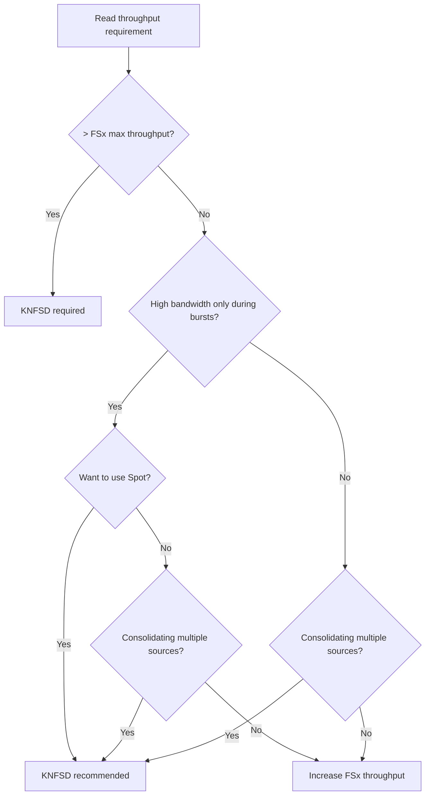

# KNFSD File Cache + S3 AP Dual-Path Architecture

🌐 **Language / 言語**: [日本語](knfsd-s3ap-dual-path-architecture.md) | English

> **Status**: KNFSD File Cache is in **Preview** as of July 2026. We recommend waiting for GA before applying it to production workloads.

## Executive Summary

This is a design guide for a Dual-Path architecture that optimizes read-intensive large-scale compute workloads (EDA, VFX, HPC simulation) alongside serverless AI/ML post-processing against **the same Amazon FSx for NetApp ONTAP data source**.

**Conclusion**: KNFSD File Cache (NFS read acceleration) and S3 Access Points (serverless processing) are complementary. Combining them lets you serve both "large-scale compute" and "AI/ML analytics" efficiently from FSx for ONTAP.

---

## Verified Performance Data (Measured 2026-07-23)

> The following are results from a real environment. Environment: KNFSD proxy m6gd.xlarge (arm64, 16GB RAM, 237GB NVMe) / FSx for ONTAP 128 MBps Single-AZ / Client t4g.micro (916MB RAM) / NFSv4.1

### Dual-Path E2E Results

| Test | Result | Notes |
|------|:------:|-------|
| S3 AP write → KNFSD NFS read | **✅** | Reflected immediately, content matched exactly |
| NFS write → S3 AP read (MD5) | **✅** | `c092ef65e3ee054d183a754f712b034c` matched on both sides |
| S3 AP batch 50 files → NFS bulk read | **✅** | 50 files in 107ms (2.1ms/file) |
| S3 AP multipart 50MB → NFS read | **✅** | MD5 matched exactly |

### Measured Throughput

> **Test environment note**: These numbers come from m6gd.xlarge (237 GB NVMe, single drive). On the production-recommended im4gn.16xlarge (30 TB NVMe RAID) or i3en.24xlarge (60 TB), L2 NVMe bandwidth is expected to be several times to ~10x higher (im4gn sequential read: up to ~8 GB/s).

| Operation | Throughput | Condition |
|-----------|-----------|-----------|
| Sequential read (KNFSD proxy cache hit) | **422-619 MB/s** | 500MB file, client cache dropped |
| Sequential read (client page cache hit) | **5.0-9.1 GB/s** | 100MB file, 2nd read |
| Large write (write-through via KNFSD) | **157-218 MB/s** | 100MB-1GB |
| S3 AP multipart upload | 36.6 MiB/s | 50MB file |

### Measured Latency

| Operation | Latency | Condition |
|-----------|---------|-----------|
| Small file read (cached) | **1.5 ms/file** | 4KB × 1000 files |
| S3 AP batch read via KNFSD | **2.1 ms/file** | 50 files, content verified |
| Cache miss → source fetch (10MB) | 55 ms | Initial read from FSx for ONTAP |
| Cache hit (10MB) | **2 ms** | **28x improvement** |

### nconnect Effect

| nconnect | Cold read (100MB) | Cached read | Notes |
|:--------:|:-----------------:|:-----------:|-------|
| 1 (default) | **619 MB/s** | 9.1 GB/s | Preferable on smaller instances |
| 16 | 184 MB/s | 5.0 GB/s | Counterproductive on network-bandwidth-limited instances |

> **nconnect guidance**: On large instances with a 100 Gbps NIC (c5n.18xlarge, hpc7g), nconnect=16 helps. On smaller instances at 5 Gbps or below, the default (1) is recommended.

### Working Set > Client RAM

| Client RAM | Dataset | Read throughput | Source |
|:----------:|:-------:|:--------------:|--------|
| 916 MB | 500 MB | **422-428 MB/s** | KNFSD proxy L1 (RAM 16GB) |

> Even after flushing the client page cache with `drop_caches`, data is served from the KNFSD proxy cache at 400+ MB/s. **The value of KNFSD is most pronounced for datasets that exceed client RAM.**

### FS-Cache (L2 NVMe) Statistics

| Metric | Value |
|--------|-------|
| Backend | cachefilesd (active) |
| NVMe | /dev/nvme1n1, 221 GB (xfs) |
| Cached objects (cookies) | 1,372 |
| Read operations (RA) | 12,877 |
| Write operations (WR) | 12,853 (100% success) |
| After proxy restart | FS-Cache retained ✅ |

### Critical Constraint: NFSv4.1 Required

| NFS Version | FSx for ONTAP re-export | Reason |
|:-----------:|:----------------------:|--------|
| NFSv3 | ❌ Stale file handle on write | Filehandle +22 bytes > 64 byte limit |
| **NFSv4.1** | **✅ Read/write fully functional** | 128 byte limit leaves ample headroom |

> Detailed verification records (measurement logs, dates, execution environment) are kept in a private area
> outside this repository (`.private/`, gitignored). For reproduction steps, see the
> [KNFSD File Cache demo guide](../infrastructure/knfsd-file-cache/docs/demo-guide.en.md).

---

## Target Workloads

| Industry | Workload | KNFSD role | S3 AP role |
|----------|----------|-----------|-----------|
| Semiconductor EDA | DRC/LVS/DFM verification | High-speed reads of design rules and GDS/OASIS | Verification summaries, yield analysis |
| VFX / Animation | Rendering | Texture, asset, and scene data reads | Render quality validation, metadata extraction |
| Automotive CAE | Crash / fluid simulation | Mesh and boundary condition data reads | Result comparison, anomaly detection reports |
| Life Sciences | Genomics, molecular dynamics | Reference database and sequence data reads | Variant call quality, statistical reports |
| Financial Services | Risk simulation | Market data and model parameter reads | VaR / stress test aggregation |
| Energy | Seismic exploration (SEG-Y) | Survey data reads | 3D modeling result analysis |

---

## Architecture Overview

```
┌─────────────────────────────────────────────────────────────────────────────┐
│                        AWS Region (ap-northeast-1)                           │
│                                                                             │
│  ┌─── VPC ────────────────────────────────────────────────────────────────┐ │
│  │                                                                         │ │
│  │  ┌─────────────────────┐         ┌──────────────────────────────────┐  │ │
│  │  │   Source NFS         │         │  KNFSD File Cache Cluster        │  │ │
│  │  │   (on-prem / other   │  NFS    │  ┌──────┐ ┌──────┐ ┌──────┐    │  │ │
│  │  │    cloud / other AZ) │◄───────►│  │Proxy1│ │Proxy2│ │ProxyN│    │  │ │
│  │  └─────────────────────┘  WAN/    │  └──────┘ └──────┘ └──────┘    │  │ │
│  │           ▲               VPC     │       ▲ Auto Scaling Group      │  │ │
│  │           │                       └───────┼─────────────────────────┘  │ │
│  │           │                               │ NFS re-export              │ │
│  │  ┌───────┴───────────┐                   ▼                            │ │
│  │  │  FSx for ONTAP     │         ┌──────────────────────────────────┐  │ │
│  │  │  File System        │         │  Compute Fleet (EDA/VFX/HPC)     │  │ │
│  │  │  ┌───────────────┐ │         │  ┌──────┐ ┌──────┐ ┌──────┐    │  │ │
│  │  │  │ Volume (data)  │ │         │  │Spot 1│ │Spot 2│ │Spot N│    │  │ │
│  │  │  └───────────────┘ │         │  └──────┘ └──────┘ └──────┘    │  │ │
│  │  │  ┌───────────────┐ │         └──────────────────────────────────┘  │ │
│  │  │  │ Volume (output)│ │                                               │ │
│  │  │  └───────────────┘ │                                               │ │
│  │  └───────┬─────────────┘                                               │ │
│  │          │                                                              │ │
│  └──────────┼──────────────────────────────────────────────────────────────┘ │
│             │ S3 AP (Internet Origin)                                        │
│             ▼                                                                │
│  ┌──────────────────────────────────────────────────────────────────────┐    │
│  │  Serverless Processing (outside VPC)                                  │    │
│  │  ┌──────────────┐    ┌───────────────┐    ┌────────────────────┐    │    │
│  │  │ EventBridge  │───►│ Step Functions │───►│ Lambda (AI/ML)     │    │    │
│  │  │ Scheduler    │    │ Orchestration  │    │ • Quality checks    │    │    │
│  │  └──────────────┘    └───────────────┘    │ • Metadata extract  │    │    │
│  │                                            │ • Anomaly detection │    │    │
│  │                                            │ • Report generation │    │    │
│  │                                            └────────────────────┘    │    │
│  └──────────────────────────────────────────────────────────────────────┘    │
└─────────────────────────────────────────────────────────────────────────────┘
```

### Data Flow

| Step | Path | Description |
|:---:|------|-------------|
| ① | NFS/SMB → FSx for ONTAP | Engineers store design data / assets |
| ② | FSx for ONTAP → KNFSD (NFS mount) | KNFSD fetches from source on first access (cache miss) |
| ③ | KNFSD → Compute Fleet (NFS re-export) | Cached data served at in-VPC speed |
| ④ | Compute Fleet → FSx for ONTAP (write-through) | Results written back |
| ⑤ | FSx for ONTAP → S3 AP → Lambda | Serverless post-processing of result files |
| ⑥ | Lambda → S3 AP → FSx for ONTAP (PutObject) | Analysis results written back to the same volume |
| ⑦ | NFS/SMB clients | Engineers view the final deliverables |

### Important Note on Cache Consistency

> **NFS close-to-open semantics**: KNFSD invalidates its cache based on file attribute timeouts (`acdirmin`/`acdirmax`, default 30-60 seconds). If a file is written via S3 AP, reads through KNFSD may return stale data for a few tens of seconds.

| Write path | Delay visible from KNFSD | Mitigation |
|-----------|:---:|------------|
| Compute → KNFSD (NFS write-through) | None (write-through is reflected immediately) | — |
| Lambda → S3 AP (PutObject) | 30-60 seconds | `noac` mount or shorter attribute timeouts |
| Direct NFS/SMB write | 30-60 seconds | Same as above |

**Design recommendation**: KNFSD fits best the pattern of "read-intensive access, with writes on a separate path and results post-processed." If you need to read frequently-written data through KNFSD, either accept the consistency delay or use the `noac` option (which carries a performance cost).

> **EDA/HPC note**: For workloads where input data (GDS, textures, reference genomes, and similar) is immutable during job execution — typical HPC batch — cache consistency is not a concern. This is the use case KNFSD suits most.

---

## Use Case Deep Dive

### 1. Semiconductor EDA — DRC/LVS Burst Verification + AI Yield Analysis

#### Scenario

The design verification phase just before tapeout. Thousands of design rule check (DRC) and Layout vs Schematic (LVS) jobs run in parallel in a short window, and results are analyzed with AI to surface yield risk early.

#### KNFSD Value

| Challenge | How KNFSD addresses it |
|-----------|-----------------------|
| Repeated reads of GDS/OASIS files (several GB to tens of GB) | L2 NVMe cache delivers local speed from the second read onward |
| Thousands of cores referencing the same technology files | Load distribution via DNS round-robin |
| Large-scale compute only during burst windows | Spot + KNFSD (cache stays warm) |
| Hybrid with on-premises EDA tool servers | Fanout over WAN (Tier 1 / Tier 2) |

#### S3 AP Value

| Challenge | How S3 AP addresses it |
|-----------|-----------------------|
| Auto-generating summaries from tens of thousands of result files | Parallel aggregation in Lambda |
| AI classification and prioritization of DRC violations | Inference with Bedrock (Nova/Claude) |
| Yield trend analysis | Athena + Glue Data Catalog |
| Making results immediately visible on engineers' NFS mounts | S3 AP PutObject → viewable over NFS |

#### Reference Configuration

```yaml
# KNFSD side (Terraform)
KNFSD Cluster:
  Instance Type: im4gn.16xlarge (ARM, 100 Gbps, 30 TB NVMe)
  Auto Scaling: 2-10 instances (NFS connection based)
  Source Exports:
    - FSx for ONTAP: /design_data (GDS/OASIS/tech files)
    - On-prem NFS: /eda_tools (EDA tool installations)

# S3 AP side (SAM - extends the existing UC6 pattern)
Step Functions:
  Discovery: ListObjectsV2 (DRC result files)
  Processing: Lambda (Bedrock classification)
  Output: S3 AP PutObject (yield_analysis/ prefix)
```

#### Estimated Cost (monthly reference)

| Component | Configuration | Approx. monthly |
|-----------|--------------|-----------------|
| FSx for ONTAP | 1,024 MBps / 2 TB SSD / Single-AZ | ~$500 |
| KNFSD (im4gn.16xlarge × 4) | 10h daytime × 20 business days | ~$4,656 |
| Spot Compute (c7g.4xlarge × 100) | 10h × 20 days, Spot 70% off | ~$2,900 |
| Lambda (S3 AP post-processing) | 10,000 files/day × 10s × 1GB | ~$50 |
| Bedrock (Nova Lite) | 10,000 calls/day | ~$30 |
| **Total** | | **~$8,136** |

> **Cost note**: Raising FSx throughput to 4,096 MBps instead of using KNFSD costs ~$2,000/month for FSx alone. However, that throughput is shared across NFS/SMB/S3 AP, so bandwidth contention risk during bursts remains. KNFSD keeps FSx at 1,024 MBps while providing 100+ Gbps of effective read throughput from cache.

---

### 2. VFX Rendering — Texture Cache + AI Render Quality Validation

#### Scenario

A VFX studio runs cloud burst rendering. Textures and scene data stored on on-premises NFS storage are cached by KNFSD, and rendered output is quality-checked with AI.

> **Track record**: Wētā FX (Avatar: The Way of Water) and ILM used the predecessor project of KNFSD in production.

#### KNFSD Value

| Challenge | How KNFSD addresses it |
|-----------|-----------------------|
| Repeated reads of shared textures/assets (several TB) | Two-tier cache: L1 (RAM) + L2 (NVMe) |
| WAN latency from on-premises to cloud | Tier 1 absorbs WAN, Tier 2 delivers at LAN speed |
| Parallel I/O from hundreds of render nodes | Bandwidth scales with Auto Scaling + NLB |
| Restart after Spot reclamation | Resumes immediately because the KNFSD cache stays warm |

#### S3 AP Value

| Challenge | How S3 AP addresses it |
|-----------|-----------------------|
| Automating quality checks on render output (EXR/PNG) | Anomaly detection with Rekognition / Bedrock |
| Per-shot metadata extraction | Lambda parses frame information and color space |
| Thumbnail generation for dailies review | Lambda converts EXR → JPEG |
| Cross-project usage analysis | Athena aggregates asset access frequency |

#### Applying the Fanout Architecture

```
┌──────────────┐      WAN (Direct Connect)      ┌───────────────────┐
│ On-prem NFS  │◄──────────────────────────────►│ KNFSD Tier 1      │
│ (textures)   │      Low bandwidth / High lat  │ (i3en.24xlarge)   │
└──────────────┘                                 │ 60 TB NVMe cache  │
                                                 └────────┬──────────┘
                                                          │ Intra-VPC
                                                 ┌────────▼──────────┐
                                                 │ KNFSD Tier 2      │
                                                 │ (im4gn.16xlarge   │
                                                 │  × 2-8, ASG)      │
                                                 └────────┬──────────┘
                                                          │ NFS re-export
                                                 ┌────────▼──────────┐
                                                 │ Render Farm       │
                                                 │ (Spot × 100-500)  │
                                                 └───────────────────┘
```

---

### 3. Automotive CAE Simulation — Mesh Data Reads + AI Result Comparison

#### Scenario

Crash, aerodynamics, and NVH simulations read large mesh datasets and run hundreds of variants in parallel. Results are compared with AI to automatically suggest design optimization directions.

#### KNFSD Value

- Mesh files (several GB to tens of GB) share a large portion of their content across variants of the same model
- With the KNFSD cache, the second and subsequent variant runs no longer need to fetch the shared mesh portion
- The 30 TB NVMe on im4gn.16xlarge can hold the working set of multiple models

#### S3 AP Value

- Lambda reads result files (stress / displacement / energy) from hundreds of variants in parallel
- Bedrock correlates design parameters against results
- Automatic detection of and alerting on anomalous variants (divergent / non-converged)

---

### 4. Life Sciences / Genomics — Reference Database Cache + AI Variant Classification

#### Scenario

A whole genome sequencing (WGS) pipeline burst-processes FASTQ → BAM → VCF conversion for thousands of samples. The reference genome (hg38: ~3.1 GB) and annotation databases (dbSNP, ClinVar, gnomAD: tens of GB combined) are cached by KNFSD, and variant call results are classified for pathogenicity with AI.

#### Workload Characteristics

| Data type | Size | Access pattern | Cache benefit |
|-----------|------|---------------|--------------|
| Reference genome (hg38.fa + index) | ~10 GB (with BWA index) | Read repeatedly by every sample | **Very high** (100% cacheable) |
| Annotation DB (dbSNP/ClinVar) | ~50 GB | Referenced repeatedly during variant filtering | **Very high** |
| FASTQ input (per sample) | 30-100 GB | Read once (streaming) | **Low** (no cache benefit) |
| BAM intermediate files | 50-150 GB | Alignment → sort → dedup | Medium (referenced multiple times within the pipeline) |

> **KNFSD's main value is reference data**: FASTQ input files are read only once per sample, so there is no cache benefit. KNFSD earns its place where the reference genome plus annotation DBs (~60 GB combined) are read repeatedly by hundreds to thousands of nodes. The design eliminates duplicate reads against FSx for ONTAP and concentrates bandwidth on FASTQ input and BAM write-back.

#### KNFSD Value

| Challenge | How KNFSD addresses it |
|-----------|-----------------------|
| Thousands of nodes reading the reference genome concurrently | Fetch once → serve all nodes from NVMe |
| Repeatedly loading the BWA-MEM2 index (tens of GB) | Sub-ms access from the RAM (L1) cache |
| Pulling sample data from on-premises LIMS/NAS | Hybrid operation via Fanout over WAN |
| Resuming the pipeline after Spot reclamation | Reference data remains in KNFSD, so work resumes immediately |

#### S3 AP Value

| Challenge | How S3 AP addresses it |
|-----------|-----------------------|
| Pathogenicity classification of VCF variants | Bedrock (Claude) classifies against ClinVar/ACMG criteria |
| Multi-sample aggregation reports | Lambda computes cohort statistics (allele frequency, penetrance) |
| Automated quality metric checks | Lambda verifies coverage depth / mapping rate |
| Researchers viewing final results over NFS | PutObject → immediately accessible on the NFS mount |

#### Example Pipeline Configuration

```
[Via KNFSD — Compute nodes (Spot)]
  FASTQ → BWA-MEM2 (reference genome: KNFSD cache)
  → SAMtools sort/markdup (BAM output: written back to FSx for ONTAP)
  → GATK HaplotypeCaller / DeepVariant (reference + dbSNP: KNFSD cache)
  → VCF output: written back to FSx for ONTAP

[Via S3 AP — Lambda/Step Functions]
  → VCF quality check (coverage, Ti/Tv ratio)
  → Bedrock variant classification (pathogenic/likely pathogenic/VUS/benign)
  → Cohort aggregation report generation
  → Researcher notification (SNS)
```

#### Estimated Cost (processing 1,000 WGS samples)

| Component | Configuration | Approx. cost |
|-----------|--------------|-------------|
| KNFSD (im4gn.16xlarge × 2) | 48h burst | ~$559 |
| Spot Compute (c7g.8xlarge × 50) | 48h, Spot 70% off | ~$1,240 |
| FSx for ONTAP (512 MBps) | Prorated monthly (2 days) | ~$16 |
| Lambda (S3 AP post-processing) | 1,000 VCF × 30s × 1GB | ~$5 |
| Bedrock (Claude Haiku) | 1,000 samples × 100 variants | ~$15 |
| **Total (1,000 samples)** | | **~$1,835** |

> **Cost note**: Because the reference genome plus annotation DBs (~60 GB) achieve a cache hit rate of ~100%, FSx bandwidth consumption is essentially limited to FASTQ input reads and BAM/VCF write-back. Without KNFSD, with all nodes reading FSx directly, the reference genome alone generates 50 nodes × 10 GB = 500 GB of duplicate reads.

---

### 5. Financial Services / Risk Calculation — Market Data Cache + Automated VaR Reports

#### Scenario

Daily Value at Risk (VaR) / CVA / stress test calculations burst-run Monte Carlo simulations across tens of thousands of scenarios. Market data (historical rates, volatility surfaces, yield curves) is cached by KNFSD, and results feed AI anomaly detection and automated regulatory report generation.

#### Workload Characteristics

| Data type | Size | Access pattern | Cache benefit |
|-----------|------|---------------|--------------|
| Market data (historical) | 1-10 TB | Every scenario references the same dataset | **Very high** |
| Volatility surfaces | Several GB | Tenor/strike grid, referenced by every model | **Very high** |
| Model parameters (calibration) | Several hundred MB | Updated daily, read by every node | **High** |
| Portfolio data | Several GB | Position / trade data | **High** |
| Random seeds / scenarios | Several GB | Each node reads a different portion | Medium |

#### KNFSD Value

| Challenge | How KNFSD addresses it |
|-----------|-----------------------|
| Thousands of cores reading market data concurrently | Sub-ms delivery from the L1 (RAM) cache |
| Strict calculation windows driven by regulation (FRTB) | Auto Scaling secures bandwidth at calculation start |
| Hybrid with an on-premises risk engine | Market data shared through the cache over WAN |
| Latency requirements for intraday VaR recalculation | i7ie instances reduce NVMe latency by 65% |

#### S3 AP Value

| Challenge | How S3 AP addresses it |
|-----------|-----------------------|
| Aggregating results across tens of thousands of scenarios | Lambda computes P&L distributions and VaR/ES |
| AI detection of anomalous scenarios | Bedrock detects sudden loss patterns |
| Automated regulatory reports (FRTB/Basel III) | Lambda + Bedrock fill in report templates |
| Preserving audit trails | S3 AP → FSx for ONTAP (SnapLock retention) |

#### Operational Pattern

```
┌── Daily batch (T+0 EOD) ─────────────────────────────────────────┐
│                                                                   │
│  [17:00] Market data update → FSx for ONTAP                       │
│  [17:30] KNFSD warm-up (market data pre-fetch)                    │
│  [18:00] Monte Carlo burst starts (Spot × 500)                    │
│          • 10,000 scenarios × 5,000 positions                     │
│          • Market data: KNFSD cache (hit rate 99%+)               │
│          • Results: written back to FSx for ONTAP                 │
│  [20:00] Burst complete                                           │
│                                                                   │
│  [20:00-21:00] S3 AP post-processing                              │
│          • Lambda: VaR/ES aggregation, P&L distribution           │
│          • Bedrock: anomalous scenario notes, regulatory draft    │
│          • Results: FSx for ONTAP → Risk Manager views over NFS   │
│                                                                   │
│  [06:00] Intraday VaR recalculation (same pipeline, smaller)      │
└───────────────────────────────────────────────────────────────────┘
```

#### Regulatory and Compliance Considerations

| Requirement | Approach |
|-------------|----------|
| Data residency (in-country retention) | Place FSx for ONTAP and KNFSD in the same Region |
| Audit trail | PutObject calculation results to a SnapLock (WORM) volume |
| Reproducibility | Persist scenario random seeds on FSx for ONTAP |
| Calculation window SLA | KNFSD Auto Scaling guarantees bandwidth |

---

### 6. Weather Forecasting / Climate Science — Observation Data Cache + AI Forecast Post-Processing

#### Scenario

Ensemble runs of numerical weather prediction (NWP) models (WRF, HARMONIE, GFS, and others). Observation data (radiosonde, satellite, radar) plus initial and boundary condition data are cached by KNFSD, and forecast output is post-processed with AI (bias correction, extreme weather detection, renewable energy output prediction).

#### Workload Characteristics

| Data type | Size | Access pattern | Cache benefit |
|-----------|------|---------------|--------------|
| Initial/boundary conditions (GFS/ERA5) | 50-200 GB per cycle | Every ensemble member references the same data | **Very high** |
| Terrain data (terrain, landuse) | Several GB | Common across all runs | **Very high** (persistent cache) |
| Observation data (for assimilation) | 1-10 GB per cycle | Referenced repeatedly during data assimilation | **High** |
| Model output (per member) | 10-50 GB | Each member writes independently | Low (write-dominated) |

#### KNFSD Value

| Challenge | How KNFSD addresses it |
|-----------|-----------------------|
| 50 ensemble members reading GFS initial conditions concurrently | Fetch once → serve all members from cache |
| Reading immutable terrain data on every run | Persistent NVMe cache (retained across restarts) |
| Six-hourly forecast cycles (time constrained) | Pre-fetch caches the next cycle's data in advance |
| Multi-Region execution (disaster redundancy) | Fanout delivers to multiple Regions |

#### S3 AP Value

| Challenge | How S3 AP addresses it |
|-----------|-----------------------|
| Ensemble statistics (mean / spread) | Lambda aggregates 50 members in parallel |
| Extreme weather event detection | Bedrock analyzes threshold-exceedance patterns with AI |
| Renewable output prediction (wind speed / irradiance → MW) | Lambda combines physical models with ML |
| Forecast verification (comparison with observations) | Lambda computes RMSE / bias / skill score automatically |
| Visualization data generation | Lambda generates GeoJSON/PNG tiles |

#### Example Forecast Cycle

```
[00Z cycle]
  00:00 - 00:30  GFS data ingest → FSx for ONTAP → KNFSD pre-fetch
  00:30 - 02:00  WRF ensemble run (50 members × Spot c7g.16xlarge)
                 • Initial/boundary/terrain: KNFSD cache (hit rate 98%+)
                 • Output: written back to FSx for ONTAP (prefix per member)
  02:00 - 02:30  S3 AP post-processing
                 • Ensemble mean / spread computation
                 • Extreme weather AI detection (typhoon/heavy rain/gale)
                 • Renewable generation forecasting
                 • Forecast verification report generation
  02:30          Distribution (forecasters view over NFS/SMB + API delivery)

[06Z / 12Z / 18Z: same pipeline repeated]
```

#### Japan-Specific Considerations

| Item | Approach |
|------|----------|
| Ingesting JMA MSM/GSM data | Stage on FSx for ONTAP → cache in KNFSD |
| Renewable FIT/FIP generation forecasting | S3 AP → Lambda produces 30-minute interval forecasts |
| Disaster information distribution | Extreme weather detection → SNS → municipal notification |
| High-resolution terrain (50m DEM) | KNFSD persistent cache (~30 GB, immutable) |

---

### 7. Energy / Seismic Exploration — SEG-Y Data Cache + AI Interpretation Support

#### Scenario

3D seismic survey data acquired in oil and gas exploration (SEG-Y format, tens of TB to PB) is burst-processed in the cloud. Pre-stack and post-stack processing of reflection seismic data, reverse time migration (RTM), and full waveform inversion (FWI) run in parallel, and subsurface structure is interpreted automatically with AI.

#### Workload Characteristics

| Data type | Size | Access pattern | Cache benefit |
|-----------|------|---------------|--------------|
| Velocity model | 1-10 TB | Referenced repeatedly by every shot | **Very high** |
| Source wavelet | Several MB | Common to all processing | **Very high** |
| SEG-Y trace data (input) | 10-100 TB | Partial reads per shot | Medium (has locality) |
| Iteration intermediate results | Several TB | Referenced across FWI iterations | **High** |

#### KNFSD Value

| Challenge | How KNFSD addresses it |
|-----------|-----------------------|
| Every GPU node referencing a TB-scale velocity model | Tier 1 fetches over WAN → Tier 2 delivers to the GPU cluster |
| Large forward/backward wavefields in RTM | NVMe L2 cache (60-120 TB) holds intermediate results |
| Data path from survey vessel → onshore DC → cloud | Multi-tier caching absorbs bandwidth constraints |
| Reusing gradients across FWI iterations | Previous iteration results held on NVMe |

#### S3 AP Value

| Challenge | How S3 AP addresses it |
|-----------|-----------------------|
| AI stratigraphic interpretation of processed sections | Bedrock auto-picks faults and formation boundaries |
| Attribute analysis (AVO / impedance) | Lambda computes attribute maps |
| Automating well-to-seismic tie | Lambda correlates well log data with seismic data |
| Exploration report generation | Bedrock drafts technical reports with figure references |

#### Scale and Instance Selection

| Processing type | Compute characteristics | KNFSD recommendation | Compute recommendation |
|----------------|------------------------|---------------------|----------------------|
| Pre-stack processing | I/O intensive | i3en.24xlarge (60 TB) | c7g.16xlarge (Spot) |
| RTM | GPU + high-volume I/O | i3en.24xlarge | p4d.24xlarge (GPU) |
| FWI (iterative) | GPU + intermediate result reuse | i7ie.48xlarge (120 TB) | p5.48xlarge (GPU) |
| Post-stack interpretation | Low I/O | im4gn.16xlarge | Lambda (S3 AP) |

#### Example Configuration (processing 50 TB of 3D SEG-Y)

| Component | Configuration | Approx. cost |
|-----------|--------------|-------------|
| KNFSD Tier 1 (i3en.24xlarge × 1) | 72h | ~$781 |
| KNFSD Tier 2 (im4gn.16xlarge × 4) | 72h | ~$1,676 |
| GPU Compute (p4d.24xlarge × 8) | 72h, Spot 60% off | ~$7,942 |
| FSx for ONTAP (2,048 MBps / 5 TB SSD) | Prorated monthly (3 days) | ~$100 |
| Lambda (S3 AP post-processing) | 1,000 sections × 60s × 3GB | ~$75 |
| **Total (50 TB processed)** | | **~$10,574** |

> **Scale note**: For PB-scale full-field processing, expand KNFSD Tier 2 to 8-16 instances and GPU nodes to 32-64. Using on-premises NAS directly as the source instead of FSx for ONTAP is also possible (via Direct Connect).

---

## Throughput Design

### Bandwidth Sharing Model

KNFSD, S3 AP, and direct NFS/SMB access all share the same provisioned throughput on FSx for ONTAP. KNFSD cache hits, however, substantially reduce effective FSx bandwidth consumption.

```
FSx Provisioned Throughput: 1,024 MBps (read)
│
├── KNFSD cache MISS: fetch from source → consumes FSx bandwidth
│   └── At a 95% cache hit rate: effective consumption = total reads × 5%
│
├── S3 AP Lambda: GetObject / PutObject → consumes FSx bandwidth
│
└── Direct NFS/SMB: end-user access → consumes FSx bandwidth
```

### Sizing Example (EDA burst)

| Parameter | Value |
|-----------|-------|
| Total Compute Fleet reads | 50 Gbps (6,250 MBps) |
| KNFSD cache hit rate | 95% |
| Effective KNFSD → FSx reads | 6,250 × 5% = **312 MBps** |
| S3 AP Lambda processing | 10 parallel × 50 MBps = **500 MBps** |
| Direct NFS/SMB | **100 MBps** |
| **Total FSx bandwidth consumption** | **912 MBps** (< 1,024 MBps ✅) |

> **Without KNFSD**: The Compute Fleet reads FSx directly → 6,250 MBps required → even FSx at 4,096 MBps falls short. KNFSD keeps FSx at 1,024 MBps while delivering 50 Gbps of effective reads.

### KNFSD Instance Type Selection Guide

| Workload characteristic | Recommended instance | Reason |
|------------------------|---------------------|--------|
| Many small files (EDA tech files) | i8g.16xlarge | Latest NVMe, optimized for small-file IOPS |
| Large sequential files (GDS/EXR) | im4gn.16xlarge | High throughput, strong cost efficiency |
| Very large working set (all VFX assets) | i3en.24xlarge | 60 TB NVMe cache |
| Latency-sensitive (financial simulation) | i7ie.48xlarge | 65% lower NVMe latency |

---

## Observability Integration

### Unified Dashboard Design

Monitor KNFSD's 70+ metrics alongside S3 AP and Lambda metrics on a single dashboard:

| Metric source | Key metrics | Alarm condition |
|--------------|------------|-----------------|
| KNFSD (OTel → CloudWatch) | `cache_hit_ratio` | < 80% → insufficient cache |
| KNFSD | `read_throughput_source` | > 50% of FSx bandwidth → bandwidth contention risk |
| KNFSD | `nfs_connections_per_instance` | > threshold → scale out |
| KNFSD | `lru_eviction_rate` | Sharp increase → NVMe capacity shortage |
| FSx for ONTAP | `DataReadBytes` | > 80% of provisioned |
| FSx for ONTAP | `DataWriteBytes` | > 80% of provisioned |
| Lambda (EMF) | `Duration`, `Errors` | P99 > SLO |
| Step Functions | `ExecutionTime` | > SLO |
| S3 AP | SlowDown (503) count | > 0 → bandwidth contention occurring |

### Alert Cascade Pattern

```
KNFSD cache_hit_ratio < 80%
  → read_throughput_source increases
    → FSx DataReadBytes > 80%
      → S3 AP SlowDown occurs
        → Lambda Duration increases
```

**Response**: Add proxies via KNFSD Auto Scaling, or scale up to an instance with larger NVMe capacity.

---

## Cost Optimization

### Combining KNFSD with Spot

KNFSD's largest cost contribution is **making it practical to run compute nodes on Spot**:

| Configuration | Compute cost/month | Reason |
|--------------|:---:|--------|
| EC2 On-Demand (direct NFS) | $10,000 | Spot reclamation loses the cache, risking re-fetch |
| EC2 Spot + KNFSD | **$3,500** | The KNFSD cache stays warm even when Spot is reclaimed |

> Assuming a 70% Spot discount. KNFSD itself runs continuously On-Demand to keep the cache durable.

### FSx Throughput Savings

| Configuration | FSx monthly | Effective reads |
|--------------|------------|----------------|
| FSx 4,096 MBps (no KNFSD) | ~$2,000 | 4,096 MBps |
| FSx 1,024 MBps + KNFSD (4 nodes) | ~$500 + $4,656 | 50+ Gbps (on cache hit) |

→ For bursts at a scale where FSx bandwidth alone cannot keep up, KNFSD is the more economical option. Conversely, for small steady-state workloads, simply increasing FSx throughput is simpler.

### Decision Flowchart



---

## Deployment Considerations

### Separating the IaC

| Layer | Tool | Repository |
|-------|------|-----------|
| KNFSD File Cache | Terraform (official module) | `knfsd-file-cache` clone |
| FSx for ONTAP | CloudFormation or Terraform | Infrastructure management |
| S3 AP + Lambda pipeline | SAM (this repository) | `fsxn-s3ap-serverless-patterns` |

> KNFSD uses Terraform while this project uses SAM/CloudFormation, so the design deploys them separately and shares the VPC/subnets.

### Network Design

```yaml
VPC:
  Private Subnets (KNFSD + FSx for ONTAP + Compute):
    - FSx for ONTAP ENIs
    - KNFSD EC2 instances
    - Compute Fleet (Spot)
    Security Group:
      - NFS (2049/tcp) between KNFSD ↔ FSx for ONTAP
      - NFS (2049/tcp) between Compute ↔ KNFSD
      - All intra-subnet (FSx management)

  S3 AP (Internet Origin):
    - Accessed from Lambda (outside VPC)
    - No VPC Endpoint required
```

### Phased Adoption Steps

| Step | Action | Verification point |
|:---:|--------|-------------------|
| 1 | Build FSx for ONTAP + S3 AP with an existing pattern | Lambda processing over S3 AP works |
| 2 | Deploy the KNFSD Terraform module into the same VPC | KNFSD → FSx for ONTAP NFS mount succeeds |
| 3 | Read through KNFSD from a few test compute nodes (2-3) | Confirm cache hit rate and latency |
| 4 | Configure Spot Auto Scaling and run a burst test | Resume after Spot reclamation is fast |
| 5 | Test bandwidth sharing with KNFSD and S3 AP running together | Confirm FSx DataReadBytes < 80% |
| 6 | Build the unified CloudWatch dashboard | Confirm the alert cascade behaves as expected |

---

## FAQ / Common Misconceptions

**Q: Is KNFSD a replacement for FlexCache?**
A: Not a full replacement — they suit different situations. FlexCache is ONTAP-native, with strengths in write caching and integration with data protection. KNFSD is open source, with strengths in consolidating multiple sources, elastic scaling, and cost optimization. For write-heavy workloads or a single ONTAP source, FlexCache fits; for read-intensive bursts or multiple sources, KNFSD fits.

**Q: Does using KNFSD make S3 AP unnecessary?**
A: No. KNFSD accelerates NFS reads, while serverless AI/ML processing and event-driven pipelines need S3 AP. The two address different needs: "fast NFS reads" and "serverless processing."

**Q: Is it acceptable to use KNFSD in production while it is in Preview?**
A: AWS does not guarantee an SLA during Preview. We recommend evaluating in PoC/development environments and planning production adoption after GA. That said, Wētā FX and ILM ran the predecessor project in production, so technical maturity is high.

**Q: Does KNFSD cache writes as well?**
A: Writes are write-through (written back to the source immediately) or write-around (written directly to the source). The written data itself is not cached. If you need a write cache, consider FlexCache.

**Q: Isn't simply raising the FSx for ONTAP throughput capacity enough?**
A: For small steady-state workloads, increasing throughput is sufficient. However, if any of the following applies — (1) bursts need bandwidth beyond the FSx maximum, (2) Spot usage requires cache durability, (3) multiple sources must be consolidated — KNFSD is the better fit.

**Q: How does this differ from Amazon File Cache?**
A: Amazon File Cache is a Lustre-compatible managed cache and requires a Lustre client (a Linux kernel module). KNFSD speaks standard NFS, so existing NFS workflows can be used without modification.

---

## Related Documentation

- [Comparing Alternative Architectures — NFS Read Cache section](./comparison-alternatives.md)
- [ONTAP Integration Notes — KNFSD section](./ontap-integration-notes.en.md)
- [S3 AP Performance Considerations — KNFSD bandwidth sharing design](./s3ap-performance-considerations.en.md)
- [KNFSD File Cache GitHub](https://github.com/awslabs/knfsd-file-cache)
- [KNFSD File Cache Launch Blog](https://aws.amazon.com/blogs/media/introducing-knfsd-file-cache-extending-your-nfs-storage-into-the-cloud/)
- [AWS Solutions Guidance: KNFSD File Cache](https://docs.aws.amazon.com/solutions/knfsd-file-cache-on-aws/)

---

> **Governance Caveat**: This document is technical architecture reference material. Cost estimates are approximations for specific configurations; actual costs vary with Region, usage pattern, and instance price changes. KNFSD File Cache is in Preview status and its specifications may change after GA.
