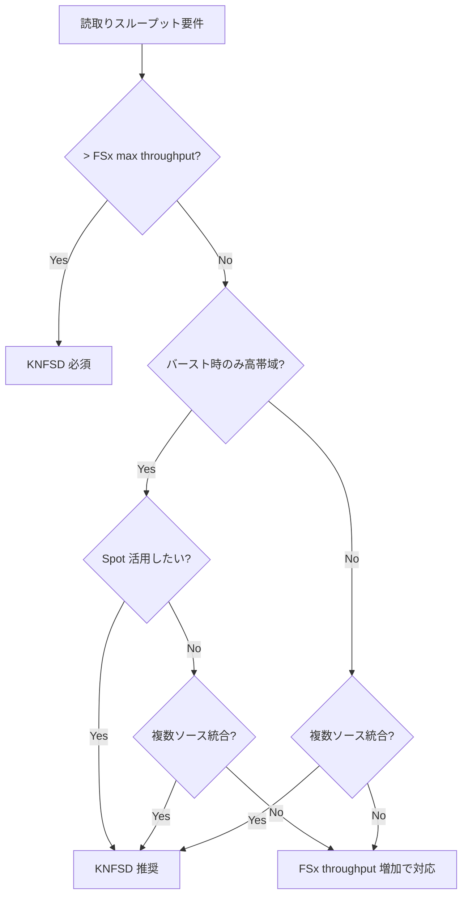

# KNFSD File Cache + S3 AP Dual-Path Architecture

🌐 **Language / 言語**: [日本語](knfsd-s3ap-dual-path-architecture.md) | [English](knfsd-s3ap-dual-path-architecture.en.md)

> **ステータス**: KNFSD File Cache は 2026 年 7 月時点で **Preview** です。本番ワークロードへの適用は GA を待つことを推奨します。

## エグゼクティブサマリ

読取り集中の大規模コンピュートワークロード（EDA、VFX、HPC シミュレーション）と、サーバーレス AI/ML 後処理を**同一 FSx for ONTAP データソース**に対して最適化する Dual-Path アーキテクチャの設計ガイドです。

**結論**: KNFSD File Cache（NFS 読取り高速化）と S3 Access Points（サーバーレス処理）は相補的であり、組み合わせることで「大規模コンピュート」と「AI/ML 分析」の両方を FSx for ONTAP 上で効率的に実現できます。

---

## 対象ワークロード

| 業界 | ワークロード | KNFSD の役割 | S3 AP の役割 |
|------|------------|-------------|-------------|
| 半導体 EDA | DRC/LVS/DFM 検証 | デザインルール・GDS/OASIS の高速読取り | 検証結果サマリ・歩留まり分析 |
| VFX / アニメーション | レンダリング | テクスチャ・アセット・シーンデータ読取り | レンダー品質検証・メタデータ抽出 |
| 自動車 CAE | 衝突/流体シミュレーション | メッシュ・境界条件データ読取り | 結果比較・異常検知レポート |
| ライフサイエンス | ゲノム解析・分子動力学 | 参照データベース・シーケンスデータ読取り | バリアントコール品質・統計レポート |
| 金融 | リスクシミュレーション | マーケットデータ・モデルパラメータ読取り | VaR/ストレステスト結果集計 |
| エネルギー | 地震探査 (SEG-Y) | 測量データ読取り | 3D モデリング結果分析 |

---

## アーキテクチャ概要

```
┌─────────────────────────────────────────────────────────────────────────────┐
│                        AWS Region (ap-northeast-1)                           │
│                                                                             │
│  ┌─── VPC ────────────────────────────────────────────────────────────────┐ │
│  │                                                                         │ │
│  │  ┌─────────────────────┐         ┌──────────────────────────────────┐  │ │
│  │  │   Source NFS         │         │  KNFSD File Cache Cluster        │  │ │
│  │  │   (on-prem / other   │  NFS    │  ┌──────┐ ┌──────┐ ┌──────┐    │  │ │
│  │  │    cloud / other AZ) │◄───────►│  │Proxy1│ │Proxy2│ │ProxyN│    │  │ │
│  │  └─────────────────────┘  WAN/    │  └──────┘ └──────┘ └──────┘    │  │ │
│  │           ▲               VPC     │       ▲ Auto Scaling Group      │  │ │
│  │           │                       └───────┼─────────────────────────┘  │ │
│  │           │                               │ NFS re-export              │ │
│  │  ┌───────┴───────────┐                   ▼                            │ │
│  │  │  FSx for ONTAP     │         ┌──────────────────────────────────┐  │ │
│  │  │  File System        │         │  Compute Fleet (EDA/VFX/HPC)     │  │ │
│  │  │  ┌───────────────┐ │         │  ┌──────┐ ┌──────┐ ┌──────┐    │  │ │
│  │  │  │ Volume (data)  │ │         │  │Spot 1│ │Spot 2│ │Spot N│    │  │ │
│  │  │  └───────────────┘ │         │  └──────┘ └──────┘ └──────┘    │  │ │
│  │  │  ┌───────────────┐ │         └──────────────────────────────────┘  │ │
│  │  │  │ Volume (output)│ │                                               │ │
│  │  │  └───────────────┘ │                                               │ │
│  │  └───────┬─────────────┘                                               │ │
│  │          │                                                              │ │
│  └──────────┼──────────────────────────────────────────────────────────────┘ │
│             │ S3 AP (Internet Origin)                                        │
│             ▼                                                                │
│  ┌──────────────────────────────────────────────────────────────────────┐    │
│  │  Serverless Processing (VPC 外)                                       │    │
│  │  ┌──────────────┐    ┌───────────────┐    ┌────────────────────┐    │    │
│  │  │ EventBridge  │───►│ Step Functions │───►│ Lambda (AI/ML)     │    │    │
│  │  │ Scheduler    │    │ Orchestration  │    │ • 品質検証          │    │    │
│  │  └──────────────┘    └───────────────┘    │ • メタデータ抽出    │    │    │
│  │                                            │ • 異常検知          │    │    │
│  │                                            │ • レポート生成      │    │    │
│  │                                            └────────────────────┘    │    │
│  └──────────────────────────────────────────────────────────────────────┘    │
└─────────────────────────────────────────────────────────────────────────────┘
```

### データフロー

| ステップ | パス | 説明 |
|:---:|------|------|
| ① | NFS/SMB → FSx for ONTAP | エンジニアが設計データ/アセットを格納 |
| ② | FSx for ONTAP → KNFSD (NFS mount) | KNFSD がソースから初回 fetch（cache miss） |
| ③ | KNFSD → Compute Fleet (NFS re-export) | キャッシュ済みデータを VPC 内速度で提供 |
| ④ | Compute Fleet → FSx for ONTAP (write-through) | 処理結果を書戻し |
| ⑤ | FSx for ONTAP → S3 AP → Lambda | サーバーレスで結果ファイルを後処理 |
| ⑥ | Lambda → S3 AP → FSx for ONTAP (PutObject) | 分析結果を同じボリュームに書戻し |
| ⑦ | NFS/SMB クライアント | エンジニアが最終成果物を閲覧 |

### キャッシュ整合性に関する重要な注意

> **NFS close-to-open semantics**: KNFSD はファイル属性のタイムアウト（`acdirmin`/`acdirmax`、デフォルト 30-60 秒）に基づいてキャッシュを無効化します。S3 AP 経由でファイルを書込んだ場合、KNFSD から読む際に数十秒間は古いデータが返される可能性があります。

| 書込みパス | KNFSD から見える遅延 | 対策 |
|-----------|:---:|------|
| Compute → KNFSD (NFS write-through) | なし（write-through は即座に反映） | — |
| Lambda → S3 AP (PutObject) | 30-60 秒 | `noac` マウント or 属性タイムアウト短縮 |
| NFS/SMB 直接書込み | 30-60 秒 | 同上 |

**設計推奨**: KNFSD は「読取り集中・書込みは別パスで行い結果を後処理」というパターンに最適です。書込み頻度が高いデータを KNFSD 経由で読む場合は、整合性の遅延を許容するか、`noac` オプション（パフォーマンス低下あり）を使用してください。

> **EDA/HPC 補足**: 入力データ（GDS、テクスチャ、参照ゲノム等）がジョブ実行中に不変であるワークロード（典型的な HPC バッチ）では、キャッシュ整合性は問題になりません。これが KNFSD の最も適したユースケースです。

---

## ユースケース Deep Dive

### 1. 半導体 EDA — DRC/LVS バースト検証 + AI 歩留まり分析

#### シナリオ

テープアウト直前の設計検証フェーズ。数千のデザインルールチェック (DRC) と Layout vs Schematic (LVS) ジョブを短時間で並列実行し、結果を AI で分析して歩留まりリスクを早期発見する。

#### KNFSD の価値

| 課題 | KNFSD による解決 |
|------|-----------------|
| GDS/OASIS ファイル（数 GB〜数十 GB）の繰り返し読取り | L2 NVMe キャッシュで 2 回目以降ローカル速度 |
| 数千コアが同一テクノロジーファイルを参照 | DNS round-robin で負荷分散 |
| バースト期間のみ大規模コンピュート | Spot + KNFSD（キャッシュ warm 維持） |
| オンプレ EDA ツールサーバーとのハイブリッド | WAN 越し Fanout (Tier 1/Tier 2) |

#### S3 AP の価値

| 課題 | S3 AP による解決 |
|------|-----------------|
| 検証結果（数万ファイル）のサマリ自動生成 | Lambda で並列集計 |
| DRC violation の AI 分類・優先度付け | Bedrock (Nova/Claude) で推論 |
| 歩留まりトレンド分析 | Athena + Glue Data Catalog |
| 結果をエンジニアの NFS マウントに即時反映 | S3 AP PutObject → NFS で閲覧可 |

#### 参考構成

```yaml
# KNFSD 側 (Terraform)
KNFSD Cluster:
  Instance Type: im4gn.16xlarge (ARM, 100 Gbps, 30 TB NVMe)
  Auto Scaling: 2-10 instances (NFS connection based)
  Source Exports:
    - FSx for ONTAP: /design_data (GDS/OASIS/tech files)
    - On-prem NFS: /eda_tools (EDA tool installations)

# S3 AP 側 (SAM - 既存 UC6 パターン拡張)
Step Functions:
  Discovery: ListObjectsV2 (DRC result files)
  Processing: Lambda (Bedrock classification)
  Output: S3 AP PutObject (yield_analysis/ prefix)
```

#### 想定コスト（月額参考）

| コンポーネント | 構成 | 月額概算 |
|--------------|------|---------|
| FSx for ONTAP | 1,024 MBps / 2 TB SSD / Single-AZ | ~$500 |
| KNFSD (im4gn.16xlarge × 4) | 日中 10h × 20 営業日 | ~$4,656 |
| Spot Compute (c7g.4xlarge × 100) | 10h × 20 日、Spot 70% off | ~$2,900 |
| Lambda (S3 AP 後処理) | 10,000 files/日 × 10s × 1GB | ~$50 |
| Bedrock (Nova Lite) | 10,000 calls/日 | ~$30 |
| **合計** | | **~$8,136** |

> **コスト考慮**: KNFSD を使わず FSx throughput を 4,096 MBps に増加する場合、FSx 単体で ~$2,000/月。ただしスループットは NFS/SMB/S3 AP で共有のため、バースト時の帯域競合リスクが残る。KNFSD は FSx を 1,024 MBps に抑えつつ、キャッシュで 100+ Gbps の実効読取りスループットを提供。

---

### 2. VFX レンダリング — テクスチャキャッシュ + レンダー品質 AI 検証

#### シナリオ

VFX スタジオがクラウドバーストレンダリングを実施。オンプレミスの NFS ストレージに格納されたテクスチャ・シーンデータを KNFSD でキャッシュし、レンダリング結果を AI で品質チェックする。

> **実績**: Wētā FX (Avatar: The Way of Water) および ILM が KNFSD の前身プロジェクトを本番利用。

#### KNFSD の価値

| 課題 | KNFSD による解決 |
|------|-----------------|
| 共通テクスチャ/アセット（数 TB）の繰り返し読取り | L1(RAM) + L2(NVMe) の 2 層キャッシュ |
| オンプレ → クラウドの WAN レイテンシ | Tier 1 で WAN 吸収、Tier 2 で LAN 配信 |
| レンダーノード数百台の並列 I/O | Auto Scaling + NLB で帯域スケール |
| Spot 回収後の再起動 | KNFSD キャッシュ warm のため即座に再開 |

#### S3 AP の価値

| 課題 | S3 AP による解決 |
|------|-----------------|
| レンダー出力（EXR/PNG）の品質チェック自動化 | Rekognition / Bedrock で異常検知 |
| ショット単位のメタデータ抽出 | Lambda でフレーム情報・カラースペース解析 |
| Dailies レビュー用サムネイル生成 | Lambda で EXR → JPEG 変換 |
| プロジェクト横断の使用状況分析 | Athena でアセット利用頻度集計 |

#### Fanout アーキテクチャ適用

```
┌──────────────┐      WAN (Direct Connect)      ┌───────────────────┐
│ On-prem NFS  │◄──────────────────────────────►│ KNFSD Tier 1      │
│ (テクスチャ)  │      Low bandwidth / High lat  │ (i3en.24xlarge)   │
└──────────────┘                                 │ 60 TB NVMe cache  │
                                                 └────────┬──────────┘
                                                          │ Intra-VPC
                                                 ┌────────▼──────────┐
                                                 │ KNFSD Tier 2      │
                                                 │ (im4gn.16xlarge   │
                                                 │  × 2-8, ASG)      │
                                                 └────────┬──────────┘
                                                          │ NFS re-export
                                                 ┌────────▼──────────┐
                                                 │ Render Farm       │
                                                 │ (Spot × 100-500)  │
                                                 └───────────────────┘
```

---

### 3. 自動車 CAE シミュレーション — メッシュデータ読取り + 結果比較 AI

#### シナリオ

衝突/空力/NVH シミュレーションで大規模メッシュデータを読み取り、数百バリアントを並列実行。結果を AI で比較分析し、設計最適化の方向を自動提案する。

#### KNFSD の価値

- メッシュファイル（数 GB〜数十 GB）は同一モデルの複数バリアントで共有部分が大きい
- KNFSD キャッシュにより、2 つ目以降のバリアント実行は共有メッシュ部分の fetch が不要
- im4gn.16xlarge の 30 TB NVMe で複数モデルの working set を保持可能

#### S3 AP の価値

- 数百バリアントの結果ファイル（応力/変位/エネルギー）を Lambda で並列読取り
- Bedrock で設計パラメータ vs 結果の相関分析
- 異常バリアント（発散/非収束）の自動検知とアラート

---

### 4. ライフサイエンス / ゲノム解析 — 参照データベースキャッシュ + バリアント AI 分類

#### シナリオ

全ゲノムシーケンシング (WGS) パイプラインで、数千サンプルの FASTQ → BAM → VCF 変換をバースト実行。参照ゲノム（hg38: ~3.1 GB）やアノテーションデータベース（dbSNP, ClinVar, gnomAD: 合計数十 GB）を KNFSD でキャッシュし、バリアントコール結果を AI で病的意義分類する。

#### ワークロード特性

| データタイプ | サイズ | アクセスパターン | キャッシュ効果 |
|------------|--------|----------------|-------------|
| 参照ゲノム (hg38.fa + index) | ~10 GB (with BWA index) | 全サンプルから繰り返し読取り | **極めて高い**（100% キャッシュ可能） |
| アノテーション DB (dbSNP/ClinVar) | ~50 GB | バリアントフィルタリングで繰り返し参照 | **極めて高い** |
| FASTQ 入力 (per sample) | 30-100 GB | 1 回読取り（ストリーミング） | **低い**（キャッシュ効果なし） |
| BAM 中間ファイル | 50-150 GB | アライメント → ソート → 重複除去 | 中（パイプライン内で複数回参照） |

> **KNFSD の主な価値は参照データ**: FASTQ 入力ファイルはサンプルごとに 1 回のみ読取られるため、キャッシュ効果はありません。KNFSD の真価は参照ゲノム + アノテーション DB（合計 ~60 GB）を数百〜数千ノードが繰り返し読む部分にあります。FSx for ONTAP への重複読取りを排除し、帯域を FASTQ 入力とBAM 書戻しに集中させる設計です。

#### KNFSD の価値

| 課題 | KNFSD による解決 |
|------|-----------------|
| 参照ゲノムを数千ノードが同時読取り | 1 回 fetch → 全ノードに NVMe から配信 |
| BWA-MEM2 index (数十 GB) の繰り返しロード | RAM (L1) キャッシュで sub-ms アクセス |
| オンプレミス LIMS/NAS からのサンプルデータ取得 | WAN 越し Fanout でハイブリッド運用 |
| Spot 回収後のパイプライン再開 | 参照データは KNFSD に残存、即座に再開 |

#### S3 AP の価値

| 課題 | S3 AP による解決 |
|------|-----------------|
| VCF バリアントの病的意義分類 | Bedrock (Claude) で ClinVar/ACMG 基準に基づく分類 |
| マルチサンプル集計レポート | Lambda で cohort 統計（アレル頻度、浸透率） |
| 品質メトリクス自動チェック | Lambda で coverage depth / mapping rate 検証 |
| 研究者が NFS で最終結果を閲覧 | PutObject → NFS マウントで即座にアクセス |

#### パイプライン構成例

```
[KNFSD 経由 — Compute ノード (Spot)]
  FASTQ → BWA-MEM2 (参照ゲノム: KNFSD キャッシュ)
  → SAMtools sort/markdup (BAM 出力: FSx for ONTAP 書戻し)
  → GATK HaplotypeCaller / DeepVariant (参照 + dbSNP: KNFSD キャッシュ)
  → VCF 出力: FSx for ONTAP に書戻し

[S3 AP 経由 — Lambda/Step Functions]
  → VCF 品質チェック (coverage, Ti/Tv ratio)
  → Bedrock バリアント分類 (pathogenic/likely pathogenic/VUS/benign)
  → Cohort 集計レポート生成
  → 研究者通知 (SNS)
```

#### 想定コスト（1,000 WGS サンプル処理）

| コンポーネント | 構成 | コスト概算 |
|--------------|------|-----------|
| KNFSD (im4gn.16xlarge × 2) | 48h バースト | ~$559 |
| Spot Compute (c7g.8xlarge × 50) | 48h、Spot 70% off | ~$1,240 |
| FSx for ONTAP (512 MBps) | 月額按分 (2 日分) | ~$16 |
| Lambda (S3 AP 後処理) | 1,000 VCF × 30s × 1GB | ~$5 |
| Bedrock (Claude Haiku) | 1,000 samples × 100 variants | ~$15 |
| **合計（1,000 サンプル）** | | **~$1,835** |

> **コスト考慮**: 参照ゲノム + アノテーション DB (~60 GB) はキャッシュヒット率 ~100% のため、FSx 帯域消費はほぼ FASTQ 入力読取りと BAM/VCF 書戻しのみ。KNFSD を使わず全ノードが直接 FSx を読む場合、参照ゲノムだけで 50 ノード × 10 GB = 500 GB の重複読取りが発生。

---

### 5. 金融サービス / リスク計算 — マーケットデータキャッシュ + VaR レポート自動生成

#### シナリオ

日次 Value at Risk (VaR) / CVA / ストレステスト計算で、数万シナリオの Monte Carlo シミュレーションをバースト実行。マーケットデータ（ヒストリカルレート、ボラティリティサーフェス、イールドカーブ）を KNFSD でキャッシュし、計算結果を AI で異常検知・規制レポートを自動生成する。

#### ワークロード特性

| データタイプ | サイズ | アクセスパターン | キャッシュ効果 |
|------------|--------|----------------|-------------|
| マーケットデータ (ヒストリカル) | 1-10 TB | 全シナリオが同一データセットを参照 | **極めて高い** |
| ボラティリティサーフェス | 数 GB | テナー/ストライク grid、全モデルが参照 | **極めて高い** |
| モデルパラメータ (calibration) | 数百 MB | 日次更新、全ノードが読取り | **高い** |
| ポートフォリオデータ | 数 GB | ポジション/取引データ | **高い** |
| 乱数シード / シナリオ | 数 GB | ノードごとに異なる部分を読取り | 中 |

#### KNFSD の価値

| 課題 | KNFSD による解決 |
|------|-----------------|
| マーケットデータを数千コアが同時読取り | L1 (RAM) キャッシュで sub-ms 配信 |
| 規制要件（FRTB）で計算ウィンドウが厳格 | Auto Scaling で計算開始時に帯域確保 |
| オンプレミスのリスクエンジンとのハイブリッド | WAN 越しキャッシュでマーケットデータ共有 |
| 日中再計算（Intraday VaR）のレイテンシ要件 | i7ie インスタンスで NVMe レイテンシ 65% 削減 |

#### S3 AP の価値

| 課題 | S3 AP による解決 |
|------|-----------------|
| 計算結果（数万シナリオ）の集計 | Lambda で P&L 分布、VaR/ES 算出 |
| 異常シナリオの AI 検知 | Bedrock で損失急増パターン検知 |
| 規制レポート (FRTB/Basel III) 自動生成 | Lambda + Bedrock でテンプレート穴埋め |
| 監査証跡の保全 | S3 AP → FSx for ONTAP (SnapLock 保持) |

#### 運用パターン

```
┌── 日次バッチ (T+0 EOD) ──────────────────────────────────────┐
│                                                               │
│  [17:00] マーケットデータ更新 → FSx for ONTAP                  │
│  [17:30] KNFSD ウォームアップ (マーケットデータ pre-fetch)       │
│  [18:00] Monte Carlo バースト開始 (Spot × 500)                 │
│          • 10,000 シナリオ × 5,000 ポジション                   │
│          • マーケットデータ: KNFSD キャッシュ (hit 率 99%+)      │
│          • 結果: FSx for ONTAP 書戻し                          │
│  [20:00] バースト完了                                          │
│                                                               │
│  [20:00-21:00] S3 AP 後処理                                    │
│          • Lambda: VaR/ES 集計、P&L 分布生成                    │
│          • Bedrock: 異常シナリオ解説、規制レポート下書き          │
│          • 結果: FSx for ONTAP → NFS で Risk Manager が閲覧     │
│                                                               │
│  [06:00] Intraday VaR 再計算 (同一パイプライン、規模縮小)       │
└───────────────────────────────────────────────────────────────┘
```

#### 規制・コンプライアンス考慮事項

| 要件 | 対応方法 |
|------|---------|
| データ所在地（国内保持） | FSx for ONTAP + KNFSD を同一リージョンに配置 |
| 監査証跡 | 計算結果を SnapLock (WORM) ボリュームに PutObject |
| 再現性 | シナリオ乱数シードを FSx for ONTAP に永続保存 |
| 計算ウィンドウ SLA | KNFSD Auto Scaling で帯域保証 |

---

### 6. 気象予報 / 気候科学 — 観測データキャッシュ + AI 予報後処理

#### シナリオ

数値気象予報 (NWP) モデル（WRF、HARMONIE、GFS 等）のアンサンブル実行。観測データ（ラジオゾンデ、衛星、レーダー）と初期値/境界値データを KNFSD でキャッシュし、予報結果を AI で後処理（バイアス補正、極端気象検知、再生可能エネルギー出力予測）する。

#### ワークロード特性

| データタイプ | サイズ | アクセスパターン | キャッシュ効果 |
|------------|--------|----------------|-------------|
| 初期値/境界値 (GFS/ERA5) | 50-200 GB per cycle | アンサンブル全メンバーが同一データ参照 | **極めて高い** |
| 地形データ (terrain, landuse) | 数 GB | 全実行で共通 | **極めて高い**（永続キャッシュ） |
| 観測データ (同化用) | 1-10 GB per cycle | データ同化ステップで繰り返し参照 | **高い** |
| モデル出力 (per member) | 10-50 GB | 各メンバー独立出力 | 低（書込み主体） |

#### KNFSD の価値

| 課題 | KNFSD による解決 |
|------|-----------------|
| GFS 初期値を 50 アンサンブルメンバーが同時読取り | 1 回 fetch → 全メンバーにキャッシュ配信 |
| 地形データ（不変）の毎回読取り | 永続 NVMe キャッシュ（再起動後も保持） |
| 6 時間ごとの予報サイクル（時間制約） | pre-fetch で次サイクルデータを事前キャッシュ |
| マルチリージョン実行（災害冗長） | Fanout で複数リージョンに配信 |

#### S3 AP の価値

| 課題 | S3 AP による解決 |
|------|-----------------|
| アンサンブル統計（平均/スプレッド） | Lambda で 50 メンバーの並列集計 |
| 極端気象イベント検知 | Bedrock で閾値超過パターン AI 分析 |
| 再エネ出力予測 (風速/日射 → MW) | Lambda で物理モデル + ML ハイブリッド |
| 予報検証 (観測値との比較) | Lambda で RMSE/Bias/Skill Score 自動算出 |
| 可視化データ生成 | Lambda で GeoJSON/PNG タイル生成 |

#### 予報サイクル構成例

```
[00Z サイクル]
  00:00 - 00:30  GFS データ取得 → FSx for ONTAP → KNFSD pre-fetch
  00:30 - 02:00  WRF アンサンブル実行 (50 members × Spot c7g.16xlarge)
                 • 初期値/境界値/地形: KNFSD キャッシュ (hit 率 98%+)
                 • 出力: FSx for ONTAP 書戻し (member ごとに別プレフィックス)
  02:00 - 02:30  S3 AP 後処理
                 • アンサンブル平均/スプレッド算出
                 • 極端気象 AI 検知 (台風/豪雨/暴風)
                 • 再エネ発電量予測
                 • 予報検証レポート生成
  02:30          配信 (NFS/SMB で気象予報士が閲覧 + API 配信)

[06Z / 12Z / 18Z: 同一パイプライン繰り返し]
```

#### 日本固有の考慮事項

| 項目 | 対応 |
|------|------|
| 気象庁 MSM/GSM データ取得 | FSx for ONTAP にステージング → KNFSD キャッシュ |
| 再エネ FIT/FIP 発電量予測 | S3 AP → Lambda で 30 分値予測 |
| 防災情報配信 | 極端気象検知 → SNS → 自治体通知 |
| 高解像度地形 (50m DEM) | KNFSD 永続キャッシュ（~30 GB、不変） |

---

### 7. エネルギー / 地震探査 — SEG-Y データキャッシュ + AI 解釈支援

#### シナリオ

石油・ガス探査で取得した 3D 地震探査データ（SEG-Y 形式、数十 TB〜PB）をクラウドバースト処理。反射法地震探査のプレスタック/ポストスタック処理、逆時間マイグレーション (RTM)、フルウェーブフォームインバージョン (FWI) を並列実行し、AI で地下構造の自動解釈を行う。

#### ワークロード特性

| データタイプ | サイズ | アクセスパターン | キャッシュ効果 |
|------------|--------|----------------|-------------|
| 速度モデル (Velocity model) | 1-10 TB | 全ショットが繰り返し参照 | **極めて高い** |
| ソースウェーブレット | 数 MB | 全処理で共通 | **極めて高い** |
| SEG-Y トレースデータ (input) | 10-100 TB | ショットごとに部分読取り | 中（locality あり） |
| イテレーション中間結果 | 数 TB | FWI でイテレーション間参照 | **高い** |

#### KNFSD の価値

| 課題 | KNFSD による解決 |
|------|-----------------|
| 速度モデル（TB 規模）を全 GPU ノードが参照 | Tier 1 で WAN fetch → Tier 2 で GPU クラスタに配信 |
| RTM の forward/backward wavefield が大容量 | NVMe L2 キャッシュ (60-120 TB) で中間結果保持 |
| 海上調査船 → 陸上 DC → クラウドのデータパス | 多段キャッシュで帯域制約を吸収 |
| FWI イテレーション間の gradient 再利用 | 前イテレーション結果を NVMe に保持 |

#### S3 AP の価値

| 課題 | S3 AP による解決 |
|------|-----------------|
| 処理済みセクションの AI 層序解釈 | Bedrock で断層/地層境界の自動ピッキング |
| 属性解析（AVO/インピーダンス） | Lambda で属性マップ算出 |
| Well-to-seismic tie 自動化 | Lambda で坑井データと地震データの相関分析 |
| 探鉱レポート生成 | Bedrock で技術レポート下書き + 図表参照 |

#### 規模感とインスタンス選定

| 処理タイプ | 計算特性 | KNFSD 推奨 | Compute 推奨 |
|-----------|---------|-----------|-------------|
| Pre-stack processing | I/O 集中 | i3en.24xlarge (60 TB) | c7g.16xlarge (Spot) |
| RTM | GPU + 大容量 I/O | i3en.24xlarge | p4d.24xlarge (GPU) |
| FWI (iterative) | GPU + 中間結果再利用 | i7ie.48xlarge (120 TB) | p5.48xlarge (GPU) |
| Post-stack interpretation | 低 I/O | im4gn.16xlarge | Lambda (S3 AP) |

#### 想定構成（3D SEG-Y 50 TB 処理）

| コンポーネント | 構成 | コスト概算 |
|--------------|------|-----------|
| KNFSD Tier 1 (i3en.24xlarge × 1) | 72h | ~$781 |
| KNFSD Tier 2 (im4gn.16xlarge × 4) | 72h | ~$1,676 |
| GPU Compute (p4d.24xlarge × 8) | 72h、Spot 60% off | ~$7,942 |
| FSx for ONTAP (2,048 MBps / 5 TB SSD) | 月額按分 (3 日分) | ~$100 |
| Lambda (S3 AP 後処理) | 1,000 sections × 60s × 3GB | ~$75 |
| **合計（50 TB 処理）** | | **~$10,574** |

> **スケール考慮**: PB 規模のフルフィールド処理では KNFSD Tier 2 を 8-16 台に拡張し、GPU ノードも 32-64 台に。FSx for ONTAP の代わりにオンプレミス NAS を直接ソースとすることも可能（Direct Connect 経由）。

---

## スループット設計

### 帯域共有モデル

KNFSD、S3 AP、NFS/SMB 直接アクセスはすべて同一 FSx for ONTAP の provisioned throughput を共有します。ただし KNFSD のキャッシュヒットにより、実効的な FSx 帯域消費を大幅に削減できます。

```
FSx Provisioned Throughput: 1,024 MBps (読取り)
│
├── KNFSD cache MISS: ソースから fetch → FSx 帯域消費
│   └── Cache hit 率 95% の場合: 実効消費 = 読取り総量 × 5%
│
├── S3 AP Lambda: GetObject / PutObject → FSx 帯域消費
│
└── NFS/SMB 直接: エンドユーザーアクセス → FSx 帯域消費
```

### sizing 計算例（EDA バースト）

| パラメータ | 値 |
|-----------|-----|
| Compute Fleet 読取り総量 | 50 Gbps (6,250 MBps) |
| KNFSD キャッシュヒット率 | 95% |
| KNFSD → FSx 実効読取り | 6,250 × 5% = **312 MBps** |
| S3 AP Lambda 処理 | 10 並列 × 50 MBps = **500 MBps** |
| NFS/SMB 直接 | **100 MBps** |
| **合計 FSx 帯域消費** | **912 MBps** (< 1,024 MBps ✅) |

> **KNFSD なしの場合**: Compute Fleet が直接 FSx を読む → 6,250 MBps 必要 → FSx 4,096 MBps でも不足。KNFSD により FSx を 1,024 MBps に抑えつつ 50 Gbps の実効読取りを提供。

### KNFSD インスタンスタイプ選定ガイド

| ワークロード特性 | 推奨インスタンス | 理由 |
|----------------|----------------|------|
| 大量小ファイル（EDA tech files） | i8g.16xlarge | 最新 NVMe、小ファイル IOPS 最適 |
| 大ファイルシーケンシャル（GDS/EXR） | im4gn.16xlarge | 高スループット、コスト効率最高 |
| 超大容量 working set（VFX 全アセット） | i3en.24xlarge | 60 TB NVMe キャッシュ |
| レイテンシ重視（金融シミュレーション） | i7ie.48xlarge | 65% 低 NVMe レイテンシ |

---

## Observability 統合

### 統合ダッシュボード設計

KNFSD の 70+ metrics と S3 AP/Lambda metrics を同一ダッシュボードで監視:

| メトリクスソース | 主要メトリクス | アラーム条件 |
|----------------|-------------|------------|
| KNFSD (OTel → CloudWatch) | `cache_hit_ratio` | < 80% → キャッシュ不足 |
| KNFSD | `read_throughput_source` | FSx 帯域の > 50% → 帯域競合リスク |
| KNFSD | `nfs_connections_per_instance` | > threshold → scale out |
| KNFSD | `lru_eviction_rate` | 急増 → NVMe 容量不足 |
| FSx for ONTAP | `DataReadBytes` | > 80% of provisioned |
| FSx for ONTAP | `DataWriteBytes` | > 80% of provisioned |
| Lambda (EMF) | `Duration`, `Errors` | P99 > SLO |
| Step Functions | `ExecutionTime` | > SLO |
| S3 AP | SlowDown (503) count | > 0 → 帯域競合発生 |

### アラート連鎖パターン

```
KNFSD cache_hit_ratio < 80%
  → read_throughput_source 増加
    → FSx DataReadBytes > 80%
      → S3 AP SlowDown 発生
        → Lambda Duration 増加
```

**対処**: KNFSD Auto Scaling で proxy 追加 or NVMe 容量が大きいインスタンスにスケールアップ。

---

## コスト最適化

### KNFSD + Spot の組み合わせ

KNFSD の最大のコスト貢献は**コンピュートノードを Spot で実行可能にする**ことです:

| 構成 | コンピュートコスト/月 | 理由 |
|------|:---:|------|
| EC2 On-Demand (NFS 直接) | $10,000 | Spot 回収でキャッシュ喪失、再 fetch のリスク |
| EC2 Spot + KNFSD | **$3,500** | Spot 回収されても KNFSD キャッシュは warm 維持 |

> Spot 割引率を 70% とした場合。KNFSD 自体は On-Demand で常時稼働させ、キャッシュの永続性を確保。

### FSx throughput 節約

| 構成 | FSx 月額 | 実効読取り |
|------|---------|----------|
| FSx 4,096 MBps (KNFSD なし) | ~$2,000 | 4,096 MBps |
| FSx 1,024 MBps + KNFSD (4 nodes) | ~$500 + $4,656 | 50+ Gbps (cache hit 時) |

→ FSx 帯域だけでは足りない規模のバーストには KNFSD が経済的。逆に、小規模定常ワークロードなら FSx throughput 増加の方がシンプル。

### 判断フローチャート



---

## デプロイメント考慮事項

### IaC の分離

| レイヤー | ツール | リポジトリ |
|---------|--------|-----------|
| KNFSD File Cache | Terraform (公式モジュール) | `knfsd-file-cache` clone |
| FSx for ONTAP | CloudFormation or Terraform | インフラ管理 |
| S3 AP + Lambda パイプライン | SAM (本リポジトリ) | `fsxn-s3ap-serverless-patterns` |

> KNFSD は Terraform、本プロジェクトは SAM/CloudFormation のため、別々にデプロイし VPC/Subnet を共有する設計。

### ネットワーク設計

```yaml
VPC:
  Private Subnets (KNFSD + FSx for ONTAP + Compute):
    - FSx for ONTAP ENIs
    - KNFSD EC2 instances
    - Compute Fleet (Spot)
    Security Group:
      - NFS (2049/tcp) between KNFSD ↔ FSx for ONTAP
      - NFS (2049/tcp) between Compute ↔ KNFSD
      - All intra-subnet (FSx management)

  S3 AP (Internet Origin):
    - Lambda (VPC 外) からアクセス
    - VPC Endpoint 不要
```

### 段階的導入ステップ

| ステップ | アクション | 検証ポイント |
|:---:|------|------|
| 1 | FSx for ONTAP + S3 AP を既存パターンで構築 | S3 AP 経由の Lambda 処理が動作 |
| 2 | KNFSD Terraform module を同一 VPC にデプロイ | KNFSD → FSx for ONTAP NFS mount 成功 |
| 3 | テスト Compute ノード (2-3 台) から KNFSD 経由で読取り | キャッシュヒット率・レイテンシ確認 |
| 4 | Spot Auto Scaling を設定、バーストテスト | Spot 回収後の再開が高速 |
| 5 | KNFSD + S3 AP 同時稼働での帯域共有テスト | FSx DataReadBytes < 80% を確認 |
| 6 | 統合 CloudWatch ダッシュボード構築 | アラート連鎖の動作確認 |

---

## FAQ / よくある誤解

**Q: KNFSD は FlexCache の代替か？**
A: 完全な代替ではなく、適用領域が異なります。FlexCache は ONTAP-native で書込みキャッシュ・データ保護統合が強み。KNFSD は OSS で複数ソース統合・弾力的スケーリング・コスト最適化が強み。書込みが多いワークロードや ONTAP 単一ソースなら FlexCache、読取り集中バーストや複数ソースなら KNFSD。

**Q: KNFSD を使うと S3 AP が不要になるのでは？**
A: いいえ。KNFSD は NFS 読取りの高速化であり、サーバーレスの AI/ML 処理やイベント駆動パイプラインには S3 AP が必要です。両者は「高速 NFS 読取り」と「サーバーレス処理」という異なるニーズに対応します。

**Q: KNFSD の Preview 状態で本番利用して良いか？**
A: AWS は Preview 中の SLA を保証していません。PoC/開発環境での評価を推奨し、GA 後に本番適用を計画してください。ただし Wētā FX/ILM は前身プロジェクトを本番利用しており、技術的な成熟度は高いです。

**Q: KNFSD は書込みもキャッシュするか？**
A: 書込みは write-through（即時ソースに書戻し）または write-around（ソースに直接書込み）です。書込みデータ自体はキャッシュされません。書込みキャッシュが必要な場合は FlexCache を検討してください。

**Q: FSx for ONTAP の throughput capacity を上げるだけでは不十分か？**
A: 小規模定常ワークロードなら throughput 増加で十分です。ただし (1) バースト時に FSx max を超える帯域が必要、(2) Spot 活用でキャッシュ永続性が必要、(3) 複数ソース統合が必要 — いずれかに該当する場合は KNFSD の方が適切です。

**Q: Amazon File Cache との違いは？**
A: Amazon File Cache は Lustre 互換のマネージドキャッシュで、Lustre クライアント（Linux kernel module）が必要です。KNFSD は標準 NFS プロトコルのため、既存の NFS ワークフローを変更なく利用できます。

---

## 関連ドキュメント

- [代替アーキテクチャ比較 — NFS Read Cache セクション](./comparison-alternatives.md)
- [ONTAP Integration Notes — KNFSD セクション](./ontap-integration-notes.md)
- [S3 AP Performance Considerations — KNFSD 帯域共有設計](./s3ap-performance-considerations.md)
- [KNFSD File Cache GitHub](https://github.com/awslabs/knfsd-file-cache)
- [KNFSD File Cache Launch Blog](https://aws.amazon.com/blogs/media/introducing-knfsd-file-cache-extending-your-nfs-storage-into-the-cloud/)
- [AWS Solutions Guidance: KNFSD File Cache](https://docs.aws.amazon.com/solutions/knfsd-file-cache-on-aws/)

---

> **Governance Caveat**: 本ドキュメントは技術アーキテクチャの参考情報です。コスト見積もりは特定構成の概算であり、実際のコストはリージョン・利用パターン・インスタンス価格変動により異なります。KNFSD File Cache は Preview ステータスであり、GA 後に仕様変更の可能性があります。
