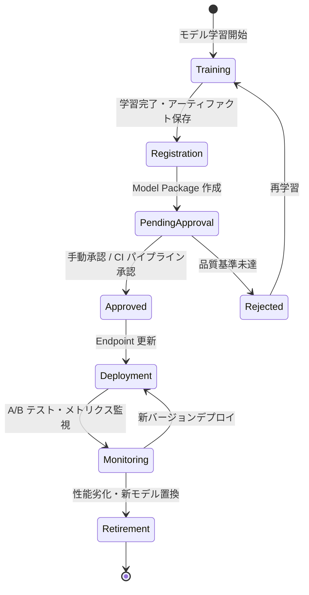

# SageMaker Model Registry ガイド

🌐 **Language / 言語**: 日本語（本ドキュメント）

## 概要

本ドキュメントでは、FSxN S3AP Serverless Patterns Phase 4 における SageMaker Model Registry の活用方法とモデルライフサイクル管理について説明します。

## モデルライフサイクル

### 全体フロー

```
Training → Registration → Approval → Deployment → Monitoring → Retirement
（学習）    （登録）       （承認）    （デプロイ）  （監視）      （廃止）
```

### 各フェーズの詳細



## Phase 1: Training（学習）

### 概要

モデルの学習を実行し、アーティファクト（モデルファイル）を S3 に保存します。

### 出力

- モデルアーティファクト: `s3://<bucket>/models/<model-name>/<version>/model.tar.gz`
- 学習メトリクス: accuracy, loss, F1-score 等

### 本パターンでの位置づけ

UC9（自動運転）では点群セグメンテーションモデルを使用します。学習は本パターンのスコープ外ですが、学習済みモデルを Model Registry に登録して管理します。

## Phase 2: Registration（登録）

### 概要

学習済みモデルを Model Package Group に登録します。

### Model Package Group

```yaml
# CloudFormation リソース定義
SageMakerModelPackageGroup:
  Type: AWS::SageMaker::ModelPackageGroup
  Condition: EnableModelRegistryCondition
  Properties:
    ModelPackageGroupName: !Sub "${AWS::StackName}-model-group"
    ModelPackageGroupDescription: "UC9 Point Cloud Segmentation Models"
    Tags:
      - Key: UseCase
        Value: UC9-AutonomousDriving
      - Key: Phase
        Value: "4"
```

### 登録スクリプト

```bash
# scripts/register_model.py を使用
python scripts/register_model.py \
  --model-package-group "fsxn-uc9-model-group" \
  --model-artifact-uri "s3://bucket/models/pointcloud-seg/v2/model.tar.gz" \
  --image-uri "763104351884.dkr.ecr.ap-northeast-1.amazonaws.com/pytorch-inference:2.0-gpu-py310" \
  --accuracy 0.95 \
  --f1-score 0.92
```

### 登録時のメタデータ

| 項目 | 説明 | 例 |
|------|------|-----|
| ModelApprovalStatus | 初期承認状態 | `PendingManualApproval` |
| InferenceSpecification | 推論コンテナ・インスタンス情報 | PyTorch Inference Container |
| ModelMetrics | 学習時のメトリクス | accuracy: 0.95, loss: 0.03 |
| CustomerMetadataProperties | カスタムメタデータ | training_date, dataset_version |

## Phase 3: Approval（承認）

### 承認ワークフロー

```
Model Package 登録
  │
  ├─ 自動チェック
  │   ├─ メトリクス閾値確認（accuracy > 0.90）
  │   ├─ データドリフト検出
  │   └─ セキュリティスキャン
  │
  └─ 手動承認
      ├─ ML エンジニアレビュー
      ├─ A/B テスト計画確認
      └─ 承認 / 却下
```

### 承認状態の遷移

| 状態 | 説明 | 次のアクション |
|------|------|--------------|
| `PendingManualApproval` | 登録直後、レビュー待ち | レビュー・承認 |
| `Approved` | 承認済み、デプロイ可能 | Endpoint 更新 |
| `Rejected` | 却下、デプロイ不可 | 再学習 or 修正 |

### 承認コマンド

```bash
aws sagemaker update-model-package \
  --model-package-arn "arn:aws:sagemaker:ap-northeast-1:123456789012:model-package/fsxn-uc9-model-group/2" \
  --model-approval-status "Approved" \
  --approval-description "Accuracy 0.95, F1 0.92 - meets production threshold"
```

## Phase 4: Deployment（デプロイ）

### デプロイ戦略

#### A/B テストデプロイ（推奨）

新モデルを既存モデルと並行稼働させ、パフォーマンスを比較します。

```yaml
EndpointConfig:
  ProductionVariants:
    - VariantName: "model-v1"        # 既存モデル（70%）
      ModelName: !Ref ApprovedModelV1
      InitialVariantWeight: 0.7
    - VariantName: "model-v2"        # 新モデル（30%）
      ModelName: !Ref ApprovedModelV2
      InitialVariantWeight: 0.3
```

#### カナリアデプロイ

少量のトラフィック（5-10%）を新モデルに振り分け、問題がなければ段階的に増加。

```
Day 1: v1=95%, v2=5%
Day 3: v1=80%, v2=20%（メトリクス良好時）
Day 7: v1=50%, v2=50%
Day 14: v1=0%, v2=100%（完全切替）
```

#### ブルー/グリーンデプロイ

新しい Endpoint を作成し、DNS / ルーティングで切り替え。ロールバックが容易。

### Model Registry からのデプロイ

```python
# Approved モデルの最新バージョンを取得
import boto3

sm = boto3.client('sagemaker')
response = sm.list_model_packages(
    ModelPackageGroupName='fsxn-uc9-model-group',
    ModelApprovalStatus='Approved',
    SortBy='CreationTime',
    SortOrder='Descending',
    MaxResults=1
)
latest_package_arn = response['ModelPackageSummaryList'][0]['ModelPackageArn']
```

## Phase 5: Monitoring（監視）

### 監視メトリクス

| メトリクス | 説明 | 閾値例 |
|-----------|------|--------|
| Invocations | リクエスト数 | — |
| InvocationLatency | 推論レイテンシ | p99 < 5000ms |
| ModelLatency | モデル処理時間 | p99 < 3000ms |
| Invocation4XXErrors | クライアントエラー率 | < 1% |
| Invocation5XXErrors | サーバーエラー率 | < 0.1% |
| CPUUtilization | CPU 使用率 | < 80% |
| MemoryUtilization | メモリ使用率 | < 80% |

### A/B テスト監視（Inference Comparison Lambda）

```
EventBridge Schedule (5 分間隔)
  └─→ Inference Comparison Lambda
       ├─ DynamoDB ABTestResults から直近 5 分のレコード集計
       ├─ バリアント別メトリクス計算
       │   ├─ avg_latency_ms
       │   ├─ error_rate
       │   └─ request_count
       └─ CloudWatch EMF 出力
```

### アラート設定

```yaml
# 推奨アラーム
- Metric: Invocation5XXErrors
  Threshold: 5
  Period: 300
  Action: SNS → 運用チーム通知

- Metric: ModelLatency (p99)
  Threshold: 5000
  Period: 300
  Action: SNS → ML エンジニア通知
```

## Phase 6: Retirement（廃止）

### 廃止基準

| 基準 | 説明 |
|------|------|
| 性能劣化 | 新モデルが全メトリクスで上回る |
| データドリフト | 学習データと本番データの乖離が閾値超過 |
| セキュリティ | 脆弱性のあるコンテナイメージ使用 |
| コスト | より効率的なモデル/インスタンスが利用可能 |

### 廃止手順

1. A/B テストで新モデルの優位性を確認
2. トラフィックを新モデルに 100% 切替
3. 旧モデルの Endpoint Variant を削除
4. Model Package のステータスを更新（メタデータに廃止理由記録）
5. 一定期間後にモデルアーティファクトをアーカイブ

```bash
# Model Package にメタデータ追加（廃止記録）
aws sagemaker update-model-package \
  --model-package-arn "arn:aws:sagemaker:ap-northeast-1:123456789012:model-package/fsxn-uc9-model-group/1" \
  --customer-metadata-properties '{"retirement_date":"2026-06-01","reason":"replaced_by_v2"}'
```

## CloudFormation 統合

### パラメータ

```yaml
Parameters:
  EnableModelRegistry:
    Type: String
    Default: "false"
    AllowedValues: ["true", "false"]
    Description: "Model Registry 統合を有効化"
```

### Condition による制御

```yaml
Conditions:
  EnableModelRegistryCondition:
    !Equals [!Ref EnableModelRegistry, "true"]
```

Model Registry が無効の場合、直接 ModelName を指定する従来の方式で動作します（Phase 3 互換）。

## ベストプラクティス

1. **バージョニング**: 全モデルを Model Package Group で管理し、バージョン履歴を保持
2. **承認ゲート**: 本番デプロイ前に必ず承認プロセスを経由
3. **A/B テスト**: 新モデルは必ず A/B テストで既存モデルと比較
4. **ロールバック計画**: 問題発生時に即座に前バージョンに戻せる体制
5. **メタデータ管理**: 学習データセット、ハイパーパラメータ、メトリクスを記録
6. **自動化**: CI/CD パイプラインで登録→承認→デプロイを自動化

## 関連ドキュメント

- [推論コスト比較ガイド](inference-cost-comparison.md)
- [Phase 4 設計書](../.kiro/specs/fsxn-s3ap-serverless-patterns-phase4/design.md)
- [AWS SageMaker Model Registry ドキュメント](https://docs.aws.amazon.com/sagemaker/latest/dg/model-registry.html)
