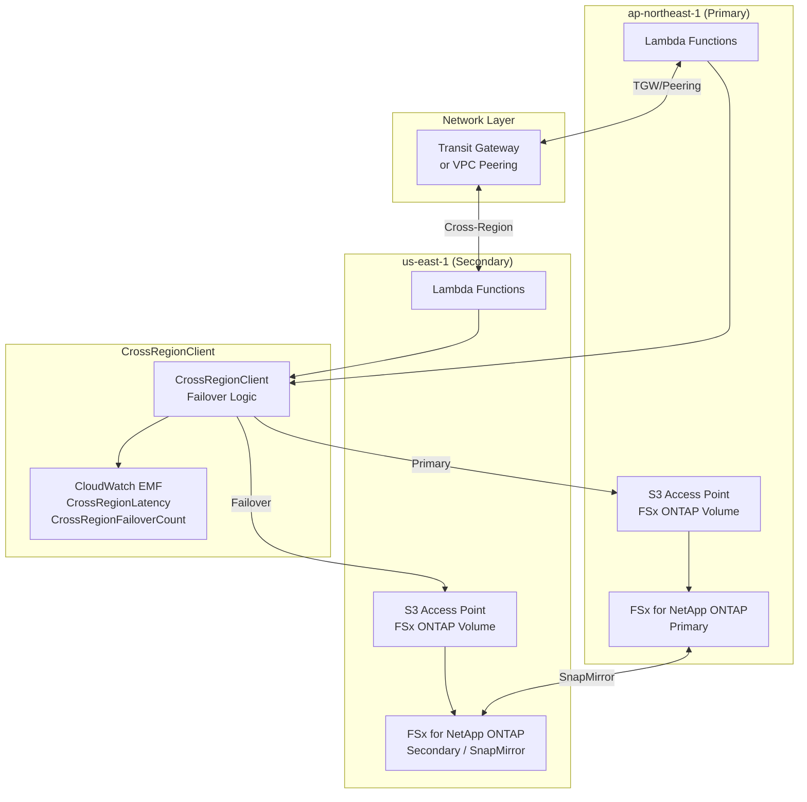
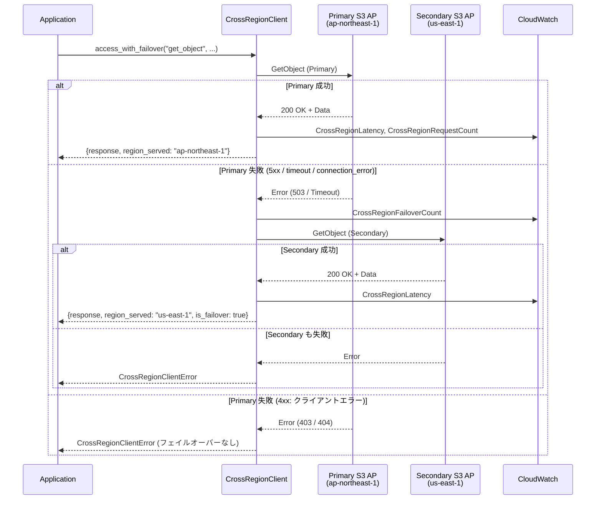

# Cross-Region S3 Access Point アクセスパターン

## 概要

本ドキュメントでは、FSx for NetApp ONTAP の S3 Access Points を複数リージョンから利用する際のアーキテクチャパターン、レイテンシ特性、データ整合性、フェイルオーバー動作について解説する。

主なユースケース:
- **ap-northeast-1（東京）→ us-east-1（バージニア北部）** のクロスリージョンアクセス
- Textract / Comprehend Medical 等の非対応リージョンからのデータ取得
- Multi-Region Active-Active 構成でのデータ共有

---

## アーキテクチャ概要



---

## クロスリージョンアクセスパターン

### パターン 1: 同一リージョン内アクセス（ベースライン）

Lambda 関数と S3 AP が同一リージョンに存在する場合。

| 項目 | 値 |
|------|-----|
| レイテンシ | 1–10 ms |
| データ転送コスト | $0（同一 AZ）/ $0.01/GB（クロス AZ） |
| 整合性 | 強整合性（read-after-write） |

### パターン 2: クロスリージョンアクセス（ap-northeast-1 → us-east-1）

Lambda 関数が ap-northeast-1 で実行され、us-east-1 の S3 AP にアクセスする場合。

| 項目 | 値 |
|------|-----|
| 追加レイテンシ | 50–150 ms（太平洋横断） |
| データ転送コスト | $0.09/GB（リージョン間転送） |
| 整合性 | 結果整合性（SnapMirror レプリケーション遅延あり） |
| ネットワーク要件 | VPC Peering または Transit Gateway |

### パターン 3: フェイルオーバーアクセス

Primary リージョンの S3 AP が利用不可の場合に Secondary リージョンへ自動切替。

| 項目 | 値 |
|------|-----|
| フェイルオーバー検出時間 | 5–30 秒（タイムアウト設定依存） |
| フェイルオーバー後レイテンシ | 50–150 ms 追加 |
| データ鮮度 | RPO に依存（SnapMirror: 通常 < 15 分） |

---

## レイテンシ期待値

### リージョン間レイテンシ参考値

| ルート | 平均レイテンシ | P99 レイテンシ |
|--------|--------------|--------------|
| ap-northeast-1 ↔ us-east-1 | 150–180 ms | 200–250 ms |
| ap-northeast-1 ↔ us-west-2 | 100–130 ms | 150–180 ms |
| ap-northeast-1 ↔ ap-southeast-1 | 60–80 ms | 100–120 ms |
| us-east-1 ↔ eu-west-1 | 70–90 ms | 120–150 ms |

### S3 AP オペレーション別レイテンシ

| オペレーション | 同一リージョン | クロスリージョン（+追加分） |
|--------------|--------------|--------------------------|
| GetObject (1 MB) | 5–15 ms | 55–165 ms |
| GetObject (100 MB) | 50–200 ms | 200–500 ms |
| ListObjectsV2 | 3–10 ms | 53–160 ms |
| PutObject (1 MB) | 10–30 ms | 60–180 ms |
| HeadObject | 2–5 ms | 52–155 ms |

### レイテンシ最適化戦略

1. **データローカリティ**: 頻繁にアクセスするデータは各リージョンにレプリカを配置
2. **キャッシュ活用**: ElastiCache / DynamoDB DAX でメタデータをキャッシュ
3. **バッチ処理**: 複数オブジェクトを一括取得し、ラウンドトリップ回数を削減
4. **Transfer Acceleration**: 大容量ファイルには S3 Transfer Acceleration を検討

---

## データ整合性

### 整合性モデル

| シナリオ | 整合性レベル | 説明 |
|---------|------------|------|
| 同一リージョン読み取り | 強整合性 | S3 AP は read-after-write 整合性を提供 |
| クロスリージョン読み取り | 結果整合性 | SnapMirror レプリケーション遅延（通常 < 15 分） |
| 同一リージョン書き込み | 強整合性 | 書き込み直後に読み取り可能 |
| クロスリージョン書き込み | 結果整合性 | レプリケーション完了まで旧データが返る可能性 |

### 結果整合性の影響と対策

**影響**:
- フェイルオーバー直後に最新データが読めない可能性がある
- SnapMirror のレプリケーション間隔（デフォルト: 5 分）分のデータ損失リスク

**対策**:
1. **バージョニング**: オブジェクトバージョンを確認し、期待するバージョンでなければリトライ
2. **メタデータチェック**: `Last-Modified` ヘッダーで鮮度を確認
3. **書き込み確認**: 書き込み後にレプリケーション完了を待機（クリティカルデータのみ）
4. **Conflict Resolution**: 同一キーへの並行書き込みは Last-Writer-Wins で解決

---

## フェイルオーバー動作

### CrossRegionClient フェイルオーバーフロー



### フェイルオーバー対象エラー

| エラータイプ | フェイルオーバー対象 | 理由 |
|------------|-------------------|------|
| HTTP 500 (Internal Server Error) | ✅ | サーバー側一時障害 |
| HTTP 502 (Bad Gateway) | ✅ | プロキシ/ゲートウェイ障害 |
| HTTP 503 (Service Unavailable) | ✅ | サービス一時停止 |
| HTTP 504 (Gateway Timeout) | ✅ | タイムアウト |
| ConnectTimeoutError | ✅ | 接続タイムアウト |
| ReadTimeoutError | ✅ | 読み取りタイムアウト |
| EndpointConnectionError | ✅ | エンドポイント接続不可 |
| HTTP 400 (Bad Request) | ❌ | クライアント側エラー |
| HTTP 403 (Forbidden) | ❌ | 権限不足（別リージョンでも同じ） |
| HTTP 404 (Not Found) | ❌ | オブジェクト不在 |

### フェイルオーバーメトリクス

| メトリクス名 | 単位 | 説明 |
|------------|------|------|
| CrossRegionLatency | Milliseconds | オペレーション実行時間 |
| CrossRegionRequestCount | Count | リクエスト総数 |
| CrossRegionFailoverCount | Count | フェイルオーバー発生回数 |

---

## ネットワークアーキテクチャ

### VPC Peering 構成

```
┌─────────────────────────────────────────────────────────────┐
│                    VPC Peering Connection                     │
│                                                              │
│  ┌──────────────────────┐    ┌──────────────────────┐       │
│  │ ap-northeast-1 VPC   │    │ us-east-1 VPC        │       │
│  │                      │    │                      │       │
│  │  ┌────────────────┐  │    │  ┌────────────────┐  │       │
│  │  │ Lambda (VPC内) │  │◄──►│  │ Lambda (VPC内) │  │       │
│  │  └────────────────┘  │    │  └────────────────┘  │       │
│  │  ┌────────────────┐  │    │  ┌────────────────┐  │       │
│  │  │ FSx ONTAP ENI  │  │    │  │ FSx ONTAP ENI  │  │       │
│  │  └────────────────┘  │    │  └────────────────┘  │       │
│  └──────────────────────┘    └──────────────────────┘       │
└─────────────────────────────────────────────────────────────┘
```

**VPC Peering の特徴**:
- 1 対 1 接続（リージョンペアごとに設定）
- 帯域幅制限なし
- 追加コスト: データ転送料金のみ（$0.09/GB）
- 推移的ルーティング不可

### Transit Gateway 構成

```
┌─────────────────────────────────────────────────────────────┐
│                    Transit Gateway (Inter-Region)             │
│                                                              │
│  ┌──────────────────────┐    ┌──────────────────────┐       │
│  │ TGW ap-northeast-1   │◄──►│ TGW us-east-1        │       │
│  │  ┌────────────────┐  │    │  ┌────────────────┐  │       │
│  │  │ VPC Attachment  │  │    │  │ VPC Attachment  │  │       │
│  │  └────────────────┘  │    │  └────────────────┘  │       │
│  └──────────────────────┘    └──────────────────────┘       │
│                                                              │
│  メリット:                                                    │
│  - 複数 VPC 間のハブ&スポーク接続                              │
│  - 推移的ルーティング対応                                      │
│  - 集中管理（ルートテーブル）                                   │
└─────────────────────────────────────────────────────────────┘
```

**Transit Gateway の特徴**:
- ハブ&スポーク型（複数 VPC 接続に最適）
- 推移的ルーティング対応
- 帯域幅: 最大 50 Gbps（バースト）
- 追加コスト: $0.05/hour（アタッチメント）+ データ転送料金

### 構成選択ガイド

| 要件 | VPC Peering | Transit Gateway |
|------|-------------|-----------------|
| 2 リージョン間のみ | ✅ 推奨 | △ オーバースペック |
| 3+ リージョン接続 | △ 管理複雑 | ✅ 推奨 |
| 推移的ルーティング | ❌ 非対応 | ✅ 対応 |
| コスト（低トラフィック） | ✅ 安価 | △ 固定費あり |
| コスト（高トラフィック） | ✅ 同等 | ✅ 同等 |
| セットアップ複雑度 | ✅ 簡単 | △ やや複雑 |

---

## クロスリージョンデータ転送コスト

### AWS データ転送料金（2024 年時点）

| 転送パス | 料金 |
|---------|------|
| 同一 AZ 内 | $0.00/GB |
| 同一リージョン・クロス AZ | $0.01/GB |
| ap-northeast-1 → us-east-1 | $0.09/GB |
| us-east-1 → ap-northeast-1 | $0.09/GB |
| インターネット OUT（最初の 10 TB） | $0.114/GB |

### 月額コスト試算

| シナリオ | 月間転送量 | 月額コスト |
|---------|-----------|-----------|
| 低トラフィック（メタデータのみ） | 1 GB | $0.09 |
| 中トラフィック（小ファイル中心） | 100 GB | $9.00 |
| 高トラフィック（大容量ファイル） | 1 TB | $92.16 |
| 大規模（動画/点群データ） | 10 TB | $921.60 |

### コスト最適化戦略

1. **データローカリティ最大化**: 処理対象データと Lambda を同一リージョンに配置
2. **SnapMirror 活用**: 定期レプリケーションで必要データを事前配置
3. **圧縮転送**: gzip / zstd 圧縮でデータ量を削減（50–80% 削減可能）
4. **差分転送**: 変更分のみ転送（SnapMirror の差分レプリケーション）
5. **キャッシュ層**: 頻繁アクセスデータは各リージョンの ElastiCache に保持

---

## 設定例

### 環境変数による S3 AP ARN 設定

```bash
# Lambda 環境変数
S3AP_ARN_AP_NORTHEAST_1=arn:aws:s3:ap-northeast-1:123456789012:accesspoint/fsxn-primary
S3AP_ARN_US_EAST_1=arn:aws:s3:us-east-1:123456789012:accesspoint/fsxn-secondary
```

### CrossRegionClient 使用例

```python
from shared.cross_region_client import CrossRegionClient, CrossRegionConfig

config = CrossRegionConfig(target_region="us-east-1")
client = CrossRegionClient(
    config=config,
    primary_region="ap-northeast-1",
    secondary_region="us-east-1",
    failover_enabled=True,
)

# リージョン別エンドポイント検出
endpoints = client.discover_regional_endpoints()
# {"ap-northeast-1": "arn:aws:s3:...", "us-east-1": "arn:aws:s3:..."}

# フェイルオーバー付きアクセス
result = client.access_with_failover(
    "get_object",
    Bucket="my-access-point-alias",
    Key="data/input.json",
)
print(f"Served by: {result['region_served']}")
print(f"Latency: {result['latency_ms']:.1f} ms")
print(f"Failover: {result['is_failover']}")
```

---

## 関連ドキュメント

- [Multi-Region Step Functions 設計](./step-functions-design.md)
- [Disaster Recovery パターン](./disaster-recovery.md)
- [コスト最適化ガイド](../cost-optimization-guide.md)
- [CrossRegionClient API リファレンス](../../shared/cross_region_client.py)
