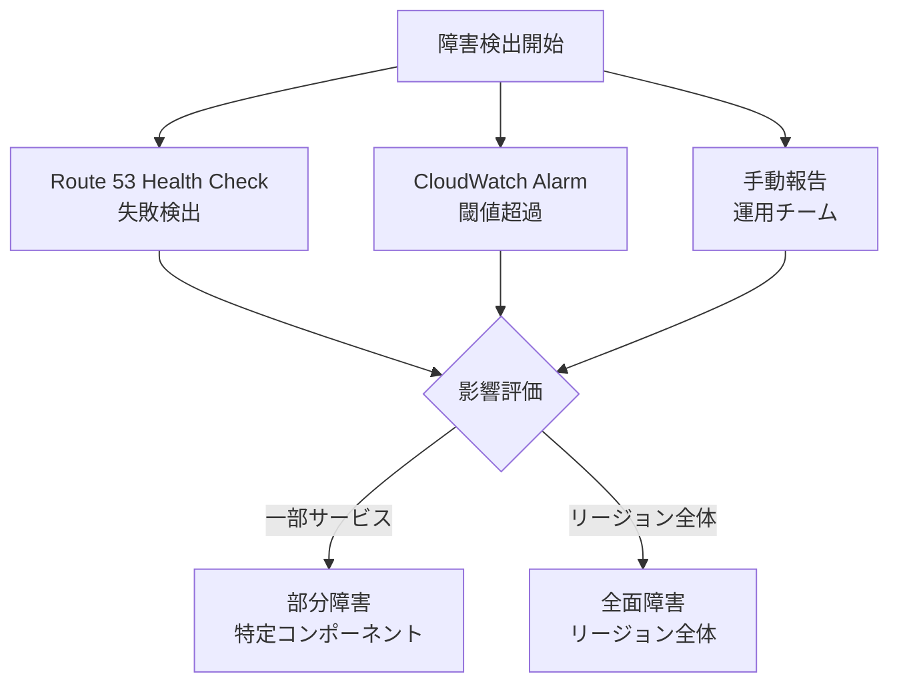

# Disaster Recovery パターン

## 概要

本ドキュメントでは、FSxN S3AP Serverless Patterns の Disaster Recovery (DR) 設計を定義する。RPO/RTO 要件に基づく 3 段階の DR Tier、コンポーネント別復旧戦略、フェイルオーバーランブック、コスト分析、テスト戦略を解説する。

---

## DR Tier 定義

### 3 段階 DR モデル

| Tier | パターン | RPO | RTO | コスト | 適用シナリオ |
|------|---------|-----|-----|--------|------------|
| Tier 1 | Active-Active | Near-zero（通常 < 1 秒） | < 5 分 | 高 | ミッションクリティカル、金融、医療 |
| Tier 2 | Warm Standby | < 1 時間 | < 30 分 | 中 | 業務システム、SLA 99.9% |
| Tier 3 | Pilot Light | < 24 時間 | < 4 時間 | 低 | 開発/検証環境、コスト最優先 |

### Tier 別アーキテクチャ

```mermaid
graph TB
    subgraph "Tier 1: Active-Active (RPO near-zero, RTO<5min)"
        T1_P[Primary Region<br/>全コンポーネント稼働]
        T1_S[Secondary Region<br/>全コンポーネント稼働]
        T1_GT[Global Tables<br/>リアルタイムレプリケーション]
        T1_SM[SnapMirror<br/>同期レプリケーション]
        T1_P <--> T1_GT <--> T1_S
        T1_P <--> T1_SM <--> T1_S
    end

    subgraph "Tier 2: Warm Standby (RPO<1h, RTO<30min)"
        T2_P[Primary Region<br/>全コンポーネント稼働]
        T2_S[Secondary Region<br/>最小構成で待機]
        T2_GT[Global Tables<br/>非同期レプリケーション]
        T2_SM[SnapMirror<br/>非同期 (15分間隔)]
        T2_P <--> T2_GT <--> T2_S
        T2_P <--> T2_SM <--> T2_S
    end

    subgraph "Tier 3: Pilot Light (RPO<24h, RTO<4h)"
        T3_P[Primary Region<br/>全コンポーネント稼働]
        T3_S[Secondary Region<br/>CFn テンプレートのみ]
        T3_BACKUP[S3 バックアップ<br/>日次]
        T3_P --> T3_BACKUP
        T3_BACKUP -.->|復旧時デプロイ| T3_S
    end
```

---

## コンポーネント別復旧戦略

### DynamoDB (Task Token Store)

| Tier | 戦略 | RPO | 復旧手順 |
|------|------|-----|---------|
| Tier 1 | Global Tables (Active-Active) | Near-zero | 自動（レプリケーション 通常 < 1 秒、MREC） |
| Tier 2 | Global Tables (Read Replica) | < 1 秒 | Secondary をプロモート |
| Tier 3 | Point-in-Time Recovery (PITR) | < 5 分 | PITR から復元（最大 35 日前まで） |

**Global Tables 設定**:
```yaml
# shared/cfn/global-task-token-store.yaml
Resources:
  GlobalTaskTokenStore:
    Type: AWS::DynamoDB::GlobalTable
    Properties:
      BillingMode: PAY_PER_REQUEST
      StreamSpecification:
        StreamViewType: NEW_AND_OLD_IMAGES
      Replicas:
        - Region: ap-northeast-1
          PointInTimeRecoverySpecification:
            PointInTimeRecoveryEnabled: true
        - Region: us-east-1
          PointInTimeRecoverySpecification:
            PointInTimeRecoveryEnabled: true
```

### Lambda Functions

| Tier | 戦略 | RPO | 復旧手順 |
|------|------|-----|---------|
| Tier 1 | 両リージョンにデプロイ済み | N/A | 即時利用可能 |
| Tier 2 | CloudFormation StackSets | N/A | スタック更新（< 5 分） |
| Tier 3 | CloudFormation テンプレート保管 | N/A | 新規デプロイ（< 30 分） |

**StackSets によるマルチリージョンデプロイ**:
- Primary リージョンのテンプレート変更が自動的に Secondary に伝播
- Lambda コードは S3 バケット（リージョン別）に配置
- 環境変数はリージョン別パラメータファイルで管理

### Step Functions

| Tier | 戦略 | RPO | 復旧手順 |
|------|------|-----|---------|
| Tier 1 | 両リージョンに State Machine 配置 | N/A | Route 53 フェイルオーバー |
| Tier 2 | CloudFormation StackSets | N/A | スタック更新 + 新規実行開始 |
| Tier 3 | CloudFormation テンプレート保管 | N/A | 新規デプロイ + 新規実行開始 |

**注意**: Step Functions の実行中状態はリージョン固有。フェイルオーバー時に実行中のワークフローは失われる。冪等性設計により再実行で復旧可能。

### S3 Access Point / FSx ONTAP

| Tier | 戦略 | RPO | 復旧手順 |
|------|------|-----|---------|
| Tier 1 | SnapMirror 同期レプリケーション | 0 | SnapMirror break + S3 AP 切替 |
| Tier 2 | SnapMirror 非同期（15 分間隔） | < 15 分 | SnapMirror break + S3 AP 切替 |
| Tier 3 | 日次バックアップ（S3 / Snapshot） | < 24 時間 | Snapshot 復元 + S3 AP 再作成 |

**SnapMirror 復旧手順**:
1. SnapMirror 関係を break（Secondary を書き込み可能に）
2. Secondary の S3 Access Point を有効化
3. CrossRegionClient のエンドポイントを更新
4. アプリケーションが Secondary S3 AP を使用開始

### FSx for NetApp ONTAP (SnapMirror)

| レプリケーションモード | RPO | スループット | 適用 Tier |
|---------------------|-----|------------|----------|
| Synchronous | 0 | 制限あり | Tier 1 |
| Asynchronous (5 min) | < 5 分 | 高 | Tier 1/2 |
| Asynchronous (15 min) | < 15 分 | 高 | Tier 2 |
| Asynchronous (1 hour) | < 1 時間 | 最高 | Tier 2/3 |

---

## フェイルオーバーランブック

### Phase 1: 検出（Detection）



**検出メカニズム**:

| メカニズム | 検出時間 | 対象 |
|-----------|---------|------|
| Route 53 Health Check | 10–30 秒 | エンドポイント可用性 |
| CloudWatch Composite Alarm | 1–5 分 | 複合条件（エラー率 + レイテンシ） |
| Step Functions 実行失敗率 | 5 分 | ワークフロー障害 |
| 手動エスカレーション | 可変 | 自動検出できない障害 |

### Phase 2: 判断（Decision）

| 条件 | アクション | 承認者 |
|------|-----------|--------|
| Health Check 3 回連続失敗 | 自動フェイルオーバー（Tier 1） | 不要（自動） |
| エラー率 > 50%（5 分間） | フェイルオーバー推奨通知 | 運用リーダー |
| リージョン全面障害（AWS 公式） | 即時フェイルオーバー | 運用リーダー |
| 部分障害（特定サービス） | 影響評価後に判断 | アーキテクト + 運用リーダー |

### Phase 3: 実行（Execution）

#### Tier 1 (Active-Active) フェイルオーバー

```bash
# 1. Route 53 レコード更新（自動 or 手動）
# Health Check 失敗により自動的に Secondary にルーティング

# 2. DynamoDB Global Tables — 自動（追加操作不要）
# Secondary レプリカが自動的に読み書き可能

# 3. SnapMirror break（必要な場合）
# ONTAP CLI:
snapmirror break -destination-path svm_secondary:vol_data

# 4. CrossRegionClient エンドポイント更新
# 環境変数 or DynamoDB 設定テーブルを更新
aws dynamodb put-item \
  --table-name fsxn-s3ap-regional-config \
  --item '{"region": {"S": "us-east-1"}, "s3ap_arn": {"S": "arn:aws:s3:us-east-1:..."}, "status": {"S": "active"}}'

# 5. EventBridge ルール有効化（Secondary）
aws events enable-rule --name fsxn-s3ap-scheduler --region us-east-1
```

#### Tier 2 (Warm Standby) フェイルオーバー

```bash
# 1. Secondary リージョンのリソースをスケールアップ
aws cloudformation update-stack \
  --stack-name fsxn-s3ap-secondary \
  --parameters ParameterKey=DesiredCapacity,ParameterValue=2 \
  --region us-east-1

# 2. SnapMirror break
snapmirror break -destination-path svm_secondary:vol_data

# 3. Route 53 手動フェイルオーバー
aws route53 change-resource-record-sets \
  --hosted-zone-id Z1234567890 \
  --change-batch file://failover-change-batch.json

# 4. EventBridge スケジューラ有効化
aws events enable-rule --name fsxn-s3ap-scheduler --region us-east-1

# 5. 動作確認（スモークテスト）
aws stepfunctions start-execution \
  --state-machine-arn arn:aws:states:us-east-1:...:stateMachine:fsxn-s3ap \
  --input '{"test": true}' \
  --region us-east-1
```

#### Tier 3 (Pilot Light) フェイルオーバー

```bash
# 1. CloudFormation スタックデプロイ（Secondary）
aws cloudformation deploy \
  --template-file template-deploy.yaml \
  --stack-name fsxn-s3ap-dr \
  --parameter-overrides file://params/dr-us-east-1.json \
  --region us-east-1

# 2. S3 バックアップからデータ復元
aws s3 sync s3://fsxn-backup-bucket/latest/ s3://fsxn-dr-bucket/ --region us-east-1

# 3. DynamoDB PITR 復元
aws dynamodb restore-table-to-point-in-time \
  --source-table-name task-token-store \
  --target-table-name task-token-store-restored \
  --use-latest-restorable-time \
  --region us-east-1

# 4. Route 53 更新
aws route53 change-resource-record-sets ...

# 5. 動作確認
aws stepfunctions start-execution ...
```

### Phase 4: 検証（Validation）

| チェック項目 | 検証方法 | 合格基準 |
|------------|---------|---------|
| Step Functions 実行 | テストデータで実行 | 正常完了 |
| S3 AP データアクセス | GetObject テスト | 200 OK |
| DynamoDB 読み書き | Token 保存 + 取得 | 一致確認 |
| Lambda 実行 | 各 Lambda を個別呼び出し | エラーなし |
| エンドツーエンド | 本番相当データで実行 | 全ステップ成功 |
| メトリクス出力 | CloudWatch 確認 | メトリクス記録あり |

---

## DR Tier 別コスト分析

### 月額コスト比較（ap-northeast-1 + us-east-1）

| コンポーネント | Tier 1 | Tier 2 | Tier 3 |
|--------------|--------|--------|--------|
| DynamoDB Global Tables | $40 | $40 | $20 (PITR のみ) |
| Lambda Functions | $60 | $10 (最小構成) | $0 (未デプロイ) |
| Step Functions | $100 | $10 (最小実行) | $0 (未デプロイ) |
| FSx ONTAP (Secondary) | $500 | $300 (小容量) | $0 (Snapshot のみ) |
| SnapMirror データ転送 | $50 | $30 | $5 (日次) |
| Route 53 Health Checks | $2 | $2 | $1 |
| EventBridge | $5 | $2 | $0 |
| S3 バックアップ | $5 | $5 | $10 |
| **月額合計** | **$762** | **$399** | **$36** |
| **年額合計** | **$9,144** | **$4,788** | **$432** |

### コスト対効果分析

| Tier | 月額コスト | ダウンタイムコスト（1 時間あたり） | 損益分岐点 |
|------|-----------|-------------------------------|-----------|
| Tier 1 | $762 | > $9,144/h | 年 1 回以上の障害 |
| Tier 2 | $399 | > $1,600/h | 年 3 回以上の障害 |
| Tier 3 | $36 | > $100/h | コスト最小化優先 |

---

## テスト戦略

### 四半期 DR ドリル

| 項目 | 内容 | 頻度 |
|------|------|------|
| テーブルトップ演習 | ランブック確認、ロール確認 | 月次 |
| コンポーネントテスト | 個別コンポーネントのフェイルオーバー | 月次 |
| フルDRドリル | 全コンポーネントのフェイルオーバー実行 | 四半期 |
| カオスエンジニアリング | 障害注入テスト（FIS） | 四半期 |

### DR ドリル実行手順

```
1. 事前準備（1 週間前）
   - ドリル計画書作成
   - 関係者への通知
   - ロールバック手順の確認

2. ドリル実行（当日）
   - 09:00 - 障害シナリオ開始（Primary リージョン障害シミュレーション）
   - 09:05 - 検出確認（アラート発報確認）
   - 09:10 - フェイルオーバー実行
   - 09:30 - 検証テスト実行
   - 10:00 - 結果記録

3. フェイルバック（ドリル終了後）
   - Secondary → Primary への切り戻し
   - SnapMirror 再同期
   - Route 53 レコード復元
   - 正常性確認

4. 振り返り（1 週間以内）
   - ドリル結果レポート作成
   - 改善点の特定
   - ランブック更新
```

### 自動フェイルオーバーテスト

```python
# DR テストスクリプト例
import boto3
import time

def test_failover_detection():
    """Route 53 Health Check によるフェイルオーバー検出テスト"""
    # 1. Primary の Health Check を意図的に失敗させる
    # 2. Route 53 のフェイルオーバー発動を確認
    # 3. Secondary へのルーティングを検証
    pass

def test_dynamodb_replication():
    """DynamoDB Global Tables レプリケーション遅延テスト"""
    # 1. Primary に書き込み
    # 2. Secondary から読み取り
    # 3. レプリケーション遅延を計測（< 1 秒を確認）
    pass

def test_snapmirror_break():
    """SnapMirror break + S3 AP 切替テスト"""
    # 1. SnapMirror break 実行
    # 2. Secondary S3 AP からデータ読み取り
    # 3. データ整合性確認
    pass
```

### AWS Fault Injection Simulator (FIS) 活用

| 実験 | 対象 | 期待結果 |
|------|------|---------|
| Lambda 障害注入 | Primary Lambda | Secondary で処理継続 |
| DynamoDB スロットリング | Primary テーブル | Global Tables で Secondary 読み取り |
| ネットワーク遅延 | VPC 間通信 | タイムアウト検出 + フェイルオーバー |
| AZ 障害 | Primary AZ | マルチ AZ で継続 |

---

## 運用チェックリスト

### 日次確認

- [ ] Route 53 Health Check ステータス: Healthy
- [ ] DynamoDB Global Tables レプリケーション遅延: < 1 秒
- [ ] SnapMirror レプリケーション状態: Healthy
- [ ] CloudWatch Alarm 状態: OK

### 週次確認

- [ ] DR リソースのコスト確認
- [ ] バックアップ完了確認（S3, Snapshot）
- [ ] セキュリティパッチ適用状況

### 四半期確認

- [ ] DR ドリル実施
- [ ] ランブック更新
- [ ] RTO/RPO 目標達成確認
- [ ] コスト最適化レビュー

---

## 関連ドキュメント

- [Cross-Region S3 AP アクセスパターン](./cross-region-s3ap.md)
- [Multi-Region Step Functions 設計](./step-functions-design.md)
- [コスト最適化ガイド](../cost-optimization-guide.md)
- [Global Task Token Store テンプレート](../../shared/cfn/global-task-token-store.yaml)
