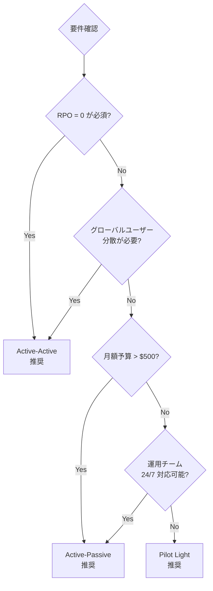
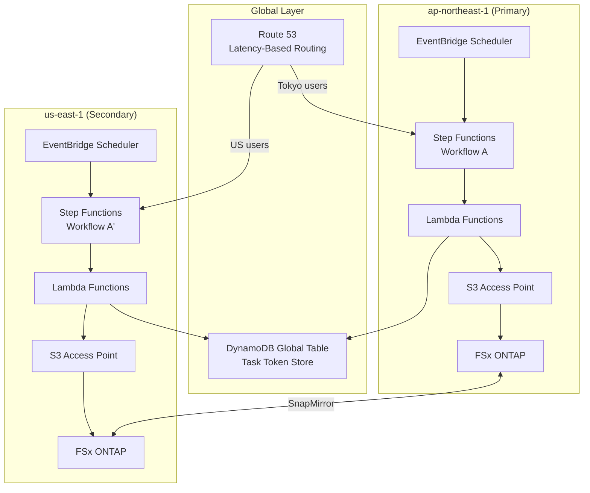
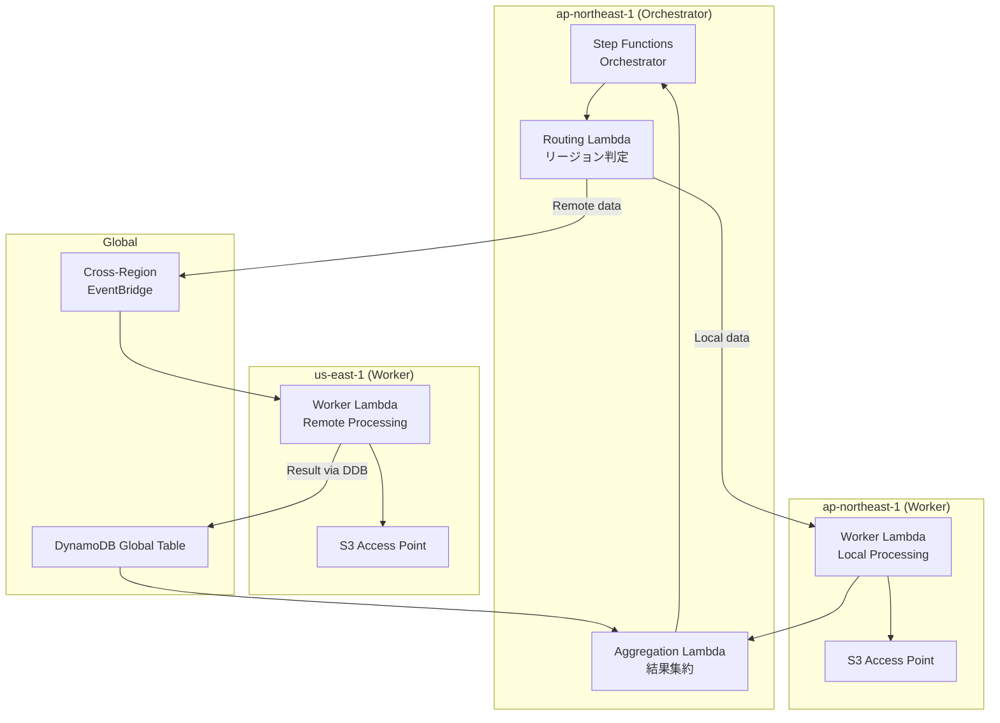
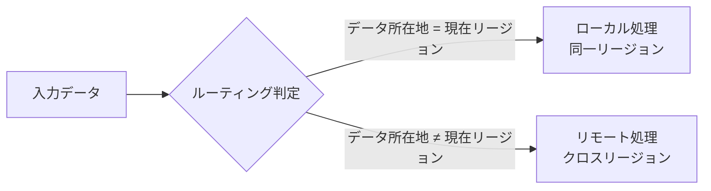
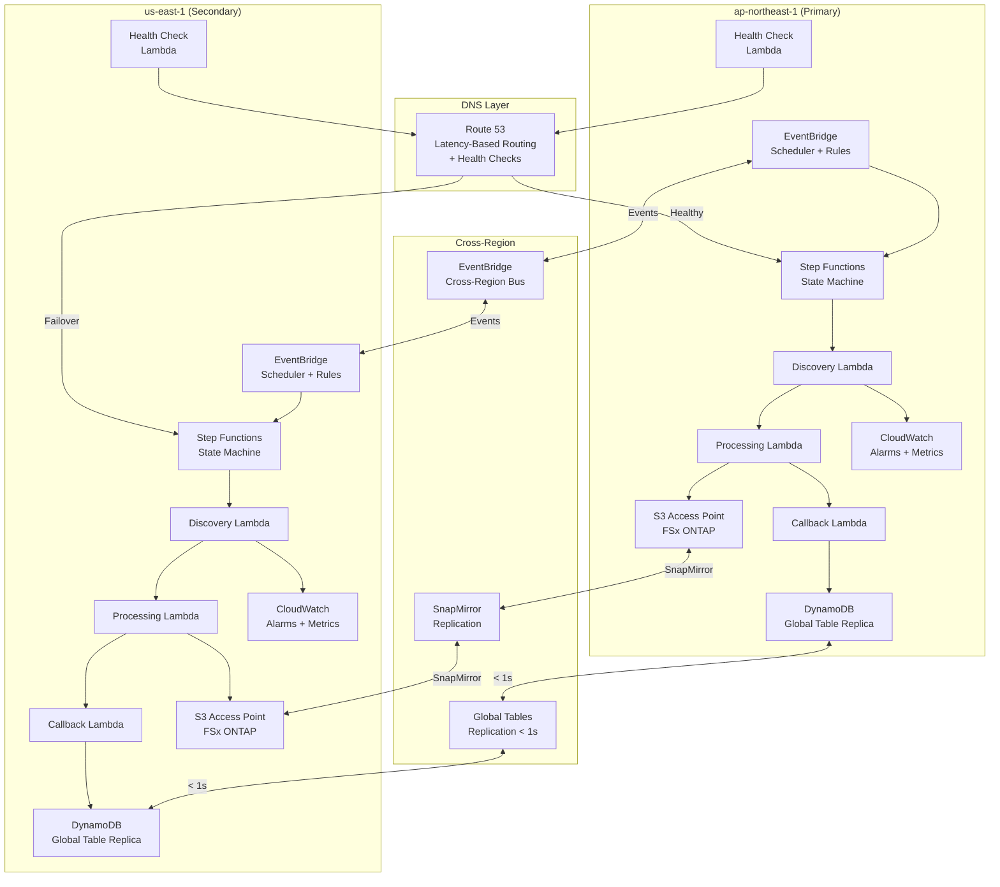

# Multi-Region Step Functions 設計ドキュメント

## 概要

本ドキュメントでは、FSxN S3AP Serverless Patterns を複数リージョンで運用するための Step Functions 設計パターンを定義する。Active-Active / Active-Passive の 2 つのデプロイモデルを比較し、データフロー、整合性モデル、リファレンスアーキテクチャを解説する。

---

## デプロイモデル比較

### Active-Active vs Active-Passive

| 特性 | Active-Active | Active-Passive |
|------|--------------|----------------|
| 両リージョンでリクエスト処理 | ✅ | ❌（Primary のみ） |
| RPO (Recovery Point Objective) | 0（データ損失なし） | < 1 時間 |
| RTO (Recovery Time Objective) | < 5 分 | < 30 分 |
| コスト | 高（両リージョン常時稼働） | 中（Secondary は最小構成） |
| 複雑度 | 高（コンフリクト解決必要） | 低（単方向レプリケーション） |
| ユースケース | ミッションクリティカル、グローバル分散 | コスト重視、リージョン障害対策 |
| データ整合性 | 結果整合性（リージョン間） | 強整合性（Primary 内） |
| フェイルオーバー | 自動（Route 53 ヘルスチェック） | 手動 or 半自動 |

### 推奨選択基準

---

## パターン 1: 独立リージョンワークフロー

各リージョンが独立した Step Functions ワークフローを実行し、リージョン固有のデータを処理する。

### アーキテクチャ

### 特徴

- 各リージョンが完全に独立して動作
- リージョン間の依存関係なし（障害分離）
- DynamoDB Global Tables で Task Token を共有
- SnapMirror でデータを非同期レプリケーション

### 適用シナリオ

- リージョン固有のデータ処理（地域別規制対応）
- レイテンシ最小化が最優先
- リージョン間のデータ依存が少ない

---

## パターン 2: 協調ワークフロー

Primary リージョンがオーケストレーションを担当し、必要に応じて Secondary リージョンの Lambda を呼び出す。

### アーキテクチャ

### 特徴

- 単一のオーケストレーターが全体フローを制御
- Cross-Region EventBridge でリモートワーカーを起動
- DynamoDB Global Tables で結果を集約
- 複雑なワークフローの一元管理が可能

### 適用シナリオ

- 複数リージョンのデータを統合処理
- 中央集権的なワークフロー管理が必要
- リージョン間のデータ依存が高い

---

## データフロー設計

### 入力ルーティング

**ルーティング判定基準**:

1. **データローカリティ**: データが存在するリージョンで処理（最優先）
2. **サービス可用性**: 必要な AWS サービスが利用可能なリージョンで処理
3. **レイテンシ要件**: SLA に基づき最適リージョンを選択
4. **コスト**: データ転送コストを最小化するリージョンを選択

### 結果集約

| 集約パターン | 説明 | 適用シナリオ |
|------------|------|------------|
| Merge | 全リージョンの結果を統合 | レポート生成、分析 |
| First-Response | 最初に返った結果を採用 | レイテンシ最小化 |
| Quorum | 過半数の一致結果を採用 | 高信頼性要件 |
| Region-Priority | Primary の結果を優先 | Active-Passive |

### コンフリクト解決

同一リソースに対する並行書き込みが発生した場合の解決戦略:

| 戦略 | 説明 | トレードオフ |
|------|------|------------|
| Last-Writer-Wins (LWW) | タイムスタンプが最新の書き込みを採用 | シンプルだがデータ損失リスク |
| Version Vector | バージョンベクトルで因果関係を追跡 | 正確だが複雑 |
| Application-Level | アプリケーションロジックで解決 | 柔軟だが実装コスト高 |
| Conflict-Free (CRDT) | 数学的に衝突しないデータ構造 | 適用範囲が限定的 |

**本プロジェクトの採用戦略**: Last-Writer-Wins (LWW)
- DynamoDB Global Tables のデフォルト動作と一致
- Task Token Store は書き込み後に読み取りのみ（並行書き込みが稀）
- `source_region` 属性でデバッグ・監査が可能

---

## リファレンスアーキテクチャ

### Active-Active 完全構成

### コンポーネント別リージョン配置

| コンポーネント | ap-northeast-1 | us-east-1 | レプリケーション |
|--------------|----------------|-----------|----------------|
| Step Functions | ✅ Primary | ✅ Secondary | CloudFormation StackSets |
| Lambda Functions | ✅ | ✅ | CloudFormation StackSets |
| DynamoDB (Task Token) | ✅ Replica | ✅ Replica | Global Tables (< 1s) |
| S3 Access Point | ✅ | ✅ | SnapMirror (< 15 min) |
| FSx ONTAP | ✅ Primary | ✅ DR | SnapMirror |
| EventBridge | ✅ | ✅ | Cross-Region Rules |
| CloudWatch | ✅ | ✅ | 独立（リージョン別） |
| Route 53 | グローバル | グローバル | — |

---

## 整合性モデル

### 読み取り整合性

| データソース | 同一リージョン | クロスリージョン | レプリケーション遅延 |
|------------|--------------|----------------|-------------------|
| DynamoDB Global Tables | 強整合性 | 結果整合性 | < 1 秒（通常） |
| FSx ONTAP (SnapMirror) | 強整合性 | 結果整合性 | < 15 分（設定依存） |
| S3 Access Point | 強整合性 | 結果整合性 | FSx ONTAP に依存 |
| Step Functions 実行履歴 | 強整合性 | N/A（リージョン固有） | — |

### 書き込み整合性

| シナリオ | 整合性保証 | 実装方法 |
|---------|-----------|---------|
| Task Token 書き込み | リージョン内強整合性 | DynamoDB conditional write |
| Task Token 読み取り（別リージョン） | 結果整合性（< 1s） | Global Tables レプリケーション |
| ファイル書き込み | リージョン内強整合性 | S3 AP write-after-read |
| ファイル読み取り（別リージョン） | 結果整合性 | SnapMirror レプリケーション |

### 整合性に関する設計判断

1. **Task Token Store**: Global Tables の結果整合性（< 1 秒）は Callback Pattern に十分
   - SageMaker ジョブ完了 → Callback は通常数分〜数時間後
   - 1 秒のレプリケーション遅延は実用上問題なし

2. **ファイルデータ**: SnapMirror の結果整合性（< 15 分）はバッチ処理に十分
   - EventBridge Scheduler のポーリング間隔（デフォルト: 5 分）と整合
   - リアルタイム処理が必要な場合はデータローカリティを優先

3. **ワークフロー状態**: リージョン固有（レプリケーション不要）
   - 各リージョンの Step Functions は独立して状態管理
   - フェイルオーバー時は新規実行として開始

---

## 運用考慮事項

### デプロイ戦略

| 方式 | 説明 | 推奨シナリオ |
|------|------|------------|
| CloudFormation StackSets | 複数リージョンに同一テンプレートをデプロイ | Active-Active |
| 個別デプロイ | リージョンごとにパラメータを変えてデプロイ | Active-Passive |
| CDK Pipelines | CDK ベースのマルチリージョンパイプライン | 大規模プロジェクト |

### モニタリング

- **リージョン別ダッシュボード**: 各リージョンの Step Functions 実行成功率、レイテンシ
- **クロスリージョンメトリクス**: CrossRegionFailoverCount、レプリケーション遅延
- **アラート**: Primary リージョン障害検出 → SNS → 運用チーム通知

### コスト見積もり（月額）

| コンポーネント | Active-Active | Active-Passive |
|--------------|--------------|----------------|
| Step Functions | $50 × 2 = $100 | $50 + $5 = $55 |
| Lambda | $30 × 2 = $60 | $30 + $3 = $33 |
| DynamoDB Global Tables | $20 × 2 = $40 | $20 × 2 = $40 |
| データ転送 | $50 | $10 |
| Route 53 Health Checks | $2 | $2 |
| **合計** | **$252** | **$140** |

※ 上記は中規模ワークロード（1,000 実行/日）の概算

---

## 関連ドキュメント

- [Cross-Region S3 AP アクセスパターン](./cross-region-s3ap.md)
- [Disaster Recovery パターン](./disaster-recovery.md)
- [DynamoDB Global Tables テンプレート](../../shared/cfn/global-task-token-store.yaml)
- [Multi-Region Base テンプレート](../../shared/cfn/multi-region-base.yaml)
