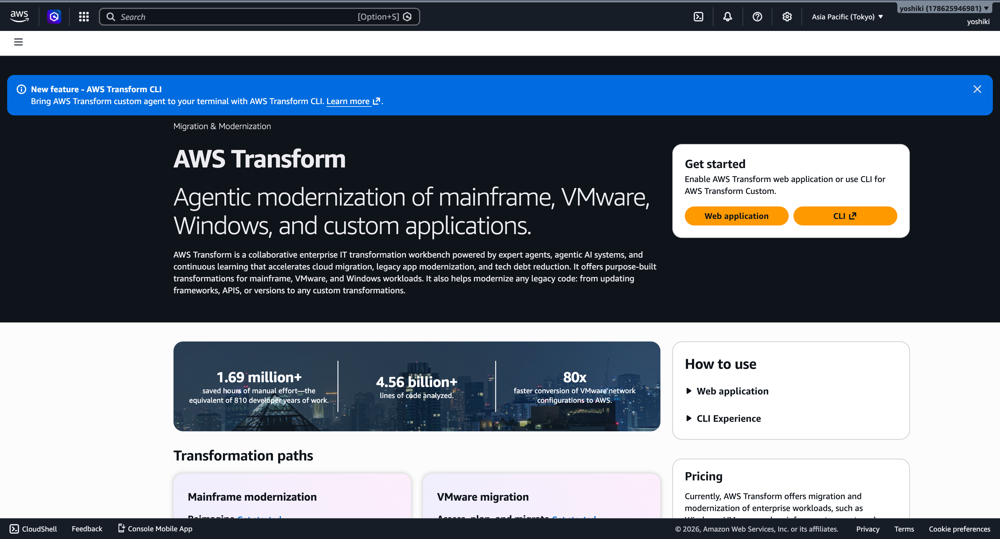
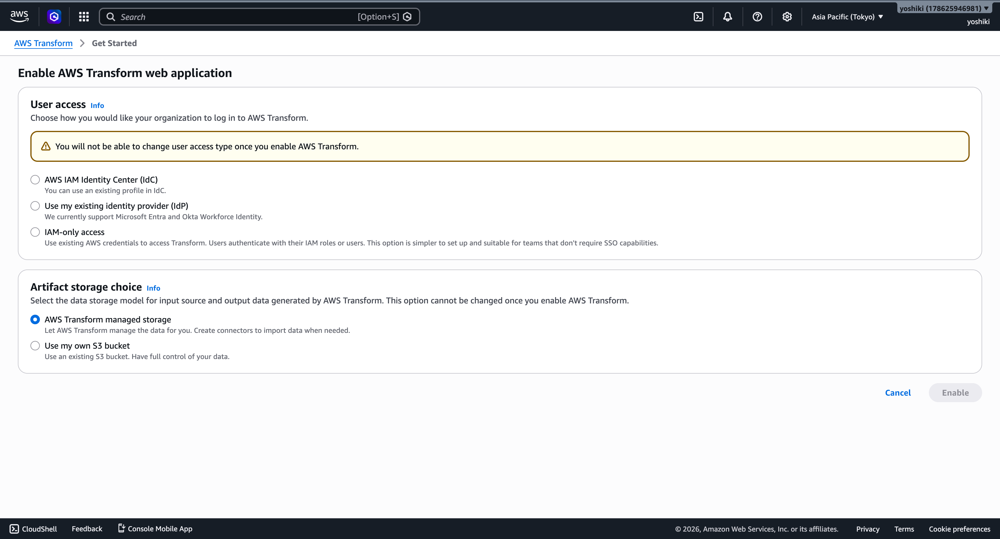

# AWS Transform が FSx for ONTAP を移行先としてサポート（Public Preview）— 確認メモと投稿案

- 対象リリース: AWS Transform now supports Amazon FSx for NetApp ONTAP (Public Preview)
- 公開日: 2026-06-16
- 一次情報: https://aws.amazon.com/jp/about-aws/whats-new/2026/06/aws-transform-vmware-fsx-for-ontap-preview/
- 確認リージョン: ap-northeast-1（東京）
- 到達点: AWS Transform Web アプリケーション有効化画面の直前（ジョブ作成は未実施）

---

## 1. リリース要点（事実確認）

- AWS Transform for migrations（discovery・計画・移行を自動化するエージェント型 AI サービス）に、**ブロックストレージワークロードの移行先として FSx for ONTAP** が追加された（従来の Amazon EBS に加えて選択可能）。
- オンプレ／他クラウド／VMware 環境（ブロックストレージや NFS データストア）など、**ソースを問わず** FSx for ONTAP ボリュームへ移行できる。NetApp ONTAP からの移行に限定されない。
- コンピュート・ネットワークを扱う**同一の移行ウェーブ内**で、ブロックデータを FSx for ONTAP ボリュームへ直接レプリケート。中間ストレージや別建ての移行ツールが不要になり、コストとリスクを削減。
- discovery は RVTools / NetApp DII / Migration Evaluator / MPA エクスポートに対応（製品ページ記載）。

> 区別の明示: 本リリースは **Public Preview**。GA・本番採用の判断材料ではなく、対応リージョン・制約・GA 時期は評価前提として扱う。

---

## 2. 画面に沿った解説

### ホーム画面

- AWS Transform は「Mainframe / VMware / Windows / Custom」の 4 つの transformation paths で構成。
- 今回の FSx for ONTAP 対応の入口は **VMware migration**（Assess, plan, and migrate）。
- 利用開始は「Web application を有効化」または「CLI」の 2 系統。

### Web アプリケーション有効化画面（到達点）

ジョブ作成に進む前提となる有効化画面。**2 つの不可逆な選択**がある。

- User access（ログイン方式・有効化後変更不可）
  - AWS IAM Identity Center (IdC)
  - 既存 IdP（Microsoft Entra / Okta Workforce Identity）
  - IAM-only access（既存 IAM 認証・SSO 不要・検証向き）
- Artifact storage（入出力データ保管・有効化後変更不可）
  - AWS Transform managed storage（デフォルト）
  - 自前の S3 バケット

設計上の留意点（FSxN / ガバナンス視点）:
- artifact storage に「自前の S3 バケット」を選べば、入力ソース／出力データを自社管理下に置ける（データ主権・監査要件のある案件で有利）。
- アクセス方式が不可逆のため、本番導入前に IdP 連携方針を確定してから有効化する。検証だけなら IAM-only が最小構成。

### この先の流れ（一次情報ベース・実機未確認）
- 有効化後、VMware migration ジョブを作成し、discovery → 移行ウェーブ計画と進む中で、**ブロックストレージの移行先として「FSx for ONTAP」を EBS と並んで選択**する。
- discovery 入力は RVTools / NetApp DII / Migration Evaluator / MPA に対応。
- 区別の明示: FSx for ONTAP 宛先選択 UI は本確認では未到達（有効化前で停止）。上記は一次情報に基づく説明であり、実機 UI 確認はジョブ作成まで進めた段階で要検証。

---

## 3. X（社外）投稿案

案 A（日本語・簡潔）
> 【FSx for ONTAP × 移行】
> AWS Transform（エージェント型 AI の移行サービス）が、ブロックストレージの移行先として Amazon FSx for NetApp ONTAP をサポート（Public Preview）。
> VMware 等のブロック/NFS ワークロードを、コンピュート・ネットワークと同じ移行ウェーブで FSxN へ直接移行。中間ストレージや別ツール不要に。
> ONTAP の管理方法を変えずに AWS へ。
> https://aws.amazon.com/jp/about-aws/whats-new/2026/06/aws-transform-vmware-fsx-for-ontap-preview/

案 B（英語）
> AWS Transform for migrations now supports Amazon FSx for NetApp ONTAP as a storage destination (Public Preview).
> Migrate block storage workloads (incl. VMware block/NFS datastores) to FSx for ONTAP within the same migration wave as compute & network — no intermediate storage, no separate tooling. Keep managing data the ONTAP way on AWS.
> #FSxN #NetApp #AWS

---

## 4. 社内向け投稿案

> **AWS Transform が FSx for ONTAP を移行先としてサポート（Public Preview / 2026-06-16）**
>
> 概要
> エージェント型 AI の移行サービス AWS Transform for migrations に、ブロックストレージワークロードの移行先として FSx for ONTAP が追加（従来の EBS に加えて選択可）。discovery → 計画 → 移行を自動化し、コンピュート・ネットワークと同一の移行ウェーブ内でブロックデータを FSxN ボリュームへ直接レプリケート。
>
> FSxN 視点での意義
> - FSxN が VMware/ブロック系ワークロードの移行先（ランディングゾーン）として、AWS ネイティブの移行フローに正式に組み込まれた。
> - 中間ストレージ・別建て移行ツールが不要になり、PoC〜本番移行の手数とコスト・リスクを削減。
> - 「データの管理方法を変えずに AWS へ」という ONTAP の価値（Snapshot/SnapMirror/効率化/FlexClone 等の継続利用）を移行ストーリーに直結できる。
> - discovery が RVTools / NetApp DII / Migration Evaluator / MPA に対応。NetApp DII 連携は提案時の差別化ポイント。
>
> 確認事項・留意点
> - Public Preview のため、対応リージョン・制約・GA 時期は要確認。本番採用判断には未使用。
> - 移行先としての FSxN はブロック（iSCSI）想定。対象プロトコル・LUN/ボリューム構成の前提を案件ごとに確認。
> - コンソール上、FSx for ONTAP 宛先の選択は VMware migration の移行ウェーブ計画フロー内に出現。実機 UI はジョブ作成まで進めて確認予定。
>
> 一次情報
> https://aws.amazon.com/jp/about-aws/whats-new/2026/06/aws-transform-vmware-fsx-for-ontap-preview/

---

## 5. 公開前チェック

- [ ] スクリーンショットのアカウント名・ID・リソース識別子をマスキング
- [ ] 未マスクの画像をコミットしていないこと
- [ ] Public Preview の明記（社外投稿）
- [ ] 一次情報リンクの有効性確認
