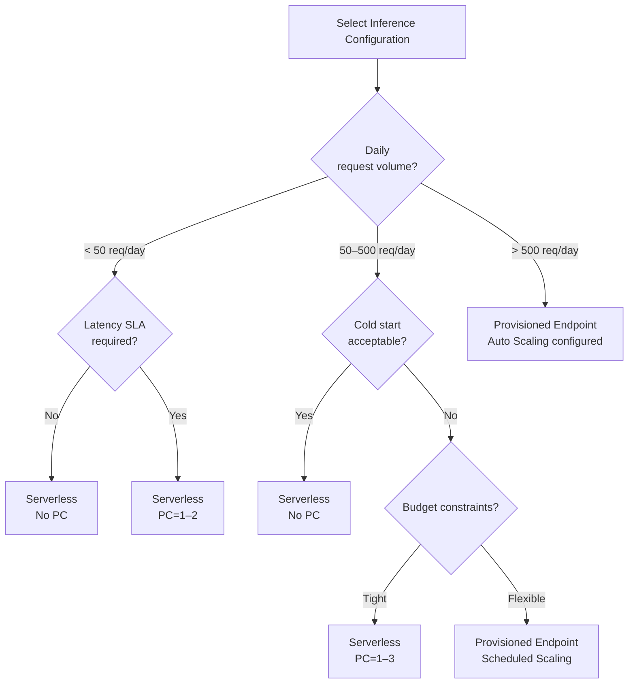

# SageMaker Serverless Inference Cold Start Characteristics Guide

🌐 **Language / 言語**: [日本語](serverless-inference-cold-start.md) | [English](serverless-inference-cold-start-en.md)

## Overview

SageMaker Serverless Inference is an inference option that provides a request-based billing model. Since always-on instances are not required, it is ideal for low-frequency and irregular workloads. However, designs must account for **cold starts** (increased latency on initial requests).

This document explains the cold start characteristics, configuration comparisons, and recommended settings for Serverless Inference in FSx for ONTAP S3 AP Serverless Patterns.

---

## What is Cold Start

### Trigger Conditions

Cold starts occur under the following conditions:

| Trigger | Description |
|---------|-------------|
| Initial request | First request after endpoint creation |
| After idle timeout | When no requests are received for a period (typically 5–15 minutes) |
| Scale-out | New container launch when concurrent requests exceed MaxConcurrency |
| Model update | First request after endpoint configuration change |

### Behavior During Cold Start

1. Container image download
2. Model artifact loading from S3
3. Model initialization (framework-dependent)
4. Health check completion

During this time, SageMaker returns `ModelNotReadyException`.

---

## Latency Characteristics by MemorySizeInMB

### Expected Latency Ranges

| MemorySizeInMB | Cold Start | Warm Request | Recommended Use Case |
|----------------|-----------|--------------|---------------------|
| 1024 | 15–45 sec | 100–500 ms | Lightweight text classification, metadata extraction |
| 2048 | 12–40 sec | 80–400 ms | Medium-scale NLP models, image preprocessing |
| 3072 | 10–35 sec | 70–350 ms | Standard ML model inference |
| 4096 | 8–30 sec | 50–300 ms | Image classification, object detection (recommended default) |
| 5120 | 8–25 sec | 40–250 ms | Large models, multi-model ensembles |
| 6144 | 6–20 sec | 30–200 ms | High-precision models, near-real-time processing |

> **Note**: The above are general guidelines. Actual latency depends on model size, framework, and container image size.

### Factors Affecting Latency

```
Cold Start Latency = Container Startup Time + Model Load Time + Initialization Time

Container Startup Time: Proportional to container image size (~2–10 sec)
Model Load Time: Proportional to model.tar.gz size (~3–20 sec)
Initialization Time: Framework initialization (~1–5 sec)
```

---

## 3-Configuration Comparison

### Comparison Matrix

| Characteristic | Serverless (no PC) | Serverless (with PC) | Provisioned Endpoint |
|---------------|-------------------|---------------------|---------------------|
| **Cold Start** | Yes (6–45 sec) | Mitigated (instant response up to PC count) | None |
| **Minimum Cost** | $0 (when no requests) | Fixed cost for PC | Instance hourly billing |
| **Max Concurrency** | MaxConcurrency (1–200) | MaxConcurrency (1–200) | Depends on Auto Scaling |
| **Scaling Speed** | Slow (cold start) | Instant within PC | Minutes (instance addition) |
| **Billing Model** | Requests + processing time | PC fixed cost + requests | Instance hours |
| **Suitable Workload** | < 50 req/day | 50–500 req/day | > 500 req/day |
| **SLA Support** | Not recommended | Conditionally possible | Recommended |

### Cost Comparison (ap-northeast-1, Monthly Estimate)

| Configuration | 10 req/day | 100 req/day | 1000 req/day |
|--------------|-----------|------------|-------------|
| Serverless (no PC) | ~$1–3 | ~$10–30 | ~$100–300 |
| Serverless (PC=1) | ~$50–80 | ~$60–100 | ~$150–350 |
| Provisioned (ml.m5.large) | ~$215 | ~$215 | ~$215–430 |

> Provisioned Endpoints are always-on, making them expensive for low request volumes.

---

## Decision Flowchart

### Recommended Configuration by Request Volume



### Detailed Decision Criteria

| Condition | Recommended Configuration | Reason |
|-----------|--------------------------|--------|
| Requests < 50/day, no SLA | Serverless (no PC) | Lowest cost, cold start acceptable |
| Requests < 50/day, SLA required | Serverless (PC=1) | Minimal fixed cost to avoid cold start |
| Requests 50–500/day, cost-focused | Serverless (PC=1–3) | Mitigate cold start with PC while controlling costs |
| Requests 50–500/day, latency-focused | Provisioned + Scheduled Scaling | Optimize costs by running only during business hours |
| Requests > 500/day | Provisioned + Auto Scaling | Stable latency and high throughput |

---

## CloudFormation Parameter Recommendations

### Low Volume Workload (< 50 req/day)

```yaml
Parameters:
  InferenceType: "serverless"
  ServerlessMemorySizeInMB: 4096
  ServerlessMaxConcurrency: 5
  ServerlessProvisionedConcurrency: 0
```

**Characteristics**:
- Cold start present (initial 8–30 sec)
- Cost when no requests: $0
- Max concurrent processing: 5 requests

### Medium Volume Workload (50–500 req/day)

```yaml
Parameters:
  InferenceType: "serverless"
  ServerlessMemorySizeInMB: 4096
  ServerlessMaxConcurrency: 10
  ServerlessProvisionedConcurrency: 2
```

**Characteristics**:
- PC=2 eliminates cold start for up to 2 concurrent requests
- Cold start possible from the 3rd concurrent request onward
- Monthly fixed cost: ~$100–160 (for PC)

### High Volume Workload (> 500 req/day)

```yaml
Parameters:
  InferenceType: "provisioned"
  EnableRealtimeEndpoint: "true"
  EnableAutoScaling: "true"
  MinCapacity: 1
  MaxCapacity: 4
  EnableScheduledScaling: "true"
  BusinessHoursStart: 9
  BusinessHoursEnd: 18
```

**Characteristics**:
- No cold start
- Auto Scaling for load-based scaling
- Scheduled Scaling for cost reduction outside business hours

---

## Cold Start Mitigation Patterns (Implementation)

### 1. Retry Strategy (This Project's Implementation)

```python
# Implementation pattern from shared/routing.py + realtime_invoke/handler.py
INITIAL_TIMEOUT = 60  # seconds (accounting for cold start)
RETRY_DELAY = 3       # seconds
MAX_RETRIES = 2       # maximum retry count

# When ModelNotReadyException occurs:
# 1. Wait 3 seconds
# 2. Retry (up to 2 times)
# 3. Total timeout: 60 + (3 × 2) = 66 seconds < 120 seconds (Step Functions task timeout)
```

### 2. Provisioned Concurrency (PC)

Setting PC maintains the specified number of containers in a warm state at all times:

- PC=1: Instant response for up to 1 request
- PC=2: Instant response for up to 2 requests
- Requests exceeding PC: Cold start occurs

### 3. Fallback Strategy

This project adopts a design that falls back to Batch Transform when Serverless Inference cold start times out:

```yaml
# Step Functions definition (conceptual)
ServerlessInferencePath:
  Type: Task
  Catch:
    - ErrorEquals: ["States.TaskFailed", "States.Timeout"]
      Next: BatchTransformFallback
```

---

## Monitoring with EMF Metrics

### Output Metrics

| Metric Name | Description | Unit |
|-------------|-------------|------|
| `ServerlessInvocationLatency` | Serverless inference response time | Milliseconds |
| `ServerlessColdStartLatency` | Latency when cold start is detected | Milliseconds |
| `ServerlessInvocationCount` | Serverless inference invocation count | Count |
| `ColdStartDetected` | Cold start detection flag (latency > 5000ms) | Count |

### Recommended CloudWatch Dashboard Settings

```
- Cold start rate: ColdStartDetected / ServerlessInvocationCount × 100
- P99 latency: P99 statistic of ServerlessInvocationLatency
- Error rate: ModelNotReadyException count / total requests
```

---

## Best Practices

### Do (Recommended)

- ✅ Minimize model artifacts (model.tar.gz)
- ✅ Minimize container image size (multi-stage builds)
- ✅ Set MemorySizeInMB to 2–3× the model size as a guideline
- ✅ Set MaxConcurrency to 1.5× the expected peak concurrent requests
- ✅ Design timeouts assuming cold starts (60 seconds or more)
- ✅ Monitor cold start frequency with EMF metrics

### Don't (Not Recommended)

- ❌ Use Serverless without PC for workloads with strict latency SLAs
- ❌ Set MaxConcurrency to 1 (prevents scaling)
- ❌ Set MemorySizeInMB below the model size
- ❌ Set short timeouts that don't account for cold starts

---

## Related Documents

- [Cost Optimization Best Practices Guide](cost-optimization-guide.md)
- [Inference Cost Comparison Guide](inference-cost-comparison.md)
- [CI/CD Guide](ci-cd-guide.md)
- [Multi-Region Step Functions Design](multi-region/step-functions-design.md)

---

## Known Limitations

### Container Image Size and 180-Second Timeout

SageMaker Serverless Inference has a **180-second cold start timeout limit**. If container image download + model loading + initialization does not complete within this time, the endpoint will fail to reach `InService` status.

#### Validation Results: sklearn Official Container

| Item | Value |
|------|-------|
| Container | `sagemaker-scikit-learn:1.2-1-cpu-py3` |
| Image size | ~1.5 GB |
| MemorySizeInMB | 6144 (maximum) |
| Result | ❌ Exceeded 180-second timeout |

The sklearn official container has many dependencies, resulting in an image size of ~1.5GB, which cannot complete cold start within the Serverless Inference 180-second limit.

#### Recommendations

| Mitigation | Description |
|-----------|-------------|
| **Lightweight custom container** | Use a custom container with image size < 500MB. Include only minimum required dependencies |
| **Multi-stage build** | Use Docker multi-stage builds to exclude unnecessary build dependencies |
| **Provisioned Concurrency** | Set PC to completely avoid cold starts (incurs fixed costs) |
| **Provisioned Endpoint** | Use Provisioned Endpoint instead of Serverless when large containers are required |

#### Container Size Guidelines

| Size | Startup within 180 sec | Recommended Use |
|------|----------------------|-----------------|
| < 200 MB | ✅ Reliable | Lightweight inference (ONNX, TFLite) |
| 200–500 MB | ✅ Almost certain | Standard ML models |
| 500 MB–1 GB | ⚠️ Conditional | Depends on model size and network conditions |
| > 1 GB | ❌ High risk | Not recommended for Serverless Inference |

> **Conclusion**: When using Serverless Inference, target container images **under 500MB** and avoid heavyweight framework containers such as sklearn.

---

*This document is part of FSx for ONTAP S3 AP Serverless Patterns Phase 5.*
