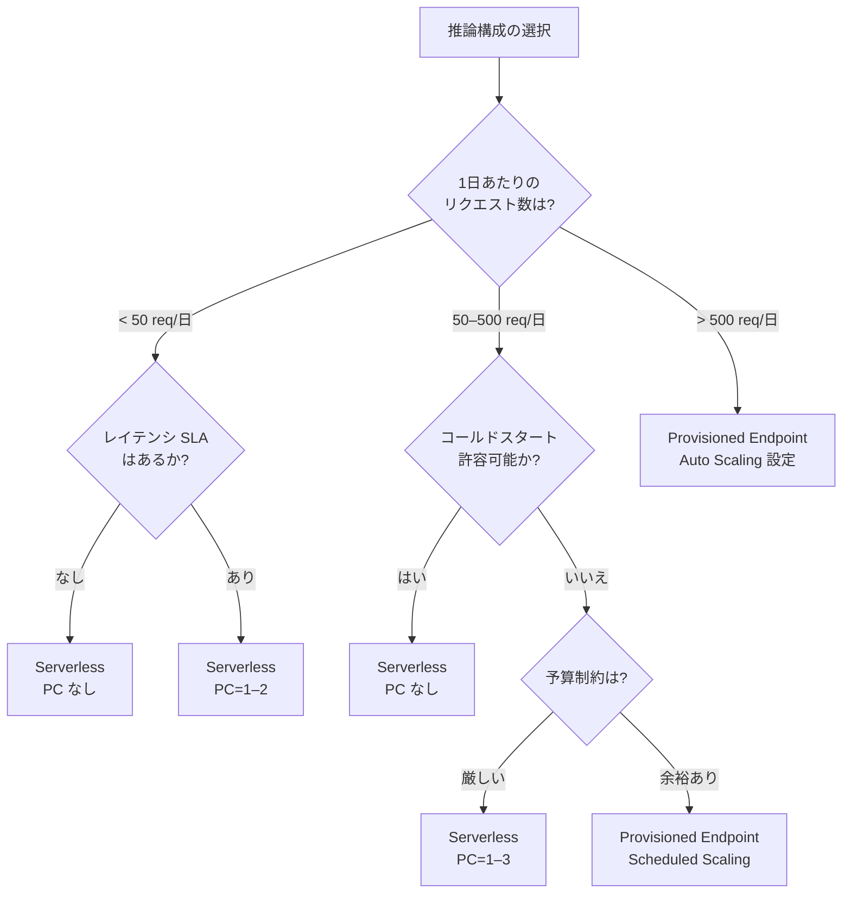

# SageMaker Serverless Inference コールドスタート特性ガイド

🌐 **Language / 言語**: [日本語](serverless-inference-cold-start.md) | [English](serverless-inference-cold-start-en.md)

## 概要

SageMaker Serverless Inference は、リクエストベースの課金モデルを提供する推論オプションです。常時稼働のインスタンスが不要なため、低頻度・不定期なワークロードに最適ですが、**コールドスタート**（初回リクエスト時のレイテンシ増加）を考慮した設計が必要です。

本ドキュメントでは、FSxN S3AP Serverless Patterns における Serverless Inference のコールドスタート特性、構成比較、および推奨設定を解説します。

---

## コールドスタートとは

### トリガー条件

コールドスタートは以下の条件で発生します:

| トリガー | 説明 |
|---------|------|
| 初回リクエスト | エンドポイント作成後の最初のリクエスト |
| アイドルタイムアウト後 | 一定時間（通常 5–15 分）リクエストがない場合 |
| スケールアウト | 同時リクエスト数が MaxConcurrency を超えた場合の新規コンテナ起動 |
| モデル更新 | エンドポイント設定変更後の最初のリクエスト |

### コールドスタート中の動作

1. コンテナイメージのダウンロード
2. モデルアーティファクトの S3 からのロード
3. モデルの初期化（フレームワーク依存）
4. ヘルスチェック完了

この間、SageMaker は `ModelNotReadyException` を返します。

---

## MemorySizeInMB 別レイテンシ特性

### 期待レイテンシ範囲

| MemorySizeInMB | コールドスタート | ウォームリクエスト | 推奨ユースケース |
|----------------|----------------|------------------|----------------|
| 1024 | 15–45 秒 | 100–500 ms | 軽量テキスト分類、メタデータ抽出 |
| 2048 | 12–40 秒 | 80–400 ms | 中規模 NLP モデル、画像前処理 |
| 3072 | 10–35 秒 | 70–350 ms | 標準的な ML モデル推論 |
| 4096 | 8–30 秒 | 50–300 ms | 画像分類、物体検出（推奨デフォルト） |
| 5120 | 8–25 秒 | 40–250 ms | 大規模モデル、複数モデルアンサンブル |
| 6144 | 6–20 秒 | 30–200 ms | 高精度モデル、リアルタイム要件に近い処理 |

> **注意**: 上記は一般的な目安です。実際のレイテンシはモデルサイズ、フレームワーク、コンテナイメージサイズに依存します。

### レイテンシに影響する要因

```
コールドスタートレイテンシ = コンテナ起動時間 + モデルロード時間 + 初期化時間

コンテナ起動時間: コンテナイメージサイズに比例（~2–10 秒）
モデルロード時間: model.tar.gz サイズに比例（~3–20 秒）
初期化時間: フレームワーク初期化（~1–5 秒）
```

---

## 3 構成比較

### 比較マトリクス

| 特性 | Serverless (PC なし) | Serverless (PC あり) | Provisioned Endpoint |
|------|---------------------|---------------------|---------------------|
| **コールドスタート** | あり（6–45 秒） | 軽減（PC 数まで即応答） | なし |
| **最小コスト** | $0（リクエストなし時） | PC 分の固定費 | インスタンス時間課金 |
| **最大同時実行** | MaxConcurrency (1–200) | MaxConcurrency (1–200) | Auto Scaling 依存 |
| **スケーリング速度** | 遅い（コールドスタート） | PC 内は即座 | 数分（インスタンス追加） |
| **課金モデル** | リクエスト数 + 処理時間 | PC 固定費 + リクエスト | インスタンス時間 |
| **適合ワークロード** | < 50 req/日 | 50–500 req/日 | > 500 req/日 |
| **SLA 対応** | 非推奨 | 条件付き可 | 推奨 |

### コスト比較（ap-northeast-1、月額概算）

| 構成 | 10 req/日 | 100 req/日 | 1000 req/日 |
|------|----------|-----------|------------|
| Serverless (PC なし) | ~$1–3 | ~$10–30 | ~$100–300 |
| Serverless (PC=1) | ~$50–80 | ~$60–100 | ~$150–350 |
| Provisioned (ml.m5.large) | ~$215 | ~$215 | ~$215–430 |

> Provisioned Endpoint は常時稼働のため、低リクエスト量では割高になります。

---

## 決定フローチャート

### リクエスト量別推奨構成



### 判断基準の詳細

| 条件 | 推奨構成 | 理由 |
|------|---------|------|
| リクエスト < 50/日、SLA なし | Serverless (PC なし) | 最低コスト、コールドスタート許容 |
| リクエスト < 50/日、SLA あり | Serverless (PC=1) | 最小限の固定費でコールドスタート回避 |
| リクエスト 50–500/日、コスト重視 | Serverless (PC=1–3) | PC でコールドスタート軽減しつつコスト抑制 |
| リクエスト 50–500/日、レイテンシ重視 | Provisioned + Scheduled Scaling | 営業時間のみ稼働でコスト最適化 |
| リクエスト > 500/日 | Provisioned + Auto Scaling | 安定したレイテンシと高スループット |

---

## CloudFormation パラメータ推奨

### 低ボリュームワークロード（< 50 req/日）

```yaml
Parameters:
  InferenceType: "serverless"
  ServerlessMemorySizeInMB: 4096
  ServerlessMaxConcurrency: 5
  ServerlessProvisionedConcurrency: 0
```

**特徴**:
- コールドスタートあり（初回 8–30 秒）
- リクエストなし時のコスト: $0
- 最大同時処理: 5 リクエスト

### 中ボリュームワークロード（50–500 req/日）

```yaml
Parameters:
  InferenceType: "serverless"
  ServerlessMemorySizeInMB: 4096
  ServerlessMaxConcurrency: 10
  ServerlessProvisionedConcurrency: 2
```

**特徴**:
- PC=2 により 2 リクエストまでコールドスタートなし
- 3 リクエスト目以降はコールドスタートの可能性
- 月額固定費: ~$100–160（PC 分）

### 高ボリュームワークロード（> 500 req/日）

```yaml
Parameters:
  InferenceType: "provisioned"
  EnableRealtimeEndpoint: "true"
  EnableAutoScaling: "true"
  MinCapacity: 1
  MaxCapacity: 4
  EnableScheduledScaling: "true"
  BusinessHoursStart: 9
  BusinessHoursEnd: 18
```

**特徴**:
- コールドスタートなし
- Auto Scaling で負荷に応じたスケーリング
- Scheduled Scaling で営業時間外のコスト削減

---

## コールドスタート対策（実装パターン）

### 1. リトライ戦略（本プロジェクトの実装）

```python
# shared/routing.py + realtime_invoke/handler.py の実装パターン
INITIAL_TIMEOUT = 60  # 秒（コールドスタート考慮）
RETRY_DELAY = 3       # 秒
MAX_RETRIES = 2       # 最大リトライ回数

# ModelNotReadyException 発生時:
# 1. 3 秒待機
# 2. リトライ（最大 2 回）
# 3. 合計タイムアウト: 60 + (3 × 2) = 66 秒 < 120 秒（Step Functions タスクタイムアウト）
```

### 2. Provisioned Concurrency（PC）

PC を設定すると、指定数のコンテナが常時ウォーム状態で維持されます:

- PC=1: 1 リクエストまで即応答
- PC=2: 2 リクエストまで即応答
- PC 超過分: コールドスタート発生

### 3. フォールバック戦略

本プロジェクトでは、Serverless Inference のコールドスタートタイムアウト時に Batch Transform へフォールバックする設計を採用:

```yaml
# Step Functions 定義（概念）
ServerlessInferencePath:
  Type: Task
  Catch:
    - ErrorEquals: ["States.TaskFailed", "States.Timeout"]
      Next: BatchTransformFallback
```

---

## EMF メトリクスによるモニタリング

### 出力メトリクス

| メトリクス名 | 説明 | 単位 |
|-------------|------|------|
| `ServerlessInvocationLatency` | Serverless 推論の応答時間 | Milliseconds |
| `ServerlessColdStartLatency` | コールドスタート検出時のレイテンシ | Milliseconds |
| `ServerlessInvocationCount` | Serverless 推論の呼び出し回数 | Count |
| `ColdStartDetected` | コールドスタート検出フラグ（レイテンシ > 5000ms） | Count |

### CloudWatch ダッシュボード推奨設定

```
- コールドスタート率: ColdStartDetected / ServerlessInvocationCount × 100
- P99 レイテンシ: ServerlessInvocationLatency の P99 統計
- エラー率: ModelNotReadyException 発生回数 / 総リクエスト数
```

---

## ベストプラクティス

### Do（推奨）

- ✅ モデルアーティファクト（model.tar.gz）を最小化する
- ✅ コンテナイメージサイズを最小化する（マルチステージビルド）
- ✅ MemorySizeInMB はモデルサイズの 2–3 倍を目安に設定
- ✅ MaxConcurrency は想定ピーク同時リクエスト数の 1.5 倍に設定
- ✅ コールドスタートを前提としたタイムアウト設計（60 秒以上）
- ✅ EMF メトリクスでコールドスタート頻度を監視

### Don't（非推奨）

- ❌ レイテンシ SLA が厳しいワークロードに PC なし Serverless を使用
- ❌ MaxConcurrency を 1 に設定（スケーリング不可）
- ❌ MemorySizeInMB をモデルサイズ未満に設定
- ❌ コールドスタートを考慮しない短いタイムアウト設定

---

## 関連ドキュメント

- [コスト最適化ベストプラクティスガイド](cost-optimization-guide.md)
- [推論コスト比較ガイド](inference-cost-comparison.md)
- [CI/CD ガイド](ci-cd-guide.md)
- [Multi-Region Step Functions 設計](multi-region/step-functions-design.md)

---

## 既知の制限事項（Known Limitations）

### コンテナイメージサイズと 180 秒タイムアウト

SageMaker Serverless Inference には **180 秒のコールドスタートタイムアウト制限** があります。コンテナイメージのダウンロード + モデルロード + 初期化がこの時間内に完了しない場合、エンドポイントは `InService` にならず失敗します。

#### 検証結果: sklearn 公式コンテナ

| 項目 | 値 |
|------|-----|
| コンテナ | `sagemaker-scikit-learn:1.2-1-cpu-py3` |
| イメージサイズ | ~1.5 GB |
| MemorySizeInMB | 6144（最大） |
| 結果 | ❌ 180 秒タイムアウト超過 |

sklearn 公式コンテナは依存ライブラリが多く、イメージサイズが ~1.5GB に達するため、Serverless Inference の 180 秒制限内にコールドスタートを完了できません。

#### 推奨事項

| 対策 | 説明 |
|------|------|
| **軽量カスタムコンテナ** | イメージサイズ < 500MB のカスタムコンテナを使用する。必要最小限の依存のみ含める |
| **マルチステージビルド** | Docker マルチステージビルドで不要なビルド依存を除外する |
| **Provisioned Concurrency** | コールドスタートを完全に回避する場合は PC を設定する（固定費発生） |
| **Provisioned Endpoint** | 大規模コンテナが必要な場合は Serverless ではなく Provisioned Endpoint を使用する |

#### コンテナサイズ目安

| サイズ | 180 秒以内の起動 | 推奨用途 |
|--------|-----------------|---------|
| < 200 MB | ✅ 確実 | 軽量推論（ONNX, TFLite） |
| 200–500 MB | ✅ ほぼ確実 | 標準的な ML モデル |
| 500 MB–1 GB | ⚠️ 条件付き | モデルサイズ・ネットワーク状況に依存 |
| > 1 GB | ❌ 高リスク | Serverless Inference 非推奨 |

> **結論**: Serverless Inference を使用する場合、コンテナイメージは **500MB 以下** を目標とし、sklearn 等の重量級フレームワークコンテナは避けること。

---

*本ドキュメントは FSxN S3AP Serverless Patterns Phase 5 の一部です。*
